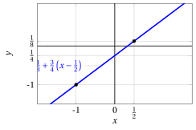
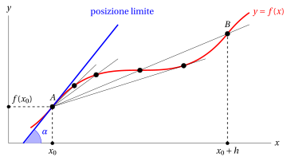
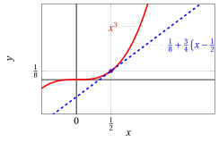
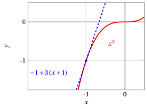
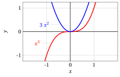

# Funzione derivata

**Parte 4 · Derivate · Capitolo 1** · dalle dispense di Fabio Furini · [:material-file-pdf-box: PDF del capitolo](../pdf/derivate-01-funzione-derivata.pdf)

## 1. Retta passante per due punti

- A partire da due punti

    $$
    (x_1,y_1) {\rm ~~e ~~} (x_2,y_2)
    $$

    è possibile calcolare la funzione

    $$
    y = m \: x + q
    $$

    il cui grafico corrisponde alla retta passante per i due punti (equazione della retta in forma esplicita).  Il <strong>coefficiente angolare</strong>  o <strong>pendenza</strong> della retta è il valore $m$ e l'<strong>ordinata all'origine</strong> della retta è il valore $q$.

- Imponendo il passaggio per i due punti abbiamo:

    $$
    \begin{cases}
    y_1 = m \: x_1 + q \\[1ex]
    y_2 = m \: x_2 + q 
    \end{cases}
    $$

    e possiamo determinare $m$ e $q$ come segue (due equazioni in due incognite):

    $$
    \begin{cases}
    q =    y_1 - m \: x_1\\[1ex]
    q =    y_2 - m \: x_2 
    \end{cases}
    \qquad
    \begin{cases}
    q = y_1 - m \: x_1\\[1ex]
    y_1 - m \: x_1 = y_2 - m \: x_2  {\rm ~~~che~diventa~~~} m \: x_2 - m \: x_1 = y_2 - y_1 
    \end{cases}
    $$

    $$
    \begin{cases}
    q =    y_1 - m \: x_1\\[1ex]
    m =   \frac{y_2 -y_1}{x_2 - x_1}
    \end{cases}
    \qquad
    \begin{cases}
    q =    y_1 - \frac{y_2 -y_1}{x_2 - x_1} \: x_1\\[1ex]
    m =   \frac{y_2 -y_1}{x_2 - x_1}
    \end{cases}
    $$

    E otteniamo la retta:

    $$
    y = \underbrace{\frac{y_2 -y_1}{x_2 - x_1}}_{m} \: x + \underbrace{y_1 - \frac{y_2 -y_1}{x_2 - x_1} \: x_1}_{q} {\rm ~~~~~chiaramente~~~~~} \frac{y_2 -y_1}{x_2 - x_1} = \frac{y_1 -y_2}{x_1 - x_2}
    $$

!!! chiave ""

    La retta passante per due punti $(x_1,y_1)$ e $(x_2,y_2)$:

    $$
    y = \underbrace{\frac{y_2 -y_1}{x_2 - x_1}}_{m} \: x + y_1 - \underbrace{\frac{y_2 -y_1}{x_2 - x_1}}_{m} \: x_1 {\rm ~~si~può~riscrivere~come~~} y = m \: x + y_1 - m \: x_1.
    $$

    Quindi la retta può essere scritta soltanto in funzione del coefficiente angolare $m$ e del punto $(x_1,y_1)$ come segue:

    $$
    y = y_1 + m \;(x-x_1) {\rm ~~~~con~~~~} m= \frac{y_1 - y_2}{x_1-x_2}
    $$

    Lo stesso vale per un qualsiasi punto $(\tilde{x},\tilde{y})$ della retta, in questo caso avremmo:

    $$
    y = \tilde{y} + m (x-\tilde{x})
    $$

!!! esempio "Esempio 1: Retta passante per due punti"

    Calcoliamo la retta passante per i punti: $(x_1,y_1)=(-1, -1)$ e  $(x_2,y_2)=\left(\frac{1}{2},\frac{1}{8}\right)$. Calcoliamo la pendenza:

    $$
    m = \frac{y_2 -y_1}{x_2 - x_1} = \frac{\frac{1}{8}+1}{\frac{1}{2}+1}=\frac{3}{4}
    $$

    Utilizzando il punto $(x_2,y_2)=\left(\frac{1}{2},\frac{1}{8}\right)$  otteniamo:

    $$
    y = \frac{1}{8} + \frac{3}{4} \left(x -\frac{1}{2}\right) = \frac{3}{4} \; x - \frac{1}{4}
    $$

    { .fig .ovale loading=lazy style="width:70%" }

    Utilizzando ora il punto $(x_1,y_1)=\left(-1,-1\right)$  otteniamo la  medesima retta:

    $$
    y = -1 + \frac{3}{4} \left(x +1\right) = \frac{3}{4} \; x - \frac{1}{4}
    $$

## 2. Retta tangente

!!! chiave ""

    Che cos'è la retta <strong>tangente</strong> in un punto al grafico di una funzione?

- La definizione intuitiva di una retta tangente al grafico è quella di una retta che “tocca” il grafico senza “tagliarlo” o “secarlo” (immaginando la curva come se fosse un oggetto fisico non penetrabile)

- Questa definizione intuitiva funziona ad esempio per parabole o le iperboli. Però, prendiamo ad esempio la funzione $f(x)=x^3$

    $$
    {\rm il~grafico~~} y = x^3 {\rm ~~~~e~la~retta~~~~}  y= \frac{1}{8} + \frac{3}{4} \left(x -\frac{1}{2}\right)
    $$

    { .fig .ovale loading=lazy style="width:70%" }

    la definizione intuitiva funziona nel punto $\left(\frac{1}{2},\frac{1}{8}\right)$, ma la retta interseca il grafico della funzione anche nel punto $(-1,-1)$.

- Viceversa ci sono funzioni, come $f(x)=|x|$, che ha come grafico

    $$
    y = |x|
    $$

    { .fig .ovale loading=lazy style="width:70%" }

    Questo grafico ha un punto (l'origine) in cui ci sono infinite rette soddisfacenti la definizione intuitiva, ma chiaramente nessuna di esse si può chiamare tangente.

!!! chiave ""

    Geometricamente, la retta tangente può essere approssimata dalla <strong>retta che passa per due punti</strong> molto vicini posti sulla curva, il primo <strong>fissato</strong> (il punto di tangenza) e l'altro “<strong>mobile</strong>” (e scelto via via più vicino al punto di tangenza).

- Due punti individuano una retta, più i due punti si avvicinano, più questa retta si avvicinerà alla tangente. Si tratta quindi di capire cosa accade della retta per i due punti quando il secondo punto, mobile, si avvicina sempre più al primo, senza però coincidere con esso. La “<strong>retta limite</strong>” - se esiste - si chiamerà retta <strong>tangente</strong>.

!!! chiave ""

    Un ulteriore modo di vedere il concetto di tangenza è pensare la tangente (in un punto  a una curva) come la retta che <strong>approssima meglio</strong> la curva in un intorno del punto.

### 2.1 Utilizzo pratico della retta tangente

!!! chiave ""

    Il calcolo della tangente è importante per determinare i punti in cui il grafico di una funzione ha <strong>tangente orizzontale</strong> (punti di massimo e di minimo locali o globali, ed eventualmente anche in altri punti).

- È quindi utile saper scrivere analiticamente l'equazione della retta tangente alla curva in un punto generico per vedere poi in quali punti essa è orizzontale. Questa idea si deve per primo a Fermat, che la elaborò intorno al 1630.

!!! esempio "Esempio 2: Grafico di funzione – punto a tangente orizzontale"

    Consideriamo la funzione:

    $$
    f(x) = \frac{3}{10} \: (x-3)^2 - 2
    $$

    { .fig .ovale loading=lazy style="width:70%" }

    La funzione ha un punto a tangenza orizzontale che è punto di minimo globale.

!!! esempio "Esempio 3: Grafico di funzione – punti a tangente orizzontale"

    Consideriamo la funzione (definita a tratti):

    $$
    f(x) = 
    \begin{cases}
    - \frac{1}{2} \: x^2 + 1 & x \le  0\\[1ex]
    \cos x & 0 < x \le \pi\\[1ex]
    \frac{1}{2} \: (x-\pi)^2 - 1 &  x > \pi
    \end{cases}
    $$

    { .fig .ovale loading=lazy style="width:70%" }

    La funzione ha due punti a tangenza orizzontale che sono punti di minimo e massimo locali ad  esempio nell'intervallo $\left[-\frac{1}{2}\;\pi,\pi\right]$.

    Consideriamo ora la funzione:

    $$
    f(x) = \frac{1}{10} \: (x-2)^3 - 2
    $$

    { .fig .ovale loading=lazy style="width:70%" }

    La funzione ha un punto a tangenza orizzontale ma che non è né di massimo né di minimo.

<strong>Prova tu</strong> — il grafico interattivo qui sotto ti fa vedere quello che hai appena letto: muovi i cursori.

## 3. Derivata di una funzione in un punto e funzione derivata

- Il <strong>calcolo differenziale</strong> è lo studio della nozione di derivata, che è parte del calcolo infinitesimale.

### 3.1 Derivata e retta tangente

!!! chiave ""

    Cerchiamo l'<strong>equazione della retta tangente</strong> al grafico della funzione in un <strong>generico punto</strong> $A$ del suo grafico.

- Consideriamo  il grafico di una generica funzione $y = f(x)$,  le coordinate dei punti $A$ e $B$ in figura sono rispettivamente:

    $$
    \big(x_0, f(x_0)\big) {\rm ~~~~e~~~~} \big(x_0 + h, f(x_0 + h)\big)
    $$

{ .fig .ovale loading=lazy style="width:80%" }

- Il <strong>coefficiente angolare o pendenza</strong> della retta passante per il punto $A$ e il punto $B$ è:

    $$
    \frac{f(x_0 + h) - f(x_0)}{h}
    $$

    Si noti che una pendenza positiva indica (in media) innalzamento, mentre una negativa indica abbassamento (in media).

    !!! chiave ""

        Questo rapporto prende il nome di <strong>rapporto incrementale</strong> della funzione $f$ relativo all'intervallo $[x_0, x_0 + h]$.

- Geometricamente, essendo il triangolo $ABC$ rettangolo, si ha che:

    $$
    \frac{f(x_0 + h) - f(x_0)}{h} ~=~ \tan \omega \quad ({\rm \textbf{coefficiente~angolare}~della~retta~~passante~per~} A {\rm ~e~} B)
    $$

- Consideriamo il rapporto incrementale e passiamo al limite (supponendo che esista) per $h \rr 0$. Geometricamente abbiamo:

    1. il punto $A$, di coordinate $\big(x_0, f (x_0)\big)$, rimane fisso

    2. mentre il punto $B$, di coordinate $\big(x_0 + h, f (x_0 + h)\big)$, si muove verso $A$ (mantenendosi sul grafico di $f$).

{ .fig .ovale loading=lazy style="width:80%" }

- Spostando $B$ verso $A$ sul grafico della funzione, la retta $AB$ varia la sua pendenza assestandosi su una <strong>posizione limite</strong>.

!!! chiave ""

    1. la <strong>retta limite</strong> prende il nome di <strong>retta tangente al grafico</strong> della funzione $f$ nel punto di ascissa $x_0$;

    2. la sua <strong>pendenza</strong> (o coefficiente angolare) è data da $\tan \alpha$ e prende il nome di <strong>derivata prima</strong> della funzione $f$ nel punto $x_0$.

    3. L'angolo $\alpha$ è quello  tra la retta tangente e l'asse delle ascisse.

!!! definizione "Definizione 1: di derivata"

    Sia $f: (a, b) \rr \R$,  $f$ si dice derivabile in $x_0  \in (a, b)$ se esiste finito

    $$
    \lim_{h \rr 0} \frac{f(x_0 + h) - f(x_0)}{h} = \lim_{x \rr x_0} \frac{f(x) - f(x_0)}{x - x_0}
    $$

    tale limite prende il nome di derivata prima (o semplicemente derivata) di $f$ in $x_0$.

!!! chiave ""

    Con $h=x-x_0$, abbiamo $h \rr 0 \Leftrightarrow x-x_0 \rr 0 \Leftrightarrow  x \rr x_0$ e $x=x_0 + h$  quindi:

    $$
    \lim_{h \rr 0} \frac{f(x_0 + h) - f(x_0)}{h} = \lim_{x \rr x_0} \frac{f(x) - f(x_0)}{x - x_0}
    $$

- Per indicare la derivata  si usano i seguenti simboli:

    $$
    \underbrace{f'(x_0)}_{{\rm \textbf{notazione~di~Lagrange}}}  \qquad 
    \underbrace{\dot{f}(x_0)}_{{\rm notazione~di~Newton}} \qquad 
    \underbrace{\frac{df}{dx}\bigg\vert _{x=x_0} {\rm~~~~e~~~~~~} \frac{dy}{dx}\bigg\vert _{x=x_0}}_{{\rm notazione~di~Leibniz}}
    $$

!!! definizione "Definizione 2: retta tangente 
"

    Data una funzione $f: (a, b) \rr \R$ e  $f$ derivabile in $x_0 \in (a, b)$, la retta di equazione:

    $$
    y = f(x_0) + f'(x_0) \: (x - x_0)
    $$

    si chiama <strong>retta tangente</strong> al grafico di una funzione $f$ nel punto $\big( x_0 , f ( x_0 )\big)$.

!!! esempio "Esempio 4: Retta tangente"

    Calcoliamo l'equazione della retta tangente al grafico della funzione $f(x) = x^3$ nel punto di ascissa $x_0 = \frac{1}{2}$. La derivata nel punto $x_0 = \frac{1}{2}$ è:

    \begin{align*}
    \lim_{h \rr 0} \frac{f(x_0 + h) - f(x_0)}{h} &= \lim_{h \rr 0} \frac{\left(\frac{1}{2} + h\right)^3 - \left(\frac{1}{2}\right)^3 }{h} = \lim_{h \rr 0} \frac{\frac{1}{8} + \frac{3}{4} \;h + \frac{3}{2} \; h^2+ h^3 -  \frac{1}{8} }{h} = \lim_{h \rr 0} \left( \frac{3}{4} + \frac{3}{2} \; h+ h^2 \right) =  \frac{3}{4}
    \end{align*}

    Abbiamo  $f\left(\frac{1}{2}\right)=\frac{1}{8},~~f'\left(\frac{1}{2}\right)=\frac{3}{4}$ e la retta tangente nel punto $\left(\frac{1}{2},\frac{1}{8} \right)$ è:

    $$
    y = f(x_0) + f'(x_0) \: (x - x_0) = \frac{1}{8} + \frac{3}{4} \left(x -\frac{1}{2}\right)
    $$

    { .fig .ovale loading=lazy style="width:56%" }

!!! esempio "Esempio 5: Retta tangente"

    Calcoliamo l'equazione della retta tangente al grafico della funzione $f(x) = x^3$ nel punto di ascissa $x_0 = -1$. La derivata nel punto $x_0 = -1$ è:

    \begin{align*}
    \lim_{h \rr 0} \frac{f(x_0 + h) - f(x_0)}{h} &= \lim_{h \rr 0} \frac{\left(-1 + h\right)^3 - \left(-1\right)^3 }{h} = \lim_{h \rr 0} \frac{-1 + 3 \;h - 3\; h^2+ h^3 +  1 }{h} \\[2ex]
    &= \lim_{h \rr 0} \left( 3 - 3 \; h+ h^2 \right) =  3
    \end{align*}

    Abbiamo $f\left(-1\right)=-1,~~f'\left(-1\right)=3$ e la retta tangente nel punto $\left(-1,-1 \right)$ è:

    $$
    y = f(x_0) + f'(x_0) \: (x - x_0) = -1 + 3 \left(x +1\right)
    $$

    { .fig .ovale loading=lazy style="width:56%" }

- Possiamo ora definire una  funzione che ad ogni  $x$ associ la derivata di una funzione $f$  nel punto $x$ (ovviamente se $f$ è derivabile).

!!! definizione "Definizione 3: di funzione derivata"

    Se una funzione $f$ è derivabile in ogni punto di un intervallo $(a, b)$, la funzione:

    $$
    f': (a,b) \rr \R, ~~~ f': x \mapsto f'(x)
    $$

    si chiama <strong>funzione derivata</strong> di $f$.

- Per indicare la funzione derivata prima si usano le seguenti notazioni:

    $$
    \underbrace{f'(x)}_{{\rm \textbf{notazione~di~Lagrange}}}  \qquad 
    \underbrace{\dot{f}(x)}_{{\rm notazione~di~Newton}} \qquad 
    \underbrace{ \frac{df}{dx} {\rm~~~~,~~~~~~} \frac{df(x)}{dx}  {\rm~~~~e~~~~~~} \frac{dy}{dx}}_{{\rm notazione~di~Leibniz}}
    $$

!!! esempio "Esempio 6: funzione derivata"

    Calcoliamo la funzione derivata della funzione $f(x) = x^3$. Per ogni $x \in \R$ abbiamo:

    \begin{align*}
    \lim_{h \rr 0} \frac{f(x + h) - f(x)}{h} &= \lim_{h \rr 0} \frac{\left(x + h\right)^3 - \left(x \right)^3 }{h} = \lim_{h \rr 0} \frac{x^3 + 3\; x^2\;h + 3\;x\; h^2+ h^3 -  x^3 }{h} \\[2ex]
    &= \lim_{h \rr 0} \left( 3\;x^2 + 3 \; x\; h+ h^2 \right) =  3\;x^2 {\rm ~~~~~quindi~~~~} f'(x) = 3\;x^2
    \end{align*}

    { .fig .ovale loading=lazy style="width:49%" }

    Calcoliamo la funzione derivata della funzione $f(x) = |x|$. Con $x \neq 0$, abbiamo:

    $$
    f(x)=
    \begin{cases}
    x & {\rm ~~se~~} x > 0 {\rm ~~~e~~~~} \displaystyle \lim_{h \rr 0} \frac{f(x + h) - f(x)}{h} = \lim_{h \rr 0} \frac{x + h - x }{h} =  1 {\rm ~~~quindi~~~~} f'(x)=1\\[4ex]
    -x & {\rm ~~se~~} x < 0 {\rm ~~~e~~~~} \displaystyle \lim_{h \rr 0} \frac{f(x + h) - f(x)}{h} = \lim_{h \rr 0} \frac{-(x + h) + x }{h} =  -1 {\rm ~~~quindi~~~~} f'(x)=-1
    \end{cases}
    $$

    Per $x = 0$ abbiamo:

    $$
    \frac{f(x + h) - f(x)}{h} =\frac{f(h) - f(0)}{h} = \frac{|h|}{h} {\rm ~~~~quindi~~~~}
    \lim_{h \rr 0^+}\frac{|h|}{h} = \lim_{h \rr 0^+} \frac{h}{h} = 1,~~ \lim_{h \rr 0^-} \frac{|h|}{h} = \lim_{h \rr 0^-} \frac{-h}{h} = -1
    $$

    dato che se $h \rr 0^+$ allora $|h| = h$ e $h \rr 0^-$ allora $|h| = -h$.  Si conclude che, non esistendo il limite del rapporto incrementale, $f$ non è derivabile in $x =0$. La funzione è continua nell'origine ma la tangente non è ben definita.

    { .fig .ovale loading=lazy style="width:49%" }

### 3.2 Continuità e derivabilità

!!! teorema "Teorema 1"

    Data una funzione $f:[a,b] \rr \R$,  se $f$ è derivabile in un punto $x_0 \in (a,b)$ allora è continua in $x_0$.

??? dimostrazione "Dimostrazione"

    La funzione è derivabile in $x_0 \in (a,b)$,  quindi scriviamo:

    $$
    f(x_0+h) - f(x_0) = \frac{f(x_0+h) - f(x_0)}{h} \cdot h \thicksim f'(x_0) \cdot h {\rm ~~per~~} h \rr 0
    $$

    Inoltre abbiamo

    $$
    f'(x_0) \cdot h \rr 0 {\rm ~~per~~} h \rr 0
    $$

    Perciò

    $$
    \lim_{h \rr 0} \big(f(x_0+h) - f(x_0)\big) = 0 {\rm ~~~~quindi~~~~~} \lim_{h \rr 0} f(x_0+h)  =  f(x_0)
    $$

    Ponendo $x_0+h=x$ abbiamo $h \rr 0$ se e solo se $x \rr x_0$ e di conseguenza abbiamo:

    $$
    \lim_{x \rr x_0} f(x)  =  f(x_0)
    $$

    
□

- Una possibile dimostrazione alternativa ma equivalente è la seguente:

??? dimostrazione "Dimostrazione"

    La funzione è derivabile in $x_0 \in (a,b)$,  quindi scriviamo:

    \begin{align*}
    \lim_{h \rr 0}f(x_0+h)  &=  \lim_{h \rr 0}f(x_0+h) -f(x_0) + f(x_0)\\[2ex]
     &= \lim_{h \rr 0} \underbrace{\underbrace{\frac{f(x_0+h) - f(x_0)}{h}}_{\rr f'(x_0)} \cdot h}_{\rr 0} + f(x_0) = f(x_0)
    \end{align*}

    Ponendo $x_0+h=x$ abbiamo $h \rr 0$ se e solo se $x \rr x_0$ e di conseguenza abbiamo:

    $$
    \lim_{x \rr x_0} f(x)  =  f(x_0)
    $$

    
□

!!! chiave ""

    Data una funzione $f$,  la derivabilità in un punto $x_0$ interno al suo dominio implica la continuità nel punto $x_0$:

    \begin{equation}
    f {\rm ~~è~derivabile~in~} x_0 ~~\Rightarrow~~ f {\rm ~~è~continua~in~} x_0 \label{BBB}
    \end{equation}

    ma il viceversa non è vero:

    \begin{equation}
    f {\rm ~~è~continua~in~} x_0  ~~\nRightarrow~~ f {\rm ~~è~derivabile~in~} x_0
     \label{CCC}
    \end{equation}

    un controesempio è la funzione  $f(x) = |x|$ che è continua in $x_0 = 0$ ma non derivabile in $x_0=0$.  Di conseguenza <strong>se una funzione  è continua in $x_0$,  non necessariamente  è anche derivabile in $x_0$</strong>.

- Il fatto che $f$  sia derivabile  in $x_0$ è condizione sufficiente ma non necessaria affinché $f$ sia continua in $x_0$. Inoltre  il fatto che $f$  sia continua  in $x_0$ è condizione necessaria ma non sufficiente affinché $f$ sia derivabile in $x_0$.

- Dalla contronominale o implicazione inversa  di \(\eqref{BBB}\) abbiamo:

    $$
    f {\rm ~~non~è~continua~in~} x_0 ~~\Rightarrow~~ f {\rm ~~non~è~derivabile~in~} x_0
    $$

    ovvero se una funzione è discontinua in $x_0$ non può essere derivabile in $x_0$.
