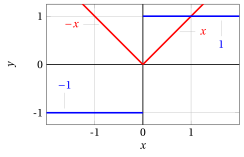
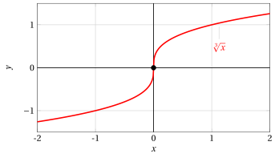
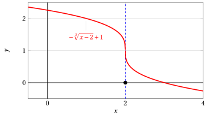
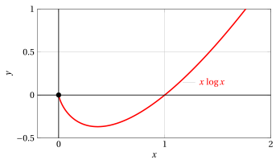
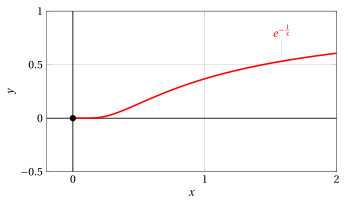

# Punti angolosi, cuspidi, punti a tangente verticale/orizzontale

**Parte 4 · Derivate · Capitolo 3** · dalle dispense di Fabio Furini · [:material-file-pdf-box: PDF del capitolo](../pdf/derivate-03-punti-angolosi-cuspidi.pdf)

## 1. Derivata destra e derivata sinistra

!!! definizione "Definizione 1: di derivata destra (sinistra)"

    Sia $f: (a, b) \rr \R$,  la funzione $f$ si dice derivabile in $x_0  \in (a, b)$ da destra (da sinistra) se esiste finito

    $$
    \lim_{h \rr 0^+} \frac{f(x_0 + h) - f(x_0)}{h} \quad \left(~ \lim_{h \rr 0^-} \frac{f(x_0 + h) - f(x_0)}{h} ~\right)
    $$

    allora $f$ è derivabile da destra (da sinistra) e il limite si chiama <strong>derivata destra</strong> (<strong>sinistra</strong>).

- La derivata destra si indica con il simbolo $f'_{+}(x_0)$ mentre la derivata sinistra si indica con il simbolo $f'_{-}(x_0)$

## 2. Punti angolosi

!!! definizione "Definizione 2: di punto angoloso"

    Nel caso in cui $f$ sia continua e derivabile da destra e da sinistra (ma non derivabile) in $x_0$ si dice che $f$ abbia un <strong>punto angoloso</strong> in $x = x_0$.

!!! esempio "Esempio 1: Punti angolosi"

    Consideriamo la funzione $f(x) = |x|$ e il punto $x_0=0$. Abbiamo:

    $$
    f'_{+}(0)=\lim_{h \rr 0^+}\frac{|h|}{h} = \lim_{h \rr 0^+} \frac{h}{h} = 1 {\rm ~~~~e~~~~} f'_{-}(0)=\lim_{h \rr 0^-} \frac{|h|}{h} = \lim_{h \rr 0^-} \frac{-h}{h} = -1
    $$

    Non esistendo il limite del rapporto incrementale, $f$ non è derivabile in $x =0$. La funzione è continua in $x=0$ nell'origine dato che

    $$
    \lim_{x \rr 0^+} f(x)=\lim_{x \rr 0^+} x = 0 {\rm ~~~e~~~} \lim_{x \rr 0^-} f(x) =\lim_{x \rr 0^-} -x = 0 {\rm ~~~~quindi~~~} \lim_{x \rr 0} f(x) = f(0)=0
    $$

    Dato che esistono finiti i limiti destro e sinistro del rapporto incrementale in $x=0$, il grafico presenta quindi un punto angoloso in $x=0$.

    { .fig .ovale loading=lazy style="width:49%" }

!!! chiave ""

    La formula che esprime sinteticamente la derivata della funzione valore assoluto (fuori dall'origine) è la seguente:

    $$
    f(x)= |x|, \quad f'(x) = sgn (x) = 
    \begin{cases}
    1 & {\rm se~~} x > 0\\
    -1 & {\rm se~~} x < 0
    \end{cases}
    $$

## 3. Punti a tangente verticale/orizzontale

- Se $f$ è continua in un punto $x_0$ e

    $$
    \lim_{h \rr 0} \frac{f(x_0 + h) - f(x_0)}{h}= \pm \infty
    $$

    allora $f$ non è derivabile in $x_0$ ma, geometricamente, il grafico di $f$ ha una retta tangente ben definita e parallela all'asse delle ordinate.

    Ammetteremo in tal caso la scrittura

    $$
    f'(x_0) = \ip, ~~~~ f'(x_0) = \im
    $$

    e parleremo di <strong>punto a tangente verticale</strong>.

!!! definizione "Definizione 3: di punto a tangente verticale"

    Se

    $$
    f'(x_0) = \ip {\rm ~~~oppure~~~} f'(x_0) = \im
    $$

    si dice che $f$ ha un <strong>punto a tangente verticale</strong> in $x = x_0$.

- Analogamente, se $f$ è continua in un punto $x_0$ e

    $$
    \lim_{h \rr 0} \frac{f(x_0 + h) - f(x_0)}{h}= 0
    $$

    il grafico di $f$ ha una retta tangente ben definita e parallela all'asse delle ascisse.  Parleremo in questo caso di <strong>punto a tangente orizzontale</strong>.

!!! definizione "Definizione 4: di punto a tangente orizzontale"

    Se

    $$
    f'(x_0) = 0
    $$

    si dice che $f$ ha un <strong>punto a tangente orizzontale</strong> in $x = x_0$.

!!! esempio "Esempio 2: Punto a tangente verticale"

    Sia

    $$
    f(x) = \sqrt[3]{x}
    $$

    allora per $x_0=0$

    $$
    \frac{f(h) - f(0)}{h} =  \frac{ \sqrt[3]{h}}{h} = \frac{ 1}{h^{2/3}}
    $$

    e i limiti sono:

    $$
    \lim_{h \rr 0^-} \frac{ 1}{h^{2/3}} = \ip {\rm ~~~e~~~}\lim_{h \rr 0^+} \frac{ 1}{h^{2/3}} = \ip {\rm ~~~~quindi~~~~} \lim_{h \rr 0} \frac{ 1}{h^{2/3}} = \ip {\rm ~~~e~~~} f'(0)= \ip.
    $$

    { .fig .ovale loading=lazy style="width:70%" }

    La funzione ha un punto a tangente verticale in $x_0=0$. La funzione:

    $$
    f(h) = \frac{1}{h^{{2}/{3}}} = h^{-\frac{2}{3}}
    $$

    è una potenza a esponente razionale $\frac{m}{n}$ negativo con $n$ dispari (quindi definita su $\R \setminus \{0\}$) e $m$ pari (quindi funzione pari). Il suo grafico è:

    { .fig .ovale loading=lazy style="width:70%" }

!!! esempio "Esempio 3: Punto a tangente verticale"

    Sia

    $$
    f(x) = -\sqrt[3]{x-2}+1
    $$

    allora per $x_0=2$

    $$
    \frac{f(2 + h) - f(2)}{h} = \frac{- \sqrt[3]{(2+h)-2}+1 - 1}{h} = -\frac{ \sqrt[3]{h}}{h}=-\frac{ 1}{h^{2/3}}
    $$

    e i limiti sono

    $$
    \lim_{h \rr 0^-} -\frac{ 1}{h^{2/3}} = \im {\rm ~~~e~~~}\lim_{h \rr 0^+} -\frac{ 1}{h^{2/3}} = \im {\rm ~~~~quindi~~~~} \lim_{h \rr 0} - \frac{ 1}{h^{2/3}} = \im {\rm ~~~e~~~} f'(2)= \im.
    $$

    { .fig .ovale loading=lazy style="width:80%" }

    La funzione ha un punto a tangente verticale in $x_0=2$.

## 4. Cuspidi

!!! definizione "Definizione 5: di cuspide"

    Sia $f$ una funzione continua in $x_0$ se

    $$
    f'_+(x_0)= \pm \infty {\rm ~~e~~} f'_-(x_0)= \mp \infty
    $$

    si dice che $f$ ha una cuspide in $x_0$.

!!! esempio "Esempio 4: Cuspide"

    Sia

    $$
    f(x) = \sqrt[3]{|x|}
    $$

    allora per $x_0=0$

    $$
    \frac{f(h) - f(0)}{h} =  \frac{ \sqrt[3]{|h|}}{h}
    $$

    e i limiti sono:

    $$
    \lim_{h \rr 0^-} \frac{ \sqrt[3]{-h}}{h}=\lim_{h \rr 0^-} -\frac{ 1}{h^{2/3}} = \im {\rm ~~~~e~~~~}\lim_{h \rr 0^+} \frac{ \sqrt[3]{h}}{h} =\lim_{h \rr 0^+} \frac{ 1}{h^{2/3}} = \ip,
    $$

    quindi:

    $$
    f'_-(0)= \im {\rm ~~~~e~~~~}f'_+(0)= \ip.
    $$

    { .fig .ovale loading=lazy style="width:80%" }

    La funzione ha una cuspide in $x_0=0$.

- Nel caso misto in cui una delle due derivate è finita e l'altra infinita (con $f$ continua) si parla ancora di punto angoloso.

- Infine, se la funzione è definita solo per $x \ge x_0$ e in tal punto ha derivata (destra) infinita, diremo semplicemente che in tal punto ha tangente verticale, senza parlare né di cuspide né di punto a tangente verticale.

!!! esempio "Esempio 5: Punto a tangente verticale"

    Sia

    $$
    f(x) = \sqrt{x}
    $$

    allora per $x_0=0$

    $$
    \frac{f(h) - f(0)}{h} =  \frac{ \sqrt{h}}{h} = \frac{1}{h^{1/2}}
    $$

    abbiamo solo il limite destro

    $$
    \lim_{h \rr 0^+} \frac{1}{h^{1/2}} = \ip {\rm ~~~e~~~}f'_+(0)= \ip.
    $$

    { .fig .ovale loading=lazy style="width:75%" }

    La funzione ha un punto a tangente verticale  in $x_0=0$. La funzione:

    $$
    f(h) = \frac{1}{h^{{1}/{2}}}  = h^{-\frac{1}{2}}
    $$

    è una potenza a esponente razionale $\frac{m}{n}$ negativo con $n$ pari (quindi definita solo su $\R_+$). Il suo grafico è:

    { .fig .ovale loading=lazy style="width:75%" }

!!! esempio "Esempio 6: Prolungamento per continuità da destra e comportamento nell'origine"

    Sia

    $$
    f(x) = x\: \log x, {\rm ~~per~~} x>0
    {\rm ~~abbiamo~~}
    \lim_{x \rr 0^+} x\: \log x = 0
    $$

    quindi la funzione  può essere prolungata per continuità da destra in $x = 0$, ponendo:

    $$
    f(x)= 
    \begin{cases}
    x\: \log x & {\rm se~~} x > 0\\[2ex]
    0 & {\rm se~~} x = 0
    \end{cases}
    $$

    { .fig .ovale loading=lazy style="width:80%" }

    Calcoliamo la derivata destra in $x_0=0$ di $f(x) = x\: \log x$ prolungata per continuità da destra in $x=0$. Abbiamo, per $x_0=0$:

    $$
    \frac{f(x_0 + h) - \overbrace{f(x_0)}^{=0}}{h}=\frac{f(x_0 + h)}{h} = \frac{f(h)}{h}
    $$

    e di conseguenza

    $$
    \lim_{h \rr 0^+}\frac{f(x_0 + h) - f(x_0)}{h}= \lim_{h \rr 0^+}\frac{h \: \log h}{h}= \lim_{h \rr 0^+} \log h = \im {\rm ~~~~quindi~~~~} f'_+(x_0)= \im
    $$

    La funzione ha quindi un punto a tangente verticale  in $x_0=0$.

!!! esempio "Esempio 7: Prolungamento per continuità da destra e comportamento nell'origine"

    Sia

    $$
    f(x) = e^{-\frac{1}{x}}, {\rm ~~per~~} x>0
    {\rm ~~abbiamo~~}
    \lim_{x \rr 0^+} e^{-\frac{1}{x}} = 0
    $$

    quindi la funzione  può essere prolungata per continuità da destra in $x = 0$, ponendo:

    $$
    f(x)= 
    \begin{cases}
    e^{-\frac{1}{x}} & {\rm se~~} x > 0\\[2ex]
    0 & {\rm se~~} x = 0
    \end{cases}
    $$

    { .fig .ovale loading=lazy style="width:80%" }

    Calcoliamo la derivata destra in $x_0=0$ di $f(x) = e^{-\frac{1}{x}}$ prolungata per continuità da destra in $x=0$.

    Abbiamo:

    $$
    \lim_{h \rr 0^+}\frac{f(x_0 + h) - f(x_0)}{h}= \lim_{h \rr 0^+}\frac{e^{-\frac{1}{h}}}{h}= \lim_{h \rr 0^+} \frac{1}{e^{\frac{1}{h}} \; h}
    $$

    Cambiando la variabile:

    $$
    y=\frac{1}{h}, {\rm ~~se~~} h \rr 0^{+} {\rm ~~allora~~} y \rr \ip
    $$

    Otteniamo:

    $$
    \lim_{h \rr 0^+} \frac{1}{e^{\frac{1}{h}} \; h} = \lim_{y \rr \ip} \frac{y}{e^y} = 0  {\rm ~~~~quindi~~~~} f'_+(x_0)= 0
    $$

    e la funzione ha un punto a tangente orizzontale (da destra)  in $x_0=0$.
