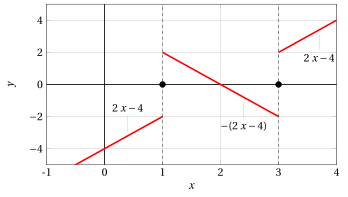
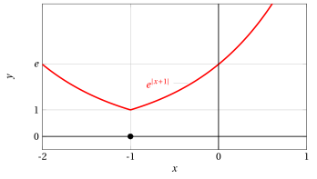
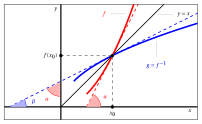
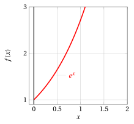
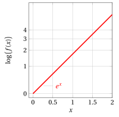
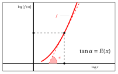

# Regole di calcolo delle derivate

**Parte 4 · Derivate · Capitolo 4** · dalle dispense di Fabio Furini e Valerio Dose · [:material-file-pdf-box: PDF del capitolo](../pdf/derivate-04-regole-calcolo.pdf)

## 1. Regole di calcolo delle derivate

- Vediamo ora la relazione tra l'operazione di derivata e le principali operazioni già note sulle funzioni; in particolare mostreremo la relazione tra:

    1. derivazione e operazione algebriche

    2. derivazione e composizione

    3. derivazione e inversione

### 1.1 Algebra delle derivate

!!! teorema "Teorema 1: dell'algebra delle derivate"

    Siano $f$,$g$: $(a,b) \rr \R$,  due funzioni derivabili in $(a,b)$.

    Allora $f \pm g$, $f \cdot g$, $f / g~~(g \neq 0)$ sono derivabili in $(a, b)$ e valgono le seguenti formule:

    \begin{equation}
    \label{DD1}
    (f \pm g)' = f' \pm g'
    \end{equation}

    \begin{equation}
    \label{DD2}
    (f \cdot g)' = f' \cdot g +  f \cdot g'
    \end{equation}

    \begin{equation}
    \label{DD3}
    \left(\frac{f}{g}\right)' = \frac{f' \cdot g -  f \cdot g'}{g^2} \qquad (g \neq 0)
    \end{equation}

- Dalla regola \(\eqref{DD2}\) si deduce

    !!! chiave ""

        \begin{equation}
        \label{DD4}
        ( k  \cdot g)' =  k \cdot  g'  \qquad {\rm ~~con~~} k\in \R {\rm ~~costante}
        \end{equation}

    essendo la derivata di una costante uguale a zero.

- Dalla regola \(\eqref{DD3}\) si deduce

    !!! chiave ""

        \begin{equation}
        \label{DD5}
        \left(\frac{1}{g}\right)' = - \frac{g'}{g^2} \qquad (g \neq 0)
        \end{equation}

- La regola \(\eqref{DD2}\) si dice <strong>regola di Leibniz</strong> e si estende al prodotto di $n$ funzioni:

    \begin{equation}
    \label{DDLEIBNIZ}
    (f_1 \: f_2 \cdots f_n  )' = f_1' \: f_2 \cdots f_n + f_1 \: f'_2 \cdots f_n + {\rm \dots} + f_1 \: f_2 \cdots f'_n
    \end{equation}

- Il teorema ha in realtà un carattere puntuale: ossia se $f$ e $g$ sono derivabili in un punto $x_0 \in (a, b)$ , allora in quel punto sono derivabili anche $f \pm g$, $f \cdot g$, $f / g$, e valgono le formule scritte (che si estendono agli intervalli).

??? dimostrazione "Dimostrazione"

    Dimostriamo la regola \(\eqref{DD2}\). Fissato $x \in (a, b)$, abbiamo

    $$
    f(x + h) \: g(x + h) - f(x) \: g(x) =
    $$

    $$
    =f(x
    + h)g(x + h) -
    f(x + h)g(x) + f(x + h)g(x) - f(x)g(x),
    $$

    e quindi il rapporto incrementale si può scrivere come:

    $$
    \frac{f(x + h) \: g(x + h) - f(x) \: g(x)}{h}=
    $$

    $$
    = f(x +h) \: \underbrace{\frac{g(x+h)-g(x)}{h}}_{=g'(x) {\rm ~per~} h \rr 0} + g(x) \: \underbrace{\frac{f(x+h)-f(x)}{h}}_{=f'(x) {\rm ~per~} h \rr 0}
    $$

    Abbiamo

    $$
    f(x + h) \rr f(x) {\rm ~~per~~} h \rr 0,
    $$

    essendo $f$ continua in quanto derivabile. 

    Quindi

    $$
    \frac{f(x + h) \: g(x + h) - f(x) \: g(x)}{h} \rr f(x) \: g' (x) + f' (x) \:g( x) {\rm ~~per~~} h \rr 0.
    $$

    
□

??? dimostrazione "Dimostrazione"

    Dimostriamo la regola \(\eqref{DD5}\). Fissato $x \in (a, b)$, il rapporto incrementale si può scrivere come:

    $$
    \frac{1}{h} \left[ \frac{1}{g(x+h)} - \frac{1}{g(x)} \right] = \frac{g(x) - g(x+h)}{h\: g(x) \: g(x+h)} =
    $$

    $$
    = - \frac{g(x+h) - g(x)}{h} \cdot \frac{1}{g(x) \: g(x+h)}
    $$

    Abbiamo

    $$
    g(x + h) \rr g(x) {\rm ~~per~~} h \rr 0,
    $$

    essendo $g$ continua in quanto derivabile. 

    Quindi

    $$
    \frac{1}{h} \left[ \frac{1}{g(x+h)} - \frac{1}{g(x)} \right] \rr -\frac{g'(x)}{g^2(x)} {\rm ~~per~~} h \rr 0.
    $$

    
□

??? dimostrazione "Dimostrazione"

    Notiamo  che dalle regole \(\eqref{DD2}\) e \(\eqref{DD5}\) si deduce  la regola \(\eqref{DD3}\), infatti:

    $$
    \left(\frac{f(x)}{g(x)}\right)' = \left( f(x) \cdot \frac{1}{g(x)}\right)' = \underbrace{f'(x) \cdot \frac{1}{g(x)} + f(x) \cdot \left(\frac{1}{g(x)}\right)'}_{{\rm regola~} \eqref{DD2}} =
    $$

    $$
    = f'(x) \cdot \frac{1}{g(x)} + f(x) \cdot \underbrace{\left( -\frac{g'(x)}{g^2(x)} \right)}_{{\rm regola~} \eqref{DD5}} = \frac{f'(x) \cdot g(x) -  f(x) \cdot g'(x)}{g^2(x)}.
    $$

    
□

!!! osservazione "Osservazione 1"

    Data la funzione $f(x)=\tan x$, la funzione derivata è $f'(x)=\frac{1}{\cos^2 x} = 1 + \tan^2 x$.

??? dimostrazione "Dimostrazione"

    Usando la formula \(\eqref{DD3}\) abbiamo

    $$
    f'(x)= \left( \frac{\sin x}{\cos x} \right)' = \frac{\cos^2 x+ \sin^2 x}{\cos^2 x}= \frac{1}{\cos^2 x} = 1 + \tan^2 x
    $$

    
□

!!! osservazione "Osservazione 2"

    Data la funzione $f(x)=\cot x$, la funzione derivata è $f'(x)=-\frac{1}{\sin^2 x} = -(1 + \cot^2 x)$.

??? dimostrazione "Dimostrazione"

    Usando la formula \(\eqref{DD3}\) abbiamo

    \begin{align*}
    f'(x)&= \left( \frac{\cos x}{\sin x} \right)' = \frac{-\sin^2 x - \cos^2 x}{\sin^2 x} = -\frac{\sin^2 x + \cos^2 x}{\sin^2 x}\\[2ex]
    &= - \frac{1}{(\sin^2x)} = - (1 + \cot^2 x)
    \end{align*}

    
□

### 1.2 Derivata di funzione composta

!!! teorema "Teorema 2: della regola della catena"

    Sia $g \circ f$ la funzione composta di due funzioni $f$ e $g$. Se $f$ è derivabile in un punto $x$ e $g$ è derivabile in $y = f ( x)$ allora $g \circ f$ è derivabile in $x$ e vale la formula:

    \begin{equation}
    \label{CAT1}
    (g \circ f)'(x) =  g'\big(f(x)\big) \cdot f'(x)
    \end{equation}

??? dimostrazione "Dimostrazione"

    Si ha

    $$
    (g \circ f)(x + h) - (g \circ f)(x) 
    = g(f(x + h)) - g(f(x))
    $$

    Se poniamo

    $$
    k = f(x + h) - f(x) {\rm ~~~e~~~} y = f(x) {\rm ~~~allora~~~} f(x+h) = y +k
    $$

    Per la continuità di $f$, $h \rr 0$ implica $k \rr 0$. Con le nuove notazioni abbiamo:

    $$
    g\big(f(x + h)\big) - g\big(f(x)\big) = g(y + k) - g(y)
    $$

    Osserviamo ora che la definizione di derivata:

    $$
    g'(y) = \lim_{k \rr 0} \frac{g(y+k) - g(y)}{k}
    $$

    si può riscrivere, per $k \neq 0$,

    $$
    \frac{g(y+k) - g(y)}{k} = g'(y) + \varepsilon (k)
    $$

    dove $\varepsilon (k)$ indica una quantità che tende a zero per $k \rr 0$.

    Moltiplicando ambo i membri dell'equazione precedente per $k$ si trova

    $$
    g(y+k) - g(y) = k \cdot g'(y) + k \cdot \varepsilon (k)
    $$

    relazione valida anche per $k = 0$. Dunque:

    $$
    g\big(f(x + h)\big) - g\big(f(x)\big) = k \cdot g'(y) + k \cdot \varepsilon (k)
    $$

    Dividendo per $h$, e osservando che

    $$
    \frac{k}{h} \rr f'(x) {\rm ~~~~per~~~~} h \to 0
    $$

    che implica, come visto, anche $k  \to 0$ e si ottiene la tesi. □

- Come suggerisce il nome di “regola della catena”, la \(\eqref{CAT1}\) può essere generalizzata alla composizione di un numero qualsiasi di funzioni, composte una con l'altra.  Ad esempio per tre funzioni si ha:

    $$
    \left(~f\bigg(g \big(h(x) \big ) \bigg)~\right)' = f'\bigg(g \big(h(x) \big ) \bigg) \cdot g' \big(h(x) \big ) \cdot h'(x)
    $$

!!! esempio "Esempio 1: Funzione derivata di funzione composta"

    Calcoliamo la funzione derivata della funzione composta:

    $$
    h(x)  =  \underbrace{\sin^3 x}_{=(g \circ f)(x)}
    $$

    Le due funzioni sono:

    $$
    f(x) = \sin x {\rm ~~~~e~~~~} g(y) = y^3 {\rm ~~~con~~~} y = \sin x.
    $$

    Entrambe le funzioni sono derivabili in tutto $\R$. Abbiamo

    $$
    g'(y) = 3\: y^2 {\rm ~~~~e~~~~} f'(x)=\cos x
    $$

    quindi usando la regola della catena \(\eqref{CAT1}\) e ri-sostituendo otteniamo:

    $$
    h'(x)  = 3 \: \sin^2 x \cdot \cos x.
    $$

!!! chiave ""

    Considerando la funzione composta $g \big(f (x)\big)$, o equivalentemente  scritta $(g \circ f)(x)$. Posto $y=f(x)$ e $w = g(y)$, e usando le notazioni (di Leibniz)

    $$
    \frac{d\!f}{d\!x}
    {~~~e~~~}  \frac{d\!g}{d\!x} {\rm ~~~~per~le~
    derivate~di~~} f {\rm ~e~} g {\rm~~rispetto~a~~} x
    $$

    la regola \(\eqref{CAT1}\) (della catena) si può riscrivere come:

    \begin{equation}
    \label{CAT2}
    \frac{d\!w}{d\!x} = \frac{d\!w}{d\!y} \cdot \frac{d\!y}{d\!x}
    \end{equation}

    La regola \(\eqref{CAT2}\) esprime che il tasso di variazione di $w$ rispetto a $x$ è il prodotto dei tassi di variazione “intermedi”, di $w$ rispetto a $y$ e di $y$ rispetto a $x$.

!!! esempio "Esempio 2: Funzione derivata di funzione composta"

    Consideriamo la funzione composta dell'esercizio precedente.  Posto

    $$
    y = \sin x ~~ \big(y=f(x)\big) {\rm ~~e ~~} w = y^3 ~~\big(w=g(y)\big)
    $$

    e usando la notazione di Leibniz, la regola \(\eqref{CAT2}\) si scriverebbe:

    $$
    \frac{d\!w}{d\!x} = \frac{d\!w}{d\!y} \cdot \frac{d\!y}{d\!x} = 3\:y^2 \cdot \cos x.
    $$

    E quindi, sostituendo $y= \sin x$, otteniamo:

    $$
    \frac{d\!w}{d\!x} =
     3 \: \sin^2 x \cdot \cos x.
    $$

!!! esempio "Esempio 3: Funzione derivata di funzione composta"

    Calcoliamo la funzione derivata della funzione composta (moltiplicata per una costante):

    $$
    h(x)  =  A \cdot \underbrace{\sin \big(\omega \: x + \varphi \big)}_{=\cdot (g \circ f)(x) } {\rm ~~~con~~~} A,\omega,\varphi \in \R.
    $$

    Le due funzioni sono:

    $$
    f(x) = \omega \: x + \varphi {\rm ~~~~e~~~~} g(y) = \sin y {\rm ~~~con~~~} y = \omega \: x + \varphi.
    $$

    Entrambe le funzioni sono derivabili in tutto $\R$. Abbiamo:

    $$
    f'(x)=\omega {\rm ~~~~~~e~~~~~~} g'(y) = \cos y
    $$

    quindi usando la regola \(\eqref{CAT1}\), la regola \(\eqref{DD4}\)  e ri-sostituendo otteniamo:

    $$
    h'(x)  = A \cdot \bigg(\cos \big(\omega \: x + \varphi \big) \cdot \omega \bigg)
    $$

!!! esempio "Esempio 4: Funzione derivata di prodotto di funzioni composte"

    Calcoliamo la funzione derivata del prodotto di due  funzioni composte per una constante:

    $$
    h(x) =  A \cdot \underbrace{e^{ -\alpha \: x}}_{= (r \circ s)(x)} \cdot \underbrace{\cos \big(\omega \: x + \varphi \big)}_{= (g \circ f)(x)} {\rm ~~~con~~~} A,\omega,\varphi \in \R, \alpha \in \R_+.
    $$

    Le funzioni sono:

    $$
    s(x) = - \alpha \: x {\rm ~~~~e~~~~} r(z) = e^z  {\rm ~~~con~~~} z = -\alpha\:x; ~~~~
    ~~ f(x) = \omega \: x + \varphi {\rm ~~~~e~~~~} g(y) = \cos y {\rm ~~~con~~~} y = \omega \: x + \varphi.
    $$

    Le funzioni sono derivabili in tutto $\R$. Abbiamo:

    $$
    s'(x)=-\alpha {\rm ~~~~e~~~~} r'(z) = e^z
    ; ~~~~
      f'(x)=\omega {\rm ~~~~e~~~~} g'(y) = -\sin y
    $$

    di conseguenza usando la regola della catena \(\eqref{CAT1}\)  e ri-sostituendo otteniamo:

    $$
    (r \circ s)'(x)  = - \alpha \; e^{ -\alpha \: x}
    ; ~~~~
    (g \circ f)'(x)  = - \sin \big(\omega \: x + \varphi \big) \cdot \omega
    $$

    Quindi usando la regola \(\eqref{DD2}\)  e la regola \(\eqref{DD4}\) :

    $$
    h'(x) = A \cdot 
    \bigg(~~ 
    \underbrace{- \alpha \; e^{ -\alpha \: x}}_{(r \circ s)'(x)}  ~\cdot~ \underbrace{\cos \big(\omega \: x 
    + \varphi \big)}_{(g \circ f)(x)} 
    ~~+~~ 
    \underbrace{e^{ -\alpha \: x}}_{(r \circ s)(x)} ~\cdot~ \underbrace{\bigg(- \sin \big(\omega \: x + \varphi \big) \cdot \omega  \bigg)}_{(g \circ f)'(x)}
    ~~\bigg)
    $$

!!! esempio "Esempio 5: Funzione derivata di funzione composta"

    Sia $f(x)>0$ e derivabile, calcoliamo la derivata della funzione

    $$
    h(x) =  \log \left( f(x) \right)
    $$

    usando la regola della catena \(\eqref{CAT1}\) abbiamo:

    $$
    h'(x) =  \frac{1}{f(x)} \cdot f'(x)
    $$

!!! osservazione "Osservazione 3"

    Data la funzione $f(x)=a^x$, con $a>0$, la funzione derivata è $f'(x)=a^x \cdot \log a$.

??? dimostrazione "Dimostrazione"

    Abbiamo

    $$
    f'(x) = \bigg( \exp \left( x \cdot \log a \right) \bigg)'
    $$

    quindi usando le formule per la derivata di $e^y$ (con $y=x\: \log a$) e per la derivata della funzione composta abbiamo

    $$
    f'(x) = \exp \left( x \cdot  \log a \right) \cdot \log a = a^x \cdot  \log a
    $$

    
□

!!! osservazione "Osservazione 4"

    Data la funzione $f(x)=\log_a x$, con $a>0,a\neq 1$, la funzione derivata è $f'(x)=a^x \cdot \log a$.

??? dimostrazione "Dimostrazione"

    Abbiamo

    $$
    f'(x) = \left( \frac{\log x}{\log a} \right)'
    $$

    quindi usando le formule per la derivata di $\log x$ e per la derivata di $k \: f(x)$ abbiamo:

    $$
    f'(x) = \frac{1}{\log a} \cdot \frac{1}{x} = \frac{1}{x \: \log a}
    $$

    
□

!!! osservazione "Osservazione 5"

    Data la funzione $f(x)=\sinh x$, la funzione derivata è $f'(x)=\cosh x$.

??? dimostrazione "Dimostrazione"

    Abbiamo:

    $$
    f'(x)=\left(\frac{e^x - e^{-x}}{2} \right)' = \frac{1}{2} \bigg( e^x - \big(-e^{-x} \big)\bigg)=\frac{e^x + e^{-x}}{2}=\cosh x
    $$

    
□

!!! osservazione "Osservazione 6"

    Data la funzione $f(x)=\cosh x$, la funzione derivata è $f'(x)=\sinh x$.

??? dimostrazione "Dimostrazione"

    Abbiamo:

    $$
    f'(x)=\left(\frac{e^x + e^{-x}}{2} \right)'= \frac{1}{2} \bigg( e^x + \big(-e^{-x} \big)\bigg)=\frac{e^x - e^{-x}}{2}=\sinh x
    $$

    
□

!!! chiave ""

    Le derivate di funzioni del tipo:

    $$
    h(x) = f(x)^{ g(x)}
    $$

    si basano sullo riscrivere  la funzione (con $f(x) > 0$) nella  forma seguente:

    $$
    f(x)^{ g(x)} = \exp \bigg(~ g(x) ~\cdot~  \log \big(f(x)\big) ~\bigg)
    $$

    Abbiamo:

    \begin{align*}
    \bigg(~f(x)^{ g(x)}~\bigg)' &=  \bigg(~\exp \left(~ g(x) \cdot \log \big(f(x)\big) ~\right) ~\bigg)'  \\[2ex]
    &= \exp \left(~ g(x) \cdot \log \big(f(x)\big) ~\right) ~\cdot~ \bigg(~g(x) \cdot \log \big(f(x)\big) ~\bigg)'  \\[2ex]
    &= f(x)^{ g(x)} ~\cdot~ \left(~ g'(x) ~\cdot~  \log \big(f(x)\big) ~+~ g(x) ~\cdot~ \frac{f'(x)}{f(x)} ~\right)
    \end{align*}

!!! esempio "Esempio 6: Derivata di una funzione elevata a un'altra funzione"

    Calcoliamo la derivata della funzione

    $$
    h(x) =  x^{2\:x} = \exp (2\:x \cdot \log x) {\rm~~con~~} x>0
    $$

    { .fig .ovale loading=lazy style="width:65%" }

    Le due funzioni sono:

    $$
    f(x) = x {\rm ~~~~e~~~~} g(x) =  2\:x
    $$

    Quindi:

    \begin{align*}
    h'(x) &=  \bigg( \exp \left( 2\:x \cdot \log x \right) ~\bigg)' = \exp \left( 2\:x \cdot \log x \right) \cdot \bigg(2\: x \cdot \log x \bigg)' = x^{2\:x} \cdot \left(  2\:\log x +  2\:x \: \frac{1}{x} \right) = x^{2\:x} \left( 2\:\log x +  2 \right)
    \end{align*}

!!! chiave ""

    Consideriamo il valore assoluto di una funzione: $|f(x)|$. Nei punti in cui $f(x) \neq 0$, la derivazione di funzione composta dà:

    $$
    \left(|f(x)|\right)' = \sgn\big(f(x)\big) \cdot f'(x)
    =
    \begin{cases}
    f'(x) & {\rm ~~per~~} f(x)>0\\[2ex]
    -f'(x) & {\rm ~~per~~} f(x)<0
    \end{cases}
    $$

    In generale, ci aspettiamo che la funzione $|f(x)|$  presenti punti angolosi nei punti in cui $f(x)$ si annulla.

!!! esempio "Esempio 7: Funzione derivata di funzione col valore assoluto"

    Calcoliamo la funzione derivata della funzione:

    $$
    f(x) =  |x^2-4\:x+3|, {\rm ~~con~~} x \neq 1 {\rm ~~e~~} x \neq 3, {\rm ~~~abbiamo~~}  f'(x)=  \sgn (x^2-4\:x+3) \cdot (2x-4)
    $$

    in maniera equivalente:

    $$
    f'(x)=\left\{\begin{array}{lr} 2\:x-4, &x<1 {\rm ~o~} x>3 {\rm ~~~~~ovvero~per~~} f(x)>0\\
    \\
    -(2\:x-4) & 1< x< 3 {\rm ~~~~~ovvero~per~~} f(x)<0\end{array}\right.
    $$

    In $x_0 =1$, occorre usare il limite del rapporto incrementale:

    $$
    \frac{f(x_0 + h) - f(x_0)}{h}=\frac{f(1+h) - f(1)}{h}= \frac{|(1+h)^2-4\:(1+h)+3|}{h}  = \frac{|h^2-2\;h|}{h}
    $$

    Se $h \rr 0^-$ abbiamo $|h^2-2\;h| = h^2-2\;h$ quindi:

    $$
    \lim_{h \rr 0^-} \frac{h^2-2\;h}{h} = -2
    $$

    Se $h \rr 0^+$ abbiamo $|h^2-2\;h| = -h^2+2\;h$ quindi:

    $$
    \lim_{h \rr 0^+} \frac{-h^2+2\;h}{h} = 2
    $$

    La funzione non è derivabile in $x_0 =1$ e $x_0 =3$ (ragionamenti analoghi a $x_0 =1$), dove ha punti angolosi.

    { .fig .ovale loading=lazy style="width:70%" }

!!! esempio "Esempio 8: Funzione derivata di funzione col valore assoluto"

    Calcoliamo la derivata della funzione:

    $$
    f(x) =  e^{|x+1|}
    $$

    { .fig .ovale loading=lazy style="width:65%" }

    Con $x \neq -1$, abbiamo:

    $$
    f(x)=\left\{\begin{array}{lr} e^{x+1}, &x>-1\\
    \\
    e^{-x-1}, & x < -1 \end{array}\right.
    {\rm ~~~~~~~quindi~~~~~~~}
    f'(x)=\left\{\begin{array}{lr} e^{x+1}, &x>-1\\
    \\
    -e^{-x-1}, & x< -1\end{array}\right.
    $$

    { .fig .ovale loading=lazy style="width:65%" }

    In $x_0 =-1$, occorre usare il limite del rapporto incrementale:

    $$
    \frac{f(x_0 + h) - f(x_0)}{h}=\frac{f(-1+h) - f(-1)}{h}= \frac{e^{|-1+h+1|}-1}{h}  = \frac{e^{|h|}-1}{h}
    $$

    Abbiamo:

    $$
    {\rm se~~} h \rr 0^+, ~e^{|h|} = e^{h} {\rm ~~e~~} \lim_{h \rr 0^+} \frac{e^{h}-1}{h} = 1;~~~~ {\rm se~~} h \rr 0^-, ~e^{|h|} = e^{-h} {\rm ~~e~~} \lim_{h \rr 0^-} \frac{e^{-h}-1}{h} = -1
    $$

    Si conclude che, non esistendo il limite del rapporto incrementale, la funzione non è derivabile in $x_0 =-1$.  La funzione ha un punto angoloso in $x_0 = - 1$.

!!! chiave ""

    Consideriamo ora le derivata di alcune funzioni logaritmiche. Calcoliamo:

    $$
    \bigg(~\log \big(|x|\big)~\bigg)' = \frac{1}{|x|} \cdot \sgn (x) = \frac{1}{x}
    $$

    Inoltre per  la derivazione di funzioni composte abbiamo:

    $$
    \bigg(~\log\big(|f(x)|\big)~\bigg)' = \frac{1}{|f(x)|} \cdot \sgn\big(f(x)\big) \cdot f'(x)= \frac{f'(x)}{f(x)}
    $$

    Talvolta conviene usare le proprietà dei logaritmi per trasformare una funzione logaritmica prima di calcolarne la funzione derivata:

    $$
    \big(\log(c\: x)\big)' =  \big(\log(c) + \log(x)\big)' = \frac{1}{x} {\rm ~~~con~~~} c \in \R
    $$

    $$
    \left(\log\left(\frac{a\:x + b}{c\:x + d} \right)\right)' =  \big(\log(a\:x + b) - \log(c\:x + d)\big)' = \frac{a}{a\:x + b} - \frac{c}{c \:x + d} {\rm ~~~con~~~} a,b,c,d \in \R
    $$

### 1.3 Derivata di funzione inversa

!!! teorema "Teorema 3: della derivata della funzione inversa"

    Sia $f : (a, b) \rr \R$ una funzione continua e invertibile in $(a, b)$ e $g = f^{-1}$ la sua funzione inversa, definita in $f\big( (a, b) \big)$.

    Supponiamo inoltre che esista $f'(x_0)$ per un certo $x_0 \in  (a, b)$.

    Allora $g$ è derivabile in $y_0= f (x_0)$ e

    \begin{equation}
    \label{INV}
    g'(y_0) =  \frac{1}{f'(x_0)}
    \end{equation}

??? dimostrazione "Dimostrazione"

    Sia:

    $$
    f(x_0)=y_0;~~~~g(y_0)=x_0
    $$

    $$
    f(x_0+h)=y_0+k;~~g(y_0+k)=x_0+h
    $$

    Consideriamo il rapporto incrementale di $g$ in $y_0$:

    $$
    \frac{g(y_0+k)-g(y_0)}{k} = \frac{h}{f(x_0+h)-f(x_0)}
    $$

    Se $k\neq 0$, $f(x_0+h)-f(x_0) \neq 0$ e quindi anche $h \neq 0$; dunque l'ultimo quoziente si può anche riscrivere nella forma:

    $$
    \frac{1}{\frac{f(x_0+h)-f(x_0)}{h}}
    $$

    Inoltre, per $k \rr 0$ si ha $g (y_0 + k) \rr  g(y_0)$ perché $g$ è continua, essendo l'inversa di una funzione continua su un intervallo (Teorema sulla continuità delle funzione inverse ); d'altro canto $h = g (y_0 + k) - g (y_0)$, quindi per $k \rr 0$ anche $h \rr 0$, e per ipotesi

    $$
    \frac{1}{\frac{f(x_0+h)-f(x_0)}{h}} \to \frac{1}{f'(x_0)} {\rm ~~per~~} h \to 0
    $$

    quindi esiste

    $$
    \lim_{k \rr 0} \frac{g(y_0+k)-g(y_0)}{k} = \frac{1}{f'(x_0)}
    $$

    
□

- Osserviamo che, assumendo la derivabilità di $f^{-1}$, la \(\eqref{INV}\) segue subito dall'identità

    $$
    g\big(f(x)\big) = x
    $$

    e dalla regola della catena:

    $$
    g'\big(f(x)\big)\cdot f'(x) = 1
    $$

    da cui, se $f'(x) \neq 0$, segue la \(\eqref{INV}\). La dimostrazione che abbiamo dato, tuttavia, è necessaria per dedurre la derivabilità di $g$ dalle nostre ipotesi su $f$.

- La \(\eqref{INV}\) ha un semplice significato geometrico, ricordando che i grafici di $f$ e $g=f^{-1}$ sono simmetrici rispetto alla bisettrice $y = x$. Geometricamente abbiamo:

    { .fig .ovale loading=lazy style="width:80%" }

    quindi gli angoli $\alpha$ e $\beta$ sono complementari, ovvero:

    $$
    \left( \alpha + \beta = \frac{\pi}{2} \right)
    $$

    e quindi

    $$
    f'(x) = \tan \alpha = \tan \left( \frac{\pi}{2} - \beta \right) = \frac{1}{\tan \beta} = \frac{1}{g'(y)}
    $$

!!! chiave ""

    Con la notazione di Leibniz, posto $y=f(x)$ e $x=g(y)$, la \(\eqref{INV}\) si scrive nella forma

    $$
    \frac{dx}{dy} = \frac{1}{\frac{dy}{dx}}
    $$

- Si faccia attenzione al fatto che nella formula di derivazione della funzione inversa, le derivate $f'$ e $g'$ sono calcolate in due punti diversi: è questa la principale attenzione da avere nell'applicazione di questo teorema.

!!! osservazione "Osservazione 7"

    Data la funzione $f(y)=\arctan y$, la funzione derivata è $f'(y)=\frac{1}{{1 + y^2}}$.

??? dimostrazione "Dimostrazione"

    Poniamo $y = \tan x$, $x = \arctan y$ con $x \in  \left(-\frac{\pi}{2}, \frac{\pi}{2} \right)$, $y \in \R$. Abbiamo:

    $$
    (\arctan y)' = \frac{dx}{dy} =  \frac{1}{\frac{dy}{dx} } = \frac{1}{1 + \tan^2 x} = \frac{1}{1 + y^2}
    $$

    
□

!!! osservazione "Osservazione 8"

    Data la funzione $f(y)=\arcsin y$, la funzione derivata è $f'(y)=\frac{1}{\sqrt{1 - y^2}}$

??? dimostrazione "Dimostrazione"

    Poniamo  $y = \sin x$, $x = \arcsin y$, con $x \in \left[ -\frac{\pi}{2}, \frac{\pi}{2} \right]$, $y \in [-1, 1 ]$. Poiché per quei valori di $x$ si ha

    $$
    \cos x = \sqrt{1 - \sin^2 x } = \sqrt {1 - y^2}
    $$

    abbiamo:

    $$
    (\arcsin y)' =  \frac{dx}{dy}  =  \frac{1}{\frac{dy}{dx} } = \frac{1}{\cos x} = \frac{1}{\sqrt{1 - y^2}}
    $$

    
□

!!! osservazione "Osservazione 9"

    Data la funzione $f(y)=\arccos y$, la funzione derivata è $f'(y)=-\frac{1}{\sqrt{1 - y^2}}$

??? dimostrazione "Dimostrazione"

    Poniamo ora $y = \cos x$, $x = \arccos y$, con $x \in \left[0, \pi \right]$, $y \in [-1, 1 ]$. Poiché per quei valori di $x$ si ha

    $$
    \sin x = \sqrt{1 - \cos^2 x} = \sqrt {1 - y^2}
    $$

    abbiamo

    $$
    (\arccos y)' =   \frac{dx}{dy}  =  \frac{1}{\frac{dy}{dx} } = \frac{1}{-\sin x} = - \frac{1}{\sqrt{1 - y^2}}
    $$

    
□

- Si osservi che le funzioni $\arcsin x$, $\arccos x$, pur essendo definite e continue in $[- 1, 1]$, non sono derivabili agli estremi dell'intervallo: precisamente, presentano in questi punti tangente verticale.

!!! chiave ""

    L'utilità del teorema di derivazione della funzione inversa consiste nel fatto che permetta di calcolare la derivata della funzione inversa $g$ anche in situazioni in cui $g$ non si sa scrivere esplicitamente.

!!! esempio "Esempio 9: Derivata di funzione inversa"

    Sia

    $$
    f (x) = x+ e^x
    $$

    La funzione è strettamente crescente in tutto $\R$, dunque invertibile e sia $g$ la sua inversa.  Calcoliamo, ad esempio, $g' (y_0)$ per $y_0 = f(0) = 1$.  Si ha:

    $$
    f'(x) = 1 + e^x, ~~~ f'(0) = 2 \neq 0
    $$

    Quindi:

    $$
    g' (1) = \frac{1}{f'(0)} = \frac{1}{2}.
    $$

!!! osservazione "Osservazione 10"

    Data la funzione $f(y)=\setsinH y$, la funzione derivata è $f'(y)=\frac{1}{\sqrt{y^2+1}}$

??? dimostrazione "Dimostrazione"

    Poniamo ora $y = \sinH x$, $x = \setsinH y$, con $x \in \R$, $y \in \R$. Poiché per quei valori di $x$ si ha

    $$
    \cosH x = \sqrt{\sinH^2 x +1} = \sqrt {  y^2 + 1}
    $$

    abbiamo:

    $$
    (\setsinH y)' =  \frac{dx}{dy}  =  \frac{1}{\frac{dy}{dx} } = \frac{1}{\cosH x} = \frac{1}{\sqrt{y^2+1}}
    $$

    
□

!!! osservazione "Osservazione 11"

    Data la funzione $f(y)=\setcosH y$, la funzione derivata è $f'(y)=\frac{1}{\sqrt{y^2-1}}$

??? dimostrazione "Dimostrazione"

    Poniamo ora $y = \cosH x$, $x = \setcosH y$, con $x \in [0,+\infty)$, $y \in [1,+\infty)$. Poiché per quei valori di $x$ si ha

    $$
    \sinH x = \sqrt{\cosH^2 x -1} = \sqrt {  y^2 - 1}
    $$

    abbiamo:

    $$
    (\setcosH y)' =  \frac{dx}{dy}  =  \frac{1}{\frac{dy}{dx} } = \frac{1}{\sinH x} = \frac{1}{\sqrt{y^2-1}}
    $$

    
□

### 1.4 Derivata logaritmica ed elasticità

!!! definizione "Definizione 1: di derivata logaritmica"

    Data $f > 0$, si chiama funzione derivata logaritmica di $f$ la funzione derivata di $\log f$, in formule:

    $$
    \frac{d}{dx} \log \big( f(x)\big) = \frac{f'(x)}{f(x)}
    $$

- La derivata logaritmica ha il significato di <strong>tasso di incremento relativo</strong> di $f$ rispetto a $x$.

- In certi casi il tasso di incremento relativo $\frac{f'(x)}{f(x)}$ è spesso più significativo del tasso assoluto $f'(x)$.

- Ad esempio, un incremento annuo di capitale di 1 miliardo su un totale di 10 ha un effetto ben diverso di un incremento di 1 miliardo su 1000 miliardi. Nel primo caso il tasso di variazione relativo è 1/ 10 nel secondo 1/1 000, mentre uguali sono gli incrementi assoluti.

!!! chiave ""

    Quando interessa visualizzare gli incrementi relativi si ricorre a grafici in <strong>scala semilogaritmica</strong>: sull'asse delle ascisse si collocano i valori di $x$, mentre su quello delle ordinate quelli di $\log \big( f(x)\big)$

{ .fig .ovale loading=lazy style="width:91%" }

{ .fig .ovale loading=lazy style="width:91%" }

- A questo tipo di rappresentazione si ricorre anche quando $f(x)$ cresce così rapidamente da richiedere una compressione troppo elevata della scala (unità di misura) sull'asse delle ordinate (o in quella delle ascisse).

!!! chiave ""

    Un <strong>grafico in scala logaritmica</strong> è un grafico in cui invece di $x$ sull'asse delle ascisse si collocano i valori di $\log x$ e sull'asse delle ordinate invece di $f(x)$ si collocano i valori di $\log f(x)$

!!! definizione "Definizione 2: di elasticità"

    La pendenza della retta tangente a un grafico in scala logaritmica si chiama di elasticità di $f$ e si indica con $E(x)$.

- L'elasticità rappresenta il tasso di variazione relativa di $f$ rispetto a variazioni relative di $x$ ed equivale alla derivata di $\log f$ rispetto a $\log x$

{ .fig .ovale loading=lazy style="width:80%" }

- Per trovare l'espressione analitica di $E(x)$, osserviamo che, per il teorema di derivazione delle funzioni composte, si ha, posto $u = \log x$:

    $$
    \frac{d \log f}{dx} = \frac{d \log f}{du} \frac{du}{dx} {\rm ~~~~ovvero~~~~} \frac{f'(x)}{f(x)} = E(x) \cdot \frac{1}{x}
    $$

    da cui si ricava:

    $$
    E(x) = x \cdot \frac{f'(x)}{f(x)}
    $$

!!! esempio "Esempio 10: elasticità"

    Calcoliamo l'elasticità della funzione potenza $f(x)= x^\alpha$, $x>0$, $\alpha \in \R$, abbiamo:

    $$
    E(x)=x \cdot \frac{\alpha\; x^{\alpha-1}}{x^\alpha}=\alpha \qquad {\rm ~~(elasticità~ costante)}
    $$
