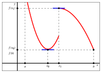
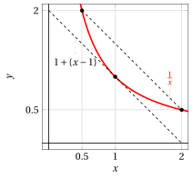
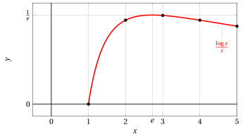

# Teorema del valore medio, massimi e minimi

**Parte 4 · Derivate · Capitolo 5** · dalle dispense di Fabio Furini · [:material-file-pdf-box: Dispensa del volume (PDF)](../pdf/dispensa-4-derivate.pdf) · [:material-presentation: Slide (PDF)](../pdf/slide-derivate-05-valor-medio.pdf)

## 1. Massimi/minimi locali e globali

- Uno degli usi  del calcolo differenziale consiste nella <strong>ricerca dei massimi e minimi</strong>, ovvero nell'<strong>ottimizzazione</strong> di una funzione definita su un intervallo $I$ (chiuso/aperto, limitato/illimitato).

!!! definizione "Definizione 1: di punto di massimo e massimo"

    Data una funzione $f:I \rr \R$, se esiste un punto $\tilde{x}_M \in I$  tale che:

    $$
    f(\tilde{x}_M) \ge f(x),~~~  \forall x \in I
    $$

    allora  $\tilde{x}_M$ è <strong>punto di massimo</strong> (globale) e $f(\tilde{x}_M)$ è il <strong>massimo</strong> (globale) di $f$ in $I$.

!!! definizione "Definizione 2: di punto di minimo e minimo"

    Data una funzione $f:I \rr \R$, se esiste un punto $\tilde{x}_m \in I$  tale che:

    $$
    f(\tilde{x}_m) \le f(x),~~~  \forall x \in I
    $$

    allora  $\tilde{x}_m$ è <strong>punto di minimo</strong> (globale) e $f(\tilde{x}_m)$ è il <strong>minimo</strong> (globale) di $f$ in $I$.

!!! chiave ""

    Chiamiamo <strong>estremo</strong> un massimo  o un minimo  e <strong>punto di estremo</strong> un punto di massimo  o di minimo. Un estremo se esiste è unico mentre possono esistere più punti di estremo (anche infiniti).

!!! definizione "Definizione 3: di punto di massimo locale e massimo locale"

    Data una funzione $f:I \rr \R$, se esiste un punto $\bar{x}_M \in I$ e un intorno $(\bar{x}_M-\delta,\bar{x}_M+\delta)$ con  $\delta >0$, tale che:

    $$
    f(\bar{x}_M) \ge f(x),~~~  \forall x \in (\bar{x}_M-\delta,\bar{x}_M+\delta) \cap I
    $$

    allora  $\bar{x}_M$ è <strong>punto di massimo locale</strong>  e $f(\bar{x}_M)$ è il <strong>massimo locale</strong>  di $f$ in $(\bar{x}_M-\delta,\bar{x}_M+\delta) \cap I$.

!!! definizione "Definizione 4: di punto di minimo locale e minimo locale"

    Data una funzione $f:I \rr \R$, se esiste un punto $\bar{x}_m \in I$ e un intorno $(\bar{x}_m-\delta,\bar{x}_m+\delta)$ con  $\delta >0$, tale che:

    $$
    f(\bar{x}_m) \le f(x),~~~  \forall x \in (\bar{x}_m-\delta,\bar{x}_m+\delta) \cap I
    $$

    allora  $\bar{x}_m$ è <strong>punto di minimo locale</strong> e $f(\bar{x}_m)$ è il <strong>minimo locale</strong>  di $f$ in $(\bar{x}_m-\delta,\bar{x}_m+\delta) \cap I$.

- I punti di estremo globale sono anche punti di estremo locale e gli estremi globali  sono anche estremi locali.

!!! esempio "Esempio 1: estremi e punti di estremo (globali e locali)"

    Consideriamo la funzione $f$ col seguente grafico:

    { .fig .ovale loading=lazy style="width:55%" }

    - il massimo globale è $f (x_2)$ e $x_2$ è punto di massimo globale (è anche unico); $f(x_0)$ è massimo locale (non globale) e $x_0$ è un punto di massimo locale (non globale)

    - il minimo globale è $f (a)$ e $a$ è punto di minimo globale (è anche unico); $f(b)$ e $f(x_1)$ sono due minimi locali (non globali) e $b$ e $x_1$ sono due punti di minimo locale (non globale)

    Consideriamo ora la funzione $f$ col seguente grafico:

    { .fig .ovale loading=lazy style="width:55%" }

    - il massimo globale non esiste ($\lim_{x \to a^+} f(x)=\ip$); $f(x_1)$ è  massimo locale (non globale) e $x_1$ è  punto di massimo locale (non globale)

    - il minimo globale è $f(x_0)$ che è uguale anche a $f(b)$; $x_0$ e $b$ sono due punti di minimo globale

## 2. Teorema di Fermat e punti stazionari

- In un punto di estremo locale o globale la funzione  può non essere derivabile ed essere perfino discontinua. Però il seguente teorema ci dice che  se una funzione  è derivabile in un punto di estremo locale allora in quel punto la  derivata si annulla e quindi la tangente al grafico è orizzontale.

!!! teorema "Teorema 1: di Fermat"

    Data una funzione $f: (a,b) \rr \R$ derivabile in $x_0 \in (a,b)$, se $f$ ha un estremo locale in $x_0$ allora $f'(x_0) = 0$.

??? dimostrazione "Dimostrazione"

    Consideriamo il caso $x_0$ punto di massimo locale. Allora:

    $$
    \exists (x_0-\delta,x_0+\delta) {\rm ~~con~~} \delta >0:~~~ f(x_0) \ge f(x)   , ~~\forall x \in (x_0-\delta,x_0+\delta) \cap (a,b)
    $$

    Perciò per ogni $x \in (x_0-\delta,x_0+\delta) \cap (a,b)$ abbiamo:

    $$
    x < x_0 \Rightarrow \frac{f(x)-f(x_0)}{x-x_0} \ge 0 {\rm ~~~~e~quindi~~~~} f'_{-}(x_0)=\lim_{x\rr x_0^-} \frac{f(x)-f(x_0)}{x-x_0} \ge 0
    $$

    dove per la non-negatività del limite abbiamo utilizzato il teorema di permanenza del segno. D'altra parte:

    $$
    x > x_0 \Rightarrow \frac{f(x)-f(x_0)}{x-x_0} \le 0 {\rm ~~~~e~quindi~~~~} f'_{+}(x_0)=\lim_{x\rr x_0^+} \frac{f(x)-f(x_0)}{x-x_0} \le 0
    $$

    Essendo $f$ derivabile in $x_0$, si ha:

    $$
    f'(x_0) = f'_{-}(x_0) = f'_{+}(x_0) =0
    $$

    Per il caso $x_0$ punto di minimo locale si ragiona in maniera analoga. □

??? dimostrazione "Dimostrazione"

    Se per assurdo fosse $f'(x_0) > 0$, allora per il teorema della permanenza del segno si dovrebbe avere $\frac{f(x) -f(x_0)}{x - x_0} >0$ definitivamente per $x \rr x_0$. Tenuto conto del segno di $x - x_0$, questo implica che $f(x) > f(x_0)$ definitivamente per $x \rr  x_0^+$ e $f(x) < f(x_0)$ definitivamente per $x \rr  x_0^-$. Ma questo contrasta con l’ipotesi che $x_0$ sia un punto di estremo locale per $f$. Analogamente si esclude il caso $f'(x_0) < 0$. Deve quindi essere $f'(x_0) = 0$. □

!!! definizione "Definizione 5: punto stazionario"

    Un punto $x_0$ si dice  punto stazionario di $f$ se $f$ è derivabile in $x_0$ e $f'(x_0) = 0$.

!!! attenzione ""

    Il Teorema di Fermat dice che per una funzione $f: (a, b) \rr \R$ derivabile in $x_0 \in (a,b)$ abbiamo:

    \begin{equation}
    x_0 {\rm ~~è~punto~di~estremo~locale}   ~~~\Rightarrow~~~ \underbrace{x_0 {\rm ~~è~punto~stazionario}}_{ f'(x_0)=0}
    \label{BBB}
    \end{equation}

    Quindi “$x_0$ è punto di estremo locale” è condizione sufficiente a “$x_0$ è punto stazionario”.  Ma il viceversa non è vero.  Un controesempio è dato dalla  funzione $f(x) = x^3+1, \forall x \in \R$ che ha  come funzione  derivata $f'(x) = 3\:x^2, \forall x \in \R$.  Con $x_0=0$  abbiamo $f'(0)=0$ ma $x_0= 0$ non è punto di estremo locale.

    { .fig .ovale loading=lazy style="width:70%" }

    Quindi abbiamo:

    $$
    \underbrace{x_0 {\rm ~~è~punto~stazionario}}_{ f'(x_0)=0} ~~~\nRightarrow~~~ x_0 {\rm ~~è~punto~di~estremo~locale}
    $$

    Infine, dalla contronominale  di \(\eqref{BBB}\), abbiamo:

    $$
    x_0 {\rm ~~non~è~punto~stazionario}  ~~\Rightarrow~~  x_0 {\rm ~~non~è~punto~di~estremo~locale~}
    $$

## 3. Teorema del valor medio o di Lagrange

!!! teorema "Teorema 2: del valore medio o di Lagrange"

    Data una funzione $f$ derivabile in $(a, b)$ e continua in $[a, b]$, allora:

    \begin{equation}
    \exists~ c \in (a,b) ~~:~~ \frac{f(b)-f(a)}{b-a}=f'(c)
    \label{VVV}
    \end{equation}

!!! chiave ""

    Nel caso $f(b) = f(a)$, il teorema ci dice che esiste $c \in (a,b)$ tale che $f'(c)=0$, ovvero che esiste almeno un punto in cui la derivata si annulla. Questo corollario del teorema di Lagrange è chiamato <strong>teorema di Rolle</strong>.

- La derivabilità è richiesta solo nell'intervallo aperto $(a,b)$ per includere anche funzioni continue in uno degli estremi ma non derivabili.  Come ad esempio, con $a=0$:

    $$
    f(x) = \begin{cases} 
     \sin \left(\frac{1}{x} \right)  \; x & {\rm se~~} x \in (0,b)\\
       0 & {\rm se~~} x = 0
    \end{cases} ~~~{\rm ~~oppure~~~} g(x) = \sqrt{x}
    $$

- Geometricamente, considerando il grafico di $f$ abbiamo :

    1. $\frac{f(b)-f(a)}{b-a}$  è la pendenza della retta passante per $\big(a, f(a)\big)$ e $\big(b,f(b)\big)$

    2. $f'(c)$  è la pendenza della retta tangente al grafico di $f$ nel punto $\big(c,f(c)\big)$

    Il teorema del valore medio esprime dunque il fatto che nel punto $\big(c,f(c)\big)$ la tangente al grafico di $f$ è parallela alla retta passante per $\big(a, f(a)\big)$ e $\big(b,f(b)\big)$. I punti con questa caratteristica possono essere più di uno come mostra la seguente figura:

    { .fig .ovale loading=lazy style="width:82%" }

- La figura mostra anche la funzione

    $$
    w(x) = f(x) - \left( f(a) + \frac{f(b)-f(a)}{b-a} \;(x-a) \right)
    $$

    data dalla differenza fra i valori della funzione e la retta passante per i punti $\big(a, f(a)\big)$ e $\big(b,f(b)\big)$ che ha equazione:

    $$
    y = f(a) + \frac{f(b)-f(a)}{b-a} \; (x-a)
    $$

    La funzione $w(x)$ è alla base della dimostrazione del teorema.

    ??? dimostrazione "Dimostrazione"

        Consideriamo la funzione:

        $$
        w(x) = f(x) - \left( f(a) + \frac{f(b)-f(a)}{b-a} \;(x-a) \right)
        $$

        Chiaramente $w(a)=w(b)=0$, inoltre $w$ è continua in $[a,b]$ e derivabile in $(a,b)$. Poiché

        $$
        w'(x) = f'(x) - \frac{f(b)-f(a)}{b-a} {\rm ~~~allora~~~} \frac{f(b)-f(a)}{b-a}=f'(c) \Longleftrightarrow \exists c\in (a,b): w' (c) = 0
        $$

        Essendo $w$ continua in $[a, b]$, per il teorema di Weierstrass esistono due punti $x_1$ e $x_2$ in $[a, b]$ tali che:

        $$
        w(x_1) = M, {\rm ~il~massimo~di~} w {\rm~in~} [a, b];~~~w(x_2) = m, {\rm ~il~minimo~di~} w {\rm~in~} [a, b].
        $$

        Se $M = m$, allora $w(x)$ è costante in $[a,b]$, e quindi $w'(x) =0, \forall x \in (a,b)$.

        Se $M > m$, almeno uno dei due punti $x_1$ o $x_2$ non si trova agli estremi dell'intervallo, essendo $w(a) = w(b) = 0$. Il teorema di Fermat implica allora che nel punto di massimo o minimo che risulta interno (eventualmente entrambi) la derivata di $w$ si annulla e il teorema è così dimostrato. □

!!! esempio "Esempio 2: utilizzo del teorema dei valori medi"

    Sia $f(x) = x^2$. Allora $f'(x) = 2\:x$ e il teorema dei valori medi afferma che in ogni intervallo $[a, b]$ esiste un numero $c$ tale che:

    $$
    \frac{b^2-a^2}{b-a}=2\:c {\rm ~~~~da~cui~~~~} c= \frac{a+b}{2} \qquad ({\rm media~aritmetica})
    $$

    Ovvero ogni corda $AB$ della parabola $y = x^2$ è parallela alla tangente nel punto di ascissa uguale alla media aritmetica delle ascisse di $A$ e $B$. Prendendo ad esempio l'intervallo $[0.2,1]$ ($a=0.2,b=1$ e $c=0.6$), abbiamo:

    { .fig .ovale loading=lazy style="width:60%" }

!!! esempio "Esempio 3: utilizzo del teorema dei valori medi"

    Sia $f(x) = \frac{1}{x}$. Allora $f'(x) = - \frac{1}{x^2}$ e il teorema dei valori medi afferma che in ogni intervallo $[a, b]$ esiste un numero $c$ tale che:

    $$
    \frac{\frac{1}{b}-\frac{1}{a}}{b-a}=- \frac{1}{c^2} {\rm ~~~~da~cui~~~~} c= \sqrt{a \cdot b} \qquad ({\rm media~geometrica})
    $$

    Ovvero ogni corda $AB$ della iperbole $y = \frac{1}{x}$ è parallela alla tangente nel punto di ascissa uguale alla media geometrica delle ascisse di $A$ e $B$. Prendendo ad esempio l'intervallo $[0.5,2]$ ($a=0.5,b=2$ e $c=1$), abbiamo:

    { .fig .ovale loading=lazy style="width:60%" }

<strong>Prova tu</strong> — il grafico interattivo qui sotto ti fa vedere quello che hai appena letto: muovi i cursori.

## 4. Teorema del criterio differenziale di monotonia

!!! teorema "Teorema 3: del Criterio
Differenziale di
Monotonia"

    Data una funzione $f:I \rr \R$, continua in $I$ e derivabile nei punti interni di $I$, allora:

    \begin{align}
    \label{C1} f'(x) \ge 0,~ \forall x {\rm ~interno~a~} I &~~~\Longleftrightarrow~~~  f {\rm ~è~non~decrescente~in~} I\\[2ex]
    \label{C2} f'(x) \le 0,~ \forall x {\rm ~interno~a~} I &~~~\Longleftrightarrow~~~  f {\rm ~è~non~crescente~in~} I\\[2ex]
    \label{C3} f'(x) > 0,~ \forall x {\rm ~interno~a~} I &~~~\Longrightarrow~~~  f {\rm ~è~crescente~in~} I\\[2ex]
    \label{C4} f'(x) < 0,~ \forall x {\rm ~interno~a~} I &~~~\Longrightarrow~~~  f {\rm ~è~decrescente~in~} I
    \end{align}

??? dimostrazione "Dimostrazione"

    - **($\Rightarrow$)** Presi due punti $x_1 < x_2$ nell’intervallo $I$, si può applicare il teorema di Lagrange nell’intervallo $[x_1,x_2]$ e quindi esiste $c \in  (x_1, x_2)$ tale che

        $$
        f(x_2) - f(x_1) =  f'(c)(x_2 - x_1)
        $$

        Se $f'(c) \ge 0$ (risp. &gt; 0), allora si ha $f(x_2) \ge f(x_1)$ (risp.  $f(x_2) > f(x_1)$). Per l’arbitrarietà di $x_1$ e $x_2$ abbiamo dimostrato che $f$ è non decrescente (risp. crescente) in $I$. Se $f'(c) \le 0$ (risp. &lt; 0) si ragiona in maniera analoga.

    - **($\Leftarrow$)** Se $f$ è non decrescente, allora abbiamo

        $$
        \frac{f(z)-f(x)}{z-x} \ge 0 {\rm ~~~per~ogni~}z,x \in I, z \neq x
        $$

        e, per il teorema della permanenza del segno, è non negativo anche il suo limite del rapporto per $z \rr x$, che per ipotesi esiste e vale $f'(x)$ per ogni $x$ interno a $I$. Se $f$ è non crescente si ragiona in maniera analoga.

    
□

!!! attenzione ""

    Il Teorema del Criterio Differenziale di Monotonia dice che per una funzione $f: I \rr \R$ derivabile nei punti interni di $I$ abbiamo:

    $$
    f'(x) \ge 0,~ \forall x {\rm ~interno~a~} I ~~~\Longleftrightarrow~~~  f {\rm ~è~non~decrescente~in~} I
    $$

    Quindi “$f'(x) \ge 0,~ \forall x$ interno a $I$” è condizione necessaria e sufficiente a “$f$ è non decrescente in $I$”. Lo stesso vale per il caso di funzioni non crescenti.

!!! attenzione ""

    Il Teorema del Criterio Differenziale di Monotonia dice che per una funzione $f: I \rr \R$ derivabile nei punti interni di $I$ abbiamo:

    $$
    f'(x) > 0,~ \forall x {\rm ~interno~a~} I ~~~\Longrightarrow~~~  f {\rm ~è~crescente~in~} I
    $$

    Quindi “$f'(x) > 0,~ \forall x$ interno a $I$” è condizione  sufficiente a “$f$ è crescente in $I$”. Ma il viceversa non è vero.  Un controesempio è dato dalla  funzione $f(x) = x^3+1, \forall x \in \R$ che è  crescente e derivabile in $\R$, ma $f'(x) = 3\;x^2$ si annulla in $x_0 = 0$.

    Quindi abbiamo:

    $$
    f {\rm ~è~crescente~in~} I ~~~\nRightarrow~~~ f'(x) > 0,~ \forall x {\rm ~interno~a~} I
    $$

    Infine, dalla contronominale  di \(\eqref{C3}\), abbiamo:

    $$
    f {\rm ~non~è~crescente~in~} I  ~~\Rightarrow~~  ~ \exists x {\rm ~interno~a~} I: f'(x) \le 0,
    $$

    Controllare. Lo stesso vale per il caso di funzioni decrescenti.

- Segue immediatamente dal teorema che con $I=(a,b)$ abbiamo:

    \begin{align*}
    f'(x) = 0,~ \forall x \in (a, b) &~~~\Longrightarrow~~~  f {\rm ~~costante~in~} (a, b)
    \end{align*}

    L'implicazione inversa è ovvia. Abbiamo allora

    \begin{align}
    \label{C5}
    f'(x) = 0,~ \forall x \in (a, b) &~~~\Longleftrightarrow~~~  f {\rm ~~costante~in~} (a, b)
    \end{align}

    Quindi “$f'(x) = 0,~ \forall x \in (a, b)$” è condizione necessaria e sufficiente a “$f$ costante in $(a,b)$”.

!!! esempio "Esempio 4: funzioni a derivata nulla"

    Consideriamo la funzione:

    $$
    f(x) = \arctan x + \arctan \frac{1}{x},~~~ \forall x \neq 0
    $$

    abbiamo

    $$
    f'(x) = \frac{1}{1+x^2} + \frac{1}{1+\frac{1}{x^2}} \; \left(-\frac{1}{x^2}\right)=0,~~~ \forall x \neq 0
    $$

    L'implicazione \(\eqref{C5}\) permette di dire che $f$ è costante nell'intervallo $(-\infty,0)$ e nell'intervallo $(0,\infty)$. Per sapere quanto vale, è sufficiente calcolare $f$ in un punto di ciascun intervallo, per esempio:

    $$
    f(1) = \arctan (1) + \arctan (1) = 2 \; \frac{\pi}{4}=\frac{\pi}{2}
    $$

    $$
    f(-1) = \arctan (-1) + \arctan (-1) = -\frac{\pi}{2}
    $$

    Abbiamo quindi dimostrato che:

    $$
    \arctan x + \arctan \frac{1}{x} =
    \begin{cases} 
    \frac{\pi}{2} & {\rm ~~se~~} x>0\\[2ex]
    -\frac{\pi}{2} & {\rm ~~se~~} x<0
    \end{cases}
    $$

- Tanto nel Teorema del  Criterio Differenziale di Monotonia quanto nella implicazione \(\eqref{C5}\) è fondamentale che l'insieme $I$ sia un intervallo. Per esempio, la funzione

    $$
    f(x) = \frac{1}{x},~~ \forall x \in \R \setminus \{0\}
    $$

    ha derivata

    $$
    f'(x) =
    -\frac{1}{x^2} < 0,~~ \forall x \in \R \setminus \{0\}
    $$

    ma la funzione non è decrescente nel suo dominio. La funzione è decrescente nell'intervallo $(-\infty,0)$ e nell'intervallo $(0,\infty)$, come mostra la figura:

    { .fig .ovale loading=lazy style="width:55%" }

## 5. Ricerca di massimi e minimi

!!! chiave ""

    Supponiamo di avere una funzione $f:[a, b] \rr \R$ e di volerne cercare i massimi e i minimi locali e globali in $[a,b]$. Se $f$ è derivabile in $(a,b)$ si può procedere nel modo seguente:

    1. Si calcolano $f(a)$ e $f(b)$.

    2. Si calcola $f'(x)$ e si risolve l'equazione $f'(x)=0$.  In tal modo si trovano i punti stazionari, tra i quali vi sono gli eventuali punti di estremo locale nell'intervallo $(a,b)$.

    3. Se non vi sono punti stazionari, $f(a)$ o $f(b)$ sono estremi globali e $a$ e $b$ sono punti di estremo globale. Altrimenti occorre stabilire la natura dei punti stazionari trovati. La funzione $f$ ha un estremo locale in un punto stazionario se e solo cambia il segno se  studiando il segno di $f'$ in un loro intorno. Abbiamo i seguenti casi:

    { .fig .ovale loading=lazy style="width:90%" }

    1. Trovati gli eventuali punti di estremo locale  si calcola il valore di $f$ in questi punti e lo si confronta con $f(a)$ e $f(b)$ per capire se siano o meno punti di estremo globale e si determinano così gli estremi globali.

!!! esempio "Esempio 5: ricerca di massimi e minimi"

    Consideriamo la funzione:

    $$
    f(x) = x \; e^{-x^2}, {\rm ~~con~~} x \in [0,2]
    $$

    <strong>Passo 1:</strong>

    $$
    f(0)=0,~~f(2)=2\; e^{-4}
    $$

!!! esempio "Esempio 6: ricerca di massimi e minimi"

    <strong>Passo 2:</strong>

    $$
    f'(x) = e^{-x^2} + x \; e^{-x^2} \; (-2\:x) = e^{-x^2} \;(1 - 2\:x^2)
    $$

    Abbiamo $e^{-x^2} > 0, \forall x \in \R$, quindi:

    $$
    f'(x) = 0 \Longleftrightarrow (1 - 2\:x^2)=0 \Longleftrightarrow x=\pm \frac{1}{\sqrt{2}}
    $$

    Solo $\frac{1}{\sqrt{2}} \in [0,2]$ e quindi abbiamo il punto stazionario $x_0 = \frac{1}{\sqrt{2}}$.

    <strong>Passo 3:</strong>

    Studiamo il segno di $f'$, vicino a $x_0 = \frac{1}{\sqrt{2}}$. Abbiamo $f'(x) \ge 0$ per  $2\:x^2 \le 1$,  ovvero per $-\frac{1}{\sqrt{2}} \le x \le  \frac{1}{\sqrt{2}}$

    { .fig .ovale loading=lazy style="width:75%" }

    Si conclude quindi che:

    $$
    \frac{1}{\sqrt{2}} {\rm ~~è~un~punto~di ~massimo~locale~~~e~~~} f\left(\frac{1}{\sqrt{2}}\right) =  \frac{1}{\sqrt{2}} \; e^{-1/2} = \frac{1}{\sqrt{2\: e}} {\rm ~~è ~un~massimo~locale}
    $$

    Notiamo inoltre che:

    $$
    \lim_{x \rr 0^+} \frac{x \; e^{-x^2}}{x} = \lim_{x \rr 0^+} \frac{1 }{e^{x^2}} = 1 {\rm ~~~~~quindi~~~~~} f(x) \sim x  {\rm ~~per~~} x \rr 0^+
    $$

!!! esempio "Esempio 7: ricerca di massimi e minimi"

    <strong>Passo 4:</strong>

    $$
    \frac{1}{\sqrt{2\: e}}  > f(0) =0, ~~ \frac{1}{\sqrt{2\: e}} > f(2) = 2\:e^{-4}
    $$

    Si conclude quindi che:

    $$
    \frac{1}{\sqrt{2}} {\rm ~~è~il~punto~di ~massimo~globale~(unico)~~~e~~~} 0 {\rm ~~è~il~punto~di~minimo~globale~(unico)}
    $$

    $$
    \frac{1}{\sqrt{2\: e}}  {\rm ~~è~il~massimo~globale~~~e~~~} 0 {\rm ~~è~il~minimo~globale}
    $$

    { .fig .ovale loading=lazy style="width:90%" }

### 5.1 Passaggio dal discreto al continuo

!!! chiave ""

    Il passaggio “dal discreto al continuo” per le successioni (cioè dai numeri naturali ai reali) è un modo per avere a disposizione gli strumenti del calcolo differenziale

!!! esempio "Esempio 8: dimostrazione di monotonia per successioni col passaggio al continuo"

    Consideriamo la successione

    $$
    a_n = \frac{\log n}{n},  {\rm ~~~~abbiamo~}~~a_n \ge 0, \forall n \in \N_{>0} {\rm ~~e~~} a_n \rr 0 {\rm ~~per~~} n \rr \ip
    $$

    Per dimostrare che la successione è definitivamente monotona non crescente una strada è utilizzare la definizione e provare che:

    $$
    a_n  \ge a_{n+1} ,~~~ \forall n \in \N_{>0} {\rm ~~~~~ovvero~~~~~~}  \frac{\log n}{n} \ge \frac{\log (n+1)}{n+1},~~~ \forall n \in \N_{>0}
    $$

    Poiché al crescere di $n$ sia il numeratore che il denominatore crescono, non è facile provare questa disuguaglianza per via algebrica.  

    Effettuiamo il passaggio dal discreto al continuo e definiamo la funzione

    $$
    f(x) =  \frac{\log x}{x},~~~ \forall x > 1
    $$

    Abbiamo

    $$
    f'(x) =  \frac{1-\log x}{x^2} \le 0,~~~ \forall  x \ge e
    $$

    e segue che $f$ è non crescente $\forall x \ge e$.  Di conseguenza la successione $a_n$ è non crescente per $n \ge  3$ (il primo numero naturale $> e$).

    { .fig .ovale loading=lazy style="width:70%" }

- Attenzione a non usare indiscriminatamente il passaggio dal discreto al continuo. Ad esempio non si può effettuare il passaggio per le successioni $\frac{n!}{2^n}$ o $\frac{n^2+(-1)^n \; n}{n^3+1}$ in quanto sono definite soltanto per i numeri naturali.
