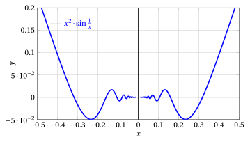

# Teorema di De l'Hospital e derivabilità

**Parte 4 · Derivate · Capitolo 6** · dalle dispense di Fabio Furini e Valerio Dose · [:material-file-pdf-box: PDF del capitolo](../pdf/derivate-06-de-l-hospital.pdf)

## 1. Teorema di De l'Hospital

- Una notevole applicazione del calcolo differenziale si ha nel calcolo dei limiti che si presentano nelle forme di indecisione:

    $$
    \left[ \frac{0}{0} \right] ~~e~~ \left[ \frac{\infty}{\infty} \right]
    $$

!!! teorema "Teorema 1: di De l'Hospital"

    Siano $f$, $g$ funzioni derivabili in  un intervallo $(a,b)$ con $g$,$g' \neq 0$ in $(a,b)$. Se

    $$
    \lim_{x \rr a^+} f(x) = \lim_{x \rr a^+} g(x) = 0  ~~{\rm (oppure}  \pm \infty)
    ~~~~~{\rm e~~~~}  \lim_{x \rr a^+} \frac{f'(x)}{g'(x)} = \ell \in \R^*
    $$

    allora:

    $$
    \lim_{x \rr a^+} \frac{f(x)}{g(x)} =\ell
    $$

!!! chiave ""

    Il teorema continua a valere se $a = \im$ oppure se si considera il limite per $x \rr b^-$, con $b \le \ip$ (caso che non dimostriamo). Quindi se le ipotesi valgono per $a^-$ e $a^+$ si può chiaramente applicare anche a un punto interno di un intervallo.

!!! esempio "Esempio 1: utilizzo del teorema di De l'Hospital"

    Vogliamo calcolare:

    $$
    \lim_{x \rr 0} \frac{\sin x}{x} = \left[ \frac{0}{0} \right] {\rm ~~~e~~~} f(x)=\sin x,f'(x)=\cos x,~~g(x)=x,g'(x)=1
    $$

    applicando il teorema di De l'Hospital, ad esempio con $x \in \left(-1,0 \right) \cup \left(0,  1 \right)$,  otteniamo:

    $$
    \lim_{x \rr 0} \frac{\sin x}{x} =^H \lim_{x \rr 0} \frac{\cos x}{1}=1
    $$

    Vogliamo calcolare:

    $$
    \lim_{x \rr \frac{\pi}{2}} \frac{1 - \sin x}{\cos x} = \left[ \frac{0}{0} \right] {\rm ~~~e~~~} f(x)=1-\sin x,f'(x)=-\cos x,~~g(x)=\cos x,g'(x)=-\sin x
    $$

    applicando il teorema di De l'Hospital, ad esempio con $x \in \left(\frac{\pi}{4},\frac{\pi}{2} \right) \cup \left(\frac{\pi}{2},  \frac{3\;\pi}{4} \right)$, otteniamo:

    $$
    \lim_{x \rr \frac{\pi}{2}} \frac{1 - \sin x}{\cos x}  =^H \lim_{x \rr \frac{\pi}{2}} \frac{ - \cos x}{-\sin x} = \lim_{x \rr \frac{\pi}{2}} \frac{ \cos x}{\sin x}=\frac{0}{1} =0
    $$

??? dimostrazione "Dimostrazione"

    Consideriamo il caso:

    $$
    f(x), g(x) \rr 0, {\rm ~~per~~} x \rr a^+
    $$

    Sia $\{x_n\}$ una successione tale che $x_n \rr a^+$ per $n \rr \ip$ e $x_n \neq a, \forall n$ e  prolunghiamo per continuità $f$ e $g$ in $a$ ponendo $f(a) = g(a) =0$.

    Definiamo ora la seguente funzione:

    $$
    h(x)= f(x_n)\;g(x) - g(x_n)\;f(x)
    $$

    La funzione $h$ soddisfa le ipotesi del teorema di Lagrange sull'intervallo $[a, x_n]$, dunque esiste $t_n \in (a, x_n)$ tale che

    $$
    h'(t_n) = \frac{h(x_n)-h(a)}{x_n-a}=0 {\rm ~~~~dato~che~~~~}h(a)= h(x_n) = 0
    $$

    Calcolando

    $$
    h'(x)= f(x_n) \; g'(x) - g(x_n)\;f'(x), {\rm ~~~abbiamo~~~} \underbrace{f(x_n) \; g'(t_n) - g(x_n) \; f'(t_n)}_{=h'(t_n)}=0
    $$

    Dunque per ogni $x_n$ esiste un punto $t_n \in (a, x_n)$ tale che:

    \begin{equation}
    \frac{f(x_n)}{g(x_n)} = \frac{f'(t_n)}{g'(t_n)}
    \label{TT}
    \end{equation}

    Per $n \rr \ip$ abbiamo $t_n \rr a^+$, dato che $a^+ < t_n < x_n$ e $x_n \rr a^+$ per $n \rr \ip$, quindi per l'ipotesi del teorema abbiamo:

    $$
    \frac{f'(t_n)}{g'(t_n)} \rr \ell {\rm~~~~e~di~conseguenza~~~~} \frac{f(x_n)}{g(x_n)} \rr \ell
    $$

    che è quanto volevamo dimostrare. □

!!! chiave ""

    Col teorema di De L'Hospital si può facilmente dimostrare il teorema  della gerarchia degli infiniti per le funzioni.

??? dimostrazione "Dimostrazione"

    Proviamo:

    $$
    \lim_{x \rr \ip} \frac{x^{\alpha}}{b^{\lambda \;x}}=0, {\rm ~~~con~~~} \alpha >0, \lambda >0, b>1
    $$

    Posto $f(x)=x$, $g(x)=b^{\mu \;x} ~ (\mu >0)$,  si ha $f'(x)=1$, $g'(x)=\mu\:\log b \;b^{\mu \;x}$  e poiché:

    $$
    \lim_{x \rr \ip} \frac{f'(x)}{g'(x)}=\lim_{x \rr \ip} \frac{1}{\mu\;\log b \:b^{\mu \;x}}=0 {\rm ~~~~allora~~~~} \lim_{x \rr  \ip} \frac{x}{b^{\mu \;x}}=0
    $$

    Osservando ora che

    $$
    \frac{x^{\alpha}}{b^{\lambda \;x}} = \left(\frac{x}{b^{(\lambda/\alpha) \;x}}\right)^{\alpha}= \left(\frac{x}{b^{\mu \;x}}\right)^{\alpha} {\rm ~~con~~} \mu=\frac{\lambda}{\alpha}>0 
    {\rm ~~~~allora~~} \lim_{x \rr \ip} \frac{x^{\alpha}}{b^{\lambda \;x}}= \left(\lim_{x \rr \ip} \frac{x}{b^{\mu \;x}}\right)^{\alpha}=0
    $$

    Proviamo:

    $$
    \lim_{x \rr \ip} \frac{(\log_a x)^{\beta}}{x^\alpha}=0, {\rm ~~~con~~~} \beta >0, \alpha >0, a >1
    $$

    è sufficiente eseguire il cambio di variabile

    $$
    t
    = \log_a x,~~~ x = a^t, {\rm ~~abbiamo~per~} x \rr \ip {\rm ~~anche~~} t \rr \ip
    $$

    quindi

    $$
    \lim_{x \rr \ip} \frac{(\log_a x)^{\beta}}{x^\alpha} = \lim_{t \rr \ip} \frac{t^{\beta}}{a^{\alpha\;t}}=0
    $$

    dato che il secondo limite è uguale nella forma a quello appena dimostrato. □

- Il teorema di De L'Hospital può essere utile per limiti non solubili solo con i limiti notevoli o con i derivanti sviluppi asintotici.

!!! esempio "Esempio 2: teorema di De l'Hospital e limiti notevoli"

    Calcoliamo

    $$
    \lim_{x \rr 0} \frac{x-\sin x}{x^3} = \left[ \frac{0}{0} \right]
    $$

    I limiti notevoli non sono sufficienti a risolvere la forma di  indeterminazione, in quanto:

    $$
    \frac{x-\sin x}{x^3} = \frac{1}{x^2} \left(1 - \frac{\sin x}{x} \right) {\rm ~~~e~~~} \lim_{x \rr 0} \frac{1}{x^2} \left(1 - \underbrace{\frac{\sin x}{x}}_{\rr 1} \right) = [ \infty \cdot 0]
    $$

    Il teorema di De L'Hospital dà:

    $$
    \lim_{x \rr 0} \frac{x-\sin x}{x^3} =^H \lim_{x \rr 0} \frac{(x-\sin x)'}{(x^3)'}=\lim_{x \rr 0} \frac{1 - \cos x}{3\; x^2} = \frac{1}{3} \cdot \lim_{x \rr 0} \underbrace{\frac{1 - \cos x}{x^2}}_{\rr \frac{1}{2}} = \frac{1}{6}
    $$

!!! esempio "Esempio 3: teorema di De l'Hospital e sviluppi asintotici"

    Trattiamo ora lo stesso limite con lo sviluppo asintotico del primo ordine:

    $$
    \sin x = x + o(x) {\rm ~~~per~~~} x \rr 0
    $$

    otteniamo:

    $$
    \lim_{x \rr 0} \frac{x-\sin x}{x^3} = \lim_{x \rr 0} \frac{x-\big(x + o(x)\big)}{x^3}= \lim_{x \rr 0} \frac{o(x)}{x^3}
    $$

    Ovvero abbiamo ancora una forma indeterminata in quanto:

    $$
    \lim_{x \rr 0} \frac{o(x)}{x^3} = \lim_{x \rr 0} \frac{1}{x^2}\;\frac{o(x)}{x} = \lim_{x \rr 0} \frac{1}{x^2}\;o(1)= [\ip \cdot 0]
    $$

    dove $o(1)$ indica una generica funzione che tende a 0 per $x \rr 0$.

    Alla stessa conclusione si arriva anche col seguente ragionamento. Il simbolo $o(x)$ per $x \rr 0$ indica l'insieme delle funzioni che divise per $x$ tendono a 0 per $x \rr 0$. Quindi ad esempio $5\;x^2=o(x)$ ma anche $x^3=o(x)$ e il valore del limite non può  essere determinato con lo sviluppo asintotico del primo ordine.

    Come vedremo più avanti per determinare questo limite con gli sviluppi asintotici occorre uno sviluppo asintotico di un ordine superiore al primo.

!!! esempio "Esempio 4: teorema di De l'Hospital e stime asintotiche"

    Calcoliamo

    $$
    \lim_{x \rr \ip} \frac{ x -\sin x}{x+\sin x} = \left[ \frac{\ip}{\ip} \right]
    $$

    Il teorema di De L'Hospital dà:

    $$
    \lim_{x \rr \ip} \frac{x-\sin x}{x+\sin x} =^H \lim_{x \rr \ip} \frac{(x-\sin x)'}{(x+\sin x)'}=\lim_{x \rr \ip} \frac{1 - \cos x}{1 + \cos x} {\rm ~~~non~esiste}
    $$

    il fatto che questo limite non esista non ci permette di concludere che il limite cercato non esista.

    Procediamo invece con le stime asintotiche:

    $$
    \frac{ x -\sin x}{x+\sin x} \sim \frac{x}{x} {\rm ~~per~~} x \rr \ip
    $$

    Dato che

    $$
    \lim_{x \rr \ip} \frac{ x -\sin x}{x} = \lim_{x \rr \ip} 1 -  \underbrace{\frac{ \sin x}{x}}_{\rr 0} {\rm ~~~~~e~~~~~} \lim_{x \rr \ip} \frac{ x +\sin x}{x} = \lim_{x \rr \ip} 1 +  \underbrace{\frac{ \sin x}{x}}_{\rr 0}
    $$

    quindi:

    $$
    \lim_{x \rr \ip} \frac{ x -\sin x}{x+\sin x}=\lim_{x \rr \ip} \frac{ x}{x} = 1
    $$

- Il teorema è utile quando la sua applicazione semplifica il limite anziché complicarlo, ovvero l'ordine di infinitesimo (o di infinito) al numeratore o a denominatore si abbassa.

!!! esempio "Esempio 5: teorema di De l'Hospital"

    Calcoliamo

    $$
    \lim_{x \rr 0^+} \frac{e^{-1/x^2}}{x} = \left[ \frac{0}{0} \right]
    $$

    Il teorema di De L'Hospital dà:

    $$
    \lim_{x \rr 0^+} \frac{e^{-1/x^2}}{x} =^H \lim_{x \rr 0^+} \frac{(e^{-1/x^2})'}{(x)'} = \lim_{x \rr 0^+}  \frac{  2\: e^{-1/x^2}}{x^3}= \left[ \frac{0}{0} \right]
    $$

    Applicando invece il cambio variabile:

    $$
    x^2 = \frac{1}{t}, ~~{x \rr 0^+} {\rm ~~equivale~a~~} t \rr \ip
    $$

    sostituendo abbiamo:

    $$
    \lim_{x \rr 0^+} \frac{e^{-1/x^2}}{ \left(x^2\right)^{1/2}} = \lim_{t \rr \ip} \frac{e^{-t}}{ \left( \frac{1}{t} \right)^{1/2} } = \lim_{t \rr \ip} \frac{e^{-t}}{ t^{-1/2} } = \lim_{t \rr \ip} \frac{ \sqrt{t}}{ e^{t} }=0
    $$

    dove l'ultimo limite è ottenuto grazie al teorema della gerarchia degli infiniti.

- Talvolta, il teorema va applicato più volte consecutivamente, per sciogliere la forma di indeterminazione. Anche in questo caso  già dopo la prima applicazione ci si dovrebbe accorgere che l'ordine di infinitesimo (o di infinito) al numeratore o a denominatore si è abbassato.

!!! esempio "Esempio 6: teorema di De l'Hospital"

    Calcoliamo

    $$
    \lim_{x \rr 0} \frac{1 - \cos^3 x}{x^3-x^2} = \left[ \frac{0}{0} \right]
    $$

    Il teorema di De L'Hospital dà:

    $$
    \lim_{x \rr 0} \frac{1 - \cos^3 x}{x^3-x^2} =^H \lim_{x \rr 0} \frac{3\; \sin  x \; \cos^2 x}{3 \; x^2 - 2\; x} = \left[ \frac{0}{0} \right]
    $$

    Il teorema di De L'Hospital applicato due volte dà:

    $$
    \lim_{x \rr 0} \frac{1 - \cos^3 x}{x^3-x^2} =^H \lim_{x \rr 0} \frac{3\; \sin  x \; \cos^2 x}{3 \; x^2 - 2\; x} =^H \lim_{x \rr 0} \frac{3 \; \overbrace{\cos x}^{\rr 1} \; \big(\overbrace{\cos^2 x}^{\rr 1} - \overbrace{2 \sin^2 x}^{\rr 0} \big)}{\underbrace{6 \; x}_{\rr 0} - 2} = -\frac{3}{2}
    $$

!!! chiave ""

    - Il teorema si usa per quozienti, non per prodotti

    - Il teorema si usa per quozienti che siano effettive forme di indeterminazione:

        $$
        \left[ \frac{0}{0} \right] ~~e~~ \left[ \frac{\infty}{\infty} \right]
        $$

    - Il teorema prescrive di calcolare il quoziente delle derivate, non la derivata del quoziente

    - Se il limite di $f'/g'$ non esiste, nulla si può affermare sul limite di $f /g$.

## 2. Limite della funzione derivata e derivabilità

!!! teorema "Teorema 2: del limite della funzione  derivata"

    Se $f: [a, b) \rr \R$ è continua in $a$, derivabile in $(a, b)$, e $\lim_{x \rr a^+} f'(x) = m \in \R^*$ allora $f'_+(a)=m$.

!!! chiave ""

    Se la funzione è continua in $a$ ed esiste il limite destro della derivata, allora esiste la derivata destra, e coincide con quel limite. Un analogo enunciato del teorema vale per la derivata sinistra e quindi per la derivata.

??? dimostrazione "Dimostrazione"

    Sia $h > 0$. Applicando il teorema di Lagrange a $f$ sull'intervallo $[a, a+h]$, otteniamo che esiste $t_h \in [a, a+h]$ tale che

    $$
    \frac{f(a+h)-f(a)}{h}= f'(t_h)
    $$

    Per $h \rr 0^+$ si ha che $t_h \rr a^+$, quindi per ipotesi del teorema  $f'(t_h) \rr m$ per $t_h \rr a^+$. Di conseguenza esiste

    $$
    f'_+(a)=  \lim_{h \rr 0^+} \frac{f(a+h)-f(a)}{h}=m
    $$

    
□

!!! chiave ""

    Sotto le ipotesi del teorema è possibile quindi calcolare la derivata destra,  la derivata sinistra o la derivata senza utilizzare il limite del rapporto incrementale

!!! esempio "Esempio 7: derivabilità"

    Supponiamo di voler studiare la derivabilità o meno della funzione:

    $$
    f(x) = x \cdot |\log x|
    $$

    definita per $x >0$. Con $x \neq 1$, dove $\log x=0$, abbiamo:

    $$
    f(x)=\left\{\begin{array}{lr} x \cdot \log x, &x>1\\
    \\
    -x \cdot \log x, & 0 < x < 1 \end{array}\right.
    {\rm ~~~~~~~quindi~~~~~~~}
    f'(x)=\left\{\begin{array}{lr} \log x +1, &x>1\\
    \\
    -(\log x +1), & 0 < x < 1 \end{array}\right.
    $$

    { .fig .ovale loading=lazy style="width:65%" }

    In $x = 1$ la funzione $f(x)$ è continua, e abbiamo:

    $$
    \lim_{x \rr 1^+} f'(x) = \lim_{x \rr 1^+} (\log x +1) = 1 {\rm ~~~~e~~~~} \lim_{x \rr 1^-} f'(x) = \lim_{x \rr 1^-} (-\log x -1) = -1
    $$

    quindi il teorema è applicabile (da destra e da sinistra) e abbiamo:

    $$
    f'_+(1)=1,f'_-(1)=-1, {\rm ~~per~cui~~} x=1 {\rm ~~è~un ~punto~angoloso~e~~} f'(1) {\rm ~non~esiste}
    $$

    { .fig .ovale loading=lazy style="width:65%" }

!!! esempio "Esempio 8: derivabilità"

    Supponiamo di voler studiare la derivabilità o meno della funzione:

    $$
    f(x) = x^2 \cdot \sin \left(\frac{1}{x}\right)
    $$

    definita per $x \neq 0$.   Sappiamo che

    $$
    \lim_{x \rr 0}  x^2 \cdot \sin \left(\frac{1}{x}\right) =0
    $$

    e possiamo prolungare $f$ per continuità definendo $f(0) =0$, ed $f$  risulta continua anche in $0$.  Con $x \neq 0$, abbiamo:

    $$
    f'(x) = 2\:x \cdot \sin \left(\frac{1}{x}\right) + x^2 \cdot \cos \left(\frac{1}{x}\right) \cdot  \left(-\frac{1}{x^2}\right) = \underbrace{2\:x \cdot \sin \left(\frac{1}{x}\right)}_{\rr 0 {\rm ~per~} x \rr 0} - \cos \left(\frac{1}{x}\right)
    $$

    { .fig .ovale loading=lazy style="width:55%" }

    Vicina a zero,  la funzione $\cos \frac{1}{x}$,  come la funzione $\sin \frac{1}{x}$, non si può disegnare in quanto ha infinite oscillazioni. Quindi  le ipotesi del teorema non sono soddisfatte dato che

    $$
    \lim_{x \rr 0} f'(x) {\rm ~~non~~esiste},~~~  \lim_{x \rr 0^-} f'(x) {\rm ~~non~~esiste},~~~  \lim_{x \rr 0^+} f'(x) {\rm ~~non~~esiste}
    $$

    Questo non ci permette però di concludere che la funzione non sia derivabile in $x_0=0$.  Per calcolare la derivata  occorre usare il limite del rapporto incrementale. Abbiamo

    $$
    f'(0)= \lim_{h \rr 0} \frac{f(h)-0}{h} = \lim_{h \rr 0} h \cdot \sin \left(\frac{1}{h}\right)=0 {\rm ~~quindi~la~funzione~è~derivabile~in~~} x=0
    $$

    { .fig .ovale loading=lazy style="width:55%" }
