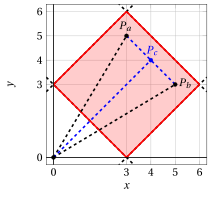
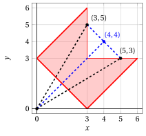
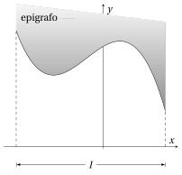
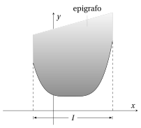
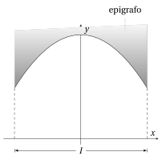
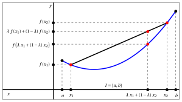
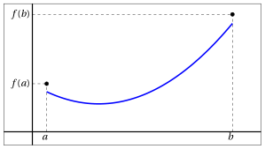
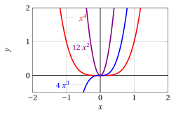
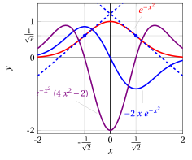
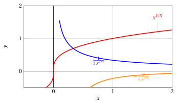

# Derivata seconda

**Parte 4 · Derivate · Capitolo 7** · dalle dispense di Fabio Furini · [:material-file-pdf-box: PDF del capitolo](../pdf/derivate-07-derivata-seconda.pdf)

## 1. Derivata seconda e funzione derivata seconda

- Possiamo ora chiederci  se la funzione $f' (x)$ sia a sua volta derivabile (in un punto o in un  l'intervallo).

!!! definizione "Definizione 1: di derivata seconda"

    Sia $f: (a, b) \rr \R$, $x_0  \in (a, b)$ e $f':(x_0-\delta, x_0+\delta) \rr \R$ con $\delta >0$,    $f$ si dice derivabile due volte in $x_0$ se esiste finito

    $$
    \lim_{h \rr 0} \frac{f'(x_0 + h) - f'(x_0)}{h}
    $$

    tale limite prende il nome di derivata seconda  di $f$ in $x_0$.

- Per indicare la funzione derivata seconda si usano le seguenti notazioni:

    $$
    \underbrace{f''(x_0)}_{{\rm notazione~di~Lagrange}}  \qquad 
    \underbrace{\ddot{f}(x_0)}_{{\rm notazione~di~Newton}} \qquad 
    \underbrace{\frac{d^2f}{dx^2}\bigg\vert _{x=x_0} {\rm~~~~e~~~~~~} \frac{d^2y}{dx^2}\bigg\vert _{x=x_0}}_{{\rm notazione~di~Leibniz}}
    $$

!!! definizione "Definizione 2: di funzione derivata seconda"

    Se una funzione derivata $f'$ è derivabile in ogni punto dell'intervallo $(a, b)$, la funzione

    $$
    f'': (a,b) \rr \R ,~~ f'': x \mapsto f''(x)
    $$

    si chiama <strong>funzione derivata seconda</strong> di $f$.

- Per indicare la funzione derivata seconda si usano le seguenti notazioni:

    $$
    \underbrace{f''(x)}_{{\rm notazione~di~Lagrange}}  \qquad 
    \underbrace{\ddot{f}(x)}_{{\rm notazione~di~Newton}} \qquad 
    \underbrace{ \frac{d^2f}{dx^2} {\rm~~~~,~~~~~~} \frac{d^2f(x)}{dx^2}  {\rm~~~~e~~~~~~} \frac{d^2y}{dx^2}}_{{\rm notazione~di~Leibniz}}
    $$

### 1.1 Funzione derivata di ordine $n$

- In modo del tutto analogo si definisce la derivata di ordine $n$, o derivata $n$-esima, e la funzione derivata $n$-esima che sono indicate con i simboli:

    $$
    \underbrace{f^{(n)}(x_0),~~~~f^{(n)}(x)}_{{\rm notazione~di~Lagrange}} 
    \qquad
    \underbrace{\frac{d^nf}{dx^n}\bigg\vert _{x=x_0} {\rm~~e~~~~} \frac{d^ny}{dx^n}\bigg\vert _{x=x_0},~~~~ \frac{d^nf}{dx^n} {\rm~~~~,~~~~~~} \frac{d^nf(x)}{dx^n}  {\rm~~e~~~~} \frac{d^ny}{dx^n}}_{{\rm notazione~di~Leibniz}}
    $$

### 1.2 Significato geometrico della derivata seconda

!!! chiave ""

    Se la derivata prima ha, come significato geometrico quello di pendenza del grafico, la derivata seconda rappresenta la <strong>velocità di variazione di tale pendenza</strong> e pertanto costituisce una misura del <strong>grado di scostamento del grafico dall'andamento rettilineo</strong>.

- Cominciamo considerando la famiglia di funzioni che soddisfano le condizioni:

    $$
    f (0) = f' (0) = 0,~~ f" (0) \ge 0
    $$

    e la famiglia di semicirconferenze con centro sull'asse $y$ tangente  al grafico di $f$ nell'origine

    $$
    c_r(x) = r - \sqrt{r^2 - x^2},\qquad {\rm dove~~} {r > 0} {\rm ~~è~il ~raggio}
    $$

    Per ogni $r \in \R_+$, abbiamo:

    $$
    c'_r(0)=c_r(0)=0 {\rm ~~dato~che~~} c'_r(x) = \frac{x}{\sqrt{r^2 - x^2}}
    $$

    Ad esempio la funzione $f(x)= 1 -\cos x$ con $f(0)=f'(0)=0$ e i cerchi con raggi $r \in \{0.5,1,1.5\}$ sono:

    { .fig .ovale loading=lazy style="width:80%" }

- Tra queste semicirconferenze vogliamo selezionare quella che, non soltanto, ha la stessa tangente in $x =0$ ma anche la stessa velocità di variazione della pendenza in $x = 0$. Ovvero vogliamo scegliere $r$ in modo che:

    \begin{equation}
    \label{XX} c_r''(0) = f''(0)
    \end{equation}

    Abbiamo:

    $$
    c_r'(x) = \frac{x}{\sqrt{r^2 - x^2}} {\rm ~~~~e~~~~} c_r''(x) = \frac{r^2}{\left(r^2 - x^2\right)^{3/2}}
    $$

    quindi se  vogliamo che sia soddisfatta la \(\eqref{XX}\) occorre scegliere $r$ in modo che:

    \begin{equation}
    \label{YY}   \underbrace{\frac{1}{r}}_{=c_r''(0)} =  f''(0)
    \end{equation}

    La \(\eqref{YY}\) esprime il significato geometrico della derivata seconda in $x=0$ per la famiglia di funzioni che soddisfano le condizioni $f (0) = f' (0) = 0,~~ f" (0) \ge 0$. Ovvero $f'' (0)$ rappresenta il reciproco del raggio della semicirconferenza che meglio approssima $f$ in $x = 0$.

- Riprendiamo la funzione $f(x)= 1 -\cos x$, abbiamo

    $$
    f'(x)=\sin x {\rm ~~~e~~~} f''(x)=\cos x
    $$

    quindi

    $$
    f''(0)=1 {\rm ~~~e~~~} \frac{1}{r}=1 {\rm ~~quindi~~} r=1
    $$

    { .fig .ovale loading=lazy style="width:80%" }

!!! chiave ""

    Ripetendo un'analoga costruzione in un punto generico $\big(x,f(x)\big)$ del grafico di $f$ (senza supporre a priori $f(x) = f'(x) =0$) si trova che il <strong>cerchio che meglio approssima il grafico della funzione nel punto ha raggio $r(x)$</strong> dato da:

    \begin{equation}
    \label{ZZ}  \frac{1}{r(x)} ~~=~~ \frac{|f''(x)|}{\left(1 +  \big(f'(x)\big)^2\right)^{3/2}}
    \end{equation}

    Il valore $\frac{1}{r(x)}$ prende il nome di <strong>curvatura</strong>  (del grafico) di $f$ in $x = 0$ e il valore $r(x)$ è il <strong>raggio di curvatura</strong>.

!!! esempio "Esempio 1: raggio di curvatura e curvatura"

    Consideriamo la parabola (parametrica):

    $$
    f(x) = a\; x^2 {\rm ~~con~~} a \in \R 
    {\rm ~~abbiamo~~} 
     f'(x)=2\;a\;x {\rm ~~~~~~~e~~~~~~~} f''(x)=2\;a
    $$

    e la seguente curvatura:

    $$
    \frac{1}{r(x)} ~~=~~ \frac{2\:|a|}{\left(1 +   4\;a^2 x^2\right)^{3/2}}
    $$

    Si noti che la curvatura è massima per $x =0$ cioè nel vertice.

    Consideriamo ora la la parabola

    $$
    y = 2\; x^2
    $$

    e ci calcoliamo il raggio del cerchio $r(x)$ che meglio approssima il grafico nel punto di ascissa $x=0$ e $x=\frac{1}{2}$. Abbiamo:

    $$
    \frac{1}{r(0)} ~~=~~ \frac{2\:|2|}{\left(1 +   4\;2^2 0^2\right)^{3/2}}  ~~=~~ 4
     ~~ {\rm ~~~~quindi~~~~} r(0) = \frac{1}{4}
    $$

    { .fig .ovale loading=lazy style="width:60%" }

    $$
    \frac{1}{r\left(\frac{1}{2}\right)} ~~=~~ \frac{2\:|2|}{\left(1 +   4\;2^2 \left(\frac{1}{2}\right)^2\right)^{3/2}} ~~=~~ \frac{4}{5^{3/2}}  ~~\approx~~ 0.3577 ~~ {\rm ~~~~quindi~~~~} r\left(\frac{1}{2}\right) \approx 2.7950
    $$

## 2. Derivata seconda, concavità e convessità

- Vedremo ora come rendere più preciso, qualitativamente e quantitativamente, questa idea di curvatura del grafico attraverso il concetto di <strong>convessità</strong>.

### 2.1 Insiemi convessi

!!! definizione "Definizione 3: di insieme convesso"

    Un insieme $F \subseteq \R^2$ (porzione dello spazio euclideo) è  <strong>convesso</strong> se per ogni coppia di punti $P_a,P_b \in F$  il segmento  che congiunge $P_a$ a $P_b$ (chiamato <strong>corda</strong>) è interamente contenuto in $F$.

!!! chiave ""

    Dati due punti $P_a$ e $P_b$ e un valore $\lambda$ compreso tra 0 e 1, i.e., $0\le \lambda \le 1$, il punto:

    $$
    P_c = \lambda\; P_a + (1-\lambda)\: P_b
    $$

    si chiama <strong>combinazione (lineare) convessa</strong> dei punti $P_a$ e $P_b$. I punti $P_c$ al variare di $\lambda$ si muovono sul segmento che congiunge $P_a$ a $P_b$.

!!! definizione "Definizione 4: di insieme convesso – definizione equivalente"

    Un insieme $F \subseteq \R^2$  è  <strong>convesso</strong> se:

    $$
    \forall P_a, P_b \in F,~~0\le \lambda \le 1,\qquad P_c=\lambda\; P_a + (1-\lambda)\: P_b  \in F
    $$

!!! esempio "Esempio 2: insieme convesso"

    Consideriamo ad esempio il seguente insieme convesso dato dall'intersezione di 4 semi-piani:

    
<table>
    <tr>
    <td>$F = \big\{ ~~(x,y) \in \R^2:$</td>
    <td>$x$</td>
    <td>\+</td>
    <td>$y$</td>
    <td>$\ge$</td>
    <td>3,</td>
    <td>$x$</td>
    <td>\+</td>
    <td>$y$</td>
    <td>$\le$</td>
    <td>9,</td>
    </tr>
    <tr>
    <td></td>
    <td>\-	 	$x$</td>
    <td>\+</td>
    <td>$y$</td>
    <td>$\le$</td>
    <td>3,</td>
    <td>\-	 	$x$</td>
    <td>\+</td>
    <td>$y$</td>
    <td>$\ge$</td>
    <td>\-3   $\big\}$</td>
    </tr>
    </table>

    { .fig .ovale loading=lazy style="width:52%" }

!!! esempio "Esempio 3: insieme non convesso"

    Consideriamo ora il seguente insieme:

    { .fig .ovale loading=lazy style="width:52%" }

    L'insieme non è convesso in quanto ad esempio la dalla combinazione convessa dei punti $(5,3)$ e $(3,5)$ con $\lambda=\frac{1}{2}$, ovvero il punto:

    $$
    \left(~\frac{1}{2}\cdot 5 + \frac{1}{2}\cdot 3 ~~,~~ \frac{1}{2}\cdot 3 + \frac{1}{2}\cdot 5 ~\right) = (~4~~,~~4~)
    $$

    non appartiene all'insieme.

### 2.2 Funzioni convesse/concave

!!! definizione "Definizione 5: di epigrafo (o sopragrafico)"

    Consideriamo una funzione $f: I \rr \R$. Si chiama <strong>epigrafico</strong> (o sopragrafico) di $f$ l'insieme:

    $$
    \epi f = \big\{(x,y) \in \R^2:~~x\in I {\rm ~~e~~} y \ge f(x) \big\}
    $$

!!! esempio "Esempio 4: epigrafo"

    { .fig .ovale loading=lazy style="width:55%" }

!!! definizione "Definizione 6: di funzione convessa (concava)"

    Una funzione $f: I \rr \R$ è <strong>convessa</strong> in $I$ se il suo epigrafo è un insieme convesso. Una funzione è <strong>concava</strong> in $I$ se $-f$ è convessa in $I$.

!!! esempio "Esempio 5: funzione convessa"

    { .fig .ovale loading=lazy style="width:55%" }

!!! esempio "Esempio 6: funzione concava"

    { .fig .ovale loading=lazy style="width:55%" }

!!! definizione "Definizione 7: di funzione convessa (concava) – definizione equivalente"

    Una funzione $f: I \rr \R$ è <strong>convessa</strong> (<strong>concava</strong>) in $I$ se per ogni coppia di punti $x_1,x_2 \in I$ il segmento (“corda”) di estremi $\big(x_1, f (x_1)\big)$, $\big(x_2, f (x_2)\big)$ non ha punti sotto (sopra) il grafico di $f$.

!!! chiave ""

    La definizione di funzione convessa si traduce nella disuguaglianza analitica:

    $$
    f\big(\lambda \; x_1 + (1-\lambda)\; x_2\big) \le \lambda \; f(x_1) + (1-\lambda)\; f(x_2), \qquad \forall x_1,x_2 \in I, 0\le \lambda \le 1
    $$

{ .fig .ovale loading=lazy style="width:80%" }

- Se nella precedente disuguaglianza vale sempre il $<$ (con $\lambda \neq 0,1$) la funzione si dice <strong>strettamente convessa</strong>. Per le funzioni concave (o strettamente concave) varrà una analoga disuguaglianza col verso $\ge$ (o &gt; ).

- Si osservi che al variare di $0\le \lambda \le 1$: il punto $\lambda \; x_1 + (1-\lambda)\; x_2$ percorre il segmento $[x_1,x_2]$  sull'asse $x$; il punto $\lambda \; f(x_1) + (1-\lambda)\; f(x_2)$ percorre il segmento $[f(x_1),f(x_2)]$  sull'asse $y$; il punto:

    $$
    \bigg(\lambda \; x_1 + (1-\lambda)\; x_2,~ f\big(\lambda \; x_1 + (1-\lambda)\; x_2\big) \bigg)
    $$

    percorre il grafico della funzione; il punto:

    $$
    \big(\lambda \; x_1 + (1-\lambda)\; x_2,~ \lambda \; f(x_1) + (1-\lambda)\; f(x_2)\big)
    $$

    percorre il segmento di estremi $\big(x_1,f(x_1)\big)$ e $\big(x_2,f(x_2)\big)$.

!!! esempio "Esempio 7: grafico di funzione convessa"

    Consideriamo  la funzione convessa  $f(x) = (x-2)^2+1$ di  dominio $\left[\frac{1}{2},3\right]$ e prendiamo ad esempio l'intervallo $x_1=1$ e $x_2=\frac{5}{2}$ e $\lambda= \frac{1}{3}$. Abbiamo la seguente combinazione (lineare) convessa:

    $$
    \left(~\frac{1}{3}\cdot 1 + \frac{2}{3}\cdot \frac{5}{2}~~,~~ \frac{1}{3}\cdot 2 + \frac{2}{3}\cdot \frac{5}{4} ~\right) = \left(~2~~,~~\frac{3}{2}~\right)
    $$

    { .fig .ovale loading=lazy style="width:61%" }

- Si noti che la definizione di funzione convessa non richiede a priori che la funzione sia continua o derivabile in un intervallo.

!!! teorema "Teorema 1"

    Una funzione convessa (o concava) su un intervallo $I$ è continua in $I$  salvo al più negli estremi dell'intervallo. Inoltre possiede derivata destra e sinistra in ogni punto interno  dell'intervallo.

??? dimostrazione "Dimostrazione"

    Omessa □

- I punti angolosi all'interno dell'intervallo e punti di discontinuità agli estremi dell'intervallo sono i soli comportamenti irregolari permessi ad una funzione convessa o concava, come mostrato dai seguenti esempi:

{ .fig .ovale loading=lazy style="width:80%" }

{ .fig .ovale loading=lazy style="width:80%" }

## 3. Convessità e derivate

- Se sappiamo a priori che la funzione è derivabile una volta o due volte nell'intervallo considerato, allora la convessità è legata alla derivata prima e seconda della funzione.

!!! teorema "Teorema 2"

    Sia $f: (a, b) \rr  \R$.

    1. Se $f$ è derivabile in $(a,b)$, allora $f$ è convessa (concava) in $(a, b)$ se e solo se $f'$ è crescente (decrescente) in $(a, b)$.

    2. Se $f$ è derivabile due volte in $(a,b)$, allora $f$ è convessa (concava) in $(a, b)$ se e solo se:

        $$
        f" (x) \ge 0~~ (\le 0), ~~~\forall x \in (a, b)
        $$

- Il teorema si modifica in maniera ovvia per le funzioni strettamente convesse o concave.

??? dimostrazione "Dimostrazione"

    Non dimostriamo il punto (a). il punto (b) segue da (a) per il test di monotonia applicato ad $f'$. □

!!! chiave ""

    Come conseguenza di questo teorema, lo studio del segno della derivata seconda ci permette di decidere della convessità o concavità di una funzione (controllare).

    { .fig .ovale loading=lazy style="width:90%" }

!!! esempio "Esempio 8: convessità delle funzioni esponenziali"

    Le funzioni esponenziali

    $$
    f(x) = a^x
    $$

    sono convesse in $\R$, per qualunque base $a >0, a \neq 1$ dato che:

    $$
    f'(x) = a^x \log a; ~~~~ f''(x) = a^x \log^2 a >0,~~~~ \forall x \in \R, \forall a >0, a \neq 1
    $$

!!! esempio "Esempio 9: convessità/concavità delle funzioni logaritmiche"

    Le funzioni logaritmiche

    $$
    f(x) = \log_a x
    $$

    sono concave in $(0,\ip)$ se $a >1$ e convesse in $(0,\ip)$ se $0 < a < 1$,  dato che:

    $$
    f'(x) = \frac{1}{x\; \log a}; ~~~~ f''(x) = - \frac{1}{x^2\; \log a}
    ~~
    \begin{cases}
    < 0, ~ \forall x >0, & {\rm se}~~ a >1\\[2ex]
    > 0, ~ \forall x >0, & {\rm se}~~  0 < a < 1
    \end{cases}
    $$

!!! esempio "Esempio 10: convessità/concavità delle funzioni potenza"

    Le funzioni potenza a esponente reale $\alpha$:

    $$
    f(x) = x^{\alpha}
    $$

    sono convesse in $(0,\ip)$ se $\alpha >1$ oppure $\alpha < 0$ e concave in $(0,\ip)$ se $0 < \alpha < 1$,  dato che:

    $$
    f'(x) = \alpha \; x^{\alpha-1}; ~~~~ f''(x) = \alpha \; (\alpha-1) x^{\alpha-2}
    $$

    che ha, per ogni $x >0$, il segno di $\alpha \; (\alpha-1)$.

    { .fig .ovale loading=lazy style="width:61%" }

## 4. Convessità e rette tangenti

- Un'utile caratterizzazione geometrica della convessità coinvolge le rette tangenti al grafico della funzione

!!! teorema "Teorema 3"

    Una funzione $f: (a, b) \rr \R$, derivabile in $(a, b)$, è convessa (concava) in $(a, b)$ se e solo se comunque si scelga un punto $x_0 \in (a, b)$ si ha che il grafico di $f$ si mantiene in tutto $(a, b)$ sopra (sotto) il grafico della sua retta tangente in $\big(x_0, f(x_0)\big)$.

??? dimostrazione "Dimostrazione"

    Omessa □

!!! esempio "Esempio 11: rette tangenti e grafici di funzioni convesse"

    Consideriamo la funzione:

    $$
    f(x) = e^x, ~~f'(x) = e^x, ~~f''(x) = e^x {\rm ~~~è~convessa~su~tutto~~~} \R
    $$

    La retta tangente al grafico di $f$ ad esempio in $x = 0$, ovvero nel punto $(0,1)$ è:

    $$
    y = 1 + x {\rm ~~~~quindi~~~~} e^x \ge 1+x,~~ x \in \R
    $$

    La retta tangente al grafico di $f$ ad esempio in $x = 1$, ovvero nel punto $(1,e)$ è:

    $$
    y = e + e\;(x-1) {\rm ~~~~quindi~~~~} e^x \ge e\:x,~~ x \in \R
    $$

    { .fig .ovale loading=lazy style="width:70%" }

!!! chiave ""

    Una funzione (derivabile) convessa sta sopra le proprie rette tangenti e contemporaneamente sta sotto le proprie corde (definizione di convessità).

- Questo permette di concludere che, presi due punti qualsiasi sul grafico di una funzione convessa, il grafico tra quei due punti cade tutto nel <strong>triangolo</strong> che ha per lati la corda che li unisce e le rette tangenti al grafico nei due punti.

!!! esempio "Esempio 12: rette tangenti/corde e grafici di funzioni convesse"

    Consideriamo la funzione:

    $$
    f(x) = x^2, ~~f'(x) = 2\:x, ~~f''(x) = 2 {\rm ~~~è~convessa~su~tutto~~~} \R
    $$

    Le tangenti al grafico di $f$ ad esempio nei punti $x_1 = -0.5$ e $x_2 = 1$ sono:

    $$
    y = \frac{1}{4}-\left(x+\frac{1}{2}\right) {\rm ~~~~e~~~~} y = 1 + 2\: (x-1)
    $$

    { .fig .ovale loading=lazy style="width:80%" }

## 5. Punti di flesso

- Il verso della concavità di una funzione (ossia  il fatto che sia convessa o concava) può cambiare, nel suo insieme di definizione; questo ci conduce al concetto di punto di flesso.

!!! definizione "Definizione 8: di punto di flesso"

    Sia $f : (a, b) \rr \R$ una funzione e $x_0 \in (a, b)$ sia un punto di derivabilità per $f$, oppure sia $f' (x_0) = \pm \infty$. Il punto $x_0$ si dice di <strong>flesso</strong> per $f$ se esiste un intorno destro $(x_0, x_0 + h)$, $h > 0$, in cui $f$ è convessa (concava) e un intorno sinistro $(x_0 - h, x_0)$, $h > 0$, in cui $f$ è concava (convessa).

- Attraversando un punto di flesso, la derivata seconda di $f$ (se esiste) cambia segno. Ci aspettiamo allora che in questo punto $f''$ si annulli.

!!! teorema "Teorema 4"

    Sia $x_0$ un punto di flesso per $f$; se esiste $f'' ( x_0)$, allora $f'' ( x_0) = 0$.

??? dimostrazione "Dimostrazione"

    Notiamo che, se sapessimo che $f''$ esiste in un intorno di $x_0$ <strong>ed è continua</strong> in $x_0$, allora la tesi del teorema seguirebbe dal teorema dei valori intermedi per le funzione continue (applicato ad $f''$). Il teorema si può dimostrare  anche senza queste ipotesi ulteriori (omessa). □

!!! chiave ""

    L'implicazione opposta a quella enunciata dal teorema non è vera,  un punto in cui la derivata seconda si annulla può non essere di flesso.

!!! esempio "Esempio 13: punti a derivata seconda nulla ma non di flesso"

    Consideriamo la funzione:

    $$
    f(x) = x^4, ~~f'(x) = 4\:x^3, ~~f''(x) = 12\;x^2 {\rm ~~~è~convessa~su~tutto~~~} \R
    $$

    Poiché  $f' (x) >0$ per $x > 0$, la funzione è crescente per $x > 0$, decrescente per $x < 0$ e ha un punto di minimo in $x = 0$. Abbiamo $f''(0)=0$, ma la funzione è convessa su tutto $\R$ quindi $x=0$ <strong>non è un punto di flesso</strong>.

    { .fig .ovale loading=lazy style="width:75%" }

- Il significato geometrico dei punti di flesso è chiarito dal seguente teorema.

!!! teorema "Teorema 5"

    Se $f : (a, b) \rr \R$ è derivabile in $(a, b)$ e $x_0 \in (a, b)$ è un punto di flesso  allora il grafico di $f (x)$ attraversa la propria retta tangente in $\big(x_0, f (x_0)\big)$.

??? dimostrazione "Dimostrazione"

    Tracciamo la retta tangente al grafico di $f(x)$ nel punto di ascissa $x_0$. Se $f$ è (ad esempio) concava in $(a, x_0)$, poiché $f$ è derivabile, il grafico di $f$ sta sotto la retta in $(a, x_0)$; d'altra parte $f$ è convessa in $(x_0, b)$, perciò il suo grafico sta sopra la retta in $( x_0, b)$. Di conseguenza in $x_0$ il grafico attraversa la retta tangente. □

!!! esempio "Esempio 14: punti di flesso (a tangente orizzontale)"

    Consideriamo la funzione:

    $$
    f(x) = x^3, ~~f'(x) = 3\:x^2, ~~f''(x) = 6\;x
    $$

    Poiché  $f' (x) >0$ per $x \in \R$, la funzione è crescente su tutto $\R$. Ha un punto stazionario per $x = 0$, che non sarà però punto di massimo o minimo, perché la funzione è sempre crescente.

    Abbiamo $f''(0)=0$. Inoltre $f''(x)<0$ per $x < 0$ quindi è concava per $x < 0$ e $f''(x)>0$ per $x > 0$ quindi è convessa per $x < 0$. Di conseguenza il punto $x_0$ è <strong>un punto di flesso a tangente orizzontale</strong>, e il grafico della funzione attraversa la propria retta tangente in $\big(0, 0\big)$, ovvero la retta $y =0$.

    { .fig .ovale loading=lazy style="width:70%" }

!!! esempio "Esempio 15: punti di flesso"

    Consideriamo la funzione:

    $$
    f(x) = e^{-x^2}, ~~f'(x) = -2\;x\;e^{-x^2}, ~~f''(x) = \;e^{-x^2}\;(4\;x^2-2)
    $$

    Abbiamo $f' (x) > 0$ per $x \le 0$, quindi la funzione cresce per $x \le 0$; e $f' (x) < 0$ per $x \ge 0$, quindi decresce per $x \ge 0$ e inoltre $f' (0) = 0$. Perciò ha un punto di massimo relativo in $x = 0$.

    Abbiamo:

    $$
    f''(x) = \;e^{-x^2}\;(4\;x^2-2)\ge 0 {\rm ~~per~~} x^2 \ge \frac{1}{2} {\rm ~~~ovvero~~~} x \in \left(\im,-\frac{1}{\sqrt{2}}\right] \cup \left[\frac{1}{\sqrt{2}}, \ip\right)
    $$

    La funzione è convessa per questi valori, concava per $-\frac{1}{\sqrt{2}} \le x \le \frac{1}{\sqrt{2}}$. Ha quindi punti di flesso in $x = \pm \frac{1}{\sqrt{2}}$, con retta tangente di pendenza:

    $$
    f'\left(\pm \frac{1}{\sqrt{2}}\right)=\mp \sqrt{\frac{2}{e}} {\rm ~~~in~quanto~} -2\;\left( \pm \frac{1}{\sqrt{2}} \right)\;e^{-\left( \pm \frac{1}{\sqrt{2}} \right)^2} = \mp \sqrt{2} \cdot {\frac{1}{\sqrt{e}}}
    $$

    Le rette tangenti sono:

    $$
    y= \frac{1}{\sqrt{e}} + \sqrt{\frac{2}{e}}\left(x+\frac{1}{\sqrt{2}}\right) {\rm ~~~~e~~~~~} y= \frac{1}{\sqrt{e}} - \sqrt{\frac{2}{e}}\left(x-\frac{1}{\sqrt{2}}\right)
    $$

    { .fig .ovale loading=lazy style="width:85%" }

!!! esempio "Esempio 16: punti di flesso (a tangente verticale)"

    Consideriamo la funzione:

    $$
    f(x) = x^{1/3}, ~~f'(x) = \frac{1}{x^{2/3}}, {\rm ~~ per~~} x >0, ~~f''(x) = \frac{1}{x^{5/3}}, {\rm ~~ per~~} x >0
    $$

    Per $x_0=0$, abbiamo visto che $f'(0)= \ip$. In questo caso però $f''(0)$ non esiste e la funzione ha flesso a tangente verticale.

    { .fig .ovale loading=lazy style="width:70%" }

!!! esempio "Esempio 17: punti di flesso (a tangente orizzontale)"

    Consideriamo la funzione:

    $$
    f(x) = x \; |x|, {\rm ~~con~~} x \neq 0,~~ f(x)=\left\{\begin{array}{lr} x^2, &x>0\\
    \\
    -x^2, & x < 0 \end{array}\right.
    ~~~
    f'(x)=\left\{\begin{array}{lr} 2\;x, &x>0 \\
    \\
    -2\;x, & x< 0 \end{array}\right.
    ~~~
    f''(x)=\left\{\begin{array}{lr} 2, &x>0 \\
    \\
    -2, & x< 0 \end{array}\right.
    $$

    Quindi, per $x>0$ la funzione è convessa e   per $x<0$ è concava e $f'(0)=0$, quindi $x_0$ è un punto di flesso (ma $f''(0)$ non esiste).

    { .fig .ovale loading=lazy style="width:70%" }
