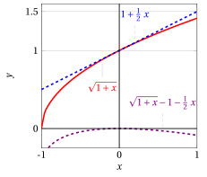
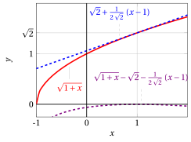
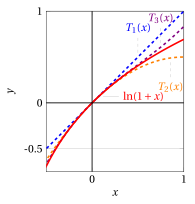
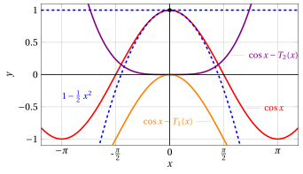
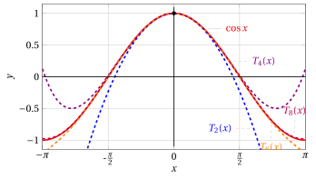
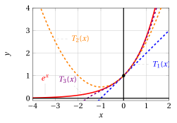
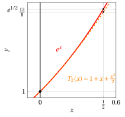

# Calcolo differenziale e approssimazioni

**Parte 4 · Derivate · Capitolo 8** · dalle dispense di Fabio Furini e Valerio Dose · [:material-file-pdf-box: PDF del capitolo](../pdf/derivate-08-approssimazioni.pdf)

## 1. Sviluppi asintotici al primo ordine

- Un'operazione molto frequente sia in matematica che nelle sue applicazioni è quella di approssimazione lineare di una data funzione derivabile (operazione anche chiamata sviluppo asintotico al primo ordine).

- Sia $f : (a, b) \rr  \R$ una funzione  derivabile in un punto $x_0 \in (a, b)$.  Consideriamo l'argomento $x_0 + dx$ dovuto all'incremento/decremento $dx$ rispetto a $x_0$. In conseguenza, i valori di $f$ subiscono  l'incremento/decremento:

    $$
    \Delta f(x_0) = f(x_0 + dx) - f(x_0)
    $$

    che, in generale,  fissato $x_0$, non è proporzionale a $dx$ ossia non è lineare rispetto a $dx$. L'incremento/decremento valutato lungo la retta tangente  è:

    $$
    df(x_0) = f(x_0)+f'(x_0) \; dx - f(x_0) = f'(x_0) \; dx
    $$

{ .fig .ovale loading=lazy style="width:97%" }

- Data una funzione $f$ derivabile in punto $x_0$ interno al suo dominio,  l'<strong>approssimazione lineare</strong>  consiste nell'approssimare l'incremento/decremento $\Delta f(x_0)$ dei valori della funzione dovuto a un incremento/decremento dell'argomento da $x_0$ a $x_0 + dx$, sostituendo la funzione con la sua retta tangente nel punto $\big(x_0,f(x_0)\big)$.

- L'idea che sta alla base dell'approssimazione lineare consiste quindi nello stimare  $\Delta f(x_0)$  con $df(x_0)$. Per avere buone approssimazione si considerano incrementi molto “piccoli” in valore assoluto, ovvero $|dx| \ll 1$.

!!! definizione "Definizione 1: differenziale di una funzione"

    Data una funzione  $f : (a, b) \rr  \R$, derivabile in un punto $x_0 \in (a,b)$, si chiama  <strong>differenziale</strong> di $f$ nel punto $x_0$ l'incremento/decremento $df(x_0)$ dei valori della  funzione da $x_0$ a $x_0+dx$ valutato lungo la retta tangente:

    $$
    df(x_0) = f'(x_0) \; dx
    $$

- Date due funzioni $f$ e $g$, le regole di calcolo dei differenziali sono analoghe a quelle di derivazione:

    $$
    d(f \pm g)(x_0) = df(x_0) \pm dg(x_0),~~~d(f \cdot g)(x_0) = g(x_0) \: df(x_0) + f(x_0) \; dg(x_0)
    $$

    $$
    d\left(\frac{f}{g} \right)(x_0) = \frac{g(x_0) \: df(x_0) - f(x_0) \; dg(x_0)}{g^2(x_0)}
    $$

- In tutti i tipi di approssimazione occorre fornire informazioni (qualitative o quantitative) sull'<strong>errore commesso</strong>. Qual è l'errore commesso nell'approssimazione? Quanto vale $\Delta f(x_0) - df(x_0)$?

    Per rispondere, osserviamo che $dx$ equivale a $x-x_0$, quindi abbiamo:

    $$
    \Delta f(x_0) = f(x_0 + x - x_0) - f(x_0) = f(x) - f(x_0)\qquad {\rm e} \qquad df(x_0) = f'(x_0) \; (x-x_0)
    $$

    Inoltre dalla definizione di derivata abbiamo:

    $$
    \lim_{x \rr x_0} \frac{f(x) - f(x_0)}{x-x_0} = f'(x_0) ~~~~\Rightarrow~~~~
     \lim_{x \rr x_0} \left(\frac{f(x) - f(x_0)}{x-x_0} -f'(x_0) \right)=0
    $$

    $$
    ~~~~\Rightarrow~~~~
     \lim_{x \rr x_0} \left(\frac{f(x) - f(x_0) -f'(x_0)(x-x_0) }{x-x_0}  \right)=0
    $$

    e dalla definizione di $o$ piccolo abbiamo:

    \begin{equation}
    \label{DIFF_bis}
     \underbrace{f(x) - f(x_0)}_{= \Delta f(x_0)} - \underbrace{f'(x_0)\; (x-x_0)}_{=df(x_0)} = o(x-x_0)  {\rm ~~~per~~~} x \rr x_0
    \end{equation}

    Quindi l'errore  $\Delta f(x_0) - df(x_0)$ tende a zero più rapidamente di $(x-x_0)$ per $x \rr x_0$.

!!! definizione "Definizione 2: sviluppo asintototico del primo ordine"

    Data una funzione  $f : (a, b) \rr  \R$, derivabile in un punto $x_0 \in (a,b)$, si chiama  <strong>asintototico del primo ordine</strong> o lineare di $f$ nel punto $x_0$ la seguente espressione:

    \begin{equation}
    \label{F}f(x)   = f(x_0) + f'(x_0)\; (x -x_0) + o\big(x - x_0 \big) {\rm ~~~per~~~} x \rr x_0
    \end{equation}

L'espressione \(\eqref{F}\) segue direttamente  dalla \(\eqref{DIFF_bis}\)  e nel caso $x_0=0$, abbiamo:

\begin{equation}
\label{DIFF_tris}
f(x)   = f(0) + f'(0)\; x + o(x) {\rm ~~~per~~~} x \rr 0
\end{equation}

!!! esempio "Esempio 1: sviluppi  asintotici al primo ordine o lineari e errori di approsimazione"

    Calcoliamo lo sviluppo asintotico al primo ordine o lineare per $x \rr 0$ di:

    $$
    f(x) = \sqrt{1+x}
    $$

    Abbiamo $x_0=0$ e inoltre:

    $$
    f'(x) = \frac{1}{2\; \sqrt{1+x} }, ~~f'(0) = \frac{1}{2}{\rm ~~~~e~~~~} f(0) = 1
    $$

    Quindi abbiamo il seguente sviluppo asintotico al primo ordine o lineare:

    $$
    \sqrt{1+x}   = 1+ \frac{1}{2} \; x + o(x)  {\rm ~~~per~~~} x \rr 0
    $$

    Inoltre l'errore commesso dall'approssimazione è:

    $$
    \underbrace{\sqrt{1+x}   - 1}_{=\Delta f(0) =f(x)-f(0)}- \underbrace{\frac{1}{2}\; x}_{=df(0)= f'(0)\; x} =  o(x)  {\rm ~~~per~~~} x \rr 0
    $$

    Graficamente abbiamo:

    { .fig .ovale loading=lazy style="width:70%" }

!!! esempio "Esempio 2: di sviluppi  asintotici al primo ordine o lineari"

    Calcoliamo lo sviluppo asintotico al primo ordine o lineare per $x \rr 1$ di:

    $$
    f(x) = \sqrt{1+x}
    $$

    Abbiamo $x_0=0$ e inoltre:

    $$
    f'(x) = \frac{1}{2\; \sqrt{1+x} }, ~~f'(1) = \frac{1}{2\sqrt{2}}{\rm ~~~~e~~~~} f(1) = \sqrt{2}
    $$

    Quindi abbiamo il seguente sviluppo asintotico al primo ordine o lineare:

    $$
    \sqrt{1+x}   = \sqrt{2}+ \frac{1}{2\; \sqrt{2}} \; (x-1) + o(x-1)  {\rm ~~~per~~~} x \rr 1
    $$

    Inoltre l'errore commesso dall'approssimazione è:

    $$
    \underbrace{\sqrt{1+x}   - \sqrt{2}}_{=\Delta f(1) =f(x)-f(1)}- \underbrace{\frac{1}{2\; \sqrt{2}}\; (x-1)}_{=df(1)= f'(1)\; (x-1)} =  o(x-1)  {\rm ~~~per~~~} x \rr 1
    $$

    Graficamente abbiamo:

    { .fig .ovale loading=lazy style="width:70%" }

## 2. Derivate di polinomi

- Un polinomio  di grado $n$ si può scrivere come:

    $$
    P_n(x) = \sum_{i=0}^n a_i \cdot x^i  \quad  {\rm ~~con~~} a_i \in \R,  {\rm ~per~~} i \in \{0,1,\dots,n\}, ~ {\rm ~~e~~} a_n \neq 0.
    $$

    Il valore $a_i$ è il <strong>coefficiente</strong> del monomio di grado $i$, con $i \in \{0,1,\dots,n\}$,  mentre $x^i$ è la <strong>parte letterale</strong> del monomio, una potenza intera positiva di $x$. Il valore $a_0$ è il <strong>termine noto</strong> (o la parte costante) del polinomio.

!!! chiave ""

    Le funzioni derivata prima e seconda di un polinomio di grado $n\ge 2$ sono:

    \begin{align*}
    P'_n(x) &= \sum_{i=1}^n  i \; a_{i} \; x^{i-1} &P''_n(x) &= \sum_{i=2}^n  (i-1) \cdot i \cdot a_{i} \; x^{i-2}\\[2ex]
    P'_n(0)&=a_1&P''_n(0)&=2\;a_2
    \end{align*}

!!! esempio "Esempio 3: derivata prima e derivata seconda di un polinomio"

    Consideriamo il seguente polinomio di grado $5$:

    $$
    P_5(x) = 10 + 7\; x + 3\; x^2  - 6\; x^3  + 4\; x^4  - 2\; x^5
    $$

    la funzione derivata prima è:

    $$
    P'_5(x) = \red{1} \cdot 7 \; x^{\red{1}-1} + \red{2} \cdot 3\; x^{\red{2}-1}  + \red{3} \cdot   (-6)\; x^{\red{3}-1}  + \red{4} \cdot  4\; x^{\red{4}-1}  + \red{5} \cdot (-2)\; x^{\red{5}-1}  = 7 + 6 \; x - 18 \; x^2 + 16 \;x^3 - 10 x^4
    $$

    $$
    P'_5(0) = 7
    $$

    la funzione derivata seconda è:

    $$
    P''_5(x) =  \blue{1} \cdot \red{2} \cdot 3\; x^{\red{2}-2}  + \blue{2} \cdot  \red{3} \cdot   (- 6)\; x^{\red{3}-2}  + \blue{3} \cdot \red{4} \cdot  4\; x^{\red{4}-2}  + \blue{4} \cdot \red{5} \cdot (-2)\; x^{\red{5}-2} =6 -36\; x+48 \;x^2 -40\; x^3
    $$

    $$
    P''_5(0) = 2\cdot 3 =6
    $$

!!! chiave ""

    La funzione derivata $k$-esima  di un polinomio di grado $n$ con $k \in \{0,1,\dots,n\}$ è:

    \begin{align*}
    P^{(k)}_n(x) &= \sum_{i=k}^n  \underbrace{(i-k+1)\cdot \cdots (i-2) \cdot (i-1) \cdot i}_{=\prod_{j=1}^{k} (i-j+1)} \;\; a_{i} \;\; x^{i-k}\\[2ex]
    P^{(k)}_n(0)&=k!\; a_k
    \end{align*}

!!! esempio "Esempio 4: derivata terza quarta e quinta   di un polinomio"

    Consideriamo il seguente polinomio di grado $5$:

    $$
    P_5(x) = 10 + 7\; x + 3\; x^2  - 6\; x^3  + 4\; x^4  - 2\; x^5
    $$

    la funzione derivata terza è:

    $$
    P^{(3)}_5(x) =  \blue{1} \cdot \blue{2} \cdot \red{3}  \cdot  (-6)\; x^{\red{3}-3}  + \blue{2} \cdot \blue{3} \cdot \red{4}  \cdot  4\; x^{\red{4}-3}  + \blue{3} \cdot \blue{4} \cdot \red{5} \cdot (-2)\; x^{\red{5}-3}  = -36 + 96 x - 120 x^2
    $$

    $$
    P^{(3)}_5(0) = 3!\cdot (-6) = 6 \cdot (-6) = -36
    $$

    la funzione derivata quarta è:

    $$
    P^{(4)}_5(x) =  \blue{1} \cdot \blue{2} \cdot \blue{3} \cdot \red{4} \cdot  4\; x^{\red{4}-4}  + \blue{2} \cdot \blue{3} \cdot \blue{4} \cdot \red{5} \cdot (-2)\; x^{\red{5}-4}  = 96 - 240 x
    $$

    $$
    P^{(4)}_5(0) = 4!\cdot 4 = 24 \cdot 4 = 96
    $$

    la funzione derivata quinta è:

    $$
    P^{(5)}_5(x) =   \blue{1} \cdot \blue{2} \cdot \blue{3} \cdot \blue{4} \cdot \red{5} \cdot (-2)\; x^{\red{5}-5}  = -240
    $$

    $$
    P^{(5)}_5(0) = 5!\cdot (-2) = 120 \cdot (-2) = -240
    $$

- Dato $x_0 \in \R$,  in maniera equivalente,   un  polinomio  di grado $n$ si può scrivere come:

    $$
    P_n(x) = \sum_{i=0}^n a_i \cdot (x-x_0)^i  \quad  {\rm ~~con~~} a_i \in \R,  {\rm ~per~~} i \in \{0,1,\dots,n\}, ~ {\rm ~~e~~} a_n \neq 0.
    $$

    La funzione derivata $k$-esima  $k \in \{0,1,\dots,n\}$ è  in questo caso:

    \begin{align*}
    P^{(k)}_n(x) &= \sum_{i=k}^n  (i-k+1)\cdot \cdots (i-2) \cdot (i-1)\cdot i \cdot a_{i} \cdot (x-x_0)^{i-k}\\[2ex]
    P^{(k)}_n(x_0)&=k!\cdot a_k
    \end{align*}

## 3. Formula/sviluppo di Taylor con resto secondo Peano

- L'approssimazione lineare (o per linearizzazione) approssima una funzione con la sua retta tangente in un punto $\big(x_0,f(x_0)\big)$ ovvero un polinomio di primo grado che ha la derivata uguale a quella della funzione nel punto $x_0$ e come termine costante il valore della funzione in $x_0$.

    !!! chiave ""

        Per semplicità cominciamo a ragionare con $x_0=0$.

- Con i polinomi di primo grado abbiamo:

    $$
    P_1(x) = a_0 + a_1 \; x,~~~~ P'_1(x)= a_1, {\rm ~~~fissando~~~} a_0 = f(0) {\rm ~~e~~} a_1 = f'(0)
    $$

    dalla \(\eqref{F}\) si ottiene lo sviluppo asintotico al primo ordine:

    $$
    f(x) = \underbrace{a_0}_{=f(0)} + \underbrace{a_1}_{=f'(0)} \; x  + o(x)
    $$

    e l'errore commesso utilizzando il polinomio di primo grado al posto della funzione:

    $$
    \underbrace{f(x) - a_0}_{\Delta f(0)} - \underbrace{a_1 \; x}_{df(0)} = o(x)
    $$

    tende a zero più velocemente di una qualsiasi funzione lineare.

- Vogliamo ora generalizzare il procedimento di “<strong>approssimazione lineare</strong>” a quello di “<strong>approssimazione polinomiale</strong>”.

!!! chiave ""

    Ci chiediamo: data una funzione, derivabile tutte le volte che sarà necessario, esiste un polinomio di grado $n\ge 2$ che, nell'intorno di un punto fissato, approssima la funzione “meglio” della sua retta tangente? <strong>Procediamo in due steps</strong>.

<u><strong>Primo step</strong></u>

- Individuiamo un polinomio candidato  ad approssimare “bene” la funzione, cercando un polinomio che abbia tutte le derivate fino all'ordine $n$ uguali a quelle della funzione $f$, nel punto $x_0 = 0$.  Il polinomio deve essere di grado $n$ per avere la derivata $n$-esima uguale a $f^{(n)} (0)$.

!!! teorema "Teorema 1: del polinomio di MacLaurin"

    Data una funzione $f:(a,b)\rr \R$ derivabile $n-1$ volte in $(a,b)$ e $n$ volte in $0 \in (a,b)$, esiste uno e un solo polinomio $T_{n,f}$ di grado $\le n$ con la proprietà che:

    $$
    T_{n,f}(0) = f(0),~~T'_{n,f}(0) = f'(0),~~\dots~~,~~T^{(n)}_{n,f}(0) = f^{(n)}(0)
    $$

    e questo polinomio, detto <strong>polinomio di  MacLaurin</strong> di $f$ di grado $n$, è:

    \begin{align*}
    T_{n,f}(x) & = \sum_{k=0}^n  \frac{f^{(k)}(0)}{k!} \; x^k \qquad ({\rm posto ~~}f^{(0)}=f)
    \end{align*}

??? dimostrazione "Dimostrazione"

    Dimostriamo che il polinomio di  MacLaurin di una funzione  $f$ che rispetti le ipotesi del teorema ha le stesse derivate in 0 della funzione  fino all'ordine $n$. La derivata  $k$-esima in $x_0=0$ del polinomio di  MacLaurin di grado $n$, con $k \in \{0,1,\dots,n\}$,  è:

    $$
    T^{(k)}_{n,f}(0)=k!\cdot \frac{f^{(k)}(0)}{k!} = f^{(k)}(0) {\rm ~~~~~~e~~con~~~} k=0 {\rm ~~~abbiamo~~~} T_{n,f}(0) = f(0)
    $$

    Quindi tutte le derivate in 0 fino all'ordine $n$ sono uguali a quelle della funzione $f$ (e ha lo stesso valore della funzione in $0$).

    Dimostriamo ora che tale polinomio è unico. Consideriamo ora un polinonio generico di grado $n$:

    $$
    P_n(x) = \sum_{i=0}^n a_i \cdot x^i  \quad  {\rm ~~con~~} a_i \in \R,  {\rm ~per~~} i=0,1,\dots,n, ~ {\rm ~~e~~} a_n \neq 0.
    $$

    La sua derivata  $k$-esima in $x_0=0$, con $k \in \{0,1,\dots,n\}$,  è

    $$
    P^{(k)}_n(0)=k!\cdot a_k
    $$

    Dunque se il polinomio ha la stessa derivata $k$-esima della funzione si ha:

    $$
    k!\cdot a_k = f^{(k)}(0) {\rm ~~~che~implica~~~} a_k = \frac{f^{(k)}(0)}{k!}
    $$

    ovvero i coefficienti del polinomio di  MacLaurin. □

!!! chiave ""

    La scrittura estesa del polinomio di MacLaurin di grado $n$ di una funzione $f$ è:

    \begin{align*}
    T_{n,f}(x) & = f(0) + f'(0)  \; x + \frac{1}{2} \; f''(0)  \; x^2 + \frac{1}{3!} \; f'''(0) \; x^3  + {\rm \dots} + \frac{1}{n!} \; f^{(n)}(0) \; x^n
    \end{align*}

- Quando è chiara la funzione a cui si fa riferimento, per comodità omettiamo il pedice $f$ del polinomio di  MacLaurin e scriviamo seimplicemente $T_{n}(x)$.

!!! esempio "Esempio 5: Calcolo del polinomio di MacLaurin"

    Calcoliamo il polinomio di MacLaurin di grado 3 della funzione

    $$
    f(x) = \log (1 + x)
    $$

    Abbiamo $f(0)=0$ e per le derivate abbiamo:

    $$
    f^{(1)}(x)=\frac{1}{1+x},~f^{(1)}(0)=1,~~~~f^{(2)}(x)=-\frac{1}{(1+x)^2},~f^{(2)}(0)=-1,~~~~f^{(3)}(x)=\frac{2}{(1+x)^3},~ f^{(3)}(0)=2
    $$

    Quindi il polinomio di MacLaurin di grado 3 della funzione è:

    $$
    T_3(x)=0+ 1\; x + \frac{1}{2} 
    \; (-1) \; x^2 +  \frac{1}{6} \; 2 \; x^3 = x - \frac{1}{2} 
    \; x^2 +  \frac{1}{3}  \; x^3
    $$

    { .fig .ovale loading=lazy style="width:52%" }

    La derivata quarta è:

    $$
    ~~~f^{(4)}(x)=-\frac{6}{(1+x)^4},~~~~ f^{(4)}(0)=-6
    $$

    Generalizzando alla derivata $n$-esima, ne segue che il polinomio di MacLaurin di grado $n$ della funzione è:

    \begin{align*}
    T_{n}(x) &= x - \frac{x^2}{2}+ \frac{x^3}{3} - \frac{x^4}{4}+ {\rm \dots} + (-1)^{n-1} \frac{x^n}{n}
    \end{align*}

!!! esempio "Esempio 6: Calcolo del polinomio di MacLaurin"

    Calcoliamo il polinomio di MacLaurin di grado 3 della funzione

    $$
    f(x) = (1 + x)^{\alpha}
    $$

    Abbiamo $f(0)=1$ e per le derivate abbiamo:

    $$
    f^{(1)}(x)=\alpha \; (1 + x)^{\alpha-1},~f^{(1)}(0)=\alpha,~~~~f^{(2)}(x)=(\alpha-1)\alpha \; (1 + x)^{\alpha-2},~f^{(2)}(0)=(\alpha-1)\alpha
    $$

    $$
    f^{(2)}(x)=(\alpha-2)(\alpha-1)\alpha \; (1 + x)^{\alpha-3},~f^{(3)}(0)=(\alpha-2)(\alpha-1)\alpha
    $$

    Quindi il polinomio di MacLaurin di grado 3 della funzione è:

    $$
    T_3(x)=1+ \alpha\; x + \frac{\alpha\;(\alpha-1)}{2}\; x^2 + \frac{\alpha\;(\alpha-1)\;(\alpha-2)}{3!}\; x^3
    $$

    Ad esempio con $\alpha = \frac{3}{2}$ abbiamo:

    $$
    T_3(x)=1+ \frac{3}{2}\; x + \frac{3}{8}\; x^2 - \frac{1}{16} \; x^3
    $$

    { .fig .ovale loading=lazy style="width:52%" }

    La derivata quarta è:

    $$
    f^{(4)}(x)=(\alpha-3)(\alpha-2)(\alpha-1)\alpha \; (1 + x)^{\alpha-4},~~~~f^{(4)}(0)=(\alpha-3)(\alpha-2)(\alpha-1)\alpha
    $$

    Generalizzando alla derivata $n$-esima, ne segue che il polinomio di MacLaurin di grado $n$ della funzione è:

    \begin{align*}
    T_{n}(x) &= 1 +  \alpha\; x + \frac{\alpha\;(\alpha-1)}{2}\; x^2 +  \frac{\alpha\;(\alpha-1)\;(\alpha-2)}{3!}\; x^3 +{\rm \dots} + \frac{\alpha\;(\alpha-1)\cdots(\alpha-n+1)}{n!}\; x^n
    \end{align*}

<u><strong>Secondo step</strong></u>

- Proviamo ora che il polinomio di MacLaurin approssima “bene” $f (x)$, in un intorno di $x_0 = 0$. Precisamente, vale il seguente teorema:

!!! teorema "Teorema 2: della formula di McLaurin all'ordine $n$ con resto secondo Peano"

    Sia $f: (a, b) \rr  \R$ , derivabile $n-1$ volte in $(a,b)$ e $n$ volte in $0 \in (a,b)$. Allora

    $$
    f(x) = T_{n,f}(x) + o \big( x^n \big) {\rm ~~per~~} x \rr 0
    $$

- La formula ha la struttura: <strong>funzione da approssimare uguale al polinomio approssimante più l'errore di approssimazione</strong>. L'errore  è il termine $o \big( x^n \big)$ e viene detto resto secondo Peano. Per $x \rr 0$, l'errore è tanto più piccolo quanto maggiore è $n$.

!!! esempio "Esempio 7: degli errori delle approssimazioni polinomiali"

    Consideriamo $f(x) = \cos x$, abbiamo:

    $$
    f(0)   = 1,~~ f^{(1)}(x) = -\sin x, ~~f^{(1)}(0)= 0, ~~f^{(2)} = -\cos x, ~~f^{(2)}(0)= -1
    $$

    I polinomi di MacLaurin di primo e secondo grado e gli errori di approssimazione sono:

    $$
    T_1(x) = 1,~~~T_2(x) = 1 - \frac{1}{2} x^2,~~~~~~\cos x -1 =  o(x) {\rm ~~~e~~~} \cos x -1 + \frac{1}{2} \: x^2 = o(x^2)
    $$

    { .fig .ovale loading=lazy style="width:90%" }

    Il polinomio  di secondo grado $T_2(x)$ approssima la funzione $\cos x$ vicino a $x_0=0$ “meglio” del polinomio di primo grado $T_1(x)$. Lo scarto tra la funzione e $T_2(x)$ tende a zero più rapidamente di $x^2$; mentre lo scarto con $T_1(x)$ solo più rapidamente di $x$.

??? dimostrazione "Dimostrazione"

    Proviamo il teorema nel caso $n=2$, ossia:

    $$
    f(x)= f(0) +  f'(0)\; x + \frac{1}{2} \; f''(0) \; x^2   + o\big(x^2\big) {\rm ~~per~~} x \rr 0
    $$

    Occorre quindi provare che:

    $$
    f(x) - \left( f(0) + f'(0) \; x + \frac{1}{2} \; f''(0)  \; x^2\right) = o\big(x^2\big) {\rm ~~per~~} x \rr 0
    $$

    ossia (per definizione di $o$ piccolo) che:

    $$
    \lim_{x \rr 0} \frac{f(x) - \left( f(0) + f'(0) \; x + \frac{1}{2} \; f''(0)  \;x^2 \right)}{x^2} = 0
    $$

    Questo limite dà una forma di indeterminazione $[0/0]$, applichiamo ora il teorema di  De L'Hospital e otteniamo:

    $$
    \lim_{x \rr 0} \frac{f(x) - \left( f(0) + f'(0) \; x  + \frac{1}{2} \; f''(0) \; x^2 \right)}{x^2} = \lim_{x \rr 0} \frac{f'(x) - \left( f'(0) +  f''(0)  \; x\right)}{2\;x}
    $$

    che è ancora in forma indeterminata $[0/0]$. Applichiamo ancora il teorema di  De L'Hospital e otteniamo:

    $$
    \lim_{x \rr 0} \frac{f'(x) - \left( f'(0) +  f''(0) \; x \right)}{2\;x} = \lim_{x \rr 0} \frac{f''(x)  - f''(0)}{2} =0
    $$

    il limite fa $0$ aggiungendo l'ipotesi che $f''(x)$ sia continua in $x=0$.

    Vediamo come procedere anche senza chiedere la continuità in 0 di $f''$ e proviamo direttamente che:

    $$
    \frac{1}{2} \lim_{x \rr 0} \frac{f'(x) - \left( f'(0) +  f''(0)  \; x\right)}{x} =0
    $$

    Per ipotesi, $f$ è derivabile due volte in 0, quindi $f'$ è derivabile; se applichiamo l'approssimazione lineare (equazione \(\eqref{DIFF_tris}\))  alla funzione $f'(x)$ otteniamo:

    $$
    f'(x)   = f'(0) + f''(0)\; x + o(x) {\rm ~~~per~~~} x \rr 0
    $$

    quindi segue che (definizione di $o$ piccolo):

    $$
    \frac{f'(x) - \left( f'(0) +  f''(0)  \; x\right)}{x} \rr 0 {\rm ~~~per~~~} x \rr 0
    $$

    
□

??? dimostrazione "Dimostrazione"

    Il caso generale ($n$ qualsiasi) si può dimostrare per induzione su $n$. Abbiamo già provato che la tesi vale per $n = 2$.

    Supponiamo ora di sapere che per qualsiasi funzione derivabile $n - 1$ volte in $x=0$ vale la formula di MacLaurin, e proponiamoci di dimostrare che

    \begin{equation}
    \label{VVV}
    f(x)= T_{n,f}(x)  + o\big(x^n\big) {\rm ~~per~~} x \rr 0 {\rm ~~~ossia~~} \lim_{x \rr 0} \frac{f(x) - T_{n,f}(x)}{x^n} = 0
    \end{equation}

    Applicando il teorema di De L'Hospital, abbiamo:

    \begin{equation}
    \label{NNN}
    \lim_{x \rr 0} \frac{f'(x) - T'_{n,f}(x)}{n\; x^{n-1}}
    \end{equation}

    Osserviamo ora che la derivata del polinomio $T_{n,f}(x)$ di $f$ non è altro che il polinomio $T_{n-1,f'}(x)$ della funzione $f'$:

    $$
    T'_{n,f}(x) = T_{n-1,f'}(x)
    $$

    come si verifica direttamente dalla definizione di $T_{n,f}$. D'altro canto, per l'ipotesi induttiva, applicata alla funzione $f'$, sappiamo che

    $$
    f'(x) = T_{n-1,f'}(x) + o \big( x^{n-1} \big) {\rm ~~per~~} x \rr 0 {\rm ~~~ossia~~} \lim_{x \rr 0} \frac{f'(x) - T_{n-1,f'}(x)}{x^{n-1}} = 0
    $$

    quindi il limite \(\eqref{NNN}\) è zero e, per il teorema di De L'Hospital, anche il limite \(\eqref{VVV}\) è zero, come volevamo dimostrare. □

!!! esempio "Esempio 8: di calcolo dei polinomi di MacLaurin"

    Per comprendere meglio l'uguaglianza:

    $$
    T'_{n,f}(x) = T_{n-1,f'}(x)
    $$

    consideriamo un funzione $f$, il suo polinomio di MacLaurin ad esempio di grado $3$ è:

    $$
    T_{3,f}(x)  = f(0) + f'(0)  \; x + \frac{1}{2} \; f''(0)  \; x^2 + \frac{1}{3!} \; f'''(0) \; x^3
    $$

    e la derivata del polinomio $T_{3,f}(x)$ è:

    $$
    T'_{3,f}(x)  =  f'(0)   +  f''(0)  \; x + \frac{1}{2} \; f'''(0) \; x^2
    $$

    Consideriamo ora la sua funzione derivata $f'(x)$ e calcoliamo il suo polinomio di MacLaurin di grado $2$:

    $$
    T_{2,f'}(x)  =  f'(0)   +  f''(0)  \; x + \frac{1}{2} \; f'''(0) \; x^2
    $$

    ovvero otteniamo il medesimo polinomio, il ragionamento si estende facilmente al grado $n$.

- La derivata $T'_{n,f}(x)$ del polinomio di MacLaurin $T_{n,f}(x)$ di $f$ è il polinomio di MacLaurin $T_{n-1,f'}(x)$ di grado $n-1$ della funzione  derivata $f'$, ovvero:

    \begin{align*}
    T'_{n,f}(x)  &= \sum_{k=1}^n  k\;\frac{f^{(k)}(0)}{k!} \; x^{k-1} = \sum_{k=1}^n  \frac{f^{(k)}(0)}{(k-1)!} \; x^{k-1}  = \sum_{k=0}^{n-1}  \frac{f^{(k+1)}(0)}{(k)!} \; x^{k} = T_{n-1,f'}(x)
    \end{align*}

!!! esempio "Esempio 9: formula o sviluppo di MacLaurin del seno"

    Consideriamo

    $$
    f(x) = \sin x
    $$

    $f(0)=0$ e inoltre abbiamo:

    $$
    f^{(1)}(x)=\cos x,~~f^{(2)}(x)=-\sin x,~~f^{(3)}(x)=-\cos x,~~f^{(4)}(x)=\sin x=f(x),~~f^{(5)}(x)=\cos x=f^{(1)}(x)  \dots
    $$

    Ne segue che le derivate di ordine $2k$ (pari) sono nulle per $x = 0$, mentre quelle di ordine $2k+1$ (dispari)  sono alternativamente $+1$ e $- 1$ per $x = 0$. I polinomi di MacLaurin della funzione seno contengono perciò solo termini di grado dispari:

    \begin{align*}
    \sin x &= T_1(x) + o(x)= x + o(x)  &{\rm ~~~per~~~}  x \rr 0\\[2ex]
    \sin x &= T_3(x) + o(x^3)= x - \frac{x^3}{6}+ o(x^3)  &{\rm ~~~per~~~}  x \rr 0\\[2ex]
    \sin x &= T_5(x) + o(x^5)= x - \frac{x^3}{6} + \frac{x^5}{120} + o(x^5)  &{\rm ~~~per~~~}  x \rr 0\\[2ex]
    \sin x &= T_7(x) + o(x^7)= x - \frac{x^3}{6} + \frac{x^5}{120} - \frac{x^7}{5040} + o(x^7)  &{\rm ~~~per~~~}  x \rr 0
    \end{align*}

    Graficamente i polinomi di MacLaurin per la funzione $f(x) = \sin x$ sono:

    { .fig .ovale loading=lazy style="width:90%" }

!!! esempio "Esempio 10: formula o sviluppo di MacLaurin del coseno"

    Consideriamo

    $$
    f(x) = \cos x
    $$

    $f(0)=1$ e inoltre abbiamo:

    $$
    f^{(1)}(x)=-\sin x,~~f^{(2)}(x)=-\cos x,~~f^{(3)}(x)=\sin x,~~f^{(4)}(x)=\cos x=f(x),~~f^{(5)}(x)=-\sin x=f^{(1)}(x)  \dots
    $$

    Ne segue che le derivate di ordine $2k+1$ (dispari) sono nulle per $x = 0$, mentre quelle di ordine $2k$ (pari)  sono alternativamente $-1$ e $+1$ per $x = 0$. I polinomi di MacLaurin della funzione coseno contengono perciò solo termini di grado pari:

    \begin{align*}
    \cos x &= T_2(x) + o(x^2)= 1 - \frac{1}{2} \; x^2 + o(x^2)  &{\rm ~~~per~~~}  x \rr 0\\[2ex]
    \cos x &= T_4(x) + o(x^4)= 1 - \frac{1}{2} \; x^2  + \frac{x^4}{24} + o(x^4)  &{\rm ~~~per~~~}  x \rr 0\\[2ex]
    \cos x &= T_6(x) + o(x^6)= 1 - \frac{1}{2} \; x^2  + \frac{x^4}{24} - \frac{x^6}{720} + o(x^6)  &{\rm ~~~per~~~}  x \rr 0\\[2ex]
    \cos x &= T_8(x) + o(x^8)= 1 - \frac{1}{2} \; x^2  + \frac{x^4}{24} - \frac{x^6}{720} + \frac{x^8}{40320} + o(x^8)  &{\rm ~~~per~~~}  x \rr 0
    \end{align*}

    Graficamente i polinomi di MacLaurin per la funzione $f(x) = \cos x$ sono:

    { .fig .ovale loading=lazy style="width:90%" }

!!! esempio "Esempio 11: formula o sviluppo di MacLaurin"

    Consideriamo:

    $$
    f(x) = e^x {\rm ~~~abbiamo~~~}
     f^{(n)}(x) = e^x {\rm ~~e~~} f^{(n)}(0)=1, ~~~ \forall n \in \N, n \ge 1
    $$

    Quindi:

    $$
    e^x = T_{n}(x) + o \big(~ x^n \big) = 1 + x + \frac{x^2}{2} + \frac{x^3}{3!} + \dots + \frac{x^n}{n!} + o \big(~ x^n \big) {\rm ~~~per~~~}  x \rr 0
    $$

    { .fig .ovale loading=lazy style="width:70%" }

!!! esempio "Esempio 12: Calcolo dei limiti con lo sviluppo di MacLaurin"

    Vogliamo calcolare:

    $$
    \lim_{x \rr 0} \frac{1 - \cos x}{x^2}=\left[\frac{0}{0}\right]
    $$

    Sviluppando la funzione al primo ordine $\cos x = 1 + o(x)$, abbiamo:

    $$
    \lim_{x \rr 0} \frac{1 - \big(1 + o(x)\big)}{x^2}=\lim_{x \rr 0} \frac{o(x)}{x^2}
    $$

    Il simbolo $o(x)$ per $x \rr 0$ indica l'insieme delle funzioni che divise per $x$ tendono a 0 per $x \rr 0$. Quindi ad esempio $5\;x^2=o(x)$ ma anche $x^3=o(x)$ e il valore del limite non può ancora essere determinato. Sviluppando la funzione al secondo ordine  $\cos x = 1 - \frac{1}{2}\; x^2 +o(x^2)$, abbiamo:

    $$
    \lim_{x \rr 0} \frac{1 - \cos x}{x^2}= \lim_{x \rr 0} \frac{1 - \big(1 - \frac{1}{2}\; x^2 +o(x^2) \big)}{x^2}  = \lim_{x \rr 0} \frac{ \frac{1}{2}\; x^2 +o(x^2)}{x^2} = \lim_{x \rr 0} \frac{ \frac{1}{2}\; x^2 +o(x^2)}{x^2}= \lim_{x \rr 0} \frac{1}{2}+ \underbrace{\frac{ o(x^2)}{x^2}}_{\rr 0} = \frac{1}{2}
    $$

    Il simbolo $o(x^2)$ per $x \rr 0$ indica l'insieme di funzioni che divise per $x^2$ tendono a 0 per $x \rr 0$, quindi il secondo termine tende a 0 per $x \rr 0$.  In maniera equivalente $\frac{ o(x^2)}{x^2}= o(1)$ ovvero una generica funzione che tende a 0 per $x \rr 0$.

!!! esempio "Esempio 13: Calcolo dei limiti con lo sviluppo di MacLaurin"

    Vogliamo calcolare:

    $$
    \lim_{x \rr 0} \frac{e^x - e^{-x} -2\;x}{x -\sin x}=\left[\frac{0}{0}\right]
    $$

    Sviluppando le funzioni al primo ordine abbiamo:

    $$
    \lim_{x \rr 0} \frac{e^x - e^{-x} -2\;x}{x -\sin x}=\lim_{x \rr 0} \frac{1+x+o(x)-\big(1-x+o(x)\big)-2\;x}{x - (x + o(x))} = \lim_{x \rr 0} \frac{o(x)}{o(x)}
    $$

    Il simbolo $o(x)$ per $x \rr 0$ indica l'insieme delle funzioni che divise per $x$ tendono a 0 per $x \rr 0$. Quindi ad esempio $5\;x^2=o(x)$ ma anche $x^3=o(x)$ e il valore del limite non può ancora essere determinato. Sviluppando le funzioni al secondo ordine abbiamo:

    $$
    \lim_{x \rr 0} \frac{e^x - e^{-x} -2\;x}{x -\sin x}=\lim_{x \rr 0} \frac{1+x+\frac{x^2}{2}+o(x^2)-\big(1-x+\frac{x^2}{2}+o(x^2)\big)-2\;x}{x - (x + o(x^2))} = \lim_{x \rr 0} \frac{o(x^2)}{o(x^2)}
    $$

    Il limite è ancora non risolubile, sviluppando le funzioni al terzo ordine abbiamo:

    \begin{align*}
    \lim_{x \rr 0} \frac{e^x - e^{-x} -2\;x}{x -\sin x}&=\lim_{x \rr 0} \frac{1+x+\frac{x^2}{2}+\frac{x^3}{6}+o(x^3)-\big(1-x+\frac{x^2}{2}-\frac{x^3}{6}+o(x^3)\big)-2\;x}{x - \big(x -\frac{x^3}{6} + o(x^3)\big)} \\[2ex]
    & =\lim_{x \rr 0} \frac{\frac{x^3}{3} + o(x^3)}{\frac{x^3}{6} + o(x^3)} = \lim_{x \rr 0} \frac{x^3 \left(\frac{1}{3} +{\frac{o(x^3)}{x^3}} \right)}{x^3 \left(\frac{1}{6} + {\frac{o(x^3)}{x^3}} \right)} =\lim_{x \rr 0} \frac{\frac{1}{3} + o(1)}{\frac{1}{6} + o(1)} = 2
    \end{align*}

!!! esempio "Esempio 14: Calcolo del polinomio di MacLaurin"

    Calcolare il polinomio di MacLaurin di grado 4 della funzione

    $$
    f(x) = \log (1 + \sin x)
    $$

    I polinomi di MacLaurin di grado 4 delle funzioni $\sin x$ e $\log (1+x)$ sono:

    $$
    \sin x=  x - \frac{x^3}{6},~~~
    \log (1+x)=  x - \frac{x^2}{2}+ \frac{x^3}{3} - \frac{x^4}{4}
    $$

    Quindi, sostituendo, il polinomio di MacLaurin della funzione $f(x)$ è:

    \begin{align*}
    T_4(x) &= \left(x - \frac{x^3}{6}\right) - \frac{\left( x - \frac{x^3}{6} \right)^2}{2}+ \frac{\left( x - \frac{x^3}{6} \right)^3}{3} - \frac{\left( x - \frac{x^3}{6} \right)^4}{4}
    \end{align*}

    Abbiamo $\left( x - \frac{x^3}{6} \right)^2= x^2 - \frac{2 x^4}{6} + \frac{x^6}{36}$ e l'ultimo termine ha grado superiore a 4. Visto che cerchiamo solo i termini fino al grado 4 scartiamo l'ultimo addendo. Facendo lo stesso ragionamento con gli altri numeratori abbiamo:

    \begin{align*}
    T_4(x) &= x - \frac{x^3}{6} - \frac{ x^2 - \frac{2 x^4}{6} }{2}+ \frac{x^3}{3} - \frac{x^4}{4} = x - \frac{x^2}{2} + \frac{x^3}{6} - \frac{x^4}{12}
    \end{align*}

!!! chiave ""

    Formule o sviluppi di MacLaurin di alcune funzioni elementari, con il resto di Peano per $x \rr 0$:

    \begin{align*}
    e^x&= 1 + x + \frac{x^2}{2!} + {\rm \dots} + \frac{x^n}{n!} + o\big(x^n\big)\\[2ex]
    \log(1+x) &= x - \frac{x^2}{2}+ \frac{x^3}{3} + {\rm \dots} + (-1)^{n-1} \frac{x^n}{n} + o\big(x^n\big)\\[2ex]
    (1+x)^{\alpha} &= 1 +  \alpha\; x + \frac{\alpha\;(\alpha-1)}{2}\; x^2 + {\rm \dots} + \frac{\alpha\;(\alpha-1)\dots(\alpha-n+1)}{n!}\; x^n + o\big(x^n\big),~ \forall \alpha \in \R\\[2ex]
    \sin x&= x - \frac{x^3}{3!}+ \frac{x^5}{5!} + {\rm \dots} + (-1)^n\;\frac{x^{2\:n+1}}{(2\:n+1)!} + o\big(x^{2\:n+1}\big) \\[2ex]
    \cos x&= 1 - \frac{x^2}{2!}+ \frac{x^4}{4!} + {\rm \dots} + (-1)^n\;\frac{x^{2\:n}}{(2\:n)!} + o\big(x^{2\:n}\big)\\[2ex]
    \sinH x&= x + \frac{x^3}{3!}+ \frac{x^5}{5!} + {\rm \dots} + \frac{x^{2\:n+1}}{(2\:n+1)!} + o\big(x^{2\:n+1}\big) \\[2ex]
    \cosH x&= 1 + \frac{x^2}{2!}+ \frac{x^4}{4!} + {\rm \dots} +\frac{x^{2\:n}}{(2\:n)!} + o\big(x^{2\:n}\big)
    \end{align*}

    Gli sviluppi chiaramente valgono anche sostituendo a $x$ una qualsiasi funzione $\varepsilon(x)$ che tende a 0, ovvero un infinitesimo (non importa per cosa tenda $x$ in questo caso).

- Tutto questo discorso si può generalizzare ad un punto $x_0 \neq 0$.  Le dimostrazioni sono analoghe a quelle precedenti e sono lasciate per esercizio.

!!! teorema "Teorema 3: del polinomio di Taylor"

    Data una funzione $f:(a,b)\rr \R$ derivabile $n-1$ volte in $(a,b)$ e $n$ volte in $x_0 \in (a,b)$, esiste uno e un solo polinomio $T_{n,f,x_0}$ di grado $\le n$ con la proprietà che:

    $$
    T_{n,f,x_0}(x_0) = f(x_0),~~T'_{n,f,x_0}(x_0) = f'(x_0),~~\dots~~,~~T^{(n)}_{n,f,x_0}(x_0) = f^{(n)}(0)
    $$

    e questo polinomio, detto <strong>polinomio di Taylor</strong> di $f$ di grado $n$, è:

    \begin{align*}
    T_{n,f,x_0}(x)  = \sum_{k=0}^n  \frac{f^{(k)}(x_0)}{k!} \; (x-x_0)^k \qquad ({\rm posto ~~}f^{(0)}=f)
    \end{align*}

!!! chiave ""

    La scrittura estesa del polinomio di Taylor di grado $n$ di una funzione $f$ in $x_0$ è:

    \begin{align*}
    T_{n,f,x_0}(x)  =& f(x_0) + f'(x_0)  \; (x-x_0) + \frac{1}{2} \; f''(x_0)  \; (x-x_0)^2 + \frac{1}{3!} \; f'''(x_0) \; (x-x_0)^3  + ~\dots~ \\[2ex] &+ \frac{1}{n!} \; f^{(n)}(x_0)(x-x_0)^n
    \end{align*}

- Quando è chiara la funzione a cui si fa riferimento, per comodità omettiamo il pedice $f$ del polinomio di  Taylor e scriviamo seimplicemente $T_{n,x_0}(x)$.

!!! teorema "Teorema 4: della formula di Taylor all'ordine $n$ con resto secondo Peano"

    Sia $f: (a, b) \rr  \R$ , derivabile $n-1$ volte in $(a,b)$ e $n$ volte in $x_0 \in (a,b)$. Allora

    $$
    f(x) = T_{n,f,x_0}(x) + o \big(~ (x-x_0)^n \big) {\rm ~~per~~} x \rr x_0
    $$

!!! esempio "Esempio 15: formula o sviluppo di Taylor"

    Consideriamo $x_0=1$ e :

    $$
    f(x) = e^x {\rm ~~~abbiamo~~~}
     f^{(n)}(x) = e^x {\rm ~~e~~} f^{(n)}(1)=e, ~~~ \forall n \in \N, n \ge 1
    $$

    Quindi:

    $$
    e^x = T_{n,1}(x) + o \big(~ (x-1)^n \big) = e + e\:(x-1) + e\:\frac{(x-1)^2}{2} + e\:\frac{(x-1)^3}{3!} + \dots + e\: \frac{(x-1)^n}{n!} + o \big(~ (x-1)^n \big) {\rm ~~~per~~~}  x \rr 1
    $$

    { .fig .ovale loading=lazy style="width:55%" }

## 4. Formula/sviluppo di Taylor con resto secondo Lagrange

- Nella formula di Taylor-MacLaurin con resto secondo Peano l'informazione che abbiamo sull'errore commesso nell'approssimare $f$ col suo polinomio di Taylor- MacLaurin è di <strong>tipo dinamico</strong>: al tendere a zero dell'incremento $(x - x_0 )$, sappiamo che il resto tende a zero più rapidamente di $(x - x_0 )^n$.

!!! chiave ""

    Per un valore fissato dell'incremento $(x - x_0 )$ la formula di Taylor-MacLaurin con resto secondo Peano non dice nulla sull'entità dell'errore commesso.

- In varie questioni di calcolo approssimato è essenziale invece stimare l'errore che si commette approssimando una funzione col suo polinomio di Taylor, quando l'incremento $(x - x_0 )$ ha un valore fissato, o un valore che non supera una soglia fissata.

- A questo tipo di problema risponde il prossimo risultato, che dà un modo alternativo di quantificare l'errore di approssimazione commesso.

!!! teorema "Teorema 5: della formula di Taylor all'ordine $n$ con resto secondo Lagrange"

    Sia $f: [a, b] \rr  \R$ , derivabile $n+1$ volte in $[a, b]$ e sia $x_0 \in [a,b]$. Allora esiste un punto $c$ compreso tra $x_0$ e $x$ tale che:

    \begin{equation}
    f(x) = T_{n,f,x_0}(x) +  \frac{f^{(n+1)}(c)}{(n+1)!} \;(x-x_0)^{n+1}  \label{JJJ}
    \end{equation}

- La formula ha la struttura: <strong>funzione da approssimare uguale al polinomio approssimante più l'errore di approssimazione</strong>. L'errore  è il termine $\frac{f^{(n+1)}(c)}{(n+1)!} \;(x-x_0)^{n+1}$ e viene detto resto secondo Lagrange.

- Per $n =0$, il teorema coincide col teorema di Lagrange, ponendo $x_0=a$ e $b=x$ abbiamo:

    $$
    \exists c \in [a,b]: f(b) = f(a) + f'(c)\: (b-a) {\rm ~~ovvero ~~} \frac{f(b)-f(a)}{b-a}=f'(c)
    $$

    che e'  il teorema di Lagrange.  Attenzione: l'intervallo da $(a,b)$ diventa $[a,b]$.

!!! chiave ""

    Il punto $c$ dipende da $x_0$, $x$ e $n$, ed è compreso tra $x_0$ e $x$. Se si riesce a dimostrare che

    \begin{equation}
    \label{FFFF}
    |f^{(n+1)}(t)| \le M, ~~~ \forall t \in [x_0,x]
    \end{equation}

    allora la formula di Taylor con resto secondo Lagrange dice che

    \begin{equation}
    |f(x) - T_{n,x_0}(x)| \le  \frac{M}{(n+1)!} \; |x-x_0|^{n+1} \label{GGGG}
    \end{equation}

!!! esempio "Esempio 16: stima degli errori col resto secondo Lagrange"

    Consideriamo $f(x)=e^x$, sappiamo che i polinomi di MacLaurin al secondo e terzo ordine di $e^x$ sono:

    $$
    T_2(x)= 1 + x +\frac{1}{2} \; x^2,~~~T_3(x)= 1 + x +\frac{1}{2} \; x^2 +\frac{1}{6} \; x^3
    $$

    Ora se volessimo utilizzare il polinomio per calcolare un valore approssimato di $e^{1/2}$ ossia pensassimo di approssimare

    $$
    e^{1/2} {\rm ~~~con~~~} T_2\left(\frac{1}{2}\right) = \frac{13}{8} {\rm ~~oppure~con~~} T_3\left(\frac{1}{2}\right) = \frac{79}{48}
    $$

    come possiamo stimare a priori (ossia senza conoscere già il valore vero di $e^{1/2}$) di quanto stiamo sbagliando?

    { .fig .ovale loading=lazy style="width:45%" }

    Abbiamo  $x_0= 0$, $x =\frac{1}{2}$. Nella formula \(\eqref{JJJ}\)  sviluppando fino al terzo grado ($n=3$) otteniamo:

    $$
    e^{1/2} = \underbrace{T_3\left(\frac{1}{2}\right)}_{=\frac{79}{48}} + \frac{e^c}{4!} \left(\frac{1}{2}\right)^4 {\rm ~~~con~~~} c \in \left[0,\frac{1}{2}\right]
    $$

    Il valore $c$ è ignoto quindi anche il valore $e^c$ è ignoto, occorre dunque utilizzare la \(\eqref{FFFF}\) per sovrastimare $e^c$ con la \(\eqref{FFFF}\). Abbiamo:

    $$
    f^{(4)}(t)=e^t {\rm ~~~~di~conseguenza~~~~} |e^t|\le \underbrace{3^{1/2}}_{=M},~~~ \forall t \in \left[0,\frac{1}{2}\right], {\rm ~~dato~che~~~} e < 3
    $$

    Quindi dalla \(\eqref{GGGG}\) otteniamo:

    $$
    \left| e^{1/2} - T_3\left(\frac{1}{2}\right)  \right| \le \frac{3^{1/2}}{2^4 \cdot 4!}
    $$

    Questo significa che approssimando $e^{1/2}$ con il valore $\frac{79}{48}$ si commette un errore non superiore a $\sqrt{3}/384$ che vale circa $0.0045$.

??? dimostrazione "Dimostrazione"

    Proviamo il teorema nel caso $n = 1$.  Ponendo per comodità $x_0 = a,~x = b$ l'enunciato diviene: se $f : [a,b] \in \R$ è derivabile 2 volte in $[a,b]$,  allora esiste un punto $c \in [a,b]$ tale che:

    $$
    f(b) = f(a) + f'(a)\: (b-a) + \frac{1}{2} \; f''(c)\: (b-a)^2
    $$

    Poniamo

    $$
    f(b) - \big( f(a) + f'(a)\: (b-a) \big) = k \: (b-a)^2
    $$

    e cerchiamo di determinare la forma di $k$.

    Consideriamo quindi la funzione:

    $$
    g(x) = f(b) - f(x)  - f'(x)\:(b-x)  - k \: (b-x)^2
    $$

    e applichiamo ad essa il teorema del valor medio o di Lagrange.   Poiché $g(b) = g(a) = 0$ (la seconda uguaglianza segue dalla definizione di $k$) si trova che esiste $c \in (a, b)$ tale che

    $$
    0 = \frac{g(b) - g(a)}{b - a} = g'(c)
    $$

    Ma abbiamo:

    $$
    g'(x) = -f'(x) -f''(x)\: (b-x) + f'(x) + 2\:k \:(b-x)=(b-x) \cdot \big(2\:k -f''(x) \big)
    $$

    e quindi $g'(c)=0$ implica,  essendo $c \neq b$:

    $$
    k = \frac{1}{2}\: f''(c)
    $$

    Il procedimento appena visto si può estendere per un $n$ qualsiasi.

    Definiamo ora:

    $$
    g(x) = f(b) - \sum_{j=0}^n \frac{f^{(j)}(x)\: (b-x)^j }{j!} -k \: (b-x)^{n+1}
    $$

    con $k$ definito implicitamente dall'identità

    \begin{equation}
    \label{TTTT}
     f(b) -T_{n,a}(b) = k \: (b-a)^{n+1}
    \end{equation}

    
□

??? dimostrazione "Dimostrazione"

    Ora si procede così:

    1. Si verifica che $g(a)=g(b)=0$ dato che

        $$
        g(b)=f(b)-f(b)=0, ~~ g(a)=f(b)-T_{n,a}(b)- k \: (b-a)^{n+1}  =0 {\rm ~per~def.~di~} k
        $$

    2. Si applica il teorema di Lagrange a $g$ in $[a,b]$, e si mostra che l'affermazione “esiste $c \in  (a, b)$ tale che $g'(c) = 0$” è esattamente il teorema.

        Cominciamo a calcolare $g'$:

        \begin{align*}
        g'(x)& = - \sum_{j=0}^n \frac{f^{(j+1)}(x)\: (b-x)^j }{j!} +  \sum_{j=1}^n \frac{f^{(j)}(x)\: (b-x)^{j-1} }{(j-1)!} + k \: (n+1) \: (b-x)^n \\[2ex]
        & = - \sum_{j=0}^n \frac{f^{(j+1)}(x)\: (b-x)^j }{j!} +  \sum_{j=0}^{n-1} \frac{f^{(j+1)}(x)\: (b-x)^{j} }{j!} + k \: (n+1) \: (b-x)^n \\[2ex]
        & =-  \frac{f^{(n+1)}(x)\: (b-x)^n }{n!} + k \: (n+1) \: (b-x)^n
        \end{align*}

        Allora $g' (c) = 0$ significa:

        $$
        -  \frac{f^{(n+1)}(c)\: (b-c)^n }{n!} + k \: (n+1) \: (b-c)^n =0
        $$

        ovvero

        $$
        k =  \frac{f^{(n+1)}(c)}{(n+1)!}
        $$

        che, inserita nella \(\eqref{TTTT}\),  dà la tesi.

    
□

### 4.1 Relazioni con la convessità

- Consideriamo la formula \(\eqref{JJJ}\),  con $n=1$:

    $$
    f(x) = f(x_0) + f'(x_0)\: (x-x_0) + \frac{1}{2} \; f''(c)\: (x-x_0)^2
    $$

    e supponiamo che in ogni punto di $(a,b)$ si abbia  $f"(x) \ge 0$ ovvero $f$ sia convessa in $(a,b)$.  Allora si ha

    $$
    \frac{1}{2} \; f''(c)\: (x-x_0)^2 \ge 0
    $$

    e perciò si può scrivere, per ogni coppia di punti $x_0$ e $x \in (a,b)$

    \begin{equation}
    \label{CCCC}
    f(x) \ge f(x_0) + f'(x_0)\: (x-x_0)
    \end{equation}

    Geometricamente significa che il grafico di $f (x)$ si mantiene in tutto $(a,b)$ sopra il grafico della sua retta tangente in $x_0$ (e questo vale per ogni scelta del punto $x_0 \in  (a,b)$).

    !!! chiave ""

        Abbiamo dunque dimostrato che se una funzione (due volte derivabile) è convessa,  è anche “convessa per tangenti”

- Se invece $f$ è concava, ossia $f" (x) \le 0$ in tutto $(a, b)$,  e abbiamo

    \begin{equation}
    \label{CCCC__2}
    f(x) \le f(x_0) + f'(x_0)\: (x-x_0)
    \end{equation}

    e il grafico di $f (x)$ si mantiene in tutto $(a, b)$ sotto il grafico della sua retta tangente in $x_0$.

    !!! chiave ""

        Abbiamo dunque dimostrato che se una funzione (due volte derivabile) è concava,  è anche “concava per tangenti”
