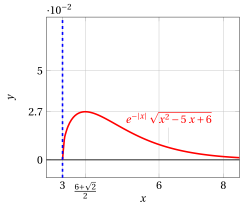
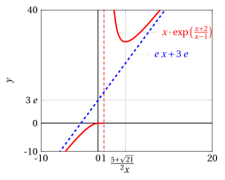

# Studio di funzioni

**Parte 4 · Derivate · Capitolo 9** · dalle dispense di Fabio Furini · [:material-file-pdf-box: Dispensa del volume (PDF)](../pdf/dispensa-4-derivate.pdf) · [:material-presentation: Slide (PDF)](../pdf/slide-derivate-09-studio-funzioni.pdf)

## 1. Grafico di funzioni reali di variabile  reale

- Il calcolo infinitesimale e differenziale sviluppato fin qui ci permette di affrontare in modo completo il problema di tracciare il grafico di una funzione $f$, ovvero effettuare lo <strong>studio di funzione</strong>.

!!! chiave ""

    <strong>I  passi dello studio di funzione</strong>:

    1. Determinare l'<strong>insieme di definizione</strong> o <strong>dominio</strong> (massimale) di $f$.

    2. Calcolare i <strong>limiti  alla frontiera</strong>  del dominio.  Determinare  eventuali <strong>asintoti orizzontali/verticali</strong> e  <strong>punti di discontinuità</strong>.  Studiare il  <strong>segno della funzione</strong> e  i <strong>punti in cui si annulla</strong> (possibile solo per funzioni relativamente semplici).

    3. Se per $x \rr  \infty$ la funzione tende a $\infty$, si determinano gli eventuali <strong>asintoti obliqui</strong>.

    4. Calcolare la <strong>funzione derivata </strong>$f'$ , nei punti in cui esiste. Studiare i punti in cui $f$ è continua ma non derivabile e stabilirne la natura (<strong>punti angolosi</strong>,  <strong>flessi a tangente verticale</strong> o <strong>cuspidi</strong>). In punti angolosi o agli estremi del dominio è utile il calcolo di <strong>derivate destre o sinistre</strong> che determinano la <strong>pendenza del grafico in quei punti</strong>.

    5. Studiare il segno di $f'$ (sul suo insieme di definizione), per ottenere le informazioni sulla <strong>monotonia</strong> di $f$ e sui suoi <strong>punti di massimo e minimo relativi</strong>. Determinare quindi i<strong> punti di massimo e minimo assoluti</strong>.

!!! chiave ""

    <strong>Informazioni aggiuntive</strong>:

    1. Può essere utile determinare una <strong>stima asintotica all'infinito</strong> che ci dica se la funzione tende a $\infty$ in modo <em>sopra</em> o <em>sottolineare</em> o in modo <em>lineare</em> (e in tal caso può avere  asintoto obliquo). La stima asintotica all'infinito dà normalmente anche un'informazione sulla <strong>concavità</strong> di $f$ all'infinito.

    2. Calcolare la <strong>funzione derivata seconda</strong> $f''$  e studiarne il segno, per dedurne informazioni sulla <strong>concavità</strong> e i <strong>flessi</strong> di $f$.

    3. Determinare  un'eventuale simmetria di $f$ (<strong>funzioni pari o dispari</strong>) e restringere lo studio a $x \ge 0$.

    4. Determinare  un'eventuale periodicità di $f$ (<strong>funzioni periodiche</strong>) e restringere lo studio a un periodo.

## 2. Esempi

!!! esempio "Esempio 1: Studio e grafico di funzione"

    Studiamo e tracciamo il grafico della funzione:

    $$
    f(x) = e^{-|x|} \; \sqrt{x^2-5\;x+6}
    $$

    Ci aspettiamo un punto angoloso in $x=0$ per la presenza di $|x|$ e  punti a tangente verticale dove si annulla il radicando. 

    <strong>Punto 1</strong>.  Il dominio (massimale) di  $f$ è:

    $$
    x^2-5\;x+6 \ge 0,~~(x-3)(x-2)\ge 0 {\rm ~~~ovvero~~~} x \in (\im,2] \cup [3, \ip)
    $$

    <strong>Punto 2</strong>. I limiti alla frontiera sono:

    \begin{align*}
    \lim_{x \rr \ip} e^{-|x|} \; \sqrt{x^2-5\;x+6} &=  \lim_{x \rr \ip} \frac{\sqrt{x^2-5\;x+6}}{e^x} = 0^+\\[2ex]
     \lim_{x \rr \im} e^{-|x|} \; \sqrt{x^2-5\;x+6} &
      = \lim_{x \rr \im}   \sqrt{e^{2\:x} \big(\:x^2-5\;x+6 \big)} = \lim_{y \rr \ip}   \sqrt{\frac{y^2+5\;y+6}{e^{2\:y}}}  =0^+\\[2ex]
    \lim_{x \rr 3^+} e^{-|x|} \; \sqrt{x^2-5\;x+6} &= \lim_{x \rr 3^+} e^{-x} \; \sqrt{(x-3)(x-2)} =   0^+\\[2ex]
    \lim_{x \rr 2^-}  e^{-|x|} \; \sqrt{x^2-5\;x+6} &= \lim_{x \rr 2^-}  e^{-x} \; \sqrt{(x-3)(x-2)}=   0^+
    \end{align*}

    Quindi la retta $y=0$ è asintoto orizzontale per $x \rr \pm \infty$ e non  ci sono asintoti verticali.  Nel dominio non ci sono punti di discontinuità. Abbiamo $f(x) \ge 0$ per ogni $x$ nel dominio e $f(x)=0$ per $x=2$ e $x=3$. 

    <strong>Punto 3</strong>. La funzione non ha asintoti obliqui. 

    <strong>Punto 4</strong>. Calcoliamo la funzione derivata per $x \neq 0$:

    \begin{align*}
    f'(x) &= e^{-|x|} \left(-\sgn(x) \; \sqrt{x^2-5\;x+6} + \frac{2\;x -5}{2\; \sqrt{x^2-5\;x+6}}\right)\\[2ex]
    &= \frac{e^{-|x|}}{2\; \sqrt{(x-3)(x-2)}} \bigg( -2\; \sgn(x) \; (x^2-5\;x+6) + 2\;x-5\bigg)
    \end{align*}

    O in maniera equivalente:

    $$
    f'(x) =
    \begin{cases}
    \displaystyle e^{-x} \cdot \frac{  -2\;x^2+12\;x-17 }{2\; \sqrt{(x-3)(x-2)}} ~~ & {\rm ~~~se~~} x >0\\[3ex]
    \displaystyle e^{x} \cdot \frac{ 2\;x^2-8\;x+7 }{2\; \sqrt{(x-3)(x-2)}} ~~& {\rm ~~~se~~} x <0
    \end{cases}
    $$

!!! esempio "Esempio 2: Studio e grafico di funzione"

    Calcoliamo la derivata destra e sinistra in $x=0$:

    $$
    f'_+(0)= \lim_{x \rr 0^+} \frac{e^{-x}\; ~~\big( -2\;x^2+12\;x-17 \big)}{2\; \sqrt{(x-3)(x-2)}}  =   -\frac{17}{2\; \sqrt{6}}
    $$

    $$
    f'_-(0)=  \lim_{x \rr 0^-} \frac{e^{x}\; ~~\big( 2\;x^2-8\;x+7 \big)}{2\; \sqrt{(x-3)(x-2)}}  =   \frac{7}{2\; \sqrt{6}}
    $$

    quindi $x=0$ è un punto angoloso, ovvero $f'(0)$ non esiste. Calcoliamo il limite destro in $x=3$ e il limite sinistro $x=2$ della funzione derivata:

    $$
    f'_+(3)= \lim_{x \rr 3^+} \frac{e^{-x} \; ~~\overbrace{\big( -2\;x^2+12\;x-17 \big)}^{\rr 1}}{2\; \sqrt{(x-3)(x-2)}}  =   \ip
    $$

    $$
    f'_-(2)= \lim_{x \rr 2^-} \frac{e^{-x}\; ~~\overbrace{\big( -2\;x^2+12\;x-17 \big)}^{\rr -1}}{2\; \sqrt{(x-3)(x-2)}}  =   \im
    $$

    Quindi la funzione  ha punti a tangente verticale in $x=2$ e $x=3$.

    <strong>Punto 5</strong>. Studiamo il segno della funzione derivata:

    - Per $x>0$ abbiamo:

        $$
        f'(x) \ge 0 {\rm ~~~~se~~~~} 2\;x^2-12\;x+17 \le 0, {\rm ~~~~ovvero~~~~} x \in \left[\underbrace{\frac{6-\sqrt{2}}{2}}_{\approx 2.3}, \underbrace{\frac{6+\sqrt{2}}{2}}_{\approx 3.7} \right]
        $$

        quindi:

        $$
        f {\rm ~~è~decrescente~per~~} x \in [0,2] \cup \left[\frac{6+\sqrt{2}}{2},\ip \right],
        ~~~~~ f {\rm ~~è~crescente~per~~} x \in \left[3,\frac{6+\sqrt{2}}{2} \right]
        $$

        Abbiamo $f'\left(\frac{6+\sqrt{2}}{2}\right) =0$ quindi, $x=\frac{6+\sqrt{2}}{2}$ è punto di massimo relativo. Il massimo relativo è  $f\left(\frac{6+\sqrt{2}}{2}\right) \approx 0.027$

    - Per $x<0$ abbiamo:

        $$
        f'(x) \ge 0 {\rm ~~~~se~~~~} 2\;x^2-8\;x+7 \ge 0, {\rm ~~~~ovvero~se~~~} x \in \left[\im,\frac{4-\sqrt{2}}{2}\right] \cup \left[\frac{4+\sqrt{2}}{2},\ip\right]
        $$

        quindi $f(x)$ è crescente per $x<0$.

    Possiamo dedurre che $x = 0$ (in cui $f$ non è derivabile) è punto di massimo assoluto; il massimo assoluto è $\sqrt{6} \approx 2.44$.

    Ci sono anche due punti di flesso, uno in $(0, 2)$ e uno in $( 3, \ip)$ ottenibili con lo studio del segno della derivata seconda.

!!! esempio "Esempio 3: Studio e grafico di funzione"

    { .fig .ovale loading=lazy style="width:88%" }

    { .fig .ovale loading=lazy style="width:88%" }

!!! esempio "Esempio 4: Studio e grafico di funzione"

    Studiamo e tracciamo il grafico della funzione:

    $$
    f(x) = x \cdot \exp \left(\frac{x+2}{x-1}\right)
    $$

    <strong>Punto 1</strong>.  Il dominio (massimale) di  $f$ è:

    $$
    x \in \R \setminus \{1\}
    $$

    <strong>Punto 2</strong>. I limiti alla frontiera sono:

    $$
    \lim_{x \rr \ip} x \cdot \exp \left(\frac{x+2}{x-1}\right) =  \ip
    $$

    $$
    \lim_{x \rr \im} x \cdot \exp \left(\frac{x+2}{x-1}\right) =  \im
    $$

    $$
    \frac{x+2}{x-1} \rr \ip {\rm ~~per~~}  x \rr 1^+,~~~~{\rm quindi~~} \lim_{x \rr 1^+} x \; \exp \left(\frac{x+2}{x-1}\right) =  \ip
    $$

    $$
    \frac{x+2}{x-1} \rr \im {\rm ~~per~~}  x \rr 1^-,~~~~{\rm quindi~~} \lim_{x \rr 1^-} x \; \exp \left(\frac{x+2}{x-1}\right) =  0
    $$

    Quindi non ci sono asintoti orizzontali e $x=1$ è un punto di discontinuità. Inoltre $x=1$ è asintoto verticale per $x \rr 1^+$. Abbiamo $f(x) \ge 0$ per $x \ge 0$ e $f(x)=0$ per $x=0$. 

    <strong>Punto 3</strong>. Calcoliamo una stima asintotica, abbiamo:

    $$
    \frac{x+2}{x-1} \rr 1 {\rm ~~per~~}  x \rr \ip,\qquad  \frac{x+2}{x-1} \rr 1 {\rm ~~per~~}  x \rr \im
    $$

    quindi

    $$
    x \cdot \exp \left(\frac{x+2}{x-1}\right) \sim x \cdot e {\rm ~~~~per~~~~} x \rr \pm \infty {\rm ~~perciò~~} f {\rm ~~ha~crescita~lineare}
    $$

    Verifichiamo quindi la presenza di  asintoti obliqui. Cerchiamo di calcolare il seguente limite:

    $$
    \lim_{x \rr \pm \infty} \bigg( x \cdot \exp \left(\frac{x+2}{x-1}\right) - x \; e \bigg) = \lim_{x \rr \pm \infty} x \cdot e \cdot \bigg(   \exp \left(\frac{x+2}{x-1}-1\right) - 1 \bigg)
    $$

    Abbiamo

    $$
    \frac{x+2}{x-1}-1 = \frac{3}{x-1} \rr 0 {\rm ~~per~~} x \rr \pm \infty
    $$

    perciò

    $$
    \exp \left(\frac{x+2}{x-1}-1\right) - 1 \sim \frac{3}{x-1} {\rm ~~per~~} x \rr \pm \infty; ~~~~  x \cdot e \cdot \bigg(  \exp \left(\frac{x+2}{x-1}-1\right) - 1 \bigg) \sim \frac{3\cdot x \cdot e}{x-1}  {\rm ~~per~~} x \rr \pm \infty
    $$

    di conseguenza:

    $$
    \lim_{x \rr \pm \infty} \bigg( x \cdot \exp \left(\frac{x+2}{x-1}\right) - x \cdot e \bigg) = \lim_{x \rr \pm \infty} \frac{3\cdot x \cdot e}{x-1} = 3\cdot e
    $$

    Quindi la funzione ha asintoto obliquo: $y = e\;x +3\;e~$ per $x \rr \pm \infty$.

!!! esempio "Esempio 5: Studio e grafico di funzione"

    <strong>Punto 4</strong>. Calcoliamo la funzione derivata per $x \neq 1$:

    \begin{align*}
    f'(x) &= \exp \left(\frac{x+2}{x-1}\right) \cdot \left( 1 + x \cdot  \frac{(x-1)-(x+2)}{(x-1)^2} \right) = \exp \left(\frac{x+2}{x-1}\right) \cdot \frac{ (x-1)^2- 3\;x  }{(x-1)^2}  \\[2ex]
     &= \exp \left(\frac{x+2}{x-1}\right) \cdot \frac{ x^2 - 5\;x +1 }{(x-1)^2}
    \end{align*}

    Per ogni $x\neq 1$, $f'$ è definita. Calcoliamo il limite sinistro in $x=1$:

    $$
    f'_-(1)=\lim_{x \rr 1^-} \exp \left(\frac{x+2}{x-1}\right) \cdot \frac{ x^2 - 5\;x +1 }{(x-1)^2} = 0
    $$

    l'esponenziale va a zero più rapidamente di $(x - 1)^2$; il grafico quindi arriva in $x = 1$ con tangente orizzontale, da sinistra.

    <strong>Punto 5</strong>. Studiamo il segno della funzione derivata:

    $$
    f'(x) \ge 0 {\rm ~~~~per~~~~} x^2 - 5\;x +1 \ge 0 {\rm ~~~~ovvero~~~~} x \in \left[\im,\frac{5-\sqrt{21}}{2}\right]  \cup \left[\frac{5+\sqrt{21}}{2},\ip\right]
    $$

    quindi $x=\frac{5+\sqrt{21}}{2}$ è punto di minimo relativo e  $x=\frac{5-\sqrt{21}}{2}$ di massimo relativo.

    { .fig .ovale loading=lazy style="width:70%" }

    C'è un punto di flesso in $\left(\frac{5-\sqrt{21}}{2}, 1\right)$  ottenibile con lo studio del segno della derivata seconda.

!!! esempio "Esempio 6: Studio e grafico di funzione"

    { .fig .ovale loading=lazy style="width:82%" }

    Abbiamo $f'_-(1)=0$ dato che:

    $$
    f'_-(1)=\lim_{x \rr 1^-} \exp \left(\frac{x+2}{x-1}\right) \cdot \frac{ x^2 - 5\;x +1 }{(x-1)^2} = \lim_{x \rr 1^-} \frac{\exp \left(\frac{x+2}{x-1}\right)}{(x-1)^2} \cdot \underbrace{(x^2 - 5\;x +1)}_{\rr -3 {\rm ~~per~~} x \rr 1^-}
    $$

    facendo il cambio di variabile: $y=\frac{x+2}{x-1}$, se $x \rr 1^-$ allora $y \rr \im$, inoltre:

    $$
    y=\frac{x+2}{x-1},~~~~ y=\frac{x-1+3}{x-1},~~~~ y=1+\frac{3}{x-1} {\rm ~~e~~} x=1+\frac{3}{y-1}
    $$

    quindi abbiamo:

    $$
    \lim_{x \rr 1^-} \frac{\exp \left(\frac{x+2}{x-1}\right)}{(x-1)^2} = \lim_{y \rr \im} \frac{e^y}{\left(\frac{3}{y-1}\right)^2} =  \frac{1}{9} \; \lim_{y \rr \im}   e^y \cdot \underbrace{(y-1)^2}_{\sim y^2 {\rm ~~per~~} y \rr \im}
    $$

    facendo un secondo cambio di variabile: $z=-y$, se $y \rr \im$ allora $z \rr \ip$ e abbiamo

    $$
    \frac{1}{9} \; \lim_{y \rr \im}  e^y \cdot y^2 = \frac{1}{9} \; \lim_{z \rr \ip}  e^{-z} \cdot (-z)^2= \frac{1}{9} \; \lim_{z \rr \ip}  \frac{z^2}{e^{z}} = 0
    $$

    per il teorema della gerarchia degli infiniti.
