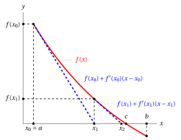
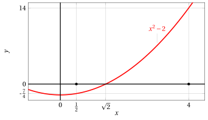
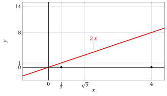
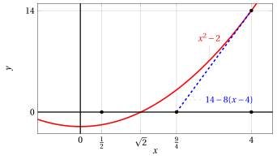
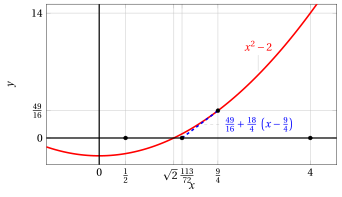

# Metodo di Newton

**Parte 4 · Derivate · Capitolo 10** · dalle dispense di Fabio Furini · [:material-file-pdf-box: Dispensa del volume (PDF)](../pdf/dispensa-4-derivate.pdf)

## 1. Metodo di Newton

- Supponiamo di voler risolvere l'equazione

    $$
    f(x) = 0
    $$

    che equivale a cercare le intersezioni del grafico di $f$ con l'asse $x$ o gli zeri della funzione.  Supponiamo inoltre:  i) che la soluzione $x = c$ esista sia unica e si trovi all'interno dell'intervallo $[a, b]$; ii) che la funzione sia derivabile in $[a,b]$; iii) che $f'(x)\le 0$ (funzione decrescente) e che $f''(x)\ge 0$ (funzione convessa) per ogni $x \in [a,b]$.

- Partiamo allora da $x_0 = a$ e linearizziamo l'equazione $f(x) = 0$ sostituendo a $f$ la retta tangente al suo grafico nel punto $\big(x_0, f(x_0)\big)$. Tale retta ha equazione:

    $$
    y = f(x_0) + f'(x_0) (x - x_0)
    $$

    Invece di risolvere $f(x) = 0$, risolviamo:

    $$
    f(x_0) + f'(x_0) (x - x_0) =0
    $$

    chiamando la soluzione $x_1$ otteniamo:

    $$
    x_1 = x_0 - \frac{f(x_0)}{f'(x_0)}, {\rm ~~~~la~prima~approssimazione~di~~} c
    $$

    { .fig .ovale loading=lazy style="width:85%" }

- Partiamo ora da $x_1$ e linearizziamo come prima con la retta tangente nel nuovo punto $\big(x_1, f(x_1)\big)$. Tale retta ha equazione:

    $$
    y = f(x_1) + f'(x_1) (x - x_1)
    $$

    Come prima  risolviamo:

    $$
    f(x_1) + f'(x_1) (x - x_1) =0
    $$

    ottenendo

    $$
    x_2 = x_1 - \frac{f(x_1)}{f'(x_1)}, {\rm ~~~~la~seconda~approssimazione~di~~} c
    $$

    !!! chiave ""

        Proseguendo con $x_2$ come con $x_1$ e continuando si ottiene la seguente successione definita per ricorrenza:

        $$
        x_0 =a, \qquad  x_{n+1} = x_n  - \frac{f(x_n)}{f'(x_n)}  {\rm ~~con~~} n \in \N
        $$

        In questo modo, il termine $x_n$ può essere costruito a partire da $x_0$ con $n$ iterazioni del medesimo algoritmo. Il metodo, perciò, si presta molto bene al calcolo automatico.

- L'idea principale di questo metodo, chiamato <strong>metodo di Newton</strong> è quindi quella di costruire una successione che, <strong>sotto determinate ipotesi</strong>, converge a $c$.

!!! teorema "Teorema 1: del metodo di Newton"

    Sia $f:[a,b]\rr \R$ derivabile due volte in $[a,b]$,  se valgono le seguenti tre ipotesi:

    1. $f(a) \cdot f(b) < 0$

    2. $f'(x)$ e $f''(x)$ hanno segno costante in $[a,b]$

    3. $f(a) \cdot f''(a) > 0$

    Allora esiste uno e un solo punto $c \in (a, b)$ tale che $f(c)=0$ e la successione

    $$
    x_0 =a, \qquad  x_{n+1} = x_n  - \frac{f(x_n)}{f'(x_n)}
    $$

    converge a $c$ per difetto. Se invece di valere l'ipotesi  3 vale la seguente ipotesi

    1. $f(b) \cdot f''(b) > 0$

    allora la successione

    $$
    x_0 =b, \qquad  x_{n+1} = x_n  - \frac{f(x_n)}{f'(x_n)}
    $$

    converge a $c$ per eccesso.

- Notiamo che, sotto le ipotesi 1. e 2.  è senz'altro verificata la 3.  o la 3'.  La funzione $f''$ ha lo stesso segno in $a$ e $b$ per la 2.  e la funzione  $f$ ha segni opposti in $a$ e $b$ per la 1.  Perciò o vale la 3. o vale la 3'.

- Questo significa che il metodo è applicabile ogni volta che le ipotesi 1. e 2. sono verificate: si tratta solo di scegliere opportunamente se porre $x_0= a$  oppure $x_0= b$.

- La condizione 2, apparentemente restrittiva, sarà in generale soddisfatta pur di scegliere un intervallo $[a, b]$ abbastanza piccolo.

??? dimostrazione "Dimostrazione"

    Poiché $f$ è continua in quanto derivabile in $[a , b]$ e vale la 1, per il teorema degli zeri esiste almeno un $c \in  (a, b)$ tale che $f(c) =0$.

    Inoltre, poiché $f'(x)$ ha segno costante in $(a, b)$, la $f$ è strettamente monotona, quindi tale punto $c$ è unico (una funzione strettamente monotona non può annullarsi in due punti distinti).

    Questo prova esistenza e  unicità del punto $c$ in cui $f$ si annulla. Proveremo ora che la successione è monotona. Da questo seguirà  che la successione è convergente per il teorema di monotonia delle successioni.

    Cominciamo mostrando che se la successione $x_n$ converge, allora $x_n \rr c$.  Se $x_n \rr \ell \in [a,b]$, passando al limite nell'uguaglianza

    $$
    x_{n+1} = x_n  - \frac{f(x_n)}{f'(x_n)}  {\rm ~~~~si~ha~~~~~} \ell = \ell - \frac{f(\ell)}{f'(\ell)}
    $$

    (abbiamo sfruttato il fatto che $f$ è continua, e anche $f'$ è continua, in quanto $f'$ è derivabile, perché esiste per ipotesi $f''$). Dall'ultima uguaglianza segue $f(\ell) =0$, per cui $\ell =c$ (l'unico punto in cui la funzione si annulla).

    Proviamo dunque che $x_n$ è monotona, sotto le ipotesi 1, 2, 3. Senza perdita di generalità, supponiamo $f(a) < 0$ e,  per la 1, di conseguenza $f (b) > 0$. Poiché per la 2,   $f' (x)$ ha segno costante in $[a, b]$, dovrà essere $f' (x) > 0$ in tutto $[a, b]$ (se valesse l'altra disuguaglianza, $f$ sarebbe decrescente, e non potrebbe essere $f (a) < 0 < f (b)$). Poiché $f (a) <0$ e vale la 3, $f'' (a) < 0$, dunque, poiché per la 2 $f'' (x)$ ha segno costante, $f'' (x) < 0$ in tutto $[a, b]$. 

    <strong>Stiamo quindi dimostrando il caso di funzione monotona crescente e concava</strong>. Gli altri casi si dimostrano in maniera analoga. □

??? dimostrazione "Dimostrazione"

    Consideriamo  la funzione:

    $$
    g(x) = x -  \frac{f(x)}{f'(x)}, {\rm ~~abbiamo~~} x_{n+1}= g(x_n) {\rm ~~e~~} g(c)=c {\rm ~dato~che~} f(c)=0
    $$

    Abbiamo:

    $$
    g'(x)=1- \frac{f'(x)^2 - f(x)f''(x)}{f'(x)^2} = \frac{f(x)f''(x)}{f'(x)^2} >0 \Longleftrightarrow f(x) <0
    $$

    perché $f''(x) < 0$ in tutto $[a, b]$.  Quindi $g'(x) > 0$ per $x \in  [a, c]$, ossia  in $[a, c]$ la funzione $g$ è strettamente crescente.

    Tenendo presenti queste cose, proviamo ora che:

    \begin{equation}
    \label{BBB} x_n < x_{n+1} < c,~~~ \forall n \in \N
    \end{equation}

    Per $n = 0$ si ha

    $$
    x_1 = a - \frac{f(a)}{f'(a)} > a
    $$

    perché $f(a)<0$ e $f'(a)>0$, quindi $x_1 > x_0$. Inoltre $a < c$ (e $x_0=a$), e poiché $g$ è crescente, questo implica:

    $$
    g(a) < g(c) {\rm ~~~ovvero~~~} x_1 < c
    $$

    Quindi abbiamo provato che

    $$
    x_0 < x_1 < c
    $$

    Applicando ora la $g$ alle disuguaglianze precedenti ($g$ è strettamente crescente in $[a, c]$, e i tre punti stanno in questo intervallo, quindi $g$ conserva le disuguaglianze), si ha

    $$
    g(x_0) < g(x_1) < g(c) {\rm ~~~ovvero~~~} x_1 < x_2 < c
    $$

    Applicando ancora la $g$, troveremo $x_2 < x_3 < c$, e così via. Perciò la \(\eqref{BBB}\) è vera, e in particolare $x_n$ è monotona. Questo conclude la dimostrazione. □

!!! esempio "Esempio 1: metodo di Newton"

    Consideriamo la funzione:

    $$
    f(x) = x^2 - 2, ~~~f'(x) = 2\; x, ~~~f''(x) = 2
    $$

    { .fig .ovale loading=lazy style="width:72%" }

    Abbiamo:

    $$
    f\left( \frac{1}{2}\right) =-\frac{7}{4} <0 {\rm ~~~e~~~} f(4)=14 >0
    $$

    { .fig .ovale loading=lazy style="width:72%" }

    Consideriamo l'intervallo $\left[\frac{1}{2},4\right]$, abbiamo:

    $$
    f'(x) > 0 {\rm ~~~e~~~} f''(x) > 0, ~~ \forall x \in \left[\frac{1}{2},4\right]
    $$

!!! esempio "Esempio 2: metodo di Newton"

    Quindi nell'intervallo $\left[\frac{1}{2},4\right]$ la funzione $f(x) = x^2 - 2$ rispetta le ipotesi del teorema.

    Siamo nel caso di funzione strettamente crescente in $\left[\frac{1}{2},4\right]$, dato che $f'(x)>0,  \forall x \in \left[\frac{1}{2},4\right]$. E funzione convessa in $\left[\frac{1}{2},4\right]$, dato che $f''(x)>0,  \forall x \in \left[\frac{1}{2},4\right]$. Gli estremi dell'intervallo scelto sono: $a=\frac{1}{2}$ e $b=4$.

    Vale l'ipotesi 3', ovvero $f(4) \cdot f''(4) >0$ e la successione diventa:

    $$
    x_0 =4, \qquad  x_{n+1} = x_n  - \frac{x_n^2-2}{2\;x_n} = \frac{1}{2} \left( x_n + \frac{2}{x_n} \right)       {\rm ~~con~~} n \in \N
    $$

    Calcolando i primi valori della successione  abbiamo:

    $$
    x_0=4,~~~x_1=\frac{9}{4}=2.25,~~~x_2=\frac{113}{72}=1.569444444\dots
    $$

    $$
    x_3=\frac{23,137}{16,272}=1.421890363\dots,~~~x_4=\frac{1,064,876,737}{752,970,528}=1.414234285\dots
    $$

    { .fig .ovale loading=lazy style="width:85%" }

!!! esempio "Esempio 3: metodo di Newton"

    Alla prima iterazione la retta tangente è:

    $$
    y = 14 + 8 \; (x-4) {\rm ~~e~~} x_1 = \frac{9}{4}
    $$

    { .fig .ovale loading=lazy style="width:72%" }

    Alla seconda iterazione la retta tangente è:

    $$
    y = \frac{49}{16} + \frac{18}{4} \; \left(x-\frac{9}{4}\right) {\rm ~~e~~} x_2 = \frac{113}{72}
    $$

    { .fig .ovale loading=lazy style="width:72%" }

- Il metodo di Newton può essere ad esempio utilizzato per calcolare la radice $k$-esima di un numero $c \in \R_+$, cercando gli zeri della seguente funzione:

    $$
    f(x)= x^k - c {\rm ~~~ovvero~~~} x= \sqrt[k]{c}
    $$

    Dato un valore $b \ge \sqrt[k]{c}$,  abbiamo la successione definita per ricorrenza:

    $$
    x_0 =b, \qquad  x_{n+1} = x_n  - \frac{x_n^k - c}{k \: x_n^{k-1}}  {\rm ~~con~~} n \in \N
    $$

    sviluppando otteniamo

    $$
    x_n  - \frac{x_n^k - c}{k \: x_n^{k-1}}  =  \frac{k \: x_n^k - x_n^k +c}{k \: x_n^{k-1} } = \frac{1}{k} \left((k-1) x_n + \frac{c}{x_n^{k-1}}  \right)
    $$

    e quindi la successione diventa:

    $$
    x_0 =b, \qquad  x_{n+1} = \frac{1}{k} \left((k-1) x_n + \frac{c}{x_n^{k-1}}  \right)  {\rm ~~con~~} n \in \N
    $$

    Con $k=2$ otteniamo la successione dell'algoritmo di Erone:

    $$
    x_0 =b, \qquad  x_{n+1} = \frac{1}{2} \left( x_n + \frac{c}{x_n}  \right)  {\rm ~~con~~} n \in \N
    $$

<strong>Prova tu</strong> — il grafico interattivo qui sotto ti fa vedere quello che hai appena letto: muovi i cursori.

## 2. Stima degli errori del metodo di Newton

- L' <strong>errore assoluto</strong> del metodo di Newton è:

    $$
    \varepsilon_n = |x_n - c|
    $$

    dove $c \in (a,b)$ è lo zero della funzione, ovvero $f(c)=0$.

!!! chiave ""

    Il valore di $c$ è ignoto quindi ci serve un modo per analizzare i valori degli errori assoluti che sia indipendente da $c$. Vogliamo inoltre capire con che “velocità” decresca l'errore comparando gli errori  di due iterazioni consecutive, ovvero vogliamo determinare la  <strong>“velocità di convergenza”</strong> dell'algoritmo.

- Usando il teorema della formula di Taylor con resto secondo Lagrange  possiamo scrivere:

    $$
    f(x) = f(x_n) + f'(x_n)\: (x-x_n) + \frac{1}{2} \; f''(\mu)\: (x-x_n)^2
    $$

    per un qualche $\mu$ tra $x_n$ e $x$. In particolare, scegliendo $x= c$ abbiamo:

    \begin{equation}
    \label{AA}
    0 = f(c) = f(x_n) + f'(x_n)\: (c-x_n) + \frac{1}{2} \; f''(\mu)\: (c-x_n)^2
    \end{equation}

    Ricordando  che $x_{n+1}$ è stato ottenuto come soluzione dell'equazione:

    $$
    f(x_n) + f'(x_n) (x - x_n) =0
    $$

    allora abbiamo

    \begin{equation}
    \label{BB}
    0= f(x_n) + f'(x_n) (x_{n+1} - x_n)
    \end{equation}

    Sottraendo  la \(\eqref{BB}\) dalla \(\eqref{AA}\), otteniamo:

    $$
    0 = f'(x_n) (c - x_{n+1}) + \frac{1}{2} \; f''(\mu)\: (c-x_n)^2
    $$

    che a sua volta implica:

    \begin{equation}
    \label{XX} 
    x_{n+1} - c = \frac{1}{2} \; \frac{f''(\mu)}{f'(x_n)} \; (x_n - c)^2 {\rm ~~~~~~quindi~~~~~~} |x_{n+1} - c| = \frac{1}{2} \; \frac{|f''(\mu)|}{|f'(x_n)|} \; |x_n - c|^2
    \end{equation}

    Ora se $x_n$ è vicino a $c$ (ovvero $x_n \approx c$) allora anche $\mu$, che sta tra $x_n$ e $c$, è vicino a $c$; quindi in questi casi:

    $$
    f''(\mu) \approx f''(c) {\rm ~~~~e~~~~} f'(x_n) \approx f'(c)
    $$

    allora sostituendo otteniamo:

    \begin{equation}
    \label{YY}
     |x_{n+1} - c| \approx \frac{1}{2} \; \frac{|f''(c)|}{|f'(c)|} \; |x_n - c|^2 {\rm ~~~~~quindi~~~~~} \varepsilon_{n+1} \approx \frac{1}{2} \; \frac{|f''(c)|}{|f'(c)|} \;\varepsilon^2_{n}
    \end{equation}

    !!! chiave ""

        L'errore assoluto del metodo di Newton ad ogni passo è proporzionale al quadrato dell'errore assoluto nel passaggio precedente. <strong> La velocità di convergenza è quadratica</strong>.

- L'errore però è proporzionale anche alla costante:

    $$
    \frac{|f''(c)|}{2\;|f'(c)|}
    $$

    quindi se $|f'(c)|$ è molto piccolo, o zero, oppure $|f''(c)|$ molto grande, la convergenza può essere però molto lenta o addirittura non verificarsi.

- Riprendiamo l'equazione \(\eqref{XX}\),  determinando $L,M>0$, per i quali risulti:

    $$
    |f'(x_n)| \ge L {\rm ~~~~e~~~~} |f''(\mu)| \le M
    $$

    allora possiamo scrivere:

    $$
    |x_{n+1} - c| \le \frac{1}{2} \; \frac{M}{L} \; |x_n - c|^2 {\rm ~~~quindi~~~} \varepsilon_{n+1} \le  \frac{1}{2} \; \frac{M}{L} \; \varepsilon^2_n
    $$

!!! chiave ""

    Abbiamo ottenuto il legame tra $\varepsilon_{n+1}$ e $\varepsilon_{n}$,  indipendente sia da  $x_n$ che da  $c$ (che dipende però da $M$ e $L$).

!!! esempio "Esempio 4: Stima degli errori del metodo di Newton ($\sqrt{2}=1.414213562\dots$)"

    Riprendiamo l'esempio precedente:

    $$
    f(x) = x^2-2,~~f'(x)=2\;x {\rm ~~~e~~~}f''(x)=2
    $$

    Quindi possiamo scegliere $M=2$ e dato che $x_n \ge 1, \forall n \in \N$, possiamo scegliere $L=2$ (in questo caso $\frac{M}{L}=\frac{2}{2}=1$).

    Sappiamo che $\sqrt{2}>1$ quindi con $n=2$ abbiamo $\varepsilon_{2} \le \left|\frac{113}{72}-1\right| \approx 0.56944$, e abbiamo:

    
<table>
    <tr>
    <td>iter.</td>
    <td>\(x_n\)</td>
    <td>stima di \(\sqrt{2}\)</td>
    <td>\(\varepsilon_n\)</td>
    </tr>
    <tr>
    <td>\(n=3\)</td>
    <td>\(\frac{23,137}{16,272}\)</td>
    <td>1.421890363…</td>
    <td>\(\le \frac{1}{2}\; \varepsilon^2_{2} \approx\)</td>
    <td>0.16213…</td>
    </tr>
    <tr>
    <td>\(n=4\)</td>
    <td>\(\frac{1,064,876,737}{752,970,528}\)</td>
    <td>1.414234285…</td>
    <td>\(\le \frac{1}{2}\; \varepsilon^2_{3} \approx\)</td>
    <td>0.01314…</td>
    </tr>
    </table>

