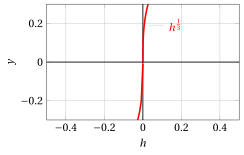

# Cuspidi, flessi e tangenti

**Esercizi · Derivate** · con le soluzioni svolte · [:material-file-pdf-box: PDF](../pdf/es-derivate-01-cuspidi-flessi-tangenti.pdf)

!!! esercizio "Esercizio 1"

    Utilizzando la definizione di derivata, determinare il comportamento nell'origine della seguente funzione:

    $$
    f(x)=x^{\frac{4}{3}}
    $$

??? soluzione "Soluzione"

    Sia

    $$
    f(x) = x^{\frac{4}{3}}
    $$

    allora per $x_0=0$

    $$
    \frac{f(h) - f(0)}{h} =  \frac{ h^{4/3}}{h} = h^{1/3}
    $$

    e i limiti sono:

    $$
    \lim_{h \rr 0^-} {h^{1/3}} = 0 {\rm ~~~e~~~}\lim_{h \rr 0^+} {h^{1/3}} = 0 {\rm ~~~~quindi~~~~} \lim_{h \rr 0} {h^{1/3}} = 0 {\rm ~~~e~~~}f'(0)= 0.
    $$

    { .fig .ovale loading=lazy style="width:55%" }

    La funzione ha un <strong>punto a tangente orizzontale</strong> in $x_0=0$. La funzione:

    $$
    f(h) = h^{\frac{1}{3}}
    $$

    è una potenza a esponente razionale $\frac{m}{n}$ positivo  con $n$ dispari (quindi definita su tutto $\R$) e $m$ dispari (quindi funzione dispari). Il suo grafico è:

    { .fig .ovale loading=lazy style="width:55%" }

!!! esercizio "Esercizio 2"

    Utilizzando la definizione di derivata, determinare il comportamento nell'origine della seguente funzione:

    $$
    f(x)=x^{\frac{2}{3}}
    $$

??? soluzione "Soluzione"

    Sia

    $$
    f(x) = x^{\frac{2}{3}}
    $$

    allora per $x_0=0$

    $$
    \frac{f(h) - f(0)}{h} =  \frac{ h^{2/3}}{h} = \frac{ 1}{h^{1/3}}
    $$

    e i limiti sono:

    $$
    \lim_{h \rr 0^-} \frac{ 1}{h^{1/3}} = \im {\rm ~~e~~}\lim_{h \rr 0^+} \frac{ 1}{h^{1/3}} = \ip {\rm ~~~~~quindi~~~~~} f'_-(0)= \im {\rm ~~e~~}f'_+(0)= \ip
    $$

    { .fig .ovale loading=lazy style="width:55%" }

    La funzione ha <strong>una cuspide</strong> in $x_0=0$. La funzione:

    $$
    f(h) = h^{-\frac{1}{3}} = \frac{1}{h^{{1}/{3}}}
    $$

    è una potenza a esponente razionale $\frac{m}{n}$ negativo con $n$ dispari (quindi definita su tutto $\R$) e $m$ dispari (quindi funzione dispari). Il suo grafico è:

    { .fig .ovale loading=lazy style="width:55%" }

!!! esercizio "Esercizio 3"

    Utilizzando la definizione di derivata, determinare il comportamento nell'origine della seguente funzione:

    $$
    f(x)=x^{\frac{5}{2}}
    $$

??? soluzione "Soluzione"

    Sia

    $$
    f(x) = x^{\frac{5}{2}}
    $$

    allora per $x_0=0$

    $$
    \frac{f(h) - f(0)}{h} =  \frac{ h^{5/2}}{h} = h^{3/2}
    $$

    e i limiti sono:

    $$
    \lim_{h \rr 0^+} {h^{3/2}} = 0.
    $$

    { .fig .ovale loading=lazy style="width:48%" }

    La funzione ha un <strong>punto a tangente orizzontale</strong> in $x_0=0$. La funzione:

    $$
    f(h) = h^{\frac{3}{2}}
    $$

    è una potenza a esponente razionale $\frac{m}{n}$ positivo  con $n$ pari (quindi definita solo su $\R_+$). Il suo grafico è:

    { .fig .ovale loading=lazy style="width:48%" }

!!! esercizio "Esercizio 4"

    Utilizzando la definizione di derivata, determinare il comportamento nell'origine della seguente funzione:

    $$
    f(x)=x^{\frac{3}{2}}
    $$

??? soluzione "Soluzione"

    Sia

    $$
    f(x) = x^{\frac{3}{2}}
    $$

    allora per $x_0=0$

    $$
    \frac{f(h) - f(0)}{h} =  \frac{ h^{3/2}}{h} = h^{1/2}
    $$

    e i limiti sono:

    $$
    \lim_{h \rr 0^+} {h^{1/2}} = 0.
    $$

    { .fig .ovale loading=lazy style="width:45%" }

    La funzione ha un <strong>punto a tangente orizzontale</strong> in $x_0=0$. La funzione:

    $$
    f(h) = h^{\frac{1}{2}}
    $$

    è una potenza a esponente razionale $\frac{m}{n}$ positivo  con $n$ pari (quindi definita solo su $\R_+$). Il suo grafico è:

    { .fig .ovale loading=lazy style="width:45%" }
