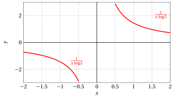
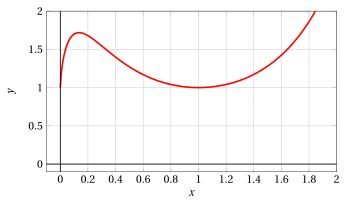

# Calcolo delle funzioni derivate

**Esercizi · Derivate** · con le soluzioni svolte · [:material-file-pdf-box: Dispensa del volume (PDF)](../pdf/dispensa-4-derivate.pdf)

!!! esercizio "Esercizio 1"

    Sia $f:\R\rightarrow\R$, $f(x)=x^{3}$.

    1. Scrivere il rapporto incrementale di $f$ nel punto $x=1$.

    2. Calcolare $f'(1)$ come limite del rapporto incrementale.

    3. Scrivere l'equazione della retta tangente al grafico di $f$ nel punto $(1,1)$.

??? soluzione "Soluzione"

    1.

        $$
        \frac{f(1+h)-f(1)}{h}=\frac{(1+h)^{3}-1}{h}=\frac{3h+3h^{2}+h^{3}}{h}=3+3h+h^{2}
        $$

    2.

        $$
        f'(1)=\lim_{h\to0}3+3h+h^{2}=3
        $$

    3. La retta tangente ha equazione $y = f(1) + f'(1)(x-1)$ quindi

        $$
        y=1 + 3(x-1)
        $$

        da cui

        $$
        y=3x-2
        $$

!!! esercizio "Esercizio 2"

    Calcolare la funzione derivata della seguente funzione $f$ specificando il dominio di $f$ e di $f'$:

    $$
    f(x)=x^{2}\sin\left(x^{3}\right)
    $$

??? soluzione "Soluzione"

    Le funzioni $f$ ed $f'$ sono definite su tutto ${\R}$. 

    Usando le regole della derivata di un prodotto e di funzioni composte si ha

    $$
    f'(x)=2x\cdot\sin\left(x^{3}\right)+x^{2}\cdot\cos\left(x^{3}\right)\cdot3x^{2}=2x\sin\left(x^{3}\right)+3x^{4}\cos\left(x^{3}\right)
    $$

!!! esercizio "Esercizio 3"

    Calcolare la funzione derivata della seguente funzione $f$ specificando il dominio di $f$ e di $f'$:

    $$
    f(x)=x^{3}\cos\left(e^{5x^{2}}\right)
    $$

??? soluzione "Soluzione"

    Le funzioni $f$ ed $f'$ sono definite su tutto ${\R}$.

    Usando le regole della derivata di un prodotto e di funzioni composte si ha

    $$
    \begin{array}{l} f'(x)=3x^{2}\cdot\cos\left(e^{5x^{2}}\right)-x^{3}\cdot\sin\left(e^{5x^{2}}\right)\cdot e^{5x^{2}}\cdot10x=\\
    \\
    = 3x^{2}\cos\left(e^{5x^{2}}\right)-10x^{4}e^{5x^{2}}\sin\left(e^{5x^{2}}\right)\end{array}
    $$

!!! esercizio "Esercizio 4"

    Calcolare la funzione derivata della seguente funzione $f$ specificando il dominio di $f$ e di $f'$:

    $$
    f(x)=e^{1/x}
    $$

??? soluzione "Soluzione"

    Usando le regole della derivata di funzioni composte si ha

    $$
    f'(x)=-\frac{1}{x^{2}} \cdot e^{1/x}
    $$

    Le funzioni $f$ ed $f'$ sono definite su ${\R}\setminus\{0\}$.

!!! esercizio "Esercizio 5"

    Calcolare la funzione derivata della seguente funzione:

    $$
    f(x) = 3\: x^4 + 5\:x + x^{3/2} - 2 \: x^{-3}
    $$

??? soluzione "Soluzione"

    $$
    f'(x) = 12\: x^3 + 5 + \frac{3}{2}\sqrt{x} + \frac{6}{x^4}
    $$

!!! esercizio "Esercizio 6"

    Calcolare le derivate delle seguenti funzioni:

    $$
    (1)~~ f(x) = \log \big(|x|\big),~~(2)~~ f(x) =\log (3\:x),~~ (3)~~f(x) =\log \left(\left|\frac{x+2}{3-x}\right|\right)
    $$

??? soluzione "Soluzione"

    1.

        $$
        \left(~\log \big(|x|\big)~\right)'=\frac{1}{|x|} \cdot \sgn (x) = \frac{1}{x}
        $$

    2.

        $$
        \left(~ \log (3\:x)~\right)' =\big(\log 3 + \log x \big)' = \frac{1}{x}
        $$

    3.

        \begin{align*}
        \left(~\log\left(\left|\frac{x+2}{3-x}\right|\right)~\right)' & = \frac{1}{\left|\frac{x+2}{3-x}\right|} \cdot \sgn\left(\frac{x+2}{3-x}\right) \cdot \left(~\left(\frac{x+2}{3-x}\right)~\right)'= \frac{\left(~\left(\frac{x+2}{3-x}\right)~\right)'}{\frac{x+2}{3-x}} \\[2ex]
        &={\left(~\left(\frac{x+2}{3-x}\right)~\right)'} \cdot {\frac{3-x}{x+2}}= \frac{3-x+x+2}{(3-x)^2}\cdot {\frac{3-x}{x+2}}\\[2ex]
        &= \frac{5}{(3-x)\cdot(x+2)} = \frac{5}{-x^2+x+6}
        \end{align*}

!!! esercizio "Esercizio 7"

    Calcolare la funzione derivata della seguente funzione:

    $$
    f(x) = e^{-3\:x} \: (x^2 + 2\:x -1)
    $$

??? soluzione "Soluzione"

    Usando le regole della derivata di un prodotto e di funzioni composte si ha:

    $$
    f'(x) = -3\: e^{-3\:x} \: (x^2 + 2\:x -1) + e^{-3\:x} \: (2x + 2) =
    $$

    $$
    = e^{-3\:x}(-3x^2-6x+3+2x+2) = e^{-3\:x}(-3x^2-4x+5)
    $$

!!! esercizio "Esercizio 8"

    Calcolare la funzione derivata della seguente funzione:

    $$
    f(x) = \frac{1}{a} \: \arctan \left( \frac{x}{a} \right),~~~ a>0
    $$

??? soluzione "Soluzione"

    $$
    f'(x) \: = \: \frac{1}{a} \cdot \frac{1}{1+x^2/a^2} \cdot  \frac{1}{a} \: = \: \frac{1}{a^2}\cdot \frac{1}{\frac{a^2+x^2}{a^2}} \: = \:\frac{1}{a^2+x^2}
    $$

!!! esercizio "Esercizio 9"

    Calcolare la funzione derivata della seguente funzione:

    $$
    f(x) = x \: \log x
    $$

??? soluzione "Soluzione"

    Usando le regole della derivata di un prodotto si ha:

    $$
    f'(x) = \log x + x \cdot \frac{1}{x} = \log x + 1.
    $$

!!! esercizio "Esercizio 10"

    Calcolare la funzione derivata della seguente funzione:

    $$
    f(x) = \arctan \left( \frac{1+x}{1-x} \right)
    $$

??? soluzione "Soluzione"

    Usando le regole della derivata di un rapporto e di funzioni composte si ha:

    $$
    f'(x) = \frac{1}{1+\frac{(1+x)^2}{(1-x)^2}} \cdot \frac{(1-x)+(1+x)}{(1-x)^2} \: = \: \frac{(1-x)^2}{(1-x)^2+(1+x)^2} \cdot \frac{2}{(1-x)^2} \: =
    $$

    $$
    = \: \frac{2}{1+x^2-2x+1+x^2+2x} = \frac{2}{2(x^2+1)} = \frac{1}{x^2+1}
    $$

!!! esercizio "Esercizio 11"

    Calcolare la funzione derivata della seguente funzione:

    $$
    f(x) = e^{2\:x} \: (2 \: \sin 3\:x - 4\: \cos 3 \:x)
    $$

??? soluzione "Soluzione"

    Usando le regole della derivata del prodotto e di funzioni composte si ha

    $$
    f'(x) = 2\: e^{2\:x} \: (2 \: \sin 3\:x - 4\: \cos 3 \:x) + e^{2\:x} \: (2\cdot3 \: \cos 3\:x + 4\cdot3\: \sin 3 \:x) 
    =
    $$

    $$
    = 2\: e^{2\:x} \: (2\: \sin 3\:x - 4\: \cos 3 \:x + 3 \: \cos 3\:x + 6\: \sin 3 \:x) = 2\: e^{2\:x} \: (8 \: \sin 3\:x - \cos 3 \:x)
    $$

!!! esercizio "Esercizio 12"

    Calcolare la funzione derivata della seguente funzione:

    $$
    f(x) = e^{\frac{x+2}{x-3}}
    $$

??? soluzione "Soluzione"

    Usando le regole della derivata di funzioni composte si ha

    $$
    f'(x) = e^{\frac{x+2}{x-3}} \left[ \frac{(x-3)-(x+2)}{(x-3)^2}\right] 
     = \frac{-5\: e^{\frac{x+2}{x-3}}}{(x-3)^2}
    $$

!!! esercizio "Esercizio 13"

    Calcolare la funzione derivata della seguente funzione:

    $$
    f(x) =\tanh x
    $$

??? soluzione "Soluzione"

    Calcoliamo la funzione derivata della funzione tangente iperbolica

    $$
    f(x) = \tanh x = \frac{\sinh x}{\cosh x}
    $$

    Usando le regole della derivata di un rapporto si ha

    $$
    f'(x) = \frac{\cosh^2x-\sinh^2x}{\cosh^2 x} = 1 - \tanh^2x
    $$

    Inoltre, poiché $\cosh^2x-\sinh^2x = 1$, si ha anche

    $$
    f'(x) = \frac{\cosh^2x-\sinh^2x}{\cosh^2 x} = \frac{1}{\cosh^2 x} = \sech^2 x,
    $$

    dove $\sech x$ è la secante iperbolica definita come $\sech x = \frac{1}{\cosh x}$.

!!! esercizio "Esercizio 14"

    Calcolare la funzione derivata della seguente funzione:

    $$
    f(x) =\coth x
    $$

??? soluzione "Soluzione"

    Calcoliamo la funzione derivata della funzione cotangente iperbolica

    $$
    f(x) = \coth x = \frac{\cosh x}{\sinh x}
    $$

    Usando le regole della derivata di un rapporto si ha

    $$
    f'(x) = \frac{\sinh^2 x-\cosh^2 x}{\sinh^2 x} = 1 - \coth^2 x
    $$

    Inoltre, poiché $\cosh^2x-\sinh^2x = 1$, si ha anche

    $$
    f'(x) = -\frac{\cosh^2x-\sinh^2x}{\sinh^2 x} = -\frac{1}{\sinh^2 x} = - \csch^2 x,
    $$

    dove $\csch x$ è la cosecante iperbolica definita come $\csch x = \frac{1}{\sinh x}$.

!!! esercizio "Esercizio 15"

    Calcolare la funzione derivata della seguente funzione:

    $$
    f(x) = e^{x^2 + 3\:x}
    $$

??? soluzione "Soluzione"

    Usando le regole della derivata di funzioni composte si ha

    $$
    f'(x) = e^{x^2 + 3\:x}\cdot(2x+3)
    $$

!!! esercizio "Esercizio 16"

    Calcolare la funzione derivata della seguente funzione:

    $$
    f(x) = \log_2 \big(|3\:x|\big)
    $$

??? soluzione "Soluzione"

    Con $x \neq 0$, abbiamo:

    $$
    f(x)=\left\{\begin{array}{lr} \log_2 \big(3\:x\big), &x>0\\
    \\
    \log_2 \big(-3\:x\big), & x < 0 \end{array}\right.
    {\rm ~~~~~~~quindi~~~~~~~}
    f'(x)=\left\{\begin{array}{lr} \frac{3}{3\:x \: \log 2}=\frac{1}{x \: \log 2}, &x>0\\
    \\
    \frac{-3}{-3\:x \: \log 2}=\frac{1}{x \: \log 2}, & x< 0\end{array}\right.
    $$

??? soluzione "Soluzione"

    { .fig .ovale loading=lazy style="width:60%" }

    { .fig .ovale loading=lazy style="width:60%" }

    La funzione è discontinua in $x = 0$ quindi non è derivabile.

!!! esercizio "Esercizio 17"

    Calcolare la funzione derivata della seguente funzione:

    $$
    f(x) = \frac{x^2 + 3\:x -2}{2\:x +1}
    $$

??? soluzione "Soluzione"

    Usando le regole della derivata di un rapporto si ha

    \begin{align*}
    f'(x) &= \: \frac{(2x+3)(2x+1)-2(x^2+3x-2)}{(2x+1)^2} \:= \: \frac{4x^2+2x+6x+3-2x^2-6x+4}{(2x+1)^2}\\[2ex]
    &=\: \frac{2x^2+2x+7}{(2x+1)^2}
    \end{align*}

!!! esercizio "Esercizio 18"

    Calcolare la funzione derivata della seguente funzione:

    $$
    f(x) = x^2\log(\cos x)
    $$

??? soluzione "Soluzione"

    Usando le regole della derivata di funzioni composte, si ha

    \begin{align*}
    f'(x) &= \: 2x\cdot\log(\cos x)+x^2\cdot\frac{1}{\cos x}\cdot(-\sin x) = 2x\log(\cos x)-x^2\tan x
    \end{align*}

!!! esercizio "Esercizio 19"

    Calcolare la funzione derivata della seguente funzione:

    $$
    f(x) = \sqrt{\arctan(1+x^2)}
    $$

??? soluzione "Soluzione"

    Usando le regole della derivata di funzioni composte, si ha

    \begin{align*}
    f'(x) &= \frac{1}{2\sqrt{\arctan(1+x^2)}}\cdot\frac{1}{1+(1+x^2)^2}\cdot2x = \frac{x}{(1+(1+x^2)^2)\sqrt{\arctan(1+x^2)}} \\
    &= \frac{x}{(x^4+2x^2+2)\sqrt{\arctan(1+x^2)}}
    \end{align*}

!!! esercizio "Esercizio 20"

    Stabilire se la funzione

    $$
    f(x)=e^{-x+1}-2\pi x-1
    $$

    è invertibile e calcolare la derivata di $f^{-1}(y)$ per $y=-2\pi$.

??? soluzione "Soluzione"

    Poiché $f'(x)=-e^{-x+1}-2\pi<0$, per ogni $x\in\mathbb{R}$, ricaviamo subito che f è strettamente monotona decrescente e quindi invertibile su $\mathbb{R}$. Osserviamo inoltre che

    $$
    e^{-x+1}-2\pi x-1=-2\pi \Longleftrightarrow x=1,
    $$

    cioè $f^{-1}(-2\pi)=1$. Dal Teorema di derivazione della funzione inversa ricaviamo subito

    $$
    (f^{-1})'(-2\pi)=\frac{1}{f'(1)}=-\frac{1}{1+2\pi}.
    $$

    <em>Osservazione: </em>Non saremmo stati in grado di scrivere l'espressione analitica di $f^{-1}$, anche se essa esiste poiché $f$ è invertibile; il Teorema di derivazione della funzione inversa permette di superare tale ostacolo, senza dover passare per l'espressione esplicita dell'inversa.

!!! esercizio "Esercizio 21"

    Stabilire se la funzione

    $$
    f(x)=4x+\pi \sin x
    $$

    è invertibile e calcolare la derivata di $f^{-1}(y)$ per $y=4\pi$.

??? soluzione "Soluzione"

    Poiché $f'(x)=4+\pi \cos x>0$, per ogni $x\in\mathbb{R}$, ricaviamo subito che f è strettamente monotona crescente e quindi invertibile su $\mathbb{R}$. Osserviamo inoltre che

    $$
    4x+\pi \sin x=4\pi \Longleftrightarrow x=\pi,
    $$

    cioè $f^{-1}(4\pi)=\pi$. Dal Teorema di derivazione della funzione inversa ricaviamo subito

    $$
    (f^{-1})'(4\pi)=\frac{1}{f'(\pi)}=\frac{1}{4-\pi}.
    $$

    <em>Osservazione: </em>Non saremmo stati in grado di scrivere l'espressione analitica di $f^{-1}$, anche se essa esiste poiché $f$ è invertibile; il Teorema di derivazione della funzione inversa permette di superare tale ostacolo, senza dover passare per l'espressione esplicita dell'inversa.

!!! esercizio "Esercizio 22"

    Sia $f \in \mathcal{C}^1(\mathbb{R})$, tale che $f'(1)=5e$. Posta $g(x)=f(\log x)$, calcolare $g'(e)$.

??? soluzione "Soluzione"

    Osserviamo che $g \in \mathcal{C}^1(0,+\infty)$, in quanto composizione di funzioni di classe $\mathcal{C}^1$ del proprio dominio. Pertanto, utilizzando il Teorema di derivazione delle funzioni composte, si ricava

    $$
    g'(x)=f'(\log x)\frac{1}{x} \quad \Longrightarrow \quad g'(e)=\frac{f'(1)}{e}=5.
    $$

!!! esercizio "Esercizio 23"

    Calcolare la funzione derivata della seguente funzione:

    $$
    h(x) = x^{x\:\log x}
    $$

??? soluzione "Soluzione"

    Usiamo la regola della derivata di una funzione elevata a un'altra funzione. Le due funzioni sono:

    $$
    f(x) = x {\rm ~~~~e~~~~} g(x) =  x \: \log x
    $$

    Quindi:

    \begin{align*}
    h'(x) &=  \bigg( \exp \left( x \cdot \log^2 x \right) ~\bigg)' = \exp \left( x \cdot \log^2 x \right) \cdot \bigg(x \cdot \log^2 x \bigg)' =
    \\[2ex]
    &= x^{x\:\log x} \cdot \left( \log^2 x + x \cdot \bigg( \log^2 x ~\bigg)'  \right) =  x^{x\:\log x} \cdot \left( \log^2 x + x \cdot \frac{2 \cdot \log x}{x}  \right)\\[2ex]
    &=x^{x\:\log x} \cdot \log x  \cdot ( \log x +  2 )
    \end{align*}

    { .fig .ovale loading=lazy style="width:60%" }

!!! esercizio "Esercizio 24"

    Calcolare la funzione derivata della seguente funzione:

    $$
    f(x) = \frac{a\:x + b}{c\:x + d}
    $$

??? soluzione "Soluzione"

    Usando le regole della derivata di un rapporto si ha

    $$
    f'(x) = \frac{a(c\:x+d)-c(a\:x+b)}{(c\:x + d)^2} = \frac{ac\:x + ad - ac\:x - bc}{(c\:x + d)^2} = \frac{ad-bc}{(c\:x + d)^2}
    $$

!!! esercizio "Esercizio 25"

    Calcolare la funzione derivata della seguente funzione:

    $$
    f(x) = \log \left( |\log x| \right)
    $$

??? soluzione "Soluzione"

    Con $x \neq 1$, abbiamo:

    $$
    f(x)=\left\{\begin{array}{lr} \log \left( \log x \right), &x>1\\
    \\
    \log \left( -\log x \right), & x < 1 \end{array}\right.
    {\rm ~~~~~~~quindi~~~~~~~}
    f'(x)=\left\{\begin{array}{lr} \frac{1}{\log x} \cdot \frac{1}{x}=\frac{1}{x \; \log x}, &x>1\\
    \\
    \frac{1}{-\log x}\cdot - \frac{1}{x}=\frac{1}{x \: \log x}, & x< 1\end{array}\right.
    $$

    La funzione è discontinua in $x = 1$ quindi non è derivabile.

    { .fig .ovale loading=lazy style="width:60%" }

!!! esercizio "Esercizio 26"

    Calcolare la funzione derivata della seguente funzione $f$ specificando il dominio di $f$ e di $f'$:

    $$
    f(x)=\sqrt[4]{x^{2}\log(x^{3})}
    $$

??? soluzione "Soluzione"

    Da $x^{3}>0$ e $x^{2}\log(x^{3})\geq0$ si ha che $f$ è definita per $x\in[1,+\infty)$ e per tali $x$ si ha

    $$
    f(x)=\sqrt[4]{3x^{2}\log x}
    $$

    Grazie alle usuali regole di derivazione, per $x>1$ la funzione $f$ è derivabile e si ha:

    $$
    f'(x)=\frac{\sqrt[4]{3}}{4\sqrt[4]{x^{6}\log^{3} x}}\left(2x\log x+x\right).
    $$

    Per $x=1$, non essendo applicabili le usuali regole di derivazione in quanto la funzione $\sqrt[4]{y}$ non è derivabile per $y=0$, esaminiamo direttamente il limite del rapporto incrementale dove l'incremento $h$ ha senso solo se $h>0$:

    $$
    \lim_{h\to0^{+}}\frac{f(1+h)-f(1)}{h}=\sqrt[4]{3}\lim_{h\to0^{+}}\frac{\sqrt[4]{(1+h)^{2}\log(1+h)}}{h}=
    $$

    $$
    = \sqrt[4]{3}\lim_{h\to0^{+}}\frac{\log^{1/4}(1+h)}{h}=\sqrt[4]{3}\lim_{h\to0^{+}}\frac{h^{1/4}}{h}=
    \sqrt[4]{3}\lim_{h\to0^{+}}\frac{1}{h^{3/4}}=+\infty
    $$

    dove si è usato $\log^{1/4}(1+h)\sim h^{1/4}$ per $h\to0^{+}$. La funzione $f$ non è derivabile per $x=1$. Nel punto $(1,0)$ il grafico ha retta tangente verticale.

    Alternativamente si giunge alla stessa conclusione $f'(1)=+\infty$ osservando che $f$ è continua e che

    $$
    \lim_{x\to1^{+}}\frac{f(x)-f(1)}{x-1}=\lim_{x\to1^{+}}f'(x)=
    \lim_{x\to1^{+}}\frac{\sqrt[4]{3}}{4\sqrt[4]{x^{6}\log^{3} x}}\left(2x\log x+x\right)=+\infty
    $$

    usando il Teorema del valor medio di Lagrange o, equivalentemente, le regole di De L'Hospital per le forme indeterminate $0/0$.

    { .fig .ovale loading=lazy style="width:60%" }

!!! esercizio "Esercizio 27"

    Dare un esempio di $f:\R\rightarrow\R$, continua per $x=1$, non derivabile per $x=1$ e tale che $f(0)=2$.

??? soluzione "Soluzione"

    Ad esempio

    $$
    f(x)=|x-1|+1.
    $$

    La funzione verifica $f(0)=2$ ed è continua su tutto ${\R}$.

    In $x=1$ si ha $f'_{+}(1)=1$, $f'_{-}(1)=-1$ quindi la funzione non è derivabile.

    { .fig .ovale loading=lazy style="width:60%" }
