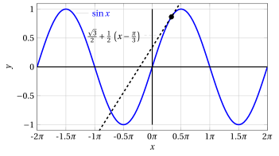
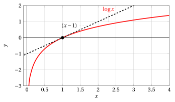

# Rette tangenti

**Esercizi · Derivate** · con le soluzioni svolte · [:material-file-pdf-box: PDF](../pdf/es-derivate-03-rette-tangenti.pdf)

!!! esercizio "Esercizio 1"

    Scrivere l'equazione della retta tangente al grafico di $y = f(x)$ nel punto $\big( x_0, f(x_0)\big)$ per

    $$
    f(x) = 3\:x^2 + 2\:x +1, ~~x_0=2
    $$

??? soluzione "Soluzione"

    Calcoliamo l'equazione della retta tangente al grafico della funzione

    $$
    f(x) = 3\:x^2 + 2\:x +1 {\rm ~~nel~punto~di~ascissa~~} x_0 = 2, {\rm ~~abbiamo:}
    $$

    $$
    f(2)=17,~ f'(x)=6\:x+2,~ f'(2)=14;
    $$

    la retta tangente è

    $$
    y = f(2) + f'(2)(x - 2) = 17 + 14\: (x - 2)
    $$

    { .fig .ovale loading=lazy style="width:82%" }

!!! esercizio "Esercizio 2"

    Scrivere l'equazione della retta tangente al grafico di $y = f(x)$ nel punto $\big( x_0, f(x_0)\big)$ per

    $$
    f(x) = \sin x, ~~x_0=\frac{\pi}{3}
    $$

??? soluzione "Soluzione"

    Calcoliamo l'equazione della retta tangente al grafico della funzione

    $$
    f(x) = \sin x {\rm ~~nel~punto~di~ascissa~~} x_0 = \frac{\pi}{3}, {\rm ~~abbiamo:}
    $$

    $$
    f\left(\frac{\pi}{3}\right)=\frac{\sqrt{3}}{2},~ f'(x)=\cos x,~ f'\left(\frac{\pi}{3}\right)=\frac{1}{2};
    $$

    la retta tangente è

    $$
    y = f\left(\frac{\pi}{3}\right) + f'\left(\frac{\pi}{3}\right)\left(x - \frac{\pi}{3}\right) = \frac{\sqrt{3}}{2} + \frac{1}{2}\: \left(x - \frac{\pi}{3}\right)
    $$

    { .fig .ovale loading=lazy style="width:80%" }

!!! esercizio "Esercizio 3"

    Scrivere l'equazione della retta tangente al grafico di $y = f(x)$ nel punto $\big( x_0, f(x_0)\big)$ per

    $$
    f(x) = \log x, ~~x_0=1
    $$

??? soluzione "Soluzione"

    Calcoliamo l'equazione della retta tangente al grafico della funzione

    $$
    f(x) = \log x {\rm ~~nel~punto~di~ascissa~~} x_0 = 1, {\rm ~~abbiamo:}
    $$

    $$
    f(1)=0,~ f'(x_0)=\lim_{h \rr 0} \frac{f(x_0+h)-f(x_0)}{h} =\lim_{h \rr 0}\frac{\log (1+h)}{h} = 1
    $$

    la retta tangente è

    $$
    y = f(1) + f'(1)(x - 1) = 0 +  (x - 1)
    $$

    { .fig .ovale loading=lazy style="width:82%" }

!!! esercizio "Esercizio 4"

    Scrivere l'equazione della retta tangente al grafico di $y = f(x)$ nel punto $\big( x_0, f(x_0)\big)$ per

    $$
    f(x) = a^x, ~~x_0=2
    $$

!!! esercizio "Esercizio 5"

    Scrivere l'equazione della retta tangente al grafico di $y = f(x)$ nel punto $\big( x_0, f(x_0)\big)$ per

    $$
    f(x) = (x \: \log |x|)^3, ~~x_0=-1
    $$

!!! esercizio "Esercizio 6"

    Scrivere l'equazione della retta tangente al grafico di $y = f(x)$ nel punto $\big( x_0, f(x_0)\big)$ per

    $$
    f(x) = \cos (\log x), ~~x_0=e^{\frac{\pi}{2}}
    $$

!!! esercizio "Esercizio 7"

    Scrivere l'equazione della retta tangente al grafico di $y = f(x)$ nel punto $\big( x_0, f(x_0)\big)$ per

    $$
    f(x) = e^{x^2}, ~~x_0=\log 2
    $$

!!! esercizio "Esercizio 8"

    Scrivere l'equazione della retta tangente al grafico di $y = f(x)$ nel punto $\big( x_0, f(x_0)\big)$ per

    $$
    f(x) = e^{-|x|}, ~~x_0=-1
    $$
