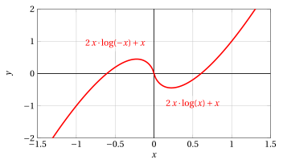
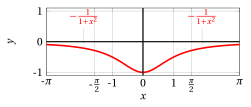

# Derivabilità

**Esercizi · Derivate** · con le soluzioni svolte · [:material-file-pdf-box: PDF](../pdf/es-derivate-06-derivabilita.pdf)

!!! esercizio "Esercizio 1"

    Studiare  la derivabilità della funzione $f(x) = x^2 \cdot \log | x|$ definita per $x \neq 0$.

??? soluzione "Soluzione"

    Sappiamo che esiste

    $$
    \lim_{x \rr 0}  x^2 \cdot \log | x| =0
    $$

    e possiamo prolungare $f$ per continuità definendo $f(0) =0$, ed $f$  risulta continua anche in $0$.   Con $x \neq 0$, abbiamo:

    $$
    f(x)=\left\{\begin{array}{lr} x^2 \cdot \log x, &x>0\\
    \\
    x^2 \cdot \log (-x), & x < 0 \end{array}\right.
    {\rm ~~~~~~~quindi~~~~~~~}
    f'(x)=\left\{\begin{array}{lr} 2\:x \cdot \log (x) +x, &x>0\\
    \\
    2\:x \cdot \log (-x) +x, & x < 0 \end{array}\right.
    $$

    { .fig .ovale loading=lazy style="width:65%" }

    In $x = 0$ la funzione è continua, e abbiamo:

    $$
    \lim_{x \rr 0^+} f'(x) = \lim_{x \rr 0^+} 2\:x \cdot \log x +x = 0 {\rm ~~~~e~~~~} \lim_{x \rr 0^-} f'(x) = \lim_{x \rr 0^-} 2\:x \cdot \log(-x) +x = 0
    $$

    quindi il teorema del limite della derivata è applicabile e abbiamo:

    $$
    f'_+(0)=0,f'_-(0)=0, f'(0)=0 {\rm ~~per~cui~in~~} x=0 {\rm ~~la~funzione~è~derivabile}
    $$

    { .fig .ovale loading=lazy style="width:65%" }

!!! esercizio "Esercizio 2"

    Determinare i valori di $\alpha$ e $\beta \in \mathbb{R}$ per i quali la funzione

    $$
    f(x) = \begin{cases}
      \displaystyle \frac{(1+x)^\alpha-1}{x}  & \text{se }x>0 \vspace{0.2cm} \\ 
      \beta x+2 & \text{se }x\leq0 
    \end{cases}
    $$

    risulta continua e derivabile in $x=0$.

??? soluzione "Soluzione"

    Iniziamo dalla continuità nel punto di raccordo:

    \begin{align*}
    \lim_{x\to0^+}f(x)&=\lim_{x\to0^+}\frac{(1+x)^\alpha-1}{x}=\alpha, \\
    \lim_{x\to0^-}f(x)&=f(0)=2;
    \end{align*}

    quindi la funzione è continua in $x=0$ se e solo se $\alpha=2$ e $\beta\in\mathbb{R}$.

    Per $\alpha=2$ e $x>0$, si ha:

    $$
    f(x)=\frac{(1+x)^2-1}{x}=x+2.
    $$

    Pertanto è evidente che, al fine di raccordare due rette passanti per un medesimo punto (nel nostro caso, l'ordinata all'origine ($0, 2$)), le loro equazioni dovranno coincidere, da cui $\beta=1$.

    Alternativamente, è possibile scrivere l'espressione analitica di $f'(x)$ ed imporre la condizione

    $$
    \lim_{x\to0^+}f'(x)=\lim_{x\to0^-}f'(x)
    $$

    e osservare che si giunge alla stessa conclusione.

!!! esercizio "Esercizio 3"

    Determinare i valori di $\alpha$ e $\beta \in \mathbb{R}$ per i quali la funzione

    $$
    f(x) = \begin{cases}
      \displaystyle \frac{e^{x-1}-1}{x\sin(x^2-1)}  & \text{se }0<x<1 \vspace{0.2cm} \\ 
      \alpha x+\beta & \text{se }1\leq x\leq2 \vspace{0.2cm} \\
      (x-2)^2\log^2(x-2) & \text{se }x>2
    \end{cases}
    $$

    risulta continua e derivabile in $(0,+\infty)$.

??? soluzione "Soluzione"

    La funzione proposta è continua negli intervalli (0, 1), (1, 2) e (2,$+\infty$), in quanto ogni ramo è composizione di funzioni continue.

    Al fine di assicurare continuità in $x=1$, imponiamo l'uguaglianza

    $$
    \lim_{x\to1^+}\left(\alpha x+\beta\right)=\lim_{x\to1^-}\frac{e^{x-1}-1}{x\sin(x^2-1)}
    $$

    ed osservando che, per $x\to1^-$,

    $$
    f(x)\sim\frac{x-1}{x(x^2-1)}=\frac{1}{x(x+1)}\to\frac{1}{2},
    $$

    si ha $\alpha+\beta=\frac{1}{2}$.

    Studiamo ora la continuità nel punto di raccordo $x=2$; imponiamo

    $$
    \lim_{x\to2^+}(x-2)^2\log^2(x-2)=\lim_{x\to2^-}\left(\alpha x+\beta\right),
    $$

    e poiché

    $$
    \lim_{x\to2^+}(x-2)^2\log^2(x-2)=0
    $$

    si ha $2\alpha+\beta=0$. Mettiamo a sistema le due condizioni e otteniamo $\alpha=-\frac{1}{2}$ e $\beta=1$, che garantiscono la continuità di $f$ in (0,$+\infty$).

    Per la verifica della derivabilità, osserviamo che il calcolo di $f'(x)$ in (0,1) è decisamente più complicato che in (2,$+\infty$). Ci conviene, allora, verificare dapprima la derivabilità di $f$ in $x=2$. Poiché

    $$
    f'(x)=2(x-2)\log^2(x-2)+2(x-2)\log(x-2) \quad \forall x>2,
    $$

    si ha che

    $$
    \lim_{x\to2^+}f'(x)=0\neq-\frac{1}{2}=\lim_{x\to2^-}f'(x)
    $$

    Pertanto, per $\alpha=-\frac{1}{2}$ e $\beta=1$, la funzione <strong>non</strong> è  derivabile in $(0,+\infty)$, a causa della presenza di un punto angoloso in $x=2$. Potremmo chiederci cosa accadrebbe per diversi valori di $\alpha$ e $\beta$, ma la risposta è immediata: la funzione non sarebbe continua in $(0, +\infty)$, dunque neppure derivabile.

!!! esercizio "Esercizio 4"

    Data la funzione

    $$
    f(x) = \begin{cases}
      \displaystyle \frac{\pi}{\arctan \frac{1}{x}}  & \text{se }x<0 \vspace{0.2cm} \\ 
      \displaystyle \lambda & \text{se }x=0 \vspace{0.2cm} \\
      \displaystyle \frac{\log (1-2x^4)}{x^\alpha} & \text{se }x>0
    \end{cases}
    $$

    determinare per quali valori dei parametri reali $\alpha,\lambda\in\mathbb{R}$ la funzione risulta continua e derivabile in $x=0$.

??? soluzione "Soluzione"

    La funzione data è continua negli intervalli $(-\infty, 0)$ e $(0, +\infty)$ in quanto composizione di funzioni continue. Resta da assicurare la continuità nel punto di raccordo $x=0$, in cui deve verificarsi:

    $$
    \lim_{x\to0^-}f(x)=\lim_{x\to0^+}f(x)=f(0)=\lambda
    $$

    Si ha

    $$
    \lim_{x\to0^-}f(x)=\lim_{x\to0^-}\frac{\pi}{\arctan \frac{1}{x}}=-2
    $$

    e

    \begin{align*}
    \lim_{x\to0^+}f(x)=\lim_{x\to0^+}\frac{\log (1-2x^4)}{x^\alpha}=\lim_{x\to0^+}\frac{-2x^4}{x^\alpha}&=-2\lim_{x\to0^+}x^{4-\alpha} \\
    &= \begin{cases}
    \displaystyle 0 & \text{se }\alpha<4 \\
    \displaystyle -2 & \text{se }\alpha=4 \\
    \displaystyle -\infty & \text{se }\alpha>4
    \end{cases}
    \end{align*}

    Appare chiaro come la funzione sia continua in $x=0$ <em>se e solo se</em> $\alpha=4, \lambda=-2$. Verifichiamo se, per i valori di $\alpha, \lambda$ ottenuti, la funzione è anche derivabile in $x=0$. Riscriviamo la funzione sostituendo i valori di $\alpha, \lambda$ ottenuti:

    $$
    f(x) = \begin{cases}
      \displaystyle \frac{\pi}{\arctan \frac{1}{x}}  & \text{se }x<0 \vspace{0.2cm} \\ 
      \displaystyle -2 & \text{se }x=0 \vspace{0.2cm} \\
      \displaystyle \frac{\log (1-2x^4)}{x^4} & \text{se }x>0
    \end{cases}
    $$

    e scriviamo l'espressione analitica della sua derivata prima:

    $$
    f'(x) = \begin{cases}
      \displaystyle \frac{\pi}{(x^2+1)\left(\arctan \frac{1}{x}\right)^2}  & \text{se }x<0 \vspace{0.4cm} \\ 
      \displaystyle \frac{-8x^7-4x^3(1-2x^4)\log (1-2x^4)}{x^8(1-2x^4)} & \text{se }x>0
    \end{cases}
    $$

    Si ha

    $$
    \lim_{x\to0^{-}}f'(x)=\lim_{x\to0^{-}}\frac{\pi}{(x^2+1)\left(\arctan \frac{1}{x}\right)^2}=\frac{4}{\pi}
    $$

    mentre

    $$
    \lim_{x\to0^{+}}f'(x)=\lim_{x\to0^{+}}\frac{-8x^7-4x^3(1-2x^4)\log (1-2x^4)}{x^8(1-2x^4)}=0
    $$

    in quanto

    $$
    \lim_{x\to0^{+}}\frac{-8x^7-4x^3(1-2x^4)\log (1-2x^4)}{x^8(1-2x^4)}=\lim_{x\to0^{+}}\frac{-8x^{11}+o(x^{11})}{x^8}=\lim_{x\to0^{+}}\frac{-8x^{11}}{x^8}=0
    $$

    Siamo giunti alla conclusione che $\nexists \; \alpha, \lambda \in \mathbb{R}$ per cui la funzione sia anche derivabile in $x=0$.

!!! esercizio "Esercizio 5"

    Dimostrare che vale la seguente disuguaglianza:

    $$
    \log\left(1+x\right)\leq x \quad \quad \forall x \geq 0
    $$

??? soluzione "Soluzione"

    La funzione $f(x)=\log (1+x)$ è continua e derivabile su $(-1,+\infty)$. Possiamo applicare il teorema di Lagrange in ogni intervallo della forma $[0,x]$, con $x>0$. Pertanto, per un opportuno $\eta\in (0,x)$, $x>0$, otteniamo

    $$
    \log (1+x)=\log(1+x)-\log(1+0)=\frac{1}{1+\eta}x< x
    $$

    dove abbiamo tenuto conto che $\frac{1}{1+\eta}<1$ per ogni $\eta>0$.

!!! esercizio "Esercizio 6"

    Determinare gli eventuali punti di minimo e di massimo, relativi e assoluti, della funzione

    $$
    g(x)=x+|\cos x|
    $$

    in $[0, 2\pi]$. In quanti punti si annulla $g(x)$? Perché?

??? soluzione "Soluzione"

    La funzione è continua nell'intervallo chiuso e limitato $[0, 2\pi]$, quindi per il teorema di Weierstrass esistono i punti di massimo e minimo assoluti. Si ha

    $$
    g(x)=\begin{cases}
    x+ \cos x & \text{se }x\in [0,\pi/2]\cup[3\pi/2,2\pi] \\
    x- \cos x & \text{se }x \in (\pi/2,3\pi/2)
    \end{cases}
    $$

    e

    $$
    g'(x)=\begin{cases}
    1- \sin x & \text{se }x\in (0,\pi/2)\cup(3\pi/2,2\pi) \\
    1+ \sin x & \text{se }x \in (\pi/2,3\pi/2)
    \end{cases}
    $$

    e si verifichi per esercizio che la funzione non è derivabile nei punti di raccordo. La derivata prima è sempre positiva dove è definita, quindi la funzione è sempre crescente ed assumerà i valori massimo e minimo assoluto agli estremi dell'intervallo. Più precisamente, $x=0$ è punto di minimo assoluto con $g(0)=1$ e $x=2\pi$ è punto di massimo assoluto con $g(2\pi)=2\pi+1$. La funzione non si annulla mai poiché sempre crescente e $g(0)=1$.

!!! esercizio "Esercizio 7"

    Studiare la derivabilità della funzione $f(x) = \arctan \frac{1}{x}$ definita per $x \neq 0$.

??? soluzione "Soluzione"

    Con $x \neq 0$, abbiamo:

    $$
    f'(x) = -\frac{1}{1+x^2}
    $$

    { .fig .ovale loading=lazy style="width:59%" }

    Ma in  questo caso viene meno l'ipotesi di continuità di $f$ in $0$ in quanto:

    $$
    \lim_{x \rr 0^+} f(x) = \frac{\pi}{2} ~~~{\rm e}~~~ \lim_{x \rr 0^-} f(x) = -\frac{\pi}{2}
    $$

    e non è possibile usare il teorema del limite della derivata per calcolare la derivata in $x=0$. Non essendo continua in $x=0$ la funzione non è derivabile. Se invece consideriamo solo il limite sinistro della derivata, le ipotesi del teorema del limite della derivata sono verificate e dato che:

    $$
    \lim_{x \rr 0^-} f'(x)= \lim_{x \rr 0^-} -\frac{1}{1+x^2}=-1 {\rm ~~allora~~~} f'_-(0)=-1
    $$

    inoltre dato che:

    $$
    \lim_{x \rr 0^+} f'(x)= \lim_{x \rr 0^+} -\frac{1}{1+x^2}=-1 {\rm ~~allora~~~} f'_+(0)=-1
    $$

    { .fig .ovale loading=lazy style="width:59%" }
