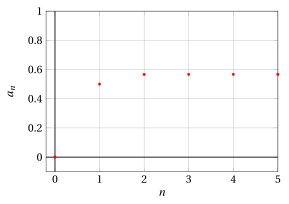

# Metodi di Newton

**Esercizi · Derivate** · con le soluzioni svolte · [:material-file-pdf-box: Dispensa del volume (PDF)](../pdf/dispensa-4-derivate.pdf)

!!! esercizio "Esercizio 1"

    Considerare

    $$
    f(x) = e^{-x} - x
    $$

    e verificare se il metodo di Newton può essere applicato nell'intervallo $[0,1]$. In caso positivo trovare una stima di $x \in[0,1]$ tale che:

    $$
    e^{-x} - x = 0
    $$

??? soluzione "Soluzione"

    Consideriamo la funzione:

    $$
    f(x) = e^{-x} - x, ~~~f'(x) = -e^{-x}-1, ~~~f''(x) = e^{-x}
    $$

    { .fig .ovale loading=lazy style="width:39%" }

    Abbiamo:

    $$
    f(0) =1>0 {\rm ~~~e~~~} f(1) <0
    $$

    { .fig .ovale loading=lazy style="width:39%" }

    Consideriamo l'intervallo $[0,1]$, abbiamo per $x \in [0,1]$:

    $$
    f'(x) < 0 {\rm ~~~e~~~} f''(x) > 0
    $$

??? soluzione "Soluzione"

    Quindi nell'intervallo $[0,1]$ la funzione $f(x) = e^{-x} - x$ rispetta le ipotesi del teorema.

    Siamo nel caso di funzione strettamente decrescente in $[0,1]$, dato che $f'(x)<0, x \in [0,1]$. E funzione convessa in $[0,1]$, dato che $f''(x)>0, x \in [0,1]$. Gli estremi dell'intervallo scelto sono: $a=0$ e $b=1$.

    Vale l'ipotesi 3, ovvero $f(0) \cdot f''(0) >0$ e la successione diventa:

    $$
    x_0 =0, \qquad  x_{n+1} = x_n  - \frac{e^{-x_n} - x_n}{-e^{-x_n}-1} = \frac{x_n+1}{1+e^{x_n}}    {\rm ~~con~~} n \in \N
    $$

    Dato che

    \begin{align*}
    x_n  - \frac{e^{-x_n} - x_n}{-e^{-x_n}-1} &= x_n  + \frac{e^{-x_n} - x_n}{e^{-x_n}+1}=x_n  + \frac{e^{-x_n}}{e^{-x_n}} \frac{1 - e^{x_n}\;x_n}{1+e^{x_n}} \\[2ex]
     &= \frac{x_n(1+e^{x_n})+1-e^{x_n}x_n}{1+e^{x_n}} = \frac{x_n+1}{1+e^{x_n}}
    \end{align*}

    quindi abbiamo:

    $$
    x_0=0,~~~x_1=0.5,~~~x_2=0.5663\dots,~~~x_3=0.5671\dots,~~~x_4=0.5671\dots,~~~x_5=0.5671\dots
    $$

    { .fig .ovale loading=lazy style="width:85%" }

??? soluzione "Soluzione"

    Alla prima iterazione la retta tangente è:

    $$
    y = 1 - 2 \; x {\rm ~~e~~} x_1 = 0 - \frac{1}{-2}=\frac{1}{2}
    $$

    { .fig .ovale loading=lazy style="width:55%" }
