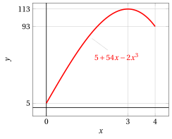
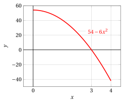
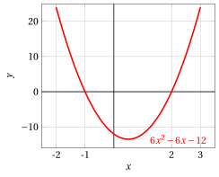
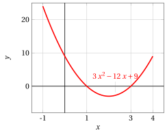
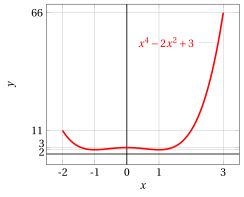

# Ricerca di estremi e punti di estremo locali e globali

**Esercizi · Derivate** · con le soluzioni svolte · [:material-file-pdf-box: PDF](../pdf/es-derivate-13-estremi.pdf)

!!! esercizio "Esercizio 1"

    Calcolare tutti i punti di massimo e minimo (globali e locali) della funzione:

    $$
    f(x)=    5 +54x -2x^3 {\rm ~~~~~nell'intervallo~~} [0,4]
    $$

??? soluzione "Soluzione"

    1. I valori della funzione agli estremi dell'intervallo sono: $f(0)=5$ e $f(4)=93$.

    2. La funzione derivata è:

        $$
        f'(x)=54-6\;x^2=-6\;(x^2-9)=-6\;(x+3)\;(x-3)
        $$

        Risolviamo l'equazione:

        $$
        f'(x) = 0 \Longleftrightarrow -6\;(x+3)\;(x-3)=0  \Longleftrightarrow x=\pm 3
        $$

        $$
        x_1 = 3 \in [0,4]~~~~ {\rm punto~stazionario}
        $$

    3. Abbiamo $f'(x) \ge 0$ per  $x \in [-3,3]$.  Studiando il segno di $f'$ vicino a $x = 3$, si deduce  che $x=3$ è un punto di massimo locale e $f(3)=113$ è un massimo locale.

    4. Abbiamo:

        $$
        f(3) = 113 > f(0) =5, ~~ f(3) = 113
          > f(4) = 93
        $$

        Si conclude quindi che:

        - $f(0)=5$  è il <strong>minimo globale</strong> e $x=0$  è  <strong>punto di minimo globale</strong>

        - $f(3)=113$ è il <strong>massimo globale</strong> e $x=3$  è <strong>punto di massimo globale</strong>

        - $f(4)=93$ è un <strong>minimo locale</strong> e  $x=4$   è <strong>punto di minimo locale</strong>

!!! esercizio "Esercizio 2"

    Calcolare tutti i punti di massimo e minimo (globali e locali) della funzione:

    $$
    f(x)=   2x^3 -3x^2-12x +1 {\rm ~~~~~nell'intervallo~~} [-2,3]
    $$

??? soluzione "Soluzione"

    1. I valori della funzione agli estremi dell'intervallo sono: $f(-2)=-3$ e $f(3)=-8$.

    2. La funzione derivata è:

        $$
        f'(x)=6\;x^2-6\:x-12=6\;(x^2-x-2)=6\;(x+1)\;(x-2)
        $$

        Risolviamo l'equazione:

        $$
        f'(x) = 0 \Longleftrightarrow 6\;(x^2-x-2)=0  \Longleftrightarrow x=\frac{1\pm 3}{2}
        $$

        $$
        x_1 = -1 \in [-2,3] {\rm ~~e~~} x_2 = 2 \in [-2,3] ~~~{\rm punti~stazionari}
        $$

    3. Abbiamo $f'(x) \ge 0$ per  $x \in (\im,-1] \cup [2,\ip)$. Studiando il segno di $f'$ vicino a $x = -1$, si deduce  che $x=-1$ è un punto di massimo locale e $f(-1)=8$ è un massimo locale. Studiando il segno di $f'$ vicino a $x = 2$, si deduce  che $x=2$ è un punto di minimo locale e $f(2)=-19$ è un minimo locale.

    4. Abbiamo:

        $$
        f(-1) = 8 > f(-2) =-3, ~~ f(-1) = 8
          > f(3) = -8
        $$

        $$
        f(2) = -19 < f(-2) =-3, ~~ f(2) = -19
          < f(3) = -8
        $$

        Si conclude quindi che:

        - $f(-2)=-3$ è un <strong>minimo locale</strong> e $x=-2$  è  <strong>punto di minimo locale</strong>

        - $f(-1)=8$ è il <strong>massimo globale</strong> e $x=-1$ è  <strong>punto di massimo globale</strong>

        - $f(2)=-19$ è il <strong>minimo globale</strong> e  $x=2$  è  <strong>punto di minimo globale</strong>

        - $f(3)=-8$ è un <strong>massimo locale</strong> e $x=3$  è  <strong>punto di massimo locale</strong>

!!! esercizio "Esercizio 3"

    Calcolare tutti i punti di massimo e minimo (globali e locali) della funzione:

    $$
    f(x)= x^3 - 6x^2  + 9x  + 2 {\rm ~~~~~nell'intervallo~~} [-1,4]
    $$

??? soluzione "Soluzione"

    1. I valori della funzione agli estremi dell'intervallo sono: $f(-1)=-14$ e $f(4)=6$.

    2. La funzione derivata è:

        $$
        f'(x)=3\;x^2-12\:x+9=3\;(x^2-4\:x+3)=3\;(x-3)\;(x-1)
        $$

        Risolviamo l'equazione:

        $$
        f'(x) = 0 \Longleftrightarrow 3\;(x^2-4\:x+3)=0  \Longleftrightarrow x=\frac{4\pm 2}{2}
        $$

        $$
        x_1 = 1 \in [-1,4] {\rm ~~e~~} x_2 = 3 \in [-1,4] ~~~{\rm punti~stazionari}
        $$

    3. Abbiamo $f'(x) \ge 0$ per  $x \in (\im,1] \cup [3,\ip)$. Studiando il segno di $f'$ vicino a $x = 1$, si deduce  che $x=1$ è un punto di massimo locale e $f(1)=6$ è un massimo locale. Studiando il segno di $f'$ vicino a $x = 3$, si deduce  che $x=3$ è un punto di minimo locale e $f(3)=2$ è un minimo locale.

    4. Abbiamo:

        $$
        f(1) = 6 > f(-1) =-14, ~~ f(1) = 6
          \ge f(4) = 6
        $$

        $$
        f(3) = 2 > f(-1) =-14, ~~ f(3) = 2
          < f(4) = 6
        $$

        Si conclude quindi che:

        - $f(-1)=-14$ è il <strong>minimo globale</strong> e $x=-1$  è  <strong>punto di minimo globale</strong>

        - $f(1)=6$ è il <strong>massimo globale</strong> e $x=1$ è  <strong>punto di massimo globale</strong>

        - $f(3)=2$ è un <strong>minimo locale</strong> e  $x=3$  è  <strong>punto di minimo locale</strong>

        - $f(4)=6$ è il <strong>massimo globale</strong> e $x=4$  è  <strong>punto di massimo globale</strong>

!!! esercizio "Esercizio 4"

    Calcolare tutti i punti di massimo e minimo (globali e locali) della funzione:

    $$
    f(x)=x^4 - 2x^2 + 3 {\rm ~~~~~nell'intervallo~~} [-2,3]
    $$

??? soluzione "Soluzione"

    1. I valori della funzione agli estremi dell'intervallo sono: $f(-2)=11$ e $f(3)=66$.

    2. La funzione derivata è:

        $$
        f'(x)=4\;x^3-4\:x=4\;x\;(x^2-1)
        $$

        Risolviamo l'equazione:

        $$
        f'(x) = 0 \Longleftrightarrow 4\;x\;(x^2-1)=0  \Longleftrightarrow x=\pm 1 {\rm ~~e~~} x=0
        $$

        $$
        x_1 = -1 \in [-2,3],~~x_2 = 0 \in [-2,3]  {\rm ~~e~~} x_3 = 1 \in [-2,3] ~~~{\rm punti~stazionari}
        $$

    3. Abbiamo $f'(x) \ge 0$ per  $x \in [-1,0] \cup [1,\ip)$. Studiando il segno di $f'$ vicino a $x = -1$, si deduce  che $x=-1$ è un punto di minimo locale e $f(-1)=2$ è un minimo locale. Studiando il segno di $f'$ vicino a $x = 0$, si deduce  che $x=0$ è un punto di massimo locale e $f(0)=3$ è un massimo locale. Studiando il segno di $f'$ vicino a $x = 1$, si deduce  che $x=1$ è un punto di minimo locale e $f(1)=2$ è un minimo locale.

    4. Abbiamo:

        $$
        f(-1) = 2 < f(-2) =11, ~~ f(-1) = 2
          < f(3) = 66
        $$

        $$
        f(0) = 3 < f(-2) =11, ~~ f(0) = 3
          < f(3) = 66
        $$

        $$
        f(1) = 2 < f(-2) =11, ~~ f(1) = 2
          < f(3) = 66
        $$

        Si conclude quindi che:

        - $f(-2)=11$ è un <strong>massimo locale</strong> e $x=-2$  è <strong>punto di massimo locale</strong>

        - $f(-1)=2$ è il <strong>minimo globale</strong> e $x=-1$ è  <strong>punto di minimo globale</strong>

        - $f(0)=3$ è un <strong>massimo locale</strong> e  $x=0$  è <strong>punto di massimo locale</strong>

        - $f(1)=2$ è il <strong>minimo globale</strong> e  $x=1$  è <strong>punto di minimo globale</strong>

        - $f(3)=66$ è il <strong>massimo globale</strong> e $x=3$  è <strong>punto di massimo globale</strong>

Questi sono i grafici  della funzione $f(x)= 5 +54x -2x^3$ e della derivata nell'intervallo $[0,4]$:

{ .fig .ovale loading=lazy style="width:79%" }

{ .fig .ovale loading=lazy style="width:79%" }

Questi sono i grafici  della funzione $f(x)= 2x^3 -3x^2-12x +1$ e della derivata nell'intervallo $[-2,3]$:

{ .fig .ovale loading=lazy style="width:79%" }

{ .fig .ovale loading=lazy style="width:79%" }

Questi sono i grafici  della funzione $f(x)= x^3 - 6x^2  + 9x  + 2$ e della derivata nell'intervallo $[-1,4]$:

{ .fig .ovale loading=lazy style="width:79%" }

{ .fig .ovale loading=lazy style="width:79%" }

Questi sono i grafici  della funzione $f(x)= x^4 - 2x^2 + 3$ e della derivata nell'intervallo $[-2,3]$:

{ .fig .ovale loading=lazy style="width:79%" }

{ .fig .ovale loading=lazy style="width:79%" }
