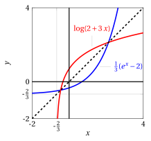
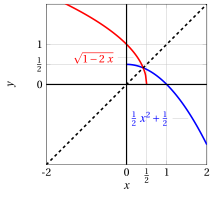

# Funzioni inverse

**Esercizi · Funzioni** · con le soluzioni svolte · [:material-file-pdf-box: PDF](../pdf/es-funzioni-02-funzioni-inverse.pdf)

!!! esercizio "Esercizio 1"

    Provare che la funzione

    $$
    f(x)=\log{(2+3x)}
    $$

    è invertibile nel suo dominio e determinare l'espressione analitica dell'inversa $f^{-1}$. Specificare il dominio di $f^{-1}$.

??? soluzione "Soluzione"

    L'insieme di definizione della funzione proposta è

    $$
    \left(-\frac{2}{3},+\infty\right),
    $$

    intervallo in cui l'argomento del logaritmo è strettamente positivo. Per dimostrare che $f$ è invertibile, basta verificare che è iniettiva, ovvero

    $$
    \forall x_1,x_2 \in D \qquad f(x_1) = f(x_2) \Longrightarrow x_1 = x_2
    $$

    Imporre $f(x_1) = f(x_2)$ equivale ad imporre che

    \begin{align*}
    \log{(2+3x_1)} &=\log{(2+3x_2)} \\
    2+3x_1 &= 2+3x_2 \\
    3x_1 &= 3x_2 \Longleftrightarrow x_1=x_2
    \end{align*}

    La funzione $f$ è iniettiva e, conseguentemente, invertibile. Cerchiamo l'espressione analitica della funzione inversa $f^{-1}$ risolvendo, rispetto alla variabile $x$, l'equazione

    $$
    \log{(2+3x)}=y.
    $$

    che è univocamente risolta per

    $$
    x=\frac{1}{3}(e^{y}-2)
    $$

??? soluzione "Soluzione"

    La funzione inversa di $f$ è, più formalmente,

    $$
    f^{-1}(y)=\frac{1}{3}(e^{y}-2)
    $$

    il cui insieme di definizione è l'immagine della funzione di partenza $f$, ovvero $\mathbb{R}$. Quindi $f:\left(-\frac{2}{3},+\infty\right)\to(-\infty, +\infty)$, mentre $f^{-1}:(-\infty, +\infty) \to\left(-\frac{2}{3},+\infty\right)$.

    I grafici $y=\log{(2+3x)}$ e $y=\frac{1}{3}(e^{x}-2)$ sono simmetrici rispetto alla bisettrice $y=x$:

    { .fig .ovale loading=lazy style="width:58%" }

!!! esercizio "Esercizio 2"

    Provare che la funzione

    $$
    f(x)=\sqrt{1-2x}
    $$

    è invertibile nel suo dominio e determinare l'espressione analitica dell'inversa $f^{-1}$. Specificare il dominio di $f^{-1}$.

??? soluzione "Soluzione"

    L'insieme di definizione della funzione proposta è

    $$
    \left(-\infty,\frac{1}{2}\right],
    $$

    intervallo in cui il radicando è non negativo.

??? soluzione "Soluzione"

    Per dimostrare che $f$ è invertibile, basta verificare che è iniettiva, ovvero

    $$
    \forall x_1,x_2 \in D \qquad f(x_1) = f(x_2) \Longrightarrow x_1 = x_2
    $$

    Imporre $f(x_1) = f(x_2)$ equivale ad imporre che

    \begin{align*}
    \sqrt{1-2x_1} &=\sqrt{1-2x_2} \\
    1-2x_1 &=1-2x_2 \\
    -2x_1 &= -2x_2 \Longleftrightarrow x_1=x_2
    \end{align*}

    La funzione $f$ è iniettiva e, conseguentemente, invertibile. Cerchiamo l'espressione analitica della funzione inversa $f^{-1}$ risolvendo, rispetto alla variabile $x$, l'equazione

    $$
    \sqrt{1-2x}=y.
    $$

    che, per $y \geq 0$ (un radicale non è mai negativo in $\mathbb{R}$), è univocamente risolta da

    $$
    x=-\frac{1}{2}y^2+\frac{1}{2}
    $$

    La funzione inversa di $f$ è, più formalmente,

    $$
    f^{-1}(y)=-\frac{1}{2}y^2+\frac{1}{2}
    $$

    il cui insieme di definizione è l'immagine della funzione di partenza $f$, ovvero $[0, +\infty)$. Quindi $f:\left(-\infty,\frac{1}{2}\right]\to[0, +\infty)$, $f^{-1}:[0, +\infty) \to\left(-\infty,\frac{1}{2}\right]$.

    I grafici $y=\sqrt{1-2x}$ e $y=-\frac{1}{2}x^2+\frac{1}{2}$ sono simmetrici rispetto alla bisettrice $y=x$:

    { .fig .ovale loading=lazy style="width:58%" }

!!! esercizio "Esercizio 3"

    Provare che la funzione

    $$
    f(x)=e^{2x-3}
    $$

    è invertibile nel suo dominio e determinare l'espressione analitica dell'inversa $f^{-1}$. Specificare il dominio di $f^{-1}$.

??? soluzione "Soluzione"

    L'insieme di definizione della funzione proposta è

    $$
    \left(-\infty,+\infty\right),
    $$

    in quanto la funzione esponenziale è definita per ogni $x\in\mathbb{R}$. Per dimostrare che $f$ è invertibile, basta verificare che è iniettiva, ovvero

    $$
    \forall x_1,x_2 \in D \qquad f(x_1) = f(x_2) \Longrightarrow x_1 = x_2
    $$

    Imporre $f(x_1) = f(x_2)$ equivale ad imporre che

    \begin{align*}
    e^{2x_1-3} &=e^{2x_2-3} \\
    2x_1-3 &=2x_2-3 \\
    2x_1 &= 2x_2 \Longleftrightarrow x_1=x_2
    \end{align*}

    La funzione $f$ è iniettiva e, conseguentemente, invertibile. Cerchiamo l'espressione analitica della funzione inversa $f^{-1}$ risolvendo, rispetto alla variabile $x$, l'equazione

    $$
    e^{2x-3}=y.
    $$

    Ha senso risolvere tale equazione solo per $y > 0$, in quanto essa non avrebbe soluzioni nel caso in cui $y\leq0$ (l'esponenziale non si annulla mai e non è mai negativo). L'equazione è univocamente risolta da

    $$
    x=\frac{3}{2}+\frac{1}{2}\log{y}
    $$

    La funzione inversa di $f$ è, più formalmente,

    $$
    f^{-1}(y)=\frac{3}{2}+\frac{1}{2}\log{y}
    $$

    il cui insieme di definizione è l'immagine della funzione di partenza $f$, ovvero $(0, +\infty)$. Quindi $f:(-\infty,+\infty)\to(0, +\infty)$, $f^{-1}:(0, +\infty) \to (-\infty,+\infty)$.

!!! esercizio "Esercizio 4"

    Provare che la funzione

    $$
    f(x)=\arctan(2x-1)
    $$

    è invertibile nel suo dominio e determinare l'espressione analitica dell'inversa $f^{-1}$. Specificare il dominio di $f^{-1}$.

??? soluzione "Soluzione"

    La funzione arcotangente, che ricordiamo essere la funzione inversa della restrizione di $y=\tan(x)$ all'intervallo $(-\frac{\pi}{2},\frac{\pi}{2})$, presenta le seguenti caratteristiche:

    - ha come <em>dominio</em> l'insieme $\mathbb{R}$;

    - ha come immagine l'intervallo  $(-\frac{\pi}{2},\frac{\pi}{2})$;

    - è una funzione monotona <strong>strettamente crescente</strong>.

    In virtù del suo essere monotona strettamente crescente, la funzione $f$ è invertibile (si noti come questa sia una condizione solo <em>sufficiente</em>). Cerchiamo l'espressione analitica della funzione inversa $f^{-1}$ risolvendo, rispetto alla variabile $x$, l'equazione

    $$
    \arctan(2x-1)=y,
    $$

    dove $y \in (-\frac{\pi}{2},\frac{\pi}{2})$. L'equazione diviene

    \begin{align*}
    2x-1 &=\tan(y) \\
    x &= \frac{1}{2}+\frac{\tan(y)}{2}
    \end{align*}

    La funzione inversa di $f$ è, più formalmente,

    $$
    f^{-1}(y)=\frac{1}{2}+\frac{\tan(y)}{2}
    $$

    il cui insieme di definizione è l'immagine della funzione di partenza $f$, ovvero $(-\frac{\pi}{2},\frac{\pi}{2})$. Quindi $f:\mathbb{R}\to(-\frac{\pi}{2},\frac{\pi}{2})$, mentre $f^{-1}:(-\frac{\pi}{2},\frac{\pi}{2})\to\mathbb{R}$

!!! esercizio "Esercizio 5"

    Provare che la funzione

    $$
    f(x)=\frac{x-1}{x+2}
    $$

    è invertibile nel suo dominio e determinare l'espressione analitica dell'inversa $f^{-1}$. Specificare il dominio di $f^{-1}$.

??? soluzione "Soluzione"

    L'insieme di definizione della funzione proposta è

    $$
    (-\infty, -2)\cup(-2,+\infty),
    $$

    in quanto definita $\forall x \in \mathbb{R}, \, x \neq -2$. Per dimostrare che $f$ è invertibile, basta verificare che è iniettiva, ovvero

    $$
    \forall x_1,x_2 \in D \qquad f(x_1) = f(x_2) \Longrightarrow x_1 = x_2
    $$

    Per facilitare successivamente i calcoli, conviene riscrivere la funzione $f$ come:

    $$
    f(x)=\frac{x-1}{x+2}=\frac{x+2-3}{x+2}=1-\frac{3}{x+2}
    $$

    Imporre $f(x_1) = f(x_2)$ equivale ad imporre che

    \begin{align*}
    1-\frac{3}{x_1+2} &=1-\frac{3}{x_2+2} \\
    \frac{3}{x_1+2} &=\frac{3}{x_2+2} \\
    x_1+2 &= x_2+2 \Longleftrightarrow x_1=x_2
    \end{align*}

    La funzione $f$ è iniettiva e, conseguentemente, invertibile. Cerchiamo l'espressione analitica della funzione inversa $f^{-1}$ risolvendo, rispetto alla variabile $x$, l'equazione

    $$
    \frac{x-1}{x+2}=y.
    $$

    Riscrivendo nuovamente la funzione come prima

    $$
    1-\frac{3}{x+2}=y
    $$

    otteniamo

    $$
    x=\frac{3}{1-y}-2=\frac{2y+1}{1-y}
    $$

    La funzione inversa di $f$ è, più formalmente,

    $$
    f^{-1}(y)=\frac{2y+1}{1-y}
    $$

    il cui insieme di definizione è l'immagine della funzione di partenza $f$, ovvero $(-\infty, 1)\cup(1,+\infty)$. Quindi $f:(-\infty, -2)\cup(-2,+\infty)\to(-\infty, 1)\cup(1,+\infty)$, $f^{-1}:(-\infty, 1)\cup(1,+\infty) \to (-\infty, -2)\cup(-2,+\infty)$.

!!! esercizio "Esercizio 6"

    Provare che la funzione

    $$
    f(x)=e^{1+x^2}
    $$

    è invertibile in una restrizione del suo dominio e determinare l'espressione analitica dell'inversa $f^{-1}$. Specificare il dominio di $f^{-1}$.

??? soluzione "Soluzione"

    L'insieme di definizione della funzione proposta è

    $$
    \left(-\infty,+\infty\right),
    $$

    in quanto la funzione esponenziale è definita per ogni $x\in\mathbb{R}$. Risulta chiaro come $f$ non sia invertibile su tutto $\mathbb{R}$, in quanto è una funzione pari, cioè simmetrica rispetto all'asse $y$:

    $$
    f(-x)=e^{1+(-x)^2}=e^{1+x^2}=f(x)
    $$

    Ciò implica che qualsiasi retta orizzontale interseca il grafico della funzione in due punti. La funzione non è iniettiva, dunque non invertibile su $\mathbb{R}$. Tuttavia, è possibile operare una restrizione del dominio considerando unicamente il semiasse positivo delle ascisse compresa l'origine, cioè l'insieme

    $$
    [0, +\infty)
    $$

    Verifichiamo che, in tale dominio ristretto, la funzione $f$ è iniettiva. A tale scopo, imponiamo $f(x_1) = f(x_2)$, ovvero

    \begin{align*}
    e^{1+x_1^2} &=e^{1+x_2^2} \\
    1+x_1^2 &=1+x_2^2 \\
    x_1^2 &= x_2^2 \Longleftrightarrow x_1=x_2
    \end{align*}

    dove l'ultima doppia implicazione è vera in quanto $x \in [0, +\infty)$, ovvero $x \geq 0$, rimanendo esclusa la soluzione $x_1=-x_2$. Abbiamo così dimostrato che la funzione $f$ è iniettiva sul dominio ristretto e, conseguentemente, invertibile in $[0, +\infty)$.

    Cerchiamo l'espressione analitica della funzione inversa $f^{-1}$ risolvendo, rispetto alla variabile $x$, l'equazione

    $$
    e^{1+x^2}=y.
    $$

    L'equazione è risolta da

    $$
    x=\pm \sqrt{\log{(y)}-1}
    $$

    in cui, tuttavia, appare ora chiaro come si debba escludere la soluzione negativa, in quanto $x$ varia nella restrizione $[0, +\infty)$.

??? soluzione "Soluzione"

    La funzione inversa di $f$ è, più formalmente,

    $$
    f^{-1}(y)=\sqrt{\log{(y)}-1}
    $$

    il cui insieme di definizione è l'immagine della funzione di partenza $f$, ovvero $[e, +\infty)$. Quindi $f:[0,+\infty)\to[e, +\infty)$, $f^{-1}:[e, +\infty) \to [0,+\infty)$.

!!! esercizio "Esercizio 7"

    Provare che la funzione

    $$
    f(x)=\frac{4}{5^{3x}}
    $$

    è invertibile nel suo dominio e determinare l'espressione analitica dell'inversa $f^{-1}$. Specificare il dominio di $f^{-1}$.

??? soluzione "Soluzione"

    L'insieme di definizione della funzione proposta è

    $$
    \left(-\infty,+\infty\right),
    $$

    in quanto il denominatore è sempre diverso da zero (l'esponenziale non si annulla mai). Per dimostrare che $f$ è invertibile, basta verificare che è iniettiva, ovvero

    $$
    \forall x_1,x_2 \in D \qquad f(x_1) = f(x_2) \Longrightarrow x_1 = x_2
    $$

    Imporre $f(x_1) = f(x_2)$ equivale ad imporre che

    \begin{align*}
    \frac{4}{5^{3x_1}} &=\frac{4}{5^{3x_2}} \\
    5^{3x_1} &= 5^{3x_2} \\
    3x_1 &= 3x_2 \Longleftrightarrow x_1=x_2
    \end{align*}

    La funzione $f$ è iniettiva e, conseguentemente, invertibile. Cerchiamo l'espressione analitica della funzione inversa $f^{-1}$ risolvendo, rispetto alla variabile $x$, l'equazione

    $$
    \frac{4}{5^{3x}}=y,
    $$

    con $y >0$, che è univocamente risolta per

    $$
    x=\frac{1}{3}\log_5{\left(\frac{4}{y}\right)}=-\frac{1}{3}\log_5{\left(\frac{y}{4}\right)}
    $$

??? soluzione "Soluzione"

    La funzione inversa di $f$ è, più formalmente,

    $$
    f^{-1}(y)=-\frac{1}{3}\log_5{\left(\frac{y}{4}\right)}
    $$

    il cui insieme di definizione è l'immagine della funzione di partenza $f$, ovvero $(0, +\infty)$. Quindi $f:\mathbb{R}\to(0, +\infty)$, mentre $f^{-1}:(0, +\infty) \to\mathbb{R}$.

!!! esercizio "Esercizio 8"

    Provare che la funzione

    $$
    f(x)=-1+\sqrt[5]{1+x}
    $$

    è invertibile nel suo dominio e determinare l'espressione analitica dell'inversa $f^{-1}$. Specificare il dominio di $f^{-1}$.

??? soluzione "Soluzione"

    L'insieme di definizione della funzione proposta è

    $$
    \left(-\infty,+\infty\right),
    $$

    in quanto i radicali con indice dispari sono sempre definiti. Per dimostrare che $f$ è invertibile, basta verificare che è iniettiva, ovvero

    $$
    \forall x_1,x_2 \in D \qquad f(x_1) = f(x_2) \Longrightarrow x_1 = x_2
    $$

    Imporre $f(x_1) = f(x_2)$ equivale ad imporre che

    \begin{align*}
    -1+\sqrt[5]{1+x_1} &=-1+\sqrt[5]{1+x_2} \\
    \sqrt[5]{1+x_1} &= \sqrt[5]{1+x_2} \\
    1+x_1 &= 1+x_2 \Longleftrightarrow x_1=x_2
    \end{align*}

    La funzione $f$ è iniettiva (è anche strettamente crescente) e, conseguentemente, invertibile. Cerchiamo l'espressione analitica della funzione inversa $f^{-1}$ risolvendo, rispetto alla variabile $x$, l'equazione

    $$
    -1+\sqrt[5]{1+x}=y,
    $$

    che è univocamente risolta per

    $$
    x=-1+(y+1)^5
    $$

??? soluzione "Soluzione"

    La funzione inversa di $f$ è, più formalmente,

    $$
    f^{-1}(y)=-1+(y+1)^5
    $$

    il cui insieme di definizione è l'immagine della funzione di partenza $f$, ovvero $\mathbb{R}$. Quindi $f:\mathbb{R}\to\mathbb{R}$, e anche $f^{-1}:\mathbb{R} \to\mathbb{R}$.

!!! esercizio "Esercizio 9"

    Provare che la funzione

    $$
    f(x)=\frac{1-3x}{x+1}
    $$

    è invertibile nel suo dominio e determinare l'espressione analitica dell'inversa $f^{-1}$. Specificare il dominio di $f^{-1}$.

    <em>(Suggerimento: effettuare la divisione fra $1-3x$ e $x+1$)</em>.

!!! esercizio "Esercizio 10"

    Provare che la funzione

    $$
    f(x)=3^{x^2}
    $$

    è invertibile in una restrizione del suo dominio e determinare l'espressione analitica dell'inversa $f^{-1}$ sulla restrizione. Specificare il dominio di $f^{-1}$.

!!! esercizio "Esercizio 11"

    Provare che la funzione

    $$
    f(x)=\sqrt{\log{\left(\frac{x-1}{x}\right)}}
    $$

    è invertibile nel suo dominio e determinare l'espressione analitica dell'inversa $f^{-1}$. Specificare il dominio di $f^{-1}$.
