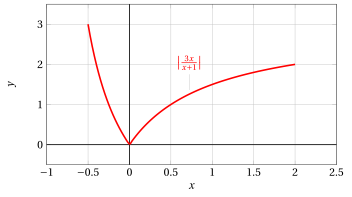
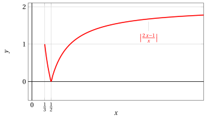
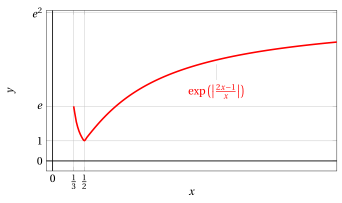

# Massimi, minimi, estremi superiori e inferiori

**Esercizi · Numeri e logica** · con le soluzioni svolte · [:material-file-pdf-box: Dispensa del volume (PDF)](../pdf/dispensa-1-numeri.pdf)

!!! esercizio "Esercizio 1"

    Determinare se l'insieme

    $$
    A=[0,\sqrt{2}]\cap \Q
    $$

    ammette massimo, minimo, estremo superiore, estremo inferiore e, in caso affermativo, determinare tali elementi.

??? soluzione "Soluzione"

    Il minimo di $A$ è $0$. $A$ non ammette massimo, il suo estremo superiore è $\sqrt{2}$.

!!! esercizio "Esercizio 2"

    Determinare se l'insieme

    $$
    A=[\sqrt{2},\sqrt{3}]\cap \Q
    $$

    ammette massimo, minimo, estremo superiore, estremo inferiore e, in caso affermativo, determinare tali elementi.

??? soluzione "Soluzione"

    $A$ non ammette né minimo né massimo. L'estremo inferiore vale $\sqrt{2}$, l'estremo superiore vale $\sqrt{3}$.

!!! esercizio "Esercizio 3"

    Determinare se l'insieme

    $$
    A=[0,\sqrt{2}]\cap(\R-  \Q)
    $$

    ammette massimo, minimo, estremo superiore, estremo inferiore e, in caso affermativo, determinare tali elementi.

??? soluzione "Soluzione"

    $A$ non ammette minimo, l'estremo inferiore vale $0$. Il massimo di $A$ vale $\sqrt{2}$.

!!! esercizio "Esercizio 4"

    In ciascuno dei seguenti casi dire se l'insieme

    $$
    A=(-\infty,\sqrt{2}]\cap \Q
    $$

    ammette massimo, minimo, estremo superiore, estremo inferiore e, in caso affermativo, determinare tali elementi.

??? soluzione "Soluzione"

    $A$ non è inferiormente limitato quindi non ha estremo inferiore in $\R$. $A$ non ammette massimo, l'estremo superiore vale $\sqrt{2}$.

!!! esercizio "Esercizio 5"

    Dire se il seguente insieme $A \subset\R$ ammette massimo, minimo, estremo superiore, estremo inferiore e se è limitato:

    $$
    A=\left\{\frac{2n+1}{n}: \ n\in \N \setminus \{0\} \right\}
    $$

??? soluzione "Soluzione"

    Da $(2n+1)/n=2+(1/n)$ abbiamo che il massimo di $A$ si ottiene per $n=1$ e vale $3$. $A$ non ammette minimo, l'estremo inferiore vale $2$. In particolare $A$ è limitato.

!!! esercizio "Esercizio 6"

    Dire se il seguente insieme $A \subset\R$ ammette massimo, minimo, estremo superiore, estremo inferiore e se è limitato:

    $$
    A=\left\{\frac{n-1}{n}: \ n\in \N \setminus \{0\} \right\}
    $$

??? soluzione "Soluzione"

    Da $(n-1)/n=1-(1/n)$ abbiamo che il minimo di $A$ si ottiene per $n=1$ e vale $0$. $A$ non ammette massimo, l'estremo superiore vale $1$. In particolare $A$ è limitato.

!!! esercizio "Esercizio 7"

    Dire se il seguente insieme $A \subset\R$ ammette massimo, minimo, estremo superiore, estremo inferiore e se è limitato:

    $$
    A=\left\{\frac{3n^{2}+1}{n^{2}}: \ n\in \N \setminus \{0\} \right\}
    $$

??? soluzione "Soluzione"

    Da $(3n^{2}+1)/n^{2}=3+(1/n^{2})$ abbiamo che il massimo di $A$ si ottiene per $n=1$ e vale $4$. $A$ non ammette minimo, l'estremo inferiore vale $3$. In particolare $A$ è limitato.

!!! esercizio "Esercizio 8"

    Dire se il seguente insieme $A \subset\R$ ammette massimo, minimo, estremo superiore, estremo inferiore e se è limitato:

    $$
    A=\left\{\frac{1}{n^{2}+1}: \ n\in \N \setminus \{0\} \right\}
    $$

??? soluzione "Soluzione"

    Il valore massimo di $A$ si ottiene per $n=1$ e vale $1/2$. $A$ non ammette minimo, l'estremo inferiore vale $0$. In particolare $A$ è limitato.

!!! esercizio "Esercizio 9"

    Sia

    $$
    A=\left\{\left|\frac{3x}{x+1}\right| :\ -\frac{1}{2}<x\leq2\right\}.
    $$

    Scegliere le affermazioni corrette tra le seguenti:

    $$
    (a)~~  \sup A\notin A ~~~~~~~~~~~~~~(b)~~  \inf A=\min A=2
    $$

    $$
    (c)~~  \max A=3 
    ~~~~~~~~~~~~~~(d)~~  {\rm ~~nessuna~delle~altre~risposte~\`e~corretta}
    $$

??? soluzione "Soluzione"

    $A$ è l'insieme dei valori di $|f(x)|$ nell'intervallo $(-1/2,2]$ con $f(x)=\frac{3x}{x+1}$. Da

    $$
    \frac{3x}{x+1}=3-\frac{3}{x+1}
    $$

    abbiamo che la funzione $f$ è strettamente crescente nell'intervallo indicato $(-1/2,2]$, negativa su $(-1/2,0)$, nulla per $x=0$, positiva su $(0,2]$. Ne segue che

    $$
    |f(x)|=\left|\frac{3x}{x+1}\right|
    $$

    è strettamente decrescente in $(-1/2,0]$, dove assume tutti i valori in $[0,3)$, strettamente crescente su $[0,2]$ dove assume tutti i valori in $[0,2]$. Il valore minimo è quindi assunto per $x=0$ e vale $0$. L'estremo superiore vale $3$, non c'è valore massimo. La risposta corretta è la (a).

    { .fig .ovale loading=lazy style="width:78%" }

!!! esercizio "Esercizio 10"

    Per $I=[1/3,+\infty)$ si consideri la funzione

    $$
    f:I\rightarrow\R,\ f(x)=\exp \left(\left|\frac{2x-1}{x}\right|\right).
    $$

    Determinare, tra i seguenti intervalli, l'insieme $J=f(I)$ dei valori assunti da $f$.

    $$
    (a)~~  [e,e^{2}) ~~~~~~~~~~~~~~(b)~~  (e^{-2},e] ~~~~~~~~~~~~~~(c)~~  [1,e^{2})
    $$

    $$
    ~~~~~~~~~~~~~~(d)~~  (e,+\infty)
    ~~~~~~~~~~~~~~(e)~~  (0,e^{2}) 
    ~~~~~~~~~~~~~~(f)~~  {\rm ~~un~altro~intervallo}
    $$

??? soluzione "Soluzione"

    La funzione $f$ ha lo stesso andamento di monotonìa di

    $$
    |g(x)|=\left|\frac{2x-1}{x}\right|
    $$

    con

    $$
    g(x)=\frac{2x-1}{x}=2-\frac{1}{x}.
    $$

    { .fig .ovale loading=lazy style="width:65%" }

    { .fig .ovale loading=lazy style="width:65%" }

??? soluzione "Soluzione"

    La funzione $g$ è strettamente crescente nell'intervallo $I=[1/3,+\infty)$, negativa su $[1/3,1/2)$, nulla per $x=1/2$, positiva su $(1/2,+\infty)$. Ne segue che $|g(x)|$ è strettamente decrescente in $[1/3,1/2]$, dove assume tutti i valori in $[0,1]$, strettamente crescente su $[1/2,+\infty)$ dove assume tutti i valori in $[0,2)$. L'insieme dei valori $|g|(I)$ è $[0,2)$, quindi per $f(x)=e^{|g(x)|}$ si ha

    $$
    f(I)=[1,e^{2}).
    $$

    La risposta corretta è (c).

    { .fig .ovale loading=lazy style="width:65%" }

    Possiamo precisare dicendo che $f$ è strettamente decrescente in $[1/3,1/2]$, dove assume tutti i valori in $[1,e]$, strettamente crescente su $[1/2,+\infty)$ dove assume tutti i valori in $[1,e^{2})$.

!!! esercizio "Esercizio 11"

    Sia $A=A_{+}\cup A_{-}$ con

    $$
    A_{+}=\left\{x+\frac{2}{x}:x>0\right\},~~~\ A_{-}=\left\{x+\frac{2}{x}:x<0\right\}.
    $$

    Scegliere le affermazioni corrette tra le seguenti:

    $$
    (a)~~  \sup A=+\infty ~~~~~~~~~~~~~~(b)~~  \inf A_{+}=2\sqrt{2} ~~~~~~~~~~~~~~(c)~~  A_{+} {\rm~non~ha~minimo}
    $$

    $$
    ~~~~~~~~~~~~~~(d)~~  A_{-} {\rm~non~ha~massimo}
    ~~~~~~~~~~~~~~(e)~~  {\rm nessuna~delle~altre~risposte~\`e~ corretta}
    $$

??? soluzione "Soluzione"

    In maniera evidente $A_{+}$ non è superiormente limitato quindi la affermazione (a) è corretta (e l'affermazione (e) è errata). Per $x\neq0$, consideriamo l'equazione

    $$
    x+\frac{2}{x}=y,
    $$

    $$
    x^{2}-yx+2=0.
    $$

    Ci sono soluzioni $x\in\R$ se e solo se $y\in(-\infty,-2\sqrt{2}]\cup[2\sqrt{2},+\infty)$. Inoltre per ogni $y\in(-\infty,-2\sqrt{2}]$ le soluzioni $x$ sono negative mentre per ogni $y\in[2\sqrt{2},+\infty)$ le soluzioni $x$ sono positive. Questo significa

    $$
    A_{+}=[2\sqrt{2},+\infty),\ A_{-}=(-\infty,-2\sqrt{2}].
    $$

    Dunque (b) è vera, (c) falsa, (d) falsa.

    { .fig .ovale loading=lazy style="width:78%" }
