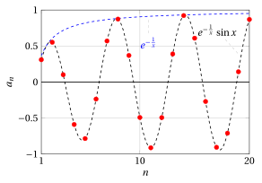
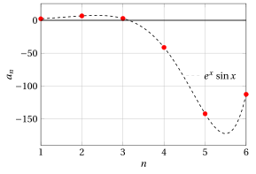
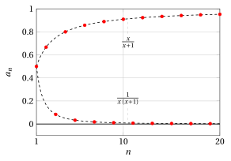

# Proprietà delle successioni

**Esercizi · Limiti di successioni** · con le soluzioni svolte · [:material-file-pdf-box: PDF](../pdf/es-successioni-01-proprieta.pdf)

!!! esercizio "Esercizio 1"

    Si consideri la successione

    $$
    a_n = \log \left( 1  +  (-1)^n \frac{n}{n+1}\right), \quad {\rm ~~per~~} n=1,2,3, \dots
    $$

    Domande:

    1. La successione è limitata superiormente? In caso affermativo determinare il $\sup \big\{a_n \big\}$.

    2. La successione ammette massimo? In caso affermativo determinare il $\max \big\{a_n \big\}$.

    3. La successione è inferiormente limitata? In caso affermativo determinare l'$\inf \big\{a_n \big\}$.

    4. La successione ammette minimo? In caso affermativo determinare il $\min \big\{a_n \big\}$.

??? soluzione "Soluzione"

    Con $n=1$ abbiamo

    $$
    \log \left( 1    -1 \: \frac{1}{2}\right) = \log \frac{1}{2} \approx -0.69314.
    $$

    Con $n=2$ abbiamo

    $$
    \log \left( 1    +1 \: \frac{2}{3}\right) = \log \frac{5}{3} \approx 0.510826.
    $$

    { .fig .ovale loading=lazy style="width:72%" }

    La presenza del segno alternato $(-1)^n$  suggerisce di ragionare sull'andamento della successione distinguendo cosa succede per $n$ pari e $n$ dispari.

??? soluzione "Soluzione"

    - Se $n$ è pari:

        $$
        a_n = \log \left( 1  + \frac{n}{n+1}\right), \quad {\rm ~~per~~} n=2,4,6 \dots
        $$

        quindi l'argomento del logaritmo è

        $$
        1 + \frac{n}{n+1} = 1 + \frac{n+1-1}{n+1} = 2 - \frac{1}{n+1}
        $$

        che varia in

        $$
        \left[\frac{5}{3},2\right) {\rm ~e~il~logaritmo~in} \left[\log \frac{5}{3}, \log 2\right),
        $$

        ovvero è positivo e superiormente limitato. Quindi

        $$
        \sup \big\{a_n: n {\rm ~~è~pari~} \big\} = \log 2 \approx 0.69314
        $$

        ma $\log 2$ non è il massimo di questi valori.

    - Se $n$ è dispari:

        $$
        a_n = \log \left( 1  - \frac{n}{n+1}\right), \quad {\rm ~~per~~} n=1,3,5 \dots
        $$

        quindi l'argomento del logaritmo è

        $$
        1 - \frac{n}{n+1} = \frac{1}{n+1}
        $$

        che varia in

        $$
        \left(0,\frac{1}{2}\right] {\rm ~e~il~logaritmo~in} \left(- \infty, \log \frac{1}{2}\right],
        $$

        ovvero è negativo e al crescere di $n$ è inferiormente illimitato.

    La successione, nel suo complesso, è quindi superiormente ma non inferiormente limitata, non ammette massimo (pur avendo $\sup$ finito) né minimo (perché è inferiormente illimitata).

!!! esercizio "Esercizio 2"

    Si consideri la successione

    $$
    a_n = e^{-\frac{1}{n}} \: \sin n, \quad {\rm ~~per~~} n=1,2,3, \dots
    $$

    Domande:

    1. La successione è limitata superiormente?

    2. La successione è limitata inferiormente?

    3. È definitivamente positiva?

    4. Non si annulla mai?

    5. Ha limite (finito o infinito)?

??? soluzione "Soluzione"

    Con $n=1$ abbiamo

    $$
    e^{-1} \sin 1 \approx 0.3679	\cdot 0.8415
    \approx 0.309560.
    $$

    Con $n=2$ abbiamo

    $$
    e^{-\frac{1}{2}} \sin 2 \approx 0.6065 \cdot	0.9093
    \approx 0.551517.
    $$

    Con $n=10$ abbiamo

    $$
    e^{-\frac{1}{10}} \sin 10 \approx 0.9048	\cdot -0.5440
     \approx -0.492251.
    $$

    Con $n=20$ abbiamo

    $$
    e^{-\frac{1}{20}} \sin 20 \approx 0.9512	\cdot 0.9129
     \approx 0.8684.
    $$

    { .fig .ovale loading=lazy style="width:72%" }

??? soluzione "Soluzione"

    La successione è il prodotto della successione

    $$
    n \mapsto e^{- \frac{1}{n}} {\rm ~~con~~} \lim_{n \rr \ip } e^{- \frac{1}{n}} =1,
    $$

    limitata, sempre diversa da zero, convergente,  e della successione

    $$
    n \mapsto \sin n,
    $$

    limitata ma irregolare, mai nulla (dato che $n$ parte da 1, per l'irrazionalità di $\pi$, l'angolo $n$ non è mai multiplo intero di $\pi$).

    Quindi, la successione data dal prodotto di queste due sarà limitata, mai nulla e irregolare.

    Poiché

    $$
    e^{- \frac{1}{n}} \rr 1
    $$

    e il segno di $\sin n$ non è definitivamente costante, la successione data dal prodotto delle due non è definitivamente positiva.

!!! esercizio "Esercizio 3"

    Si consideri la successione

    $$
    a_n = e^{n} \: \sin n, \quad {\rm ~~per~~} n=1,2,3, \dots
    $$

    Domande:

    1. La successione è limitata superiormente?

    2. La successione è limitata inferiormente?

    3. È definitivamente positiva?

    4. Non si annulla mai?

    5. Ha limite (finito o infinito)?

??? soluzione "Soluzione"

    Con $n=1$ abbiamo

    $$
    e^{1} \sin 1 \approx 2.7183	\cdot 0.8415
    \approx 2.2874.
    $$

    Con $n=2$ abbiamo

    $$
    e^{2} \sin 2 \approx 7.3891 \cdot	0.9093
    \approx 6.7188.
    $$

    Con $n=5$ abbiamo

    $$
    e^{5} \sin 5 \approx 148.4132	\cdot -0.9589
     \approx -142.3170.
    $$

    { .fig .ovale loading=lazy style="width:72%" }

??? soluzione "Soluzione"

    La successione è il prodotto della successione

    $$
    n \mapsto e^{n} {\rm ~~con~~} \lim_{n \rr \ip } e^{n} =+\infty,
    $$

    illimitata superiormente, limitata inferiormente, sempre diversa da zero, divergente, e della successione

    $$
    n \mapsto \sin n,
    $$

    limitata ma irregolare, mai nulla (dato che $n$ parte da 1, per l'irrazionalità di $\pi$, l'angolo $n$ non è mai multiplo intero di $\pi$).

    Quindi, la successione data dal prodotto di queste due sarà illimitata superiormente, illimitata inferiormente, mai nulla e irregolare.

    Poiché

    $$
    e^{n} \rr +\infty
    $$

    e il segno di $\sin n$ non è definitivamente costante, la successione data dal prodotto delle due non è definitivamente positiva.

!!! esercizio "Esercizio 4"

    Si consideri la successione

    $$
    a_n = \frac{n^{(-1)^n}}{n+1}, \quad {\rm ~~per~~} n=1,2,3, \dots
    $$

    Domande:

    1. La successione è limitata superiormente? In caso affermativo determinare il $\sup \big\{a_n \big\}$.

    2. La successione ammette massimo? In caso affermativo determinare il $\max \big\{a_n \big\}$.

    3. La successione è inferiormente limitata? In caso affermativo determinare l'$\inf \big\{a_n \big\}$.

    4. La successione ammette minimo? In caso affermativo determinare il $\min \big\{a_n \big\}$.

??? soluzione "Soluzione"

    Con $n=1$ abbiamo

    $$
    1^{(-1)^1} \frac{1}{2} = 1 \: \frac{1}{2}
    $$

    Con $n=2$ abbiamo

    $$
    2^{(-1)^2} \frac{1}{3} = 2 \: \frac{1}{3}.
    $$

    Con $n=3$ abbiamo

    $$
    3^{(-1)^3} \frac{1}{4} = \frac{1}{3} \: \frac{1}{4}.
    $$

    Con $n=4$ abbiamo

    $$
    4^{(-1)^4} \frac{1}{5} = 4 \: \frac{1}{5}.
    $$

    { .fig .ovale loading=lazy style="width:72%" }

    La presenza del segno alternato $(-1)^n$  suggerisce di ragionare sull'andamento della successione distinguendo cosa succede per $n$ pari e $n$ dispari.

??? soluzione "Soluzione"

    - Se $n$ è pari:

        $$
        a_n = \frac{n}{n+1}, \quad {\rm ~~per~~} n=2,4,6 \dots
        $$

        Aggiungendo $+1$ e $-1$ al numeratore, ottengo

        $$
        a_n=\frac{n}{n+1} = \frac{n+1-1}{n+1} = 1 - \frac{1}{n+1}
        $$

        che varia in

        $$
        \left[\frac{2}{3},1\right),
        $$

        ovvero è positiva e superiormente limitata. Quindi

        $$
        \sup \big\{a_n: n {\rm ~~è~pari~} \big\} = 1
        $$

        ma $1$ non è il massimo di questi valori.

    - Se $n$ è dispari:

        $$
        a_n = \frac{\frac{1}{n}}{n+1} = \frac{1}{n}\cdot\frac{1}{n+1}=\frac{1}{n(n+1)}, \quad {\rm ~~per~~} n=1,3,5 \dots
        $$

        che varia in

        $$
        \left(0,\frac{1}{2}\right],
        $$

        ovvero è positiva e inferiormente limitata. Quindi

        $$
        \inf \big\{a_n: n {\rm ~~è~dispari~} \big\} = 0
        $$

        ma $0$ non è il minimo di questi valori.

    La successione, nel suo complesso, è limitata, non ammette massimo (pur avendo $\sup$ finito) né minimo (pur avendo $\inf$ finito).
