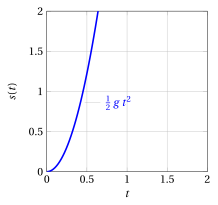
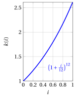

# Le funzioni

**Parte 2 · Funzioni · Capitolo 1** · dalle dispense di Fabio Furini · [:material-file-pdf-box: Dispensa del volume (PDF)](../pdf/dispensa-2-funzioni.pdf) · [:material-presentation: Slide (PDF)](../pdf/slide-funzioni-01-funzioni.pdf)

## 1. Il concetto di funzione

!!! chiave ""

    L'esistenza di una <strong>grandezza variabile</strong> sottintende l'esistenza di una <strong>relazione</strong> tra <strong>due grandezze</strong>, ovvero la dipendenza di una grandezza da un'altra.

- Questa relazione segue, di volta in volta, una certa <strong>legge</strong> o <strong>formula</strong>.

!!! esempio "Esempio 1: Leggi/formule $\rightarrow$ funzioni"

    Se si lascia cadere un oggetto pesante da una certa altezza, lo spazio percorso dall'oggetto varia col tempo $t$ secondo la formula:

    \begin{equation*}
    s(t) = \frac{1}{2}\:g\:t^2 \qquad {\rm ~~con~~} t \ge 0
    \end{equation*}

    dove  $g \approx 9,8$ è costante di accelerazione di gravità.

    { .fig .ovale loading=lazy style="width:48%" }

    Al tempo $t$ viene quindi associato lo spazio percorso $s(t)$: $t  \mapsto s(t)$.

!!! esempio "Esempio 2: Leggi/formule $\rightarrow$ funzioni"

    Se un capitale unitario viene investito per un anno al tasso annuale $i$ con interessi pagati mensilmente a un tasso $\frac{i}{12}$, avremo:

    - dopo il primo mese, un capitale pari a:

        $$
        1+ \frac{i}{12} \cdot 1= \underbrace{1 + \frac{i}{12}}_{\alpha}
        $$

    - dopo il secondo mese, un capitale pari a:

        $$
        \underbrace{1 + \frac{i}{12}}_{\alpha} + \frac{i}{12} \underbrace{\left( 1 + \frac{i}{12} \right)}_{\alpha} = \left(1 + \frac{i}{12}\right) \: \left(1 + \frac{i}{12}\right) =  \underbrace{\left(1 + \frac{i}{12}\right)^2}_{\beta}
        $$

    - dopo il terzo mese, un capitale pari a:

        $$
        \underbrace{\left(1 + \frac{i}{12}\right)^2}_{\beta} + \frac{i}{12} \: \underbrace{\left(1 + \frac{i}{12}\right)^2}_{\beta} 
        = \left(1 + \frac{i}{12}\right)^2 \: \left(1 + \frac{i}{12}\right)
        = \left(1 + \frac{i}{12}\right)^3
        $$

    Ripetendo il ragionamento, il capitale alla fine dell'anno dipende quindi dal tasso $i$ secondo la formula:

    \begin{equation*}
    k(i) = \left( 1 + \frac{i}{12}\right)^{12} \qquad {\rm ~~con~~} i \in [0,1]
    \end{equation*}

    { .fig .ovale loading=lazy style="width:42%" }

    Al tasso $i$ viene quindi associato il capitale $k(i)$ alla fine dell'anno: $i  \mapsto k(i)$

- In ciascuno degli esempi precedenti, a un <em>numero reale</em> (<strong>ingresso</strong>) viene associato <strong><em>univocamente</em></strong> un altro <em>numero reale</em> (<strong>uscita</strong>). È proprio l'<strong>univocità della relazione</strong> a caratterizzare una funzione.

- In generale, gli <strong>ingressi ammissibili</strong> per una data relazione (funzione) sono soggetti a restrizioni naturali, legate alla natura stessa della relazione.

!!! esempio "Esempio 3: Ingressi ammissibili"

    - Nel primo esempio il numero reale “di partenza” ha il significato di <em>tempo</em>; immaginando di lasciar cadere l'oggetto a un tempo iniziale $t = 0$ è evidente che ci si dovrà limitare a tempi $t \ge 0$.

    - Nel secondo esempio, evidentemente dovrà essere $0 \le i \le 1$, dove $1$ corrisponde a un tasso del 100%.

## 2. Definizione di funzione, dominio, codominio e immagine

!!! definizione "Definizione 1: di dominio"

    L'insieme degli ingressi  ammissibili per una data funzione prende il nome di <strong>dominio</strong>.

- Spesso si usano le locuzioni <strong>variabile indipendente</strong> per indicare un <em>ingresso</em> generico e <strong>variabile dipendente</strong> per indicare l'<em>uscita</em>.

!!! esempio "Esempio 4: Altri tipi di relazioni"

    Consideriamo l'insieme degli studenti di un determinato corso.

    - Se $A$ è l'insieme degli studenti e $B$ è l'insieme dei loro nomi, la relazione che associa ad ogni studente il suo nome è <em>univoca</em>.

    - In questo caso né $A$ né $B$ sono insiemi numerici, ma tuttavia risulta ben definita una relazione univoca tra questi due insiemi.

    Mentre il viceversa non è necessariamente vero: potrebbero esserci due studenti con lo stesso nome.

!!! definizione "Definizione 2: di funzione"

    Dati due insiemi $A$, $B$ qualsiasi, una <strong>funzione</strong> $f$ di <strong>dominio</strong> $A$ a valori in $B$ (o anche “di <strong>codominio</strong> $B$”) è una qualsiasi legge che ad ogni elemento di $A$ associa <em>uno e un solo elemento</em> di $B$.

- La scrittura:

    \begin{equation*}
    f: A \rightarrow B
    \end{equation*}

    (che si legge “$f$  definita da $A$ a $B$”), indica il <strong>dominio</strong> e il <strong>codominio</strong> della funzione $f$.

- La scrittura

    \begin{equation*}
    f: x \mapsto f(x)
    \end{equation*}

    (che si legge “$f$ ad $x$ associa $f(x)$”) indica come la funzione $f$ agisce sugli elementi.

- Il <strong>simbolo $f(x)$ indica l'uscita o il valore</strong>  che la funzione $f$ associa ad $x$, e non va confuso col simbolo $f$, che denota la <strong>funzione stessa</strong>.

!!! esempio "Esempio 5: Notazione delle funzioni"

    Per la funzione

    \begin{equation*}
    k(i) = \left( 1 + \frac{i}{12}\right)^{12}
    \end{equation*}

    dell'esempio precedente si avrebbe:

    $$
    k: [0,1] \rightarrow \mathbb{R}
    $$

    $$
    k: i \mapsto \left( 1 + \frac{i}{12}\right)^{12}
    $$

!!! definizione "Definizione 3: di uguaglianza di due funzioni"

    Due funzioni $f$ e $g$ sono <strong>uguali</strong> se hanno lo stesso <em>dominio</em> $A$, lo stesso <em>codominio</em> $B$ e se

    $$
    f(a) = g(a), \qquad {\rm~~per~ogni~~} a \in A.
    $$

- Una funzione non è quindi solo una “formula”: <strong>dominio e codominio fanno parte della funzione</strong>. Cambiando uno dei due si ottiene una funzione diversa, anche a parità di legge.

!!! esempio "Esempio 6: funzioni uguali e funzioni diverse"

    Consideriamo le tre funzioni

    $$
    f: \mathbb{R} \rightarrow \mathbb{R},~~ f: x \mapsto x^2 \qquad
       g: \mathbb{R} \rightarrow [0,+\infty),~~ g: x \mapsto x^2 \qquad
       h: [0,+\infty) \rightarrow \mathbb{R},~~ h: x \mapsto x^2
    $$

    - $f \neq g$: hanno lo stesso dominio e la stessa legge, ma codomini diversi;

    - $f \neq h$: hanno lo stesso codominio e la stessa legge, ma domini diversi.

- Si usa anche la scrittura

    $$
    y = f (x)
    $$

    per indicare che la variabile $y$ è funzione di $x$. In questo caso $y$ è l'uscita o il valore che $f$ associa all'ingresso $x$.

    !!! chiave ""

        Per brevità, a volte si definisce direttamente il valore di $f(x)$ in funzione di $x$, come ad esempio $f(x)=x^2+10$.

- In generale, si può pensare a una funzione come a una <strong>scatola nera</strong> che a ogni ingresso ammissibile $x$ (<strong>input</strong>) associa un'unica uscita $f(x)$ (<strong>output</strong>) :

{ .fig .ovale loading=lazy style="width:75%" }

!!! definizione "Definizione 4: di immagine e immagine del dominio"

    L'uscita corrispondente a $x$ si chiama <strong>immagine</strong> di $x$; l'insieme delle possibili uscite si chiama <strong>immagine del dominio $A$ tramite $f$</strong> e si indica con il simbolo $f(A)$ o $\Ima f$.

- Si noti che nella scrittura $f: A \rightarrow B$, il codominio $B$ può essere più grande dell'immagine $f(A)$, ovvero in generale abbiamo

    $$
    f(A) \subseteq B.
    $$

- Se $f$ ha valori reali, solitamente si scrive $f : A \rightarrow \mathbb{R}$ senza precisare quale sia l'effettiva immagine di $f$.

!!! definizione "Definizione 5: di immagine di un sottoinsieme del dominio"

    Data una funzione $f: A \rightarrow B$ e un sottoinsieme $A' \subseteq A$, l'<strong>immagine di $A'$ tramite $f$</strong> è l'insieme delle uscite prodotte dagli ingressi di $A'$:

    $$
    f(A') = \big\{ b \in B:~~ b = f(a) {\rm ~~per~qualche~~} a \in A' \big\}.
    $$

- Prendendo $A'=A$ si ritrova l'<em>immagine del dominio</em>, che si scrive quindi in forma esplicita come

    $$
    f(A) = \big\{ b \in B:~~ b = f(a) {\rm ~~per~qualche~~} a \in A \big\} \subseteq B.
    $$

!!! esempio "Esempio 7: immagine del dominio e immagine di un sottoinsieme"

    Consideriamo la funzione

    $$
    f: \mathbb{N} \rightarrow \mathbb{N}, \quad f: n \mapsto 2\:n
    $$

    - L'immagine del suo dominio è

        $$
        f(\mathbb{N}) = \big\{ m \in \mathbb{N}:~~ m = 2\:n {\rm ~~per~qualche~~} n \in \mathbb{N} \big\},
        $$

        ovvero l'insieme dei <strong>numeri pari non negativi</strong>. In particolare $f(\mathbb{N}) \subsetneq \mathbb{N}$: il codominio è strettamente più grande dell'immagine.

    - L'immagine del sottoinsieme $A' = \{0,1,2,3\} \subseteq \mathbb{N}$ è invece

        $$
        f(A') = \{0,2,4,6\}.
        $$

## 3. Suriezioni, iniezioni e biiezioni

!!! definizione "Definizione 6: di suriezione (funzione suriettiva)"

    Una funzione $f$ è una <strong>suriezione</strong> se l'immagine del suo dominio corrisponde al suo codominio.

- Se $f:  A \rightarrow B$ è una suriezione si dice anche che <strong>$f$ mappa $A$ su $B$</strong> (in inglese “<em>$f$ maps $A$ onto $B$</em>”). Si noti che la parola inglese <em>mapping</em> indica una funzione qualsiasi: è la preposizione <em>onto</em> (“su”) a esprimere la suriettività.

- Rappresentazione insiemistica:

{ .fig .ovale loading=lazy style="width:32%" }

{ .fig .ovale loading=lazy style="width:32%" }

!!! esempio "Esempio 8: funzioni suriettive e non suriettive"

    - La funzione $f(n)=\lfloor \frac{n}{2} \rfloor$ è una funzione suriettiva da $\mathbb{N}$ a $\mathbb{N}$, dato che ogni elemento nel codominio $\mathbb{N}$ è l'immagine di un qualche valore del dominio.

    - La funzione $f(n)= 2\:n$ non è una funzione suriettiva da $\mathbb{N}$ a $\mathbb{N}$, dato che nessun argomento di $f$ produce $3$ come valore.

    - La funzione $f(n)= 2\:n$ è però una funzione suriettiva dai numeri naturali ai numeri pari.

!!! osservazione "Osservazione 1"

    Dati due insiemi <strong>finiti</strong> $A$ e $B$, e una funzione $f: A \rightarrow B$, se $f$ è suriettiva allora $|A| \ge |B|$.

??? dimostrazione "Dimostrazione"

    Scriviamo $B = \{b_1, b_2, \dots, b_m\}$, con $m = |B|$, e per ogni $i \in \{1, 2, \dots, m\}$ consideriamo l'insieme degli ingressi che hanno $b_i$ come uscita:

    $$
    A_i = \big\{ a \in A:~ f(a) = b_i \big\} \subseteq A.
    $$

    - Ogni $A_i$ è <strong>non vuoto</strong>: poiché $f$ è suriettiva, ogni $b_i$ è immagine di almeno un elemento di $A$, quindi $|A_i| \ge 1$.

    - Gli insiemi $A_1, A_2, \dots, A_m$ sono a <strong>due a due disgiunti</strong>: se $a \in A_i \cap A_j$ allora $b_i = f(a) = b_j$, perché $f$ associa ad $a$ <em>una e una sola</em> uscita, e quindi $i=j$.

    - La loro <strong>unione è tutto $A$</strong>: ogni $a \in A$ appartiene all'insieme $A_i$ con $b_i = f(a)$.

    Gli insiemi $A_1, A_2, \dots, A_m$ formano quindi una <em>partizione</em> di $A$ e, essendo $A$ finito, contiamo gli elementi di $A$ sommando le cardinalità dei blocchi:

    $$
    |A| = \sum_{i=1}^{m} |A_i| \ge \sum_{i=1}^{m} 1 = m = |B|.
    $$

    
□

!!! definizione "Definizione 7: di iniezione (funzione iniettiva)"

    Una funzione $f$ è un'<strong>iniezione</strong> se argomenti distinti di $f$ producono valori distinti, ovvero se  $a \neq b$ implica $f(a) \neq f(b)$.

- rappresentazione insiemistica:

{ .fig .ovale loading=lazy style="width:32%" }

{ .fig .ovale loading=lazy style="width:32%" }

!!! esempio "Esempio 9"

    - La funzione $f(n)=  2\:n$ è una funzione iniettiva da $\mathbb{N}$ a $\mathbb{N}$, dato che ciascun numero pari $b$ è l'immagine attraverso  $f$ di esattamente un elemento del dominio, ovvero $n=\frac{b}{2}$

    - La funzione $f(n)=\lfloor \frac{n}{2} \rfloor$ non è una funzione iniettiva dato che il valore 1 si ottiene con due argomenti: $2$ e $3$.

- Una iniezione è anche chiamata una funzione <strong>one-to-one</strong>.

!!! osservazione "Osservazione 2"

    Dati due insiemi <strong>finiti</strong> $A$ e $B$, e una funzione $f: A \rightarrow B$, se $f$ è iniettiva allora $|A| \le |B|$.

??? dimostrazione "Dimostrazione"

    Scriviamo $A = \{a_1, a_2, \dots, a_n\}$, con $n=|A|$, e consideriamo le $n$ uscite

    $$
    f(a_1),~ f(a_2),~ \dots,~ f(a_n) \in f(A).
    $$

    - Queste uscite sono <strong>tutte distinte</strong>: se $i \neq j$ allora $a_i \neq a_j$ e, poiché $f$ è iniettiva, $f(a_i) \neq f(a_j)$.

    - Ogni elemento di $f(A)$ <strong>compare</strong> nell'elenco: per definizione di immagine del dominio, ogni $b \in f(A)$ è della forma $b=f(a)$ con $a \in A$, cioè $a = a_i$ per qualche $i \in \{1, 2, \dots, n\}$.

    L'elenco $f(a_1), f(a_2), \dots, f(a_n)$ enumera quindi gli elementi di $f(A)$ senza ripetizioni, e perciò

    $$
    |A| = n = |f(A)|.
    $$

    Infine $f(A) \subseteq B$ e $B$ è finito, quindi $|f(A)| \le |B|$. Mettendo insieme le due relazioni otteniamo $|A| \le |B|$. □

!!! chiave ""

    Le due osservazioni precedenti sono enunciate per insiemi <strong>finiti</strong>: le dimostrazioni <em>contano</em> gli elementi, e il conteggio ha senso solo per insiemi finiti. Il confronto fra le “grandezze” di due insiemi infiniti richiede una nozione diversa di cardinalità, che si introduce nel capitolo “Cardinalità degli insiemi infiniti” della Parte 1.

!!! definizione "Definizione 8: di biiezione (funzione biunivoca o bigettiva)"

    Una funzione $f$ è una <strong>biiezione</strong> se: $(i)$ è <u><em>iniettiva</em></u> e $(ii)$ è <u><em>suriettiva</em></u>.

- rappresentazione insiemistica:

{ .fig .ovale loading=lazy style="width:32%" }

!!! esempio "Esempio 10"

    - La funzione $f(n)= (-1)^n\:\lceil \frac{n}{2} \rceil$ è una biiezione da $\mathbb{N}$ a $\mathbb{Z}$. I valori della funzione sono:

        $$
        f(0)=0,~~~f(1)=-1,~~~f(2)=1,~~~f(3)=-2,~~~f(4)=2 \dots
        $$

        La funzione è iniettiva, dato che nessun elemento di $\mathbb{Z}$ è immagine di più di un elemento di  $\mathbb{N}$. La funzione è suriettiva, dato che  tutti gli elementi di  $\mathbb{Z}$ sono immagini di un qualche elemento di $\mathbb{N}$.

- Una biiezione è chiamata anche una corrispondenza <strong>one-to-one</strong>, dato che accoppia elementi del dominio a elementi del codominio.

- Una biiezione da un insieme $A$  a se stesso è chiamata anche <strong>permutazione</strong>.

## 4. Inversa di una biiezione

- Una biiezione $f: A \rightarrow B$ accoppia ogni elemento di $A$ con un elemento di $B$ e viceversa: si può quindi percorrere l'accoppiamento anche nel verso opposto, da $B$ ad $A$.

!!! definizione "Definizione 9: di inversa di una biiezione"

    Data una biiezione $f: A \rightarrow B$, la sua <strong>inversa</strong> è la funzione

    $$
    f^{-1}: B \rightarrow A, \qquad f^{-1}(b)=a ~~~\Longleftrightarrow~~~ f(a)=b.
    $$

- La definizione è ben posta, cioè $f^{-1}$ è davvero una funzione, proprio perché $f$ è una biiezione: dato $b \in B$,

    - la <em>suriettività</em> di $f$ garantisce che esista <em>almeno un</em> $a \in A$ con $f(a)=b$;

    - l'<em>iniettività</em> di $f$ garantisce che ne esista <em>al più uno</em>, perché due ingressi distinti hanno uscite distinte.

    Quindi a ogni $b \in B$ corrisponde <em>uno e un solo</em> $a \in A$, come richiede la definizione di funzione.

- In altre parole, se $f$ applicata all'ingresso $a$ dà l'uscita $b$, allora $f^{-1}$ applicata a $b$ restituisce $a$:

    $$
    f^{-1}\big(f(a)\big)=a,~~\forall a \in A \qquad {\rm ~~e~~} \qquad f\big(f^{-1}(b)\big)=b,~~\forall b \in B.
    $$

!!! chiave ""

    Qui l'inversa è definita su <strong>tutto</strong> il codominio $B$, e perciò servono <em>sia</em> l'iniettività <em>sia</em> la suriettività di $f$. Nel capitolo “Funzioni inverse” si studiano invece le funzioni reali di variabile reale, e lì una funzione si dice <em>invertibile</em> quando è soltanto <strong>iniettiva</strong>: l'inversa viene costruita sull'<em>immagine</em> $f(D)$ e non su tutto il codominio, e rispetto all'immagine la suriettività è automatica.

!!! esempio "Esempio 11: inversa di una biiezione"

    Riprendiamo la biiezione $f: \mathbb{N} \rightarrow \mathbb{Z}$ dell'esempio precedente,

    $$
    f(n)= (-1)^n\:\left\lceil \frac{n}{2} \right\rceil,
    $$

    che accoppia $0 \leftrightarrow 0$, $1 \leftrightarrow -1$, $2 \leftrightarrow 1$, $3 \leftrightarrow -2$, $4 \leftrightarrow 2, \dots$

    La sua inversa $f^{-1}: \mathbb{Z} \rightarrow \mathbb{N}$ è:

    $$
    f^{-1}(m)=
    \begin{cases}
    2\:m & {\rm se~~} m \ge 0\\[1ex]
    -(2\:m+1) & {\rm se~~} m < 0
    \end{cases}
    $$

    Infatti, se $m \ge 0$, allora $n = 2\:m$ è pari e $f(n)=(-1)^{2m} \lceil m \rceil = m$; se invece $m<0$, allora $n=-(2\:m+1)=-2\:m-1$ è dispari e non negativo, e

    $$
    f(n)=(-1)^{n}\left\lceil \frac{-2\:m-1}{2} \right\rceil = -\left\lceil -m-\frac{1}{2} \right\rceil = -(-m)=m,
    $$

    dove si è usato che $-m-\frac{1}{2}$ ha parte intera superiore $-m$, essendo $-m$ un intero positivo.
