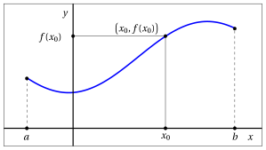
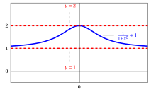
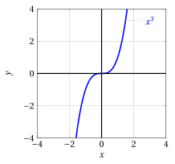
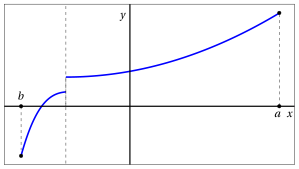
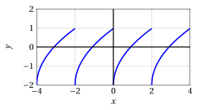

# Funzioni reali di variabile reale

**Parte 2 · Funzioni · Capitolo 2** · dalle dispense di Fabio Furini e Valerio Dose · [:material-file-pdf-box: PDF del capitolo](../pdf/funzioni-02-funzioni-reali.pdf)

## 1. Funzione reale di variabile reale

!!! definizione "Definizione 1: funzione reale di variabile reale"

    Una funzione che ha per <em>dominio</em> $D$ un sottoinsieme di $\mathbb{R}$ e per <em>codominio</em> $\mathbb{R}$:

    \begin{align*}
    f&: D \subseteq \mathbb{R} \rightarrow \mathbb{R},~~~f: x \mapsto f(x)
    \end{align*}

    si chiama <strong>funzione reale di variabile reale</strong>.

- Sono  funzioni in cui la variabile di “ingresso” $x$ e quella di “uscita” $f(x)$ sono numeri reali.

- Le funzioni reali di variabile reale più comuni hanno come dominio $D$ e come immagine $f(D)$ un <strong>intervallo</strong> (eventualmente  tutto $\mathbb{R}$) o l'unione di un <strong>numero finito di intervalli</strong>.

!!! chiave ""

    La dipendenza dell'uscita $f(x)$ dall'ingresso $x$ si visualizza efficacemente disegnando il <strong>grafico</strong> di $f$, ossia l'insieme dei punti del piano di coordinate $(x,y)$ con $y = f(x)$ e  $x$ nel  dominio  $D$. 

    Esempio di  grafico di funzione reale di variabile reale di dominio $D = [a, b]$ (un intervallo chiuso e limitato): 

    { .fig .ovale loading=lazy style="width:80%" }

    Ogni retta parallela all'asse delle ordinate che interseca l'asse delle ascisse in un punto $x_0$ del dominio $D$, interseca il grafico di $f$ in uno e un solo punto.  [^1]  <strong>Non tutte le curve sono quindi grafici di funzioni</strong>.

    Si noti che, invece, nulla impedisce che una retta parallela all'asse delle ascisse intersechi il grafico di $f$ in più punti o in nessun punto.

!!! esempio "Esempio 1: curva che non corrisponde al grafico di una funzione"

    Consideriamo ad esempio la curva dei  punti della circonferenza di raggio $r$:

    $$
    {x^2+y^2=r^2} ~~\Longleftrightarrow~~ y = \pm \sqrt{r^2-x^2}
    $$

    { .fig .ovale loading=lazy style="width:55%" }

    All'ingresso $x_0 \in (-r,r)$ non è possibile associare un'unica uscita, quindi questa curva non corrisponde al grafico di una funzione!

## 2. Funzioni limitate

!!! definizione "Definizione 2: funzione
limitate"

    Data una funzione $f: D \subseteq \mathbb{R} \rightarrow \mathbb{R}$, la funzione si dice

    $$
    \begin{cases}
    {\rm limitata~superiormente} & {\rm se~~} \exists M \in \R: f(x) \le M,~~ \forall  x \in D\\[2ex]
    {\rm limitata~inferiormente} & {\rm se~~} \exists M \in \R: f(x) \ge M,~~ \forall  x \in D\\[2ex]
    {\rm limitata} & {\rm se~~} \exists M \in \R_{\ge 0}: |f(x)| \le M,~~ \forall  x \in D\\
    \end{cases}
    $$

- Graficamente abbiamo:

    1. una funzione è limitata superiormente se il suo grafico è contenuto nel semipiano inferiore delimitato da una retta parallela all'asse delle ascisse

    2. una funzione è limitata inferiormente se il suo grafico è contenuto nel semipiano superiore delimitato da una retta parallela all'asse delle ascisse

    3. una funzione è limitata se il suo grafico è contenuto in una striscia orizzontale

!!! esempio "Esempio 2: funzione limitata"

    Consideriamo la funzione:

    $$
    f: \mathbb{R} \rightarrow \mathbb{R},~~ f: x \mapsto \frac{1}{1 + x^2} +1
    $$

    abbiamo

    $$
    \frac{1}{1 + x^2} +1=  \frac{1+ x^2- x^2}{1 + x^2} +1 = 2- \frac{x^2}{1+x^2} \qquad {\rm ~~e~~} \qquad \frac{x^2}{1+x^2} > 0, ~~\forall x \in \R
    $$

    $$
    {\rm ~~~quidi~~~}1  < \frac{1}{1 + x^2} +1 \le 2, \forall x \in \mathbb{R}
    $$

    { .fig .ovale loading=lazy style="width:70%" }

!!! esempio "Esempio 3: Funzione non limitata"

    La funzione

    $$
    f: \mathbb{R} \rightarrow \mathbb{R},~~ f: x \mapsto x^3 \qquad (y=x^3)
    $$

    non è limitata né superiormente, né inferiormente.

    { .fig .ovale loading=lazy style="width:42%" }

!!! esempio "Esempio 4: Funzione limitata inferiormente"

    La funzione

    $$
    f: \mathbb{R} \rightarrow \mathbb{R},~~ f: x \mapsto x^2 +10 \qquad (y=x^2)
    $$

    è limitata inferiormente; infatti $x^2  \ge 0, \forall x \in \mathbb{R}$

    { .fig .ovale loading=lazy style="width:45%" }

- Equivalentemente, si può dire che una funzione è <em>limitata superiormente </em>(<em>limitata inferiormente</em>, <em>limitata</em>) se, rispettivamente, la sua <strong>immagine</strong> è un sottoinsieme di $\mathbb{R}$ <em>limitato superiormente</em> (<em>limitato inferiormente</em>, <em>limitato</em>).

## 3. Funzioni simmetriche

!!! definizione "Definizione 3: di funzione pari"

    Funzioni che hanno il grafico simmetrico rispetto all'asse delle ordinate si chiamano <strong>pari</strong>.

- Sono caratterizzate dalla relazione

    $$
    f(-x) = f(x)
    $$

    che esprime l'uguaglianza delle ordinate corrispondenti ai punti $x$ e $-x$, simmetrici rispetto a $x = 0$.

!!! definizione "Definizione 4: Funzione dispari"

    Funzioni che hanno il grafico simmetrico rispetto all'origine si chiamano <strong>dispari</strong>.

- Sono caratterizzate dalla relazione

    $$
    f(-x) = - f(x)
    $$

    che esprime che le ordinate corrispondenti ai punti $x$ e $-x$, simmetrici rispetto a $x = 0$, sono una l'opposto dell'altra.

!!! esempio "Esempio 5: Funzioni pari e dispari"

    Per esempio, la funzione $x \mapsto x^2$ è pari, mentre $x  \mapsto x^3$ è dispari. Più in generale, le potenze a esponente intero sono funzioni pari  se l'esponente è pari e sono dispari se l'esponente è dispari.

1. <strong>Esempio di  grafico di  funzione pari</strong>:

    { .fig .ovale loading=lazy style="width:80%" }

2. <strong>Esempio di grafico di  funzione dispari</strong>:

    { .fig .ovale loading=lazy style="width:80%" }

!!! chiave ""

    Una funzione <em>non può</em> avere il grafico simmetrico rispetto all'asse $x$, in quanto verrebbe meno l'univocità della corrispondenza.

## 4. Funzioni monotone

!!! definizione "Definizione 5: Funzione  crescente"

    Una funzione si dice <strong> non decrescente</strong> se per ogni coppia di punti $x_1$, $x_2$ nel dominio di $f$ si ha:

    \begin{equation}
    x_1 > x_2 ~~\Longrightarrow~~ f(x_1) \ge f(x_2) \label{ed:monCRE}
    \end{equation}

!!! definizione "Definizione 6: Funzione strettamente  crescente"

    Una funzione si dice <strong>crescente</strong>  se per ogni coppia di punti $x_1$, $x_2$ nel dominio di $f$ si ha:

    \begin{equation}
    x_1 > x_2 ~~\Longrightarrow~~ f(x_1) > f(x_2) \label{ed:monCRES}
    \end{equation}

!!! definizione "Definizione 7: Funzione  decrescente"

    Una funzione si dice <strong>non crescente</strong> se per ogni coppia di punti $x_1$, $x_2$ nel dominio di $f$ si ha:

    \begin{equation}
    x_1 > x_2 ~~\Longrightarrow~~ f(x_1) \le f(x_2) \label{ed:monDECRE}
    \end{equation}

!!! definizione "Definizione 8: Funzione strettamente  decrescente"

    Una funzione si dice <strong>decrescente</strong>  se per ogni coppia di punti $x_1$, $x_2$ nel dominio di $f$ si ha:

    \begin{equation}
    x_1 > x_2 ~~\Longrightarrow~~ f(x_1) < f(x_2) \label{ed:monDECRES}
    \end{equation}

- Una funzione $f$ è <em>non decrescente</em> se, all'aumentare di $x$, l'ordinata corrispondente sul grafico della funzione non diminuisce (quindi o rimane uguale o aumenta);

- Una funzione $f$ è <em>non crescente</em>  se, all'aumentare di $x$, l'ordinata corrispondente sul grafico della funzione non aumenta (quindi o rimane uguale o diminuisce).

!!! chiave ""

    Le funzioni crescenti o decrescenti si chiamano <strong>monotone</strong>. Le funzioni strettamente crescenti o decrescenti si chiamano <strong>strettamente monotone</strong>.

!!! esempio "Esempio 6: Funzioni monotone"

    Per esempio, la funzione $x \mapsto x^3$ è strettamente monotona crescente; la funzione costante  $x \mapsto k$ (che ha come grafico la retta di equazione $y = k$) è sia non monotona crescente che decrescente.

1. <strong>Esempio di grafico di funzione non decrescente</strong> (tratto orizzontale):

    { .fig .ovale loading=lazy style="width:80%" }

2. <strong>Esempio di grafico di funzione  crescente</strong>:

    { .fig .ovale loading=lazy style="width:80%" }

- Le funzioni crescenti o decrescenti (strettamente o non) si dicono <strong>monotone</strong>.

## 5. Funzioni periodiche

!!! definizione "Definizione 9: Funzione periodica"

    Una funzione $f:D \rightarrow \mathbb{R}$ (non costante) è <strong>periodica</strong> di periodo $T$ , $T > 0$, se T è il più piccolo numero reale positivo tale che

    $$
    f(x+T)=f(x) {\rm~~~per~ogni~~} x \in D
    $$

- Ogni intervallo di lunghezza $T$, contenuto in $D$, si chiama <strong>intervallo di periodicità</strong>.

!!! esempio "Esempio 7: Funzioni periodiche"

    Tipici esempi di funzioni periodiche sono le <em>funzioni trigonometriche</em> $x \mapsto \sin(x)$ ($T=2\:\pi$), $x \mapsto \cos(x)$ ($T=2\:\pi$) e $x \mapsto \tan(x)$ ($T=\pi$).

!!! esempio "Esempio 8: Grafico di funzioni periodiche"

    Grafico di funzione periodica di periodo $T=2$:

    { .fig .ovale loading=lazy style="width:80%" }

- Le rette parallele all'asse delle ascisse, hanno equazione

    $$
    y = k \qquad k \in \mathbb{R}
    $$

[^1]:  Se la retta non intersecasse il grafico significherebbe che all'ingresso $x$ non corrisponde alcuna uscita. Se la retta intersecasse in più di un punto significherebbe che all'ingresso $x$ corrispondono più uscite distinte, cadendo quindi l'univocità della funzione.
