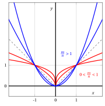
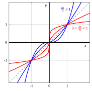
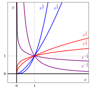
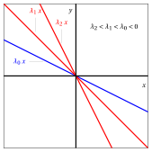
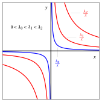
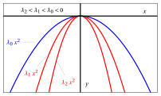
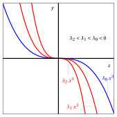

# Funzioni potenza

**Parte 2 · Funzioni · Capitolo 3** · dalle dispense di Fabio Furini · [:material-file-pdf-box: PDF del capitolo](../pdf/funzioni-03-potenza.pdf)

## 1. Funzioni potenza

!!! definizione "Definizione 1: funzioni potenza"

    Dato $\alpha \in \R, \alpha \neq 0$, la funzione:

    \begin{equation}
    \label{potenze}
    f:D \subseteq \R \rightarrow \mathbb{R},~~~ f:x \mapsto x^{\alpha}
    \end{equation}

    si chiama <strong>funzione potenza</strong> con esponente $\alpha$. Il dominio $D$ dipende dal valore di $\alpha$:

    - con esponente razionale $\alpha=\frac{m}{n} \in \Q$,  $m \in \Z$ e $n \in \N_+$ coprimi, abbiamo quattro  casi:

        $$
        D=
        \begin{cases}
         \R & {\rm ~~se~~} n {\rm ~~dispari~~}  {\rm ~~e~~~}  \frac{m}{n}>0\\[2ex]
         \R \setminus \{0\} & {\rm ~~se~~} n {\rm ~~dispari~~}  {\rm ~~e~~~}  \frac{m}{n}<0\\[2ex]
         [0,\ip) & {\rm ~~se~~} n {\rm ~~pari~~}  {\rm ~~e~~~}  \frac{m}{n}>0\\[2ex]
         (0,\ip)  & {\rm ~~se~~} n {\rm ~~pari~~}  {\rm ~~e~~~}  \frac{m}{n}<0
        \end{cases}
        $$

    - con esponente reale e non razionale $\alpha \in \R \setminus \Q$, abbiamo due casi:

        $$
        D=
        \begin{cases}
         [0,\ip) & {\rm ~~se~~} \alpha >0\\[2ex]
         (0,\ip) & {\rm ~~se~~} \alpha<0
        \end{cases}
        $$

### 1.1 Esponente razionale

!!! chiave ""

    Con $\alpha=\frac{m}{n} \in \Q$, $m \in \Z$ e $n \in \N_+$ coprimi, abbiamo una funzione potenza a esponente razionale:

    $$
    f:D \subseteq \R \rightarrow \mathbb{R},~~~ f:x \mapsto x^{\frac{m}{n}}=\sqrt[n]{x^m}
    $$

    Abbiamo i tre seguenti casi in funzione della parità/disparità di $m$ e $n$.

1. Con $n$ dispari e $m$ pari  è una <strong>funzione pari</strong> ovvero $(-x)^{\frac{m}{n}}=x^{\frac{m}{n}}$. Per la positività e la monotonia abbiamo:

    $$
    x^{\frac{m}{n}} > 0, ~~~\forall x \in \R \setminus \{0\};\qquad
    x^{\frac{m}{n}} = 0 \Longleftrightarrow x=0 {\rm ~~e~~} \frac{m}{n}>0
    $$

    $$
    \begin{cases}
          {\rm ~~se~~} \frac{m}{n} >0 {\rm ~~~allora~} f {\rm ~~è~decrescente~in~} (\im,0] {\rm ~~e~crescente~in~} [0,\ip)\\[3ex]
    {\rm ~~se~~} \frac{m}{n}<0  {\rm ~~~allora~}  f {\rm ~~è~crescente~in~} (\im,0) {\rm ~~e~decrescente~in~} (0,\ip)
    \end{cases}
    $$

    

    { .fig .ovale loading=lazy style="width:91%" }

    { .fig .ovale loading=lazy style="width:91%" }

    

2. Con $n$ dispari e $m$ dispari  è una <strong>funzione dispari</strong> ovvero $(-x)^{\frac{m}{n}}=-x^{\frac{m}{n}}$. Per la positività e la monotonia abbiamo:

    $$
    x^{\frac{m}{n}} < 0, ~ \forall x < 0,~~~~x^{\frac{m}{n}} > 0, ~ \forall x > 0;\qquad
    x^{\frac{m}{n}} = 0 \Longleftrightarrow x=0 {\rm ~~e~~} \frac{m}{n}>0
    $$

    $$
    \begin{cases}
          {\rm ~~se~~} \frac{m}{n} >0 {\rm ~~~allora~} f {\rm ~~è~crescente~in~} \R\\[3ex]
    {\rm ~~se~~} \frac{m}{n}<0  {\rm ~~~allora~}  f {\rm ~~è~decrescente~in~} (\im,0) {\rm ~~e~in~} (0,\ip)
    \end{cases}
    $$

    

    { .fig .ovale loading=lazy style="width:97%" }

    { .fig .ovale loading=lazy style="width:97%" }

    

    

    !!! esempio "Esempio 1: grafici di funzioni potenza con esponente razionale $\frac{m}{n}$ e $n$ dispari"

        Con $m$ pari:

        { .fig .ovale loading=lazy style="width:55%" }

        Con $m$ dispari:

        { .fig .ovale loading=lazy style="width:55%" }

3. Con $n$ pari e con $m$ dispari ($m$ non può essere pari dato che sono coprimi), per la positività e la monotonia abbiamo:

    $$
    x^{\frac{m}{n}} > 0, ~~~\forall x >0;\qquad
    x^{\frac{m}{n}} = 0 \Longleftrightarrow x=0 {\rm ~~e~~} \frac{m}{n}>0
    $$

    $$
    \begin{cases}
          {\rm ~~se~~} \frac{m}{n} >0 {\rm ~~~allora~} f {\rm ~~è~crescente~in~} [0,\ip)\\[3ex]
    {\rm ~~se~~} \frac{m}{n}<0  {\rm ~~~allora~}  f {\rm ~~è~decrescente~in~} (0,\ip)
    \end{cases}
    $$

    

    { .fig .ovale loading=lazy style="width:91%" }

    { .fig .ovale loading=lazy style="width:91%" }

    

    

    !!! esempio "Esempio 2: grafici di funzioni potenza con esponente razionale $\frac{m}{n}$ e $n$ pari"

        { .fig .ovale loading=lazy style="width:55%" }

### 1.2 Esponente reale

- Con $\alpha \in \R\setminus \Q$, per la positività e la monotonia abbiamo:

    $$
    x^{\alpha} > 0, ~~~\forall x >0;\qquad
    x^{\alpha} = 0 \Longleftrightarrow x=0 {\rm ~~e~~} \alpha>0
    $$

    $$
    \begin{cases}
          {\rm ~~se~~} \alpha >0 {\rm ~~~allora~} f {\rm ~~è~crescente~in~} [0,\ip)\\[2ex]
    {\rm ~~se~~} \alpha<0  {\rm ~~~allora~}  f {\rm ~~è~decrescente~in~} (0,\ip)
    \end{cases}
    $$

    

    { .fig .ovale loading=lazy style="width:91%" }

    { .fig .ovale loading=lazy style="width:91%" }

    

!!! esempio "Esempio 3: grafici di funzioni potenza con esponente reale"

    { .fig .ovale loading=lazy style="width:55%" }

<strong>Prova tu</strong> — il grafico interattivo qui sotto ti fa vedere quello che hai appena letto: muovi i cursori.

### 1.3 Polinomi

!!! definizione "Definizione 2: polinomio"

    Dati $n+1$ valori $a_i \in \R$ con $i \in \{0,1,\dots,n\}$ e $a_n \neq 0$, la funzione:

    \begin{equation}
    \label{potenze__2}
    f:\R \rightarrow \mathbb{R},~~~ f:x \mapsto \underbrace{\sum_{i=0}^n a_i \: x^i }_{= P_n(x)}
    \end{equation}

    si chiama <strong>polinomio</strong> di grado $n$.

- Per ogni <strong>monomio</strong> $i \in \{0,1,\dots,n\}$:

    1. il valore $a_i$ è il <strong>coefficiente del monomio</strong>

    2. la funzione potenza $x^i$ con esponente intero $i$  è la <strong>parte letterale</strong> del monomio

    Il valore $a_0$ è il <strong>termine noto</strong> del polinomio dato che $x^0=1.$

!!! esempio "Esempio 4: polinomio"

    Ad esempio con $n=4$,  $a_0=1$, $a_1=-2$, $a_2=0$, $a_3=\frac{1}{2}$ e $a_4=\frac{1}{9}$  abbiamo il seguente polinomio di grado quattro:

    $$
    P_4(x) = \sum_{i=0}^4 a_i \: x^i = 1 - 2 \; x + \frac{1}{2} \; x^3 + \frac{1}{9} \; x^4
    $$

    { .fig .ovale loading=lazy style="width:55%" }

## 2. Funzioni di proporzionalità diretta e inversa

!!! chiave ""

    Con $\alpha = 1$ e dato $\lambda \in \mathbb{R}$, abbiamo la famiglia di <strong>funzioni di proporzionalità diretta o lineari</strong>:

    $$
    f:\R \rightarrow \mathbb{R},~~~ f:x \mapsto \lambda \: x  {\rm ~~~~dove~~}  \lambda {\rm ~~è~la~costante~di~proporzionalità ~diretta}
    $$

    Inoltre $\lambda= \tan \vartheta$ e $\vartheta$ è l'angolo della retta $y=\lambda \: x$ con l'asse delle $x$.

{ .fig .ovale loading=lazy style="width:91%" }

{ .fig .ovale loading=lazy style="width:91%" }

!!! chiave ""

    Con $\alpha = -1$ e dato $\lambda \in \mathbb{R}$, abbiamo la famiglia di <strong>funzioni di proporzionalità inversa o iperboli equilatere</strong>:

    $$
    f:\R \setminus \{0\} \rightarrow \mathbb{R},~~~ f:x \mapsto \frac{\lambda}{x}  {\rm ~~~~dove~~}  \lambda {\rm ~~è~la~costante~di~proporzionalità ~indiretta}
    $$

{ .fig .ovale loading=lazy style="width:91%" }

{ .fig .ovale loading=lazy style="width:91%" }

!!! chiave ""

    Dati $\alpha \in \R$ e $\lambda \in \mathbb{R}$, abbiamo la famiglia di <strong>funzioni di potenza moltiplicate per una costante</strong>:

    $$
    f:D \subseteq \R \rightarrow \mathbb{R},~~~ f:x \mapsto \lambda \: x^{\alpha}  {\rm ~~~~dove~~}  \lambda {\rm ~~è~la~costante~moltiplicativa}
    $$

- Ad esempio con $\alpha$ uguale  a $2$ o uguale a $3$ e $\lambda \in \R$  abbiamo:

{ .fig .ovale loading=lazy style="width:55%" }

{ .fig .ovale loading=lazy style="width:55%" }

{ .fig .ovale loading=lazy style="width:91%" }

{ .fig .ovale loading=lazy style="width:91%" }

- Ad esempio con $\alpha=\frac{1}{2}$ e $\lambda \in \R$  abbiamo:

{ .fig .ovale loading=lazy style="width:61%" }

{ .fig .ovale loading=lazy style="width:61%" }
