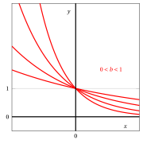
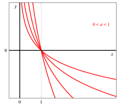
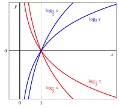

# Funzioni esponenziali e logaritmiche

**Parte 2 · Funzioni · Capitolo 4** · dalle dispense di Fabio Furini e Valerio Dose · [:material-file-pdf-box: PDF del capitolo](../pdf/funzioni-04-esponenziali-logaritmi.pdf)

## 1. Funzioni esponenziali

!!! definizione "Definizione 1: funzioni esponenziali"

    Dato $b \in \R_+\setminus \{1\}$, la funzione:

    \begin{equation}
    \label{epeonziali}
    f: \mathbb{R} \rightarrow \mathbb{R},~~~ f:x \mapsto  b^x
    \end{equation}

    si chiama <strong>funzione esponenziale</strong> in base $b$.

- Per la positività e la monotonia abbiamo:

    $$
    b^x> 0, ~~~\forall x \in \R  {\rm ~~~e~~~}
    \begin{cases}
          {\rm ~~se~~} 0 < b < 1 {\rm ~~~allora~} f {\rm ~~è~decrescente~in~} \R\\[3ex]
    {\rm ~~se~~} b > 1   {\rm ~~~allora~}  f {\rm ~~è~crescente~in~} \R
    \end{cases}
    $$

{ .fig .ovale loading=lazy style="width:97%" }

{ .fig .ovale loading=lazy style="width:97%" }

## 2. Funzioni logaritmiche

!!! definizione "Definizione 2: funzioni logaritmiche"

    Dato $a \in \R_{>0}\setminus \{1\}$, la funzione:

    \begin{equation}
    \label{epeonziali__2}
    f: (0,+\infty) \rightarrow \mathbb{R},~~~ f:x \mapsto \log_a x
    \end{equation}

    si chiama <strong>funzione logaritmica</strong> in base $a$.

- Per la positività e la monotonia abbiamo:

    $$
    \begin{cases}
    {\rm ~~se~~} 0 < a < 1 & \log_a x > 0,~~ \forall x \in (0,1),~~\log_a x < 0,~~ \forall x \in (1,\ip){\rm ~~~e~~~} f {\rm ~~è~decrescente~in~} \R_{>0}  \\[4ex]
    {\rm ~~se~~} a > 1 & \log_a x < 0,~~ \forall x \in (0,1),~~\log_a x > 0,~~ \forall x \in (1,\ip) {\rm ~~~e~~~} f {\rm ~~è~crescente~in~} \R_{>0} 
    \end{cases}
    $$

    Inoltre abbiamo:

    $$
    \log_a x = 0 \Longleftrightarrow x=1,~~~ \forall  a \in \R_{>0}\setminus \{1\}
    $$

{ .fig .ovale loading=lazy style="width:97%" }

{ .fig .ovale loading=lazy style="width:97%" }

## 3. Cambiamento di base

!!! chiave ""

    Data una qualsiasi base $c \in \R_{>0}\setminus \{1\}$, tutte le funzioni esponenziali e logaritmiche si possono ricondurre ad un'altra base $d \in \R_{>0} \setminus \{1\}$ come segue:

    $$
    c^x = d^{\log_d c^x}   = d^{x \; \log_d c}  {\rm ~~~~~quindi~con~~}   \lambda = \log_d c {\rm ~~~~risulta~~~~~} c^x = d^{\lambda \; x}
    $$

    $$
    \log_c x = \frac{\log_d x}{\log_d c} {\rm ~~~~~quindi~con~~}   \lambda=\frac{1}{\log_d c} {\rm ~~~~risulta~~~~~} \log_c x= \lambda \; \log_d x
    $$

    La funzione logaritmica in base $e$  si scrive anche $\log x$ o $\ln x$ mentre quella in base $2$ si scrive anche $\lg x$.

!!! esempio "Esempio 1: grafici di funzioni esponenziali e logaritmiche "

    Funzioni esponenziali:

    { .fig .ovale loading=lazy style="width:58%" }

    Funzioni logaritmiche:

    { .fig .ovale loading=lazy style="width:58%" }
