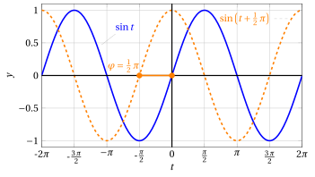
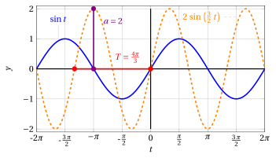
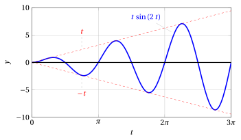
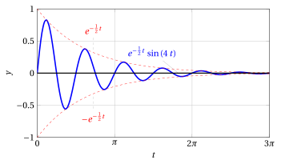

# Fenomeni vibratori

**Parte 2 · Funzioni · Capitolo 6** · dalle dispense di Fabio Furini · [:material-file-pdf-box: Dispensa del volume (PDF)](../pdf/dispensa-2-funzioni.pdf)

## 1. Fenomeni vibratori

- Abbiamo visto che le funzioni seno e coseno sono periodiche di <strong>periodo</strong> $2\: \pi$. Useremo la variabile $t$ per indicare il tempo.

    { .fig .ovale loading=lazy style="width:80%" }

- Ricordiamo che $\sin (t + \varphi)$ corrisponde a una <strong>transizione di fase</strong> $\varphi$ (traslazione orizzontale).

    { .fig .ovale loading=lazy style="width:80%" }

!!! chiave ""

    Le funzioni:

    \begin{equation}
    \label{trig_vibr}
    t \mapsto a\: \sin \:(\omega \: t), \qquad\qquad t \mapsto b\: \cos \:(\omega \: t)
    \end{equation}

    dove $a$, $b$ e $\omega$ sono numeri reali positivi, sono chiamate <strong>vibrazioni elementari</strong>.  Sono funzioni periodiche di

    $$
    {\rm \textbf{periodo}~~~} T = \frac{2\:\pi}{\omega}
    $$

!!! esempio "Esempio 1: periodo"

    Per esempio considerando $t' = t + \frac{2\: \pi}{\omega}$:

    $$
    \sin \left[ \omega \underbrace{\left( t + \frac{2\: \pi}{\omega} \right)}_{t'}\right] = \sin (\omega \: t + 2\: \pi) = \sin \omega \: t
    $$

- Chiaramente abbiamo:

    $$
    |a\: \sin \:(\omega \: t)| \le a \qquad{\rm ~~e~~}\qquad |b\: \cos \:(\omega \: t)| \le b
    $$

!!! chiave ""

    Le funzioni \(\eqref{trig_vibr}\) descrivono vibrazioni elementari caratterizzate da

    $$
    {\rm \textbf{ampiezza}~~} a {\rm ~~e~~} b {\rm ~~~~(rispettivamente)}
    $$

    $$
    {\rm \textbf{pulsazione}~~} \omega = \frac{2\: \pi}{T}
    $$

    detta anche <em>velocità angolare</em>, che  indica quanti periodi ci sono in un intervallo di $2\: \pi$. Inoltre sono caratterizzate dalla

    $$
    {\rm \textbf{frequenza}~~} \nu = \frac{\omega}{2\:\pi}
    $$

    che indica quante volte la funzione si ripete in un intervallo di lunghezza $1$

!!! esempio "Esempio 2: di ampiezza, pulsazione e frequenza"

    $$
    t \mapsto 2\: \sin \:\left( \frac{3}{2} \: t \right) \qquad a=2,~ \omega=\frac{3}{2},~ T=\frac{4\:\pi}{3}
    $$

    { .fig .ovale loading=lazy style="width:80%" }

    La pulsazione $\omega=\frac{3}{2}$ significa che ci sono 1.5 periodi nell'intervallo $2 \: \pi$. La frequenza $\nu$ è $\frac{3}{4\:\pi}$.

- La funzione

    \begin{equation}
    \label{EEE}
    h(t) = a\: \sin \:(\omega \: t) + b\: \cos \:(\omega \: t)
    \end{equation}

    descrive la <strong>sovrapposizione</strong> delle due vibrazioni elementari di <strong>uguale pulsazione</strong> $\omega$. Quest'ultima è ancora una vibrazione elementare <strong>sfasata</strong> rispetto alle precedenti.

- Infatti, posto

    $$
    A= \sqrt{a^2 + b^2}
    $$

    si può scrivere

    \begin{equation}
    \label{EEEE}
    h(t) = A \: \underbrace{\frac{a}{ \sqrt{a^2 + b^2}}}_{\alpha} \: \sin \:(\omega \: t) + A \: \underbrace{\frac{b}{ \sqrt{a^2 + b^2}}}_{\beta} \: \cos \:(\omega \: t)
    \end{equation}

- Osserviamo ora che i numeri

    $$
    \alpha=\frac{a}{ \sqrt{a^2 + b^2}} {\rm ~~e~~} \beta=\frac{b}{ \sqrt{a^2 + b^2}}
    $$

    soddisfano le condizioni

    $$
    -1 \le \alpha \le 1 \qquad -1 \le \beta \le 1 \qquad  \alpha^2 + \beta^2=1
    $$

    Esiste quindi un <strong>unico angolo</strong> $\varphi$ tale che

    $$
    \cos \varphi = \alpha \qquad \sin \varphi = \beta
    $$

    cosicché la \(\eqref{EEEE}\) si può riscrivere nella forma seguente

    \begin{align}
    \label{EEEEE}
    h(t) & = A \: \cos \varphi \: \sin (\omega \:t) + A \: \sin \varphi \: \cos (\omega \:t)\nonumber\\[2ex]
         & = A \: \sin (\omega\:t + \varphi)
    \end{align}

    Dunque $h(t)$ rappresenta una vibrazione elementare di ampiezza $A$, pulsazione $\omega$, sfasata di un angolo $\varphi$.

    { .fig .ovale loading=lazy style="width:80%" }

In sintesi:

!!! chiave ""

    \begin{align*}
    a\: \sin \:(\omega \: t) + b\: \cos \:(\omega \: t) = A \: \sin (\omega\:t + \varphi)\\[2ex]
    A = \sqrt{a^2 + b^2} \qquad 
    \begin{cases}
    a= A \: \cos \varphi \\
    b= A \: \sin \varphi 
    \end{cases}
    \end{align*}

- Sotto condizioni abbastanza generali; un fenomeno naturale periodico si potrà scrivere come sovrapposizione di un numero finito o infinito di vibrazioni elementari di frequenza diversa (<strong>serie di Fourier</strong>).

<strong>Prova tu</strong> — il grafico interattivo qui sotto ti fa vedere quello che hai appena letto: muovi i cursori.

## 2. Effetti di smorzamento o di amplificazione

- Moltiplicando una vibrazione elementare per <strong>potenze</strong> o <strong>esponenziali</strong> si possono modellizzare effetti di <strong>smorzamento</strong> o di <strong>amplificazione</strong>.

<strong>Primo esempio</strong>

- Per esempio, consideriamo la funzione

    $$
    h(t) = t \: \sin \:(\omega \: t)
    $$

    modellizza una <strong>vibrazione amplificata</strong>.

- Essendo $-1 \le \sin \:(\omega \: t) \le 1$  si ha

    $$
    -t \le t \: \sin \:(\omega \: t) \le t
    $$

    e quindi il grafico di $h(t)$ si trova tra i grafici delle rette di equazione $y = -t$, $y = t$.

- Nei punti in cui

    $$
    \sin \:(\omega\:t) = 1
    $$

    cioè

    $$
    t = \frac{\pi}{2 \: \omega} + k \: \frac{2\:\pi}{\omega} \qquad (k=0,1,2,\dots)
    $$

    il grafico di $h(t)$ tocca quello di $y=t$.

- Nei punti in cui

    $$
    \sin \:(\omega\:t) = -1
    $$

    cioè

    $$
    t = \frac{3\: \pi}{2 \: \omega} + k \: \frac{2\:\pi}{\omega} \qquad (k=0,1,2,\dots)
    $$

    il grafico di $h(t)$ tocca quello di $y=-t$.

    { .fig .ovale loading=lazy style="width:80%" }

- Dal grafico si vede come la moltiplicazione per $t$ abbia l'effetto di una moltiplicazione della vibrazione, all'aumentare di $t$.

{ .fig .ovale loading=lazy style="width:80%" }

{ .fig .ovale loading=lazy style="width:80%" }

<strong>Secondo esempio</strong>

- Per esempio, consideriamo la funzione

    $$
    k(t) = e^{-\alpha\:t} \: \sin \:(\omega \: t) \qquad (\alpha > 0)
    $$

    modellizza una <strong>vibrazione smorzata</strong>.

- Ricordando che

    $$
    e^{-\alpha\:t} = \left(\frac{1}{e^{\alpha}}\right)^t
    $$

    è un'esponenziale con base minore di $1$, considerazioni analoghe a quelle svolte per la funzione $h(t)$, indicano che il grafico di $k$ è compreso tra i grafici delle funzioni

    $$
    y_1 = e^{-\alpha\:t} {\rm ~~~~e~~~~} y_2 = -e^{-\alpha\:t}
    $$

    come in figura:

{ .fig .ovale loading=lazy style="width:80%" }

{ .fig .ovale loading=lazy style="width:80%" }
