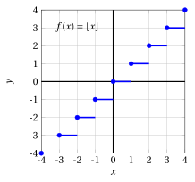
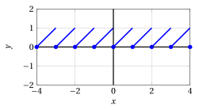
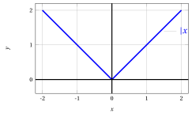

# Funzioni parte intera e mantissa

**Parte 2 · Funzioni · Capitolo 7** · dalle dispense di Fabio Furini · [:material-file-pdf-box: Dispensa del volume (PDF)](../pdf/dispensa-2-funzioni.pdf) · [:material-presentation: Slide (PDF)](../pdf/slide-funzioni-07-parte-intera.pdf)

## 1. Funzioni parte intera e mantissa

- Due funzioni che tipicamente si incontrano nella scrittura di <em>algoritmi</em> sono la funzione parte intera e la funzione mantissa (o parte decimale).

!!! definizione "Definizione 1: di funzione parte intera"

    La <strong>funzione parte intera</strong> è:

    \begin{equation}
    \label{parte_int}
    f: \mathbb{R} \rightarrow \mathbb{Z}, x \mapsto [x] \qquad ({\rm oppure~~ x \mapsto \lfloor x \rfloor})
    \end{equation}

!!! definizione "Definizione 2: di funzione parte intera superiore"

    La <strong>funzione parte intera superiore</strong> è:

    \begin{equation}
    \label{parte_ceil}
    f: \mathbb{R} \rightarrow \mathbb{Z}, x \mapsto \lceil x \rceil
    \end{equation}

!!! definizione "Definizione 3: di funzione mantissa"

    La <strong>funzione mantissa</strong> è:

    \begin{equation}
    \label{parte_int__2}
    f: \mathbb{R} \rightarrow [0, 1), x \mapsto (x)
    \end{equation}

- La funzione parte intera $f(x)= \lfloor x \rfloor$ e la funzione parte intera superiore $f(x)= \lceil x \rceil$ sono <strong>non decrescenti</strong> in $\mathbb{R}$, ma <strong>non</strong> sono crescenti.

    - Sono non decrescenti: siano $x_1 < x_2$. Allora $\lfloor x_1 \rfloor \le x_1 < x_2$ e, poiché $\lfloor x_1 \rfloor$ è un intero minore o uguale a $x_2$, mentre $\lfloor x_2 \rfloor$ è il <em>più grande</em> intero minore o uguale a $x_2$ (si veda il capitolo “Radicali, potenze, logaritmi e aritmetica modulare” della Parte 1), si ha $\lfloor x_1 \rfloor \le \lfloor x_2 \rfloor$. Analogamente $\lceil x_2 \rceil \ge x_2 > x_1$ e, poiché $\lceil x_1 \rceil$ è il <em>più piccolo</em> intero maggiore o uguale a $x_1$, si ha $\lceil x_1 \rceil \le \lceil x_2 \rceil$.

    - Non sono crescenti: entrambe sono <em>costanti</em> su ogni intervallo compreso fra due interi consecutivi, per esempio

        $$
        \left\lfloor \frac{1}{3} \right\rfloor = \left\lfloor \frac{2}{3} \right\rfloor = 0 \qquad {\rm ~~e~~} \qquad \left\lceil \frac{1}{3} \right\rceil = \left\lceil \frac{2}{3} \right\rceil = 1,
        $$

        quindi esistono $x_1 < x_2$ con $f(x_1) = f(x_2)$.

- Grafici delle funzioni $f(x)=\lceil x \rceil$ e  $f(x)= \lfloor x \rfloor$  nell'intervallo $[-4,4]$.

    { .fig .ovale loading=lazy style="width:61%" }

    { .fig .ovale loading=lazy style="width:61%" }

- Si noti che la mantissa è una funzione periodica di periodo 1:

    { .fig .ovale loading=lazy style="width:80%" }

## 2. Funzioni definite a tratti

- A partire dalle funzioni elementari se ne possono costruire di nuove usando <strong>definizioni analitiche diverse su intervalli diversi</strong>.

!!! definizione "Definizione 4: di funzione definita a tratti"

    Una funzione $f$ il cui valore $f (x)$ è calcolato mediante “istruzioni” diverse a seconda dell'intervallo in cui cade la $x$ si chiama <strong>funzione definita a tratti</strong>.

!!! esempio "Esempio 1: Funzioni definite a tratti"

    Consideriamo ad esempio

    $$
    f(x)=
    \begin{cases}
    \ln x & {\rm if~~} x > 1,\\
    x^2 & {\rm if~~} 0 < x \le 1,\\
    x & {\rm if~~} x \le 0
    \end{cases}
    $$

    il suo grafico è:

    { .fig .ovale loading=lazy style="width:80%" }

- Dal punto di vista <em>logico</em> / <em>algoritmico</em>, si può dire che una funzione di questo tipo ha la particolarità di essere costruita utilizzando non solo le funzioni matematiche  ma anche la <strong>funzione logica</strong> “se … allora”.

## 3. Funzione valore assoluto

- Nel capitolo “Fattoriali, coefficienti binomiali e disuguaglianza triangolare” della Parte 1 il <strong>valore assoluto</strong> di un numero reale $a$ è stato definito da

    $$
    |a|  =
    \begin{cases}
    a & {\rm se~~} a \ge 0\\
    -a & {\rm se~~} a < 0
    \end{cases}
    $$

    Associando a ogni $x \in \mathbb{R}$ il numero $|x|$ si ottiene una funzione reale di variabile reale, che è l'esempio più importante di <em>funzione definita a tratti</em>.

!!! definizione "Definizione 5: di funzione valore assoluto"

    La <strong>funzione valore assoluto</strong> è:

    \begin{equation}
    \label{val_ass_f}
    f: \mathbb{R} \rightarrow \mathbb{R}, x \mapsto |x|
    \end{equation}

- <strong>Segno.</strong> La funzione valore assoluto è <em>non negativa</em> in $\mathbb{R}$ ed è <em>positiva</em> in $\mathbb{R} \setminus \{0\}$:

    $$
    |x| \ge 0,~~ \forall x \in \mathbb{R} \qquad {\rm ~~e~~} \qquad |x| = 0 ~~\Longleftrightarrow~~ x=0.
    $$

    Infatti, se $x \ge 0$ allora $|x|=x \ge 0$, e se $x<0$ allora $|x|=-x>0$; in entrambi i casi $|x|=0$ obbliga $x=0$.

- <strong>Monotonia.</strong> La funzione valore assoluto è <em>decrescente</em> in $(-\infty,0]$ ed è <em>crescente</em> in $[0,+\infty)$, ma <strong>non</strong> è monotona in $\mathbb{R}$.

    - Se $x_1 < x_2 \le 0$, allora $|x_1| = -x_1 > -x_2 = |x_2|$.

    - Se $0 \le x_1 < x_2$, allora $|x_1| = x_1 < x_2 = |x_2|$.

    - Non è monotona in $\mathbb{R}$ perché $f(-1)=1 > f(0)=0$ (quindi non è non decrescente in $\mathbb{R}$) e $f(0)=0 < f(1)=1$ (quindi non è non crescente in $\mathbb{R}$).

- <strong>Limitatezza e immagine.</strong> La funzione è <em>limitata inferiormente</em> in $\mathbb{R}$ (il numero $0$ è un minorante dei suoi valori), ma <strong>non</strong> è limitata superiormente: per ogni $M \in \R$ con $M>0$ si ha $f(M+1)=M+1>M$. La sua immagine è

    $$
    f(\mathbb{R}) = [0,+\infty),
    $$

    perché $|x| \ge 0$ per ogni $x$ e, viceversa, ogni $y \ge 0$ è l'immagine di $y$ stesso: $|y|=y$.

- <strong>Simmetria.</strong> La funzione valore assoluto è <em>pari</em>, dato che $|-x|=|x|$ per ogni $x \in \mathbb{R}$: il suo grafico è simmetrico rispetto all'asse delle ordinate.

- Il grafico è formato dalle due semirette $y=-x$ per $x \le 0$ e $y=x$ per $x \ge 0$:

{ .fig .ovale loading=lazy style="width:48%" }
