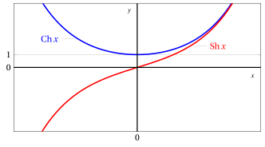

# Funzioni iperboliche

**Parte 2 · Funzioni · Capitolo 8** · dalle dispense di Fabio Furini e Valerio Dose · [:material-file-pdf-box: PDF del capitolo](../pdf/funzioni-08-iperboliche.pdf)

## 1. Funzioni iperboliche

!!! definizione "Definizione 1: funzione seno iperbolico e funzione coseno iperbolico"

    Le funzioni iperboliche:

    \begin{align}
    \label{seno_iper}  f: \mathbb{R} \rightarrow \mathbb{R},~~~ f: x \mapsto \sinH x =\frac{e^x-e^{-x}}{2}  \\[2ex] 
     \label{coseno_iper}
    f: \mathbb{R} \rightarrow \mathbb{R},~~~ f: x \mapsto \cosH x=\frac{e^x+e^{-x}}{2}
    \end{align}

    si chiamano <strong>seno iperbolico</strong> e <strong>coseno iperbolico</strong>.

- Il seno iperbolico è una funzione <strong>dispari</strong> mentre il coseno iperbolico è una funzione <strong>pari</strong>. Abbiamo quindi:

    $$
    \sinH(-x)=-\sinH x, ~~~\forall x \in \R {\rm ~~~~e~~~~} \cosH(-x)=\cosH x, ~~~\forall x \in \R
    $$

- Abbiamo le relazioni fondamentali:

    \begin{align}
    \cosH^2 x - \sinH^2 x = 1,~~~\forall x \in \mathbb{R}
    {\rm ~~~~~~~e~~~~~~~}
    \sinH x \le \frac{e^x}{2}   \le  \cosH x,~~~  \forall x \in \mathbb{R}
    \end{align}

    { .fig .ovale loading=lazy style="width:70%" }

- Per la positività e monotonicità della funzione seno iperbolico abbiamo:

    $$
    \sinH x = 0 \Longleftrightarrow x = 0 \qquad 
    \begin{cases}
    \sinH x > 0 & {\rm se~~~}  x >0 \\[3ex]
    \sinH x < 0 & {\rm se~~~}  x <0     
    \end{cases}
    $$

    $$
    f {\rm ~~è~crescente ~~~~} \forall x \in \R
    $$

- Per la positività e monotonicità della funzione coseno iperbolico abbiamo:

    $$
    \cosH x > 0,~~~~ \forall x \in \R
    $$

    $$
    \begin{cases}
    {\rm se~~~}  x < 0   & f {\rm ~~è~decrescente}  \\[3ex]
    {\rm se~~~}  x > 0   & f {\rm ~~è~crescente}    
    \end{cases}
    $$

!!! chiave ""

    La funzione  iperbolica:

    \begin{align}
    \label{tangente_iper} f: \mathbb{R}   \rightarrow \mathbb{R},~~~ f: x \mapsto \tanH x= \frac{e^x-e^{-x}}{e^x+e^{-x}}
    \end{align}

    si chiama <strong>tangente iperbolica</strong> ed è una funzione dispari.

{ .fig .ovale loading=lazy style="width:70%" }

## 2. Principali formule iperboliche

<strong>Addizione</strong>

!!! chiave ""

    \begin{align}
    \sinH ( x_1 + x_2)  &= \sinH x_1 \: \cosH x_2 + \sinH x_2 \: \cosH x_1\\[2ex]
    \cosH ( x_1 + x_2)  &= \cosH x_1 \: \cosH x_2 + \sinH x_1 \: \sinH x_2\\[2ex]
    \tanH ( x_1 + x_2)  &= \frac{\tanH x_1 + \tanH x_2}{1 + \tanH x_1 \: \tanH x_2}
    \end{align}

<strong>Duplicazione</strong>

!!! chiave ""

    \begin{align}
    \sinH ( 2 \: x)  &= 2 \: \sinH x \: \cosH x\\[2ex]
    \cosH ( 2 \: x)  &= \cosH^2 x + \sinH^2 x
    \end{align}
