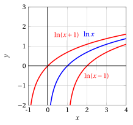
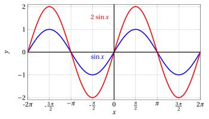
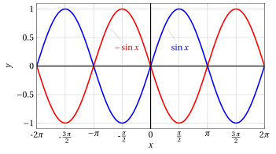
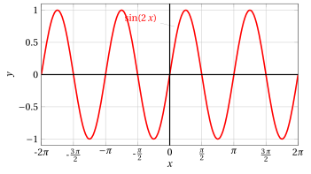
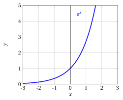

# Operazioni sui grafici

**Parte 2 · Funzioni · Capitolo 9** · dalle dispense di Fabio Furini · [:material-file-pdf-box: Dispensa del volume (PDF)](../pdf/dispensa-2-funzioni.pdf)

## 1. Operazioni sui grafici

- Conoscendo il grafico di una funzione $y = f (x)$ mediante semplici trasformazioni geometriche è possibile disegnare il grafico delle seguenti funzioni:

!!! chiave ""

    \begin{align}
    y_1 &= f(x) + a, \quad a \in \mathbb{R}\\[2ex]
    y_2 &= f(x + a), \quad a \in \mathbb{R}\\[2ex]
    y_3 &= k \: f(x), \quad k \in \mathbb{R}\\[2ex]
    y_4 &=  f(k \:x), \quad k \in \mathbb{R}\\[2ex]
    y_5 &=  |f(x)| \\[2ex]
    y_6 &=  f(|x|)
    \end{align}

- Pertanto, a partire dalle funzioni elementari, è possibile costruire, mediante queste operazioni, una grande varietà di nuove funzioni. Queste operazioni creano <strong>traslazioni</strong>, <strong>dilatazioni</strong> e <strong>riflessioni</strong> della funzione originale.

### 1.1 Operazioni relative a $y_1= f(x) +a$

!!! esempio "Esempio 1: Operazioni sui grafici relative a $y_1= f(x) +a$"

    Consideriamo  $y = \ln x$. Allora

    $$
    y_1  = \ln (x) +a ~~~~(x > 0).
    $$

    { .fig .ovale loading=lazy style="width:48%" }

- Il grafico di $y_1$ si ottiene da quello di $y$ con una <strong>traslazione</strong> di $a$ unità <strong>verso l'alto</strong> se $a> 0$, <strong>verso il basso</strong> se $a < 0$.

### 1.2 Operazioni relative a $y_2= f(x +a)$

!!! esempio "Esempio 2: Operazioni sui grafici relative a $y_2= f(x +a)$"

    Consideriamo ancora $y = \ln x$. Allora

    $$
    y_2  = \ln (x +a).
    $$

    Essendo $\ln x$ definito per $x > 0$, $\ln(x +a)$ sarà definito per $x +a > 0$ e cioè per $x > - a$. Poiché $\ln x =0$ se $x = 1$, si ha $\ln(x +a) =0$ per $x +a= 1$ e cioè $x = 1 - a$.

    { .fig .ovale loading=lazy style="width:42%" }

- Il grafico di $y_2$ si ottiene da quello di $y$ con una <strong>traslazione</strong> di $a$ unità a <strong>sinistra</strong> se $a > 0$, a <strong>destra</strong> se $a < 0$.

### 1.3 Operazioni relative a $y_3 = k\: f(x)$

- Il grafico di $y_3 = k \: f ( x)$ si ottiene da quello di $f$ moltiplicando per $k$ tutte le ordinate $f(x)$.

- In particolare se $k = -1$ le ordinate sono semplicemente cambiate di segno, cosicché il grafico di $y_3$ è simmetrico, rispetto $x$, a quello di $f$.

- Osserviamo che se $k > 1$, il grafico si “<strong>stira</strong>” nella <strong>direzione verticale</strong>, dilatando verso l'<strong>alto</strong> le ordinate <strong>positive</strong> e verso il <strong>basso</strong> quelle <strong>negative</strong>.

- Al contrario, se $0 < k < 1$ il grafico si “<strong>contrae</strong>”, sempre in direzione verticale.

- Perciò l'operazione di moltiplicazione di $f ( x)$ per $k$ ha il significato geometrico di <strong>dilatazione</strong> (se $|k| > 1$) o <strong>contrazione</strong> (se $|k| < 1$) sull'asse delle $y$, eventualmente accompagnata da una <strong>riflessione rispetto all'asse</strong> $x$, se $k < 0$.

!!! esempio "Esempio 3: Operazioni sui grafici relative a $y_3= k\: f( x)$"

    Consideriamo $y = \sin x$, allora $y_3  = k\: \sin(x).$

    { .fig .ovale loading=lazy style="width:70%" }

    { .fig .ovale loading=lazy style="width:70%" }

    { .fig .ovale loading=lazy style="width:70%" }

### 1.4 Operazioni relative a $y_4= f(k\:x)$

- Il grafico di $y_4 = f ( k\:x)$ si ottiene da quello di $f(x)$ con un <strong>cambiamento di scala</strong> sull'asse delle $x$.

- Se $k > 1$, $k \:x$ cresce più rapidamente di $x$ e perciò il grafico di $y_4$ sarà simile a quello di $f$ ma con oscillazioni più rapide, ovvero sarà “<strong>compresso</strong>” in <strong>direzione orizzontale</strong>, di un fattore $\frac{1}{k}$.

- Analogamente se $0 < k < 1$ il grafico apparirà “<strong>dilatato</strong>” in <strong>direzione orizzontale</strong>, con oscillazioni più dolci.

- Se $k < 0$, oltre ad una compressione (se $|k| > 1$) o dilatazione (se $|k|< 1$) sull'asse delle x ci sarà una <strong>riflessione rispetto all'asse delle $y$</strong>.

!!! esempio "Esempio 4: Operazioni sui grafici relative a $y_4 =  f(k\: x)$"

    Consideriamo $y = \sin x$, allora $y_4 =  \sin(k\: x).$ Con $k=\frac{1}{2}$ e $k=2$ abbiamo:

    { .fig .ovale loading=lazy style="width:75%" }

    { .fig .ovale loading=lazy style="width:75%" }

!!! esempio "Esempio 5: Operazioni sui grafici relative a $y_4=  f(k\: x)$"

    Consideriamo $y = \ln x$, allora $y_4 =  \ln(k\: x).$ Con $k=-1$ abbiamo:

    { .fig .ovale loading=lazy style="width:80%" }

### 1.5 Operazioni relative a $y_5=|f(x)|$

<strong>Valore assoluto di $f(x)$:</strong>

!!! chiave ""

    $$
    |f(x)|=
    \begin{cases}
    f(x) & {\rm if~~} f(x)\ge0,\\
    -f(x) \:  & {\rm if~~} f(x)<0
    \end{cases}
    $$

- Nel passare dal grafico $y=f(x)$ a $y_5=|f(x)|$ i punti a <strong>ordinata non negativa rimangono inalterati</strong> mentre quelli a <strong>ordinata negativa vengono trasformati nei loro simmetrici rispetto all'asse</strong> $x$.

- Il grafico  $y_5=|f(x)|$ si ottiene da quello di $f$  “ribaltando”  simmetricamente rispetto all'asse delle ascisse la parte del grafico di $f$ che si trova nel semipiano inferiore e lasciando inalterato il resto.

!!! esempio "Esempio 6: Operazioni sui grafici relative a $y_5=  |f(x)|$"

    Consideriamo $y = x$ allora $y_5 = |x|$

    { .fig .ovale loading=lazy style="width:61%" }

    { .fig .ovale loading=lazy style="width:61%" }

!!! esempio "Esempio 7: Operazioni sui grafici relative a $y_5=  |f( x)|$"

    Consideriamo $y = \sin x$ allora $y_5  = |\sin x|$

    { .fig .ovale loading=lazy style="width:80%" }

    { .fig .ovale loading=lazy style="width:80%" }

### 1.6 Operazioni relative a $y_6=f(|x|)$

- Infine, per tracciare il grafico  $y_6 =f(|x|)$, osserviamo che: $|x|  = x$ per $x \ge 0$, e quindi nel semipiano destro i due grafici coincidono

- Abbiamo $|-x|=|x|$, e quindi $y_6$ è una funzione pari, perciò simmetrica rispetto all'asse delle ordinate.

- Di conseguenza il grafico  $y_6 = f(|x|)$ verrà tracciato <strong>lasciando inalterato il grafico di $f$ nel semipiano destro e ribaltandolo simmetricamente rispetto all'asse delle ordinate</strong>.

!!! esempio "Esempio 8: Operazioni sui grafici relative a $y_6=f(|x|)$"

    Consideriamo $y = e^x$ allora $y_6  = e^{|x|}$

    { .fig .ovale loading=lazy style="width:61%" }

    { .fig .ovale loading=lazy style="width:61%" }

<strong>Prova tu</strong> — il grafico interattivo qui sotto ti fa vedere quello che hai appena letto: muovi i cursori.

