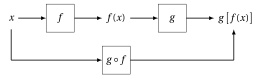
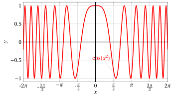

# Funzioni composte

**Parte 2 · Funzioni · Capitolo 10** · dalle dispense di Fabio Furini · [:material-file-pdf-box: PDF del capitolo](../pdf/funzioni-10-composte.pdf)

## 1. Funzioni composte

!!! definizione "Definizione 1: di funzione composta"

    Date due funzioni:

    $$
    f: E \rightarrow \mathbb{R} {\rm~~~~e~~~~} g: F \rightarrow \mathbb{R},
    $$

    se $f (E) \subseteq F$ (cioè se per ogni $x \in E$ si ha che $f ( x) \in F)$ si può definire la funzione $h : E \rightarrow \mathbb{R}$ <strong>composta</strong> di $f$ e $g$ (nell'ordine), denotata col simbolo $g \circ f$, mediante la formula

    $$
    h(x) = (g \circ f) (x) = g[f(x)]
    $$

- Lo schema di composizione è il seguente:

    { .fig .ovale loading=lazy style="width:75%" }

!!! esempio "Esempio 1: di funzione composta"

    La funzione $x \mapsto |f(x)|$  è in realtà “composta” di due funzioni:

    1. dato $x$, si calcola $f(x)$

    2. calcolato $f(x)$, si calcola $|f(x)|$

    Si tratta di operare in serie con due scatole nere, la prima corrispondente a $f$, la seconda al suo valore assoluto, secondo lo schema seguente:

    { .fig .ovale loading=lazy style="width:75%" }

- Può accadere che risultino ben definite sia la composizione $(g \circ f)$ che $(f \circ g)$ ma in generale

    $$
    (f \circ g) \neq (g \circ f)
    $$

    In altre parole <strong>non vale la proprietà commutativa</strong>.

!!! esempio "Esempio 2: di composizione di funzioni"

    Consideriamo le funzioni:

    $$
    f: \mathbb{R} \rightarrow \mathbb{R}, \quad f: x \mapsto x^2 {\rm ~~~~~e~~~~~} g: \mathbb{R} \rightarrow \mathbb{R}, \quad g: x \mapsto \cos x
    $$

    ovvero  $f(x)= x^2$ e $g(x)= \cos x$.

    1. Poiché $g$ è definita su tutto $\mathbb{R}$, $h = g \circ f$ è ben definita su $\mathbb{R}$ e vale la formula

        $$
        h(x) = (g \circ f) (x) = g[f(x)] = \cos x^2
        $$

        { .fig .ovale loading=lazy style="width:73%" }

    2. Poiché $f$ è definita su tutto $\mathbb{R}$, $k = f \circ g$ è ben definita su $\mathbb{R}$ e vale la formula

        $$
        k(x) = (f \circ g) (x) = f[g(x)] = \cos^2 x
        $$

        { .fig .ovale loading=lazy style="width:73%" }

!!! esempio "Esempio 3: di composizione di funzioni"

    Consideriamo le funzioni:

    $$
    f: \mathbb{R} \rightarrow \mathbb{R}, \quad f: x \mapsto e^x \qquad g: [0,+\infty) \rightarrow \mathbb{R}, \quad g: x \mapsto \sqrt{x}
    $$

    ovvero  $f(x)= e^x$ e $g(x)= \sqrt{x}$.

    1. Poiché $g$ è definita su $[0,+\infty)$ e $f(x) > 0$ per ogni $x \in \mathbb{R}$, $h = g \circ f$ è ben definita su $\mathbb{R}$ e vale la formula

        $$
        h(x) = (g \circ f) (x) = g[f(x)] = \sqrt{e^x}
        $$

        { .fig .ovale loading=lazy style="width:73%" }

    2. Poiché $g$ è definita solo su  $[0,+\infty)$, $k = f \circ g$ è ben definita solo su $\mathbb{R}_+$ e vale la formula

        $$
        k(x) = (f \circ g) (x) = f[g(x)] = e^{\sqrt{x}}
        $$

        { .fig .ovale loading=lazy style="width:73%" }

- L'operazione di composizione si può estendere a tre o più fattori. Si verifica che se la composizione $(f \circ g) \circ r$ esiste, allora esiste anche $f \circ (g \circ r)$ e sono uguali

    $$
    (f \circ g) \circ r = f \circ (g \circ r)
    $$

    In altre parole <strong> vale la proprietà associativa</strong>.

- Se una funzione $f : D \rightarrow \mathbb{R}$ è tale che $f ( D) \subseteq D$, allora si può comporre con sé stessa

    $$
    f^2 = f \circ f {\rm~~ossia~~} f^2(x) = f[f(x)]
    $$

    $f^2$ viene detta <strong>iterata seconda</strong> di $f$. Analogamente, $f^n$ si dice <strong>funzione iterata $n$-esima</strong> di $f$.
