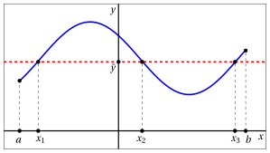
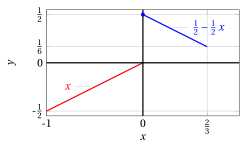
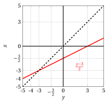
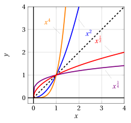
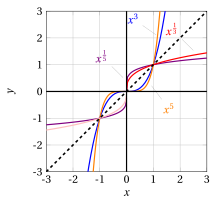
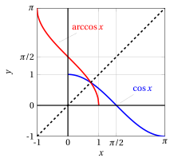
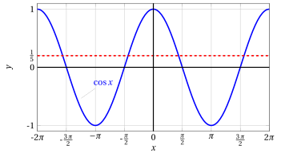
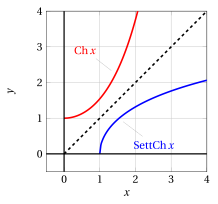

# Funzioni inverse

**Parte 2 · Funzioni · Capitolo 11** · dalle dispense di Fabio Furini e Valerio Dose · [:material-file-pdf-box: PDF del capitolo](../pdf/funzioni-11-inverse.pdf)

## 1. Funzioni invertibili e funzioni inverse

- Data una funzione reale di variabile reale $f : D \rightarrow \mathbb{R}$,  per ogni ingresso $x$ nel dominio $D$ esiste un'unica uscita $y=f(x)$ nell'immagine del dominio $f(D)$.

- Se anche per ogni uscita $y = f(x) \in f(D)$ esiste un unico ingresso $x \in D$, allora $f$ si dice <strong>invertibile</strong>, e realizza una <strong>corrispondenza biunivoca</strong> tra il dominio $D$ di $f$ e l'immagine   del dominio  $f(D)$.

!!! definizione "Definizione 1: di funzione invertibile"

    Un funzione $f : D \rightarrow \mathbb{R}$ è <strong>invertibile</strong> nel dominio $D$ se vale una delle seguenti condizioni equivalenti:

    \begin{align*}
    \forall x_1,x_2 \in D,&\qquad x_1 \neq x_2 \Longrightarrow f(x_1)\neq f(x_2)\\[2ex]
    \forall x_1,x_2 \in D,&\qquad f(x_1) = f(x_2) \Longrightarrow x_1 = x_2\\[2ex]
    \forall y \in f(D),&\qquad \exists! x \in D:  y=f(x)
    \end{align*}

    ovvero se $f$ è <strong>iniettiva</strong>.

!!! chiave ""

    <strong>ATENZIONE:</strong> la definizione di funzione invertibile data qui per funzioni reali di variabile reale è diversa dalla solita data per funzioni tra insiemi qualsiasi, che richiede anche la suriettività. In questo caso <em>basta l'iniettività</em> perché definiamo l'inversa sull'immagine di $f$ e non su tutto il suo codominio.

!!! definizione "Definizione 2: di funzione inversa"

    Data una funzione invertibile $f : D \rightarrow \mathbb{R}$,  la funzione che associa a ogni uscita $y \in f(D)$ l'unico ingresso $x \in D$  tale che $f(x) = y$ si chiama <strong>funzione inversa</strong> di $f$ e si indica con il simbolo $f^{-1}$.

!!! chiave ""

    La coppia $f$ e $f^{-1}$ si indica:

    \begin{equation}
    \label{inversa}
    f:
    \begin{cases}
    y = f(x)\\
    x \in D
    \end{cases}
    ~~~~~~~~
    f^{-1}:
    \begin{cases}
    x = f^{-1}(y)\\
    y \in f(D)
    \end{cases}
    \end{equation}

    La scatola nera di $f^{-1}$ lavora a ritroso rispetto a quella di $f$, secondo il seguente schema:

    { .fig .ovale loading=lazy style="width:65%" }

!!! chiave ""

    La condizione di invertibilità equivale a richiedere che il grafico di $f$ sia intersecato al massimo in un punto da ogni retta parallela all'asse delle ascisse.

!!! esempio "Esempio 1:  grafico di funzione  invertibile "

    { .fig .ovale loading=lazy style="width:80%" }

    Grafico di funzione  <strong>invertibile</strong> in $[a,b]$ in quanto ogni retta parallela all'asse delle ascisse o non interseca il grafico di $f$ o lo interseca esattamente in un punto.

!!! esempio "Esempio 2: grafico di funzione non invertibile "

    { .fig .ovale loading=lazy style="width:80%" }

    Grafico di funzione <strong>non invertibile</strong> in $[a,b]$ in quanto per il valore di $\tilde{y}$ indicato esistono più valori $x$ (precisamente $x_1$ , $x_2$ e $x_3$) che hanno immagine $\tilde{y}$.

!!! teorema "Teorema 1"

    Se una funzione $f : D \rightarrow \mathbb{R}$ è strettamente  crescente (decrescente) in $D$ allora è invertibile in $D$. Inoltre, la sua funzione inversa è  strettamente  crescente (decrescente).

Per il caso strettamente crescente, graficamente abbiamo:

{ .fig .ovale loading=lazy style="width:61%" }

{ .fig .ovale loading=lazy style="width:61%" }

??? dimostrazione "Dimostrazione"

    Consideriamo il caso di una funzione strettamente crescente in $D$ e due generici valori $x_1,  x_2 \in D$ (il caso strettamente decrescente è analogo).

    Se $x_1  \neq x_2$, allora o $x_1 < x_2$, oppure $x_1 > x_2$. Dato che  $f$ è strettamente  crescente abbiamo:

    $$
    {\rm se~~} x_1 < x_2,  {\rm ~~allora~~} f(x_1) < f (x_2)
    $$

    $$
    {\rm se~~} x_1 > x_2,  {\rm ~~allora~~} f(x_1) > f (x_2)
    $$

    In entrambi i casi $f(x_1) \neq f(x_2)$, perciò $f$ è invertibile.

    Consideriamo la funzione inversa $f^{-1}$, ovvero $x = f^{-1} (y)$, e proviamo che  sia strettamente crescente. Consideriamo due generici valori $y_1,  y_2 \in f(D)$, con  $y_1 < y_2$. 

    Se fosse $f^{-1}(y_1) =x_1  \ge x_2= f^{-1}(y_2)$, poiché $f$ è strettamente  crescente avremmo $y_1 = f(x_1) \ge f(x_2) =y_2$, ovvero $y_1 \ge y_2$. Questo caso non può accadere visto che contraddice $y_1 < y_2$ (<strong>assurdo</strong>).

    Di conseguenza abbiamo $f^{-1}(y_1) =x_1  < x_2= f^{-1}(y_2)$, ovvero $f^{-1} (y_1) < f^{-1}(y_2)$, e quindi $f^{-1}$ è strettamente  crescente. □

!!! chiave ""

    Una funzione può però essere invertibile anche senza essere strettamente crescente o decrescente.

!!! esempio "Esempio 3: funzione invertibile ma non strettamente crescente né decrescente"

    Ad esempio la seguente funzione definita a tratti è invertibile:

    $$
    f(x)=
    \begin{cases}
    \frac{1}{2}\; x & {\rm se~~} -1 \le x < 0,\\[2ex]
    \frac{1}{2}-\frac{1}{2} \: x & {\rm se~~} 0 \le x \le 2/3\\
    \end{cases}
    $$

    { .fig .ovale loading=lazy style="width:61%" }

- Due classi di funzioni che sicuramente non risultano invertibili sono:

    1. le funzioni simmetriche pari, dato che:

        $$
        f(-x) = f (x)
        $$

    2. le funzioni periodiche, dato che:

        $$
        f(x + T) =f(x)
        $$

### 1.1 Grafico della funzione inversa

- Le relazioni tra una funzione invertibile $f$ e la sua funzione inversa $f^{-1}$:

    \begin{equation*}
    f:
    \begin{cases}
    y = f(x)\\
    x \in D
    \end{cases}
    ~~~~~~~~
    f^{-1}:
    \begin{cases}
    x = f^{-1}(y)\\
    y \in f(D)
    \end{cases}
    \end{equation*}

    indicano che se il punto $(x_0, y_0)$ è sul grafico di $f$ allora il punto $(y_0, x_0)$ è sul grafico di $f^{-1}$.

- Essendo i punti $(x_0, y_0)$ e $(y_0, x_0)$ <strong>simmetrici rispetto alla bisettrice</strong> di equazione $y = x$, il grafico di $f^{-1}$ ricava da quello di $f$ per simmetria rispetto alla bisettrice.

    { .fig .ovale loading=lazy style="width:58%" }

!!! chiave ""

    Se è nota l'espressione analitica di $f$, ed è invertibile, l'<strong>espressione analitica</strong> di $f^{-1}$ si trova cercando di risolvere  rispetto a $x$ l'equazione:

    $$
    f(x) = y {\rm ~~~~ovvero~trovare~l'ingresso~~} x {\rm~~che~produce~l'uscita~} y
    $$

    <strong>Attenzione che non è sempre possibile trovarla anche nei casi in cui la funzione inversa esiste!</strong>

!!! chiave ""

    Dati $a,b \in \R, a \neq 0$, abbiamo :

    $$
    f:\begin{cases}
    y = a\:x + b\\
    x \in \R
    \end{cases}
    \qquad
    \qquad
    f^{-1}:\begin{cases}
    x = \frac{y-b}{a}\\
    y \in \R
    \end{cases}
    $$

!!! esempio "Esempio 4: funzione inversa di una funzione affine"

    La funzione  $f: \mathbb{R} \rightarrow \mathbb{R}, x \mapsto 2 \: x +3$ è strettamente crescente quindi invertibile su $\mathbb{R}$ e l'equazione

    $$
    2\: x + 3 = y {\rm ~~risolta~rispetto~a~~} x,~~{\rm ~ovvero~~} x=\frac{y-3}{2}
    $$

    dà per $f^{-1}$ l'espressione analitica:

    $$
    f^{-1}(y) = \frac{y-3}{2}
    $$

    ovvero la funzione: $f^{-1}: \mathbb{R} \rightarrow \mathbb{R}, y \mapsto \frac{y-3}{2}$.

    { .fig .ovale loading=lazy style="width:52%" }

    Il grafici $y=2 \: x +3$ e  $y=\frac{x-3}{2}$ sono simmetrici rispetto alla bisettrice $y = x$

    { .fig .ovale loading=lazy style="width:52%" }

!!! chiave ""

    Abbiamo:

    $$
    f:\begin{cases}
    y = x^2\\
    x \ge 0
    \end{cases}
    \qquad
    \qquad
    f^{-1}:\begin{cases}
    x = \sqrt{y}\\
    y \ge 0
    \end{cases}
    $$

!!! esempio "Esempio 5: funzioni inversa di $f(x)=x^2$"

    La funzione  $f: \mathbb{R} \rightarrow \mathbb{R}, x \mapsto x^2 \: x +3$ è strettamente crescente nell'intervallo $[0,+\infty]$ quindi invertibile, l'equazione

    $$
    x^2 = y {\rm ~~risolta~rispetto~a~~} x,~~{\rm ~ovvero~~} x=\sqrt{y}
    $$

    dà per $f^{-1}$ l'espressione analitica

    $$
    f^{-1}(y) = \sqrt{y}
    $$

    ovvero la funzione: $f^{-1}: [0,+\infty] \rightarrow \mathbb{R}, y \mapsto \sqrt{y}$.

    Il grafici $y=x^2$ e  $y=\sqrt{x}$ sono simmetrici rispetto alla bisettrice $y = x$

    { .fig .ovale loading=lazy style="width:58%" }

!!! chiave ""

    Dato $a \in \R_+, a \neq 1$, abbiamo :

    $$
    f:\begin{cases}
    y = a^x\\
    x \in \mathbb{R}
    \end{cases}
    \qquad
    \qquad
    f^{-1}:\begin{cases}
    x = \log_a y\\
    y > 0
    \end{cases}
    $$

!!! esempio "Esempio 6: funzione inversa di $f(x)=e^x$"

    La funzione  $f: \mathbb{R} \rightarrow \mathbb{R}, x \mapsto e^x \: x$ è strettamente crescente su tutto $\mathbb{R}$ e quindi invertibile, l'equazione

    $$
    e^x = y {\rm ~~risolta~rispetto~a~~} x,~~{\rm ~ovvero~~} x=\log{y}
    $$

    dà per $f^{-1}$ l'espressione analitica

    $$
    f^{-1}(y) = \log{y}
    $$

    ovvero la funzione: $f^{-1}: (0,+\infty) \rightarrow \mathbb{R}, y \mapsto \log{y}$.

    Il grafici $y=e^x$ e  $y=\log {x}$ sono simmetrici rispetto alla bisettrice $y = x$

    { .fig .ovale loading=lazy style="width:58%" }

- Consideriamo ora la funzione:

    $$
    f(x)= x + e^x
    $$

    Essendo somma di due funzioni strettamente crescenti in tutto $\mathbb{R}$, $f(x)$ è strettamente crescente e quindi invertibile su tutto $\mathbb{R}$ (vedere Teorema \(\eqref{theo_ita:theoINV}\)). Tuttavia, cercheremmo inutilmente di risolvere rispetto a $x$ l'equazione $x + e^x = y$.  In altre parole, $f^{-1}$ esiste, ma non si sa scrivere esplicitamente.

### 1.2 Le funzioni potenze inverse

!!! chiave ""

    Dato $\alpha \in \mathbb{R},\alpha \neq 0$, abbiamo :

    $$
    f:\begin{cases}
    y = x^{\alpha}\\
    x > 0
    \end{cases}
    \qquad
    \qquad
    f^{-1}:\begin{cases}
    x = y^{\frac{1}{\alpha}}\\
    y > 0
    \end{cases}
    $$

    Se $\alpha > 0$ abbiamo:

    $$
    f:\begin{cases}
    y = x^{\alpha}\\
    x \ge 0
    \end{cases}
    \qquad
    \qquad
    f^{-1}:\begin{cases}
    x = y^{\frac{1}{\alpha}}\\
    y \ge 0
    \end{cases}
    $$

    Se $\alpha=\frac{m}{n} \in \Q$, $m \in \Z, n \in \N_+$  dispari e coprimi, abbiamo:

    $$
    f:\begin{cases}
    y = x^{\frac{m}{n}}\\
    x \in \R
    \end{cases}
    \qquad
    \qquad
    f^{-1}:\begin{cases}
    x = y^{\frac{n}{m}}\\
    y \in \R
    \end{cases}
    $$

- Le <strong>potenze pari</strong>:

    $$
    x^{2\:n} {\rm~~~~con~} n = 1, 2, \dots
    $$

    non sono invertibili su tutta la retta, ma solo sulla semiretta $x \ge 0$.

    { .fig .ovale loading=lazy style="width:58%" }

- Le <strong>potenze dispari</strong>:

    $$
    x^{2\:n+1} {\rm~~~~con~} n = 1, 2, \dots
    $$

    e le <strong>potenze a esponente razionale</strong>

    $$
    x^{\frac{m}{n}} {\rm~~con~~} n,m {\rm~~interi ~e~}n {\rm~~dispari}
    $$

    essendo monotone strettamente  crescenti sono invertibili da $-\infty$ a $+\infty$.

    { .fig .ovale loading=lazy style="width:58%" }

### 1.3 Le funzioni trigonometriche inverse

- Essendo periodiche, le funzioni trigonometriche non possono essere invertibili. Infatti, per esempio, l'equazione

    $$
    y = \sin x
    $$

    ha infinite soluzioni se $- 1 \le y \le 1$ (l'uscita $y$ corrisponde a infiniti ingressi) oppure non ha soluzioni reali se $|y| > 1$.

- Per parlare di funzioni inverse di seno, coseno e tangente occorrerà restringersi a intervalli nei quali queste funzioni siano strettamente monotone e perciò invertibili.

- Un intervallo nel quale la funzione seno è invertibile è $[-\frac{\pi}{2},\frac{\pi}{2}]$.

!!! definizione "Definizione 3: di arcoseno"

    La funzione inversa del seno nell'intervallo $\left[-\frac{\pi}{2},\frac{\pi}{2}\right]$ è l'<strong>arcoseno</strong>:

    $$
    f: [-1,1] \rightarrow \left[-\frac{\pi}{2},\frac{\pi}{2}\right],~~ f: y \mapsto \arcsin y
    $$

!!! chiave ""

    Abbiamo:

    \begin{equation}
    \label{arcoseno}
    f:
    \begin{cases}
    y = \sin x\\
    x \in \left[-\frac{\pi}{2},\frac{\pi}{2}\right]
    \end{cases}
    \qquad
    \qquad
    f^{-1}:
    \begin{cases}
    x = \arcsin y\\
    y \in [-1,1]
    \end{cases}
    \end{equation}

- Il grafico dell'arcoseno si ottiene dall'arco di sinusoide del seno ristretto all'intervallo $\left[-\frac{\pi}{2},\frac{\pi}{2}\right]$ (strettamente monotono), per simmetria rispetto alla bisettrice $y = x$,

{ .fig .ovale loading=lazy style="width:58%" }

- Un intervallo nel quale la funzione coseno è invertibile è $[0,\pi]$.

!!! definizione "Definizione 4: di arcocoseno"

    La funzione inversa del coseno nell'intervallo $[0,\pi]$ è l'<strong>arcocoseno</strong>:

    $$
    f: [-1,1] \rightarrow \left[0,\pi\right],~~ f: y \mapsto \arccos y
    $$

!!! chiave ""

    Abbiamo:

    \begin{equation}
    \label{arcoseno__2}
    f:
    \begin{cases}
    y = \cos x\\
    x \in [0,\pi]
    \end{cases}
    \qquad
    \qquad
    f^{-1}:
    \begin{cases}
    x = \arccos y\\
    y \in [-1,1]
    \end{cases}
    \end{equation}

- Il grafico dell'arcocoseno si ottiene dall'arco di sinusoide del coseno ristretto all'intervallo $[0,\pi]$ (strettamente monotono), per simmetria rispetto alla bisettrice $y = x$,

{ .fig .ovale loading=lazy style="width:58%" }

- Osserviamo che nell'intervallo $( -\frac{\pi}{2}, \frac{\pi}{2})$ la tangente è strettamente monotona e quindi invertibile. La funzione inversa si chiama arcotangente ($\arctan$), ed è definita in $\mathbb{R}$.

!!! definizione "Definizione 5: di arcotangente"

    La funzione inversa della tangente nell'intervallo $\left(-\frac{\pi}{2},\frac{\pi}{2}\right)$ è l'<strong>arcotangente</strong>:

    $$
    f: \mathbb{R} \rightarrow \left(-\frac{\pi}{2},\frac{\pi}{2} \right),~~ f: y \mapsto \arctan y
    $$

!!! chiave ""

    Abbiamo:

    \begin{equation}
    \label{arcoseno__3}
    f:
    \begin{cases}
    y = \tan x\\
    x \in \left(-\frac{\pi}{2},\frac{\pi}{2}\right)
    \end{cases}
    \qquad
    \qquad
    f^{-1}:
    \begin{cases}
    x = \arctan y\\
    y \in \mathbb{R}
    \end{cases}
    \end{equation}

- Il grafico dell'arcotangente si ottiene da quello della tangente ristretto all'intervallo $\left(-\frac{\pi}{2},\frac{\pi}{2}\right)$ (strettamente monotono), per simmetria rispetto alla bisettrice $y = x$,

{ .fig .ovale loading=lazy style="width:58%" }

- Per mezzo delle funzioni trigonometriche inverse, possiamo esprimere le soluzioni di un'<strong>equazione o disequazione trigonometrica</strong>, quando questa coinvolge angoli non notevoli.

!!! esempio "Esempio 7: Equazioni/disequazioni trigonometriche"

    - Le soluzioni di:

        $$
        \sin x = \frac{1}{4}
        $$

        sono:

        $$
        (i) ~~~~~~ x = \arcsin \frac{1}{4} + 2\: k \: \pi; ~~~~~~(ii) ~~~~~~ x = \pi - \arcsin \frac{1}{4} + 2\: k \: \pi \qquad (k \in \mathbb{Z})
        $$

        { .fig .ovale loading=lazy style="width:70%" }

    - Le soluzioni di:

        $$
        \cos x < \frac{1}{5}
        $$

        sono:

        $$
        \arccos \frac{1}{5} + 2\: k \: \pi ~~<~~ x ~~<~~ 2 \: \pi - \arccos \frac{1}{5} + 2\: k \: \pi \qquad (k \in \mathbb{Z})
        $$

        { .fig .ovale loading=lazy style="width:70%" }

    - Le soluzioni di:

        $$
        \tan x \ge 3
        $$

        sono:

        $$
        \arctan \:3 +  k \: \pi ~~\le~~ x ~~<~~ \frac{\pi}{2} +  k \: \pi \qquad (k \in \mathbb{Z})
        $$

### 1.4 Le funzioni iperboliche inverse

- Consideriamo la funzione <strong>seno iperbolico</strong>:

    $$
    y =\sinH x = \frac{e^x - e^{-x}}{2}
    $$

    È definita e strettamente crescente in tutto $\mathbb{R}$, perciò è invertibile.

- Per risolvere l'equazione rispetto alla $x$, moltiplicando ambo i membri per $e^x$ e otteniamo:

    \begin{align*}
    0 & = e^x \: y - e^x \: \frac{e^x - e^{-x}}{2}\\[2ex]
       & = 2\: e^x \: y - (e^x \: e^x - \underbrace{e^x \: e^{-x}}_{=e^{x-x}=e^0})\\[2ex]
     & = 2\:y\: e^x   - e^{2\:x}  + 1 \\[2ex]
     & = e^{2\:x} - 2\: y \:e^x  -1
    \end{align*}

    che è un'equazione di secondo grado nell'incognita $e^x$. Ponendo $t=e^x$ otteniamo

    $$
    0 = t^{2} - 2\: y \: t  -1
    $$

    Ricaviamo:

    $$
    t = y \pm \sqrt{y^2+1} {\rm~~~~~e~risostituendo~~~~~} e^x = y \pm \sqrt{y^2+1}
    $$

    poiché $e^x  > 0$, la soluzione col segno meno va scartata. Rimane dunque:

    $$
    e^x = \underbrace{y + \sqrt{y^2+1}}_{>0, \forall y \in \R} {\rm~~~~e~quindi~~~~} x = \log \left(y + \sqrt{y^2+1}\right)
    $$

- Questa è l'espressione analitica della funzione inversa di $\sinH x$, che prende il nome di <strong>settore seno iperbolico</strong>, e si indica anche con $\setsinH$. È definita per ogni $y$ reale.

!!! definizione "Definizione 6: di settore seno iperbolico"

    La funzione inversa del seno iperbolico è il <strong>settore seno iperbolico</strong>:

    $$
    f: \mathbb{R} \rightarrow \mathbb{R},~~ f: y \mapsto \setsinH y
    $$

!!! chiave ""

    Abbiamo:

    \begin{equation}
    \label{arcoseno__4}
    f:
    \begin{cases}
    y = \sinH x\\
    x \in \mathbb{R}
    \end{cases}
    \qquad
    \qquad
    f^{-1}:
    \begin{cases}
    x = \setsinH y\\
    y \in \mathbb{R}
    \end{cases}
    \end{equation}

- Il grafico del settore seno iperbolico si ottiene da quello del seno iperbolico su $\mathbb{R}$ (strettamente monotono), per simmetria rispetto alla bisettrice $y = x$

{ .fig .ovale loading=lazy style="width:58%" }

- Consideriamo la funzione <strong>coseno iperbolico</strong>:

    $$
    y =\cosH x = \frac{e^x + e^{-x}}{2}
    $$

    È definita in tutto $\mathbb{R}$, strettamente crescente per $x \ge 0$, decrescente per $x \le 0$. Perciò non è invertibile su tutto $\mathbb{R}$.

- La sua restrizione a $x \ge 0$ però lo è. Vogliamo determinare l'espressione analitica della funzione inversa di questa restrizione.

- Procedendo come prima,  otteniamo:

    $$
    e^x = y \pm \sqrt{y^2-1}
    $$

- Questa volta entrambi i numeri $y \pm \sqrt{y^2-1}$ sono positivi; ricordiamo però che stiamo ragionando solo per $x \ge 0$, che equivale a scegliere il segno più. Pertanto:

    $$
    x = \log \left(y + \sqrt{y^2-1}\right)
    $$

    Questa è l'espressione analitica della funzione inversa di $\cosH x$, che prende il nome di settore coseno iperbolico, e si indica anche con $\setcosH$.  Si noti che è definita per $y \ge 1$.

!!! definizione "Definizione 7: di settore coseno iperbolico"

    La funzione inversa del coseno iperbolico nell'intervallo $[0,+\infty)$ è il <strong>settore coseno iperbolico</strong>:

    $$
    f: [1,+\infty) \rightarrow [0,+\infty),~~ f: y \mapsto \setsinH x
    $$

!!! chiave ""

    Abbiamo:

    \begin{equation*}
    f:
    \begin{cases}
    y = \cosH x\\
    x \in [0,+\infty)
    \end{cases}
    \qquad
    \qquad
    f^{-1}:
    \begin{cases}
    x = \setcosH y\\
    y \in [1,+\infty)
    \end{cases}
    \end{equation*}

- Il grafico del settore coseno iperbolico si ottiene da quello del coseno iperbolico su $[1,+\infty)$ (strettamente monotono), per simmetria rispetto alla bisettrice $y = x$.

{ .fig .ovale loading=lazy style="width:58%" }

!!! esempio "Esempio 8: Equazioni iperboliche"

    - L'equazione:

        $$
        \sinH x = 2
        $$

        ha l'unica soluzione:

        $$
        x = \setsinH 2 = \log (2 + \sqrt{5})
        $$

    - L'equazione:

        $$
        \cosH x = 3
        $$

        ha due soluzioni:

        $$
        x = \pm \setcosH 3 = \pm \log(3 + 2\:\sqrt{2})
        $$

    { .fig .ovale loading=lazy style="width:61%" }
