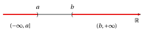
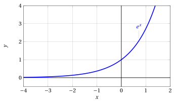
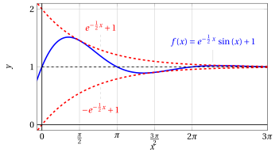
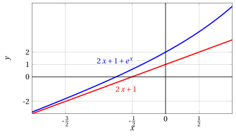
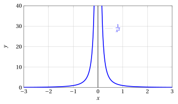

# Limiti di funzioni, asintoti e continuità

**Parte 3 · Limiti di funzioni e continuità · Capitolo 1** · dalle dispense di Fabio Furini · [:material-file-pdf-box: Dispensa del volume (PDF)](../pdf/dispensa-3-limiti.pdf) · [:material-presentation: Slide (PDF)](../pdf/slide-limiti-01-limiti-asintoti.pdf)

## 1. Definizione successionale di limite

L'operazione di limite si può estendere dalle successioni alle funzioni reali di variabile reale.  

Potremo così precisare il comportamento della funzione quando la variabile indipendente <strong>si muove vicino a un determinato punto</strong> oppure <strong>diventa molto grande </strong>(in valore assoluto).

!!! chiave ""

    - Consideriamo  un <strong>intervallo</strong> $I$, un <strong>punto</strong> $c \in I$ e una <strong>funzione</strong> $f$  definita in $I$, salvo al più nel punto $c$.

    - L'<strong>intervallo</strong> $I$ può essere <strong>limitato</strong> o <strong>illimitato</strong>, <strong>chiuso</strong> o <strong>aperto</strong>.

    - Il <strong>punto</strong> $c$ può essere <strong>interno</strong> all'intervallo oppure <strong>uno dei suoi estremi</strong> (eventualmente $\ip$ o $\im$).

!!! definizione "Definizione 1: successionale di limite"

    Con $\ell,c\in \R^*$,  scriviamo

    $$
    f(x) \rr \ell {\rm ~~per~~} x \rr c
    $$

    se per ogni successione  $\{x_n\}$ di punti di $I$, tale che $x_n \rr c$ per $n \rr \ip$ e $x_n \neq c, \forall n$, si ha

    $$
    f(x_n) \rr \ell {\rm~~per~~} n \rr +\infty
    $$

In questi casi possiamo anche scrivere:

$$
\lim_{x \rr c} f(x) = \ell
$$

che si legge: il limite di $f(x)$, per $x$ che tende a $c$, è  $\ell$.

!!! chiave ""

    In altre parole,  se <strong>per qualunque successione $\{x_n\}$ di ingressi</strong>, si ha che la <strong>successione delle uscite</strong> $\left\{f(x_n)\right\}$ tende al limite $\ell$ (finito o infinito) allora si dice che il limite di $f(x)$, per $x$ che tende a $c$, è  $\ell$.

    La definizione successionale di limite riconduce il concetto di limite di funzione a quello di limite di successione.

    <strong>Non è l'unica definizione possibile</strong>.  Un'altra definizione è la <em>definizione topologica di limite</em>.  Sono due definizioni perfettamente equivalenti.

### 1.1 Intorni e definizione topologica di limite

!!! definizione "Definizione 2: di intorno centrato di un punto"

    Dati $\delta>0$ e $x_0 \in \R$, l'<strong>intorno</strong> centrato in $x_0$ associato a $\delta$ è l'intervallo aperto:

    $$
    (x_0 - \delta, x_0 + \delta) = \big\{ x \in \mathbb{R}:  x_0 - \delta < x < x_0 + \delta \big\}
    $$

{ .fig .ovale loading=lazy style="width:80%" }

!!! chiave ""

    Dire che “$x$ si muove in un intorno di $x_0$” significa affermare che

    $$
    x \in  (x_0 - \delta, x_0 + \delta), {\rm ~~dove~
    si~pensa~~} 0 < \delta \ll 1.
    $$

!!! definizione "Definizione 3: di intorno di $\pm \infty$"

    Dati $a,b \in \R$,   l'intorno associato ad $a$ di $\im$ è l'intervallo:

    $$
    (\im, a)= \big\{ x \in \mathbb{R}:  x < a \big\}
    $$

    e l'intorno associato a $b$ di  $\ip$ è l'intervallo:

    $$
    (b, \ip) = \big\{ x \in \mathbb{R}:  x > b \big\}
    $$

{ .fig .ovale loading=lazy style="width:80%" }

- Introduciamo ora la locuzione “definitivamente per $x \rr c$” analogamente a quanto abbiamo fatto nel caso delle successioni

!!! definizione "Definizione 4: di proprietà posseduta definitivamente per funzioni"

    Diciamo che una funzione $f$ possiede <strong>definitivamente</strong> una certa proprietà  per $x \rr c \in \R^*$ se esiste un intorno $U$ di $c$ tale che la proprietà vale per $f(x)$ per ogni $x \in U, x \neq c$.

- Diamo ora la definizione topologica di limite che, come già detto, è equivalente a quella successionale vista in precedenza ma che risulta utile.

!!! definizione "Definizione 5: topologica di limite"

    Siano $c, \ell \in \R^*$, e sia $f$ una funzione definita almeno definitivamente per $x \rr c$. Scriviamo

    $$
    f(x) \rr  \ell {\rm ~~~per~~~} x \rr c
    $$

    se per ogni intorno $U_{\ell}$ di $\ell$ esiste un intorno $U_c$ di $c$ tale che

    $$
    \forall x \in U_c, x \neq c, {\rm~~si~ha~che~~} f(x) \in U_{\ell}
    $$

- Questa definizione si può declinare nei casi specifici:

    !!! chiave ""

        <strong>Limite finito al finito</strong>: $f(x) \rr  \ell \in \R$ per $x \rr c \in \R$

        $$
        \forall \varepsilon > 0, ~\exists \delta >0:~~~~ \forall x \neq c, |x-c| < \delta \Longrightarrow |f(x) - \ell| < \varepsilon
        $$

    !!! chiave ""

        <strong>Limite infinito al finito</strong>: $f(x) \rr  \pm \infty$ per $x \rr c \in \R$

        $$
        \forall M > 0, ~\exists \delta >0:~~~~ \forall x \neq c, |x-c| < \delta \Longrightarrow |f(x)| > M
        $$

    !!! chiave ""

        <strong>Limite finito all'infinito</strong>: $f(x) \rr  \ell \in \R$ per $x \rr \pm \infty$

        $$
        \forall \varepsilon > 0, ~\exists b >0:~~~~ \forall |x| > b \Longrightarrow |f(x) - \ell| < \varepsilon
        $$

    !!! chiave ""

        <strong>Limite infinito all'infinito</strong>: $f(x) \rr  \pm \infty$ per $x \rr \pm \infty$

        $$
        \forall M > 0, ~\exists b >0:~~~~ \forall |x| > b \Longrightarrow |f(x)| > M
        $$

!!! chiave ""

    Il fatto di avere già sviluppato le basi del <em>calcolo dei limiti per le successioni</em>, renderà molto vantaggioso l'utilizzo della definizione successionale di limite per dimostrare i teoremi sui limiti delle funzioni  a partire da quelli visti sulle successioni.

!!! teorema "Teorema 1: di unicità del limite di funzioni"

    Data una funzione $f$, se $f(x) \rr \ell$ per $x \rr c$ allora  tale limite $\ell$ è unico.

??? dimostrazione "Dimostrazione"

    Se esistessero due limiti $\ell_1$ e $\ell_2$, diversi tra loro, presa una qualsiasi successione $\{x_n\}$ tale che $x_n \rr c$ e $x_n \neq c, \forall n$,  si avrebbe:

    $$
    f(x_n) \rr \ell_1 {\rm ~~e~~} f(x_n) \rr \ell_2 {\rm ~~per~~} n \rr \ip
    $$

    Quindi la successione $\left\{f(x_n)\right\}$ avrebbe due limiti distinti: assurdo. □

!!! definizione "Definizione 6: di funzione infinitesima"

    Una funzione $f$ tale che $f(x) \rr 0$ per $x \rr c$ si dice <strong>infinitesima</strong> per $x \rr c$.

!!! definizione "Definizione 7: di funzione infinita"

    Una funzione $f$ tale che $f(x) \rr \pm \infty$ per $x \rr c$ si dice <strong>infinita</strong> per $x \rr c$.

!!! chiave ""

    - Quando scriviamo:

        $$
        f(x) \rr \ell {\rm ~~per~~} x \rr c {\rm ~~~~oppure~~~~} \lim_{x \rr c} f(x) = \ell
        $$

        abbiamo

        $$
        {\rm limite~~}
        \begin{cases}
        {\rm finito}\\
        {\rm infinito}
        \end{cases}
        \quad
        {\rm ~~se~~}
        \quad
        \begin{cases}
        \ell \in \R\\
        \ell = \pm \infty 
        \end{cases}
        $$

        abbiamo

        $$
        {\rm limite~~}
        \begin{cases}
        {\rm al
        ~finito}\\
        {\rm all'infinito}
        \end{cases}
        \quad
        {\rm ~~se~~}
        \quad
        \begin{cases}
        c \in \R\\
        c =  \pm \infty
        \end{cases}
        $$

### 1.2 Limite finito all'infinito

!!! chiave ""

    $$
    f(x) \rr \ell {\rm ~~per~~} x \rr c {\rm~~~~con~~~~} \ell \in \R {\rm ~~~e~~~} c= \pm \infty
    $$

!!! esempio "Esempio 1: Limite finito all'infinito (definizione successionale di limite)"

    Dimostriamo che:

    $$
    e^x \rr  0 {\rm ~~~per~~~} x \rr \im
    $$

    Dalla  definizione, si tratta di provare che per ogni successione $\{x_n\}$, tale che $x_n \rr \im$ per $n \rr \ip$, si ha:

    $$
    e^{x_n} \rr  0 {\rm ~~~per~~~} n \rr \ip
    $$

    Per definizione di limite di successione, questo significa provare che, per ogni  $\varepsilon >0$, si ha:

    $$
    |e^{x_n}| < \varepsilon, {\rm~~definitivamente}, {\rm ~~ossia~~~} e^{x_n} < \varepsilon, {\rm~~definitivamente,}
    $$

    essendo l'esponenziale sempre positivo. L'ultima disuguaglianza è equivalente a:

    $$
    x_n < \log \: \varepsilon
    $$

    Se $\varepsilon > 0$ è un numero piccolo ($<1$), $\log \: \varepsilon$ è un numero negativo (e grande in valore assoluto).  Poniamo

    $$
    M(\varepsilon) =  - \log \: \varepsilon > 0
    $$

    Dobbiamo quindi provare che, per ogni $M(\varepsilon)>0$, risulta:

    $$
    x_n < -M(\varepsilon) , {\rm~~definitivamente}.
    $$

    Ma questo è proprio ciò che vale per ipotesi, perché $x_n \rr  \im$. Quindi $e^x \rr 0$ per $x \rr \im$.

#### Asintoto orizzontale

!!! definizione "Definizione 8: di asintoto orizzontale"

    Si dice che $f$ ha <strong>asintoto orizzontale</strong> di equazione $y = \ell \in \R$ per $x \rr \ip$ ($x \rr \im$) se:

    $$
    f(x) \rr \ell \in \R {\rm ~~~per~~} x \rr \ip ~~(x \rr \im)
    $$

- Ogni situazione di <em>limite finito all'infinito</em>, quindi, corrisponde graficamente alla <strong>presenza di un asintoto orizzontale</strong>, ossia di una retta orizzontale a cui il grafico della funzione si avvicina sempre più.

#### Limite per eccesso o per difetto

- Quando una funzione ha limite finito all'infinito, <strong>talvolta</strong> è possibile precisare se questo limite è per <strong>eccesso</strong> ($\ell^+$) o per <strong>difetto</strong> ($\ell^-$).  Graficamente, questo significa che il grafico della funzione si avvicina alla quota $y = \ell$ dall'<strong>alto</strong> o dal <strong>basso</strong>.

!!! definizione "Definizione 9: di limite per eccesso o per difetto"

    Con $\ell,c\in \R^*$,  scriviamo

    $$
    f(x) \rr \ell^+~~(\ell^-) {\rm ~~per~~} x \rr c
    $$

    se per ogni successione  $\{x_n\}$ di punti di $I$, tale che $x_n \rr c$ per $n \rr \ip$  e $x_n \neq c, \forall n$, si ha

    $$
    f(x_n) \rr \ell^+~~(\ell^-) {\rm~~per~~} n \rr +\infty
    $$

- Affermare che $f(x) \rr \ell^+$ significa che $f(x) \rr \ell$ e inoltre $f(x) \ge \ell$, definitivamente.

- Affermare che $f(x) \rr \ell^-$ significa che $f(x) \rr \ell$ e inoltre $f(x) \le \ell$, definitivamente.

- In questi casi si dice che $f(x)$ tende a $\ell$ per eccesso (per difetto) per $x$ che tende a $c$.

!!! esempio "Esempio 2: Limiti per eccesso/difetto"

    Ad esempio:

    $$
    \lim_{x \rr \im} e^x = 0^+
    $$

    la scrittura $0^+$ significa che la funzione tende a $0$ per eccesso, ossia i valori di $f(x)$ tendono a zero mantenendosi non negativi.

    { .fig .ovale loading=lazy style="width:80%" }

!!! esempio "Esempio 3: Limite per eccesso/difetto"

    Si osservi che non ogni limite finito è necessariamente  per eccesso o per difetto, come mostra ad esempio:

    $$
    \lim_{x \rr \ip} e^{-\frac{1}{2}\:x} \: \sin \:( x)+1 = 1
    $$

    { .fig .ovale loading=lazy style="width:80%" }

    La funzione $f(x)$ tende a 1 per $x \rr \ip$, ma non si può affermare né $f(x) \rr 1^+$ e né  $f(x) \rr 1^{-}$.

### 1.3 Limite infinito all'infinito

!!! chiave ""

    $$
    f(x) \rr \ell {\rm ~~per~~} x \rr c {\rm~~~~con~~~~} \ell= \pm \infty {\rm ~~~e~~~} c= \pm \infty
    $$

!!! esempio "Esempio 4: Limite infinito all'infinito (definizione successionale di limite)"

    Dimostriamo che:

    $$
    \log_{1/2} x \rr \im {\rm ~~~per~~~} x \rr \ip
    $$

    Dalla  definizione, si tratta di provare che per ogni successione $\{x_n\}$, tale che $x_n \rr \ip$ per $n \rr \ip$, si ha:

    $$
    \log_{1/2} x_n \rr \im {\rm ~~~per~~~} n \rr \ip
    $$

    Questo significa provare che per ogni $M>0$, risulti:

    $$
    \log_{1/2} x_n  <  - M, \quad {\rm definitivamente,~~ ovvero~~}
     x_n  > \left( \frac{1}{2} \right)^{-M}= 2^M, \quad {\rm definitivamente}
    $$

    Ma per ipotesi $x_n \rr \ip$, quindi fissata la quantità positiva $2^M$, certamente risulta $x_n > 2^M$, definitivamente. Quindi $\log_{1/2} x \rr \im$ per $x \rr \ip$.

#### Asintoto obliquo

- Nei casi in cui una funzione abbia, limite infinito all'infinito, può accadere (ma non sempre accade) che esista una retta, obliqua, a cui il grafico della funzione si avvicina sempre di più.

!!! definizione "Definizione 10: di asintoto obliquo"

    Si dice che $f$ ha <strong>asintoto obliquo</strong> di equazione $y = m \: x + q ~~(q,m \in \R, m \neq 0)$ per $x \rr \ip$ $(\im)$ se :

    $$
    \big( f(x) - (m \: x + q) \big)   \rr  0 {\rm ~~~per~~~} x \rr \ip ~~(\im)
    $$

!!! esempio "Esempio 5: di asintoto obliquo"

    Consideriamo

    $$
    f(x) = 2\:x +1 + e^x
    $$

    e vogliamo testare se $2\:x +1$ sia o meno un asintoto obliquo per $x \rr \im$. Abbiamo

    $$
    \lim_{x \rr \im} \big(f(x) - (2\:x +1)\big) = \lim_{x \rr \im} e^x = 0
    $$

    Perciò, per definizione di asintoto obliquo,  la retta

    $$
    y = 2x + 1
    $$

    è asintoto obliquo di $f$  per $x \rr \im$.

    { .fig .ovale loading=lazy style="width:80%" }

- In casi meno elementari, anziché dover “indovinare” qual è l'asintoto obliquo è utile avere un criterio operativo per cercarlo.

!!! teorema "Proposizione 1: di esistenza asintoto obliquo"

    Una  funzione $f$ ammette asintoto obliquo di equazione $y = mx+ q$ per $x \rr \ip$ se e solo se valgono le seguenti due condizioni:

    $$
    \lim_{x \rr \ip} \frac{f(x)}{x} = m \in \R, m \neq 0 {\rm ~~~~~e~~~~~} \lim_{x \rr \ip} \big( f(x) - m\:x \big) = q \in \R
    $$

    Analogo criterio vale per $x \rr \im$.

- Osserviamo che la prima condizione impone che $f(x)$ abbia il medesimo ordine di infinito di $y=x$ per $x \rr \ip$, poiché:

    $$
    \lim_{x \rr \im}{x} = \im {\rm ~~~~~e~~~~~} \lim_{x \rr \ip}{x} = \ip
    $$

    Inoltre, se $m>0$ abbiamo:

    $$
    \lim_{x \rr \im}{f(x)} = \im  {\rm ~~~~~e~~~~~} \lim_{x \rr \ip}{f(x)} = \ip
    $$

    e se $m<0$ abbiamo:

    $$
    \lim_{x \rr \im}{f(x)} = \ip  {\rm ~~~~~e~~~~~} \lim_{x \rr \ip}{f(x)} = \im
    $$

!!! chiave ""

    L'asintoto obliquo  $y= mx+ q$ è una retta (non orizzontale) che approssima il comportamento di una funzione che diverge per $x \rr \pm \infty$.

??? dimostrazione "Dimostrazione"

    La prima condizione  evita la possibilità che l'asintoto sia orizzontale e impone che $f(x)$ abbia il medesimo ordine di infinito di $y=x$. Dalla seconda condizione:

    $$
    {\rm se~~}  \lim_{x \rr \ip} \big( f(x) - m\:x \big) = q  {\rm ~~~allora~~~} \lim_{x \rr \ip} \big(f(x) - (m \: x + q) \big) = 0
    $$

    Ragionamento analogo per $x \rr \im$. □

!!! esempio "Esempio 6: Asintoto obliquo"

    Consideriamo

    $$
    f(x) = 3\:x + \sqrt{x}
    $$

    e calcoliamo

    $$
    \lim_{x \rr \ip} \frac{3\:x + \sqrt{x}}{x} = \lim_{x \rr \ip} \left( 3 + \frac{1}{\sqrt{x}}\right) = 3, \qquad \lim_{x \rr \ip} \left( 3\:x + \sqrt{x} - 3 \: x \right) = \lim_{x \rr \ip} \sqrt{x} = \ip
    $$

    poiché il secondo limite è infinito non vale la seconda condizione della proposizione e di conseguenza la funzione non ammette asintoto obliquo per $x \rr \ip$.

### 1.4 Limite infinito al finito

!!! chiave ""

    $$
    f(x) \rr \ell {\rm ~~per~~} x \rr c {\rm~~~~con~~~~} \ell= \pm \infty {\rm ~~~e~~~} c \in \R
    $$

!!! esempio "Esempio 7: Limite infinito al finito (definizione successionale di limite)"

    Dimostriamo che:

    $$
    \frac{1}{x^2} \rr \ip {\rm ~~~per~~~} x \rr 0
    $$

    Dalla  definizione, si tratta di provare che per ogni successione $\{x_n\}$, tale che $x_n \rr 0$ per $n \rr \ip$ e $x_n \neq 0, \forall n$, si ha:

    $$
    \frac{1}{x_n^2} \rr \ip {\rm ~~~per~~~} n \rr \ip
    $$

    Attenzione che la condizione  $x_n \neq 0, \forall n$, contenuta nella definizione di limite, era irrilevante negli esempi precedenti in cui avevamo $x \rr \pm \infty$, ma ora diventa chiaramente rilevante.

    Dobbiamo quindi provare che per ogni $M>0$, risulti:

    $$
    \frac{1} {x_n^2}  >  M, \quad {\rm definitivamente, ~~ovvero~~~}
     |x_n|  < \frac{1}{\sqrt{M}}, \quad {\rm definitivamente}
    $$

    Ma per ipotesi $x_n \rr 0$, quindi fissata la quantità positiva $\frac{1}{\sqrt{M}}$, certamente risulta $|x_n| < \frac{1}{\sqrt{M}}$ definitivamente. Quindi $1/x^2 \rr \ip$ per $x \rr 0$.

#### Limite destro e sinistro

- Talvolta una funzione si comporta diversamente, dal punto di vista del suo limite, a seconda che $x$ si avvicini a $c$ da <strong>destra</strong> o da <strong>sinistra</strong>.

!!! definizione "Definizione 11: di limite destro e sinistro"

    Con $\ell \in \R^*$ e $c \in \R$, scriviamo

    $$
    f(x) \rr \ell {\rm ~~~per~~~} x \rr c^+ ~~(c^-)
    $$

    se per ogni successione $\{x_n\}$ di punti di $I$, tale che $x_n \rr c^+ ~(c^-)$ per $n \rr \ip$ e $x_n \neq c^+ ~(c^-), \forall n$, si ha

    $$
    f(x_n) \rr \ell  {\rm~~per~~} n \rr +\infty
    $$

!!! chiave ""

    Il limite $\lim_{x \rr c} f(x)$ esiste se e solo se esistono il limite destro e il limite sinistro e sono entrambi uguali a $\ell$.  Ovvero se e solo se:

    $$
    \lim_{x \rr c^+} f(x) = \lim_{x \rr c^-} f(x) = \ell
    $$

    Tuttavia, può accadere che il limite destro e il  limite sinistro esistano ma siano diversi fra loro, oppure solo uno dei due esista. In questi casi:

    $$
    \lim_{x \rr c} f(x) {\rm ~~~~~non ~esiste~~}
    $$

!!! esempio "Esempio 8: Limite destro e sinistro"

    Consideriamo le funzioni $y= \frac{1}{x}$ e $y= \frac{1}{x^2}$:

    { .fig .ovale loading=lazy style="width:80%" }

    $$
    \lim_{x \rr 0^+} \frac{1}{x} = \ip, \qquad  \lim_{x \rr 0^-} \frac{1}{x} = \im
    {\rm ~~~~mentre~~~~}
     \lim_{x \rr 0} \frac{1}{x}
    {\rm ~~non~esiste}
    $$

    $$
    \lim_{x \rr 0^+} \frac{1}{x^2} = \ip, \qquad  \lim_{x \rr 0^-} \frac{1}{x^2} = \ip
    {\rm ~~~~e~~~~}
     \lim_{x \rr 0} \frac{1}{x^2}= \ip
    $$

!!! chiave ""

    Se $f$ è definita in $(a, b)$, il limite per $x \rr a$ (rispettivamente $x \rr b$) è automaticamente un limite destro (rispettivamente sinistro).

#### Asintoto verticale

!!! definizione "Definizione 12: di asintoto verticale"

    Si dice che $f$ ha <strong>asintoto verticale</strong> di equazione $x = c \in \R$ per   $x \rr c ~~ (c^+ {\rm ~o~~} c^-)$  se:

    $$
    f(x) \rr  \pm \infty {\rm ~~per~~} x \rr c ~~(c^+ {\rm ~o~~}c^-)
    $$

- Ogni situazione di <strong>limite infinito al finito</strong>, quindi, corrisponde graficamente alla presenza di un <strong>asintoto verticale</strong>, ossia di una <strong>retta verticale</strong> a cui il grafico della funzione si avvicina sempre più.

!!! esempio "Esempio 9: Asintoto verticale"

    - $x=0$ è asintoto verticale di

        $$
        \frac{1}{x^2} \quad {\rm per~~} x \rr  0
        $$

        { .fig .ovale loading=lazy style="width:70%" }

    - $x=0$ è asintoto verticale di

        $$
        \frac{1}{x} \quad {\rm per~~} x \rr  0^+ {\rm ~e~per~~} x \rr  0^-
        $$

    - $x=0$ è asintoto verticale di

        $$
        \log x \quad {\rm per~~} x \rr  0^+
        $$

### 1.5 Limite finito al finito

!!! chiave ""

    $$
    f(x) \rr \ell {\rm ~~per~~} x \rr c  {\rm~~~~con~~~~} \ell \in \R  {\rm ~~~e~~~} c \in \R
    $$

!!! esempio "Esempio 10: Limite finito al finito (definizione successionale di limite)"

    Consideriamo la funzione $f(x)=\sin x$ e dimostriamo che:

    $$
    \sin x  \rr 0 {\rm ~~~per~~~} x \rr 0
    $$

    Dalla  definizione, si tratta di provare che per ogni successione $\{x_n\}$, tale che $x_n \rr 0$ per $n \rr \ip$ e $x_n \neq 0, \forall n$, si ha:

    $$
    \sin x_n  \rr 0 {\rm ~~~per~~~} n \rr \ip
    $$

    Partiamo  dalla seguente disuguaglianza elementare:

    $$
    |\sin x| \le |x|, \quad \forall x \in \R {\rm ~~~quindi~~~} 
     |\sin x_n| \le |x_n|
    $$

    Per il teorema del confronto:

    $$
    {\rm se~~}  x_n \rr 0 {\rm~~per~~} n \rr \ip {\rm ~~anche ~~} \sin x_n \rr 0 {\rm~~per~~} n \rr \ip
    $$

    Quindi $\sin x \rr 0$ per $x \rr 0$ e abbiamo:

    $$
    \lim_{x \rr 0} \sin x = f(0)
    $$

!!! esempio "Esempio 11: Limite finito al finito (definizione successionale di limite)"

    Consideriamo la funzione:

    $$
    f(x)= 
    \begin{cases}
    1 &  {\rm se ~~} x \neq 0\\
    0 &  {\rm se ~~} x= 0
    \end{cases}
    $$

    e dimostriamo che:

    $$
    f(x) \rr 1 {\rm ~~~per~~~} x \rr 0
    $$

    Dalla  definizione, si tratta di provare che per ogni successione $\{x_n\}$, tale che $x_n \rr 0$ per $n \rr \ip$ e $x_n \neq 0, \forall n$, si ha:

    $$
    f(x_n) \rr 1 {\rm ~~~per~~~} n \rr \ip
    $$

    Abbiamo

    $$
    f(x_n) = 1,  ~~ \forall n,  {\rm ~~quindi~~} 
    f(x_n) \rr 1 {\rm ~~per~~}  n \rr +\infty
    $$

    Di conseguenza $f(x) \rr 1$ per $x \rr 0$. In questo caso, dunque (a differenza dell'esempio precedente), si ha:

    $$
    \lim_{x \rr 0} f(x) \neq f(0)
    $$

- Si rifletta sui due esempi appena visti. In entrambi i casi il limite al finito di una certa funzione esiste ed è finito.

- Nel primo caso, tale limite coincide col valore della funzione nel punto considerato, nel secondo caso no.

- Introduciamo quindi il concetto di continuità per distinguere questi due casi.

### 1.6 Continuità

!!! definizione "Definizione 13: di continuità"

    Se $f: I \rr \R$ e $c \in I$, si dice che $f$ è <strong>continua</strong> in $c$ se

    $$
    \lim_{x \rr c} f(x) = f(c)
    $$

    Si dice che $f$ è continua in $I$ se è continua in ciascun punto di $I$.

- La proprietà di continuità su un intervallo ha una semplice interpretazione geometrica:

    !!! chiave ""

        “il grafico di una funzione continua su un intervallo si può tracciare, su quell'intervallo, senza staccare la penna dal foglio”

- Una funzione <strong>non continua</strong> in un punto $c$ si dice <strong>discontinua</strong> in $c$.

!!! esempio "Esempio 12: Continuità"

    La funzione:

    $$
    f(x)= 
    \begin{cases}
    1 &  {\rm se ~~} x \neq 0\\
    0 &  {\rm se ~~} x= 0
    \end{cases}
    $$

    è discontinua in 0. La funzione $\sin x$ è continua in 0.

!!! esempio "Esempio 13: Discontinuità"

    Consideriamo la funzione: $f(x) = x/|x|$

    { .fig .ovale loading=lazy style="width:65%" }

    In questo caso non è possibile calcolare $f(0)$ e la funzione $f(x)$  è discontinua in 0 dato che:

    $$
    \lim_{x \rr 0^+} f(x) = 1 {\rm ~~e~~} \lim_{x \rr 0^-} f(x) = -1
    $$

!!! definizione "Definizione 14: di punto di discontinuità a salto"

    Si dice che $c$ è un <strong>punto di discontinuità a salto</strong> per $f$ quando i limiti destro e sinistro in $c$ esistono finiti, ma sono diversi tra loro. Il salto è costituito dalla differenza dei limiti:

    $$
    {\rm salto~in~} c = \lim_{x \rr c^+} f(x) - \lim_{x \rr c^-} f(x)
    $$

!!! esempio "Esempio 14: Discontinuità a salto"

    La funzione

    $$
    f(x) = \frac{x}{|x|}
    $$

    ha un punto di discontinuità a salto in $x=0$, con salto uguale a 2.

!!! chiave ""

    Se uno dei due limiti, limite  destro o limite sinistro (per $x \rr c$),  coincide con $f(c)$, si dice che $f$ è <strong>continua da destra o da sinistra</strong>, rispettivamente.

- Le funzioni che presentano discontinuità a salto si prestano bene a modellizzare fenomeni che registrano bruschi cambiamenti.

- Le funzioni continue, d'altro canto, devono la loro importanza al fatto che

    $$
    \lim_{x \rr c} f(x) = f(c)
    $$

    può essere interpretato dicendo che “se x è vicino a $c$” allora “$f(x)$ è vicino a $f(c)$", ossia piccole variazioni di $x$ implicano piccole variazioni di $f(x)$.

### 1.7 Non esistenza del limite

- Il limite di una funzione può anche non esistere

!!! chiave ""

    $$
    \lim_{x \rr c} f(x)   {\rm ~~~non~esiste}
    $$

!!! esempio "Esempio 15: Non esistenza del limite (definizione successionale di limite)"

    Dimostriamo che:

    $$
    \lim_{x \rr \ip} \sin x {\rm~~non~esiste~~}
    $$

    Per dimostrarlo è sufficiente trovare due successioni $\{x_n\}$ e $\{y_n\}$, tali che   $x_n \rr \ip$ e  $y_n \rr \ip$ per $n \rr \ip$, con $\left\{\sin x_n \right\}$ e $\left\{\sin y_n \right\}$ tendenti  a due limiti diversi.

    Prendiamo:

    $$
    x_n =   n \: \pi {\rm ~~~~e~~~~} y_n =\frac{\pi}{2} + 2 \: n \: \pi,\quad  \forall n
    $$

    di conseguenza abbiamo:

    $$
    \{n \: \pi\} \rr \ip {\rm ~~~~e~~~~} \left\{\frac{\pi}{2} + 2 \: n \: \pi\right\} \rr \ip {\rm ~~~per~~~} n \rr \ip
    $$

    In corrispondenza di tali successioni si ha

    $$
    \sin x_n = 0 {\rm~~e~~} \sin y_n = 1,\quad  \forall n
    $$

    e di conseguenza le due successioni tendono a due limiti diversi.  Quindi la definizione di limite non è soddisfatta e il limite non esiste.

    { .fig .ovale loading=lazy style="width:80%" }

!!! esempio "Esempio 16: Non esistenza del limite (definizione successionale di limite)"

    Dimostriamo che:

    $$
    \lim_{x \rr 0} \sin \frac{1}{x} {\rm~~non~esiste~~}
    $$

    Per dimostrarlo è sufficiente trovare due successioni $\{x_n\}$ e $\{y_n\}$, tali che   $x_n \rr 0$, $y_n \rr 0$ per $n \rr \ip$ e $x_n,y_n \neq 0, \forall n$, con $\left\{\sin \frac{1}{x_n}\right\}$ e $\left\{\sin \frac{1}{y_n}\right\}$ tendenti  a due limiti diversi.

    Prendiamo:

    $$
    x_n =  \frac{1}{\:n \: \pi} {\rm ~~~~e~~~~} y_n = \frac{1}{\frac{\pi}{2} + 2 \: n \: \pi},\quad  \forall n>1
    $$

    di conseguenza abbiamo:

    $$
    \left\{\frac{1}{n \: \pi}\right\} \rr 0 {\rm ~~~~e~~~~} \left\{\frac{1}{\frac{\pi}{2} + 2 \: n \: \pi}\right\} \rr 0 {\rm ~~~per~~~} n \rr \ip
    $$

    In corrispondenza di tali successioni si ha

    $$
    \sin \frac{1}{x_n} = 0 {\rm~~e~~} \sin \frac{1}{y_n} = 1,\quad  \forall n>1
    $$

    e di conseguenza le due successioni tendono a due limiti diversi.  Quindi la definizione di limite non è soddisfatta e il limite non esiste.

    La funzione ha infinite oscillazioni in uno spazio finito perciò non è possibile  disegnarne il grafico in un intervallo $(0, b]$ con $b\in \R_+$.

    { .fig .ovale loading=lazy style="width:80%" }
