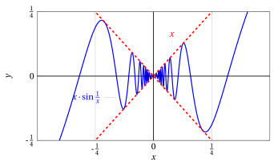
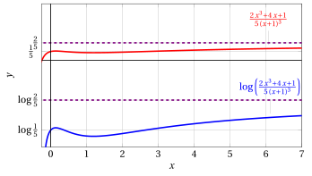

# Calcolo dei limiti di funzioni

**Parte 3 · Limiti di funzioni e continuità · Capitolo 2** · dalle dispense di Fabio Furini · [:material-file-pdf-box: PDF del capitolo](../pdf/limiti-02-calcolo-limiti.pdf)

## 1. Il calcolo dei limiti di funzioni

- Enunciamo i teoremi sui limiti di funzioni che discendono immediatamente dai corrispondenti teoremi sui limiti di successioni e dalla definizione successionale di limite

### 1.1 Teorema dell'algebra dei limiti

!!! teorema "Teorema 1: dell'algebra dei limiti  caso dei limiti finiti"

    Ipotesi per $x \rr c$:

    $$
    \textbf{1.} ~~ f(x) \rr \ell_1 \in \R, \qquad \textbf{2.} ~~ g(x) \rr \ell_2 \in \R.
    $$

    Tesi per $x \rr c$:

    $$
    \textbf{1.} ~~ f(x)\pm g(x) \rr \ell_1 \pm \ell_2, \qquad \textbf{2.} ~~ f(x) \: g(x) \rr \ell_1 \: \ell_2,
    $$

    $$
    \textbf{3.} ~~ \frac{f(x)}{g(x)} \rr \frac{\ell_1}{\ell_2}  ~~~~~~( \ell_2 \neq 0, g(x) \neq 0, {\rm ~~definitivamente~per~~} x \rr c).
    $$

??? dimostrazione "Dimostrazione"

    Sia $\{x_n\}$ una qualsiasi successione tale che

    $$
    x_n \neq c, \forall n, {\rm ~~e~~} x_n \rr c {\rm ~~per~~} n \rr +\infty.
    $$

    Per ipotesi si ha che

    $$
    f(x_n) \rr \ell_1 {\rm ~~e~~} g(x_n) \rr \ell_2 ~~~ (\ell_1,\ell_2 \in \R).
    $$

    Dal teorema sull'algebra dei limiti per successioni si conclude quindi che

    $$
    f(x_n) \pm g(x_n) \rr \ell_1 \pm \ell_2,
    $$

    e quindi

    $$
    f(x) \pm g(x) \rr \ell_1 \pm \ell_2.
    $$

    In modo perfettamente analogo si dimostrano le tesi 2 e 3 del teorema. □

### 1.2 Teoremi di permanenza del segno

!!! chiave ""

    Nei prossimi enunciati  $\ell$ e $c$ saranno punti di $\R^*$ salvo avviso contrario.

!!! teorema "Teorema 2: di permanenza del segno $1^a$ forma"

    Ipotesi:

    $$
    \textbf{1.} ~~f(x) \rr \ell {\rm ~~per~~} x \rr c, \qquad \textbf{2.} ~~ \ell \lessgtr 0.
    $$

    Tesi:

    $$
    f(x) \lessgtr 0 {\rm ~~definitivamente~per~} x \rr c.
    $$

??? dimostrazione "Dimostrazione"

    Sia $\{x_n\}$ una qualsiasi successione tale che

    $$
    x_n \neq c, \forall n, {\rm ~~e~~} x_n \rr c {\rm ~~per~~} n \rr +\infty
    $$

    Abbiamo per l'ipotesi

    $$
    f(x_n) \rr \ell  > 0
    $$

    quindi per il teorema di permanenza del segno per successioni, applicato alla successione $\big\{f(x_n)\big\}$, si conclude che

    $$
    f(x_n) > 0,  ~~~~{\rm definitivamente}.
    $$

    Poiché questo vale per ogni successione tale che $x_n \rr c$, si conclude che

    $$
    f(x) > 0,  {\rm ~~definitivamente,~per~~} x \rr c
    $$

    
□

!!! teorema "Teorema 3: di permanenza del segno per funzioni $2^a$ forma"

    Ipotesi:

    $$
    \textbf{1.} ~~ f(x) \rr \ell \in \R {\rm ~~per~~} x \rr c,
    $$

    $$
    \textbf{2.} ~~ f(x)\ge 0 {\rm ~~definitivamente~per~~} x \rr c.
    $$

    Tesi:

    $$
    \ell \ge 0.
    $$

??? dimostrazione "Dimostrazione"

    Deriva dal corrispettivo teorema per le successioni. □

- Per le funzioni abbiamo anche il seguente teorema di permanenza del segno.

!!! teorema "Teorema 4: di permanenza del segno per funzioni continue"

    Ipotesi:

    $$
    \textbf{1.} ~~ f {\rm ~~è~continua~in~~} c \in \R,  \qquad \textbf{2.} ~~ f(c)>0.
    $$

    Tesi:

    $$
    f(x)>0 {\rm ~~definitivamente~per~~} x \rr c.
    $$

??? dimostrazione "Dimostrazione"

    Se $f$ è continua in $c$, allora

    $$
    f(c) = \lim_{x \rr c} f(x)
    $$

    quindi l'ipotesi $f(c)>0$ significa che

    $$
    f(c) = \lim_{x \rr c} f(x) > 0
    $$

    e questo per il teorema di permanenza del segno $1^a$ forma implica che

    $$
    f(x) > 0 {\rm ~~definitivamente~per~~} x \rr c.
    $$

    
□

### 1.3 Teorema del confronto

!!! teorema "Teorema 5: del confronto"

    Ipotesi:

    $$
    \textbf{1.} ~~  f(x) \rr \ell {\rm ~~e~~} g(x) \rr \ell {\rm ~~per~~} x \rr c,
    $$

    $$
    \textbf{2.} ~~ f(x) \le h(x) \le g(x) {\rm ~~definitivamente~per~~} x \rr c.
    $$

    Tesi:

    $$
    h(x) \rr \ell {\rm ~~per~~} x \rr c.
    $$

??? dimostrazione "Dimostrazione"

    Sia $\{x_n\}$ una qualsiasi successione tale che

    $$
    x_n \neq c, \forall n, {\rm ~~e~~} x_n \rr c {\rm ~~per~~} n \rr +\infty
    $$

    Vogliamo provare che

    $$
    h(x_n) \rr  \ell {\rm ~~per~~} n \rr +\infty
    $$

    Per ipotesi  sappiamo che:

    $$
    f(x_n) \le h(x_n) \le g(x_n),  {\rm ~~definitivamente,}
    $$

    $$
    f(x_n) \rr \ell {\rm~~e~~} g(x_n) \rr \ell, {\rm ~~per~~} x_n \rr c
    $$

    Quindi,  per il teorema del confronto delle successioni:

    $$
    \big\{f(x_n)\big\},~~ \big\{h(x_n)\big\}~~ {\rm e~~} \big\{g(x_n)\big\}
    $$

    si conclude che

    $$
    h(x_n) \rr \ell {\rm ~~per~~} n \rr +\infty
    $$

    
□

!!! teorema "Corollario 1: del teorema del confronto  (parte I)"

    Ipotesi:

    $$
    \textbf{1.} ~~ g(x) \rr 0 {\rm ~~per~~} x \rr c,
    $$

    $$
    \textbf{2.} ~~ |h(x)| \le g(x) {\rm ~~definitivamente~per~~} x \rr c.
    $$

    Tesi:

    $$
    h(x) \rr 0 {\rm ~~per~~} x \rr c.
    $$

??? dimostrazione "Dimostrazione"

    Deriva dal corrispondente corollario sulle successioni. □

!!! esempio "Esempio 1: Corollario del teorema del confronto"

    Proviamo che:

    $$
    \lim_{x \rr 0} x \: \sin \frac{1}{x} = 0
    $$

    Abbiamo

    $$
    x \rr 0 {\rm ~~per~~} x \rr 0 {\rm ~~e~~} \lim_{x \rr 0} \sin \frac{1}{x} {\rm ~~non~esiste~}
    $$

    quindi non si può applicare il teorema [Teorema 1](#box-theoALGEBRA_LIMITI_FUNZIONI-1) dell'algebra dei limiti per funzioni. 

    Abbiamo

    $$
    \left|\sin \frac{1}{x}\right| \le 1 {\rm~~quindi~~} \left|x \: \sin \frac{1}{x}\right| \le |x| {\rm ~~e~~} |x| \rr 0 {\rm ~~per~~} x \rr 0.
    $$

    Quindi, per il corollario [Corollario 1](#box-corolCONFRONTO_FUNZIONI_A-6) del teorema del confronto per funzioni abbiamo:

    $$
    x \: \sin \frac{1}{x} \rr 0 {\rm ~~per~~} x \rr 0.
    $$

    { .fig .ovale loading=lazy style="width:80%" }

!!! teorema "Corollario 2: del teorema del confronto  (parte II)"

    Ipotesi:

    $$
    \textbf{1.} ~~  f(x) \rr 0 {\rm ~~per~~} x \rr c,
    $$

    $$
    \textbf{2.} ~~ g(x) {\rm ~~è~limitata,~definitivamente,~per~~}  x \rr c.
    $$

    Tesi:

    $$
    f(x) \: g(x) \rr 0 {\rm ~~per~~} x \rr c.
    $$

??? dimostrazione "Dimostrazione"

    Deriva dal corrispondente corollario sulle successioni. □

!!! esempio "Esempio 2: Corollario del teorema del confronto"

    Proviamo che:

    $$
    \lim_{x \rr \ip} \frac{x + \sin x}{2\: x + \cos x}= \frac{1}{2}
    $$

    Fattorizzando otteniamo

    $$
    \frac{x + \sin x}{2\: x + \cos x} = \frac{x \left( 1+ \frac{\sin x}{x} \right)}{2\:x \left( 1+ \frac{\cos x}{2\:x} \right)} = \frac{1}{2} \left(\frac{  1+ \frac{\sin x}{x} }{ 1+ \frac{\cos x}{2\:x} } \right)
    $$

    Per il corollario [Corollario 2](#box-corolCONFRONTO_FUNZIONI_B-8) del teorema del confronto per funzioni, abbiamo:

    $$
    \frac{\sin x}{x} \rr 0 {\rm ~~e~~} \frac{\cos x}{2\: x} \rr 0 {\rm ~~per~~} x \rr \ip.
    $$

    { .fig .ovale loading=lazy style="width:80%" }

    Allora per il teorema [Teorema 1](#box-theoALGEBRA_LIMITI_FUNZIONI-1) sull'algebra dei limiti, abbiamo quindi:

    $$
    \frac{x + \sin x}{2\: x + \cos x} \rr \frac{1}{2} {\rm ~~per~~} x \rr \ip.
    $$

### 1.4 Teoremi di aritmetizzazione parziale del simbolo di infinito

!!! teorema "Teorema 6: di aritmetizzazione parziale del simbolo di infinito (addizione)"

    Ipotesi per $x \rr c$:

    $$
    \textbf{1.} ~~ f(x) \rr \ell \in \R, \qquad \textbf{2.} ~~ g(x) \rr \ip, \qquad \textbf{3.} ~~  h(x) \rr \ip.
    $$

    Tesi per $x \rr c$:

    $$
    \textbf{1.} ~~ f(x) + g(x)  \rr \ell  \ip = \ip, \qquad \textbf{2.} ~~ f(x) - g(x)  \rr \ell  \im = \im,
    $$

    $$
    \textbf{3.} ~~ g(x) + h(x) \rr \ip \ip = \ip, \qquad \textbf{4.} ~~ -g(x) - h(x) \rr \im \im = \im.
    $$

??? dimostrazione "Dimostrazione"

    Deriva dal corrispettivo teorema per le successioni. □

!!! teorema "Teorema 7: di aritmetizzazione parziale del simbolo di infinito (prodotto)"

    Ipotesi per $x \rr c$:

    $$
    \textbf{1.} ~~ f(x) \rr \ell \in \R, \qquad \textbf{2.} ~~ g(x) \rr 0, \qquad \textbf{3.} ~~  h(x) \rr \infty.
    $$

    Tesi per  $x \rr c$:

    $$
    \textbf{1.} ~~ f(x) \:\: h(x)  \rr \ell \cdot \infty = \infty \quad (\ell \neq 0),
    \qquad	
    \textbf{2.} ~~ \frac{f(x)}{g(x)}  \rr \frac{\ell}{0} = \infty \quad (\ell \neq 0),
    $$

    $$
    \textbf{3.} ~~ \frac{f(x)}{h(x)}  \rr \frac{\ell}{\infty} = 0.
    $$

??? dimostrazione "Dimostrazione"

    Deriva dal corrispettivo teorema per le successioni. □

- Come per le successioni,  il <strong>segno</strong> di $\infty$ va determinato con la <strong>regola dei segni</strong>.

!!! esempio "Esempio 3: Aritmetizzazione parziale del simbolo di infinito"

    $$
    \lim_{x \rr \im} \left(\frac{1}{x} - 2\right) \: x^3 = \ip
    $$

    In quanto $\left(\frac{1}{x} - 2\right) \rr -2 {\rm ~~e~~} x^3 \rr \im \quad {\rm per~~} x \rr \im$.

## 2. Teorema del cambio di variabile nel limite

!!! teorema "Teorema 8: del cambio di variabile nel limite"

    Siano $f$ e $g$ due funzioni per cui è  definita la composizione $f \circ g$, almeno definitivamente per $x \rr x_0 \in \R^*.$ Se:

    $$
    1.~~~ \lim_{x \rr x_0} g(x) = t_0 \in \R^*,~~~2.~~~ \lim_{t \rr t_0} f(t) = \ell \in \R^*
    $$

    $$
    3.~~~ g(x) \neq t_0,  {\rm ~~~definitivamente,~per~~~} x \rr x_0
    $$

    Allora:

    $$
    \lim_{x  \rr x_0} f\big(g(x)\big) = \lim_{t  \rr t_0} f(t).
    $$

!!! chiave ""

    L'ipotesi $3.$ non è necessaria nel caso in cui $f$ sia continua in $t_0$, oppure se  $t_0= \pm \infty$.

??? dimostrazione "Dimostrazione"

    Sia $\{x_n\}$ una qualsiasi successione tale che

    $$
    x_n \neq x_0, \forall n, {\rm ~~e~~} x_n \rr x_0 {\rm ~~per~~} n \rr +\infty.
    $$

    Abbiamo

    $$
    g(x_n) \rr t_0 {\rm ~~per~~} n \rr +\infty  ~~({\rm per~l'ipotesi}~1)
    $$

    e

    $$
    g(x_n) \neq t_0, {\rm ~~definitivamente~~} ~({\rm per~l'ipotesi}~3).
    $$

    Perciò

    $$
    f\big(g(x_n)\big) \rr \ell ~~({\rm per~l'ipotesi}~2).
    $$

    Se $t_0= \pm \infty$ la condizione $g(x) \neq \pm \infty$ è ovviamente verificata,  mentre se $f$ è continua in $t_0$, $\ell = f(t_0)$, perciò nel caso risultasse $g(x_n)= t_0$ per qualche $n$ si avrebbe

    $$
    f\big(g(x_n)\big)= f(t_0)= \ell
    $$

    e quindi la convergenza

    $$
    f\big(g(x_n)\big) \rr \ell {\rm ~~per~~} n \rr +\infty
    $$

    sarebbe comunque garantita. □

!!! esempio "Esempio 4: Calcolo del limite col teorema del cambio di variabile nel limite"

    Calcoliamo il limite

    $$
    \lim_{x \rr \ip} \log \left ( \frac{2\:x^3+4\:x+1}{5\:(x+1)^3} \right)
    $$

    Le funzioni $f$ e $g$ sono:

    $$
    g(x) = \left ( \frac{2\:x^3+4\:x+1}{5\:(x+1)^3} \right) {\rm ~~~~e~~~~} f(t) = \log t.
    $$

    Abbiamo $t=g(x)$ e

    $$
    (f \circ g)(x) = f\big(g(x)\big) = \log \left ( \frac{2\:x^3+4\:x+1}{5\:(x+1)^3} \right) ~~~~{\rm e ~~~~} x_0 = \ip.
    $$

    Calcoliamo

    $$
    \lim_{x \rr \ip} g(x) = \frac{2}{5} ~~~~{\rm e ~di~conseguenza~~~} t_0 = \frac{2}{5}.
    $$

    Ora calcoliamo

    $$
    \lim_{t \rr 2/5} \log t = \log{\frac{2}{5}} \quad({\rm il~logaritmo~come~vedremo~è ~continuo~in~} \R_+)
    $$

    Quindi

    $$
    \lim_{x \rr \ip} f\big(g(x)\big) = \log{\frac{2}{5}}
    $$

    { .fig .ovale loading=lazy style="width:80%" }

    Inoltre:

    $$
    \lim_{x \rr 0} f\big(g(x)\big)=\log{\frac{1}{5}}
    $$

    utilizzando il teorema abbiamo:

    $$
    \lim_{x \rr 0} g(x) = \frac{1}{5} {\rm ~~~e~~~}  \lim_{t \rr 1/5} \log t = \log{\frac{1}{5}}
    $$

    dato che

    $$
    \lim_{x \rr 0} 2\:x^3+4\:x+1 = 1  {\rm ~~~e~~~}   \lim_{x \rr 0} 5\:(x+1)^3= 5
    $$

!!! esempio "Esempio 5: Calcolo del limite col teorema del cambio di variabile nel limite "

    Calcoliamo i limiti

    $$
    \lim_{x \rr 0^+} e^{\frac{1}{x}}  {\rm ~~~~e~~~~} \lim_{x \rr 0^-} e^{\frac{1}{x}}.
    $$

    Le funzioni $f$ e $g$ sono:

    $$
    g(x) = \frac{1}{x} {\rm ~~~~e~~~~} f(t) = e^t.
    $$

    Abbiamo $t=g(x)$ e

    $$
    (f \circ g) (x) = f\big(g(x)\big) = e^{\frac{1}{x}}~~~~{\rm inoltre ~~~~} x_0 = 0^+ {\rm ~~~~e~~~~} x_0 = 0^-.
    $$

    1. $\frac{1}{x} \rr \ip$ per $x \rr 0^+$ e quindi $t_0=\ip$. Ora  calcoliamo:

        $$
        \lim_{t \rr \ip} e^t = \ip {\rm ~~~~quindi~~~~} 
        \lim_{x \rr 0^+} e^{\frac{1}{x}} = \ip.
        $$

    2. $\frac{1}{x} \rr \im$ per $x \rr 0^-$ e quindi $t_0=\im$. Ora calcoliamo:

        $$
        \lim_{t \rr \im} e^t = 0 {\rm ~~~~quindi~~~~} \lim_{x \rr 0^-} e^{\frac{1}{x}} = 0.
        $$

    { .fig .ovale loading=lazy style="width:80%" }
