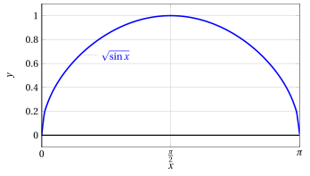
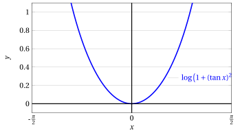

# Funzioni continue

**Parte 3 · Limiti di funzioni e continuità · Capitolo 4** · dalle dispense di Fabio Furini · [:material-file-pdf-box: Dispensa del volume (PDF)](../pdf/dispensa-3-limiti.pdf) · [:material-presentation: Slide (PDF)](../pdf/slide-limiti-04-funzioni-continue.pdf)

## 1. Teorema dell'algebra delle funzioni continue

!!! teorema "Teorema 1: dell'algebra delle funzioni continue"

    Siano $f$ e $g$ due funzioni definite almeno in un intorno di $x_0 \in \R$ e continue in $x_0$. Allora:

    $$
    \textbf{1.}~~ f(x) \pm g(x) {\rm ~~è~continua~in~} x_0; \qquad \textbf{2.}~~ f(x) \cdot g(x) {\rm ~~è~continua~in~} x_0;
    $$

    $$
    \textbf{3.}~~ \frac{f(x)}{g(x)} {\rm ~~è~continua~in~} x_0 {\rm ~purché~} g(x_0) \neq 0.
    $$

??? dimostrazione "Dimostrazione"

    Proviamo ad esempio la 3., essendo le altre analoghe. Per ipotesi sappiamo che $f$ e $g$ sono continue in $x_0$, ossia:

    $$
    f(x) \rr f(x_0) {\rm ~~ e~~ } g(x) \rr g(x_0) {\rm ~~~~per~~~~} x \rr x_0.
    $$

    Inoltre $g(x_0) \neq 0$ e quindi, per il teorema di permanenza del segno per funzioni continue, $g(x) \neq 0$ definitivamente per $x \rr x_0$.

    Allora per il teorema sull'algebra dei limiti si conclude che

    $$
    \frac{f(x)}{g(x)} \rr \frac{f(x_0)}{g(x_0)} {\rm ~~~~per~~ ~~} x \rr x_0
    $$

    ossia $f(x)/g(x)$ è continua in $x_0$. □

## 2. Teorema di continuità delle funzioni elementari

!!! teorema "Teorema 2: di continuità delle funzioni elementari"

    Le seguenti funzioni elementari sono continue in tutti i punti del proprio insieme di definizione:

    1. Potenze a esponente intero, razionale o reale;

    2. Funzioni esponenziali;

    3. Funzioni logaritmiche;

    4. Funzioni trigonometriche elementari ($\sin x$, $\cos x$)

??? dimostrazione "Dimostrazione"

    Ad esempio, proviamo la continuità in tutto $\R$ delle funzioni $\sin x$ e $\cos x$.

    - Abbiamo visto che  $\sin x$ è continuo in $x =0$, mostriamo che anche $\cos x$ è continuo in $x=0$.

    - La circonferenza trigonometrica mostra che, se $x$ è un angolo nel primo quadrante,

        $$
        \sin x + \cos x \ge 1
        $$

        in quanto 1 è l'ipotenusa di un triangolo rettangolo di cateti $\sin x$, $\cos x$.

        { .fig .ovale loading=lazy style="width:70%" }

    - Ne segue che

        $$
        0 \le 1 - \cos x \le \sin x ~~~ {\rm ~per~} x \in \left[0, \frac{\pi}{2}\right], {\rm~~e~quindi}
        $$

        $$
        0 \le 1 - \cos x \le |\sin x| ~~~ {\rm ~per~} x \in \left[-\frac{\pi}{2}, \frac{\pi}{2}\right]
        $$

    - Allora per il teorema del confronto

        $$
        1 - \cos x \rr 0 {\rm  ~~per~~} x \rr 0 
        {\rm ~~quindi~~}  \cos x \rr 1 {\rm  ~~per~~} x \rr 0
        $$

        e perciò $\cos x$ è continuo in $0$.

    
□

??? dimostrazione "Dimostrazione"

    - Per provare ora la continuità di $\sin x$ in un generico punto $x_0 \in \R$ consideriamo la catena di relazioni:

        \begin{align*}
        | \sin(x_0 + h) - \sin x_0| &= | \sin x_0 \: \cos h + \sin h \:\cos x_0  - \sin x_0| \\[2ex] 
        & = | \sin x_0 \: (\cos h -1) + \cos x_0 \: \sin h | \\[2ex] 
        & \le |\sin x_0 \; (\cos h -1)| + |\cos x_0 \;\sin h|\\[2ex]  
        & = |\sin x_0| \: |\cos h -1| + |\cos x_0| \: |\sin h|
        \end{align*}

        Ora $|\sin h|$ e $|\cos h - 1|$ tendono a zero per $h \rr 0$, per quanto appena dimostrato, mentre $|\sin x_0|$  e $|\cos x_0|$ sono costanti dunque

        $$
        \sin(x_0 + h) - \sin x_0  \rr 0 {\rm ~~per~~} h \rr 0
        $$

        ossia

        $$
        \sin(x_0 + h) \rr \sin x_0 {\rm ~~per~~} h \rr 0
        $$

        e $\sin x$ è continua in $x_0$. Un analogo ragionamento mostra la continuità di $\cos x$.

    
□

!!! chiave ""

    - Avendo dimostrato che $\sin x$, $\cos x$ sono continue in tutto $\R$, deduciamo che le funzioni $\tan x$, $\cot x$ sono continue nel loro insieme di definizione (per il teorema dell'algebra delle funzioni continue)

    - Le funzioni potenza a esponente intero sono continue (in tutto $\R$), in quanto $f(x)=x$ è ovviamente continua, e $f(x) = x^n$ è il prodotto di $n$ funzioni continue.

    - I polinomi sono funzioni continue, in quanto ottenuti sommando funzioni del tipo $c \: x^n$, continue per il punto precedente.

    - Le funzioni razionali (cioè i quozienti di polinomi) sono funzioni continue, tranne nei punti in cui si annulla il denominatore (che è un polinomio, quindi si annulla in un numero finito di punti)

## 3. Teorema di continuità della funzione composta

!!! teorema "Teorema 3: di continuità della funzione composta"

    Siano:

    - $g$ una funzione  definita almeno in un intorno di $x_0$ e continua in $x_0$,

    - $f$ una funzione  definita almeno in un intorno di $t_0=g(x_0)$  e continua in $t_0$,

    allora $f \circ g$ è definita almeno in un intorno di $x_0$ ed è continua in $x_0$.

??? dimostrazione "Dimostrazione"

    Poiché $g$ è continua in $x_0$,

    $$
    \lim_{x \rr x_0} g(x) = g(x_0) = t_0
    $$

    allora per il teorema del cambio di variabile nel limite, si ha:

    $$
    \lim_{x \rr x_0} f\big(g(x)\big) = \lim_{t \rr t_0} f(t)
    $$

    e poiché $f$ è continua in $t_0$, si ha

    $$
    \lim_{t \rr t_0} f(t) = f(t_0)
    $$

    e la tesi è dimostrata. □

- Ne segue che tutte le funzioni che si possono ottenere con somma, prodotto, quoziente e composizioni da funzioni elementari sono continue nel loro insieme di definizione. <strong>Quindi combinando in questo modo le funzioni si ottengono ancora funzioni continue</strong>.

!!! chiave ""

    Riassumendo:

    - somma, prodotto, quoziente di funzioni continue danno funzioni continue (dove il denominatore non si annulla);

    - le funzioni elementari dell'analisi matematica sono continue nel loro insieme di definizione;

    - composizione di funzioni continue dà una funzione continua.

- È quindi possibile  sapere a priori che una funzione è continua nel suo insieme di definizione, senza applicare caso per caso la definizione di continuità.

!!! chiave ""

    <strong>Per le funzioni continue</strong>, se $x_0$ è un punto del dominio, il limite per $x \rr x_0$ si calcola semplicemente sostituendo $x_0$ nell'espressione analitica della funzione, ovvero:

    $$
    f(x) \rr f(x_0) {\rm ~~~~per~~~} x \rr x_0
    $$

!!! esempio "Esempio 1: Funzioni continue e limiti finiti al finito"

    La seguente funzione è continua con $x \in \R$:

    $$
    f(x)=e^{-x^2}
    $$

    quindi:

    $$
    \lim_{x \rr 1} e^{-x^2} = e^{-1} = \frac{1}{e}
    $$

    { .fig .ovale loading=lazy style="width:80%" }

!!! esempio "Esempio 2: Funzioni continue e limiti finiti al finito"

    La seguente funzione è continua con $x \in \R$ e $2 \;k \;\pi \le x \le  2 \;k \;\pi+\pi, \forall k \in \Z$:

    $$
    f(x)=\sqrt{\sin x} 
    {\rm ~~~~quindi~~~~~}
    \lim_{x \rr \pi^{-}}  \sqrt{\sin x} =  \sqrt{\sin \pi} = 0
    $$

    { .fig .ovale loading=lazy style="width:75%" }

!!! esempio "Esempio 3: Funzioni continue e limiti finiti al finito"

    La seguente funzione è continua con $x \in \R$ e  $x \neq (2\:k+1) \: \frac{\pi}{2}, \forall k \in \mathbb{Z}$:

    $$
    f(x)=\log_a \big( 1 + (\tan x)^2\big),~~ \forall a >0, a \neq 1
    $$

    quindi:

    $$
    \lim_{x \rr 0}  \log_a \big( 1 + (\tan x)^2\big) = \log_a \big( 1 + (\tan 0)^2\big) = \log_a 1 =0
    $$

    Ad esempio con $a=e$ abbiamo:

    { .fig .ovale loading=lazy style="width:75%" }
