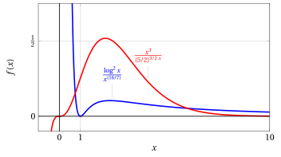
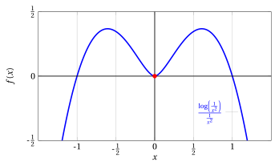
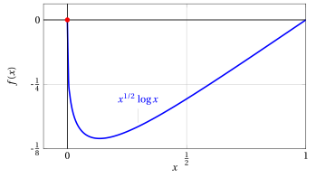
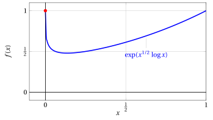
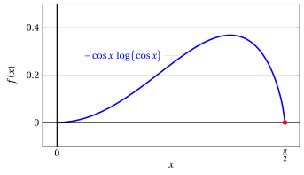
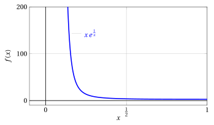
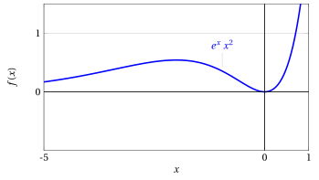

# Confronto degli infiniti

**Parte 3 · Limiti di funzioni e continuità · Capitolo 5** · dalle dispense di Fabio Furini · [:material-file-pdf-box: Dispensa del volume (PDF)](../pdf/dispensa-3-limiti.pdf)

## 1. Confronto degli infiniti per funzioni

!!! teorema "Teorema 1: Confronto tra infiniti"

    Dati $\alpha,\beta, \lambda > 0,~ a,b >1$, abbiamo

    $$
    \lim_{x \rr \ip} \frac{\log_a^{\beta}  x}{x^{\alpha}}=0 {\rm ~~~~~~e~~~~~~} \lim_{x \rr \ip} \frac{x^{\alpha}}{b^{\lambda  x}}=0
    $$

??? dimostrazione "Dimostrazione"

    Il teorema  sarà dimostrato con gli strumenti del calcolo differenziale. □

!!! chiave ""

    - Qualunque potenza con esponente positivo  è un infinito di ordine superiore a qualunque potenza di logaritmi a base $> 1$ e

    - Qualunque esponenziale a base $> 1$  è  un infinito di ordine superiore a qualunque potenza con esponente positivo.

!!! esempio "Esempio 1: Confronto fra infiniti"

    $$
    \lim_{x \rr \ip} \frac{\log^2 x}{x^{(16/7)}} = 0, \qquad \lim_{x \rr \ip} \frac{x^3}{(5/2)^{3/2\;x}} = 0
    $$

    { .fig .ovale loading=lazy style="width:95%" }

!!! chiave ""

    Se una funzione $\eta(x) \rr \ip$   per $x \rr c \in \R^*$, abbiamo dal teorema del confronto degli infiniti:

    $$
    \lim_{x \rr c} \frac{\bigg(\log_a  \big(\eta(x)\big)\bigg)^{\beta}}{\big(\eta(x)\big)^{\alpha}}=0 {\rm ~~~~~~e~~~~~~} \lim_{x \rr c} \frac{\big(\eta(x)\big)^{\alpha}}{b^{\lambda \;\eta(x)}}=0\quad {\rm ~~con~~} \alpha, \beta, \lambda > 0,~ a,b >1
    $$

!!! esempio "Esempio 2: Confronto degli infiniti"

    $$
    \lim_{x \rr 0} \frac{\log \left( \frac{1}{x^2}\right)}{\frac{1}{x^2}} = 0
    $$

    dato che con $\eta(x) = \frac{1}{x^2}$, abbiamo $\eta(x) \rr \ip$ per $x \rr 0$.

    { .fig .ovale loading=lazy style="width:65%" }

!!! osservazione "Osservazione 1"

    $$
    \lim_{x \rr 0^+}  x^{\alpha} \; \log^{\beta}_a  x =0 \qquad (\alpha >0,\beta = \frac{m}{n},  ~n,m \in \N,  ~n {~~\rm dispari},~ a>1)
    $$

??? dimostrazione "Dimostrazione"

    Dati $\alpha,\beta >0,a>1$  abbiamo:

    $$
    \lim_{x \rr \ip} \frac{\log_a^{\beta}  x}{x^{\alpha}} =0  {\rm ~~~~~e~~~~}  \frac{\log_a^{\beta}  x}{x^{\alpha}} = \left(\frac{1}{x}\right)^{\alpha} \left( - \log_a \left(\frac{1}{x}\right)\right)^{\beta}
    $$

    Ponendo $t = \frac{1}{x}$, $x \rr  \ip$ equivale a $t \rr 0^{+}$, e sostituendo si ha:

    $$
    \lim_{x \rr \ip} \frac{\log_a^{\beta}  x}{x^{\alpha}}= (-1)^{\beta} \; \lim_{t \rr 0^+}   t^{\alpha} \; \log_a^{\beta}  t=0
    $$

    
□

!!! esempio "Esempio 3: Confronto degli infiniti"

    $$
    \lim_{x \rr 0^+} x^{1/2} \: \log x = 0^-
    $$

    dato che abbiamo  $\alpha=\frac{1}{2}>0, \beta=1>0$ e $a=e >1$.

    { .fig .ovale loading=lazy style="width:80%" }

    $$
    \lim_{x \rr 0^+} x^{\sqrt{x}} = 1^{-}
    $$

    dato che

    $$
    \lim_{x \rr 0^+} x^{\sqrt{x}} =  \lim_{x \rr 0^+} \underbrace{e^{x^{1/2} \: \log x}}_{=\exp(x^{1/2} \: \log x)} =  e^{0^-} = 1^{-}
    $$

    { .fig .ovale loading=lazy style="width:80%" }

!!! chiave ""

    Se una funzione $\varepsilon(x)$  tende $0^+$ per $x \rr c \in \R^*$, segue dalla precedente osservazione che:

    $$
    \lim_{x \rr c}   \big(\varepsilon(x)\big)^{\alpha} \; \big(  \: \log_a  \big(\varepsilon(x)\big)\big)^{\beta} =0 \quad (\alpha>0,\beta = \frac{m}{n},  ~n,m \in \N,  ~n {~~\rm dispari},~ a>1)
    $$

!!! esempio "Esempio 4: Confronto degli infiniti"

    $$
    \lim_{x \rr \frac{\pi}{2}^-} - \cos x \;  \log \big( \cos x \big)  = 0^+
    $$

    dato che, con $\varepsilon(x) = \cos x$, abbiamo $\varepsilon(x) \rr 0^+$ per $x \rr \frac{\pi}{2}^-$  e $\alpha=\beta=1$.

    { .fig .ovale loading=lazy style="width:70%" }

!!! chiave ""

    Dal teorema di confronto degli infiniti segue che:

    $$
    \lim_{x \rr \ip} \frac{x^{\alpha}}{\log_a^{\beta}  x}=+\infty {\rm ~~~~e~~~~} \lim_{x \rr \ip} \frac{b^{\lambda \: x}}{x^{\alpha}}=+\infty
    {\rm ~~~~con~~~~} \alpha, \beta,\lambda > 0,~~ a,b >1
    $$

!!! osservazione "Osservazione 2"

    $$
    \lim_{x \rr 0^+}  x^{\alpha} \; b^{\lambda/x} = \ip \qquad (\alpha, \lambda >0,~ b>1)
    $$

??? dimostrazione "Dimostrazione"

    Dati $\alpha, \lambda >0,b>1$, abbiamo:

    $$
    \lim_{x \rr \ip} \frac{b^{\lambda \: x}}{x^{\alpha}}=\ip
    $$

    Ponendo $t = \frac{1}{x}$, $x \rr  \ip$ equivale a $t \rr 0^{+}$, e sostituendo  si ha:

    $$
    \lim_{x \rr \ip} \frac{b^{\lambda \: x}}{x^{\alpha}}= \lim_{x \rr \ip}  \left(\frac{1}{x}\right)^{\alpha} \; b^{\lambda \: x}=  \lim_{t \rr 0^+} t^{\alpha} \; b^{\lambda/t} = \ip
    $$

    
□

!!! esempio "Esempio 5: Confronto degli infiniti"

    $$
    \lim_{x \rr 0^+} x\; e^{\frac{1}{x}}  = \ip
    $$

    dato che abbiamo $\alpha=\lambda=1$ e $b=e>1$

    { .fig .ovale loading=lazy style="width:75%" }

!!! osservazione "Osservazione 3"

    $$
    \lim_{x \rr 0^+}   x^{-\alpha} \; b^{-\lambda/x} = 0 \qquad (\alpha, \lambda >0,~ b>1)
    $$

??? dimostrazione "Dimostrazione"

    Dati $\alpha, \lambda >0,b>1$ abbiamo:

    $$
    \lim_{x \rr \ip} \frac{x^{\alpha} }{b^{\lambda \: x}} =0
    $$

    Ponendo $t =\frac{1}{x}$, $x \rr  \ip$ equivale a $t \rr 0^+$, e sostituendo  si ha:

    $$
    \lim_{x \rr \ip}\frac{x^{\alpha} }{b^{\lambda \: x}}  = \lim_{x \rr \ip}  \left(  \frac{1 }{x} \right)^{-\alpha} \frac{1}{b^{\lambda \: x}} =  \lim_{t \rr 0^+}    t^{-\alpha} \; b^{-\lambda/t} = 0
    $$

    
□

!!! esempio "Esempio 6: Confronto degli infiniti"

    $$
    \lim_{x \rr 0^+} x^{-3/2} \: e^{-1/x}     = 0
    $$

    dato che abbiamo $\alpha=\frac{3}{2}, \lambda=1$ e $b=e>1$.

    { .fig .ovale loading=lazy style="width:80%" }

!!! osservazione "Osservazione 4"

    $$
    \lim_{x \rr \im}   x^{\alpha} \; b^{\lambda \: x} = 0 \qquad \left(\alpha = \frac{m}{n} >0,  ~n,m \in \N,  ~n {~~\rm dispari}, m \neq 0, ~ \lambda >0, ~ b>1  \right)
    $$

??? dimostrazione "Dimostrazione"

    Dati $\alpha, \lambda >0,b>1$ abbiamo:

    $$
    \lim_{x \rr \ip} \frac{x^{\alpha} }{b^{\lambda \: x}} =0
    $$

    Ponendo $t =-x$, $x \rr  \ip$ equivale a $t \rr \im$, e sostituendo  si ha:

    $$
    \lim_{x \rr \ip}\frac{x^{\alpha} }{b^{\lambda \: x}} =\lim_{t \rr \im} \frac{(-t)^{\alpha} }{b^{-\lambda \: t}} = (-1)^\alpha \lim_{t \rr \im}   t^{\alpha} \; b^{\lambda \: t} = 0
    $$

    
□

!!! esempio "Esempio 7: Confronto degli infiniti"

    $$
    \lim_{x \rr \im} x^2  \; e^{x}  = 0
    $$

    dato che abbiamo $\alpha=2, \lambda=1$ e $b=e>1$.

    { .fig .ovale loading=lazy style="width:70%" }
