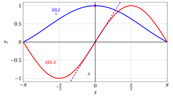
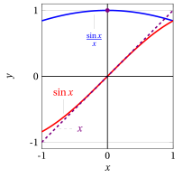
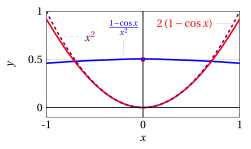
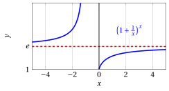
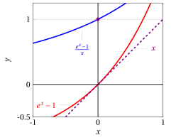
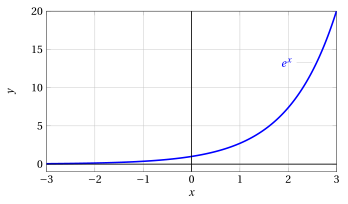
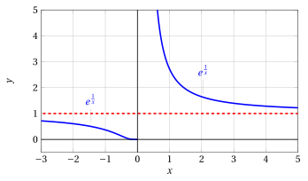

# Limiti notevoli e stime asintotiche

**Parte 3 · Limiti di funzioni e continuità · Capitolo 6** · dalle dispense di Fabio Furini · [:material-file-pdf-box: PDF del capitolo](../pdf/limiti-06-limiti-notevoli.pdf)

## 1. Limiti notevoli

- Vediamo ora alcune comuni tecniche di calcolo dei limiti che  combinano i teoremi generali sui limiti con l'uso di alcuni limiti notevoli di certe funzioni elementari.

### 1.1 Limiti notevoli di seno e coseno

- Vogliamo calcolare

    $$
    \lim_{x \rr 0} \frac{\sin x}{x} = \left[\frac{0}{0}\right]
    {\rm ~~e~~}
    \lim_{x \rr 0} \frac{1-\cos x}{x^2} = \left[\frac{0}{0}\right]
    $$

    che si presentano in forma indeterminata.

{ .fig .ovale loading=lazy style="width:80%" }

{ .fig .ovale loading=lazy style="width:80%" }

!!! teorema "Lemma 1"

    \begin{equation}
    \label{LN_1}
    \lim_{x \rr 0} \frac{\sin x}{x} =1
    \end{equation}

??? dimostrazione "Dimostrazione"

    Le funzioni $\sin x$ e $x$ sono funzioni dispari, allora $\frac{\sin x}{x}$ è una funzione pari.  Quindi è sufficiente calcolare

    $$
    \lim_{x \rr 0^+} \frac{\sin x}{x}
    $$

    Abbiamo:

    { .fig .ovale loading=lazy style="width:42%" }

    $$
    HP=\sin x \quad AT = \tan x \quad 
    \stackrel{\LARGE\frown}{AP}
    = x
    $$

    L'area del triangolo $OPA$ è minore di quella del settore circolare $OPA$, a sua volta minore di quella del triangolo $OTA$. Ne segue

    $$
    \underbrace{\frac{1}{2} \cdot 1 \cdot \sin x}_{{\rm area~ triang.~} OPA} \le \underbrace{\frac{1}{2} \cdot 1 \cdot x}_{{\rm area~ sett.~circ.~} OPA} \le \underbrace{\frac{1}{2} \cdot 1 \cdot \tan x}_{{\rm area~triang.~} OTA}
    $$

    ossia per $x \in  \left(0, \frac{\pi}{2}\right)$:

    $$
    \sin x < x < \tan x
    $$

    Dividendo per $\sin x$, che è positivo perché $x \in  \left(0, \frac{\pi}{2}\right)$, si ha

    $$
    1 < \frac{x}{\sin x} < \frac{1}{\cos x}, \quad \forall x \in  \left(0, \frac{\pi}{2} \right)
    {\rm ~~~~ovvero~~~~}
    \cos x < \frac{\sin x}{x} < 1, \quad \forall x \in  \left(0, \frac{\pi}{2} \right)
    $$

    Dal teorema del confronto, essendo $\lim_{x \rr 0} \cos x= 1$, si deduce il lemma. □

{ .fig .ovale loading=lazy style="width:52%" }

!!! teorema "Lemma 2"

    \begin{equation}
    \label{LN_2}
    \lim_{x \rr 0} \frac{1 - \cos x}{x^2} = \frac{1}{2}
    \end{equation}

??? dimostrazione "Dimostrazione"

    Consideriamo

    $$
    \frac{1-\cos x}{x^2} = \frac{1-\cos^2 x}{x^2 \:(1+\cos x)}= \left( \frac{\sin x}{x} \right)^2 \: \frac{1}{1 + \cos x}
    $$

    quindi, dato che $\frac{\sin x}{x} \rr 1 {\rm ~~e~~} (1 + \cos x) \rr 2 {\rm ~~per~~} x \rr 0$, abbiamo la tesi. □

{ .fig .ovale loading=lazy style="width:70%" }

### 1.2 Prolungamento per continuità di una funzione

- In base al limite \(\eqref{LN_1}\) dimostrato, le funzioni $f(x) = \frac{\sin x}{x}$, e $g(x) = \frac{1-\cos x}{x^2}$ inizialmente non definite per $x = 0$ possono essere prolungate per continuità anche in $x = 0$, ponendo

    $$
    f(x)= 
    \begin{cases}
    \frac{\sin x}{x} & {\rm se~~} x \neq 0\\
    1 & {\rm se~~} x = 0
    \end{cases}
    \qquad 
    g(x)= 
    \begin{cases}
    \frac{1- \cos x}{x^2} & {\rm se~~} x \neq 0\\
    \frac{1}{2} & {\rm se~~} x = 0
    \end{cases}
    $$

    Le funzioni $f$ e $g$ così definite risultano continue anche in $x = 0$.

!!! chiave ""

    - se una funzione $f(x)$ non è definita in $x_0$ ma esiste finito

        $$
        \lim_{x \rr x_0} f(x) = \ell
        $$

        la funzione può essere prolungata per continuità anche in $x_0$, ponendo per definizione

        $$
        f(x_0) = \ell
        $$

    - Se invece la funzione $f$ possiede in $x_0$ una discontinuità a salto, un asintoto verticale, o comunque non ammette limite finito, non è possibile renderla continua in $x_0$ alterandone la definizione in un punto solo.

### 1.3 Altri limiti notevoli

- Sappiamo  che per ogni successione $\{a_n\}$ divergente a $\ip$ o $\im$ si ha

    $$
    \lim_{n \rr \ip} \left(1 + \frac{1}{a_n}\right)^{a_n} = e
    $$

- Questo fatto, per la definizione successionale di limite di funzione, implica immediatamente il prossimo limite notevole

!!! teorema "Lemma 3"

    \begin{equation}
    \label{LN_3}
    \lim_{x \rr \pm \infty} \left(1 + \frac{1}{x}\right)^x = e
    \end{equation}

{ .fig .ovale loading=lazy style="width:80%" }

!!! chiave ""

    Se $\eta(x)$ è una funzione che tende a infinito[^1] (cioè è un infinito: $\eta(x) \rr \pm\infty$), abbiamo: 

    \begin{align}
    \left( 1 + \frac{1}{\eta(x)} \right)^{\eta(x)} \rr e
    \end{align}

!!! esempio "Esempio 1: Limiti di funzioni che tendono a $e$"

    1.

        $$
        \lim_{x \rr \ip} \left( 1 + \frac{1}{2\:x^2-10} \right)^{2\:x^2-10} = e
        $$

        dato che con $\eta(x) = 2\:x^2-10$ abbiamo

        $$
        \eta(x) \rr \ip {\rm~~per~~} x \rr \ip.
        $$

    2.

        $$
        \lim_{x \rr 0^+} \left( 1 + \frac{1}{1/x} \right)^{1/x} = e
        $$

        dato che con $\eta(x) = \frac{1}{x}$ abbiamo

        $$
        \eta(x) \rr \ip {\rm~~per~~} x \rr 0^+.
        $$

<strong>Dal limite notevole \(\eqref{LN_3}\) se ne possono dedurre altri tre </strong>

!!! teorema "Corollario 1"

    \begin{equation}
    \label{LN_4}
    \lim_{y \rr 0} \frac{\log(1 + y)}{y} =1
    \end{equation}

??? dimostrazione "Dimostrazione"

    Passando ai logaritmi nella \(\eqref{LN_3}\), si ottiene

    $$
    \log \left(1 + \frac{1}{x}\right)^x = x \: \log \left(1 + \frac{1}{x}\right)
    $$

    quindi

    $$
    \lim_{x \rr \pm \infty} x \: \log \left(1 + \frac{1}{x}\right) = \log e = 1.
    $$

    Ora se si pone $y=\frac{1}{x}$, $x \rr \pm \infty$ equivale a $y \rr 0^{\pm}$,  e l'ultimo limite si può quindi riscrivere nella forma seguente:

    \begin{equation*}
    \frac{\log(1 + y)}{y} \rr 1 {\rm ~~per~~} y \rr 0.
    \end{equation*}

    
□

{ .fig .ovale loading=lazy style="width:61%" }

!!! teorema "Corollario 2"

    \begin{equation}
    \label{LN_5}
    \lim_{x \rr 0}  \frac{e^x -1}{x} =1
    \end{equation}

??? dimostrazione "Dimostrazione"

    Se nella \(\eqref{LN_4}\), poniamo invece $y= e^x -1$, $y \rr 0$ equivale a $x \rr 0$, e sostituendo si ricava

    $$
    \frac{\log e^x}{e^x-1} = \frac{x}{e^x-1} \rr 1 {\rm ~~~per~~~} x \rr 0.
    $$

    Passando al reciproco otteniamo il  limite notevole. □

{ .fig .ovale loading=lazy style="width:61%" }

!!! esempio "Esempio 2: Limite notevole"

    Calcoliamo:

    $$
    \lim_{x \rr 0} \frac{e^{-x}-1}{x}
    $$

    Poniamo $z= -x$, $x \rr 0$ equivale a $z \rr 0$, e sostituendo si ricava:

    $$
    \lim_{x \rr 0} \frac{e^{-x}-1}{x} = \lim_{z \rr 0} \frac{e^{z}-1}{-z}=-\lim_{z \rr 0} ~~~\underbrace{\frac{e^{z}-1}{z}}_{\rr 1}=-1
    $$

!!! teorema "Corollario 3"

    \begin{equation}
    \label{LN_5__2}
    \lim_{x \rr 0} \frac{ (1 + x)^{\alpha} -1}{x} = \alpha {\rm ~~~~~~~~con~~~} \alpha \in \R
    \end{equation}

??? dimostrazione "Dimostrazione"

    Se nella \(\eqref{LN_4}\), poniamo invece $y= (1+x)^{\alpha} -1$, con $\alpha$ esponente reale qualsiasi, allora $x \rr 0$ equivale a $y \rr 0$ e si ha:

    \begin{align*}
    \frac{\log(1 + y)}{y} &= \frac{\log[1 + (1+x)^{\alpha} -1]}{(1+x)^{\alpha} -1} = \frac{\alpha \log (1+x)}{(1+x)^{\alpha} -1}\\[2ex]
     & = \frac{\alpha \: x}{(1+x)^{\alpha} -1} \cdot \frac{\log(1+x)}{x} \rr 1  {\rm ~~per~~} x \rr 0.
    \end{align*}

    Ma poiché anche

    $$
    \frac{\log(1+x)}{x} \rr 1 {\rm ~~per~~} x \rr 0,
    $$

    allora

    $$
    \frac{\alpha \: x}{(1+x)^{\alpha} -1} \rr 1 {\rm ~~~per~~~} x \rr 0.
    $$

    Passando al reciproco e poi moltiplicando per $\alpha$ otteniamo il  limite notevole. □

{ .fig .ovale loading=lazy style="width:61%" }

## 2. Stime asintotiche

!!! definizione "Definizione 1: di funzioni asintotiche"

    Si dice che due funzioni $f$ , $g$ sono <strong>asintotiche</strong> per $x \rr c$ se

    $$
    \lim_{x \rr c} \frac{f(x)}{g(x)}=1
    $$

    e si scrive $f \thicksim g$ per $x \rr c$.

- Il simbolo di asintotico per funzioni gode di tutte le proprietà enunciate per le successioni

!!! chiave ""

    Per $x \rr 0$ abbiamo (dai limiti notevoli):

    

    \begin{align}
    \sin x &\thicksim x\\[2ex]
    \log(1+x) &\thicksim x\\[2ex] 
     \cos x & \thicksim  1- \frac{1}{2} x^2\\[2ex]
     e^x &\thicksim 1+ x\\[2ex] 
    (1+x)^{\alpha}  &\thicksim 1 + \alpha \: x  {\rm ~~~~~~~~con~~~} \alpha \in \R
    \end{align}

- Le funzioni $\thicksim x$ si comportano, in prima approssimazione o al primo ordine, come $x$ per $x \rr 0$.

!!! chiave ""

    Se $\varepsilon(x)$ è una funzione che tende a zero[^2] (cioè è un infinitesimo: $\varepsilon(x) \rr 0$), abbiamo:

    

    \begin{align}
    \sin \big( \varepsilon(x) \big) &\thicksim \varepsilon(x)\\[2ex]
     \log \big(1+\varepsilon(x)\big) &\thicksim \varepsilon(x)\\[2ex]
     \cos \big( \varepsilon(x) \big) &\thicksim 1 - \frac{1}{2} \;\varepsilon^2(x)\\[2ex]
     e^{\varepsilon(x)} &\thicksim 1 +\varepsilon(x)\\[2ex]
      \big(1+\varepsilon(x)\big)^{\alpha}  & \thicksim 1+ \alpha \; \varepsilon(x)  {\rm ~~~~~~~~con~~~} \alpha \in \R
    \end{align}

- Le formule \(\eqref{LIM_NOT_C__2}\) si deducono dalle formule \(\eqref{LIMMMM}\)  semplicemente con un cambio di variabile

    $$
    x = \varepsilon(x)
    $$

!!! esempio "Esempio 3: Limiti con funzioni asintotiche"

    $$
    \lim_{x \rr 1} \frac{(x-1)^2}{e^{3\: (x-1)^2}-1} = \left[\frac{0}{0}
     \right]
    $$

    Utilizziamo la stima

    $$
    e^{\varepsilon(x)} -1  \thicksim \varepsilon(x)
    $$

    con

    $$
    \varepsilon(x) = 3 \: (x-1)^2 {\rm ~~e~~} \varepsilon(x) \rr 0 {\rm ~~per~~} x \rr 1
    $$

    E allora, per $x \rr 1$, abbiamo

    $$
    e^{3\: (x-1)^2}-1 \thicksim 3\: (x-1)^2.
    $$

    e

    $$
    \lim_{x \rr 1} \frac{(x-1)^2}{e^{3\: (x-1)^2}-1} = \lim_{x \rr 1} \frac{(x-1)^2}{3\: (x-1)^2} = \frac{1}{3}
    $$

!!! esempio "Esempio 4: Limiti con funzioni asintotiche"

    $$
    \lim_{x \rr 0} \frac{\log(1+2\:x)}{\sin 3\:x} = \left[\frac{0}{0}
     \right]
    $$

    Utilizziamo la stima

    $$
    \log(1 + \varepsilon(x))   \thicksim \varepsilon(x)
    $$

    con

    $$
    \varepsilon(x) = 2 \: x {\rm ~~e~~} \varepsilon(x) \rr 0 {\rm ~~per~~} x \rr 0.
    $$

    Quindi, per $x \rr 0$ abbiamo

    $$
    \log(1 + 2\:x) \thicksim 2 x
    $$

    Utilizziamo ora anche la stima

    $$
    \sin{\varepsilon(x)}   \thicksim \varepsilon(x)
    $$

    con

    $$
    \varepsilon(x) = 3 \: x {\rm ~~e~~} \varepsilon(x) \rr 0 {\rm ~~per~~} x \rr 0
    $$

    Quindi, per $x \rr 0$ abbiamo

    $$
    \sin 3\: x \thicksim 3 x
    $$

    E allora, per $x \rr 0$, abbiamo

    $$
    \frac{\log(1+2\:x)}{\sin 3\:x} \thicksim \frac{2\:x}{3\:x}
    $$

    e

    $$
    \lim_{x \rr 0} \frac{\log(1+2\:x)}{\sin 3\:x} = \lim_{x \rr 0} \frac{2\:x}{3\:x} = \frac{2}{3}
    $$

!!! esempio "Esempio 5: Limiti con funzioni asintotiche"

    $$
    \lim_{x \rr \ip}  \sqrt[3]{x^3 + 2\: x^2 +1} - x= \left[\ip \im
     \right]
    $$

    Riscriviamo,

    $$
    \sqrt[3]{x^3 + 2\: x^2 +1} - x  = x \: \left( \sqrt[3]{1 + \left( \frac{2}{x} + \frac{1}{x^3} \right)} - 1 \right)
    $$

    Utilizziamo la stima

    $$
    \sqrt[3]{1 +\varepsilon(x)} -1 \thicksim \frac{1}{3} \varepsilon(x)
    $$

    con

    $$
    \varepsilon(x) = \left( \frac{2}{x} + \frac{1}{x^3} \right) {\rm ~~e~~} \varepsilon(x) \rr 0 {\rm ~~per~~} x \rr \ip.
    $$

    E allora, per $x \rr \ip$, abbiamo

    $$
    \sqrt[3]{x^3 + 2\: x^2 +1} - x \thicksim x \left[ \frac{1}{3} \: \left( \frac{2}{x} + \frac{1}{x^3} \right) \right]
    $$

    e

    $$
    \lim_{x \rr \ip} \sqrt[3]{x^3 + 2\: x^2 +1} - x = \lim_{x \rr \ip} x \left[ \frac{1}{3} \: \left( \frac{2}{x} + \frac{1}{x^3} \right) \right] = \frac{2}{3}
    $$

## 3. Stime asintotiche e grafici

- Le stime asintotiche non servono solo per calcolare limiti, ma anche per tracciare il grafico qualitativo di una funzione nell'intorno di un certo punto, oppure per $x \rr \pm \infty$.

!!! esempio "Esempio 6: Grafici noti"

    { .fig .ovale loading=lazy style="width:80%" }

!!! esempio "Esempio 7: Grafico qualitativo"

    Vogliamo ora studiare il grafico qualitativo della funzione (la somma delle precedenti due):

    $$
    f(x) = \sqrt[3]{x} + x^2= x^{\frac{1}{3}} + x^2
    $$

    - la funzione è definita e continua su tutto $\R$;

    - per $x \rr \pm \infty$, $f(x) \thicksim x^2$, in quanto

        $$
        \lim_{x \rr \pm \infty} \frac{x^{\frac{1}{3}} + x^2}{x^2} =1
        $$

        Dunque $f(x) \rr \ip$ per $x \rr \pm \infty$; inoltre il suo grafico sarà simile, per $x$ grande in valore assoluto, a quello di $x^2$.

    - La funzione inoltre si annulla in $x = 0$ e, per $x \rr  0$, $f(x) \thicksim x^{\frac{1}{3}}$, in quanto

        $$
        \lim_{x \rr  0} \frac{x^{\frac{1}{3}} + x^2}{x^{\frac{1}{3}}} =1
        $$

        dunque il suo grafico sarà simile, in un intorno di $x = 0$, a quello di $x^{\frac{1}{3}}$ in particolare, avrà tangente verticale nell'origine.

!!! esempio "Esempio 8: Grafico reale"

    $$
    f(x) = \sqrt[3]{x} + x^2= x^{\frac{1}{3}} + x^2
    $$

    { .fig .ovale loading=lazy style="width:80%" }

- Spesso l'andamento di una funzione nell'intorno di un punto (ad esempio il fatto che abbia tangente verticale o orizzontale) è prevedibile in base a un'opportuna stima asintotica.

- La stima asintotica consente di tracciare il grafico qualitativo di $f$ (nell'intorno del punto) per confronto con quello di una funzione nota (ad esempio, una potenza a esponente razionale).

- Analoghe stime sono utili per $x \rr \pm \infty$.

<strong>Crescita di una funzione all'infinito</strong>

- Supponiamo di voler tracciare il grafico di una funzione $f$ che, per $x \rr \ip$ (o $\im$) tende a $\ip$ (o $\im$).

- Per descrivere la velocità con cui la funzione tende all'infinito, sono utili le seguenti nozioni: diremo che, per $x \rr \ip$,

    $$
    f {\rm~~ha~crescita}
    \begin{cases}
    {\rm sopralineare}\\
    {\rm lineare}\\
    {\rm sottolineare}\\
    \end{cases}
    \quad
    {\rm se}
    \quad
    \lim_{x \rr \ip} \frac{f(x)}{x}=
    \begin{cases}
    \pm \infty\\
    m ~~~~({\rm ~finito~e~diverso~da~} 0)\\
    0\\
    \end{cases}
    $$

- Analoghe definizioni si danno per $x \rr \im$.

- Solo nel caso in cui una funzione ha crescita lineare, è possibile che ammetta asintoto obliquo

!!! esempio "Esempio 9: Crescita di una funzione all'infinito"

    Per esempio, con $x \rr \ip$

    - Crescita sopralineare:$~~~$  esponenziali $a^x$ e  le potenze $x^a$ con $a > 1$.

    - Crescita sottolineare:$~~~$ logaritmi $\log_a x$ e  potenze $x^a$ con $0 < a < 1$.

!!! esempio "Esempio 10: Crescita di una funzione all'infinito"

    La funzione

    $$
    f(x) = 2\:x + e^x + e^{\frac{1}{x}}
    $$

    - per $x \rr  \ip$ è asintotica a $e^x$; pertanto tende a $\ip$ con crescita sopralineare;

    - per $x \rr \im$ è asintotica a $2\:x$; pertanto tende a $\im$ linearmente

    - poiché

        $$
        \lim_{x \rr \im}[f(x) - 2\:x] = 1
        $$

        la funzione ha asintoto obliquo

        $$
        y = 2\:x + 1 {\rm ~~per~~} x \rr \im
        $$

!!! esempio "Esempio 11: Grafici"

    $$
    f(x) = e^x, ~~~ \lim_{x \to \ip} e^x = \ip, ~~~ \lim_{x \to \im} e^x = 0, ~~~ \lim_{x \to 0} e^x = 1
    $$

    { .fig .ovale loading=lazy style="width:80%" }

    $$
    f(x) = e^{\frac{1}{x}}, ~~~ \lim_{x \to \ip} e^{\frac{1}{x}} = 1, ~~~ \lim_{x \to \im} e^{\frac{1}{x}} = 1, ~~~ \lim_{x \to 0^-} e^{\frac{1}{x}} = 0, ~~~ \lim_{x \to 0^+} e^{\frac{1}{x}} = \ip
    $$

    { .fig .ovale loading=lazy style="width:80%" }

!!! esempio "Esempio 12: Grafico reale"

    $$
    f(x) = 2\:x + e^x + e^{\frac{1}{x}},~~~~ f(x) \thicksim e^x {\rm ~~per~~} x \to \ip,~~~~ \lim_{x \to 0^+} f(x) = \ip
    $$

    { .fig .ovale loading=lazy style="width:85%" }

    $$
    f(x) = 2\:x + e^x + e^{\frac{1}{x}},~~~~ f(x) \thicksim 2\;x {\rm ~~per~~} x \to \im,~~~~ \lim_{x \to 0^-} f(x) = 1
    $$

    { .fig .ovale loading=lazy style="width:85%" }

[^1]: non ha importanza a che cosa tenda $x$
[^2]: non ha importanza a che cosa tenda $x$
