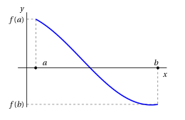
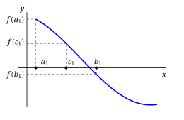
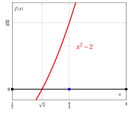
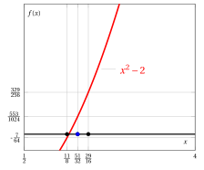
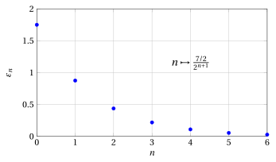

# Teorema degli zeri e metodo della bisezione

**Parte 3 · Limiti di funzioni e continuità · Capitolo 8** · dalle dispense di Fabio Furini · [:material-file-pdf-box: Dispensa del volume (PDF)](../pdf/dispensa-3-limiti.pdf)

## 1. Zeri di una funzione

!!! chiave ""

    Data una funzione $f$, siamo interessati alla risoluzione dell'equazione:

    \begin{equation}
    f(x) =0 \label{TTT}
    \end{equation}

    ovvero trovare gli <strong>zeri</strong> di $f$. Gli zeri sono le soluzioni dell'equazione \(\eqref{TTT}\), ovvero i punti $c$ del dominio della funzione in cui $f(c)=0$.

- Quando $f$ è un polinomio di grado $\le 4$ esistono formule che forniscono le soluzioni della \(\eqref{TTT}\). Se però $f$ è un polinomio di grado $> 4$ o una funzione più complicata, salvo casi particolarmente fortunati, non esistono formule per le soluzioni dell'equazione \(\eqref{TTT}\).

- Geometricamente, risolvere l'equazione \(\eqref{TTT}\) significa determinare le ascisse dei punti di intersezione tra il grafico di $y = f (x)$ e l'asse delle ascisse.  Possono esserci: <strong>infinite soluzioni</strong>, <strong>numero finito di soluzioni</strong>, <strong>nessuna soluzione</strong>.

!!! esempio "Esempio 1: Zeri di una funzione"

    Consideriamo la funzione $f$ col seguente grafico:

    { .fig .ovale loading=lazy style="width:85%" }

    l'equazione $f(x) = 0$ ha 3 soluzioni  nell'intervallo $[a,b]$, ossia la funzione $f$ ha 3 zeri, $x_1$, $x_2$ e $x_3$.

!!! teorema "Teorema 1: degli zeri (o di Bolzano)"

    Se  una funzione $f: [a,b] \rr \R$ è continua nell'intervallo $[a,b]$ e $f(a) \cdot f(b) < 0$,  allora esiste $c \in (a, b)$  tale che  $f(c) = 0$. Se $f$ è anche strettamente monotona allora lo zero $c$ è unico.

- L'idea della dimostrazione è di costruire due successioni che convergano allo zero della funzione. Per capire come costruirle,  consideriamo ad esempio una funzione  con $f(a)>0$ e $f(b) < 0$:

    { .fig .ovale loading=lazy style="width:70%" }

- Poniamo $a_0=a$ e $b_0=b$ e calcoliamo

    $$
    c_0 = \frac{a_0+b_0}{2}, {\rm ~~il~
    punto~medio~dell'intervallo~~} [a_0, b_0].
    $$

    Nell'esempio precedente abbiamo:

    { .fig .ovale loading=lazy style="width:70%" }

    Se $f(c_0)=0$ abbiamo trovato uno zero. Se $f(c_0) \neq 0$ guardiamo il segno di $f(a_0) \cdot f(c_0)$ e procediamo come segue:

    $$
    \begin{cases}
    {\rm se~~} f(a_0) \cdot f(c_0) <0 \\[2ex]
    {\rm se~~} f(a_0) \cdot f(c_0) >0 
    \end{cases} 
    ~~~~{\rm ~~creiamo~~} [a_1,b_1]~~~
    \begin{cases}
     {\rm~~con~~} a_1 =a_0, ~~b_1=c_0\\[2ex]
     {\rm~~con~~} a_1 =c_0, ~~b_1=b_0
    \end{cases}
    $$

    Nell'esempio precedente abbiamo $f(a_0) \cdot f(c_0) <0$, quindi abbiamo  $a_1 =a_0, ~~b_1=c_0$.

- Con $a_1$ e $b_1$, calcoliamo:

    $$
    c_1 = \frac{a_1+b_1}{2}, {\rm ~~il~
    punto~medio~dell'intervallo~~} [a_1, b_1].
    $$

    Nell'esempio precedente abbiamo:

    { .fig .ovale loading=lazy style="width:70%" }

    Se $f(c_1)=0$ abbiamo trovato uno zero. Se $f(c_1) \neq 0$ guardiamo il segno di $f(a_1) \cdot f(c_1)$ e procediamo come segue:

    $$
    \begin{cases}
    {\rm se~~} f(a_1) \cdot f(c_1) <0 \\[2ex]
    {\rm se~~} f(a_1) \cdot f(c_1) >0 
    \end{cases} 
    ~~~~{\rm ~~creiamo~~} [a_2,b_2]~~~
    \begin{cases}
     {\rm~~con~~} a_2 =a_1, ~~b_2=c_1\\[2ex]
     {\rm~~con~~} a_2 =c_1, ~~b_2=b_1
    \end{cases}
    $$

    Nell'esempio precedente abbiamo $f(a_1) \cdot f(c_1) >0$, quindi abbiamo  $a_2 =c_1, ~~b_2=b_1$.

- Generalizziamo ora questa idea nella prova del teorema.

??? dimostrazione "Dimostrazione"

    Consideriamo le seguenti due successioni definite per ricorrenza (in maniera ricorsiva):

    $$
    a_0 =a, \qquad  a_{n+1} = \begin{cases}
    a_n {\rm ~~se~~} f(a_n) \cdot f(c_n) <0 \\[2ex]
    c_n {\rm ~~se~~} f(a_n) \cdot f(c_n) >0 
    \end{cases}  \quad \forall n \in \N
    $$

    $$
    b_0 =b, \qquad  b_{n+1} = \begin{cases}
    c_n {\rm ~~se~~} f(a_n) \cdot f(c_n) <0 \\[2ex]
    b_n {\rm ~~se~~} f(a_n) \cdot f(c_n) >0 
    \end{cases}  \quad \forall n \in \N
    $$

    dove

    $$
    c_n = \frac{a_n+b_n}{2},\quad \forall n \in \N
    $$

    Le due successioni creano una sequenza di intervalli $[a_n,b_n]$ con le seguenti proprietà:

    1. Abbiamo $a_n \le a_{n+1},$ quindi la successione $\{a_n\}$ è crescente e, dato che $a_n \le b, \forall n,$ è  anche  limitata.  Abbiamo inoltre $b_n \ge b_{n+1},$ quindi la successione $\{b_n\}$ è decrescente e,   dato che $b_n \ge  a,\forall n,$ è anche limitata.

    2. $b_n - a_n = \frac{b-a}{2^n}$ $~~$ (ciascun intervallo è lungo la metà del precedente)

    3. $f(a_n)\cdot f(b_n) < 0$ $~~$ (per come sono stati scelti $a_n$ e $b_n$ a ogni passo)

    Per il punto 1), possiamo allora dedurre che le successioni $\{a_n\}$ e $\{b_n\}$ abbiano limite finito grazie al  teorema  di monotonia delle successioni. Quindi:

    $$
    a_n \rr \ell_1 \in \R {\rm ~~e~~} b_n \rr \ell_2 \in \R {\rm ~~ per ~~} n \rr \ip.
    $$

    Dal punto 2) deduciamo che:

    $$
    b_n - a_n = \frac{b - a}{2^n} \rr 0 {\rm ~~per~~} n \rr \ip,
    {\rm ~~~~e~perciò~~~~}
     \ell_2=\ell_1=\ell
    $$

    Per la continuità di $f$, abbiamo allora che:

    $$
    f(a_n) \cdot f(b_n) \rr \big(f(\ell)\big)^2 {\rm ~~~per~~~} n \rr \ip
    $$

    Mentre dal punto 3) e dal teorema della permanenza del segno deduciamo $\big(f(\ell)\big)^2 \le 0$. Deve perciò essere $f(\ell)=0$ e così $\ell$ è lo zero cercato,  ovvero $c=\ell$. □

- Abbiamo dimostrato:

    \begin{equation*}
    f: [a,b] \rr \R  {\rm ~~continua~in~~} [a,b] {\rm ~~e~~} f(a) \cdot f(b) < 0  ~~~\Rightarrow~~~ {\rm ~~esiste~} c \in [a,b]  {\rm ~~tale~che~} f(c)=0
    \end{equation*}

    quindi “$f: [a,b] \rr \R$  continua in $[a,b]$ e $f(a) \cdot f(b) < 0$” è condizione sufficiente a “esiste $c \in [a,b]$ tale che $f(c)=0$” e “esiste $c \in [a,b]$ tale che $f(c)=0$” è una condizione necessaria a “$f: [a,b] \rr \R$  continua in $[a,b]$ e $f(a) \cdot f(b) < 0$”. L'implicazione non funziona nell'altra direzione:

    \begin{equation*}
    {\rm ~~esiste~} c \in [a,b]  {\rm ~~tale~che~} f(c)=0 ~~~\nRightarrow~~~ f: [a,b] \rr \R  {\rm ~~continua~in~~} [a,b] {\rm ~~e~~} f(a) \cdot f(b) < 0
    \end{equation*}

    Basta ad esempio considerare $f(x)=x^2-2$ nell'intervallo $[-2,2]$. Abbiamo  $f(-2)=2$ e $f(2)=2$ quindi $f(a) \cdot f(b) \nless 0$ ma esistono gli zeri della funzione:

    { .fig .ovale loading=lazy style="width:52%" }

    Quindi il teorema fornisce condizioni <strong>sufficienti</strong> (ma non necessarie)  per l'esistenza di uno zero di una funzione.

- La prova del teorema è di tipo costruttivo, ovvero abbiamo costruito due successioni che tendono a uno zero della funzione   (<strong>prova costruttiva/<strong>algoritmo</strong></strong>). Questo algoritmo si chiama <strong>metodo della bisezione</strong>.

    !!! chiave ""

        Se in $[a, b]$ la funzione $f$ ha più zeri, il procedimento non indica quale di essi venga determinato.  Lo zero trovato dipende   dall'intervallo $[a,b]$ considerato in input e può richiedere infinite iterazioni per essere trovato. Interrompendo il procedimento però, come vedremo, abbiamo una stima dello zero e dell'errore commesso.

## 2. Metodo della bisezione

!!! esempio "Esempio 2: Metodo della bisezione"

    - Cerchiamo uno zero della funzione continua $f(x) = x^2 -2$ nell'intervallo $\left[\frac{1}{2},4\right]$, ovvero cerchiamo il valore di $\sqrt{2}$. Inizializzazione, con $n=0$ abbiamo:

        $$
        [a_0,b_0] = \left[\frac{1}{2},4\right], ~~~~f(a)=-\frac{7}{4}, ~~~~f(b)=14 ~~~~\Rightarrow~~~~ c_0=\frac{9}{4} {\rm~~e~~} f(c_0)=\frac{49}{16}
        $$

    { .fig .ovale loading=lazy style="width:53%" }

    - Iterazione $n=1$, abbiamo:

        $$
        [a_1,b_1] = \left[\frac{1}{2},\frac{9}{4}\right],~~~~f(a_1)=-\frac{7}{4}, ~~~~f(b_1)=\frac{49}{16}
        ~~~~\Rightarrow~~~~
        c_1=\frac{11}{8} {\rm~~e~~}  f(c_1)=-\frac{7}{64}
        $$

    { .fig .ovale loading=lazy style="width:53%" }

!!! esempio "Esempio 3: Metodo della bisezione"

    - Iterazione $n=2$, abbiamo:

        $$
        [a_2,b_2] = \left[\frac{11}{8},\frac{9}{4}\right], ~~~~f(a_2)=-\frac{7}{64}, ~~~~f(b_2)=\frac{49}{16}
         ~~~~\Rightarrow~~~~ c_2=\frac{29}{16} {\rm~~e~~} f(c_2)=\frac{329}{256}
        $$

    { .fig .ovale loading=lazy style="width:59%" }

    - Iterazione $n=3$, abbiamo:

        $$
        [a_3,b_3] = \left[\frac{11}{8},\frac{29}{16}\right],~~~~f(a_3)=-\frac{7}{64}, ~~~~f(b_3)=\frac{329}{256} ~~~~\Rightarrow~~~~
         c_3=\frac{51}{32} {\rm~~e~~}  f(c_3)=\frac{553}{1024}
        $$

    { .fig .ovale loading=lazy style="width:59%" }

!!! esempio "Esempio 4: Intervalli del metodo della bisezione"

    Facendo il grafico dei valori ottenuti nell'esercizio precedente abbiamo i seguenti intervalli e stime di $\sqrt{2}$:

    { .fig .ovale loading=lazy style="width:93%" }

### 2.1 Stima degli errori del metodo della bisezione

- All'iterazione $n$, abbiamo:

    $$
    c \in [a_n,b_n]
    $$

    ovvero lo zero si trova all'interno dell'intervallo $n$-esimo. Dato che arrestando il procedimento dopo $n$ passi, $a_n$ approssima lo zero per difetto e $b_n$ approssima lo zero per eccesso. Quindi:

    $$
    a_n \le c \le  b_n
    $$

- La stima del valore $c$ all'iterazione $n$ è:

    $$
    c_{n} = \frac{a_{n}+b_{n}}{2}
    $$

    ovvero il punto medio dell'intervallo $[a_n,b_n]$.

- L'errore assoluto $\varepsilon_n$ commesso all'iterazione $n$ è:

    $$
    \varepsilon_n = |c_{n} - c|
    $$

    !!! chiave ""

        Il valore di $c$ è ignoto quindi ci serve un modo per analizzare i valori degli errori che sia indipendente da $c$.

- Possiamo stimare l'errore all'iterazione $n$ come segue:

    $$
    \varepsilon_n = |c_{n} - c| \le \frac{b-a}{2^n}
    $$

    questo deriva da:

    - la lunghezza dell'intervallo all'iterazione $n$ è $\frac{b-a}{2^n}$

    - il punto medio di questo intervallo è $c_{n}$  e $c$ si trova all'interno dell'intervallo stesso

    - la distanza di un qualsiasi punto $c$ dal centro dell'intervallo è minore o uguale  alla lunghezza dell'intervallo stesso

    !!! chiave ""

        Se $n \rr \ip$ allora  $\varepsilon_n \rr 0$, ovvero l'errore tende a zero se $n$ tende all'infinito.

- All'iterazione $n$, possiamo  migliorare la stima dell'errore come segue:

    $$
    \varepsilon_n = |c_{n} - c|   \le \frac{1}{2} \frac{b-a}{2^n} = \frac{b-a}{2^{n+1}}
    $$

    ovvero metà della lunghezza dell'intervallo $[a_n,b_n]$,  dato che $c \in (a_n,c_n)$ oppure $c \in (c_n,b_n)$.

    

    !!! esempio "Esempio 5: Stima degli errori del metodo della bisezione ($\sqrt{2}=1.414213562\dots$)"

        Riprendiamo l'esercizio precedente con $b-a=\frac{7}{2}$, nelle prime 6 iterazioni abbiamo:

        
<table>
        <tr>
        <td>iterazione</td>
        <td>\(a_n\)</td>
        <td>\(c_n\)</td>
        <td>\(b_n\)</td>
        <td>stima di \(\sqrt{2}\)</td>
        <td>\(\varepsilon_n\)</td>
        </tr>
        <tr>
        <td>\(n=0\)</td>
        <td>\(\frac{1}{2}\)</td>
        <td>\(\frac{9}{4}\)</td>
        <td>\(4\)</td>
        <td>\(2.25\)</td>
        <td>\(\le \frac{7/2}{2^1}=\)</td>
        <td>1.75</td>
        </tr>
        <tr>
        <td>\(n=1\)</td>
        <td>\(\frac{1}{2}\)</td>
        <td>\(\frac{11}{8}\)</td>
        <td>\(\frac{9}{4}\)</td>
        <td>\(1.375\)</td>
        <td>\(\le\frac{7/2}{2^2}=\)</td>
        <td>0.875</td>
        </tr>
        <tr>
        <td>\(n=2\)</td>
        <td>\(\frac{11}{8}\)</td>
        <td>\(\frac{29}{16}\)</td>
        <td>\(\frac{9}{4}\)</td>
        <td>\(1.8125\)</td>
        <td>\(\le \frac{7/2}{2^3}=\)</td>
        <td>0.4375</td>
        </tr>
        <tr>
        <td>\(n=3\)</td>
        <td>\(\frac{11}{8}\)</td>
        <td>\(\frac{51}{32}\)</td>
        <td>\(\frac{29}{16}\)</td>
        <td>\(1.59375\)</td>
        <td>\(\le \frac{7/2}{2^4}=\)</td>
        <td>0.21875</td>
        </tr>
        <tr>
        <td>\(n=4\)</td>
        <td>\(\frac{11}{8}\)</td>
        <td>\(\frac{95}{64}\)</td>
        <td>\(\frac{51}{32}\)</td>
        <td>\(1.484375\)</td>
        <td>\(\le \frac{7/2}{2^5}=\)</td>
        <td>0.109375</td>
        </tr>
        <tr>
        <td>\(n=5\)</td>
        <td>\(\frac{11}{8}\)</td>
        <td>\(\frac{183}{128}\)</td>
        <td>\(\frac{95}{64}\)</td>
        <td>\(1.4296875\)</td>
        <td>\(\le \frac{7/2}{2^6}=\)</td>
        <td>0.0546875</td>
        </tr>
        </table>

        { .fig .ovale loading=lazy style="width:60%" }

- Al fine di garantire che l'errore commesso non superi una data tolleranza $\delta$, ovvero imporre $\varepsilon_n \le \delta$, occorre eseguire  $n(\delta)$ iterazioni dove  $n(\delta)$ è il più piccolo  intero che soddisfa la disuguaglianza:

    $$
    n(\delta) > \log_2 \left( \frac{b-a}{\delta}\right) -1
    $$

    ottenuta ricavando $n(\delta)$ dalla stima dell'errore massimo:

    $$
    \delta = \frac{b-a}{2^{(n(\delta)+1)}}
    $$

    quindi

    $$
    2^{(n(\delta)+1)}  = \frac{b-a}{\delta} {\rm ~~~~e~~~~}  n(\delta)+1 = \log_2 \left( \frac{b-a}{\delta}\right)
    $$

    Chiaramente se $\delta \rr 0$ allora  $n(\delta) \rr \ip$, e più la tolleranza sull'errore  è piccola maggiore è il numero di iterazioni per garantirla.

- Se volessimo ridurre la tolleranza  di una cifra decimale,  ossia passare da $\delta$ a $\frac{\delta}{10}$ avremmo:

    $$
    n(\delta) \approx \log_2 \left( \frac{b-a}{\delta}\right) -1 {\rm ~~~~~~e~~~~~~ } n \left(\frac{\delta}{10} \right) \approx \log_2 \left( \frac{b-a}{\frac{\delta}{10}}\right) -1
    $$

    dato che

    $$
    \log_2 \left( \frac{b-a}{\frac{\delta}{10}}\right) -1 
    = 
    \log_2 \left( \frac{b-a}{\delta} \cdot 10 \right) -1
    =
    \underbrace{\log_2 \left( \frac{b-a}{\delta} \right) -1}_{\approx n(\delta)} + \log_2 10
    $$

    il numero di iterazioni aggiuntive è indipendente dall'intervallo $[a,b]$, ed è uguale a

    $$
    \log_{2}10 \approx 3,32
    $$

!!! chiave ""

    Servono in media più di tre bisezioni per migliorare di una cifra significativa l'accuratezza della stima,   <strong>la convergenza è quindi lenta</strong>.

!!! esempio "Esempio 6: Metodo della bisezione (stima degli errori)"

    Sempre per l'esempio precedente:

    - nel caso si volesse una tolleranza (errore massimo) $\delta=0.00001 = 10^{-5}$:

        $$
        n\left(10^{-5}\right)>   \log_2 \left( \frac{7/2}{10^{-5}}\right) -1 = 17.416\dots \quad {\rm ~~quindi~~} n\left(10^{-5}\right)=18
        $$

    - nel caso si volesse una tolleranza (errore massimo) $\delta=0.000001=10^{-6}$:

        $$
        n\left(10^{-6}\right)>   \log_2 \left( \frac{7/2}{10^{-6}}\right) -1 = 20.738\dots \quad {\rm ~~quindi~~} n\left(10^{-6}\right)=21
        $$

!!! chiave ""

    Vogliamo ora capire con che “velocità” decresca l'errore comparando gli errori  di due iterazioni consecutive.  Questa stima ci fornisce delle informazioni sulla qualità dell'algoritmo, ovvero vogliamo determinare la  <strong>“velocità di convergenza”</strong> dell'algoritmo.

- Consideriamo l'errore massimo, che denotiamo $\varepsilon^*_n$ abbiamo:

    $$
    \varepsilon^*_n= \frac{b-a}{2^{n+1}} {\rm ~~~~~~e~~~~~~} \varepsilon_n \le \varepsilon^*_n
    $$

    quindi

    $$
    \frac{\varepsilon^*_{n+1}}{\varepsilon^*_{n}} = \frac{1}{2} {\rm ~~~~dato ~che~~~~} \frac{\frac{b-a}{2^{n+2}}}{\frac{b-a}{2^{n+1}}} = \frac{1}{2}
    $$

    ovvero l'errore massimo a ogni iterazione si dimezza. Di conseguenza abbiamo:

    $$
    \underbrace{\varepsilon^*_{n+1}}_{\ge \varepsilon_{n+1}} = \frac{1}{2} \; \underbrace{\varepsilon^*_{n}}_{\ge \varepsilon_{n}}
    $$

    !!! chiave ""

        L'errore assoluto massimo del metodo della bisezione ad ogni passo è proporzionale all'errore assoluto massimo nel passaggio precedente.  <strong> La velocità di convergenza è lineare.</strong>

- Abbiamo per ogni terna $c_{n+1},c_{n}$ e $c_{n-1}$, con $n\ge 1$, il seguente legame:

    \begin{equation}
    c_{n+1} = \frac{c_{n-1}+c_{n}}{2}
    \label{BBBB}
    \end{equation}

    ovvero la stima $c_{n+1}$ è il punto medio dell'intervallo che ha come estremi $c_{n-1}$ e $c_{n}$. Scriviamo ora:

    $$
    c_{n+1}= c + \varepsilon_{n+1},~~~c_{n}= c + \varepsilon_{n},~~~c_{n-1}= c + \varepsilon_{n-1}
    $$

    ora sostituendo nell'equazione \(\eqref{BBBB}\) otteniamo:

    \begin{align*}
    c + \varepsilon_{n+1} &= \frac{c + \varepsilon_{n}+c + \varepsilon_{n-1}}{2} = \frac{2\;c + \varepsilon_{n}+ \varepsilon_{n-1}}{2}\\[2ex]
    &= c + \frac{\varepsilon_{n}+ \varepsilon_{n-1}}{2}
    \end{align*}

    quindi

    $$
    \varepsilon_{n+1} = \frac{\varepsilon_{n}+ \varepsilon_{n-1}}{2} = \frac{1}{2} \varepsilon_{n} \; \left( \frac{\varepsilon_{n-1}}{\varepsilon_{n}}+1\right)
    $$

    Il termine $\varepsilon_{n-1} / \varepsilon_{n}$, ovvero il rapporto fra gli errori di due iterazioni consecutive, può essere un numero piccolo o grande a piacere (l'errore a ogni iterazione può infatti crescere o decrescere).

<strong>Prova tu</strong> — il grafico interattivo qui sotto ti fa vedere quello che hai appena letto: muovi i cursori.

