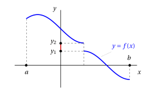

# Teorema di Weierstrass e teorema dei valori intermedi

**Parte 3 · Limiti di funzioni e continuità · Capitolo 9** · dalle dispense di Fabio Furini · [:material-file-pdf-box: PDF del capitolo](../pdf/limiti-09-weierstrass.pdf)

## 1. Teorema di Weierstrass

- Il  seguente teorema stabilisce condizioni <strong>sufficienti  ma non necessarie</strong>  affinché una funzione abbia massimo e minimo.

!!! teorema "Teorema 1: di Weierstrass"

    Se  una funzione $f: [a,b] \rr \R$ è continua nell'intervallo $[a,b]$  allora  ha massimo $M$ e minimo $m$ in $[a,b]$.

!!! chiave ""

    Sotto le ipotesi del teorema esistono:

    $$
    x_m {\rm ~~e~~} x_M \in [a, b] {\rm ~~~~tali~che~~~~}
    f(x_m) \le f(x) \le f(x_M) {\rm ~~~per~ogni~~~} x \in [a, b]
    $$

    Si dice che $x_m$ è <strong>punto di minimo</strong> per $f$ e $m = f (x_m)$ è il <strong>minimo</strong> di $f$.

    Si dice che $x_M$ è <strong>punto di massimo</strong> per $f$ e $M = f (x_M)$ è il <strong>massimo</strong> di $f$.

    { .fig .ovale loading=lazy style="width:85%" }

<strong>Proprietà dell'estremo superiore/inferiore</strong>

- Dati due sottoinsiemi $E_1$, $E_2$ non vuoti  di $\R$ abbiamo:

    $$
    \sup \big(E_1 \cup E_2 \big) = \max \big(\sup E_1, \sup E_2 \big)
    $$

    Questa proprietà è vera per insiemi sia limitati che illimitati.  Se uno o entrambi gli insiemi sono superiormente illimitati abbiamo: $\sup (E_1 \cup E_2) = \ip$. Per l'estremo inferiore abbiamo:

    $$
    \inf \big(E_1 \cup E_2 \big) = \min \big(\inf E_1, \inf E_2 \big)
    $$

??? dimostrazione "Dimostrazione"

    Proveremo che $f$ ammetta massimo in $[a, b]$. Consideriamo la funzione:

    $$
    f : [a, b] \rr \R, {\rm ~~~e~poniamo~~~~}
     \ell = \sup_{[a,b]} f
    $$

    Si tratta ora di dimostrare che:

    - **$i)$** $\ell$ assuma valore finito, ovvero $\ell \in \R$;

    - **$ii)$** $\ell$ sia uguale a $f(x_0)$ per un qualche $x_0\in [a,b]$ (e quindi $\ell$ è il massimo e $x_0$ è il punto di massimo).

    Suddividiamo l'intervallo $[a, b]$ in due intervalli uguali: $I_{1}$ e $I_{2}$; per le proprietà dell'estremo superiore abbiamo:

    $$
    \sup_{[a,b]} f 
    = \max \bigg( \sup_{I_{1}} f, \sup_{I_{2}} f \bigg) {\rm ~~~ovvero~~~} \sup_{[a,b]} f = \sup_{I_{1}} f  {\rm ~~~oppure~~~}  \sup_{[a,b]} f = \sup_{I_{2}} f
    $$

    Quindi per uno dei due intervalli, che chiamiamo $[a_1, b_1]$, sarà vero che:

    $$
    \ell = \sup_{[a_1,b_1]} f
    $$

    Suddividiamo ora $[a_1 , b_1]$ in due intervalli uguali; per uno di questi, che chiamiamo $[a_2, b_2]$, sarà vero che:

    $$
    \ell = \sup_{[a_2,b_2]} f
    $$

    Procedendo per dicotomia, così facendo, costruiamo una successione di intervalli $[a_n, b_n]$, ciascuno contenuto nei precedenti, con le proprietà:

    1. la successione $\{a_n\}$ è monotona crescente e limitata e la successione $\{b_n\}$ monotona decrescente e limitata;

    2. $b_n - a_n = \frac{b-a}{2^n} \rr 0 {\rm~~per~~} n \rr \ip;$

    3. $\displaystyle \ell = \sup_{[a_n,b_n]} f$ ( l'estremo superiore di $f$ si trova nell'intervallo $[a_n,b_n]$)

    Per lo stesso ragionamento fatto nella dimostrazione del teorema  degli zeri (che utilizza il teorema  di monotonia delle  successioni), dai punti 1) e 2) segue che le successioni $\{a_n\}$ e $\{b_n\}$ convergono ad uno stesso limite $x_0 \in [a, b]$:

    $$
    a_n \rr x_0 {\rm ~~e~~} b_n \rr x_0 {\rm ~~per~~} n \rr \ip.
    $$

    Procediamo ora per casi. □

??? dimostrazione "Dimostrazione"

    Caso 1: $\ell \in \R$

    Se $\ell \in \R$, per ogni $n$ esiste un punto $t_n \in [a_n, b_n]$ tale che:

    \begin{equation}
    \label{RRRR}
    \ell - \frac{1}{n} < f(t_n) \le \ell
    \end{equation}

    Infatti,  poiché $\ell - \frac{1}{n}$ è minore di $\ell$ che è il minimo dei maggioranti dei valori di $f(x)$ in $[a_n, b_n]$, $\ell - \frac{1}{n}$ non è un maggiorante, quindi esiste $t_n \in  [a_n, b_n]$ con la proprietà \(\eqref{RRRR}\).

    Poiché $t_n \in  [a_n, b_n]$, e abbiamo:

    $$
    a_n \rr x_0 {\rm ~~e~~} b_n \rr x_0 {\rm ~~per~~} n \rr \ip {\rm ~~~allora~~~}t_n \rr  x_0 {\rm ~~per~~} n \rr \ip
    $$

    per il teorema del confronto. Ancora per il teorema del confronto, la \(\eqref{RRRR}\) dà allora

    $$
    \lim_{n \rr \ip} f(t_n) = \ell
    $$

    D'altro canto, poiché $f$ è continua e $t_n \rr x_0$  si ha che:

    $$
    \lim_{n \rr \ip} f(t_n) = f(x_0) {\rm ~~~~perciò~~~~} f(x_0) = \ell.
    $$

    Allora, poiché $\ell$ è il $\sup$ dei valori di $f$ in $[a, b]$,  $\ell$ è il <strong>massimo</strong> di $f$ in  $[a, b]$, ed è assunto nel punto $x_0$, <strong>punto di massimo</strong>. In questo caso perciò il teorema è dimostrato.

    Caso 2: $\ell = \ip$

    Se $\ell = \ip$, per ogni $n$ esiste un punto $t_n \in [a_n,b_n]$ tale che:

    \begin{equation}
    \label{RRRRR}
    f (t_n) \ge n
    \end{equation}

    Ragionando come sopra si prova che $t_n \rr  x_0$ per un certo $x_0 \in [a, b]$. Poiché $f$ è continua in $x_0$:

    $$
    \lim_{n \rr \ip} f(t_n) = f (x_0)
    $$

    ma per la \(\eqref{RRRRR}\) abbiamo

    $$
    \lim_{n \rr \ip} f(t_n) = \ip
    $$

    che è un <strong>assurdo</strong> dato che in $x_0$ la funzione deve avere un valore finito. Quindi questo caso non si può verificare.

    Analogamente si prova che la funzione ammetta minimo in $[a, b]$. □

!!! chiave ""

    La dimostrazione è  una prova di esistenza costruttiva (simile a quella del teorema degli zeri) che però non può essere utilizzata in maniera algoritmica dato che, dopo ogni bisezione, non è noto a priori l'intervallo a cui è associato l'estremo superiore o inferiore.

<strong>Le ipotesi del teorema di Weierstrass sono tutte essenziali</strong>

1. L'intervallo deve essere chiuso

    !!! chiave ""

        Consideriamo come controesempio:

        $$
        f(x) = x {\rm ~~con~~} x \in (0,1)
        $$

        La funzione è continua su un intervallo limitato,  ma non chiuso. In questo caso,  la funzione non ha né massimo né minimo (il suo estremo superiore, $1$, e il suo estremo inferiore, $0$; e non sono assunti dalla funzione).

2. L'intervallo deve essere limitato

    !!! chiave ""

        Consideriamo come controesempio:

        $$
        f(x) = x {\rm ~~con~~} x \in \R
        $$

        La funzione è continua su un intervallo non limitato ma  non ha né massimo né minimo (non è nemmeno limitata).

3. La funzione deve essere continua

    !!! chiave ""

        Consideriamo come controesempio:

        $$
        f(x) = 
        \begin{cases}
        x & {\rm ~~per~~} x \in (0,1)\\
        \frac{1}{2} & {\rm ~~per~~} x=0 {\rm ~~e~~} x=1
        \end{cases}
        $$

        La funzione è definita su un intervallo chiuso e limitato $[0, 1]$  ma non è continua. La funzione non ha né massimo né minimo (il suo estremo superiore, $1$, e il suo estremo inferiore, $0$; e non sono assunti dalla funzione).

## 2. Teorema dei valori intermedi

!!! teorema "Teorema 2: dei valori intermedi"

    Se una funzione $f: [a,b] \rr \R$ è continua in $[a,b]$, allora ha massimo $M$ e minimo $m$ in $[a,b]$ e assume tutti i valori compresi fra  $m$ e $M$.

!!! chiave ""

    Siamo sotto le ipotesi del teorema di Weierstrass quindi abbiamo:

    $$
    x_m {\rm ~~e~~} x_M \in [a, b] {\rm ~~~~tali~che~~~~}
    f(x_m) \le f(x) \le f(x_M) {\rm ~~~per~ogni~~~} x \in [a, b]
    $$

    Il teorema dei valori intermedi ci dice inoltre che:

    $$
    \forall \lambda \in (m,M), {\rm ~~~esiste~~~} x(\lambda) \in [x_m,x_M] {\rm ~~tale~che~~} f\big(x(\lambda)\big) = \lambda
    $$

    Questa proprietà prende il nome di <strong>proprietà dei valori intermedi</strong>.

??? dimostrazione "Dimostrazione"

    Dal teorema di Weierstrass abbiamo punto di massimo $x_{M}$ e  punto di minimo $x_m$ tali che $f(x_M)=M$ (massimo) e $f(x_m)=m$ (minimo) in $[a,b]$. Sia

    $$
    m  < \lambda < M
    $$

    e consideriamo la funzione

    $$
    g(x) = f(x) - \lambda {\rm ~~con~~} x \in [x_m,x_M]
    $$

    che è continua dato che $f(x)$ è continua in $[a,b]$ e $x_m, x_M \in [a,b]$.

    Quindi:

    $$
    g(x_M) = f(x_M) -\lambda = M -\lambda >0
    $$

    $$
    g(x_m) = f (x_m) -\lambda = m -\lambda < 0
    $$

    Allora, dal teorema degli zeri, esiste $x(\lambda) \in (x_m,x_M)$ tale  che:

    $$
    g\big(x(\lambda)\big) = 0 {\rm ~~~~e~cioè~~~~} f\big(x(\lambda)\big) = \lambda
    $$

    
□

- Presa una funzione continua in un intervallo $[a,b]$ abbiamo graficamente:

{ .fig .ovale loading=lazy style="width:85%" }

!!! esempio "Esempio 1: Funzione discontinua e assenza della proprietà dei
valori intermedi"

    Consideriamo ad esempio il grafico della seguente funzione discontinua in $[a,b]$:

    { .fig .ovale loading=lazy style="width:85%" }

    Questa funzione non ha la proprietà dei valori intermedi ovvero i valori $\lambda \in (y_1,y_2)$ non sono uscite di $f$.

- Le proprietà dei due teoremi precedenti si possono sintetizzare nell'unico enunciato seguente:

!!! teorema "Corollario 1"

    Se $f: [a, b] \rr \R$ è continua, allora

    $$
    f([a, b]) = [m, M];
    $$

    cioè l'immagine di un intervallo $[a, b]$ è l'intervallo di estremi:

    $$
    \displaystyle m = \min_{[a,b]} f {\rm ~~~e~~} M = \max_{[a,b]} f.
    $$

??? dimostrazione "Dimostrazione"

    Derivato dal teorema di Weierstrass e dal teorema dei valori intermedi. □

!!! esempio "Esempio 2: non validità del teorema dei valori intermedi in $\Q$"

    - Sia

        $$
        f(x) = x^2
        $$

        e consideriamo $f$ come funzione definita dall'insieme $\Q$ dei razionali a $\Q$ stesso (questo è lecito perché il quadrato di un razionale è un razionale).

    - Allora f non ha la proprietà dei valori intermedi.

    - Infatti, ad esempio,

        $$
        f (1) = 1, f(2) = 4,
        $$

        ma $f$ non assume tutti i valori razionali compresi tra 1 e 4: per esempio non assume mai il valore 2, o 3.

    - In altre parole, la proprietà dei valori intermedi è vera per le funzioni continue <strong>grazie alle proprietà dell'insieme dei numeri reali</strong>.

    - Questo è un ulteriore motivo  per cui è utile avere come ambiente di lavoro l'insieme dei reali e non l'insieme dei razionali.

## 3. Teorema di esistenza della radice $n$-esima

!!! teorema "Teorema 3"

    Per ogni $y \in \R$, $y > 0$ e $n \in \N$, $n \ge 1$, esiste uno e un solo $x \in \R, x >0$, tale che $x^n = y$.

!!! chiave ""

    Questo numero $x$ si definisce radice $n$-esima di $y$

??? dimostrazione "Dimostrazione"

    Consideriamo la funzione $f (x) = x^n$. 

    Questa funzione è continua su tutto $\R$, perché è il prodotto di $n$ funzioni continue $g (x) = x$.

    Mostriamo che esistono

    $$
    x_2 > x_1 > 0 {\rm ~~tali~che~~} x_1^n < y < x_2^n.
    $$

    Se $y=1$ la radice ennesima esiste ed è unica, inoltre:

    1. Se $y > 1$:  basta scegliere

        $$
        x_1 = 1, x_2 = y {\rm ~~e~si~ha~~} x_1^n < y < x_2^n ~~~(1 < y < y^n)
        $$

    2. Se $y < 1$:  basta scegliere

        $$
        x_1 = y, x_2 = 1 {\rm ~~e~si~ha~~} x_1^n < y < x_2^n ~~~(y^n< y < 1 )
        $$

    Allora possiamo applicare il teorema dei valori intermedi alla funzione continua $f(x) = x^n$ sull'intervallo $[x_1, x_2]$. Dove il suo minimo è $x_1^n$ e il suo massimo è $x_2^n$.

    Poiché:

    $$
    x_1^n < y < x_2^n, {\rm ~~esiste~~} x_0 \in [x_1,x_2] {\rm ~~tale~che~~} x_0^n = y.
    $$

    L'unicità deriva dal fatto che la funzione  è strettamente crescente. □
