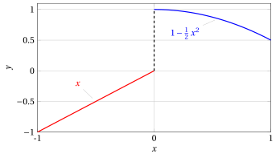

# Funzioni monotone su un intervallo e invertibilità

**Parte 3 · Limiti di funzioni e continuità · Capitolo 10** · dalle dispense di Fabio Furini e Valerio Dose · [:material-file-pdf-box: PDF del capitolo](../pdf/limiti-10-monotone-invertibili.pdf)

## 1. Funzioni monotone su un intervallo

- Ci occupiamo ora di funzioni monotone su un intervallo (e <strong>non necessariamente continue</strong>) e il prossimo teorema  (basato sull'assioma di continuità di $\R$) si può vedere come una estensione alle funzioni del teorema di monotonia per le successioni.

!!! teorema "Teorema 1: di monotonia delle funzioni"

    Sia $f : (a, b) \rr \R$ una funzione monotona. Allora per ogni $c \in  (a, b)$ esistono finiti i limiti destro e sinistro, per $x \rr c$; ai due estremi $a$, $b$ esistono i limiti destro (in $a$) e sinistro (in $b$), eventualmente infiniti.

??? dimostrazione "Dimostrazione"

    Supponiamo $f$ crescente in $(a, b)$ e sia $c \in (a , b)$, ovvero un punto all'interno dell'intervallo.

    Dimostriamo  che esiste finito

    $$
    \lim_{x \rr c^-} f(x) = \sup \big\{ f(x): x \in (a,c) \big\}.
    $$

    Poniamo

    $$
    \ell = \sup \big\{ f(x): x \in (a,c) \big\}
    $$

    Notiamo che $\ell$ esiste finito per la proprietà dell'estremo superiore, in quanto $f(c)$ è un maggiorante dell'insieme $\{ f(x): x \in (a,c) \}$.

    Quindi occorre provare che

    $$
    \lim_{x \rr c^-} f(x) = \ell
    $$

    Sia dunque $\{x_n\}$ una qualsiasi successione in $(a, c)$ tale che $x_n \rr c$, e proviamo che $f(x_n) \rr  \ell$, ossia che per ogni $\varepsilon > 0$ risulta definitivamente

    $$
    \ell - \varepsilon < f(x_n) < \ell + \varepsilon.
    $$

    La seconda disuguaglianza è ovvia in quanto $f (x_n) \le \ell$ per definizione di $\ell$, perché $x_n \in (a, c)$. □

??? dimostrazione "Dimostrazione"

    Per provare la prima, osserviamo che essendo $\ell - \varepsilon$  minore di $\ell$, cioè del minimo maggiorante di $\{ f(x): x \in (a,c) \}$, non è un maggiorante di tale insieme, perciò esiste un punto

    $$
    \tilde{x} \in (a,c) {\rm ~~tale~che~~} f(\tilde{x}) >  \ell - \varepsilon
    $$

    Poiché $f$ è crescente, ne segue che

    $$
    f(x) >  \ell - \varepsilon, \forall x \in (\tilde{x},c)
    $$

    D'altro canto per ipotesi

    $$
    x_n < c, \forall n {\rm ~~e~~} x_n \rr c {\rm ~~per~~} n \rr \ip
    $$

    perciò $x_n \in (\tilde{x}, c)$ definitivamente. Quindi

    $$
    f(x_n) \ge \ell - \varepsilon \quad ({\rm definitivamente})
    $$

    che è quanto occorreva provare.

    Analogamente si può dimostrare che esiste finito

    $$
    \lim_{x \rr c^+} f(x) = \inf \big\{ f(x): x \in (c,b) \big\} .
    $$

    Per quanto riguarda i limiti ai due estremi dell'intervallo, proviamo che esiste

    $$
    \lim_{x \rr b^-} f(x)
    $$

    Poniamo (come prima)

    $$
    \ell = \sup \big\{ f(x): x \in (a,b) \big\}
    $$

    tuttavia in questo caso $\ell$ potrebbe anche essere $\ip$ (non possiamo affermare che $f(b)$ sia un maggiorante dell'insieme, perché in $b$ la funzione non è definita). Procediamo quindi per casi.

    Nel caso in cui $\ell < \infty$ si può ripetere la dimostrazione precedente. □

??? dimostrazione "Dimostrazione"

    Se invece $\ell = \infty$, il ragionamento si modifica. Dall'ipotesi

    $$
    \sup \big\{ f(x): x \in (a,b) \big\} = \ip
    $$

    segue che per ogni $M > 0$ esiste $\tilde{x} \in (a, b)$ tale che $f(\tilde{x}) > M$.

    Per la monotonia di $f$ allora

    $$
    f(x) > M,~~~~ \forall x \in (\tilde{x},b)
    $$

    quindi presa una qualunque successione $x_n \rr b$ si ha che $x_n \in (\tilde{x},b)$, definitivamente, e quindi

    $$
    f(x_n) > M, \quad {\rm definitivamente},
    $$

    perciò

    $$
    \lim_{n \rr \ip} f(x_n) = \ip
    $$

    Allo stesso modo si  prova che esiste:

    $$
    \lim_{x \rr a^+} f(x)
    $$

    
□

!!! chiave ""

    Una conseguenza del teorema di monotonia è che se una funzione è monotona in un intervallo $(a, b)$, i suoi eventuali punti di discontinuità in $(a, b)$ sono necessariamente discontinuità a salto, ad eccezione degli estremi $a$, $b$, in cui può aversi anche un asintoto verticale.

## 2. Continuità e invertibilità

- Abbiamo visto il teorema che dice che se una  generica funzione di dominio $D$ è strettamente monotona allora è  invertibile.

- Sappiamo anche che il viceversa non è vero in generale: esistono funzioni invertibili su un intervallo, e non monotone.

!!! esempio "Esempio 1: Funzione invertibile ma non monotona"

    Consideriamo ad esempio

    $$
    f(x)=
    \begin{cases}
    1- \frac{1}{2} \: x^2 & {\rm if~~} 0 < x \le 1,\\
    x & {\rm if~~} x \le 0
    \end{cases}
    $$

    il suo grafico è:

    { .fig .ovale loading=lazy style="width:80%" }

    Questa funzione rispetta la  condizione di invertibilità che richiede che il grafico di $f$ sia intersecato al massimo in un punto da ogni retta parallela all'asse delle ascisse, ma non è monotona.

- Se aggiungiamo l'ipotesi della continuità e il dominio uguale a un  intervallo, essere strettamente monotona diventa  condizione necessaria e sufficiente per  l'invertibilità come  enunciato dal seguente teorema.

!!! teorema "Teorema 2: di invertibilità di funzioni monotone e continue"

    Sia $f : I \rr \R$ una funzione  definita su un intervallo $I$.

    Se la funzione $f$ è continua allora è invertibile nell'intervallo  $I$ se e solo se è strettamente monotona.

    In tal caso la sua funzione inversa è ancora strettamente monotona e continua.

??? dimostrazione "Dimostrazione"

    Sappiamo già che se $f$ è strettamente monotona è invertibile (indipendentemente dalle ipotesi che $f$ sia continua, e che sia definita su un intervallo). 

    Mostriamo che vale il viceversa, ossia che se è continua e invertibile, allora è strettamente monotona.

    Supponiamo per assurdo che la funzione non sia strettamente monotona, allora esistono tre punti:

    $$
    x_1 < x_2 < x_3 ~~({\rm nell'intervallo~~} I)
    $$

    tali che

    $$
    f(x_1) < f(x_2) {\rm ~~e~~} f(x_2) > f(x_3)
    $$

    oppure tali che

    $$
    f(x_1) > f(x_2) {\rm ~~e~~} f(x_2) < f(x_3).
    $$

    Supponiamo che valga la prima delle due alternative (nell'altro caso si ragionerà analogamente). Confrontiamo i valori di $f(x_1)$ e $f(x_3)$; non possono essere uguali perché $f$ per ipotesi è invertibile, dunque

    $$
    f(x_1) < f(x_3) {\rm ~~oppure~~} f(x_1) > f(x_3).
    $$

    Di nuovo, supponiamo che valga la prima delle due alternative (nell'altro caso si ragionerà analogamente). Dunque sappiamo che :

    $$
    x_1 < x_2 < x_3 {\rm ~~e~~} f(x_1) < f(x_3) < f(x_2).
    $$

    Poiché $f$ è continua, per il teorema dei valori intermedi esiste

    $$
    x_0 \in (x_1,x_2) {\rm ~~tale~che~~} f(x_0) = f(x_3).
    $$

    Poiché $x_0 \neq x_3$ (perché $x_1 < x_2 < x_3$), ne segue che $f$ non può essere invertibile, <strong>assurdo</strong>. Questo dimostra la prima parte del teorema.

    Sia ora $f$ una funzione continua, strettamente monotona e quindi invertibile in $I$, e sia $g$ la sua funzione inversa, ancora strettamente monotona e invertibile. Proviamo che $g$ è continua.

    - Per quanto osservato dopo il teorema di monotonia, la funzione $g$, strettamente monotona, o è continua, oppure ha dei punti di discontinuità a salto.

    - In tal caso l'immagine di $g$ non è un intervallo (ma è l'unione di almeno due intervalli disgiunti), il che è <strong>assurdo</strong> perché tale immagine è $I$. Dunque $g$ è continua.

    
□

- Si noti che nella dimostrazione del teorema precedente si sono utilizzati sia il teorema dei valori intermedi, sia il teorema di monotonia per le funzioni. Abbiamo inoltre fatto implicitamente uso dell'assioma di continuità di $\R$.

- Il teorema appena dimostrato significa in particolare che:

    !!! chiave ""

        una funzione continua e invertibile su un intervallo, ha come funzione inversa una funzione continua.

- Questo fatto completa la dimostrazione del teorema di continuità delle funzioni elementari:

    1. la continuità della funzione $a^x$ implica la continuità della funzione $\log_a x.$

    2. la continuità delle funzioni $\sin x$, $\cos x$ e $\tan x$ implica la continuità delle funzioni $\arcsin x$, $\arccos x$ e $\arctan x.$
