# Insiemi

**Parte 1 · Numeri e logica · Capitolo 1** · dalle dispense di Fabio Furini · [:material-file-pdf-box: Dispensa del volume (PDF)](../pdf/dispensa-1-numeri.pdf) · [:material-presentation: Slide (PDF)](../pdf/slide-numeri-01-insiemi.pdf)

## 1. Introduzione informale alla teoria degli insiemi

- La teoria degli insiemi si basa sui seguenti tre concetti chiave:

    1. <strong>Insiemi</strong>

        La nozione di insieme è generalmente assunta come <strong>primitiva</strong> (cioè non riducibile a concetti più elementari). Si usano come sinonimi di insieme le parole: <em>collezione</em>, <em>classe</em>, <em>aggregato</em>, <em>famiglia</em>.

        

        !!! esempio "Esempio 1: insiemi"

            Ad esempio abbiamo l'insieme dei punti di un piano, l'insieme degli studenti di una università o l'insieme delle stelle di una galassia.

    2. <strong>Elementi</strong>

        Un insieme è determinato dai suoi <em>elementi</em>, nel senso che un insieme è definito quando abbiamo un <strong>criterio</strong> con cui stabilire se un dato elemento è o non è elemento di questo insieme. 

        Esistono insiemi con un <em>numero finito di elementi</em> (ad esempio l'insieme degli studenti di una università ) o con un <em>numero infinito di elementi</em> (ad esempio l'insieme dei punti del piano).

        !!! chiave ""

            Per indicare gli insiemi si usano solitamente lettere maiuscole.  Per indicare gli elementi di un insieme si usano solitamente lettere minuscole.

    3. <strong>Appartenenza</strong>

        Il concetto di <em>appartenenza</em> lega gli elementi agli insiemi. Quando un oggetto è un elemento di un insieme si afferma che quell'elemento <em>appartiene</em> all'insieme. Per indicare che un elemento $x$ appartiene a un insieme $A$ scriviamo:

        $$
        x \in A
        $$

        Per indicare che un elemento $x$ <em>non</em> appartiene a un insieme $A$ scriviamo:

        $$
        x \notin A
        $$

### 1.1 Definizione informale di insiemi

1. Un primo modo di definire gli insiemi  è la <strong>definizione mediante  tabulazione</strong>

    !!! chiave ""

        Un insieme può essere definito <strong>mediante tabulazione</strong>  ossia elencando gli elementi che vi appartengono fra parentesi graffe. Questa tecnica  presuppone che l'insieme abbia un numero finito di elementi.

    

    !!! esempio "Esempio 2: definizione mediante tabulazione"

        - La scrittura:

            $$
            A = \{a,b,c\}
            $$

            significa che l'insieme $A$ ha come elementi le tre  lettere $a$, $b$ e $c$. Ad esempio abbiamo che $a$ appartiene ad $A$ ovvero $a \in A$, mentre $d \notin A$.

        - L'insieme delle vocali dell'alfabeto latino si può definire per tabulazione:

            $$
            V = \{a,~ e,~ i,~ o,~ u\}
            $$

    - Nell'elencare gli elementi di un insieme ogni elemento si scrive <strong>una sola volta</strong>: un insieme non contiene lo stesso oggetto più di una volta.

    - Gli elementi di un insieme <strong>non sono ordinati</strong>: $\{1, 2, 3\}$ e $\{3, 1, 2\}$ descrivono lo stesso insieme, perché l'ordine in cui elenchiamo gli elementi è irrilevante.

2. Un secondo modo di definire gli insiemi  è la <strong>definizione mediante proprietà</strong>:

    !!! chiave ""

        Un insieme può essere definito <strong>mediante proprietà</strong> come segue:

        $$
        A = \big\{~ x \in U:  p(x) \textrm{ è vera} ~\big\}
        $$

        dove $p(x)$ è la proprietà che l'elemento $x$ dell'insieme  $U$ deve possedere per appartenere all'insieme $A$. Questa tecnica  si può utilizzare per definire insiemi con un numero finito di elementi o anche infinito.

    

    !!! esempio "Esempio 3: definizione mediante proprietà"

        Consideriamo ad esempio l'insieme delle lettere dell'alfabeto latino:

        $$
        U =\{a,~ b,~ c,~ d,~ e,~ f,~ g,~ h,~ i,~ j,~ k,~ l,~ m,~ n,~ o,~ p,~ q,~ r,~ s,~ t,~ u,~ v,~ w,~ x,~ y,~ z
        \}
        $$

        Utilizzando ad esempio la proprietà $p(x)$ definita come “$x$ è una vocale” possiamo definire il seguente insieme delle vocali:

        $$
        A= \underbrace{\{x \in U: x \textrm{ è una vocale}\}}_{ \{a,~e,~i,~o,~u\} }
        $$

    Notiamo che per definire un insieme $A$ mediante una proprietà abbiamo bisogno di un insieme $U$ a cui appartengono tutti gli elementi dell'insieme $A$ che si vuole  definire. L'insieme $U$ svolge il ruolo di <strong>insieme universo</strong>.

    

    !!! definizione "Definizione 1: di insieme universo"

        Un <strong>insieme universo</strong> (o semplicemente <strong>universo</strong>), indicato con $U$, è un insieme fissato in anticipo che contiene tutti gli oggetti presi in considerazione in un dato contesto: tutti gli insiemi di cui si parla in quel contesto hanno elementi che appartengono a $U$.

    È importante che la proprietà $p(x)$ che si utilizza abbia senso per ogni $x$ dell'insieme $U$ (insieme universo), e quindi risulti vera o falsa (senza ambiguità di significato) per ogni particolare $x \in U$; l'insieme $A$ consisterà allora di tutti e soli quegli $x$ appartenenti ad $U$ per cui la proprietà $p(x)$ è vera.

    Fissare un unico insieme universo per tutto il discorso è comodo, ma non è necessario. Si può partire da un <strong>qualsiasi insieme già noto</strong> $B$, che può cambiare da una definizione all'altra:

    !!! chiave ""

        Dato un insieme $B$ già noto, la scrittura

        $$
        A = \big\{~ x \in B:  p(x) ~\big\}
        $$

        definisce l'insieme $A$ formato da tutti e soli gli elementi di $B$ per cui la proprietà $p(x)$ è vera (di solito “è vera” non si scrive). L'insieme universo è il caso particolare in cui $B = U$ è lo stesso per tutte le definizioni di un dato contesto.

    - Questa è la forma che si usa ovunque in matematica. La proprietà può essere scritta a parole o con una formula, e può essere formata da più condizioni, separate da virgole o da “e”.

    - Quando l'insieme di partenza è chiaro dal contesto, spesso lo si sottintende e si scrive semplicemente $\{~ x : p(x) ~\}$. Ad esempio, in un discorso sui numeri reali, $\{~ x : x > 0 ~\}$ indica l'insieme dei numeri reali positivi. L'insieme di partenza resta comunque fissato: è solo omesso nella scrittura.

    

    !!! esempio "Esempio 4: proprietà con insiemi di partenza diversi"

        - Partendo da $B = \{a,~ b,~ c,~ d,~ e\}$ e dalla stessa proprietà “$x$ è una vocale” otteniamo un insieme diverso da quello dell'esempio precedente:

            $$
            \{x \in B: x \textrm{ è una vocale}\} = \{a,~ e\}
            $$

        - Partendo da $C = \{1,~ 2,~ 3,~ 4,~ 5,~ 6\}$ possiamo definire:

            $$
            \{x \in C: x \textrm{ è pari}\} = \{2,~ 4,~ 6\}
            $$

        - Le condizioni possono essere più di una:

            $$
            \{x \in C: x \textrm{ è pari}, ~ x > 2\} = \{4,~ 6\}
            $$

        In tutti i casi l'insieme di partenza è scelto di volta in volta e non è l'universo di tutto il discorso.

3. Un terzo modo di definire gli insiemi è la <strong>definizione mediante costruzione</strong>: invece di scegliere gli elementi fra quelli di un insieme che li contiene già, li <strong>costruiamo</strong> a partire dagli elementi di un insieme già noto.

    !!! chiave ""

        Dato un insieme $B$ già noto, un insieme può essere definito <strong>mediante costruzione</strong> come segue:

        $$
        A = \big\{~ \textrm{espressione costruita a partire da } x ~:~ x \in B ~\big\}
        $$

        ossia $A$ è formato da tutti gli oggetti che si ottengono applicando la stessa regola a ciascun elemento $x$ di $B$. Non serve conoscere in anticipo un insieme che contenga gli elementi di $A$.

    

    !!! esempio "Esempio 5: definizione mediante costruzione"

        - L'insieme dei quadrati degli elementi di $\{1,~ 2,~ 3\}$:

            $$
            \big\{~ x^2 ~:~ x \in \{1,~ 2,~ 3\} ~\big\} = \{1,~ 4,~ 9\}
            $$

        - L'insieme dei doppi degli elementi di $\{1,~ 2,~ 3,~ 4\}$:

            $$
            \big\{~ 2x ~:~ x \in \{1,~ 2,~ 3,~ 4\} ~\big\} = \{2,~ 4,~ 6,~ 8\}
            $$

        Se la regola produce lo stesso oggetto da elementi diversi, l'oggetto si conta una sola volta: ad esempio $\big\{~ x^2 ~:~ x \in \{-1,~ 0,~ 1\} ~\big\} = \{0,~ 1\}$.

!!! chiave ""

    Occorre fare attenzione alla definizione degli insiemi in quanto possono emergere contraddizioni. Esiste una definizione formale del concetto di insieme sviluppata per evitare contraddizioni ma che esula dal programma del corso.

- In tutti i modi visti si parte sempre da un insieme già noto. La scrittura $\{~ x : p(x) ~\}$ intesa come “tutti gli oggetti per cui $p(x)$ è vera”, senza alcun insieme di partenza (nemmeno sottinteso), in generale <strong>non</strong> definisce un insieme.

- Ad esempio, con la proprietà $p(x)$ definita come “$x \notin x$” otterremmo l'insieme di tutti gli insiemi che non contengono se stessi, che però non è un insieme nella definizione formale degli insiemi. Ammettere questo insieme genererebbe la contraddizione: “l'insieme di tutti gli insiemi che non appartengono a se stessi appartiene a se stesso se e solo se non appartiene a se stesso” (<strong>Paradosso di Russell</strong>, discusso negli approfondimenti alla fine del capitolo).

## 2. Insiemi numerici

!!! definizione "Definizione 2: sistema numerico"

    Un <strong>sistema numerico posizionale</strong> è un modo per codificare i numeri usando una <strong>sequenza di cifre</strong>, dove ciascuna cifra contribuisce in modo diverso al numero a seconda della sua posizione. Il numero di cifre distinte è la <strong>base</strong> del sistema.

!!! chiave ""

    L'<strong>espansione decimale</strong> di un numero è una rappresentazione numerica in base 10 ed esprime un numero come una somma di potenze di 10, e può essere finita o infinita a seconda del tipo di numero.

- Definizione informale dei principali insiemi numerici :

    1. Indichiamo con $\N$ l'insieme dei <strong>numeri naturali</strong> ovvero l'insieme dei numeri che si possono scrivere come <strong>espansioni decimali senza virgola e senza segni</strong>. Useremo la scrittura informale:

        $$
        \N = \{0,~ 1,~ 2,~ 3,~ 4,~ \dots\}
        $$

        Adottiamo la convenzione che lo <strong>zero è un numero naturale</strong>, ovvero $0 \in \N$ (altri testi escludono lo zero da $\N$: è solo una convenzione, ma va dichiarata una volta per tutte). Indichiamo con $\N_{>0}$ l'insieme dei <strong>numeri naturali positivi</strong>:

        $$
        \N_{>0} = \N \setminus \{0\} = \{1,~ 2,~ 3,~ 4,~ \dots\}
        $$

        

        !!! definizione "Definizione 3: di numero pari"

            Un numero naturale $n$ si dice <strong>pari</strong> se esiste un numero naturale $m$ tale che:

            $$
            n = 2 \, m
            $$

        

        !!! definizione "Definizione 4: di numero dispari"

            Un numero naturale $n$ si dice <strong>dispari</strong> se esiste un numero naturale $m$ tale che:

            $$
            n = 2 \, m + 1
            $$

        

        !!! esempio "Esempio 6: numeri pari e dispari"

            - $0$ è pari, perché $0 = 2 \cdot 0$, e $6$ è pari, perché $6 = 2 \cdot 3$.

            - $1$ è dispari, perché $1 = 2 \cdot 0 + 1$, e $7$ è dispari, perché $7 = 2 \cdot 3 + 1$.

        Le stesse due definizioni si usano per i numeri interi, chiedendo che $m$ sia un numero intero: ad esempio $-4 = 2 \cdot (-2)$ è pari e $-3 = 2 \cdot (-2) + 1$ è dispari.

        !!! chiave ""

            L'<strong>assioma del buon ordinamento</strong> afferma che ogni sottoinsieme non vuoto di $\N$ possiede il minimo.

        - È una proprietà che si <strong>assume come assioma</strong> e che caratterizza $\N$: negli altri insiemi numerici non vale, perché $\Z$, $\Q$ e $\R$ sono essi stessi sottoinsiemi non vuoti privi di minimo.

        - È l'assioma che giustifica il <strong>principio di induzione</strong>, di cui ci occuperemo più avanti, e garantisce l'esistenza di un elemento più piccolo ogni volta che una proprietà è soddisfatta da almeno un numero naturale.

        

        !!! osservazione "Osservazione 1"

            Ogni numero naturale è pari oppure dispari, e nessun numero naturale è contemporaneamente pari e dispari.

        ??? dimostrazione "Dimostrazione"

            Dimostriamo separatamente le due affermazioni.

            <strong>Ogni numero naturale è pari oppure dispari.</strong> Consideriamo l'insieme

            $$
            S = \big\{~ n \in \N ~:~ n \textrm{ non è pari e non è dispari} ~\big\}
            $$

            e supponiamo per assurdo che $S$ non sia vuoto. Per l'assioma del buon ordinamento $S$ possiede il minimo, che indichiamo con $n_0$. Abbiamo che:

            - $n_0 \neq 0$, perché $0 = 2 \cdot 0$ è pari;

            - $n_0 \neq 1$, perché $1 = 2 \cdot 0 + 1$ è dispari.

            Quindi $n_0 \ge 2$ e perciò $n_0 - 2 \in \N$. Poiché $n_0 - 2 < n_0$ e $n_0$ è il minimo di $S$, il numero $n_0 - 2$ non appartiene a $S$, ovvero è pari oppure dispari:

            - se $n_0 - 2 = 2 \, m$ con $m \in \N$, allora $n_0 = 2 \, m + 2 = 2 \, (m+1)$ e quindi $n_0$ è pari;

            - se $n_0 - 2 = 2 \, m + 1$ con $m \in \N$, allora $n_0 = 2 \, m + 3 = 2 \, (m+1) + 1$ e quindi $n_0$ è dispari.

            In entrambi i casi $n_0 \notin S$, contro il fatto che $n_0$ è il minimo di $S$. Dunque $S$ è vuoto.

            <strong>Nessun numero naturale è contemporaneamente pari e dispari.</strong> Se un numero naturale $n$ fosse pari e dispari, esisterebbero $m, k \in \N$ con

            $$
            n = 2 \, m {\rm ~~~~e~~~~} n = 2 \, k + 1 \qquad \Longrightarrow \qquad 2 \, (m - k) = 1
            $$

            Ma $m - k$ è un numero intero: se $m \le k$ il primo membro è minore o uguale a $0$, mentre se $m \ge k+1$ il primo membro è maggiore o uguale a $2$. In nessun caso il primo membro può valere $1$, e quindi un tale $n$ non esiste. □

    2. Indichiamo con $\Z$ l'insieme dei <strong>numeri interi</strong> ovvero l'insieme dei numeri che si possono scrivere come <strong>espansioni decimali senza virgola e con segno</strong>. Useremo la scrittura informale:

        $$
        \Z = \{0,~ \pm 1,~ \pm 2,~ \pm 3,~ \pm 4,~ \dots \}
        $$

    3. Indichiamo con $\Q$  l'insieme dei <strong>numeri razionali</strong> ovvero l'insieme dei numeri che si possono scrivere come <strong>espansioni decimali finite o infinite periodiche</strong>. In altre parole, è l'insieme dei numeri che si possono scrivere come una frazione $\frac{p}{q}$ dove $p$ è un numero intero e $q$ è un numero naturale diverso da zero.

        

        !!! esempio "Esempio 7: numeri razionali"

            - Ad esempio con $p=2$ e $q=5$ abbiamo la frazione $\frac{2}{5}$ la cui espansione decimale è $0,4$.

            - Ad esempio con $p=4$ e $q=10$ abbiamo la frazione $\frac{4}{10}$ la cui espansione decimale è di nuovo $0,4$. Notiamo che un numero razionale può essere scritto  con più di una frazione.

            - Ad esempio con $p=13$ e $q=30$ abbiamo la frazione $\frac{13}{30}$ la cui espansione decimale è $0,4\overline{3}=0,43333\dots$.

        Possiamo tuttavia rappresentare ogni numero razionale diverso da $0$ mediante una sola frazione $\frac{p}{q}$ scegliendo $p \in \Z$ e $q \in \N$ coprimi (ovvero primi tra loro, cioè $p$ e $q$ non sono divisibili per uno stesso intero maggiore di 1).

        

        !!! osservazione "Osservazione 2"

            $$
            0,\overline{9}=1
            $$

        ??? dimostrazione "Dimostrazione"

            Esistono differenti dimostrazioni di questa osservazione basate su differenti tecniche matematiche.

            1. Una semplice prova deriva direttamente dalla definizione di $1$ diviso $3$, abbiamo infatti:

                \begin{align*}
                \frac{1}{3} &= 0,\overline{3}\\
                \frac{1}{3} \cdot 3 &= 0,\overline{3} \cdot 3\\
                 1 &= 0,\overline{9}
                \end{align*}

            2. Usando argomenti algebrici possiamo scrivere:

                \begin{align*}
                x &= 0,999\dots\\
                10\:x &= 9,999\dots & {\rm moltiplicando~per~} 10 \\
                10\:x &= 9 + 0,999\dots & {\rm dividendo~la~parte~intera~da~quella~frazionaria} \\
                10\:x &= 9 + x & {\rm per~definizione~di~} x\\
                9\:x &= 9  & {\rm sottraendo~} x\\
                x &= 1  & {\rm dividendo~per~} 9
                \end{align*}

            3. Una prova per assurdo è la seguente:

                \begin{align*}
                0,\overline{9} & \neq 1\\
                0,\overline{9} \cdot 9 & \neq 1 \cdot 9\\
                0,\overline{9} \cdot 9 + 0,\overline{9}& \neq 1 \cdot 9 +0,\overline{9}\\
                0,\overline{9} \cdot 9 + 0,\overline{9}& \neq 9,\overline{9}\\
                0,\overline{9} \cdot  (9+1) & \neq 9,\overline{9}\\
                0,\overline{9} \cdot  (10) & \neq 9,\overline{9}\\
                9,\overline{9} & \neq 9,\overline{9} ~~~~~~ {\rm assurdo!}
                \end{align*}

            
□

    4. Indichiamo con $\R$  l'insieme dei <strong>numeri reali</strong> ovvero l'insieme dei numeri che si identificano con espansioni decimali finite o infinite, periodiche o non periodiche.

        

        !!! esempio "Esempio 8: numeri reali"

            - Consideriamo ad esempio il numero

                $$
                0,10110111011110 \dots
                $$

                ottenuto mettendo dopo la virgola una cifra uguale a $1$, poi $0$, poi due cifre uguali a $1$,  poi $0$, poi tre cifre uguali a $1$ … e così via. L'allineamento delle cifre dopo la virgola non è né finito né periodico: questo numero perciò è reale ma non razionale.

            - Altri esempi di numeri reali ma non razionali sono $\sqrt{2}$ e $\sqrt{3}$ oppure $\pi$ e il numero di Nepero $e$ che hanno espansioni decimali infinite non periodiche e dunque sono numeri reali ma non razionali.

    

    !!! esempio "Esempio 9: insiemi numerici definiti per tabulazione e mediante proprietà"

        - L'insieme dei primi cinque numeri primi si può definire per tabulazione:

            $$
            P = \{2,~ 3,~ 5,~ 7,~ 11\}
            $$

            Ad esempio $2 \in P$, mentre $4 \notin P$.

        - L'insieme dei <strong>numeri pari</strong> si può definire mediante una proprietà, con universo $\Z$:

            $$
            E = \big\{x \in \Z : \textrm{esiste } k \in \Z \textrm{ tale che } x = 2\,k \big\}
            $$

            Ad esempio $-4 \in E$, perché $-4 = 2 \cdot (-2)$, mentre $3 \notin E$, perché $3 = 2\,k$ darebbe $k = \frac{3}{2} \notin \Z$.

        - L'insieme dei <strong>numeri reali positivi</strong> si può definire mediante una proprietà, con universo $\R$:

            $$
            \R_{>0} = \{x \in \R : x > 0\}
            $$

            È un insieme con un numero infinito di elementi, che non si può definire per tabulazione.

- Esistono definizioni formali degli  insiemi dei numeri naturali, interi e razionali che esulano dal programma del corso. Daremo più avanti una definizione formale dei numeri reali.

## 3. Relazioni tra insiemi

!!! definizione "Definizione 5: di insiemi uguali"

    Due insiemi $A$ e $B$ sono <strong>uguali</strong> quando possiedono gli stessi elementi. Si scrive

    $$
    A = B
    $$

    e significa che ogni elemento che appartiene ad $A$ appartiene anche a $B$ e ogni elemento che appartiene a $B$ appartiene anche ad $A$. Se $A$ e $B$ non sono uguali si scrive $A \neq B$.

!!! esempio "Esempio 10: ordine e molteplicità degli elementi"

    - Il concetto di <em>ordine</em> tra gli elementi è estraneo agli insiemi:

        $$
        \{1,2,5\} = \{1,5,2\}
        $$

        perché i due insiemi hanno gli stessi elementi, i numeri $1$, $2$ e $5$: l'ordine in cui elenchiamo gli elementi è irrilevante.

    - Anche il concetto di <em>molteplicità degli elementi</em> è estraneo agli insiemi. Ad esempio, l'insieme delle soluzioni dell'equazione

        $$
        x-1 = 0
        $$

        (che ha come unico elemento il numero 1) è uguale all'insieme delle soluzioni dell'equazione

        $$
        (x-1)^2 = 0
        $$

        Il fatto che la seconda equazione abbia la soluzione $x = 1$ con molteplicità algebrica $2$ non cambia l'insieme delle sue soluzioni: entrambi gli insiemi sono uguali a $\{1\}$.

Può accadere che valga solo una delle due richieste espresse dalla relazione di uguaglianza. Ad esempio, se sappiamo solo che ogni elemento di $A$ è anche elemento di $B$, potremo dire che $A$ è contenuto in $B$.

!!! definizione "Definizione 6: di sottoinsieme"

    Dati due insiemi $A$ e $B$, si dice che $A$ è un <strong>sottoinsieme</strong> di $B$, e si scrive

    $$
    A \subseteq B,
    $$

    se ogni elemento di $A$ è anche elemento di $B$, cioè se per ogni $x$ vale l'implicazione $x \in A \Longrightarrow x \in B$. Si legge “$A$ è contenuto in $B$” oppure “$A$ è un sottoinsieme di $B$”.

Se si afferma che $A \subseteq B$, non si esclude che sia $A = B$. Se invece vogliamo proprio affermare che $A$ è contenuto in $B$ ma non coincide con $B$, diremo che $A$ è <em>strettamente contenuto</em> in $B$.

!!! definizione "Definizione 7: di sottoinsieme proprio"

    Dati due insiemi $A$ e $B$, si dice che $A$ è un <strong>sottoinsieme proprio</strong> di $B$, o che $A$ è <em>strettamente contenuto</em> in $B$, e si scrive

    $$
    A \subsetneqq B,
    $$

    se $A \subseteq B$ e $A \neq B$. In tal caso si parla di <strong>inclusione stretta</strong>.

- In alcuni testi il simbolo $\subset$ indica l'inclusione stretta, in altri è un sinonimo di $\subseteq$. Per evitare ambiguità useremo $\subseteq$ per l'inclusione e $\subsetneqq$ per l'inclusione stretta; quando compare, il simbolo $\subset$ ha lo stesso significato di $\subseteq$.

!!! esempio "Esempio 11: inclusione e inclusione stretta"

    - $\{1, 4\} \subseteq \{1, 3, 4\}$, perché $1$ e $4$ appartengono a $\{1, 3, 4\}$. L'inclusione è stretta, $\{1, 4\} \subsetneqq \{1, 3, 4\}$, perché $3 \in \{1, 3, 4\}$ ma $3 \notin \{1, 4\}$, quindi i due insiemi non sono uguali.

    - $\{1, 3, 4\} \subseteq \{1, 3, 4\}$, ma l'inclusione non è stretta, perché i due insiemi sono uguali.

    - $\N \subsetneqq \Z$: ogni numero naturale è un numero intero, e $-1 \in \Z$ ma $-1 \notin \N$.

!!! chiave ""

    Si faccia attenzione a non confondere “appartiene a” e “è contenuto in” (in simboli, $\in$ e $\subseteq$). In un certo senso, sono due modi per indicare che “qualcosa sta dentro qualcos'altro” , ma hanno una differenza logica fondamentale:

    - un insieme è contenuto in un altro insieme;

    - un elemento appartiene a un insieme.

!!! esempio "Esempio 12: “appartiene a” vs “è contenuto in”"

    Ad esempio:

    $$
    3 \in \{1,3,4\};
    $$

    $$
    \{3\} \subseteq \{1, 3, 4\};
    $$

    $$
    \{1,4\} \subseteq \{1,3,4\}.
    $$

    In particolare, non si confonda $3$ (che è un numero) con $\{3\}$ , che è l'insieme che contiene come unico elemento il numero 3.

Talvolta si considerano insiemi che hanno per elementi altri insiemi. Anche in questo caso  i simboli $\in$ e $\subseteq$ non sono intercambiabili, ma devono essere utilizzati correttamente.

!!! esempio "Esempio 13: “appartiene a” vs “è contenuto in”"

    Ad esempio, se definiamo l'insieme

    $$
    A = \bigg\{ ~\{1\},~ \{2\},~ \{1, 2\} ~\bigg\},
    $$

    allora è corretto affermare che $\{2\} \in A$, perché $\{2\}$ è un insieme che svolge il ruolo di elemento di $A$, mentre sarebbe scorretto dire che $\{2\} \subseteq A$, perché questo significherebbe che $2 \in A$ , mentre $A$ ha come elemento $\{2\}$  ma non $2$. Invece il sottoinsieme di $A$ che contiene il solo elemento $\{2\}$ si indica con $\big\{\{2\}\big\}$ e vale  $\big\{\{2\}\big\} \subseteq A$.

### 3.1 Proprietà dell'inclusione

!!! teorema "Proposizione 1: proprietà riflessiva dell'inclusione"

    Per ogni insieme $A$ abbiamo

    $$
    A \subseteq A.
    $$

??? dimostrazione "Dimostrazione"

    Per la definizione di sottoinsieme dobbiamo verificare che ogni elemento di $A$ è anche elemento di $A$, cioè che per ogni $x$ vale l'implicazione $x \in A \Longrightarrow x \in A$. L'implicazione è vera perché la tesi coincide con l'ipotesi: se $x \in A$, allora $x \in A$. Quindi $A \subseteq A$. □

!!! teorema "Proposizione 2: proprietà antisimmetrica dell'inclusione"

    Dati due insiemi $A$ e $B$, abbiamo

    $$
    A = B \quad \Longleftrightarrow \quad A \subseteq B \textrm{ e } B \subseteq A.
    $$

??? dimostrazione "Dimostrazione"

    ($\Longrightarrow$) Supponiamo $A = B$. Per la definizione di insiemi uguali ogni elemento di $A$ appartiene a $B$, quindi $A \subseteq B$ per la definizione di sottoinsieme. Allo stesso modo ogni elemento di $B$ appartiene ad $A$, quindi $B \subseteq A$.

    ($\Longleftarrow$) Supponiamo $A \subseteq B$ e $B \subseteq A$. Da $A \subseteq B$ segue che ogni elemento di $A$ appartiene a $B$, e da $B \subseteq A$ segue che ogni elemento di $B$ appartiene ad $A$. Quindi $A$ e $B$ hanno gli stessi elementi, cioè $A = B$. □

- La proprietà antisimmetrica dà il metodo più usato per dimostrare che due insiemi $A$ e $B$ sono uguali, detto della <strong>doppia inclusione</strong>: si prende un elemento qualsiasi di $A$ e si mostra che appartiene a $B$ (cioè $A \subseteq B$), poi si prende un elemento qualsiasi di $B$ e si mostra che appartiene ad $A$ (cioè $B \subseteq A$).

!!! teorema "Proposizione 3: proprietà transitiva dell'inclusione"

    Dati tre insiemi $A$, $B$ e $C$, abbiamo

    $$
    A \subseteq B \textrm{ e } B \subseteq C \quad \Longrightarrow \quad A \subseteq C.
    $$

??? dimostrazione "Dimostrazione"

    Supponiamo $A \subseteq B$ e $B \subseteq C$, e sia $x$ un elemento qualsiasi di $A$. Poiché $A \subseteq B$, abbiamo $x \in B$. Poiché $B \subseteq C$, da $x \in B$ segue $x \in C$. Quindi ogni elemento di $A$ appartiene a $C$, cioè $A \subseteq C$. □

### 3.2 Insieme vuoto, cardinalità e insieme delle parti

!!! definizione "Definizione 8: di insieme vuoto"

    L'<strong>insieme vuoto</strong> è l'insieme che non contiene alcun elemento. Si indica  con  $\varnothing.$

!!! osservazione "Osservazione 3"

    Dato un insieme $A$, abbiamo:

    $$
    \varnothing \subseteq A
    $$

??? dimostrazione "Dimostrazione"

    Per la definizione di sottoinsieme dobbiamo provare che ogni elemento che appartiene a $\varnothing$ appartiene anche ad $A$, cioè che per ogni $x$ vale l'implicazione

    $$
    x \in \varnothing \Longrightarrow x \in A.
    $$

    L'ipotesi $x \in \varnothing$ è falsa per ogni $x$, perché nessun elemento appartiene a $\varnothing$. Un'implicazione con l'ipotesi falsa è vera qualunque sia la tesi: si dice che l'implicazione è <strong>vera per vacuità</strong>. Lo stesso si vede ragionando per assurdo: se non fosse $\varnothing \subseteq A$, esisterebbe un elemento di $\varnothing$ che non appartiene ad $A$; ma $\varnothing$ non ha elementi, quindi un tale elemento non esiste. Abbiamo quindi la tesi. □

!!! definizione "Definizione 9: di cardinalità di un insieme"

    Il numero di elementi di un insieme $A$ è la <strong>cardinalità</strong> dell'insieme.  Si indica con $|A|$. Se la cardinalità di $A$ è un numero naturale, l'insieme $A$ si dice <strong>finito</strong>; altrimenti si dice <strong>infinito</strong>.

- L'insieme vuoto è finito e ha cardinalità $|\varnothing| = 0$.

- Un insieme con un solo elemento si chiama <strong>singoletto</strong>: ad esempio $\{3\}$ è un singoletto e $|\{3\}| = 1$.

- Un sottoinsieme con $k$ elementi di un insieme $A$ si chiama <strong>$k$-sottoinsieme</strong> di $A$.

!!! esempio "Esempio 14: cardinalità e sottoinsiemi con k elementi"

    Dato l'insieme $A=\{1,2,3\}$ abbiamo $|A| = 3$. I $2$-sottoinsiemi di $A$ sono $\{1,2\}$, $\{1,3\}$ e $\{2,3\}$; i $1$-sottoinsiemi di $A$ sono i singoletti $\{1\}$, $\{2\}$ e $\{3\}$; l'unico $0$-sottoinsieme di $A$ è $\varnothing$ e l'unico $3$-sottoinsieme di $A$ è $A$ stesso.

!!! definizione "Definizione 10: di insieme delle parti"

    Dato  un insieme $A$, l'insieme che ha per elementi tutti i sottoinsiemi di $A$ si chiama <strong>insieme delle parti</strong> di $A$ e si indica col simbolo $\mathscr{P}(A)$. Si usa anche la notazione $2^A$.

- Ogni insieme $A$ ha due sottoinsiemi banali, che sono $A$ stesso (per la proprietà riflessiva dell'inclusione) e l'insieme vuoto $\varnothing$ (per l'Osservazione sull'insieme vuoto); i due sottoinsiemi coincidono se $A$ è vuoto.

!!! esempio "Esempio 15: insieme delle parti"

    Ad esempio, dato

    $$
    A= \{1, 2, 3\} ,
    $$

    allora

    $$
    \mathscr{P}(A) = \bigg\{~\varnothing,~ \{1\},~ \{2\},~ \{3\},~ \{1, 2\},~ \{2, 3\},~ \{1 , 3\},~ \{1,2,3\} ~\bigg\}
    $$

!!! osservazione "Osservazione 4"

    Dato un insieme $A$ con $n$ elementi, l'insieme delle parti $\mathscr{P}(A)$ ha $2^n$ elementi:

    $$
    |\mathscr{P}(A)|=2^n = 2^{|A|}
    $$

??? dimostrazione "Dimostrazione"

    Se $n = 0$, l'insieme $A$ è vuoto e il suo unico sottoinsieme è $\varnothing$, quindi $|\mathscr{P}(A)| = 1 = 2^0$. Se $n \ge 1$, siano $a_1, a_2, \dots, a_n$ gli elementi di $A$. Per costruire un sottoinsieme $S$ di $A$ dobbiamo decidere, per ciascuno degli elementi $a_1, a_2, \dots, a_n$, se $S$ contiene o meno quell'elemento: dobbiamo quindi prendere una decisione tra due opzioni $n$ volte, e ogni decisione è indipendente dalle altre.

    - Ogni sequenza di $n$ decisioni individua un sottoinsieme di $A$ e, viceversa, ogni sottoinsieme $S$ di $A$ si ottiene da una sequenza di decisioni: per ogni $i$ si sceglie di includere $a_i$ se e solo se $a_i \in S$.

    - Sequenze di decisioni diverse danno sottoinsiemi diversi: se due sequenze differiscono nella decisione sull'elemento $a_i$, allora $a_i$ appartiene a uno dei due sottoinsiemi ma non all'altro.

    Il numero totale di sottoinsiemi possibili è quindi uguale al numero di sequenze di $n$ decisioni tra due opzioni, cioè

    $$
    \underbrace{2 \cdot 2 \cdots 2}_{n \textrm{ volte}} = 2^{n}.
    $$

    
□

!!! esempio "Esempio 16: costruzione dell'insieme delle parti con un albero binario"

    Dato l'insieme $A=\{1,2,3\}$ con $n=3$ elementi, la cardinalità  del suo insieme delle parti è $2^3=8$. La costruzione dell'insieme delle parti $\mathscr{P}(A)$ può essere visualizzata attraverso il seguente <strong>albero binario</strong> (grafo non diretto, connesso e aciclico) a cui a ogni livello si decide se includere o meno l'oggetto nel sottoinsieme:

    { .fig .ovale loading=lazy style="width:100%" }

## 4. Operazioni tra insiemi

!!! definizione "Definizione 11: di intersezione di insiemi"

    L'<em>intersezione</em> di due insiemi $A,B \subseteq U$ è l'insieme definito da:

    $$
    A \cap B = \big\{x \in U: x \in A {\rm ~~e~~} x \in B \big\}
    $$

È l'insieme degli elementi che appartengono sia al primo sia al secondo insieme.

!!! definizione "Definizione 12: di unione di insiemi"

    L'<strong>unione</strong> di due insiemi $A,B \subseteq U$ è l'insieme definito da:

    $$
    A \cup B = \big\{x \in U: x \in A {\rm ~~o~~} x \in B \big\}
    $$

È l'insieme degli elementi che appartengono al primo o al secondo insieme, intendendo la “o” in modo <u>non esclusivo</u> (l'insieme degli elementi che appartengono ad $A$ o a $B$ o a entrambi).

!!! definizione "Definizione 13: di differenza di insiemi"

    La <strong>differenza</strong> di due insiemi $A,B \subseteq U$ è l'insieme definito da:

    $$
    A \setminus B = \big\{x \in A: x \notin B \big\}
    $$

È l'insieme degli elementi che appartengono al primo ma non al secondo insieme. Il simbolo “$\setminus$” si può anche scrivere “-” per analogia con la differenza aritmetica.

!!! esempio "Esempio 17: intersezione, unione e differenza"

    Dati gli insiemi $A = \{1, 2, 3, 4\}$ e $B = \{3, 4, 5\}$, abbiamo

    $$
    A \cap B = \{3, 4\}, \qquad A \cup B = \{1, 2, 3, 4, 5\},
    $$

    $$
    A \setminus B = \{1, 2\}, \qquad B \setminus A = \{5\}.
    $$

    In particolare $A \setminus B \neq B \setminus A$: nella differenza conta l'ordine dei due insiemi.

### 4.1 Insiemi complementari e insiemi disgiunti

!!! esempio "Esempio 18: insiemi universo"

    Ad esempio, in questioni di aritmetica potrebbe essere $U= \N$; se consideriamo insiemi formati soltanto da numeri interi è naturale scegliere $U = \Z$, mentre in questioni di analisi potrebbe essere $U =\R$.

!!! definizione "Definizione 14: di complementazione insiemi e insiemi complementari"

    La <strong>complementazione</strong> di un insieme $A \subseteq U$ è l'insieme definito da:

    $$
    \overline{A} = \big\{x \in U: x \notin A \big\}
    $$

    Tale insieme si chiama <strong>insieme complementare</strong> di $A$ rispetto a $U$.

- Per la definizione di differenza, $U \setminus A = \{x \in U : x \notin A\}$, quindi il complementare di $A$ è la differenza tra l'universo e $A$:

    $$
    \overline{A} = U \setminus A.
    $$

!!! teorema "Proposizione 4: proprietà del complementare"

    Per ogni insieme $\red{A} \subseteq \violet{U}$, dove $\violet{U}$ è l'insieme universo,  abbiamo le seguenti relazioni:

    \begin{align*}
    \overline{ \overline{ \red{A}}} &= \red{A}\\
      \red{A} \cap \overline{\red{A}} &= \varnothing\\
      \red{A} \cup \overline{\red{A}} &= \violet{U} \\
      \overline{\violet{U}} &= \varnothing \\
      \overline{\varnothing} &= \violet{U}
    \end{align*}

??? dimostrazione "Dimostrazione"

    Tutti gli insiemi che compaiono sono sottoinsiemi di $U$: basta quindi considerare gli elementi $x \in U$. Dimostriamo le cinque relazioni.

    - Sia $x \in U$. Abbiamo $x \in \overline{\overline{A}}$ se e solo se $x \notin \overline{A}$, cioè se e solo se non è vero che $x \notin A$, cioè se e solo se $x \in A$. Quindi $\overline{\overline{A}} = A$.

    - Se esistesse $x \in A \cap \overline{A}$, avremmo $x \in A$ e $x \in \overline{A}$, cioè $x \notin A$: è impossibile. Quindi $A \cap \overline{A}$ non ha elementi, cioè $A \cap \overline{A} = \varnothing$.

    - Per la definizione di unione, $A \cup \overline{A}$ è formato da elementi di $U$, quindi $A \cup \overline{A} \subseteq U$. Viceversa, sia $x \in U$: se $x \in A$, allora $x \in A \cup \overline{A}$; se $x \notin A$, allora $x \in \overline{A}$ e quindi $x \in A \cup \overline{A}$. Quindi $U \subseteq A \cup \overline{A}$ e, per la doppia inclusione, $A \cup \overline{A} = U$.

    - $\overline{U} = \{x \in U : x \notin U\}$ non ha elementi, perché nessun elemento di $U$ può non appartenere a $U$. Quindi $\overline{U} = \varnothing$.

    - $\overline{\varnothing} = \{x \in U : x \notin \varnothing\}$, e ogni $x \in U$ soddisfa $x \notin \varnothing$. Quindi $\overline{\varnothing} = U$.

    
□

!!! teorema "Proposizione 5: leggi di identità"

    Per ogni insieme $\red{A} \subseteq \violet{U}$, dove $\violet{U}$ è l'insieme universo,  abbiamo:

    \begin{align*}
    \red{A} \cap \varnothing &= \varnothing \\
      \red{A} \cap \violet{U} &= \red{A} \\
      \red{A} \cup \varnothing &= \red{A} \\
      \red{A} \cup \violet{U} &= \violet{U}
    \end{align*}

??? dimostrazione "Dimostrazione"

    Dimostriamo le quattro relazioni.

    - Nessun $x$ può appartenere sia ad $A$ sia a $\varnothing$, perché $\varnothing$ non ha elementi. Quindi $A \cap \varnothing = \varnothing$.

    - Se $x \in A \cap U$, allora $x \in A$. Viceversa, se $x \in A$, allora $x \in U$ perché $A \subseteq U$, e quindi $x \in A \cap U$. Per la doppia inclusione $A \cap U = A$.

    - Abbiamo $x \in A \cup \varnothing$ se e solo se $x \in A$ oppure $x \in \varnothing$. La seconda possibilità non si verifica mai, quindi $x \in A \cup \varnothing$ se e solo se $x \in A$, cioè $A \cup \varnothing = A$.

    - Per la definizione di unione, $A \cup U$ è formato da elementi di $U$, quindi $A \cup U \subseteq U$. Viceversa, se $x \in U$, allora $x \in A \cup U$. Per la doppia inclusione $A \cup U = U$.

    
□

!!! definizione "Definizione 15: di insiemi disgiunti"

    Due insiemi $\red{A}$ e $\blue{B}$ sono  <strong>disgiunti</strong> se non hanno elementi in comune:

    $$
    \red{A} \cap \blue{B} = \varnothing
    $$

!!! esempio "Esempio 19: insiemi disgiunti"

    Gli insiemi $\{1, 2\}$ e $\{3, 4\}$ sono disgiunti, mentre $\{1, 2\}$ e $\{2, 3\}$ non lo sono, perché $\{1, 2\} \cap \{2, 3\} = \{2\}$. Per la proprietà del complementare, ogni insieme $A \subseteq U$ e il suo complementare $\overline{A}$ sono disgiunti.

Gli insiemi disgiunti permettono di “spezzare” un insieme in pezzi che non si sovrappongono. Data una famiglia $\mathcal{F}$ di insiemi, l'<strong>unione della famiglia</strong> è l'insieme degli elementi che appartengono ad almeno uno degli insiemi della famiglia; si indica con

$$
\bigcup_{B \in \mathcal{F}} B.
$$

Per una famiglia formata da due insiemi $B$ e $C$ si ritrova l'unione $B \cup C$.

!!! definizione "Definizione 16: di partizione"

    Dato un insieme $A$, una famiglia $\mathcal{F}$ di sottoinsiemi di $A$ è una <strong>partizione</strong> di $A$ se:

    - ogni insieme della famiglia è non vuoto: $B \neq \varnothing$ per ogni $B \in \mathcal{F}$;

    - gli insiemi della famiglia sono <em>a due a due disgiunti</em>: se $B, C \in \mathcal{F}$ e $B \neq C$, allora $B \cap C = \varnothing$;

    - la loro unione è $A$:

        $$
        A = \bigcup_{B \in \mathcal{F}} B,
        $$

        cioè ogni elemento di $A$ appartiene ad almeno un insieme della famiglia.

    Gli insiemi della famiglia $\mathcal{F}$ si chiamano <strong>blocchi</strong> della partizione.

!!! osservazione "Osservazione 5"

    Una famiglia $\mathcal{F}$ di sottoinsiemi non vuoti di un insieme $A$ è una partizione di $A$ se e solo se ogni elemento di $A$ appartiene a <strong>esattamente un</strong> insieme della famiglia.

??? dimostrazione "Dimostrazione"

    ($\Longrightarrow$) Sia $\mathcal{F}$ una partizione di $A$ e sia $x \in A$. Poiché l'unione della famiglia è $A$, l'elemento $x$ appartiene ad almeno un insieme della famiglia. Se appartenesse a due insiemi diversi $B, C \in \mathcal{F}$, avremmo $x \in B \cap C$, contro il fatto che $B \cap C = \varnothing$. Quindi $x$ appartiene a esattamente un insieme della famiglia.

    ($\Longleftarrow$) Supponiamo che ogni elemento di $A$ appartenga a esattamente un insieme della famiglia. Gli insiemi della famiglia sono non vuoti per ipotesi. Ogni elemento di $A$ appartiene ad almeno un insieme della famiglia, quindi $A \subseteq \bigcup_{B \in \mathcal{F}} B$; viceversa, ogni elemento dell'unione appartiene a un sottoinsieme di $A$ e quindi ad $A$: per la doppia inclusione l'unione è $A$. Infine, se due insiemi diversi $B, C \in \mathcal{F}$ avessero un elemento comune $x$, questo elemento di $A$ apparterrebbe a due insiemi della famiglia, contro l'ipotesi: quindi $B \cap C = \varnothing$. □

!!! esempio "Esempio 20: partizioni"

    - La famiglia $\big\{ \{1, 2\},~ \{3\},~ \{4, 5, 6\} \big\}$ è una partizione di $A = \{1, 2, 3, 4, 5, 6\}$: i tre insiemi sono non vuoti e ogni elemento di $A$ appartiene a esattamente uno di essi.

    - La famiglia $\big\{ \{1, 2\},~ \{2, 3\} \big\}$ non è una partizione di $\{1, 2, 3\}$: l'elemento $2$ appartiene a due insiemi della famiglia.

    - La famiglia $\big\{ \{1\},~ \{2\} \big\}$ non è una partizione di $\{1, 2, 3\}$: l'elemento $3$ non appartiene ad alcun insieme della famiglia.

    - Con universo $\Z$, l'insieme $E$ dei numeri pari e il suo complementare $\overline{E}$, cioè l'insieme dei numeri dispari, formano una partizione di $\Z$: i due insiemi sono non vuoti ($0 \in E$ e $1 \in \overline{E}$) e, per la proprietà del complementare, $E \cap \overline{E} = \varnothing$ ed $E \cup \overline{E} = \Z$.

### 4.2 Diagrammi di Venn

I diagrammi di Venn sono rappresentazioni grafiche in cui gli insiemi sono rappresentati come regioni del piano

- Diagrammi di Venn di intersezione, unione e differenza:

    

    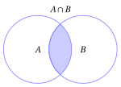{ .fig .ovale loading=lazy style="width:32%" }

    { .fig .ovale loading=lazy style="width:32%" }

    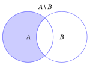{ .fig .ovale loading=lazy style="width:32%" }

    

- Diagrammi di Venn di complementare di un insieme:

    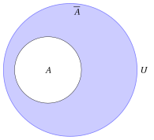{ .fig .ovale loading=lazy style="width:25%" }

### 4.3 Proprietà delle operazioni su insiemi

!!! osservazione "Osservazione 6: proprietà dell'intersezione"

    Dati tre insiemi $\red{A}, \blue{B}$ e $\orange{C}$, l'intersezione gode delle seguenti proprietà:

    - <strong>Commutativa</strong>:

        $$
        \red{A} \cap \blue{B} = \blue{B} \cap \red{A}
        $$

    - <strong>Associativa</strong>:

        $$
        \red{A} \cap (\blue{B} \cap \orange{C}) = (\red{A} \cap \blue{B}) \cap \orange{C}
        $$

    - <strong>Idempotenza</strong>:

        $$
        \red{A} \cap \red{A} = \red{A}
        $$

??? dimostrazione "Dimostrazione"

    Dimostriamo le tre proprietà confrontando gli elementi dei due membri.

    - <strong>Commutativa</strong>: $x \in A \cap B$ se e solo se $x \in A$ e $x \in B$, cioè se e solo se $x \in B$ e $x \in A$, cioè se e solo se $x \in B \cap A$. Quindi $A \cap B = B \cap A$.

    - <strong>Associativa</strong>: $x \in A \cap (B \cap C)$ se e solo se $x \in A$ e $x \in B \cap C$, cioè se e solo se $x$ appartiene a tutti e tre gli insiemi $A$, $B$ e $C$, cioè se e solo se $x \in A \cap B$ e $x \in C$, cioè se e solo se $x \in (A \cap B) \cap C$.

    - <strong>Idempotenza</strong>: $x \in A \cap A$ se e solo se $x \in A$ e $x \in A$, cioè se e solo se $x \in A$. Quindi $A \cap A = A$.

    La dimostrazione grafica della proprietà associativa dell'intersezione è la seguente: nella prima riga si costruisce $(A \cap B) \cap C$, nella seconda $A \cap (B \cap C)$, e i due insiemi ottenuti a destra coincidono.

    

    { .fig .ovale loading=lazy style="width:27%" }

    { .fig .ovale loading=lazy style="width:27%" }

    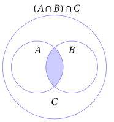{ .fig .ovale loading=lazy style="width:27%" }

    

    

    { .fig .ovale loading=lazy style="width:27%" }

    { .fig .ovale loading=lazy style="width:27%" }

    { .fig .ovale loading=lazy style="width:27%" }

    
 □

!!! osservazione "Osservazione 7: proprietà dell'unione"

    Dati tre insiemi $\red{A}, \blue{B}$ e $\orange{C}$, l'unione gode delle seguenti proprietà:

    - <strong>Commutativa</strong>:

        $$
        \red{A} \cup \blue{B} = \blue{B} \cup \red{A}
        $$

    - <strong>Associativa</strong>:

        $$
        \red{A} \cup (\blue{B} \cup \orange{C}) = (\red{A} \cup \blue{B}) \cup \orange{C}
        $$

    - <strong>Idempotenza</strong>:

        $$
        \red{A} \cup \red{A} = \red{A}
        $$

??? dimostrazione "Dimostrazione"

    Dimostriamo le tre proprietà confrontando gli elementi dei due membri.

    - <strong>Commutativa</strong>: $x \in A \cup B$ se e solo se $x \in A$ o $x \in B$, cioè se e solo se $x \in B$ o $x \in A$, cioè se e solo se $x \in B \cup A$. Quindi $A \cup B = B \cup A$.

    - <strong>Associativa</strong>: $x \in A \cup (B \cup C)$ se e solo se $x \in A$ o $x \in B \cup C$, cioè se e solo se $x$ appartiene ad almeno uno dei tre insiemi $A$, $B$ e $C$, cioè se e solo se $x \in A \cup B$ o $x \in C$, cioè se e solo se $x \in (A \cup B) \cup C$.

    - <strong>Idempotenza</strong>: $x \in A \cup A$ se e solo se $x \in A$ o $x \in A$, cioè se e solo se $x \in A$. Quindi $A \cup A = A$.

    La dimostrazione grafica della proprietà associativa dell'unione è la seguente: nella prima riga si costruisce $(A \cup B) \cup C$, nella seconda $A \cup (B \cup C)$, e i due insiemi ottenuti a destra coincidono.

    

    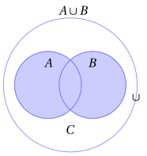{ .fig .ovale loading=lazy style="width:27%" }

    { .fig .ovale loading=lazy style="width:27%" }

    { .fig .ovale loading=lazy style="width:27%" }

    

    

    { .fig .ovale loading=lazy style="width:27%" }

    { .fig .ovale loading=lazy style="width:27%" }

    { .fig .ovale loading=lazy style="width:27%" }

    
 □

!!! osservazione "Osservazione 8: proprietà distributive (legano unione e intersezione)"

    Dati tre insiemi $\red{A}, \blue{B}$ e $\orange{C}$ abbiamo:

    $$
    \red{A} \cap (\blue{B} \cup \orange{C}) = (\red{A} \cap \blue{B}) \cup (\red{A} \cap \orange{C})
    $$

    $$
    \red{A} \cup (\blue{B} \cap \orange{C}) = (\red{A} \cup \blue{B}) \cap (\red{A} \cup \orange{C}).
    $$

Le proprietà distributive legano fra loro unione e intersezione.

??? dimostrazione "Dimostrazione"

    La dimostrazione grafica della prima proprietà è la seguente: nella prima riga si costruisce il primo membro $A \cap (B \cup C)$, nella seconda il secondo membro $(A \cap B) \cup (A \cap C)$, e i due insiemi ottenuti a destra coincidono.

    

    { .fig .ovale loading=lazy style="width:27%" }

    { .fig .ovale loading=lazy style="width:27%" }

    { .fig .ovale loading=lazy style="width:27%" }

    

    

    { .fig .ovale loading=lazy style="width:27%" }

    { .fig .ovale loading=lazy style="width:27%" }

    { .fig .ovale loading=lazy style="width:27%" }

    

    La dimostrazione grafica della seconda proprietà è la seguente: nella prima riga si costruisce il primo membro $A \cup (B \cap C)$, nella seconda il secondo membro $(A \cup B) \cap (A \cup C)$.

    

    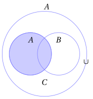{ .fig .ovale loading=lazy style="width:27%" }

    { .fig .ovale loading=lazy style="width:27%" }

    { .fig .ovale loading=lazy style="width:27%" }

    

    

    { .fig .ovale loading=lazy style="width:27%" }

    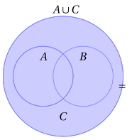{ .fig .ovale loading=lazy style="width:27%" }

    { .fig .ovale loading=lazy style="width:27%" }

    
 □

!!! teorema "Proposizione 6: leggi di assorbimento"

    Dati due insiemi $\red{A}$ e $\blue{B}$ abbiamo:

    $$
    \red{A} \cap (\red{A} \cup \blue{B}) = \red{A}
    $$

    $$
    \red{A} \cup (\red{A} \cap \blue{B}) = \red{A}
    $$

??? dimostrazione "Dimostrazione"

    Dimostriamo le due leggi con la doppia inclusione.

    - Se $x \in A \cap (A \cup B)$, allora $x \in A$. Viceversa, se $x \in A$, allora $x \in A \cup B$, e quindi $x \in A \cap (A \cup B)$. Quindi $A \cap (A \cup B) = A$.

    - Se $x \in A$, allora $x \in A \cup (A \cap B)$. Viceversa, se $x \in A \cup (A \cap B)$, allora $x \in A$ oppure $x \in A \cap B$; nel secondo caso, di nuovo, $x \in A$. Quindi $A \cup (A \cap B) = A$.

    
□

!!! teorema "Proposizione 7: inclusione, unione e intersezione"

    Dati due insiemi $A$ e $B$, le seguenti affermazioni sono equivalenti:

    $$
    A \subseteq B, \qquad\qquad A \cap B = A, \qquad\qquad A \cup B = B.
    $$

??? dimostrazione "Dimostrazione"

    Dimostriamo che $A \subseteq B$ equivale a ciascuna delle altre due affermazioni.

    - ($A \subseteq B \Longrightarrow A \cap B = A$) Ogni elemento di $A \cap B$ appartiene ad $A$. Viceversa, se $x \in A$, allora $x \in B$ perché $A \subseteq B$, e quindi $x \in A \cap B$. Per la doppia inclusione $A \cap B = A$.

    - ($A \cap B = A \Longrightarrow A \subseteq B$) Se $x \in A$, allora $x \in A \cap B$, perché $A \cap B = A$, e quindi $x \in B$.

    - ($A \subseteq B \Longrightarrow A \cup B = B$) Ogni elemento di $B$ appartiene ad $A \cup B$. Viceversa, se $x \in A \cup B$, allora $x \in A$ oppure $x \in B$; nel primo caso $x \in B$ perché $A \subseteq B$. In ogni caso $x \in B$, e per la doppia inclusione $A \cup B = B$.

    - ($A \cup B = B \Longrightarrow A \subseteq B$) Se $x \in A$, allora $x \in A \cup B$, e quindi $x \in B$ perché $A \cup B = B$.

    
□

!!! teorema "Proposizione 8: leggi di De Morgan (prima versione)"

    Dati tre insiemi $\red{A}, \blue{B}$ e $\orange{C}$ abbiamo:

    $$
    \red{A} \setminus (\blue{B} \cap \orange{C}) = (\red{A} \setminus \blue{B}) \cup (\red{A} \setminus \orange{C})
    $$

    $$
    \red{A} \setminus (\blue{B} \cup \orange{C}) = (\red{A} \setminus \blue{B}) \cap (\red{A} \setminus \orange{C})
    $$

??? dimostrazione "Dimostrazione"

    La dimostrazione grafica della prima proprietà è la seguente: nella prima riga si costruisce il primo membro $A \setminus (B \cap C)$, nella seconda il secondo membro $(A \setminus B) \cup (A \setminus C)$, e i due insiemi ottenuti a destra coincidono.

    

    { .fig .ovale loading=lazy style="width:27%" }

    { .fig .ovale loading=lazy style="width:27%" }

    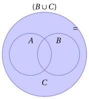{ .fig .ovale loading=lazy style="width:27%" }

    

    

    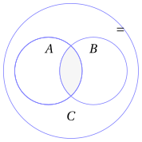{ .fig .ovale loading=lazy style="width:27%" }

    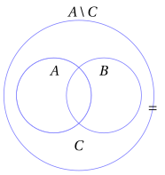{ .fig .ovale loading=lazy style="width:27%" }

    { .fig .ovale loading=lazy style="width:27%" }

    

    La dimostrazione grafica della seconda proprietà è la seguente: nella prima riga si costruisce il primo membro $A \setminus (B \cup C)$, nella seconda il secondo membro $(A \setminus B) \cap (A \setminus C)$.

    

    { .fig .ovale loading=lazy style="width:27%" }

    { .fig .ovale loading=lazy style="width:27%" }

    { .fig .ovale loading=lazy style="width:27%" }

    

    

    { .fig .ovale loading=lazy style="width:27%" }

    { .fig .ovale loading=lazy style="width:27%" }

    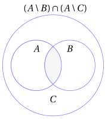{ .fig .ovale loading=lazy style="width:27%" }

    
 □

!!! teorema "Proposizione 9: leggi di De Morgan (seconda versione)"

    Dati gli insiemi $\blue{B}, \orange{C} \subseteq \violet{U}$, abbiamo

    $$
    \overline{\blue{B} \cap \orange{C}} = \overline{\blue{B}} \cup \overline{\orange{C}}
    $$

    $$
    \overline{\blue{B} \cup \orange{C}} = \overline{\blue{B}} \cap \overline{\orange{C}}
    $$

??? dimostrazione "Dimostrazione"

    Queste leggi si possono  derivare ponendo $A$ uguale a $U$ nelle precedenti leggi di De Morgan e ricordando che $\overline{B} = U \setminus B$ e $\overline{C} = U \setminus C$, come segue:

    $$
    \underbrace{\violet{U} \setminus (\blue{B} \cap \orange{C})}_{=\overline{\blue{B} \cap \orange{C}} } = (\underbrace{\violet{U} \setminus \blue{B}}_{=  \overline{\blue{B}}}) \cup (\underbrace {\violet{U} \setminus \orange{C}}_{= \overline{\orange{C}}})
    $$

    $$
    \underbrace{\violet{U} \setminus (\blue{B} \cup \orange{C})}_{=\overline{\blue{B} \cup \orange{C}} } = (\underbrace{\violet{U} \setminus \blue{B}}_{=  \overline{\blue{B}}}) \cap (\underbrace {\violet{U} \setminus \orange{C}}_{= \overline{\orange{C}}})
    $$

    
□

??? dimostrazione "Dimostrazione"

    La dimostrazione grafica della prima proprietà è la seguente: nella prima riga si costruisce il primo membro $\overline{B \cap C}$ a partire da $B \cap C$, nella seconda il secondo membro $\overline{B} \cup \overline{C}$, e i due insiemi ottenuti a destra coincidono.

    

    { .fig .ovale loading=lazy style="width:27%" }

    { .fig .ovale loading=lazy style="width:27%" }

    

    

    { .fig .ovale loading=lazy style="width:27%" }

    { .fig .ovale loading=lazy style="width:27%" }

    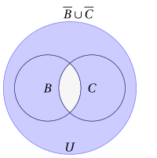{ .fig .ovale loading=lazy style="width:27%" }

    

    La dimostrazione grafica della seconda proprietà è la seguente: nella prima riga si costruisce il primo membro $\overline{B \cup C}$ a partire da $B \cup C$, nella seconda il secondo membro $\overline{B} \cap \overline{C}$.

    

    { .fig .ovale loading=lazy style="width:27%" }

    { .fig .ovale loading=lazy style="width:27%" }

    

    

    { .fig .ovale loading=lazy style="width:27%" }

    { .fig .ovale loading=lazy style="width:27%" }

    { .fig .ovale loading=lazy style="width:27%" }

    
 □

- L'insieme degli elementi che appartengono a un insieme $B$ o a un insieme $C$ ma non a tutti e due (intendendo la “o” in modo <u>esclusivo</u>) si chiama <strong>differenza simmetrica</strong> di $B$ e $C$ e si indica con $B \,\triangle\, C$:

    $$
    B \,\triangle\, C = (B \setminus C) \cup (C \setminus B).
    $$

    Si ottiene anche ponendo $U = B \cup C$ e facendo il complementare dell'intersezione rispetto a questo universo:

    $$
    B \,\triangle\, C = (B \cup C) \setminus (B \cap C).
    $$

??? dimostrazione "Dimostrazione"

    Dimostriamo che le due espressioni della differenza simmetrica coincidono. Abbiamo $x \in (B \setminus C) \cup (C \setminus B)$ se e solo se ($x \in B$ e $x \notin C$) oppure ($x \in C$ e $x \notin B$), cioè se e solo se $x$ appartiene a uno solo dei due insiemi $B$ e $C$. D'altra parte $x \in (B \cup C) \setminus (B \cap C)$ se e solo se $x$ appartiene ad almeno uno dei due insiemi ma non a entrambi, cioè di nuovo se e solo se $x$ appartiene a uno solo dei due insiemi. Quindi i due insiemi hanno gli stessi elementi. □

{ .fig .ovale loading=lazy style="width:40%" }

### 4.4 Proprietà delle cardinalità degli insiemi

!!! teorema "Proposizione 10: cardinalità dell'unione di insiemi disgiunti"

    Se $\red{A}$ e $\blue{B}$ sono due insiemi finiti disgiunti, cioè $|\red{A} \cap \blue{B}| = 0$, allora

    $$
    |\red{A} \cup \blue{B}| = |\red{A}| +  |\blue{B}|.
    $$

    Più in generale, se $A_1, A_2, \dots, A_m$ sono insiemi finiti a due a due disgiunti, allora

    $$
    |A_1 \cup A_2 \cup \cdots \cup A_m| = |A_1| + |A_2| + \cdots + |A_m|.
    $$

??? dimostrazione "Dimostrazione"

    Ogni elemento di $A \cup B$ appartiene ad $A$ oppure a $B$, e nessun elemento appartiene a entrambi, perché $A \cap B = \varnothing$. Contando prima gli $|A|$ elementi di $A$ e poi i $|B|$ elementi di $B$ contiamo quindi ogni elemento di $A \cup B$ esattamente una volta: $|A \cup B| = |A| + |B|$.

    Allo stesso modo, ogni elemento di $A_1 \cup A_2 \cup \cdots \cup A_m$ appartiene ad almeno uno degli insiemi $A_1, A_2, \dots, A_m$ e, poiché gli insiemi sono a due a due disgiunti, a uno solo di essi. Contando uno dopo l'altro gli elementi di $A_1, A_2, \dots, A_m$ contiamo quindi ogni elemento dell'unione esattamente una volta. □

!!! teorema "Proposizione 11: cardinalità dell'unione"

    Per ogni due insiemi finiti $\red{A}$ e $\blue{B}$, abbiamo

    $$
    |\red{A} \cup \blue{B}| = |\red{A}| + |\blue{B}| - |\red{A} \cap \blue{B}|.
    $$

??? dimostrazione "Dimostrazione"

    Ogni elemento di $A \cup B$ appartiene a esattamente uno dei tre insiemi

    $$
    A \setminus B, \qquad A \cap B, \qquad B \setminus A:
    $$

    se appartiene sia ad $A$ sia a $B$ sta in $A \cap B$, se appartiene solo ad $A$ sta in $A \setminus B$, se appartiene solo a $B$ sta in $B \setminus A$. I tre insiemi sono quindi a due a due disgiunti e la loro unione è $A \cup B$, e per la cardinalità dell'unione di insiemi disgiunti

    $$
    |A \cup B| = |A \setminus B| + |A \cap B| + |B \setminus A|.
    $$

    Allo stesso modo, ogni elemento di $A$ appartiene a esattamente uno dei due insiemi disgiunti $A \setminus B$ e $A \cap B$, e ogni elemento di $B$ appartiene a esattamente uno dei due insiemi disgiunti $B \setminus A$ e $A \cap B$, quindi

    $$
    |A| = |A \setminus B| + |A \cap B|, \qquad |B| = |B \setminus A| + |A \cap B|.
    $$

    Sommando le ultime due uguaglianze otteniamo

    $$
    |A| + |B| = |A \setminus B| + |A \cap B| + |B \setminus A| + |A \cap B| = |A \cup B| + |A \cap B|,
    $$

    cioè $|A \cup B| = |A| + |B| - |A \cap B|$. □

!!! teorema "Proposizione 12: disuguaglianza per la cardinalità dell'unione"

    Per ogni due insiemi finiti $\red{A}$ e $\blue{B}$, abbiamo

    $$
    |\red{A} \cup \blue{B}| \le |\red{A}| + |\blue{B}|.
    $$

??? dimostrazione "Dimostrazione"

    Per la cardinalità dell'unione abbiamo $|A \cup B| = |A| + |B| - |A \cap B|$. Poiché $|A \cap B| \ge 0$, otteniamo

    $$
    |A \cup B| = |A| + |B| - |A \cap B| \le |A| + |B|.
    $$

    
□

!!! teorema "Proposizione 13: cardinalità di un sottoinsieme"

    Dati due insiemi finiti $\red{A}$ e $\blue{B}$ con $\red{A} \subseteq \blue{B}$, abbiamo

    $$
    |\red{A}| \le |\blue{B}|.
    $$

    Se inoltre $\red{A} \subsetneqq \blue{B}$, allora $|\red{A}| < |\blue{B}|$.

??? dimostrazione "Dimostrazione"

    Poiché $A \subseteq B$, ogni elemento di $B$ appartiene a esattamente uno dei due insiemi disgiunti $A$ e $B \setminus A$, e ogni elemento di questi due insiemi appartiene a $B$: quindi $B = A \cup (B \setminus A)$ e, per la cardinalità dell'unione di insiemi disgiunti,

    $$
    |B| = |A| + |B \setminus A| \ge |A|.
    $$

    Se inoltre $A \subsetneqq B$, allora $A \neq B$ e quindi, per la proprietà antisimmetrica dell'inclusione, non può essere $B \subseteq A$: esiste un elemento $b \in B$ con $b \notin A$, cioè $b \in B \setminus A$. Allora $|B \setminus A| \ge 1$ e

    $$
    |B| = |A| + |B \setminus A| \ge |A| + 1 > |A|.
    $$

    
□

### 4.5 Coppie ordinate e prodotto cartesiano

Esiste un'altra operazione sugli insiemi, che può essere eseguita su due insiemi qualsiasi (cioè due insiemi non necessariamente contenuti nel medesimo universo). Per introdurla serve il concetto di <em>coppia ordinata</em>: a differenza dell'insieme $\{a, b\}$, in cui l'ordine degli elementi è irrilevante, in una coppia ordinata conta quale elemento viene prima.

!!! definizione "Definizione 17: di coppia ordinata"

    Dati due elementi $a$ e $b$, la <strong>coppia ordinata</strong> $(a, b)$ è l'insieme

    $$
    (a, b) = \big\{ \{a\},~ \{a,b\} \big\} .
    $$

    L'elemento $a$ si chiama <strong>prima componente</strong> e l'elemento $b$ <strong>seconda componente</strong> della coppia.

Questa definizione, dovuta a Kuratowski, esprime la coppia ordinata usando soltanto insiemi. Ciò che conta della coppia ordinata è la proprietà seguente.

!!! teorema "Proposizione 14: proprietà caratteristica delle coppie ordinate"

    Dati gli elementi $a$, $b$, $c$ e $d$, abbiamo

    $$
    (a, b) = (c, d) \quad \Longleftrightarrow \quad a = c \textrm{ e } b = d.
    $$

??? dimostrazione "Dimostrazione"

    ($\Longleftarrow$) Se $a = c$ e $b = d$, gli insiemi $\big\{ \{a\}, \{a,b\} \big\}$ e $\big\{ \{c\}, \{c,d\} \big\}$ sono scritti con gli stessi elementi, quindi sono uguali.

    ($\Longrightarrow$) Supponiamo $\big\{ \{a\}, \{a,b\} \big\} = \big\{ \{c\}, \{c,d\} \big\}$ e distinguiamo due casi.

    - Se $a = b$, allora $\{a, b\} = \{a\}$ e la coppia $(a,b) = \big\{\{a\}\big\}$ ha un solo elemento. Quindi anche $\big\{ \{c\}, \{c,d\} \big\}$ ha come unico elemento $\{a\}$: da $\{c\} = \{a\}$ segue $c = a$, e da $\{c, d\} = \{a\}$ segue $d = a$. Quindi $a = c$ e $b = a = d$.

    - Se $a \neq b$, la coppia $(a,b)$ ha due elementi distinti: $\{a\}$, che ha un elemento, e $\{a,b\}$, che ne ha due. Allora anche $c \neq d$, altrimenti $(c, d)$ avrebbe un solo elemento. Poiché $\{a\} \in \big\{ \{c\}, \{c,d\} \big\}$ e $\{a\}$ ha un solo elemento, mentre $\{c,d\}$ ne ha due, deve essere $\{a\} = \{c\}$, cioè $a = c$. Analogamente $\{a,b\}$, che ha due elementi, non può essere uguale a $\{c\}$, quindi $\{a,b\} = \{c,d\} = \{a, d\}$. Poiché $b \in \{a, d\}$ e $b \neq a$, otteniamo $b = d$.

    
□

- In particolare, se $a \neq b$ allora $(a, b) \neq (b, a)$: se fosse $(a,b) = (b,a)$, la proprietà caratteristica darebbe $a = b$. Invece gli insiemi $\{a, b\}$ e $\{b, a\}$ sono sempre uguali. Se $a = b$, le due coppie $(a,b)$ e $(b,a)$ sono la stessa coppia.

!!! definizione "Definizione 18: di prodotto cartesiano"

    Dati due insiemi (non necessariamente distinti) $A$ e $B$, l'insieme costituito da tutte le <em>coppie ordinate</em> $(a, b)$, con $a \in A$ e $b \in B$, si chiama <strong>prodotto cartesiano</strong> di $A$ per $B$ e si indica col simbolo $A \times B$:

    $$
    A \times B = \big\{ (a, b) : a \in A \textrm{ e } b \in B \big\}.
    $$

!!! teorema "Proposizione 15: cardinalità del prodotto cartesiano"

    Quando ${A}$ e ${B}$ sono due insiemi finiti, la cardinalità del loro prodotto cartesiano è:

    $$
    |{A} \times {B}| = |{A}| \cdot |{B}|.
    $$

??? dimostrazione "Dimostrazione"

    Se $A = \varnothing$ non esiste alcuna coppia con prima componente in $A$, quindi $A \times B = \varnothing$ e $|A \times B| = 0 = 0 \cdot |B|$. Altrimenti siano $a_1, a_2, \dots, a_m$ gli elementi di $A$, con $m = |A|$, e per ogni $i \in \{1, 2, \dots, m\}$ consideriamo l'insieme delle coppie con prima componente $a_i$:

    $$
    R_i = \big\{ (a_i, b) : b \in B \big\}.
    $$

    - Ogni coppia di $A \times B$ appartiene a esattamente uno degli insiemi $R_1, R_2, \dots, R_m$, quello corrispondente alla sua prima componente: per la proprietà caratteristica, coppie con prime componenti diverse sono diverse. Quindi gli insiemi $R_1, R_2, \dots, R_m$ sono a due a due disgiunti e la loro unione è $A \times B$.

    - Ogni insieme $R_i$ ha $|B|$ elementi: per la proprietà caratteristica, $(a_i, b) = (a_i, b')$ se e solo se $b = b'$, quindi elementi diversi di $B$ danno coppie diverse.

    Per la cardinalità dell'unione di insiemi disgiunti

    $$
    |A \times B| = |R_1| + |R_2| + \cdots + |R_m| = \underbrace{|B| + |B| + \cdots + |B|}_{m \textrm{ volte}} = |A| \cdot |B|.
    $$

    
□

!!! esempio "Esempio 21: prodotto cartesiano"

    $$
    \{a,b\} \times \{a,b,c\} = \big\{ (a,a),(a,b),(a,c),(b,a),(b,b),(b,c) \big\}
    $$

    $$
    |\{a,b\}|=2,~~ |\{a,b,c\}|=3,~~ |\{a,b\} \times \{a,b,c\}| = 2 \cdot 3 = 6
    $$

    Il prodotto cartesiano non è commutativo: la coppia $(c, a)$ appartiene a $\{a,b,c\} \times \{a,b\}$, ma non appartiene a $\{a,b\} \times \{a,b,c\}$, perché $c \notin \{a, b\}$. Quindi $\{a,b,c\} \times \{a,b\} \neq \{a,b\} \times \{a,b,c\}$.

Il prodotto cartesiano si estende a più di due insiemi.

!!! definizione "Definizione 19: di $n$-upla ordinata e di prodotto cartesiano di $n$ insiemi"

    Dati $n \ge 3$ elementi $a_1, a_2, \dots, a_n$, la <strong>$n$-upla ordinata</strong> $(a_1, a_2, \dots, a_n)$ è la coppia ordinata

    $$
    (a_1, a_2, \dots, a_n) = \big( (a_1, a_2, \dots, a_{n-1}),~ a_n \big).
    $$

    Dati $n \ge 2$ insiemi $A_1, A_2, \dots, A_n$, il loro <strong>prodotto cartesiano</strong> è l'insieme delle $n$-uple

    $$
    A_1 \times A_2 \times \cdots \times A_n = \big\{ (a_1,a_2,\dots,a_n): a_i \in A_i {\rm~~per~ogni~~} i \in \{1, 2, \dots, n\} \big\}.
    $$

- Applicando ripetutamente la proprietà caratteristica delle coppie ordinate si ottiene

    $$
    (a_1, a_2, \dots, a_n) = (b_1, b_2, \dots, b_n) \quad \Longleftrightarrow \quad a_i = b_i \textrm{ per ogni } i \in \{1, 2, \dots, n\}.
    $$

!!! teorema "Proposizione 16: cardinalità del prodotto cartesiano di $n$ insiemi"

    Se $A_1, A_2, \dots, A_n$ sono insiemi finiti, allora

    $$
    |A_1 \times A_2 \times \cdots \times A_n| = |A_1| \cdot |A_2| \cdots |A_n|.
    $$

??? dimostrazione "Dimostrazione"

    Per $n = 2$ è la cardinalità del prodotto cartesiano di due insiemi. Per $n \ge 3$, per la definizione di $n$-upla le $n$-uple $(a_1, a_2, \dots, a_n)$ sono esattamente le coppie $\big( (a_1, \dots, a_{n-1}), a_n \big)$ con $(a_1, \dots, a_{n-1}) \in A_1 \times \cdots \times A_{n-1}$ e $a_n \in A_n$, cioè

    $$
    A_1 \times A_2 \times \cdots \times A_n = (A_1 \times A_2 \times \cdots \times A_{n-1}) \times A_n.
    $$

    Per la cardinalità del prodotto cartesiano di due insiemi

    $$
    |A_1 \times A_2 \times \cdots \times A_n| = |A_1 \times A_2 \times \cdots \times A_{n-1}| \cdot |A_n|.
    $$

    Ripetendo lo stesso ragionamento su $A_1 \times A_2 \times \cdots \times A_{n-1}$, poi su $A_1 \times A_2 \times \cdots \times A_{n-2}$, e così via fino a $A_1 \times A_2$, otteniamo $|A_1| \cdot |A_2| \cdots |A_n|$. □

- Il prodotto cartesiano di $n$ insiemi uguali ad $A$ si indica con

    $$
    A^n = \underbrace{A \times A \times \cdots \times A}_{n \textrm{ volte}}
    $$

    e, se $A$ è finito, per la proposizione precedente ha cardinalità $|A^n| = |A|^n$. Ad esempio $\{0, 1\}^3$ ha $2^3 = 8$ elementi: le terne di $0$ e $1$ corrispondono alle scelte “dentro” o “fuori” dell'albero binario con cui abbiamo costruito l'insieme delle parti di un insieme con $3$ elementi.

- Un tipico uso di prodotto cartesiano si ha con $\R \times \R$, che si abbrevia col simbolo $\R^2$, e denota l'insieme delle coppie ordinate di numeri reali.

- Analogamente, $\R^n$ (abbreviazione del prodotto cartesiano di $n$ insiemi uguali a $\R$) è l'insieme delle <em>$n$-uple ordinate di numeri reali</em>

    $$
    \R^n =\big\{ ~(x_1,~x_2,~ \dots,~ x_n)~: ~~x_i \in \R, ~~i \in \{1,2,\dots, n\} ~\big\}
    $$

!!! esempio "Esempio 22: sottoinsiemi del piano"

    Quando si studiano sottoinsiemi del piano si sceglie come universo $U = \R^2$. Ad esempio l'insieme dei punti del piano con entrambe le coordinate positive (il <em>primo quadrante</em>) è

    $$
    Q_1 = \big\{ (x_1, x_2) \in \R^2 : x_1 > 0 \textrm{ e } x_2 > 0 \big\}.
    $$

    Poiché $(x_1, x_2) \in Q_1$ se e solo se $x_1 \in \R_{>0}$ e $x_2 \in \R_{>0}$, abbiamo $Q_1 = \R_{>0} \times \R_{>0}$.

## 5. Approfondimenti

### 5.1 Paradosso di Russell

!!! chiave ""

    “un insieme può essere o meno elemento di se stesso?”

- Ad esempio, l'insieme di tutti i libri di una biblioteca non è elemento di se stesso (un insieme di libri non è un libro). Invece, ragionando in modo ingenuo, la collezione di tutti gli insiemi con più di 20 elementi sembrerebbe elemento di se stessa, perché ha certamente più di 20 elementi. Vedremo alla fine di questa sezione che nella definizione formale degli insiemi questa collezione non è un insieme.

- Seguendo questo ragionamento si possono definire due categorie di insiemi:

    1. gli insiemi che non sono elementi di se stessi

    2. gli insiemi che sono elementi di se stessi

!!! chiave ""

    Se consideriamo l'insieme di tutti gli insiemi che non sono elementi di se stessi, esso è o no elemento di se stesso?

Chiamiamo questo insieme $S$,  si possono fare due ipotesi:

- **1** Se supponiamo $S \in S$, allora $S$ contiene se stesso come elemento e quindi non appartiene ad $S$  (poiché per definizione un insieme appartiene ad $S$ soltanto se non contiene se stesso come elemento). Quindi $S \notin S$, e abbiamo una contraddizione. Concludiamo che l'ipotesi debba essere errata.

- **2** Se supponiamo $S \notin S$, allora $S$ non contiene se stesso come elemento e quindi appartiene a $S$ (poiché per definizione un insieme appartiene ad $S$  se non contiene se stesso come elemento). Quindi $S \in S$ e abbiamo un'altra contraddizione. Concludiamo che anche questa ipotesi debba essere errata!

!!! chiave ""

    <strong>Paradosso di Russell:</strong> L'insieme di tutti gli insiemi che non appartengono a se stessi appartiene a se stesso se e solo se non appartiene a se stesso.

- La definizione formale del concetto di insieme si basa sul <strong>sistema di assiomi di Zermelo-Fraenkel</strong>,  abbreviati con <strong>ZF</strong>. Questo sistema di assiomi comprende gli assiomi standard della teoria assiomatica degli insiemi su cui, insieme con l'<em>assioma di scelta</em>, si basa tutta la matematica ordinaria.

- L'<strong>assioma della coppia</strong> afferma che “Dati due oggetti, esiste un insieme i cui elementi sono  i due oggetti”.

- L'<strong>assioma di regolarità</strong> afferma che “Ogni insieme non vuoto $A$ contiene un elemento  disgiunto da $A$”.

    

    !!! osservazione "Osservazione 9"

        Nessun insieme è un elemento di sé stesso.

    ??? dimostrazione "Dimostrazione"

        Sia $A$ un insieme. Per l'assioma della coppia, applicato ai due oggetti $A$ e $A$, esiste l'insieme $\{A,A\}$, che coincide con $\{A\}$ dato che gli insiemi non contengono oggetti ripetuti: quindi $\{A\}$ è un insieme (è un caso speciale di coppia), ed è non vuoto.

        Applichiamo ora l'assioma di regolarità all'insieme $\{A\}$: deve esistere un elemento di $\{A\}$ disgiunto da $\{A\}$. Dato che l'unico elemento di $\{A\}$ è $A$, allora $A$ è disgiunto da $\{A\}$, cioè $A\cap \{A\}=\varnothing$.

        Se fosse $A \in A$, poiché anche $A \in \{A\}$, avremmo $A \in A \cap \{A\}$, contro il fatto che $A\cap \{A\}=\varnothing$ (definizione di insiemi disgiunti). Quindi $A \notin A$. □

- In particolare la collezione di tutti gli insiemi con più di 20 elementi non è un insieme in ZF: se lo fosse, avrebbe più di 20 elementi e quindi sarebbe elemento di sé stessa, contro l'Osservazione appena dimostrata.

- Gli altri assiomi ZF non fanno parte del corso base di Analisi Matematica.

### 5.2 Un'ulteriore dimostrazione con la proprietà di Archimede

- Una ulteriore dimostrazione di

    $$
    0,\overline{9}=1
    $$

    parte dall'assunzione  che due numeri siano uguali se e solo se la loro differenza è uguale a zero e si basa sul calcolare quanto valga $1 - 0,\overline{9}$.

- Questa dimostrazione si basa sul fatto che 0 è l'unico numero non negativo minore di tutti gli inversi degli interi positivi, o equivalentemente che non esiste un numero maggiore di ogni numero naturale. Questa è la <strong>proprietà di Archimede</strong>, che si verifica per i numeri razionali e reali.

!!! chiave ""

    La <strong>proprietà di Archimede</strong> afferma che per ogni numero reale $x$ esiste un numero naturale $n$ tale che:

    $$
    n > x
    $$

- In forma equivalente: per ogni numero reale $\varepsilon > 0$ esiste un numero naturale $n > 0$ tale che $\frac{1}{n} < \varepsilon$ (basta prendere $n$ maggiore di $\frac{1}{\varepsilon}$). Di conseguenza l'unico numero non negativo minore o uguale a $\frac{1}{n}$ per ogni $n$ è lo zero: è questa la forma in cui la proprietà interviene nella dimostrazione qui sotto.

- Non si tratta di un assioma in più: nel capitolo <em>Campi ordinati, estremo superiore/inferiore e assioma di continuità</em> la dimostreremo a partire dalla proprietà dell'estremo superiore dei numeri reali.

??? dimostrazione "Dimostrazione"

    Scriviamo il numero $0,999...$ con $n$ cifre dopo la virgola come $0,(9)_n$, quindi $0,(9)_1 = 0,9$, $0,(9)_2 = 0,99$, $0,(9)_3 = 0,999$, e così via. 

    Dato  $\frac{1}{10^n} = 0,0 \dots 01$, con $n$ cifre dopo la virgola, le regole di addizione per i numeri decimali implicano

    $$
    0,(9)_n + \frac{1}{10^n} = 1
    {\rm ~~inoltre~~}
    0,(9)_n < 1,  \forall n \in \N.
    $$

    Si deve dimostrare che $1$ è il numero più piccolo che non sia inferiore a tutti gli $0,(9)_n$. Per questo basta provare che, se un numero $x$ non è maggiore di 1 e non minore di tutti gli $0,(9)_n$, allora $x = 1$.

    Quindi sia $x$ tale che

    $$
    0,(9)_n \le x \le 1
    $$

    per ogni intero positivo $n$. Quindi

    $$
    1-1 \le 1 -  x \le 1- 0,(9)_n
    $$

    che, usando l'aritmetica di base e la prima uguaglianza stabilita sopra, semplifica a

    $$
    0 \le 1 -  x  \le \frac{1}{10^n}
    $$

    Ciò implica che la differenza tra $1$ e $x$ è minore dell'inverso di qualsiasi intero positivo. Quindi questa differenza deve essere zero, e quindi $x = 1$; che a sua volta implica

    $$
    0,999\dots = 1
    $$

    
□

