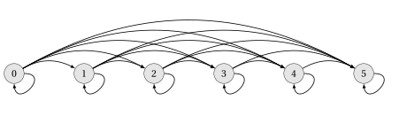
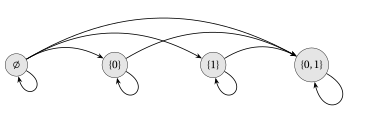
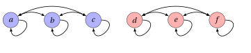
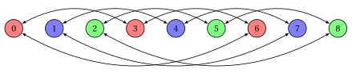
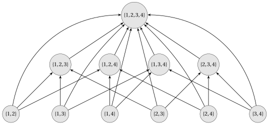

# Relazioni binarie

**Parte 1 · Numeri e logica · Capitolo 4** · dalle dispense di Fabio Furini · [:material-file-pdf-box: Dispensa del volume (PDF)](../pdf/dispensa-1-numeri.pdf) · [:material-presentation: Slide (PDF)](../pdf/slide-numeri-04-relazioni-binarie.pdf)

## 1. Relazioni binarie

!!! definizione "Definizione 1: di relazione binaria"

    Dati due insiemi $\red{A}$ e $\blue{B}$,  una  <strong>relazione binaria</strong> $\violet{R}$  è un sottoinsieme del prodotto cartesiano  $\red{A} \times \blue{B}$

!!! chiave ""

    Quando diciamo che $\violet{R}$ è una relazione binaria di un solo insieme  $\red{A}$,  intendiamo che  $\violet{R}$ è un sottoinsieme di  $\red{A} \times \red{A}$.

- Chiameremo  semplicemente relazione una relazione binaria (esistono però anche relazioni non binarie).

- Se $(a,b) \in \violet{R}$ scriviamo anche $a \, \violet{R} \, b$ e diciamo che $a$ è <strong>in relazione</strong> con $b$.

!!! esempio "Esempio 1"

    - La  relazione “minore di” (“$<$”) dei numeri naturali è l'insieme :

        $$
        R_{<}= \bigg\{ (a,b): a,b \in \mathbb{N} {\rm~~e~~} a < b \bigg\}.
        $$

    - La  relazione “minore o uguale  di” (“$\le$”) dei numeri naturali è l'insieme :

        $$
        R_{\le}= \bigg\{ (a,b): a,b \in \mathbb{N} {\rm~~e~~} a \le b \bigg\}.
        $$

    - La  relazione “uguale a” (“$=$”) dei numeri naturali è l'insieme :

        $$
        R_{=}= \bigg\{ (a,b): a,b \in \mathbb{N} {\rm~~e~~} a = b \bigg\}.
        $$

    - La relazione   “è sottoinsieme di” $R_{\subseteq}$ dell'insieme delle parti dei numeri naturali (indicato con $2^{\mathbb{N}}$ ) è l'insieme:

        $$
        R_{\subseteq} = \bigg\{ (A,B): A,B \in 2^\mathbb{N} {\rm ~~e~~} A \subseteq B \bigg\}.
        $$

!!! chiave ""

    Una relazione $\violet{R}$ su un insieme di numeri naturali si può visualizzare con una <strong>tabella</strong>: nella riga $a$ e nella colonna $b$ compare la coppia $(a,b)$ se $(a,b) \in \violet{R}$, e la casella resta vuota se $(a,b) \notin \violet{R}$.

!!! esempio "Esempio 2: tabelle di relazioni"

    - La tabella della relazione $R_{<}$ (righe e colonne da $0$ a $4$):

        
<table>
        <tr>
        <td></td>
        <td>\(0\)</td>
        <td>\(1\)</td>
        <td>\(2\)</td>
        <td>\(3\)</td>
        <td>\(4\)</td>
        <td>\(\dots\)</td>
        </tr>
        <tr>
        <td>\(0\)</td>
        <td></td>
        <td>\((0,1)\)</td>
        <td>\((0,2)\)</td>
        <td>\((0,3)\)</td>
        <td>\((0,4)\)</td>
        <td></td>
        </tr>
        <tr>
        <td>\(1\)</td>
        <td></td>
        <td></td>
        <td>\((1,2)\)</td>
        <td>\((1,3)\)</td>
        <td>\((1,4)\)</td>
        <td></td>
        </tr>
        <tr>
        <td>\(2\)</td>
        <td></td>
        <td></td>
        <td></td>
        <td>\((2,3)\)</td>
        <td>\((2,4)\)</td>
        <td></td>
        </tr>
        <tr>
        <td>\(3\)</td>
        <td></td>
        <td></td>
        <td></td>
        <td></td>
        <td>\((3,4)\)</td>
        <td></td>
        </tr>
        <tr>
        <td>\(4\)</td>
        <td></td>
        <td></td>
        <td></td>
        <td></td>
        <td></td>
        <td></td>
        </tr>
        <tr>
        <td>\(\dots\)</td>
        <td></td>
        <td></td>
        <td></td>
        <td></td>
        <td></td>
        <td></td>
        </tr>
        </table>

    - La tabella della relazione $R_{=}$:

        
<table>
        <tr>
        <td></td>
        <td>\(0\)</td>
        <td>\(1\)</td>
        <td>\(2\)</td>
        <td>\(3\)</td>
        <td>\(4\)</td>
        <td>\(\dots\)</td>
        </tr>
        <tr>
        <td>\(0\)</td>
        <td>\((0,0)\)</td>
        <td></td>
        <td></td>
        <td></td>
        <td></td>
        <td></td>
        </tr>
        <tr>
        <td>\(1\)</td>
        <td></td>
        <td>\((1,1)\)</td>
        <td></td>
        <td></td>
        <td></td>
        <td></td>
        </tr>
        <tr>
        <td>\(2\)</td>
        <td></td>
        <td></td>
        <td>\((2,2)\)</td>
        <td></td>
        <td></td>
        <td></td>
        </tr>
        <tr>
        <td>\(3\)</td>
        <td></td>
        <td></td>
        <td></td>
        <td>\((3,3)\)</td>
        <td></td>
        <td></td>
        </tr>
        <tr>
        <td>\(4\)</td>
        <td></td>
        <td></td>
        <td></td>
        <td></td>
        <td>\((4,4)\)</td>
        <td></td>
        </tr>
        <tr>
        <td>\(\dots\)</td>
        <td></td>
        <td></td>
        <td></td>
        <td></td>
        <td></td>
        <td></td>
        </tr>
        </table>

    - La tabella della relazione $R_{\le}$, che contiene le coppie di $R_{<}$ e quelle di $R_{=}$:

        
<table>
        <tr>
        <td></td>
        <td>\(0\)</td>
        <td>\(1\)</td>
        <td>\(2\)</td>
        <td>\(3\)</td>
        <td>\(4\)</td>
        <td>\(\dots\)</td>
        </tr>
        <tr>
        <td>\(0\)</td>
        <td>\((0,0)\)</td>
        <td>\((0,1)\)</td>
        <td>\((0,2)\)</td>
        <td>\((0,3)\)</td>
        <td>\((0,4)\)</td>
        <td></td>
        </tr>
        <tr>
        <td>\(1\)</td>
        <td></td>
        <td>\((1,1)\)</td>
        <td>\((1,2)\)</td>
        <td>\((1,3)\)</td>
        <td>\((1,4)\)</td>
        <td></td>
        </tr>
        <tr>
        <td>\(2\)</td>
        <td></td>
        <td></td>
        <td>\((2,2)\)</td>
        <td>\((2,3)\)</td>
        <td>\((2,4)\)</td>
        <td></td>
        </tr>
        <tr>
        <td>\(3\)</td>
        <td></td>
        <td></td>
        <td></td>
        <td>\((3,3)\)</td>
        <td>\((3,4)\)</td>
        <td></td>
        </tr>
        <tr>
        <td>\(4\)</td>
        <td></td>
        <td></td>
        <td></td>
        <td></td>
        <td>\((4,4)\)</td>
        <td></td>
        </tr>
        <tr>
        <td>\(\dots\)</td>
        <td></td>
        <td></td>
        <td></td>
        <td></td>
        <td></td>
        <td></td>
        </tr>
        </table>

!!! definizione "Definizione 2: di congruenza modulo $n$"

    Dato un numero naturale $n \ge 1$, due numeri naturali $a$ e $b$ sono <strong>congrui modulo $n$</strong>, e si scrive $a \equiv b \pmod{n}$, se la loro differenza è un multiplo intero di $n$:

    $$
    a \equiv b \pmod{n} \qquad \Longleftrightarrow \qquad \exists q \in \mathbb{Z} {\rm ~~tale~che~~} b - a = q \, n.
    $$

!!! definizione "Definizione 3: di multiplo e di divisore"

    Dati due numeri naturali $a$ e $b$, diciamo che $a$ è un <strong>multiplo</strong> di $b$ se esiste $k \in \mathbb{N}$ tale che $a = k \, b$. Diciamo che $a$ è un <strong>divisore</strong> di $b$ se esiste $k \in \mathbb{N}$ tale che $b = k \, a$.

- Quindi $a$ è un divisore di $b$ se e solo se $b$ è un multiplo di $a$.

- Con questa definizione $0$ è un multiplo di ogni numero naturale ($0 = 0 \cdot b$) e $0$ è divisore solo di sé stesso (se $b = k \cdot 0$ allora $b=0$).

!!! esempio "Esempio 3: altre relazioni sui numeri naturali"

    - La relazione “congruo modulo $n$” dei numeri naturali è l'insieme:

        $$
        R_{\equiv_n} = \bigg\{ (a,b): a,b \in \mathbb{N} {\rm ~~e~~} a \equiv b \pmod{n} \bigg\}.
        $$

        Con $n = 3$ la tabella è:

        
<table>
        <tr>
        <td></td>
        <td>\(0\)</td>
        <td>\(1\)</td>
        <td>\(2\)</td>
        <td>\(3\)</td>
        <td>\(4\)</td>
        <td>\(5\)</td>
        <td>\(6\)</td>
        <td>\(\dots\)</td>
        </tr>
        <tr>
        <td>\(0\)</td>
        <td>\((0,0)\)</td>
        <td></td>
        <td></td>
        <td>\((0,3)\)</td>
        <td></td>
        <td></td>
        <td>\((0,6)\)</td>
        <td></td>
        </tr>
        <tr>
        <td>\(1\)</td>
        <td></td>
        <td>\((1,1)\)</td>
        <td></td>
        <td></td>
        <td>\((1,4)\)</td>
        <td></td>
        <td></td>
        <td></td>
        </tr>
        <tr>
        <td>\(2\)</td>
        <td></td>
        <td></td>
        <td>\((2,2)\)</td>
        <td></td>
        <td></td>
        <td>\((2,5)\)</td>
        <td></td>
        <td></td>
        </tr>
        <tr>
        <td>\(3\)</td>
        <td>\((3,0)\)</td>
        <td></td>
        <td></td>
        <td>\((3,3)\)</td>
        <td></td>
        <td></td>
        <td>\((3,6)\)</td>
        <td></td>
        </tr>
        <tr>
        <td>\(4\)</td>
        <td></td>
        <td>\((4,1)\)</td>
        <td></td>
        <td></td>
        <td>\((4,4)\)</td>
        <td></td>
        <td></td>
        <td></td>
        </tr>
        <tr>
        <td>\(5\)</td>
        <td></td>
        <td></td>
        <td>\((5,2)\)</td>
        <td></td>
        <td></td>
        <td>\((5,5)\)</td>
        <td></td>
        <td></td>
        </tr>
        <tr>
        <td>\(6\)</td>
        <td>\((6,0)\)</td>
        <td></td>
        <td></td>
        <td>\((6,3)\)</td>
        <td></td>
        <td></td>
        <td>\((6,6)\)</td>
        <td></td>
        </tr>
        <tr>
        <td>\(\dots\)</td>
        <td></td>
        <td></td>
        <td></td>
        <td></td>
        <td></td>
        <td></td>
        <td></td>
        <td></td>
        </tr>
        </table>

    - La relazione “è multiplo di” dei numeri naturali è l'insieme:

        $$
        R_{\textrm{mul}} = \bigg\{ (a,b): a,b \in \mathbb{N} {\rm ~~e~~} \exists k \in \mathbb{N} {\rm ~~tale~che~~} a = k \, b \bigg\}.
        $$

        
<table>
        <tr>
        <td></td>
        <td>\(0\)</td>
        <td>\(1\)</td>
        <td>\(2\)</td>
        <td>\(3\)</td>
        <td>\(4\)</td>
        <td>\(5\)</td>
        <td>\(6\)</td>
        <td>\(\dots\)</td>
        </tr>
        <tr>
        <td>\(0\)</td>
        <td>\((0,0)\)</td>
        <td>\((0,1)\)</td>
        <td>\((0,2)\)</td>
        <td>\((0,3)\)</td>
        <td>\((0,4)\)</td>
        <td>\((0,5)\)</td>
        <td>\((0,6)\)</td>
        <td></td>
        </tr>
        <tr>
        <td>\(1\)</td>
        <td></td>
        <td>\((1,1)\)</td>
        <td></td>
        <td></td>
        <td></td>
        <td></td>
        <td></td>
        <td></td>
        </tr>
        <tr>
        <td>\(2\)</td>
        <td></td>
        <td>\((2,1)\)</td>
        <td>\((2,2)\)</td>
        <td></td>
        <td></td>
        <td></td>
        <td></td>
        <td></td>
        </tr>
        <tr>
        <td>\(3\)</td>
        <td></td>
        <td>\((3,1)\)</td>
        <td></td>
        <td>\((3,3)\)</td>
        <td></td>
        <td></td>
        <td></td>
        <td></td>
        </tr>
        <tr>
        <td>\(4\)</td>
        <td></td>
        <td>\((4,1)\)</td>
        <td>\((4,2)\)</td>
        <td></td>
        <td>\((4,4)\)</td>
        <td></td>
        <td></td>
        <td></td>
        </tr>
        <tr>
        <td>\(5\)</td>
        <td></td>
        <td>\((5,1)\)</td>
        <td></td>
        <td></td>
        <td></td>
        <td>\((5,5)\)</td>
        <td></td>
        <td></td>
        </tr>
        <tr>
        <td>\(6\)</td>
        <td></td>
        <td>\((6,1)\)</td>
        <td>\((6,2)\)</td>
        <td>\((6,3)\)</td>
        <td></td>
        <td></td>
        <td>\((6,6)\)</td>
        <td></td>
        </tr>
        <tr>
        <td>\(\dots\)</td>
        <td></td>
        <td></td>
        <td></td>
        <td></td>
        <td></td>
        <td></td>
        <td></td>
        <td></td>
        </tr>
        </table>

!!! esempio "Esempio 4: altre relazioni sui numeri naturali"

    - La relazione “è divisore di” dei numeri naturali è l'insieme:

        $$
        R_{\textrm{div}} = \bigg\{ (a,b): a,b \in \mathbb{N} {\rm ~~e~~} \exists k \in \mathbb{N} {\rm ~~tale~che~~} b = k \, a \bigg\}.
        $$

        Poiché $(a,b) \in R_{\textrm{div}}$ se e solo se $(b,a) \in R_{\textrm{mul}}$, la sua tabella si ottiene da quella di $R_{\textrm{mul}}$ scambiando i due elementi di ogni coppia:

        
<table>
        <tr>
        <td></td>
        <td>\(0\)</td>
        <td>\(1\)</td>
        <td>\(2\)</td>
        <td>\(3\)</td>
        <td>\(4\)</td>
        <td>\(5\)</td>
        <td>\(6\)</td>
        <td>\(\dots\)</td>
        </tr>
        <tr>
        <td>\(0\)</td>
        <td>\((0,0)\)</td>
        <td></td>
        <td></td>
        <td></td>
        <td></td>
        <td></td>
        <td></td>
        <td></td>
        </tr>
        <tr>
        <td>\(1\)</td>
        <td>\((1,0)\)</td>
        <td>\((1,1)\)</td>
        <td>\((1,2)\)</td>
        <td>\((1,3)\)</td>
        <td>\((1,4)\)</td>
        <td>\((1,5)\)</td>
        <td>\((1,6)\)</td>
        <td></td>
        </tr>
        <tr>
        <td>\(2\)</td>
        <td>\((2,0)\)</td>
        <td></td>
        <td>\((2,2)\)</td>
        <td></td>
        <td>\((2,4)\)</td>
        <td></td>
        <td>\((2,6)\)</td>
        <td></td>
        </tr>
        <tr>
        <td>\(3\)</td>
        <td>\((3,0)\)</td>
        <td></td>
        <td></td>
        <td>\((3,3)\)</td>
        <td></td>
        <td></td>
        <td>\((3,6)\)</td>
        <td></td>
        </tr>
        <tr>
        <td>\(4\)</td>
        <td>\((4,0)\)</td>
        <td></td>
        <td></td>
        <td></td>
        <td>\((4,4)\)</td>
        <td></td>
        <td></td>
        <td></td>
        </tr>
        <tr>
        <td>\(5\)</td>
        <td>\((5,0)\)</td>
        <td></td>
        <td></td>
        <td></td>
        <td></td>
        <td>\((5,5)\)</td>
        <td></td>
        <td></td>
        </tr>
        <tr>
        <td>\(6\)</td>
        <td>\((6,0)\)</td>
        <td></td>
        <td></td>
        <td></td>
        <td></td>
        <td></td>
        <td>\((6,6)\)</td>
        <td></td>
        </tr>
        <tr>
        <td>\(\dots\)</td>
        <td></td>
        <td></td>
        <td></td>
        <td></td>
        <td></td>
        <td></td>
        <td></td>
        <td></td>
        </tr>
        </table>

!!! esempio "Esempio 5: altre relazioni sui numeri naturali"

    - La relazione “differenza di uno” dei numeri naturali è l'insieme:

        $$
        R^1_{ab} = \bigg\{ (a,b): a,b \in \mathbb{N} {\rm ~~e~~} a =b-1 \bigg\}.
        $$

        
<table>
        <tr>
        <td></td>
        <td>\(0\)</td>
        <td>\(1\)</td>
        <td>\(2\)</td>
        <td>\(3\)</td>
        <td>\(4\)</td>
        <td>\(5\)</td>
        <td>\(6\)</td>
        <td>\(\dots\)</td>
        </tr>
        <tr>
        <td>\(0\)</td>
        <td></td>
        <td>\((0,1)\)</td>
        <td></td>
        <td></td>
        <td></td>
        <td></td>
        <td></td>
        <td></td>
        </tr>
        <tr>
        <td>\(1\)</td>
        <td></td>
        <td></td>
        <td>\((1,2)\)</td>
        <td></td>
        <td></td>
        <td></td>
        <td></td>
        <td></td>
        </tr>
        <tr>
        <td>\(2\)</td>
        <td></td>
        <td></td>
        <td></td>
        <td>\((2,3)\)</td>
        <td></td>
        <td></td>
        <td></td>
        <td></td>
        </tr>
        <tr>
        <td>\(3\)</td>
        <td></td>
        <td></td>
        <td></td>
        <td></td>
        <td>\((3,4)\)</td>
        <td></td>
        <td></td>
        <td></td>
        </tr>
        <tr>
        <td>\(4\)</td>
        <td></td>
        <td></td>
        <td></td>
        <td></td>
        <td></td>
        <td>\((4,5)\)</td>
        <td></td>
        <td></td>
        </tr>
        <tr>
        <td>\(5\)</td>
        <td></td>
        <td></td>
        <td></td>
        <td></td>
        <td></td>
        <td></td>
        <td>\((5,6)\)</td>
        <td></td>
        </tr>
        <tr>
        <td>\(6\)</td>
        <td></td>
        <td></td>
        <td></td>
        <td></td>
        <td></td>
        <td></td>
        <td></td>
        <td></td>
        </tr>
        <tr>
        <td>\(\dots\)</td>
        <td></td>
        <td></td>
        <td></td>
        <td></td>
        <td></td>
        <td></td>
        <td></td>
        <td></td>
        </tr>
        </table>

    - La relazione “la somma è pari” dei numeri naturali è l'insieme:

        $$
        R_{\textrm{pari}} = \bigg\{ (a,b): a,b \in \mathbb{N} {\rm ~~e~~} \exists m \in \mathbb{N} {\rm ~~tale~che~~} a + b = 2 \, m \bigg\}.
        $$

        
<table>
        <tr>
        <td></td>
        <td>\(0\)</td>
        <td>\(1\)</td>
        <td>\(2\)</td>
        <td>\(3\)</td>
        <td>\(4\)</td>
        <td>\(5\)</td>
        <td>\(6\)</td>
        <td>\(\dots\)</td>
        </tr>
        <tr>
        <td>\(0\)</td>
        <td>\((0,0)\)</td>
        <td></td>
        <td>\((0,2)\)</td>
        <td></td>
        <td>\((0,4)\)</td>
        <td></td>
        <td>\((0,6)\)</td>
        <td></td>
        </tr>
        <tr>
        <td>\(1\)</td>
        <td></td>
        <td>\((1,1)\)</td>
        <td></td>
        <td>\((1,3)\)</td>
        <td></td>
        <td>\((1,5)\)</td>
        <td></td>
        <td></td>
        </tr>
        <tr>
        <td>\(2\)</td>
        <td>\((2,0)\)</td>
        <td></td>
        <td>\((2,2)\)</td>
        <td></td>
        <td>\((2,4)\)</td>
        <td></td>
        <td>\((2,6)\)</td>
        <td></td>
        </tr>
        <tr>
        <td>\(3\)</td>
        <td></td>
        <td>\((3,1)\)</td>
        <td></td>
        <td>\((3,3)\)</td>
        <td></td>
        <td>\((3,5)\)</td>
        <td></td>
        <td></td>
        </tr>
        <tr>
        <td>\(4\)</td>
        <td>\((4,0)\)</td>
        <td></td>
        <td>\((4,2)\)</td>
        <td></td>
        <td>\((4,4)\)</td>
        <td></td>
        <td>\((4,6)\)</td>
        <td></td>
        </tr>
        <tr>
        <td>\(5\)</td>
        <td></td>
        <td>\((5,1)\)</td>
        <td></td>
        <td>\((5,3)\)</td>
        <td></td>
        <td>\((5,5)\)</td>
        <td></td>
        <td></td>
        </tr>
        <tr>
        <td>\(6\)</td>
        <td>\((6,0)\)</td>
        <td></td>
        <td>\((6,2)\)</td>
        <td></td>
        <td>\((6,4)\)</td>
        <td></td>
        <td>\((6,6)\)</td>
        <td></td>
        </tr>
        <tr>
        <td>\(\dots\)</td>
        <td></td>
        <td></td>
        <td></td>
        <td></td>
        <td></td>
        <td></td>
        <td></td>
        <td></td>
        </tr>
        </table>

    - La tabella della relazione $R_{\subseteq}$ ristretta ai sottoinsiemi di $\{0,1,2\}$ (righe e colonne sono gli insiemi $A$ e $B$):

        
<table>
        <tr>
        <td></td>
        <td>\(\emptyset\)</td>
        <td>\(\{0\}\)</td>
        <td>\(\{1\}\)</td>
        <td>\(\{2\}\)</td>
        <td>\(\{0,1\}\)</td>
        <td>\(\{0,2\}\)</td>
        <td>\(\{1,2\}\)</td>
        <td>\(\{0,1,2\}\)</td>
        </tr>
        <tr>
        <td>\(\emptyset\)</td>
        <td>\((\emptyset,\emptyset)\)</td>
        <td>\((\emptyset,\{0\})\)</td>
        <td>\((\emptyset,\{1\})\)</td>
        <td>\((\emptyset,\{2\})\)</td>
        <td>\((\emptyset,\{0,1\})\)</td>
        <td>\((\emptyset,\{0,2\})\)</td>
        <td>\((\emptyset,\{1,2\})\)</td>
        <td>\((\emptyset,\{0,1,2\})\)</td>
        </tr>
        <tr>
        <td>\(\{0\}\)</td>
        <td></td>
        <td>\((\{0\},\{0\})\)</td>
        <td></td>
        <td></td>
        <td>\((\{0\},\{0,1\})\)</td>
        <td>\((\{0\},\{0,2\})\)</td>
        <td></td>
        <td>\((\{0\},\{0,1,2\})\)</td>
        </tr>
        <tr>
        <td>\(\{1\}\)</td>
        <td></td>
        <td></td>
        <td>\((\{1\},\{1\})\)</td>
        <td></td>
        <td>\((\{1\},\{0,1\})\)</td>
        <td></td>
        <td>\((\{1\},\{1,2\})\)</td>
        <td>\((\{1\},\{0,1,2\})\)</td>
        </tr>
        <tr>
        <td>\(\{2\}\)</td>
        <td></td>
        <td></td>
        <td></td>
        <td>\((\{2\},\{2\})\)</td>
        <td></td>
        <td>\((\{2\},\{0,2\})\)</td>
        <td>\((\{2\},\{1,2\})\)</td>
        <td>\((\{2\},\{0,1,2\})\)</td>
        </tr>
        <tr>
        <td>\(\{0,1\}\)</td>
        <td></td>
        <td></td>
        <td></td>
        <td></td>
        <td>\((\{0,1\},\{0,1\})\)</td>
        <td></td>
        <td></td>
        <td>\((\{0,1\},\{0,1,2\})\)</td>
        </tr>
        <tr>
        <td>\(\{0,2\}\)</td>
        <td></td>
        <td></td>
        <td></td>
        <td></td>
        <td></td>
        <td>\((\{0,2\},\{0,2\})\)</td>
        <td></td>
        <td>\((\{0,2\},\{0,1,2\})\)</td>
        </tr>
        <tr>
        <td>\(\{1,2\}\)</td>
        <td></td>
        <td></td>
        <td></td>
        <td></td>
        <td></td>
        <td></td>
        <td>\((\{1,2\},\{1,2\})\)</td>
        <td>\((\{1,2\},\{0,1,2\})\)</td>
        </tr>
        <tr>
        <td>\(\{0,1,2\}\)</td>
        <td></td>
        <td></td>
        <td></td>
        <td></td>
        <td></td>
        <td></td>
        <td></td>
        <td>\((\{0,1,2\},\{0,1,2\})\)</td>
        </tr>
        </table>

!!! definizione "Definizione 4: di relazione $n$-aria"

    Dati $n$ insiemi $A_1, A_2, \dots, A_n$, una <strong>relazione $n$-aria</strong> $\violet{R}$ è un sottoinsieme del prodotto cartesiano $A_1 \times A_2 \times \dots \times A_n$.

- Le relazioni binarie sono le relazioni $n$-arie con $n=2$.

## 2. Proprietà delle relazioni

!!! chiave ""

    - Una relazione   $\violet{R} \subseteq \red{A} \times \red{A}$ è <strong>riflessiva</strong> se:

        $$
        \forall a \in \red{A},\qquad (a,a) \in \violet{R}
        $$

    - Una relazione  $\violet{R} \subseteq \red{A} \times \red{A}$ è <strong>simmetrica</strong> se:

        $$
        \forall a,b \in \red{A}, \qquad (a,b) \in \violet{R} ~~\Rightarrow~~ (b,a) \in \violet{R}
        $$

    - Una relazione  $\violet{R} \subseteq \red{A} \times \red{A}$ è <strong>transitiva</strong> se:

        $$
        \forall a,b,c \in \red{A}, \qquad (a,b) \in \violet{R} {\rm~~~e~~~} (b,c) \in \violet{R} ~~\Rightarrow~~ (a,c) \in \violet{R}
        $$

    - Una relazione   $\violet{R} \subseteq \red{A} \times \red{A}$ è <strong>antisimmetrica</strong> se:

        $$
        \forall a,b \in \red{A}, ~~~~(a,b) \in \violet{R} {\rm~~~e~~~} (b,a) \in \violet{R} ~~\Rightarrow~~  a=b
        $$

!!! osservazione "Osservazione 1: forma equivalente dell'antisimmetria"

    Una relazione $\violet{R} \subseteq \red{A} \times \red{A}$ è antisimmetrica se e solo se:

    $$
    \forall a,b \in \red{A}, ~~~~(a,b) \in \violet{R} {\rm~~~e~~~} a \neq b ~~\Rightarrow~~  (b,a) \notin \violet{R}
    $$

??? dimostrazione "Dimostrazione"

    Fissiamo $a,b \in \red{A}$. Un'implicazione è falsa solo quando l'antecedente è vero e il conseguente è falso.

    - L'implicazione “$(a,b) \in \violet{R}$ e $(b,a) \in \violet{R}$ $\Rightarrow$ $a=b$” è falsa solo quando $(a,b) \in \violet{R}$, $(b,a) \in \violet{R}$ e $a \neq b$.

    - L'implicazione “$(a,b) \in \violet{R}$ e $a \neq b$ $\Rightarrow$ $(b,a) \notin \violet{R}$” è falsa solo quando $(a,b) \in \violet{R}$, $a \neq b$ e $(b,a) \in \violet{R}$.

    Le due implicazioni sono quindi false esattamente negli stessi casi: per ogni coppia $a,b$ una è vera se e solo se lo è l'altra, e quindi valgono per ogni $a,b \in \red{A}$ una se e solo se vale l'altra. □

!!! esempio "Esempio 6"

    - La relazione   $R_{\le}$ è riflessiva, ma  $R_{<}$ non lo è.

    - Le relazioni $R_{<}$ e $R_{\le}$ non sono simmetriche.

    - Le relazioni  $R_{<}$, e $R_{\le}$  sono transitive,  ma ad esempio la relazione:

        $$
        R^1_{ab} = \bigg\{ (a,b): a,b \in \mathbb{N} {\rm ~~e~~} a =b-1 \bigg\}
        $$

        non lo è, e.g.,  $(3,4) \in R^1_{ab}$ e $(4,5) \in R^1_{ab}$ ma  $(3,5) \notin R^1_{ab}$.

Vediamo ora in dettaglio, per ciascuna proprietà, come si dimostra che una relazione la possiede e come si mostra, con un controesempio, che non la possiede.

!!! esempio "Esempio 7: proprietà riflessiva"

    - La relazione $R_{=}$ è riflessiva, dato che

        $$
        a=a, \qquad \forall a \in \mathbb{N}.
        $$

    - La relazione $R_{\le}$ è riflessiva, dato che

        $$
        a \le a, \qquad \forall a \in \mathbb{N}.
        $$

    - La relazione $R_{<}$ non è riflessiva: un controesempio è $a=1$, dato che $1 < 1$ è falso e quindi $(1,1) \notin R_{<}$.

!!! esempio "Esempio 8: proprietà simmetrica"

    - La relazione $R_{=}$ è simmetrica, dato che

        $$
        a = b ~~\Rightarrow~~ b = a, \qquad \forall a,b \in \mathbb{N}.
        $$

    - Le relazioni $R_{<}$ e $R_{\le}$ non sono simmetriche: un controesempio è la coppia $(1,2)$, dato che $1<2$ e $1 \le 2$, ma $2 < 1$ e $2 \le 1$ sono falsi. Quindi $(1,2) \in R_{<}$ ma $(2,1) \notin R_{<}$, e $(1,2) \in R_{\le}$ ma $(2,1) \notin R_{\le}$.

!!! esempio "Esempio 9: proprietà transitiva"

    - La relazione $R_{=}$ è transitiva, dato che

        $$
        a=b {\rm~~e~~} b=c ~~\Rightarrow~~ a=c, \qquad \forall a,b,c \in \mathbb{N}.
        $$

        Lo stesso vale per $R_{<}$ e $R_{\le}$: se $a<b$ e $b<c$ allora $a<c$, e se $a \le b$ e $b \le c$ allora $a \le c$.

    - La relazione $R^1_{ab}$ non è transitiva: un controesempio è dato da $(3,4) \in R^1_{ab}$ e $(4,5) \in R^1_{ab}$, mentre $(3,5) \notin R^1_{ab}$ perché $3 \neq 5-1$.

!!! esempio "Esempio 10: proprietà antisimmetrica"

    - La relazione  $R_{\le}$ è  antisimmetrica, dato che  $a \le b$ e $b \le a$ implicano $a=b$.

    - La relazione $R_{=}$ è antisimmetrica, dato che

        $$
        a=b {\rm~~e~~} b=a ~~\Rightarrow~~ a=b, \qquad \forall a,b \in \mathbb{N}.
        $$

    - La relazione $R_{<}$ è antisimmetrica. Infatti non esistono due numeri naturali $a$ e $b$ con $a<b$ e $b<a$ (altrimenti avremmo $a<a$): l'antecedente dell'implicazione non è mai vero, e quindi l'implicazione è vera per ogni $a,b \in \mathbb{N}$. Con la forma equivalente dell'antisimmetria lo si vede direttamente:

        $$
        a<b {\rm~~e~~} a \neq b ~~\Rightarrow~~ b \not< a, \qquad \forall a,b \in \mathbb{N}.
        $$

    - La relazione $R_{\equiv_3}$ non è antisimmetrica: un controesempio è dato da $(0,3) \in R_{\equiv_3}$ (perché $3-0 = 1 \cdot 3$) e $(3,0) \in R_{\equiv_3}$ (perché $0-3 = (-1) \cdot 3$), mentre $0 \neq 3$.

## 3. Rappresentazione con grafi direzionati

!!! chiave ""

    Le relazioni possono essere rappresentate da un <strong>grafo direzionato</strong>,  dove i <strong>vertici</strong> sono gli elementi dell'insieme su cui è definita la relazione $R$ e un <strong>arco</strong>  $(a,b)$, disegnato come una freccia da $a$ a $b$, significa che  $(a,b) \in R$. Un arco $(a,a)$ si chiama <strong>cappio</strong>.

!!! esempio "Esempio 11: grafi di relazioni"

    - Il grafo direzionato della relazione “è multiplo di” sull'insieme $\{0, 1, \dots, 5\}$:

        $$
        R = \bigg\{ (a,b): a,b \in \{0, 1, \dots, 5\} {\rm ~~e~~} \exists k \in \mathbb{N} {\rm ~~tale~che~~} a = k \, b \bigg\}.
        $$

    { .fig loading=lazy style="width:100%" }

    - Il grafo direzionato della relazione “è divisore di” sull'insieme $\{0, 1, \dots, 5\}$:

        $$
        R = \bigg\{ (a,b): a,b \in \{0, 1, \dots, 5\} {\rm ~~e~~} \exists k \in \mathbb{N} {\rm ~~tale~che~~} b = k \, a \bigg\}.
        $$

        Ha gli stessi archi del grafo precedente, percorsi nel verso opposto.

    { .fig loading=lazy style="width:100%" }

!!! esempio "Esempio 12: grafi di relazioni"

    - Il grafo direzionato della relazione “minore o uguale di” sull'insieme $\{0, 1, \dots, 5\}$:

        $$
        R = \bigg\{ (a,b): a,b \in \{0, 1, \dots, 5\} {\rm ~~e~~} a \le b \bigg\}.
        $$

    { .fig loading=lazy style="width:100%" }

    - Il grafo direzionato della relazione “minore di” sull'insieme $\{0, 1, \dots, 5\}$, che si ottiene dal precedente togliendo i cappi:

        $$
        R = \bigg\{ (a,b): a,b \in \{0, 1, \dots, 5\} {\rm ~~e~~} a < b \bigg\}.
        $$

    { .fig loading=lazy style="width:100%" }

    - Il grafo direzionato della relazione “uguale a” sull'insieme $\{0, 1, \dots, 5\}$, che ha solo i cappi:

        $$
        R = \bigg\{ (a,b): a,b \in \{0, 1, \dots, 5\} {\rm ~~e~~} a = b \bigg\}.
        $$

    { .fig loading=lazy style="width:100%" }

!!! esempio "Esempio 13: grafo della relazione di inclusione"

    Il grafo direzionato della relazione “è sottoinsieme di” sui sottoinsiemi di $\{0,1\}$:

    $$
    R = \bigg\{ (A,B): A,B \in 2^{\{0,1\}} {\rm ~~e~~} A \subseteq B \bigg\}.
    $$

    { .fig .ovale loading=lazy  }

!!! chiave ""

    Le proprietà principali di una relazione si leggono sul suo grafo direzionato:

    - la relazione è <strong>riflessiva</strong> se e solo se ogni vertice $a$ ha il cappio $(a,a)$;

    - la relazione è <strong>simmetrica</strong> se e solo se, per ogni coppia di vertici $a$ e $b$, se c'è l'arco da $a$ a $b$ allora c'è anche l'arco da $b$ ad $a$;

    - la relazione è <strong>transitiva</strong> se e solo se, per ogni terna di vertici $a$, $b$ e $c$, se ci sono l'arco da $a$ a $b$ e l'arco da $b$ a $c$ allora c'è anche l'arco da $a$ a $c$;

    - la relazione è <strong>antisimmetrica</strong> se e solo se, per ogni coppia di vertici distinti $a$ e $b$, se c'è l'arco da $a$ a $b$ allora non c'è l'arco da $b$ ad $a$ (forma equivalente dell'antisimmetria).

- Per esempio, nei grafi di “è multiplo di”, “è divisore di”, “minore o uguale di” e “uguale a” ogni vertice ha il cappio (relazioni riflessive), mentre nel grafo di “minore di” nessun vertice lo ha. In nessuno di questi grafi ci sono due archi in versi opposti fra due vertici distinti (relazioni antisimmetriche).

!!! esempio "Esempio 14: grafi che verificano solo due proprietà"

    - La relazione $\{(a,a),(b,b),(c,c),(a,b),(b,a),(b,c),(c,b)\}$ sull'insieme $\{a,b,c\}$ è riflessiva e simmetrica, ma non è transitiva: ci sono gli archi $(a,b)$ e $(b,c)$, ma non l'arco $(a,c)$.

        { .fig .ovale loading=lazy  }

    - La relazione $\{(a,a),(b,b),(c,c),(a,b),(a,c),(b,c)\}$ sull'insieme $\{a,b,c\}$ è riflessiva e transitiva, ma non è simmetrica: c'è l'arco $(a,b)$, ma non l'arco $(b,a)$.

        { .fig .ovale loading=lazy  }

    - La relazione $\{(a,a),(a,b),(b,a),(b,b)\}$ sull'insieme $\{a,b,c\}$ è simmetrica e transitiva, ma non è riflessiva: manca il cappio $(c,c)$. Per la transitività basta controllare le coppie di archi consecutivi: da $(a,b)$ e $(b,a)$ segue $(a,a)$, da $(b,a)$ e $(a,b)$ segue $(b,b)$, e le coppie che contengono un cappio danno un arco già presente.

        { .fig .ovale loading=lazy  }

!!! osservazione "Osservazione 2: relazioni simmetriche e transitive"

    Sia $\violet{R} \subseteq \red{A} \times \red{A}$ una relazione simmetrica e transitiva. Se un elemento $a \in \red{A}$ compare in almeno una coppia di $\violet{R}$, allora $(a,a) \in \violet{R}$.

??? dimostrazione "Dimostrazione"

    Se $a$ compare in una coppia di $\violet{R}$, esiste $b \in \red{A}$ tale che $(a,b) \in \violet{R}$ oppure $(b,a) \in \violet{R}$. Per la simmetria, in entrambi i casi abbiamo sia $(a,b) \in \violet{R}$ sia $(b,a) \in \violet{R}$. Per la transitività, da $(a,b) \in \violet{R}$ e $(b,a) \in \violet{R}$ segue $(a,a) \in \violet{R}$. □

- Quindi una relazione simmetrica e transitiva non è riflessiva solo se qualche elemento di $\red{A}$ non compare in nessuna coppia della relazione, come l'elemento $c$ dell'ultimo grafo.

## 4. Relazioni di equivalenza

!!! definizione "Definizione 5: di relazione di equivalenza"

    Una relazione riflessiva, simmetrica e transitiva è una <strong>relazione di equivalenza</strong>.

!!! esempio "Esempio 15: relazioni di equivalenza"

    - La relazione $R_{=}$ è una relazione di equivalenza, perché è riflessiva, simmetrica e transitiva.

    - La relazione $R_{<}$ non è una relazione di equivalenza, perché non è riflessiva (e nemmeno simmetrica).

    - La relazione $R_{\le}$ non è una relazione di equivalenza, perché non è simmetrica.

!!! esempio "Esempio 16: congruenza modulo $n$"

    Dato un numero naturale $n \ge 1$, la relazione

    $$
    R_{\equiv_n} = \bigg\{ (a,b): a,b \in \mathbb{N} {\rm ~~e~~} a \equiv b \pmod{n} \bigg\}
    $$

    è una relazione di equivalenza. Ricordiamo che $(a,b) \in R_{\equiv_n}$ se e solo se esiste $q \in \mathbb{Z}$ tale che $b - a = q \, n$.

    - Riflessiva: per ogni $a \in \mathbb{N}$ abbiamo $a - a = 0 \cdot n$, con $0 \in \mathbb{Z}$, quindi $(a,a) \in R_{\equiv_n}$.

    - Simmetrica: per ogni $a,b \in \mathbb{N}$, se esiste $q \in \mathbb{Z}$ tale che $b - a = q \, n$, allora

        $$
        a - b = (-q) \, n, \qquad {\rm con~~} -q \in \mathbb{Z},
        $$

        quindi $(b,a) \in R_{\equiv_n}$.

    - Transitiva: per ogni $a,b,c \in \mathbb{N}$, se esistono $q,p \in \mathbb{Z}$ tali che $b - a = q \, n$ e $c - b = p \, n$, allora

        $$
        c - a = (c-b) + (b-a) = p \, n + q \, n = (q+p) \, n, \qquad {\rm con~~} q+p \in \mathbb{Z},
        $$

        quindi $(a,c) \in R_{\equiv_n}$.

!!! esempio "Esempio 17: la somma è pari"

    La relazione

    $$
    R_{\textrm{pari}} = \bigg\{ (a,b): a,b \in \mathbb{N} {\rm ~~e~~} \exists m \in \mathbb{N} {\rm ~~tale~che~~} a + b = 2 \, m \bigg\}
    $$

    è una relazione di equivalenza.

    - Riflessiva: per ogni $a \in \mathbb{N}$ abbiamo $a + a = 2 \, a$, con $a \in \mathbb{N}$, quindi $(a,a) \in R_{\textrm{pari}}$.

    - Simmetrica: per ogni $a,b \in \mathbb{N}$, se $a + b = 2 \, m$ con $m \in \mathbb{N}$, allora anche $b + a = a + b = 2 \, m$, quindi $(b,a) \in R_{\textrm{pari}}$.

    - Transitiva: per ogni $a,b,c \in \mathbb{N}$, se esistono $p,q \in \mathbb{N}$ tali che $a + b = 2 \, p$ e $b + c = 2 \, q$, allora

        $$
        (a+b) + (b+c) = 2 \, p + 2 \, q ~~\Rightarrow~~ a + c = 2 \, (p + q - b).
        $$

        Il numero $p+q-b$ è un intero, e non è negativo perché $2 \, (p+q-b) = a + c \ge 0$; quindi $p+q-b \in \mathbb{N}$ e $(a,c) \in R_{\textrm{pari}}$.

!!! definizione "Definizione 6: di classe di equivalenza"

    Data una relazione di equivalenza $\violet{R}$ su un insieme $\red{A}$, la <strong>classe di equivalenza</strong> di un elemento $a \in \red{A}$ è l'insieme

    $$
    [a] = \bigg\{ b \in \red{A}: (a,b) \in \violet{R} \bigg\}.
    $$

!!! teorema "Lemma 1: elementi in relazione hanno la stessa classe"

    Sia $\violet{R}$ una relazione di equivalenza su un insieme $\red{A}$. Per ogni $a,b \in \red{A}$:

    $$
    (a,b) \in \violet{R} ~~\Rightarrow~~ [a] = [b].
    $$

??? dimostrazione "Dimostrazione"

    Sia $(a,b) \in \violet{R}$. Mostriamo le due inclusioni.

    - $[b] \subseteq [a]$: se $c \in [b]$, allora $(b,c) \in \violet{R}$. Da $(a,b) \in \violet{R}$ e $(b,c) \in \violet{R}$, per la transitività, segue $(a,c) \in \violet{R}$, cioè $c \in [a]$.

    - $[a] \subseteq [b]$: per la simmetria $(b,a) \in \violet{R}$. Se $c \in [a]$, allora $(a,c) \in \violet{R}$, e da $(b,a) \in \violet{R}$ e $(a,c) \in \violet{R}$, per la transitività, segue $(b,c) \in \violet{R}$, cioè $c \in [b]$.

    Quindi $[a] = [b]$. □

- Due elementi qualsiasi di una stessa classe sono in relazione fra loro: se $b,c \in [a]$, allora $(a,b) \in \violet{R}$ e $(a,c) \in \violet{R}$; per la simmetria $(b,a) \in \violet{R}$ e per la transitività $(b,c) \in \violet{R}$. Una classe di equivalenza raccoglie quindi elementi tutti in relazione fra loro.

!!! esempio "Esempio 18: classi di equivalenza"

    Il grafo direzionato di una relazione di equivalenza sull'insieme $\{a,b,c,d,e,f\}$ con due classi di equivalenza, $\{a,b,c\}$ (in blu) e $\{d,e,f\}$ (in rosso). Una freccia con due punte fra $x$ e $y$ rappresenta i due archi $(x,y)$ e $(y,x)$.

    { .fig .ovale loading=lazy  }

!!! definizione "Definizione 7: di partizione"

    Una <strong>partizione</strong> di un insieme $\red{A}$ è una famiglia $\mathcal{S}$ di sottoinsiemi di $\red{A}$ tale che:

    - ogni insieme della famiglia è non vuoto: $S \neq \emptyset$ per ogni $S \in \mathcal{S}$;

    - due insiemi distinti della famiglia sono disgiunti: $S \cap T = \emptyset$ per ogni $S, T \in \mathcal{S}$ con $S \neq T$;

    - l'unione degli insiemi della famiglia è $\red{A}$: $\displaystyle \bigcup_{S \in \mathcal{S}} S = \red{A}$, cioè ogni $a \in \red{A}$ appartiene ad almeno un $S \in \mathcal{S}$.

- La famiglia può essere finita, $\mathcal{S} = \{S_1, S_2, \dots, S_n\}$, oppure infinita.

- Dalla seconda e dalla terza condizione segue che ogni elemento di $\red{A}$ appartiene a <strong>uno e un solo</strong> insieme della partizione: ad almeno uno per la terza condizione, e non a due insiemi distinti $S$ e $T$, che sono disgiunti.

!!! teorema "Proposizione 1: le classi di equivalenza formano una partizione"

    Sia $\violet{R}$ una relazione di equivalenza su un insieme $\red{A}$. Allora la famiglia delle classi di equivalenza

    $$
    \mathcal{S} = \bigg\{ [a]: a \in \red{A} \bigg\}
    $$

    è una partizione di $\red{A}$.

- La dimostrazione verifica le tre condizioni della definizione di partizione; la seconda segue dal fatto che due classi sono uguali oppure disgiunte.

??? dimostrazione "Dimostrazione"

    Ogni classe $[a]$ è un sottoinsieme di $\red{A}$ per definizione.

    - Classi non vuote: per la riflessività $(a,a) \in \violet{R}$, quindi $a \in [a]$ e $[a] \neq \emptyset$.

    - Unione uguale ad $\red{A}$: ogni $a \in \red{A}$ appartiene alla classe $[a]$, quindi $\red{A} \subseteq \bigcup_{a \in \red{A}} [a]$; l'altra inclusione vale perché ogni classe è contenuta in $\red{A}$.

    - Classi distinte disgiunte: mostriamo che se due classi $[a]$ e $[b]$ hanno un elemento in comune, allora sono uguali. Sia $c \in [a] \cap [b]$. Allora $(a,c) \in \violet{R}$ e $(b,c) \in \violet{R}$. Per la simmetria $(c,b) \in \violet{R}$, e per la transitività, da $(a,c) \in \violet{R}$ e $(c,b) \in \violet{R}$, segue $(a,b) \in \violet{R}$. Per il Lemma [Lemma 1](#box-lem_rb_stessa_classe-26) abbiamo allora $[a] = [b]$. Quindi due classi distinte non hanno elementi in comune.

    
□

!!! teorema "Proposizione 2: ogni partizione definisce una relazione di equivalenza"

    Sia $\mathcal{S}$ una partizione di un insieme $\red{A}$ e sia

    $$
    \violet{R} = \bigg\{ (a,b): a,b \in \red{A} {\rm ~~e~~} \exists S \in \mathcal{S} {\rm ~~tale~che~~} a \in S {\rm ~~e~~} b \in S \bigg\}.
    $$

    Allora $\violet{R}$ è una relazione di equivalenza su $\red{A}$, e le sue classi di equivalenza sono esattamente gli insiemi della partizione $\mathcal{S}$.

??? dimostrazione "Dimostrazione"

    Mostriamo prima che $\violet{R}$ è una relazione di equivalenza.

    - Riflessiva: per ogni $a \in \red{A}$ esiste $S \in \mathcal{S}$ con $a \in S$ (l'unione degli insiemi della partizione è $\red{A}$). Allora $a$ e $a$ appartengono allo stesso insieme $S$, cioè $(a,a) \in \violet{R}$.

    - Simmetrica: se $(a,b) \in \violet{R}$, esiste $S \in \mathcal{S}$ con $a \in S$ e $b \in S$; lo stesso $S$ contiene $b$ e $a$, quindi $(b,a) \in \violet{R}$.

    - Transitiva: se $(a,b) \in \violet{R}$ e $(b,c) \in \violet{R}$, esistono $S, T \in \mathcal{S}$ con $a, b \in S$ e $b, c \in T$. Allora $b \in S \cap T$, quindi $S \cap T \neq \emptyset$ e, poiché due insiemi distinti della partizione sono disgiunti, $S = T$. Quindi $a$ e $c$ appartengono allo stesso insieme $S$, cioè $(a,c) \in \violet{R}$.

    Mostriamo ora che le classi sono gli insiemi della partizione. Dato $a \in \red{A}$, sia $S_a$ l'unico insieme di $\mathcal{S}$ che contiene $a$. Se $b \in S_a$, allora $(a,b) \in \violet{R}$, cioè $b \in [a]$. Viceversa, se $b \in [a]$, esiste $S \in \mathcal{S}$ con $a, b \in S$; poiché $a$ appartiene a un solo insieme della partizione, $S = S_a$ e quindi $b \in S_a$. Dunque $[a] = S_a$: ogni classe è un insieme della partizione. Infine ogni $S \in \mathcal{S}$ è non vuoto: preso $a \in S$, abbiamo $S = S_a = [a]$, quindi ogni insieme della partizione è una classe. □

!!! esempio "Esempio 19: classi modulo $3$"

    La relazione di equivalenza $R_{\equiv_3}$ divide i numeri naturali in $3$ classi di equivalenza:

    $$
    [0] = \{0, 3, 6, 9, \dots\}, \qquad [1] = \{1, 4, 7, 10, \dots\}, \qquad [2] = \{2, 5, 8, 11, \dots\}.
    $$

    Ogni classe contiene i numeri naturali che hanno lo stesso resto nella divisione per $3$. Infatti, scriviamo $a = 3 \, q_a + r_a$ e $b = 3 \, q_b + r_b$, con $q_a, q_b \in \mathbb{N}$ e resti $r_a, r_b \in \{0,1,2\}$. Allora

    $$
    b - a = 3 \, (q_b - q_a) + (r_b - r_a).
    $$

    - Se $r_a = r_b$, allora $b - a = 3 \, (q_b - q_a)$ e $(a,b) \in R_{\equiv_3}$.

    - Se $(a,b) \in R_{\equiv_3}$, cioè $b - a = 3 \, q$ con $q \in \mathbb{Z}$, allora $r_b - r_a = 3 \, (q - q_b + q_a)$ è un multiplo di $3$ compreso fra $-2$ e $2$, quindi $r_b - r_a = 0$.

    Ecco il grafo direzionato della relazione sui numeri naturali da $0$ a $8$, con un colore per classe. Una freccia con due punte rappresenta i due archi $(a,b)$ e $(b,a)$; i cappi $(a,a)$, presenti per ogni $a$, non sono disegnati.

    { .fig loading=lazy style="width:100%" }

!!! esempio "Esempio 20: numeri pari e numeri dispari"

    La relazione di equivalenza $R_{\textrm{pari}}$ divide i numeri naturali in $2$ classi di equivalenza, i numeri pari e i numeri dispari:

    $$
    [0] = \{0, 2, 4, 6, \dots\}, \qquad [1] = \{1, 3, 5, 7, \dots\}.
    $$

    Infatti, scriviamo $a = 2 \, q_a + r_a$ e $b = 2 \, q_b + r_b$, con $q_a, q_b \in \mathbb{N}$ e resti $r_a, r_b \in \{0,1\}$. Allora $a + b = 2 \, (q_a + q_b) + (r_a + r_b)$, con $r_a + r_b \in \{0,1,2\}$.

    - Se $r_a = r_b$, allora $r_a + r_b = 2 \, r_a$ e $a + b = 2 \, (q_a + q_b + r_a)$ è pari.

    - Se $r_a \neq r_b$, allora $r_a + r_b = 1$ e $a + b = 2 \, (q_a + q_b) + 1$ non è pari.

    Quindi $(a,b) \in R_{\textrm{pari}}$ se e solo se $a$ e $b$ sono entrambi pari o entrambi dispari. Ecco il grafo direzionato della relazione sui numeri naturali da $0$ a $6$ (pari in rosso, dispari in blu; frecce con due punte e cappi omessi come nell'esempio precedente):

    { .fig loading=lazy style="width:100%" }

!!! osservazione "Osservazione 3: equivalenza e antisimmetria"

    Se una relazione di equivalenza $\violet{R}$ su un insieme $\red{A}$ è anche antisimmetrica, allora ogni classe di equivalenza ha un solo elemento: $[a] = \{a\}$ per ogni $a \in \red{A}$.

??? dimostrazione "Dimostrazione"

    Sia $a \in \red{A}$. Per la riflessività $a \in [a]$. Se $b \in [a]$, allora $(a,b) \in \violet{R}$; per la simmetria anche $(b,a) \in \violet{R}$, e per l'antisimmetria $a = b$. Quindi $[a] = \{a\}$. □

- In questo caso $(a,b) \in \violet{R}$ se e solo se $b \in [a] = \{a\}$, cioè se e solo se $a = b$: l'unica relazione di equivalenza su $\red{A}$ che è anche antisimmetrica è la relazione “uguale a”.

## 5. Relazioni d'ordine parziale

!!! definizione "Definizione 8: di relazioni d'ordine parziale"

    Una relazione riflessiva,  antisimmetrica e  transitiva è una <strong>relazione d'ordine parziale</strong>.

!!! esempio "Esempio 21"

    - La relazione   $R_{\le}$ è una relazione d'ordine parziale,  ma  la relazione $R_{<}$ non lo è in quanto non è riflessiva.

    - La relazione $R_{=}$ è una relazione d'ordine parziale, perché è riflessiva, antisimmetrica e transitiva.

!!! osservazione "Osservazione 4"

    La relazione  $R_{\subseteq}$ è una relazione d'ordine parziale

??? dimostrazione "Dimostrazione"

    Dobbiamo provare che la relazione sia riflessiva,  antisimmetrica e transitiva.

    - Per essere riflessiva  dobbiamo provare che  $(S,S) \in R_{\subseteq}$, cosa che è vera dato che  $S \subseteq S$.

    - Per essere antisimmetrica dobbiamo provare  che se $S_1  \neq S_2$ allora  $S_1 \nsubseteq S_2$ o $S_2 \nsubseteq S_1$ o entrambe,  la negazione della proprietà desiderata.  Dato che $S_1  \neq S_2$:

        - **** o esiste qualche elemento che è in $S_1$ ma non è in $S_2$,   quindi $S_1 \nsubseteq S_2$

        - **** o esiste qualche elemento che è in $S_2$ ma non è in $S_1$,   quindi  $S_2 \nsubseteq S_1$

        - **** oppure entrambe le opzioni precedenti

    - Per essere transitiva  dobbiamo provare che $(S_1,S_2) \in R_{\subseteq}$ e  $(S_2,S_3) \in R_{\subseteq}$ implica $(S_1,S_3) \in  R_{\subseteq}$.  Chiaramente,  dato che  $S_1 \subseteq S_2$ e $S_2 \subseteq S_3$,  abbiamo   $S_1 \subseteq S_3$.

    
□

!!! esempio "Esempio 22: multipli e divisori"

    La relazione $R_{\textrm{mul}}$ (“è multiplo di”) è una relazione d'ordine parziale.

    - Riflessiva: per ogni $a \in \mathbb{N}$ abbiamo $a = 1 \cdot a$, quindi $(a,a) \in R_{\textrm{mul}}$.

    - Transitiva: per ogni $a,b,c \in \mathbb{N}$, se esistono $q,p \in \mathbb{N}$ tali che $a = q \, b$ e $b = p \, c$, allora

        $$
        a = q \, b = q \, (p \, c) = (q \, p) \, c, \qquad {\rm con~~} q \, p \in \mathbb{N},
        $$

        quindi $(a,c) \in R_{\textrm{mul}}$.

    - Antisimmetrica: siano $a,b \in \mathbb{N}$ con $(a,b) \in R_{\textrm{mul}}$ e $(b,a) \in R_{\textrm{mul}}$, cioè $a = q \, b$ e $b = p \, a$ con $q,p \in \mathbb{N}$. Allora

        $$
        a = q \, b = q \, p \, a.
        $$

        Se $a = 0$, allora $b = p \cdot 0 = 0 = a$. Se $a \neq 0$, dividendo per $a$ otteniamo $q \, p = 1$. Nessuno dei due fattori è $0$ (altrimenti il prodotto sarebbe $0$), quindi $q \ge 1$ e $p \ge 1$; se fosse $q \ge 2$ avremmo $q \, p \ge 2 \, p \ge 2$, quindi $q = 1$, e allo stesso modo $p = 1$. Dunque $a = 1 \cdot b = b$.

    Anche $R_{\textrm{div}}$ (“è divisore di”) è una relazione d'ordine parziale, perché $(a,b) \in R_{\textrm{div}}$ se e solo se $(b,a) \in R_{\textrm{mul}}$:

    - riflessiva: $(a,a) \in R_{\textrm{mul}}$, quindi $(a,a) \in R_{\textrm{div}}$;

    - transitiva: se $(a,b), (b,c) \in R_{\textrm{div}}$, allora $(c,b), (b,a) \in R_{\textrm{mul}}$, quindi $(c,a) \in R_{\textrm{mul}}$ per la transitività di $R_{\textrm{mul}}$, cioè $(a,c) \in R_{\textrm{div}}$;

    - antisimmetrica: se $(a,b), (b,a) \in R_{\textrm{div}}$, allora $(b,a), (a,b) \in R_{\textrm{mul}}$, quindi $a = b$ per l'antisimmetria di $R_{\textrm{mul}}$.

!!! definizione "Definizione 9: di insieme parzialmente ordinato"

    Si definisce <strong>insieme parzialmente ordinato</strong>  la coppia costituita da un insieme e da una relazione d'ordine parziale  definita su di esso.

!!! esempio "Esempio 23"

    - L'insieme dei numeri naturali,   razionali o reali con la relazione  $R_{\le}$ sono insiemi parzialmente ordinati.

    - La relazione  “è discendente di” definita su un sottoinsieme delle persone è una relazione d'ordine parziale (se consideriamo gli individui come discendenti di loro stessi).  Di conseguenza il sottoinsieme di persone considerato con la relazione “è discendente di” è un insieme parzialmente ordinato.

    - L'insieme dei numeri naturali con la relazione $R_{\textrm{mul}}$, oppure con la relazione $R_{\textrm{div}}$, è un insieme parzialmente ordinato.

!!! osservazione "Osservazione 5: grafo di un ordine parziale"

    Il grafo direzionato di una relazione d'ordine parziale non contiene <strong>cicli</strong>, cioè successioni di archi

    $$
    (a_1,a_2),~(a_2,a_3),~\dots,~(a_{k-1},a_k),~(a_k,a_1)
    $$

    con $k \ge 2$ vertici $a_1, a_2, \dots, a_k$ distinti. In altre parole, tolti i cappi, il grafo è <strong>aciclico</strong>.

??? dimostrazione "Dimostrazione"

    Supponiamo per assurdo che il grafo contenga un ciclo come sopra. Se $k=2$, il ciclo è formato dagli archi $(a_1,a_2)$ e $(a_2,a_1)$. Se $k \ge 3$, applicando la transitività agli archi $(a_2,a_3)$ e $(a_3,a_4)$ otteniamo $(a_2,a_4) \in R$, poi da $(a_2,a_4)$ e $(a_4,a_5)$ otteniamo $(a_2,a_5) \in R$, e così via fino all'arco $(a_k,a_1)$, da cui otteniamo $(a_2,a_1) \in R$. In entrambi i casi $(a_1,a_2) \in R$ e $(a_2,a_1) \in R$, e per l'antisimmetria $a_1 = a_2$, contro l'ipotesi che i vertici del ciclo siano distinti. □

- Il viceversa non vale: un grafo aciclico non rappresenta necessariamente una relazione d'ordine parziale. Per esempio la relazione $\{(1,2),(2,3)\}$ sull'insieme $\{1,2,3\}$ ha un grafo senza cicli, ma non è riflessiva ($(1,1)$ non appartiene alla relazione) né transitiva ($(1,3)$ non appartiene alla relazione).

!!! esempio "Esempio 24"

    Il grafo direzionato della relazione $R_{\subseteq}$ sui sottoinsiemi dell'insieme $\{1,2,3,4\}$ è il seguente. Per non appesantire la figura non sono rappresentati l'insieme vuoto, gli insiemi formati da un solo numero (e quindi gli archi che partono da essi) e i cappi $(S,S)$; tutti gli altri archi sono disegnati.

    { .fig loading=lazy style="width:90%" }

### 5.1 Massimo, massimali, minimo e minimali

!!! definizione "Definizione 10: di massimo, massimale, minimo e minimale"

    Sia $(\red{A}, \violet{R})$ un insieme parzialmente ordinato.

    - Un elemento $\tilde{a} \in \red{A}$ è il <strong>massimo</strong> di $\red{A}$ se:

        $$
        (b, \tilde{a}) \in \violet{R}, \qquad \forall b \in \red{A}.
        $$

    - Un elemento $\bar{a} \in \red{A}$ è un <strong>elemento massimale</strong> di $\red{A}$ se non esiste $b \in \red{A}$ tale che:

        $$
        (\bar{a}, b) \in \violet{R} {\rm ~~~e~~~} b \neq \bar{a}.
        $$

    - Un elemento $\tilde{a} \in \red{A}$ è il <strong>minimo</strong> di $\red{A}$ se:

        $$
        (\tilde{a}, b) \in \violet{R}, \qquad \forall b \in \red{A}.
        $$

    - Un elemento $\bar{a} \in \red{A}$ è un <strong>elemento minimale</strong> di $\red{A}$ se non esiste $b \in \red{A}$ tale che:

        $$
        (b, \bar{a}) \in \violet{R} {\rm ~~~e~~~} b \neq \bar{a}.
        $$

- Sul grafo direzionato: il massimo è il vertice in cui entra un arco da ogni vertice; un elemento massimale è un vertice da cui non esce nessun arco, a parte il cappio. Per il minimo e i minimali si scambiano archi entranti e uscenti.

!!! teorema "Proposizione 3: unicità del massimo e del minimo"

    In un insieme parzialmente ordinato $(\red{A}, \violet{R})$ il massimo, se esiste, è unico. Lo stesso vale per il minimo.

??? dimostrazione "Dimostrazione"

    Siano $\tilde{a}_1$ e $\tilde{a}_2$ due massimi di $\red{A}$. Poiché $\tilde{a}_2$ è un massimo, $(\tilde{a}_1, \tilde{a}_2) \in \violet{R}$; poiché $\tilde{a}_1$ è un massimo, $(\tilde{a}_2, \tilde{a}_1) \in \violet{R}$. Per l'antisimmetria $\tilde{a}_1 = \tilde{a}_2$. Per il minimo: se $\tilde{a}_1$ e $\tilde{a}_2$ sono due minimi, allora $(\tilde{a}_1, \tilde{a}_2) \in \violet{R}$ perché $\tilde{a}_1$ è un minimo e $(\tilde{a}_2, \tilde{a}_1) \in \violet{R}$ perché $\tilde{a}_2$ è un minimo, e di nuovo $\tilde{a}_1 = \tilde{a}_2$. □

!!! osservazione "Osservazione 6: il massimo è l'unico elemento massimale"

    Se un insieme parzialmente ordinato $(\red{A}, \violet{R})$ ha il massimo $\tilde{a}$, allora $\tilde{a}$ è un elemento massimale, ed è l'unico elemento massimale di $\red{A}$.

??? dimostrazione "Dimostrazione"

    - $\tilde{a}$ è massimale: se $b \in \red{A}$ e $(\tilde{a}, b) \in \violet{R}$, poiché $\tilde{a}$ è il massimo anche $(b, \tilde{a}) \in \violet{R}$, e per l'antisimmetria $b = \tilde{a}$. Quindi non esiste $b \neq \tilde{a}$ con $(\tilde{a}, b) \in \violet{R}$.

    - $\tilde{a}$ è l'unico massimale: sia $\bar{a}$ un elemento massimale. Poiché $\tilde{a}$ è il massimo, $(\bar{a}, \tilde{a}) \in \violet{R}$; poiché $\bar{a}$ è massimale, non può essere $\tilde{a} \neq \bar{a}$. Quindi $\bar{a} = \tilde{a}$.

    
□

!!! chiave ""

    - In un insieme parzialmente ordinato potrebbe non esistere l'<strong>elemento massimo</strong>, ovvero un elemento $a$ tale che:

        $$
        \forall b \in A, \qquad (b,a) \in R
        $$

        Un insieme parzialmente ordinato potrebbe quindi contenere diversi elementi massimali $a$ tali che,  per nessun $b \in A$,  dove  $b \neq a$, abbiamo $(a,b) \in R$.

!!! esempio "Esempio 25: elementi massimali"

    Il grafo direzionato di una relazione d'ordine parziale sull'insieme $\{a,b,c,d,e\}$ con tre elementi massimali, $c$, $d$ ed $e$, in rosso. Non esiste il massimo: per esempio $(d,c)$ non appartiene alla relazione. L'elemento $a$ è il minimo.

    { .fig .ovale loading=lazy  }

!!! esempio "Esempio 26"

    Il grafo direzionato associato  alla relazione di ordine parziale “è divisore di” sull'insieme $\{2, 3, \dots, 15\}$ è il seguente (i cappi $(a,a)$, presenti per ogni $a$, non sono disegnati). Gli elementi massimali sono $8, 9, 10, 11, 12, 13, 14$ e $15$, che non dividono nessun altro numero dell'insieme, e non esiste il massimo. Gli elementi minimali sono $2, 3, 5, 7, 11$ e $13$, e non esiste il minimo.

    { .fig .ovale loading=lazy  }

!!! esempio "Esempio 27"

    Dato un insieme di scatole di dimensioni diverse, la relazione “una scatola è contenuta nell'altra” sull'insieme di scatole può contenere diverse scatole massimali, ovvero scatole che non sono contenute  in nessuna altra scatola.

## 6. Relazioni d'ordine totale

!!! definizione "Definizione 11: di relazione totale"

    Una relazione  $\violet{R}$ di un insieme $\red{A}$ è una <strong>relazione totale</strong> se:

    $$
    \forall a, b \in A, \qquad (a, b) \in R  {\rm ~~~o~~~} (b, a) \in R {\rm ~~(o ~entrambi)}
    $$

!!! osservazione "Osservazione 7: una relazione totale è riflessiva"

    Ogni relazione totale $\violet{R}$ su un insieme $\red{A}$ è riflessiva.

??? dimostrazione "Dimostrazione"

    Sia $a \in \red{A}$. Scegliendo $b = a$ nella definizione di relazione totale otteniamo che $(a,a) \in \violet{R}$ oppure $(a,a) \in \violet{R}$, cioè $(a,a) \in \violet{R}$. □

!!! esempio "Esempio 28"

    - La relazione $R_{\le}$  è una relazione totale.

    - La relazione $R_{\subseteq}$ non è una relazione totale in quanto prendendo ad esempio $S_1=\{1, 2\}$ e $S_2=\{2, 3\}$,   $(S_1,S_2) \notin R_{\subseteq}$ e $(S_2,S_1) \notin R_{\subseteq}$.

    - La relazione  “è discendente di” non è una relazione totale in quanto esistono coppie di individui $(a,b)$ per cui né $a$ discende da $b$ né $b$ discende da $a$.

    - La relazione $R_{<}$ non è una relazione totale, perché non è riflessiva: per $a = b = 1$ la condizione della definizione chiede $(1,1) \in R_{<}$, che è falso.

    - La relazione $R_{=}$ non è una relazione totale: per esempio $(3,4) \notin R_{=}$ e $(4,3) \notin R_{=}$.

!!! definizione "Definizione 12: di relazione di ordine totale"

    Una relazione di ordine parziale che è anche una relazione totale è una <strong>relazione di ordine totale</strong>.

!!! esempio "Esempio 29"

    - La relazione  $R_{\le}$ è una relazione di ordine totale.

    - La relazione $R_{=}$ è una relazione d'ordine parziale ma non di ordine totale, perché non è una relazione totale.

    - La relazione $R_{<}$ non è una relazione di ordine totale, perché non è una relazione d'ordine parziale.

    - La relazione $R_{\subseteq}$ è una relazione d'ordine parziale ma non di ordine totale: come abbiamo visto, gli insiemi $S_1=\{1, 2\}$ e $S_2=\{2, 3\}$ non sono confrontabili.

    - La relazione $R_{\textrm{mul}}$ è una relazione d'ordine parziale ma non di ordine totale: per esempio $(6,9) \notin R_{\textrm{mul}}$, perché non esiste $k \in \mathbb{N}$ con $6 = k \cdot 9$, e $(9,6) \notin R_{\textrm{mul}}$, perché non esiste $k \in \mathbb{N}$ con $9 = k \cdot 6$.

!!! esempio "Esempio 30: divisibilità fra potenze di $2$"

    La relazione

    $$
    R = \bigg\{ (a,b): a,b \in A {\rm ~~e~~} \exists k \in \mathbb{N} {\rm ~~tale~che~~} b = k \, a \bigg\}, \qquad {\rm con~~} A = \bigg\{ 2^n: n \in \mathbb{N} \bigg\},
    $$

    cioè la relazione “è divisore di” sulle potenze di $2$, è una relazione di ordine totale.

    - È una relazione d'ordine parziale: riflessività, antisimmetria e transitività valgono per $R_{\textrm{div}}$ su tutti i numeri naturali, quindi valgono in particolare per gli elementi di $A$.

    - È una relazione totale: siano $a = 2^m$ e $b = 2^n$ due elementi di $A$, con $m,n \in \mathbb{N}$. Se $m \le n$, allora

        $$
        b = 2^n = 2^{n-m} \cdot 2^m = 2^{n-m} \, a, \qquad {\rm con~~} 2^{n-m} \in \mathbb{N},
        $$

        quindi $(a,b) \in R$. Se invece $n < m$, allo stesso modo $a = 2^{m-n} \, b$ e $(b,a) \in R$.

!!! definizione "Definizione 13: di insieme totalmente ordinato"

    Si definisce <strong>insieme totalmente ordinato</strong>  la coppia costituita da un insieme e da una relazione d'ordine totale definita su  di esso.

!!! esempio "Esempio 31"

    - Gli insiemi dei numeri naturali,   razionali o reali con la relazione  $R_{\le}$ sono insiemi totalmente ordinati.

!!! teorema "Proposizione 4: massimale e massimo in un insieme totalmente ordinato"

    In un insieme totalmente ordinato $(\red{A}, \violet{R})$ un elemento è massimale se e solo se è il massimo. Quindi un insieme totalmente ordinato ha al più un elemento massimale.

??? dimostrazione "Dimostrazione"

    Se $\tilde{a}$ è il massimo, allora è massimale, come abbiamo già dimostrato per ogni insieme parzialmente ordinato. Viceversa, sia $\bar{a}$ un elemento massimale e sia $b \in \red{A}$. Poiché la relazione è totale, $(b, \bar{a}) \in \violet{R}$ oppure $(\bar{a}, b) \in \violet{R}$. Nel secondo caso, poiché $\bar{a}$ è massimale, $b = \bar{a}$, e quindi $(b, \bar{a}) = (\bar{a}, \bar{a}) \in \violet{R}$ per la riflessività. In entrambi i casi $(b, \bar{a}) \in \violet{R}$, quindi $\bar{a}$ è il massimo. Poiché il massimo, se esiste, è unico, c'è al più un elemento massimale. □

- “Al più” non si può sostituire con “esattamente”: l'insieme totalmente ordinato $(\mathbb{N}, R_{\le})$ non ha elementi massimali, perché per ogni $a \in \mathbb{N}$ abbiamo $(a, a+1) \in R_{\le}$ con $a+1 \neq a$.

!!! esempio "Esempio 32: massimo"

    Il grafo direzionato di una relazione d'ordine totale sull'insieme $\{a,b,c,d,e\}$, con il massimo $e$ in rosso:

    { .fig .ovale loading=lazy  }

## 7. Funzioni

!!! definizione "Definizione 14: di funzione"

    Dati due <em>insiemi</em> $\red{A}$ e $\blue{B}$, una <strong>funzione</strong> $\violet{f}$ è una <em>relazione binaria</em> su $\red{A}$ e $\blue{B}$ se, per ciascun $a \in \red{A}$, esiste uno e un solo  $b \in \blue{B}$ tale che  $(a, b) \in \violet{f}$.

!!! definizione "Definizione 15: di dominio e codominio"

    L'insieme $\red{A}$ è chiamato <strong>dominio</strong> di $\violet{f}$, e l'insieme $\blue{B}$ è chiamato <strong>codominio</strong> di $\violet{f}$.

- Scriviamo:

    $$
    \violet{f}:  \red{A} \rightarrow \blue{B}
    $$

    e se $(a, b) \in \violet{f}$, scriviamo:

    $$
    b = \violet{f}(a)
    $$

    dato che $b$ è univocamente determinato dalla scelta di $a$.

- Intuitivamente, la funzione $\violet{f}$ assegna un elemento di $\blue{B}$ a ciascun elemento di $\red{A}$. Nessun elemento di  $\red{A}$ è associato a due elementi differenti di $\blue{B}$. Lo stesso elemento di $\blue{B}$ può però essere assegnato a elementi differenti di  $\red{A}$.

!!! esempio "Esempio 33"

    - La relazione binaria su $\mathbb{N}$ e $\{0,1\}$:

        $$
        f = \bigg\{(a,b): a \in \mathbb{N},~ b \in \{0,1\} {\rm ~~e~~} b= a \mod 2\bigg\},
        $$

        dove $a \mod 2$ è il resto della divisione di $a$ per $2$, <u><em>è una funzione</em></u> $f: \mathbb{N} \rightarrow \{0,1\}$ dato che per tutti i  numeri naturali $a$, c'è esattamente un valore  $b \in \{0,1\}$ tale che $b = a \mod 2$. Per esempio,

        $$
        0 = f(0),~~~~ 1 = f (1),~~~~
        0 = f(2), \dots
        $$

!!! esempio "Esempio 34"

    - La relazione binaria

        $$
        g = \bigg\{(a,b): a,b \in \mathbb{N} {\rm ~~e~~}   a+b {\rm ~è~pari} \bigg\}
        $$

        <u><em>non è una funzione</em></u>, dato che per esempio (1, 3) e (1, 5) sono entrambi in $g$.  In altre parole   per  $a =1$, non abbiamo  uno e un solo $b$ tale che $(a,b) \in g$.

!!! definizione "Definizione 16: di argomento e valore"

    Data una funzione $\violet{f}: \red{A} \rightarrow \blue{B}$, se ${\viridian{b}} = \violet{f}(\orange{a})$, diciamo che  $\orange{a} \in \red{A}$ è l'argomento di $\violet{f}$ e che $\viridian{b} \in \blue{B}$ è il valore di $\violet{f}$ associato ad $\orange{a}$.

- Possiamo  <strong>definire una funzione</strong> <em>definendo direttamente il valore</em> per tutti gli <em>elementi</em> del suo <em>dominio</em>.

!!! esempio "Esempio 35"

    Per esempio, possiamo definire $f(n)=  2\:n$ per $n \in \mathbb{N}$, che significa:

    $$
    f = \big\{ (n,2\:n): n \in \mathbb{N} \big\} {~~e~~} f: \mathbb{N} \rightarrow \mathbb{N}
    $$
