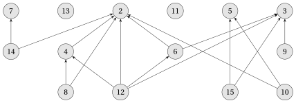

# Relazioni binarie

**Parte 1 · Numeri e logica · Capitolo 4** · dalle dispense di Fabio Furini · [:material-file-pdf-box: Dispensa del volume (PDF)](../pdf/dispensa-1-numeri.pdf) · [:material-presentation: Slide (PDF)](../pdf/slide-numeri-04-relazioni-binarie.pdf)

## 1. Relazioni binarie

!!! definizione "Definizione 1: di relazione binaria"

    Dati due insiemi $\red{A}$ e $\blue{B}$,  una  <strong>relazione binaria</strong> $\violet{R}$  è un sottoinsieme del prodotto cartesiano  $\red{A} \times \blue{B}$

!!! chiave ""

    Quando diciamo che $\violet{R}$ è una relazione binaria di un solo insieme  $\red{A}$,  intendiamo che  $\violet{R}$ è un sottoinsieme di  $\red{A} \times \red{A}$.

- Chiameremo  semplicemente relazione una relazione binaria (esistono però anche relazioni non binarie).

!!! esempio "Esempio 1"

    - La  relazione “minore di” (“$<$”) dei numeri naturali è l'insieme :

        $$
        R_{<}= \bigg\{ (a,b): a,b \in \mathbb{N} {\rm~~e~~} a < b \bigg\}.
        $$

    - La  relazione “minore o uguale  di” (“$\le$”) dei numeri naturali è l'insieme :

        $$
        R_{\le}= \bigg\{ (a,b): a,b \in \mathbb{N} {\rm~~e~~} a \le b \bigg\}.
        $$

    - La relazione   “è sottoinsieme di” $R_{\subseteq}$ dell'insieme delle parti dei numeri naturali (indicato con $2^{\mathbb{N}}$ ) è l'insieme:

        $$
        R_{\subseteq} = \bigg\{ (A,B): A,B \in 2^\mathbb{N} {\rm ~~e~~} A \subseteq B \bigg\}.
        $$

!!! chiave ""

    - Una relazione   $\violet{R} \subseteq \red{A} \times \red{A}$ è <strong>riflessiva</strong> se:

        $$
        \forall a \in \red{A},\qquad (a,a) \in \violet{R}
        $$

    - Una relazione  $\violet{R} \subseteq \red{A} \times \red{A}$ è <strong>simmetrica</strong> se:

        $$
        \forall a,b \in \red{A}, \qquad (a,b) \in \violet{R} ~~\Rightarrow~~ (b,a) \in \violet{R}
        $$

    - Una relazione  $\violet{R} \subseteq \red{A} \times \red{A}$ è <strong>transitiva</strong> se:

        $$
        \forall a,b,c \in \red{A}, \qquad (a,b) \in \violet{R} {\rm~~~e~~~} (b,c) \in \violet{R} ~~\Rightarrow~~ (a,c) \in \violet{R}
        $$

!!! esempio "Esempio 2"

    - La relazione   $R_{\le}$ è riflessiva, ma  $R_{<}$ non lo è.

    - Le relazioni $R_{<}$ e $R_{\le}$ non sono simmetriche.

    - Le relazioni  $R_{<}$, e $R_{\le}$  sono transitive,  ma ad esempio la relazione:

        $$
        R^1_{ab} = \bigg\{ (a,b): a,b \in \mathbb{N} {\rm ~~e~~} a =b-1 \bigg\}
        $$

        non lo è, e.g.,  $(3,4) \in R^1_{ab}$ e $(4,5) \in R^1_{ab}$ ma  $(3,5) \notin R^1_{ab}$.

## 2. Relazioni d'ordine parziale

!!! chiave ""

    - Una relazione   $\violet{R} \subseteq \red{A} \times \red{A}$ è <strong>antisimmetrica</strong> se:

        $$
        \forall a,b \in \red{A}, ~~~~(a,b) \in \violet{R} {\rm~~~e~~~} (b,a) \in \violet{R} ~~\Rightarrow~~  a=b
        $$

!!! esempio "Esempio 3"

    - La relazione  $R_{\le}$ è  antisimmetrica, dato che  $a \le b$ e $b \le a$ implicano $a=b$.

!!! definizione "Definizione 2: di relazioni d'ordine parziale"

    Una relazione riflessiva,  antisimmetrica e  transitiva è una <strong>relazione d'ordine parziale</strong>.

!!! esempio "Esempio 4"

    - La relazione   $R_{\le}$ è una relazione d'ordine parziale,  ma  la relazione $R_{<}$ non lo è in quanto non è riflessiva.

!!! osservazione "Osservazione 1"

    La relazione  $R_{\subseteq}$ è una relazione d'ordine parziale

??? dimostrazione "Dimostrazione"

    Dobbiamo provare che la relazione sia riflessiva,  antisimmetrica e transitiva.

    - Per essere riflessiva  dobbiamo provare che  $(S,S) \in R_{\subseteq}$, cosa che è vera dato che  $S \subseteq S$.

    - Per essere antisimmetrica dobbiamo provare  che se $S_1  \neq S_2$ allora  $S_1 \nsubseteq S_2$ o $S_2 \nsubseteq S_1$ o entrambe,  la negazione della proprietà desiderata.  Dato che $S_1  \neq S_2$:

        - **** o esiste qualche elemento che è in $S_1$ ma non è in $S_2$,   quindi $S_1 \nsubseteq S_2$

        - **** o esiste qualche elemento che è in $S_2$ ma non è in $S_1$,   quindi  $S_2 \nsubseteq S_1$

        - **** oppure entrambe le opzioni precedenti

    - Per essere transitiva  dobbiamo provare che $(S_1,S_2) \in R_{\subseteq}$ e  $(S_2,S_3) \in R_{\subseteq}$ implica $(S_1,S_3) \in  R_{\subseteq}$.  Chiaramente,  dato che  $S_1 \subseteq S_2$ e $S_2 \subseteq S_3$,  abbiamo   $S_1 \subseteq S_3$.

    
□

!!! definizione "Definizione 3: di insieme parzialmente ordinato"

    Si definisce <strong>insieme parzialmente ordinato</strong>  la coppia costituita da un insieme e da una relazione d'ordine parziale  definita su di esso.

!!! esempio "Esempio 5"

    - L'insieme dei numeri naturali,   razionali o reali con la relazione  $R_{\le}$ sono insiemi parzialmente ordinati.

    - La relazione  “è discendente di” definita su un sottoinsieme delle persone è una relazione d'ordine parziale (se consideriamo gli individui come discendenti di loro stessi).  Di conseguenza il sottoinsieme di persone considerato con la relazione “è discendente di” è un insieme parzialmente ordinato.

!!! chiave ""

    Le relazioni possono essere rappresentate da un <strong>grafo direzionato</strong>,  dove i <strong>vertici</strong> sono gli elementi dell'insieme su cui è definita la relazione $R$ e un <strong>arco</strong>  $(a,b)$ significa che  $(a,b) \in R$.   Se il grafo è aciclico allora la relazione è una relazione d'ordine parziale.

!!! esempio "Esempio 6"

    Il grafo direzionato aciclico associato  alla relazione $R_{\subseteq}$ dell'insieme $\{1,2,3,4\} \subseteq \mathbb{N}$ è il seguente (gli insiemi formati da un solo numero e l'insieme vuoto non sono rappresentati nella figura):

    { .fig loading=lazy style="width:90%" }

!!! chiave ""

    - In un insieme parzialmente ordinato potrebbe non esserci un unico <strong>elemento massimo</strong>, ovvero un elemento $a$ tale che:

        $$
        \forall b \in A, \qquad (b,a) \in R
        $$

        Un insieme parzialmente ordinato potrebbe quindi contenere diversi elementi massimali $a$ tali che,  per nessun $b \in A$,  dove  $b \neq a$, abbiamo $(a,b) \in R$.

!!! esempio "Esempio 7"

    Il grafo direzionato aciclico associato  alla relazione di ordine parziale “è divisore di” dell'insieme $\{2,3,\dots,15\} \subseteq \mathbb{N}$ è il seguente :

    { .fig .ovale loading=lazy  }

!!! esempio "Esempio 8"

    Dato un insieme di scatole di dimensioni diverse, la relazione “una scatola è contenuta nell'altra” sull'insieme di scatole può contenere diverse scatole massime, ovvero scatole che non sono contenute  in nessuna altra scatola.

## 3. Relazioni d'ordine totale

!!! definizione "Definizione 4: di relazione totale"

    Una relazione  $\violet{R}$ di un insieme $\red{A}$ è una <strong>relazione totale</strong> se:

    $$
    \forall a, b \in A, \qquad (a, b) \in R  {\rm ~~~o~~~} (b, a) \in R {\rm ~~(o ~entrambi)}
    $$

!!! esempio "Esempio 9"

    - La relazione $R_{\le}$  è una relazione totale.

    - La relazione $R_{\subseteq}$ non è una relazione totale in quanto prendendo ad esempio $S_1=\{1, 2\}$ e $S_2=\{2, 3\}$,   $(S_1,S_2) \notin R_{\subseteq}$ e $(S_2,S_1) \notin R_{\subseteq}$.

    - La relazione  “è discendente di” non è una relazione totale in quanto esistono coppie di individui $(a,b)$ per cui né $a$ discende da $b$ né $b$ discende da $a$.

!!! definizione "Definizione 5: di relazione di ordine totale"

    Una relazione di ordine parziale che è anche una relazione totale è una <strong>relazione di ordine totale</strong>.

!!! esempio "Esempio 10"

    - La relazione  $R_{\le}$ è una relazione di ordine totale.

!!! definizione "Definizione 6: di insieme totalmente ordinato"

    Si definisce <strong>insieme totalmente ordinato</strong>  la coppia costituita da un insieme e da una relazione d'ordine totale definita su  di esso.

!!! esempio "Esempio 11"

    - Gli insiemi dei numeri naturali,   razionali o reali con la relazione  $R_{\le}$ sono insiemi totalmente ordinati.

## 4. Funzioni

!!! definizione "Definizione 7: di funzione"

    Dati due <em>insiemi</em> $\red{A}$ e $\blue{B}$, una <strong>funzione</strong> $\violet{f}$ è una <em>relazione binaria</em> su $\red{A}$ e $\blue{B}$ se, per ciascun $a \in \red{A}$, esiste uno e un solo  $b \in \blue{B}$ tale che  $(a, b) \in \violet{f}$.

!!! definizione "Definizione 8: di dominio e codominio"

    L'insieme $\red{A}$ è chiamato <strong>dominio</strong> di $\violet{f}$, e l'insieme $\blue{B}$ è chiamato <strong>codominio</strong> di $\violet{f}$.

- Scriviamo:

    $$
    \violet{f}:  \red{A} \rightarrow \blue{B}
    $$

    e se $(a, b) \in \violet{f}$, scriviamo:

    $$
    b = \violet{f}(a)
    $$

    dato che $b$ è univocamente determinato dalla scelta di $a$.

- Intuitivamente, la funzione $\violet{f}$ assegna un elemento di $\blue{B}$ a ciascun elemento di $\red{A}$. Nessun elemento di  $\red{A}$ è associato a due elementi differenti di $\blue{B}$. Lo stesso elemento di $\blue{B}$ può però essere assegnato a elementi differenti di  $\red{A}$.

!!! esempio "Esempio 12"

    - La relazione binaria:

        $$
        f = \bigg\{(a,b): a,b \in \mathbb{N} {\rm ~~e~~} b= a \mod 2\bigg\}
        $$

        <u><em>è una funzione</em></u> $f: \mathbb{N} \rightarrow \{0,1\}$ dato che per tutti i  numeri naturali $a$, c'è esattamente un valore  $b \in \{0,1\}$ tale che $b = a \mod 2$. Per esempio,

        $$
        0 = f(0),~~~~ 1 = f (1),~~~~
        0 = f(2), \dots
        $$

!!! esempio "Esempio 13"

    - La relazione binaria

        $$
        g = \bigg\{(a,b): a,b \in \mathbb{N} {\rm ~~e~~}   a+b {\rm ~è~pari} \bigg\}
        $$

        <u><em>non è una funzione</em></u>, dato che per esempio (1, 3) e (1, 5) sono entrambi in $g$.  In altre parole   per  $a =1$, non abbiamo  uno e un solo $b$ tale che $(a,b) \in g$.

!!! definizione "Definizione 9: di argomento e valore"

    Data una funzione $\violet{f}: \red{A} \rightarrow \blue{B}$, se ${\viridian{b}} = \violet{f}(\orange{a})$, diciamo che  $\orange{a} \in \red{A}$ è l'argomento di $\violet{f}$ e che $\viridian{b} \in \blue{B}$ è il valore di $\violet{f}$ associato ad $\orange{a}$.

- Possiamo  <strong>definire una funzione</strong> <em>definendo direttamente il valore</em> per tutti gli <em>elementi</em> del suo <em>dominio</em>.

!!! esempio "Esempio 14"

    Per esempio, possiamo definire $f(n)=  2\:n$ per $n \in \mathbb{N}$, che significa:

    $$
    f = \big\{ (n,2\:n): n \in \mathbb{N} \big\} {~~e~~} f: \mathbb{N} \rightarrow \mathbb{N}
    $$
