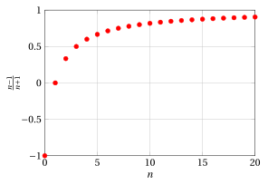

# Campi ordinati, estremo superiore/inferiore e assioma di continuità

**Parte 1 · Numeri e logica · Capitolo 5** · dalle dispense di Fabio Furini · [:material-file-pdf-box: Dispensa del volume (PDF)](../pdf/dispensa-1-numeri.pdf) · [:material-presentation: Slide (PDF)](../pdf/slide-numeri-05-campi-ordinati.pdf)

## 1. Proprietà $R_1$ e $R_2$

- Inizieremo ora a studiare più da vicino la <strong>struttura degli insiemi numerici</strong> che abbiamo introdotto in precedenza, ed in particolare:  l'insieme $\mathbb{Q}$ dei <strong>numeri razionali</strong> e l'insieme $\mathbb{R}$ dei <strong>numeri reali</strong>.

- Indichiamo con $a$, $b$, $c$ tre generici numeri <strong>razionali</strong> o <strong>reali</strong>.

!!! chiave ""

    - **$R_1 \rightarrow$** È definita in $\mathbb{Q}$ e  $\mathbb{R}$   un'operazione (detta <strong>addizione</strong> o <strong>somma</strong>) che ha le seguenti quattro proprietà:

    - **1** $\forall a,b, \quad a+b = b+a~~~~$  (<strong>proprietà commutativa</strong>)

    - **2** $\forall a,b,c, \quad (a+b)+c = a+(b+c)~~~~$  (<strong>proprietà associativa</strong>)

    - **3** esiste un elemento <strong>neutro della somma</strong>, indicato con $0$, tale che:

        $$
        \forall a, ~~  a+0=a
        $$

    - **4** per ogni $a$ esiste un elemento <strong>inverso</strong> di $a$ <strong>rispetto alla somma</strong>, detto <strong>opposto</strong> di $a$ e indicato con $-a$, tale che:

        $$
        a + (-a) =0
        $$

!!! chiave ""

    - **$R_2 \rightarrow$** È definita in $\mathbb{Q}$ e  $\mathbb{R}$ un'operazione (detta <strong>moltiplicazione</strong> o <strong>prodotto</strong>) che ha le seguenti quattro proprietà:

    - **1** $\forall a,b, ~~$ $a \cdot b = b \cdot a~~~~$  (<strong>proprietà commutativa</strong>)

    - **2** $\forall a,b,c, ~~$  $(a \cdot b) \cdot c = a \cdot (b\cdot c)~~~~$  (<strong>proprietà associativa</strong>)

    - **3** esiste un elemento <strong>neutro del prodotto</strong>, indicato con $1$, tale che:

        $$
        \forall a, ~~ a \cdot 1=a
        $$

    - **4** per ogni $a \neq 0$ esiste un elemento <strong>inverso</strong> di $a$ <strong>rispetto al prodotto</strong>, detto <strong>reciproco</strong> di $a$ e indicato con $a^{-1}$, tale che:

        $$
        a \cdot a^{-1}  = 1
        $$

- Le operazioni di somma e prodotto sono legate dalla seguente proprietà:

    !!! chiave ""

        - ****

            $$
            \forall a,b,c,  \qquad (a +b) \cdot c = a \cdot c + b \cdot c  \qquad ({\rm proprietà ~~\textbf{distributiva}})
            $$

- Dalle proprietà $R_1$ e $R_2$ discende la <strong>possibilità di eseguire senza restrizioni le quattro operazioni fondamentali</strong>:

    1. <strong>addizione</strong> e <strong>moltiplicazione</strong> (sopra definite)

    2. <strong>sottrazione</strong>, ponendo:

        $$
        a - b = a + (-b)
        $$

    3. <strong>divisione</strong>, ponendo:

        $$
        a / b = a \cdot b^{-1} {\rm~~~purché~~sia~} b \neq 0
        $$

## 2. Grandezze commensurabili

!!! chiave ""

    In matematica con la parola <strong>grandezza</strong> si intende una <strong>proprietà</strong> di una <strong>figura geometrica</strong> che può essere <strong>misurata</strong>. Sono esempi di grandezze: la lunghezza di un segmento, la misura di un angolo, l'area di una figura piana o il volume di un solido.

!!! definizione "Definizione 1: di grandezze omogenee"

    Due grandezze sono <strong>omogenee</strong> se hanno la stessa dimensione, cioè se si possono esprimere mediante la stessa unità di misura.

- La lunghezza di un segmento e l'altezza di un solido sono due grandezze omogenee infatti entrambe si possono esprimere con una stessa unità di misura della lunghezza.

- L'area di un quadrato e il volume di un cono non sono grandezze omogenee, infatti l'area si esprime in metri quadrati o in altre misure di superficie che però non possono essere usate per esprimere il volume.

!!! definizione "Definizione 2: di grandezze commensurabili e incommensurabili"

    Si dicono <strong>commensurabili</strong> due grandezze omogenee $a$ e $b$ il cui rapporto è un numero razionale, i.e.,  se ${a}/{b}  \in \mathbb{Q}$.  Si dicono invece <strong>incommensurabili</strong> se il loro rapporto non è un numero razionale,  i.e.,  se ${a}/{b}  \notin \mathbb{Q}$.

!!! esempio "Esempio 1: di grandezze commensurabili"

    Il volume di una sfera e il volume del cilindro circoscritto alla sfera sono commensurabili. In formule, il volume della sfera $V_s$ in funzione del suo raggio $r$ si ottiene con  la formula:

    $$
    V_s =\frac{4}{3} \: \pi \: r^3
    $$

    Il cilindro ad essa circoscritto ha il raggio del cerchio di base congruente al raggio $r$ della sfera e l'altezza $h$ congruente al doppio del raggio. Il volume $V_c$ di questo  cilindro  si ottiene quindi con la formula:

    $$
    V_c =\pi \: r^2 \: h = \pi \: r^2 \: 2 \: r = 2 \: \pi \: r^3
    $$

    Facendo il rapporto otteniamo:

    $$
    \frac{V_s}{V_c} = \frac{\frac{4}{3} \: \pi \: r^3}{2 \: \pi \: r^3}= \frac{2}{3} \in \mathbb{Q}
    $$

!!! esempio "Esempio 2: di grandezze incommensurabili"

    La lunghezza della circonferenza e la lunghezza del suo diametro sono incommensurabili. In formule, denotiamo con $d$ il diametro della circonferenza e con $c$ la lunghezza della circonferenza, abbiamo:

    $$
    c = \pi \: d
    $$

    Ora facendo il rapporto fra la lunghezza della circonferenza e il suo diametro otteniamo:

    $$
    \frac{c}{d}=\frac{\pi \: d}{d} = \pi \notin \mathbb{Q}
    $$

    Una dimostrazione che $\pi \notin \mathbb{Q}$ verrà data in seguito.

## 3. Rappresentazione geometrica di $\mathbb{Q}$

!!! chiave ""

    Una rappresentazione di tipo geometrico di $\mathbb{Q}$ si può ottenere associando a ogni numero razionale un punto della <strong>retta euclidea</strong> (immaginabile come una linea nel piano di lunghezza infinita)

- Ad un punto della retta euclidea, scelto arbitrariamente, si associa $0$ e a un altro, distinto dal primo, si associa $1$, individuando così il segmento orientato $01$ che costituisce l'<strong>unità di misura</strong>

- A questo punto si ha una <strong>corrispondenza biunivoca</strong> tra i numeri razionali e quei punti $P$ della retta che sono estremi dei segmenti orientati $0P$ <strong>commensurabili</strong>  con $01$. Sono chiaramente commensurabili dato che:

    $$
    \frac{P}{1} \in \Q {\rm ~~~con~~~} P \in \Q
    $$

{ .fig .ovale loading=lazy style="width:80%" }

## 4. Relazioni di ordine totale

!!! osservazione "Osservazione 1"

    Gli insiemi dei numeri razionali $~\Q$ e dei numeri reali $~\R$ con la relazione “minore o uguale  di” (“$\le$”) sono insiemi totalmente ordinati.

- Le  relazioni “minore o uguale  di” (“$\le$”) per l'insieme dei numeri razionali o reali :

    $$
    R_{\le}= \bigg\{ (a,b): a,b \in \mathbb{Q} {\rm~~~~e~~~~} a \le b \bigg\}, \qquad ~~~R_{\le}= \bigg\{ (a,b): a,b \in \mathbb{R} {\rm~~~~e~~~~} a \le b \bigg\}
    $$

    sono <strong>relazioni d'ordine parziale</strong>. Ovvero verificano le seguenti proprietà:

    !!! chiave ""

        1. $\forall a, \quad a \le a   \qquad ({\rm proprietà ~~\textbf{riflessiva}})$

        2. $\forall a,b, \quad  a \le b {\rm~~~~e~~~~} b \le a ~~\Rightarrow~~ a =  b   \qquad ({\rm proprietà ~~\textbf{antisimmetrica}})$

        3. $\forall a,b,c, \quad  a \le b {\rm~~~~e~~~~} b \le c ~~\Rightarrow~~ a \le  c   \qquad ({\rm proprietà ~~\textbf{transitiva}})$

    Inoltre le relazioni “minore o uguale  di” (“$\le$”) per $\Q$ e $\R$ sono <strong>relazioni totali</strong> in quanto:

    !!! chiave ""

        1. $\forall a,b, \qquad a \le b {\rm~~~~o~~~~} b \le a$

- Di conseguenza la coppia costituita dall'insieme $\Q$ o $\R$ e dalla corrispettiva relazione $R_{\le}$ diventa un insieme totalmente ordinato.

## 5. Proprietà $R_3$

- Mettiamo ora in evidenza le proprietà dell'ordinamento dei numeri razionali o reali:

    !!! chiave ""

        - **$R_3 \rightarrow$** È definita in $\mathbb{Q}$ e $\mathbb{R}$  la   relazione d'ordine totale “minore o uguale  di” (“$\le$”) compatibile con la struttura algebrica [^1], cioè:

            1. $\forall a,b, c,\qquad a \le b ~~\Rightarrow~~ a +  c  \le b +c$

            2. $\forall a,b,c > 0, \qquad  a \le b ~~\Rightarrow~~ a \cdot  c  \le b \cdot c$

- Osserviamo che tutte le regole  del calcolo algebrico derivano dalle proprietà: $R_1$, $R_2$, $R_3$.

!!! esempio "Esempio 3"

    Ad esempio tutte le usuali procedure con cui si risolvono le disequazioni sono  conseguenza degli  assiomi e delle proprietà algebriche della somma e del prodotto, espresse da $R_1$ e $R_2$.

## 6. Campi ordinati

!!! definizione "Definizione 3: di campo (ordinato)"

    Un <strong>campo ordinato</strong> è un insieme in cui sono definite due operazioni (somma e prodotto) e una relazione d'ordine totale, che soddisfano  le proprietà $R_1$, $R_2$, $R_3$. Un insieme con solo le proprietà $R_1$, $R_2$ si dice <strong>campo</strong>.

- Tutto ciò che abbiamo detto fin qui riguardo alle operazioni di somma e prodotto e alla relazione d'ordine totale “minore o uguale  di” (“$\le$”) vale sia per l'insieme dei numeri razionali che per l'insieme dei numeri reali.

!!! osservazione "Osservazione 2"

    Gli insiemi dei numeri razionali $~\Q$ e dei numeri reali $~\R$ sono campi ordinati.

- Da questo punto di vista, quindi, $\mathbb{Q}$ ed $\mathbb{R}$ appaiono dotati di proprietà simili.   Evidenzieremo nel seguito qual è la <strong>proprietà che distingue sostanzialmente</strong> $\mathbb{R}$ da $\mathbb{Q}$ e che rende $\mathbb{R}$ l'<strong>ambiente giusto per sviluppare l'analisi matematica</strong>.

- Iniziamo osservando che l'<strong>insieme dei numeri razionali è inadeguato ad esprimere le lunghezze dei segmenti</strong> (ma anche le aree, i volumi, i tempi, le velocità ecc.)

!!! chiave ""

    Come abbiamo visto esistono grandezze che non sono <strong>commensurabili</strong> tra loro. L'esempio classico è dato dalla diagonale e dal lato di un quadrato: se il lato misura 1, l'ascissa $d$ che misura la diagonale non è un numero razionale.

    { .fig .ovale loading=lazy style="width:80%" }

    Infatti, per il Teorema di Pitagora abbiamo:

    $$
    d^2 = 1^2 + 1^2 = 2
    $$

    ma, come abbiamo visto, non esiste un numero razionale il cui quadrato è $2$. Dunque il punto $d$ sulla retta non è il rappresentante di alcun numero razionale. Ciò significa che, dopo aver “occupato” i punti della retta con i numeri razionali, su di essa rimangono ancora dei <strong>posti vuoti</strong>.

## 7. Insiemi limitati, massimi e minimi

!!! definizione "Definizione 4: di insieme limitato"

    Sia $E$ un insieme contenuto in $\Q$ o in $\R$. L'insieme $E$ si dice <strong>limitato</strong>  se esistono due numeri $m$ e $M$,  tali che:

    $$
    \forall x \in E, \qquad m \le x \le M \qquad
    $$

- $E$ è <strong>limitato inferiormente</strong> se esiste un numero $m$ tale che:

    $$
    \forall x \in E, \qquad m \le x  \qquad
    $$

- $E$ è <strong>limitato superiormente</strong> se esiste un numero $M$ tale che:

    $$
    \forall x \in E, \qquad x \le M \qquad
    $$

- Non fa differenza imporre che $m$ e/o $M$ appartengano a $\Q$ o a $\R$ in quanto la condizione è soltanto di esistenza di tali numeri.

!!! definizione "Definizione 5: di massimo e minimo di un insieme"

    Un elemento $x_{M} \in E$ si chiama <strong>massimo</strong> di $E$ se:

    $$
    \forall x \in E, \qquad x \le x_{M}
    $$

    Un elemento $x_m \in E$ si chiama <strong>minimo</strong> di  $E$ se:

    $$
    \forall x \in E, \qquad x_m \le x
    $$

!!! chiave ""

    L'esistenza del massimo e del minimo per un insieme implica che l'insieme è limitato, ovvero:

    \begin{equation}
    {\rm ~~esistenza~di~massimo~e~minimo~} ~~\Rightarrow~~ {\rm ~~insieme~limitato~} \label{BBB}
    \end{equation}

    ma il viceversa non è vero (daremo più avanti un controesempio):

    \begin{equation}
    {\rm ~~insieme~limitato~}  ~~\nRightarrow~~  {\rm ~~esistenza~di~massimo~e~minimo~} 
     \label{CCC}
    \end{equation}

    Quindi il fatto che un insieme sia limitato è condizione necessaria ma non sufficiente al fatto che l'insieme ammetta massimo e minimo. Inoltre l'esistenza di massimo e minimo è condizione sufficiente ma non necessaria al fatto che un insieme sia limitato.  

    Dalla contronominale o implicazione inversa  di \(\eqref{BBB}\) abbiamo:

    $$
    {\rm ~~insieme~non~limitato~}   ~~\Rightarrow~~ {\rm ~~non~esistenza~di~massimo~e~minimo~}
    $$

    ovvero se un insieme non è limitato non ha massimo o non ha minimo.

!!! esempio "Esempio 4: di massimi e minimi"

    
<table>
    <tr>
    <td>Esempio</td>
    <td>insieme \(E\)</td>
    <td>minimo</td>
    <td>massimo</td>
    </tr>
    <tr>
    <td>I)</td>
    <td>\(\mathbb{N}\)</td>
    <td>\(0\)</td>
    <td>non esiste</td>
    </tr>
    <tr>
    <td>II)</td>
    <td>numeri interi pari</td>
    <td>non esiste</td>
    <td>non esiste</td>
    </tr>
    </table>

!!! esempio "Esempio 5: di massimi e minimi"

    
<table>
    <tr>
    <td>Esempio</td>
    <td>insieme \(E\)</td>
    <td>minimo</td>
    <td>massimo</td>
    </tr>
    <tr>
    <td>III)</td>
    <td>\(\bigg\{~~\frac{1}{n} ~~:~~ n \in \mathbb{N}\setminus \{0\}~~\bigg\}\)</td>
    <td>non esiste</td>
    <td>1</td>
    </tr>
    </table>

    { .fig .ovale loading=lazy style="width:58%" }

!!! esempio "Esempio 6: di massimi e minimi"

    
<table>
    <tr>
    <td>Esempio</td>
    <td>insieme \(E\)</td>
    <td>minimo</td>
    <td>massimo</td>
    </tr>
    <tr>
    <td>IV)</td>
    <td>\(\bigg\{~~\frac{n-1}{n+1} ~~:~~ n \in \mathbb{N}~~\bigg\}\)</td>
    <td>\-1</td>
    <td>non esiste</td>
    </tr>
    </table>

    Abbiamo:

    $$
    \frac{n-1}{n+1} = \frac{n+1-1-1}{n+1}=1-\frac{2}{n+1}
    $$

    { .fig .ovale loading=lazy style="width:58%" }

!!! chiave ""

    Si osservi che talvolta, pur essendo l'insieme limitato, esso può non possedere massimo o minimo.

!!! esempio "Esempio 7: di massimi e minimi"

    
<table>
    <tr>
    <td>Esempio</td>
    <td>insieme \(E\)</td>
    <td>minimo</td>
    <td>massimo</td>
    </tr>
    <tr>
    <td>V)</td>
    <td>\(\left\{ x \in \mathbb{R}:~~ 27 \le  x^3 \right\}\)</td>
    <td>3</td>
    <td>non esiste</td>
    </tr>
    </table>

    Abbiamo:

    $$
    27 \le  x^3 \Longleftrightarrow \sqrt[3]{27}=3 \le  x {\rm ~~~~e~~~} 3 \in E
    $$

!!! esempio "Esempio 8: di massimi e minimi"

    
<table>
    <tr>
    <td>Esempio</td>
    <td>insieme \(E\)</td>
    <td>minimo</td>
    <td>massimo</td>
    </tr>
    <tr>
    <td>VI)</td>
    <td>\(\left\{ x \in \mathbb{Q}:~~ x \ge 0,  x  < \sqrt{2}   \right\}\)</td>
    <td>0</td>
    <td>non esiste</td>
    </tr>
    </table>

    Il valore $\sqrt{2}$ è irrazionale quindi troncando otteniamo  numeri razionali che si avvicinano sempre di più a $\sqrt{2}$ nessuno con la proprietà di essere massimo. 

    { .fig .ovale loading=lazy style="width:50%" }

    È un esempio di insieme limitato ma che non ammette massimo.

    
<table>
    <tr>
    <td>Esempio</td>
    <td>insieme \(E\)</td>
    <td>minimo</td>
    <td>massimo</td>
    </tr>
    <tr>
    <td>VII)</td>
    <td>\(\left\{ x \in \mathbb{Q}:~~  ~  x  > \sqrt{2}, x\le 4   \right\}\)</td>
    <td>non esiste</td>
    <td>4</td>
    </tr>
    </table>

    Il valore $\sqrt{2}$ è irrazionale quindi troncando e maggiorando otteniamo dei numeri razionali che si avvicinano sempre di più a $\sqrt{2}$ nessuno con la proprietà di essere minimo. 

    { .fig .ovale loading=lazy style="width:50%" }

    È un esempio di insieme limitato ma che non ammette minimo.

## 8. Maggioranti/minoranti e estremi superiori/inferiori

!!! definizione "Definizione 6: di maggioranti di un insieme"

    Sia $E$ un insieme contenuto in $\Q$ o in $\R$,  un numero $k$ appartenente a $\Q$ o a   $\R$ rispettivamente, si dice un <strong>maggiorante</strong>  di $E$  se:

    $$
    \forall x \in E, \qquad  x \le k
    $$

!!! definizione "Definizione 7: di minorante di un insieme"

    Sia $E$ un insieme contenuto in $\Q$ o in $\R$,  un numero $k$ appartenente a $\Q$ o a   $\R$ rispettivamente, si dice un <strong>minorante</strong>  di $E$  se:

    $$
    \forall x \in E, \qquad k \le  x
    $$

!!! chiave ""

    Osserviamo che un insieme superiormente (inferiormente) limitato ha molti maggioranti (minoranti). Inoltre  i maggioranti (minoranti) non appartengono necessariamente all'insieme stesso.

!!! definizione "Definizione 8: di estremo superiore"

    L' <strong>estremo superiore</strong> di $E$ ( indicato con $\sup E$)  è il minimo  dei maggioranti di $E$.

!!! definizione "Definizione 9: di estremo inferiore"

    L' <strong>estremo inferiore</strong> di $E$ ( indicato con $\inf E$)  è il massimo  dei minoranti di $E$.

!!! chiave ""

    Osserviamo che l'estremo superiore (inferiore) può non esistere (insiemi non limitati). Osserviamo inoltre  che se l'insieme possiede massimo (minimo), questo coincide con l'estremo superiore (inferiore).

!!! esempio "Esempio 9: di estremi superiori e inferiori"

    
<table>
    <tr>
    <td>Esempio</td>
    <td>insieme \(E\)</td>
    <td>\(\inf E\)</td>
    <td>\(\sup E\)</td>
    <td>minimo</td>
    <td>massimo</td>
    </tr>
    <tr>
    <td>I)</td>
    <td>\(\left\{ x \in \mathbb{Q}:~~ x \ge 0, x  < \sqrt{2}   \right\}\)</td>
    <td>0</td>
    <td>non esiste</td>
    <td>0</td>
    <td>non esiste</td>
    </tr>
    </table>

    Abbiamo:

    $$
    \sqrt{2} \notin E
    {\rm ~~~~e~~~} \sqrt{2} \notin \Q
    $$

    quindi massimo non esiste e nemmeno il $\sup$.

    
<table>
    <tr>
    <td>Esempio</td>
    <td>insieme \(E\)</td>
    <td>\(\inf E\)</td>
    <td>\(\sup E\)</td>
    <td>minimo</td>
    <td>massimo</td>
    </tr>
    <tr>
    <td>II)</td>
    <td>\(\left\{ x \in \mathbb{R}:~~ x \ge 0,  ~x  < \sqrt{2}   \right\}\)</td>
    <td>0</td>
    <td>\(\sqrt{2}\)</td>
    <td>0</td>
    <td>non esiste</td>
    </tr>
    </table>

    Abbiamo:

    $$
    \sqrt{2} \notin E
    {\rm ~~~~e~~~} \sqrt{2} \in \R
    $$

    ovvero il massimo non esiste ma $\sqrt{2}$ è il minimo dei maggioranti e quindi è il $\sup$.

## 9. Definizione assiomatica dei numeri reali

!!! chiave ""

    Si dice che un insieme numerico $X$ totalmente ordinato possiede la <strong>proprietà dell'estremo superiore</strong>, se:

    - **$R_4 \rightarrow$** Ogni insieme $E \subset X$  non vuoto e limitato superiormente possiede estremo superiore in $X$

- Si prova facilmente che, se vale questa proprietà, allora è anche vero che ogni sottoinsieme di $X$ non vuoto e inferiormente limitato ammette estremo inferiore.

- Non si richiede che $X$ stesso abbia estremo superiore (ad esempio, nel caso $X = \mathbb{Q}$ o $\mathbb{R}$ questo è certamente falso!) , ma che ogni sottoinsieme non vuoto superiormente limitato di $X$ ne sia provvisto.

!!! chiave ""

    L'esempio VI mostra che certamente $\mathbb{Q}$ non ha la proprietà dell'estremo superiore. Invece, $\mathbb{R}$ ha questa proprietà. [^2]

- Nella <strong>definizione assiomatica</strong> di $\mathbb{R}$, questa proprietà costituisce parte della definizione stessa di $\mathbb{R}$

!!! definizione "Definizione 10:  (assiomatica) dei numeri reali"

    Chiamiamo $\mathbb{R}$ un insieme che soddisfa le proprietà $R_1$, $R_2$, $R_3$, $R_4$, ossia un campo ordinato che ha la proprietà dell'estremo superiore

- La proprietà dell'estremo superiore prende anche il nome di <strong>assioma di Dedekind</strong>, <strong>o assioma di continuità</strong>, o <strong>assioma di completezza</strong> e si può enunciare anche nella seguente forma equivalente.

!!! chiave ""

    Sia $\{A, B\}$ una partizione di $\mathbb{R}$ (cioè $A$ e $B$ sono insiemi non vuoti e disgiunti la cui unione è $\mathbb{R}$); la partizione  si chiama <strong>sezione</strong> se:

    $$
    \forall a \in A {\rm ~~e~~} \forall b \in B {\rm ~~risulta~~} a < b.
    $$

    Allora si dimostra che:

    - **$R_4' \rightarrow$** Per ogni sezione $\{A, B\}$ di $\mathbb{R}$ esiste un unico numero reale $s$ (chiamato <strong>elemento separatore</strong>) tale che:

        $$
        \forall a \in A {\rm ~~e~~} \forall b \in B , \qquad a \le s \le b \qquad
        $$

    Tale elemento separatore è  il $\sup A$ e  l'$\inf B$, quindi $\sup A=\inf B$

## 10. Rappresentazione geometrica di $\mathbb{R}$

!!! chiave ""

    L'insieme dei numeri reali $\mathbb{R}$ può essere messo in corrispondenza biunivoca con i punti della retta euclidea?

- Ritorniamo ora al problema dell'incommensurabilità di lato e diagonale del quadrato. Quando, con riga e compasso, fissato il lato unitario del quadrato, ne costruiamo la diagonale e la riportiamo sulla retta di partenza, l'arco tracciato dal compasso "spezza la retta in due", generando quella che abbiamo chiamato una sezione;  l'elemento separatore, che esiste per l'assioma $R_4$ rappresenta geometricamente il punto di intersezione, e quindi quel numero misura la diagonale.

{ .fig .ovale loading=lazy style="width:80%" }

!!! chiave ""

    Quindi l'interpretazione geometrica della proprietà $R_4$ ci mostra come l'insieme $\mathbb{R}$ sia una rappresentazione adeguata della nostra idea intuitiva di retta, così adeguata che <strong>spesso in matematica si usa l'espressione  “la retta reale” per indicare</strong> $\mathbb{R}$, confondendo l'insieme numerico con la sua rappresentazione geometrica naturale.

[^1]: una struttura algebrica è un insieme, chiamato insieme sostegno (della struttura), munito di una o più operazioni
[^2]: Non presenteremo però una dimostrazione formale.
