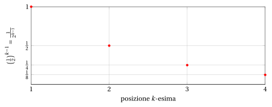

# Sommatorie e progressioni geometriche

**Parte 1 · Numeri e logica · Capitolo 7** · dalle dispense di Fabio Furini e Valerio Dose · [:material-file-pdf-box: PDF del capitolo](../pdf/numeri-07-sommatorie.pdf)

## 1. Sommatorie

!!! definizione "Definizione 1: di sommatoria"

    Siano $a_1 , a_2, \dots, a_n$ , $n$ numeri reali. La loro somma

    $$
    a_1 + a_2 + \dots + a_n
    $$

    si può indicare in forma compatta col simbolo di sommatoria:

    $$
    \sum_{k=1}^n a_k
    $$

    che si legge: “sommatoria per $i$ da $1$ a $n$ di $a_k$”. Il simbolo $k$ si dice indice di sommatoria.

- Il simbolo di sommatoria è dunque una pura e semplice stenografia, che tuttavia risulta molto utile quando i termini $a_k$ sono definiti esplicitamente in funzione dell'indice $k$.

!!! esempio "Esempio 1: sommatorie"

    \begin{align*}
    \sum_{k=1}^{10} \frac{1}{k} &~~=~~ 1 +\frac{1}{2} +\frac{1}{3} +\frac{1}{4} +\frac{1}{5} +\frac{1}{6} +\frac{1}{7} +\frac{1}{8} +\frac{1}{9} +\frac{1}{10} \\[2ex]
     \sum_{k=3}^{n} k^2 &~~=~~ 3^2 +4^2 +5^2 + \dots +n^2
    \end{align*}

- L'indice di sommatoria è un <strong>indice muto</strong>. Questo vuol dire che se si sostituisce $k$ con $i$, $j$ o qualunque altro indice (in tutte le sue occorrenze) il valore della sommatoria non cambia.

!!! esempio "Esempio 2: indice muto"

    Abbiamo:

    $$
    \sum_{k=1}^{n} k^2 ~~=~~   \sum_{i=1}^{n} i^2
    $$

    in quanto i due simboli indicano la somma dei quadrati dei primi $n$ numeri naturali (senza lo zero).

    Invece, abbiamo:

    $$
    \sum_{k=1}^{n} k^2 ~~\neq~~   \sum_{k=1}^{m} k^2
    $$

    in quanto i due simboli indicano la somma, rispettivamente, dei primi $n$ oppure dei primi $m$ quadrati (se $n \neq m$ il risultato sarà diverso).

### 1.1 Principali proprietà delle sommatorie

!!! osservazione "Osservazione 1"

    Dato $c \in \R$, abbiamo:

    \begin{equation}
    \label{P1}
    \sum_{k=1}^n (c \cdot a_k) = c \: \sum_{k=1}^n a_k \qquad {\rm (prodotto~per~una~costante)}
    \end{equation}

    \begin{equation}
    \label{P2}
    \sum_{k=1}^n c  = c \cdot n   \qquad {\rm (sommatoria~con~termine~costante)}
    \end{equation}

??? dimostrazione "Dimostrazione"

    Prima proprietà \(\eqref{P1}\). Dalla proprietà distributiva abbiamo:

    $$
    \underbrace{c\: a_1 + c\: a_2 + \dots + c\: a_n}_{=\sum_{k=1}^n (c \cdot a_k)} = \underbrace{c \: (a_1+a_2+\dots+a_n)}_{= c \: \sum_{k=1}^n a_k}
    $$

    Seconda proprietà \(\eqref{P2}\):

    $$
    \underbrace{c\:  + c  + \dots + c\:}_{=\sum_{k=1}^n c {\rm ~~~~ovvero~} c {\rm ~sommato~} n {\rm ~volte}} = c \: n
    $$

    
□

!!! osservazione "Osservazione 2"

    Date due sommatorie $\sum_{k=1}^n a_k$ e $\sum_{k=1}^n b_k$, abbiamo:

    \begin{equation}
    \label{P3}
    \sum_{k=1}^n a_k  + \sum_{k=1}^n b_k = \sum_{k=1}^n (a_k + b_k)
    \end{equation}

??? dimostrazione "Dimostrazione"

    Abbiamo:

    $$
    \underbrace{a_1 +  a_2 + \dots + a_n +  b_1 +  b_2 + \dots +  b_n}_{=\sum_{k=1}^n a_k  + \sum_{k=1}^n b_k} = \underbrace{a_1 + b_1 +a_2 + b_2+\dots+a_n + b_n}_{=\sum_{k=1}^n (a_k + b_k) }
    $$

    
□

!!! osservazione "Osservazione 3"

    Dati due numeri naturali $n,m \in \N$, abbiamo:

    \begin{align}
    \label{P4}
    \sum_{k=1}^{n+m} a_k   &= \sum_{k=1}^{n} a_k + \sum_{k=n+1}^{n+m} a_k  \qquad {\rm (scomposizione)}\\[2ex]
    \label{P5}
    \sum_{k=1}^{n} a_k   &= \sum_{k=1+m}^{n+m} a_{k-m} =  \sum_{k=1-m}^{n-m} a_{k+m} \qquad {\rm (traslazione~di~indici)}\\[2ex]
    \label{P6}
    \sum_{k=1}^{n} a_k   &= \sum_{k=1}^{n} a_{n-k+1} = \sum_{k=0}^{n-1} a_{n-k} \qquad {\rm (riflessione~di~indici)}
    \end{align}

??? dimostrazione "Dimostrazione"

    Le tre proprietà sono semplicemente differenti scritture e/o ordinamenti dei termini delle sommatorie. □

### 1.2 Alcune sommatorie importanti

!!! osservazione "Osservazione 4: somma dei primi $n$ numeri naturali (senza lo zero)"

    Per ogni numero naturale $n \ge 1$, vale:

    $$
    \sum_{k=1}^{n} k = \frac{n \: (n+1)}{2}
    $$

??? dimostrazione "Dimostrazione"

    \begin{align*}
    \sum_{k=1}^{n} k &= \frac{1}{2} \left( \sum_{k=1}^{n} k + \sum_{k=1}^{n} k \right) = \frac{1}{2} \left( \sum_{k=1}^{n} k + \sum_{k=1}^{n} \big( n-k+1 \big) \right)\\[2ex]
     & = \frac{1}{2}  \; \sum_{k=1}^{n}  \big(k+ n-k+1 \big)
      = \frac{1}{2} \; \sum_{k=1}^{n}  \big(n +1  \big)
      = \frac{n \: (n+1)}{2}
    \end{align*}

    
□

!!! osservazione "Osservazione 5: somma dei primi $n$ numeri dispari"

    Per ogni numero naturale $n \ge 1$, vale:

    $$
    \sum_{k=1}^{n} (2\:k-1) = n^2 \quad {\rm ~~o~~~equivalentemente~~} \quad \sum_{k=0}^{n-1} (2\:k+1) = n^2
    $$

??? dimostrazione "Dimostrazione"

    Sfruttando le proprietà delle sommatoria abbiamo:

    \begin{align*}
    \sum_{k=1}^{n} (2\:k-1) &= 2\:\sum_{k=1}^{n} k - {\sum_{k=1}^{n} 1}\\[2ex]
        & = 2\:\left( \frac{n \: (n+1)}{2}  \right)- n 
         =  n^2 + n -n 
         =  n^2 \\[5ex]
     \sum_{k=0}^{n-1} (2\:k+1) &= 2\:\sum_{k=0}^{n-1} k + {\sum_{k=0}^{n-1} 1}\\[2ex]
     & = 2\:\sum_{k=1}^{n} (k-1) + n 
       = 2\:\left(\sum_{k=1}^{n} k - \sum_{k=1}^{n} 1 \right)+ n \\[2ex]
        & = 2\:\left( \frac{n \: (n+1)}{2} - n \right)+ n 
         =  n^2 + n - 2\:n + n 
         =  n^2
    \end{align*}

    
□

!!! osservazione "Osservazione 6: somma dei primi $n$ numeri pari (senza lo zero)"

    Per ogni numero naturale $n \ge 1$, vale:

    $$
    \sum_{k=1}^{n} 2\:k = n \: (n+1)
    $$

??? dimostrazione "Dimostrazione"

    \begin{align*}
    \sum_{k=1}^{n} 2\:k &= 2\:\sum_{k=1}^{n} k = 2 \left(\frac{n\:(n+1)}{2} \right) =  n \: (n+1)
    \end{align*}

    
□

## 2. Progressioni geometriche

!!! definizione "Definizione 2: di progressione geometrica"

    Una sequenza di numeri reali sono in <strong>progressione geometrica</strong> se il rapporto tra ogni termine (a partire dal secondo) e il precedente è costante. Tale costante si dice ragione della progressione.

!!! chiave ""

    Dato il primo termine $a \in \R$ e la ragione $q \in \R$, l'associata progressione geometrica è:

    $$
    a,~~ a \: q,~~ a \: q^2,~~ a \: q^3,~~ a \: q^4,~~ \dots
    $$

    Ogni termine (a partire dal secondo) si ottiene dal precendente moltiplicandolo per $q$. Il  $k$-esimo termine ($k \in \N$, $k \ge 1$) si può  scrivere $a\: q^{k-1}$ e abbiamo:

    \begin{align*}
    &a\: q^{1-1}=a\: q^0=a   &{\rm primo~termine,~in~posizione~} k=1\\
    &a\: q^{2-1}=a\: q^1=a\: q  &{\rm secondo~termine,~in~posizione~} k=2\\
    &a\: q^{3-1}=a\: q^2   &{\rm terzo~termine,~in~posizione~} k=3\\
    &a\: q^{4-1}=a\: q^3   &{\rm quarto~termine,~in~posizione~} k=4\\
    &\dots &   \dots
    \end{align*}

!!! esempio "Esempio 3: progressioni geometriche"

    - Con $a=1$ e $q=\frac{1}{2}$, i primi 4 termini sono:

        $$
        1,~~\frac{1}{2},~~\frac{1}{4},~~\frac{1}{8}
        $$

    { .fig .ovale loading=lazy style="width:85%" }

    - Con $a=1$ e $q=2$, i primi 4 termini sono:

        $$
        1,~~2,~~4,~~8
        $$

### 2.1 Sommatorie dei termini delle progressioni geometriche

!!! osservazione "Osservazione 7: somma dei primi $n$ termini della progressione geometrica ($a=1$)"

    Dato $q \in\ \R_+$, per ogni numero naturale $n \ge 1$ vale:

    \begin{equation}
    \label{GEOM}
    \sum_{k=1}^{n} q^{k-1} = 
    \begin{cases}
    \frac{q^{n}-1}{q-1} & {\rm ~~~se~~~~}  q \neq 1\\[2ex]
    n & {\rm ~~~altrimenti} 
    \end{cases}
    \end{equation}

??? dimostrazione "Dimostrazione"

    Se $q\neq 1$, proviamo l'equazione nella seguente forma equivalente:

    $$
    ({q-1}) \: \sum_{k=1}^{n} q^{k-1} = {q^{n} - 1}
    $$

    Applicando le proprietà delle sommatorie, si ha:

    \begin{align*}
    ({q-1}) \: \sum_{k=1}^{n} q^{k-1} &= q \: \sum_{k=1}^{n} q^{k-1} - \sum_{k=1}^{n} q^{k-1} =\\[2ex]
    & = \sum_{k=1}^{n} q^{k} - \sum_{k=1}^{n} q^{k-1} = \sum_{k=1}^n q^k - \sum_{k=0}^{n-1} q^{k} =\\[2ex]
    & =  \sum_{k=1}^{n-1} q^k + q^n - \left(1 + \sum_{k=1}^{n-1} q^k  \right) = q^{n}  - 1
    \end{align*}

    Se $q = 1$, abbiamo invece:

    $$
    \sum_{k=1}^{n} q^{k-1} = \sum_{k=1}^{n} 1 = n
    $$

    
□

- Dati $q \in\ \R_+, n \in \N, n \ge 1$ e $a \in \R$, la formula \(\eqref{GEOM}\) si estende come segue:

    \begin{equation}
    \sum_{k=1}^{n} a \; q^{k-1}  = 
    \begin{cases}
    a \; \left(\frac{q^{n}-1}{q-1} \right)& {\rm ~~~se~~~~}  q \neq 1\\[2ex]
    a \; n & {\rm ~~~altrimenti} 
    \end{cases}
    \qquad {\rm ~~dato~che~~~~}\sum_{k=1}^{n} a \; q^{k-1} = a \; \sum_{k=1}^{n}  q^{k-1}
    \end{equation}

    chiaramente:

    \begin{equation*}
    \frac{q^n-1}{q-1} = \frac{1-q^n}{1-q} {\rm ~~e~quindi~abbiamo~anche~~~~} \sum_{k=1}^{n} a \; q^k  = 
    \begin{cases}
    a \; \left(\frac{1-q^{n}}{1-q} \right)& {\rm ~~~se~~~~}  q \neq 1\\[2ex]
    a \; n & {\rm ~~~altrimenti} 
    \end{cases}
    \end{equation*}

!!! esempio "Esempio 4: somma dei primi $n$ termini di progressioni geometriche"

    - Con $a=1$ e $q=\frac{1}{2}$, i primi 4 termini sono:

        $$
        1,~~\frac{1}{2},~~\frac{1}{4},~~\frac{1}{8} \qquad {\rm ~~e~~} \qquad  1 + \frac{1}{2} + \frac{1}{4} + \frac{1}{8} = \frac{8+4+2+1}{8} = \frac{15}{8}
        $$

        la somma dei primi $n=4$ termini è data dalla formula:

        $$
        \sum_{k=1}^4  \left(\frac{1}{2}\right)^{k-1}= \sum_{k=1}^4\frac{1}{2^{k-1}} = \frac{1-\frac{1}{2^4}}{1-\frac{1}{2}} = \frac{1-\frac{1}{16}}{\frac{1}{2}}= \frac{15}{16} \; 2 = \frac{15}{8}
        $$

    - Con $a=1$ e $q=2$, i primi 4 termini sono:

        $$
        1,~~2,~~4,~~8 \qquad {\rm ~~e~~} \qquad  1 + 2+ 4 +8= 15
        $$

        la somma dei primi $n=4$ termini è data dalla formula:

        $$
        \sum_{k=1}^4  2^{k-1} = \frac{2^4-1}{2-1} = 16-1 =15
        $$
