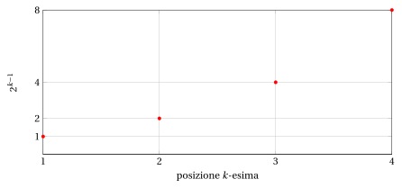
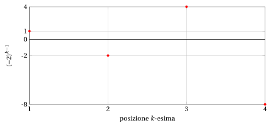
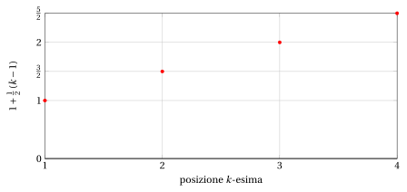
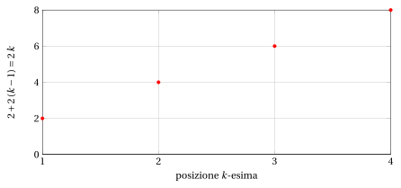

# Sommatorie, progressioni geometriche e aritmetiche

**Parte 1 · Numeri e logica · Capitolo 7** · dalle dispense di Fabio Furini · [:material-file-pdf-box: Dispensa del volume (PDF)](../pdf/dispensa-1-numeri.pdf) · [:material-presentation: Slide (PDF)](../pdf/slide-numeri-07-sommatorie.pdf)

## 1. Sommatorie

!!! definizione "Definizione 1: di sommatoria"

    Siano $a_1 , a_2, \dots, a_n$ , $n$ numeri reali. La loro somma

    $$
    a_1 + a_2 + \dots + a_n
    $$

    si può indicare in forma compatta col simbolo di sommatoria:

    $$
    \sum_{k=1}^n a_k
    $$

    che si legge: “sommatoria per $k$ da $1$ a $n$ di $a_k$”. Il simbolo $k$ si dice indice di sommatoria.

- Il simbolo di sommatoria è dunque una pura e semplice stenografia, che tuttavia risulta molto utile quando i termini $a_k$ sono definiti esplicitamente in funzione dell'indice $k$.

!!! esempio "Esempio 1: sommatorie"

    \begin{align*}
    \sum_{k=1}^{10} \frac{1}{k} &~~=~~ 1 +\frac{1}{2} +\frac{1}{3} +\frac{1}{4} +\frac{1}{5} +\frac{1}{6} +\frac{1}{7} +\frac{1}{8} +\frac{1}{9} +\frac{1}{10} \\[2ex]
     \sum_{k=3}^{n} k^2 &~~=~~ 3^2 +4^2 +5^2 + \dots +n^2
    \end{align*}

- L'indice di sommatoria è un <strong>indice muto</strong>. Questo vuol dire che se si sostituisce $k$ con $i$, $j$ o qualunque altro indice (in tutte le sue occorrenze) il valore della sommatoria non cambia.

!!! esempio "Esempio 2: indice muto"

    Abbiamo:

    $$
    \sum_{k=1}^{n} k^2 ~~=~~   \sum_{i=1}^{n} i^2
    $$

    in quanto i due simboli indicano la somma dei quadrati dei primi $n$ numeri naturali (senza lo zero).

    Invece, abbiamo:

    $$
    \sum_{k=1}^{n} k^2 ~~\neq~~   \sum_{k=1}^{m} k^2
    $$

    in quanto i due simboli indicano la somma, rispettivamente, dei primi $n$ oppure dei primi $m$ quadrati (se $n \neq m$ il risultato sarà diverso).

### 1.1 Principali proprietà delle sommatorie

!!! osservazione "Osservazione 1: prodotto per una costante"

    Data una sommatoria $\sum_{k=1}^n a_k$ e un numero reale $c \in \R$, abbiamo:

    \begin{equation}
    \label{P1}
    \sum_{k=1}^n (c \cdot a_k) = c \: \sum_{k=1}^n a_k
    \end{equation}

??? dimostrazione "Dimostrazione"

    Dalla proprietà distributiva abbiamo:

    $$
    \underbrace{c\: a_1 + c\: a_2 + \dots + c\: a_n}_{=\sum_{k=1}^n (c \cdot a_k)} = \underbrace{c \: (a_1+a_2+\dots+a_n)}_{= c \: \sum_{k=1}^n a_k}
    $$

    
□

!!! osservazione "Osservazione 2: sommatoria con termine costante"

    Per ogni numero naturale $n \ge 1$ e ogni numero reale $c \in \R$, abbiamo:

    \begin{equation}
    \label{P2}
    \sum_{k=1}^n c  = c \cdot n
    \end{equation}

??? dimostrazione "Dimostrazione"

    Abbiamo:

    $$
    \underbrace{c\:  + c  + \dots + c\:}_{=\sum_{k=1}^n c {\rm ~~~~ovvero~} c {\rm ~sommato~} n {\rm ~volte}} = c \: n
    $$

    
□

!!! osservazione "Osservazione 3: unione di sommatorie"

    Date due sommatorie $\sum_{k=1}^n a_k$ e $\sum_{k=1}^n b_k$, abbiamo:

    \begin{equation}
    \label{P3}
    \sum_{k=1}^n a_k  + \sum_{k=1}^n b_k = \sum_{k=1}^n (a_k + b_k)
    \end{equation}

??? dimostrazione "Dimostrazione"

    Abbiamo:

    $$
    \underbrace{a_1 +  a_2 + \dots + a_n +  b_1 +  b_2 + \dots +  b_n}_{=\sum_{k=1}^n a_k  + \sum_{k=1}^n b_k} = \underbrace{a_1 + b_1 +a_2 + b_2+\dots+a_n + b_n}_{=\sum_{k=1}^n (a_k + b_k) }
    $$

    
□

- Le tre proprietà che seguono (scomposizione, traslazione di indici e riflessione di indici) sono semplicemente differenti scritture e/o ordinamenti dei termini delle sommatorie.

!!! osservazione "Osservazione 4: scomposizione"

    Dati due numeri naturali $n \ge 1$ e $m \ge 1$, abbiamo:

    \begin{equation}
    \label{P4}
    \sum_{k=1}^{n+m} a_k   = \sum_{k=1}^{n} a_k + \sum_{k=n+1}^{n+m} a_k
    \end{equation}

??? dimostrazione "Dimostrazione"

    I termini della sommatoria $\sum_{k=1}^{n+m} a_k$ si raggruppano nei primi $n$ e negli ultimi $m$:

    $$
    \underbrace{a_1 + a_2 + \dots + a_n}_{=\sum_{k=1}^{n} a_k} + \underbrace{a_{n+1} + a_{n+2} + \dots + a_{n+m}}_{=\sum_{k=n+1}^{n+m} a_k} = \underbrace{a_1 + a_2 + \dots + a_n + a_{n+1} + \dots + a_{n+m}}_{=\sum_{k=1}^{n+m} a_k}
    $$

    
□

!!! osservazione "Osservazione 5: traslazione di indici"

    Data una sommatoria $\sum_{k=1}^{n} a_k$ e un numero naturale $m \ge 1$, abbiamo:

    \begin{equation}
    \label{P5}
    \sum_{k=1}^{n} a_k   = \sum_{k=1+m}^{n+m} a_{k-m} =  \sum_{k=1-m}^{n-m} a_{k+m}
    \end{equation}

??? dimostrazione "Dimostrazione"

    Nella sommatoria $\sum_{k=1+m}^{n+m} a_{k-m}$ l'indice $k$ varia da $1+m$ a $n+m$ e quindi l'indice $k-m$ varia da $1$ a $n$:

    $$
    \underbrace{a_{(1+m)-m} + a_{(2+m)-m} + \dots + a_{(n+m)-m}}_{=\sum_{k=1+m}^{n+m} a_{k-m}} = \underbrace{a_1 + a_2 + \dots + a_n}_{=\sum_{k=1}^{n} a_k}
    $$

    Allo stesso modo, nella sommatoria $\sum_{k=1-m}^{n-m} a_{k+m}$ l'indice $k$ varia da $1-m$ a $n-m$ e quindi l'indice $k+m$ varia da $1$ a $n$:

    $$
    \underbrace{a_{(1-m)+m} + a_{(2-m)+m} + \dots + a_{(n-m)+m}}_{=\sum_{k=1-m}^{n-m} a_{k+m}} = \underbrace{a_1 + a_2 + \dots + a_n}_{=\sum_{k=1}^{n} a_k}
    $$

    
□

!!! osservazione "Osservazione 6: riflessione di indici"

    Data una sommatoria $\sum_{k=1}^{n} a_k$, abbiamo:

    \begin{equation}
    \label{P6}
    \sum_{k=1}^{n} a_k   = \sum_{k=1}^{n} a_{n-k+1} = \sum_{k=0}^{n-1} a_{n-k}
    \end{equation}

??? dimostrazione "Dimostrazione"

    Nella sommatoria $\sum_{k=1}^{n} a_{n-k+1}$ l'indice $k$ varia da $1$ a $n$ e quindi l'indice $n-k+1$ varia da $n$ a $1$, cioè i termini sono gli stessi, elencati in ordine inverso:

    $$
    \underbrace{a_{n} + a_{n-1} + \dots + a_{1}}_{=\sum_{k=1}^{n} a_{n-k+1}} = \underbrace{a_1 + a_2 + \dots + a_n}_{=\sum_{k=1}^{n} a_k}
    $$

    Allo stesso modo, nella sommatoria $\sum_{k=0}^{n-1} a_{n-k}$ l'indice $k$ varia da $0$ a $n-1$ e quindi l'indice $n-k$ varia da $n$ a $1$:

    $$
    \underbrace{a_{n} + a_{n-1} + \dots + a_{1}}_{=\sum_{k=0}^{n-1} a_{n-k}} = \underbrace{a_1 + a_2 + \dots + a_n}_{=\sum_{k=1}^{n} a_k}
    $$

    
□

### 1.2 Alcune sommatorie importanti

!!! osservazione "Osservazione 7: somma dei primi $n$ numeri naturali (senza lo zero)"

    Per ogni numero naturale $n \ge 1$, vale:

    $$
    \sum_{k=1}^{n} k = \frac{n \: (n+1)}{2}
    $$

??? dimostrazione "Dimostrazione"

    Usando la riflessione di indici \(\eqref{P6}\) abbiamo:

    \begin{align*}
    \sum_{k=1}^{n} k &= \frac{1}{2} \left( \sum_{k=1}^{n} k + \sum_{k=1}^{n} k \right) = \frac{1}{2} \left( \sum_{k=1}^{n} k + \sum_{k=1}^{n} \big( n-k+1 \big) \right)\\[2ex]
     & = \frac{1}{2}  \; \sum_{k=1}^{n}  \big(k+ n-k+1 \big)
      = \frac{1}{2} \; \sum_{k=1}^{n}  \big(n +1  \big)
      = \frac{n \: (n+1)}{2}
    \end{align*}

    
□

!!! osservazione "Osservazione 8: somma dei primi $n$ numeri dispari"

    Per ogni numero naturale $n \ge 1$, vale:

    $$
    \sum_{k=1}^{n} (2\:k-1) = n^2 \quad {\rm ~~o~~~equivalentemente~~} \quad \sum_{k=0}^{n-1} (2\:k+1) = n^2
    $$

??? dimostrazione "Dimostrazione"

    Sfruttando le proprietà delle sommatorie abbiamo:

    \begin{align*}
    \sum_{k=1}^{n} (2\:k-1) &= 2\:\sum_{k=1}^{n} k - {\sum_{k=1}^{n} 1}\\[2ex]
        & = 2\:\left( \frac{n \: (n+1)}{2}  \right)- n 
         =  n^2 + n -n 
         =  n^2 \\[5ex]
     \sum_{k=0}^{n-1} (2\:k+1) &= 2\:\sum_{k=0}^{n-1} k + {\sum_{k=0}^{n-1} 1}\\[2ex]
     & = 2\:\sum_{k=1}^{n} (k-1) + n 
       = 2\:\left(\sum_{k=1}^{n} k - \sum_{k=1}^{n} 1 \right)+ n \\[2ex]
        & = 2\:\left( \frac{n \: (n+1)}{2} - n \right)+ n 
         =  n^2 + n - 2\:n + n 
         =  n^2
    \end{align*}

    
□

!!! osservazione "Osservazione 9: somma dei primi $n$ numeri pari (senza lo zero)"

    Per ogni numero naturale $n \ge 1$, vale:

    $$
    \sum_{k=1}^{n} 2\:k = n \: (n+1)
    $$

??? dimostrazione "Dimostrazione"

    \begin{align*}
    \sum_{k=1}^{n} 2\:k &= 2\:\sum_{k=1}^{n} k = 2 \left(\frac{n\:(n+1)}{2} \right) =  n \: (n+1)
    \end{align*}

    
□

- Le tre sommatorie importanti appena viste si dimostrano anche per induzione, nel capitolo «Principio di induzione».

## 2. Progressioni geometriche

!!! definizione "Definizione 2: di progressione geometrica"

    Una sequenza di numeri reali è in <strong>progressione geometrica</strong> se il rapporto tra ogni termine (a partire dal secondo) e il precedente è costante. Tale costante si dice ragione della progressione.

!!! chiave ""

    Dato il primo termine $a \in \R$ e la ragione $q \in \R$, l'associata progressione geometrica è:

    $$
    a,~~ a \: q,~~ a \: q^2,~~ a \: q^3,~~ a \: q^4,~~ \dots
    $$

    Ogni termine (a partire dal secondo) si ottiene dal precedente moltiplicandolo per $q$. Il  $k$-esimo termine ($k \in \N$, $k \ge 1$) si può  scrivere $a\: q^{k-1}$ e abbiamo:

    \begin{align*}
    &a\: q^{1-1}=a\: q^0=a   &{\rm primo~termine,~in~posizione~} k=1\\
    &a\: q^{2-1}=a\: q^1=a\: q  &{\rm secondo~termine,~in~posizione~} k=2\\
    &a\: q^{3-1}=a\: q^2   &{\rm terzo~termine,~in~posizione~} k=3\\
    &a\: q^{4-1}=a\: q^3   &{\rm quarto~termine,~in~posizione~} k=4\\
    &\dots &   \dots
    \end{align*}

!!! osservazione "Osservazione 10: termine $k$-esimo di una progressione geometrica"

    Dato il primo termine $a \in \R$ e la ragione $q \in \R$, indichiamo con $t_k$ il termine in posizione $k$ della progressione geometrica. La relazione ricorsiva che definisce la progressione è:

    \begin{equation}
    \label{GEOMREC}
    t_1 = a \qquad {\rm e} \qquad t_k = t_{k-1} \: q \qquad {\rm per~ogni~numero~naturale~} k \ge 2
    \end{equation}

    e la formula chiusa del termine $k$-esimo è:

    \begin{equation}
    \label{GEOMTERM}
    t_k = a \: q^{k-1} \qquad {\rm per~ogni~numero~naturale~} k \ge 1
    \end{equation}

??? dimostrazione "Dimostrazione"

    La formula chiusa \(\eqref{GEOMTERM}\) si ottiene applicando ripetutamente la relazione ricorsiva \(\eqref{GEOMREC}\):

    \begin{align*}
    t_1 &= a = a \: q^0\\[1ex]
    t_2 &= t_1 \: q = a \: q = a \: q^1\\[1ex]
    t_3 &= t_2 \: q = a \: q \: q  = a \: q^2\\[1ex]
    t_4 &= t_3 \: q = a \: q^2 \: q  = a \: q^3\\[1ex]
    &\vdots\\[1ex]
    t_k &= t_{k-1} \: q = a \: q^{k-2} \: q  = a \: q^{k-1}
    \end{align*}

    
□

!!! esempio "Esempio 3: progressioni geometriche"

    - Con $a=1$ e $q=\frac{1}{2}$, i primi 4 termini sono:

        $$
        1,~~\frac{1}{2},~~\frac{1}{4},~~\frac{1}{8}
        $$

    { .fig .ovale loading=lazy style="width:85%" }

    - Con $a=1$ e $q=2$, i primi 4 termini sono:

        $$
        1,~~2,~~4,~~8
        $$

    { .fig .ovale loading=lazy style="width:85%" }

!!! esempio "Esempio 4: progressione geometrica con ragione negativa"

    - Con $a=1$ e $q=-2$, i primi 4 termini sono:

        $$
        1,~~-2,~~4,~~-8
        $$

        Con ragione negativa i termini cambiano di segno a ogni passo: quelli in posizione dispari sono positivi, quelli in posizione pari sono negativi.

    { .fig .ovale loading=lazy style="width:85%" }

### 2.1 Sommatorie dei termini delle progressioni geometriche

!!! osservazione "Osservazione 11: somma dei primi $n$ termini della progressione geometrica ($a=1$)"

    Dato $q \in \R$, per ogni numero naturale $n \ge 1$ vale:

    \begin{equation}
    \label{GEOM}
    \sum_{k=1}^{n} q^{k-1} = 
    \begin{cases}
    \frac{q^{n}-1}{q-1} & {\rm ~~~se~~~~}  q \neq 1\\[2ex]
    n & {\rm ~~~altrimenti} 
    \end{cases}
    \end{equation}

??? dimostrazione "Dimostrazione"

    Se $q\neq 1$, proviamo l'equazione nella seguente forma equivalente:

    $$
    ({q-1}) \: \sum_{k=1}^{n} q^{k-1} = {q^{n} - 1}
    $$

    Applicando le proprietà delle sommatorie, in particolare il prodotto per una costante \(\eqref{P1}\) e la traslazione di indici \(\eqref{P5}\), si ha:

    \begin{align*}
    ({q-1}) \: \sum_{k=1}^{n} q^{k-1} &= q \: \sum_{k=1}^{n} q^{k-1} - \sum_{k=1}^{n} q^{k-1} =\\[2ex]
    & = \sum_{k=1}^{n} q^{k} - \sum_{k=1}^{n} q^{k-1} = \sum_{k=1}^n q^k - \sum_{k=0}^{n-1} q^{k} =\\[2ex]
    & =  \sum_{k=1}^{n-1} q^k + q^n - \left(1 + \sum_{k=1}^{n-1} q^k  \right) = q^{n}  - 1
    \end{align*}

    Dividendo per $q-1 \neq 0$ otteniamo:

    $$
    \sum_{k=1}^{n} q^{k-1} = \frac{q^{n}-1}{q-1}
    $$

    Se $q = 1$, abbiamo invece:

    $$
    \sum_{k=1}^{n} q^{k-1} = \sum_{k=1}^{n} 1 = n
    $$

    
□

- La dimostrazione non usa mai il segno della ragione: la formula \(\eqref{GEOM}\) vale per ogni $q \in \R$, positivo, nullo o negativo. L'unico caso da precisare è $q=0$: il primo addendo della sommatoria è $q^{1-1}=0^0$, che qui si intende uguale a $1$ (convenzione $0^0=1$). Con questa convenzione, per ogni $n \ge 1$ abbiamo:

    $$
    \sum_{k=1}^{n} 0^{k-1} = 1 + 0 + \dots + 0 = 1 \qquad {\rm ~~e~~} \qquad \frac{0^{n}-1}{0-1} = \frac{-1}{-1} = 1
    $$

    e quindi la formula \(\eqref{GEOM}\) resta vera.

- Dati $q \in \R, n \in \N, n \ge 1$ e $a \in \R$, la formula \(\eqref{GEOM}\) si estende come segue:

    \begin{equation}
    \sum_{k=1}^{n} a \; q^{k-1}  = 
    \begin{cases}
    a \; \left(\frac{q^{n}-1}{q-1} \right)& {\rm ~~~se~~~~}  q \neq 1\\[2ex]
    a \; n & {\rm ~~~altrimenti} 
    \end{cases}
    \qquad {\rm ~~dato~che~~~~}\sum_{k=1}^{n} a \; q^{k-1} = a \; \sum_{k=1}^{n}  q^{k-1}
    \end{equation}

    chiaramente:

    \begin{equation*}
    \frac{q^n-1}{q-1} = \frac{1-q^n}{1-q} {\rm ~~e~quindi~abbiamo~anche~~~~} \sum_{k=1}^{n} a \; q^{k-1}  = 
    \begin{cases}
    a \; \left(\frac{1-q^{n}}{1-q} \right)& {\rm ~~~se~~~~}  q \neq 1\\[2ex]
    a \; n & {\rm ~~~altrimenti}
    \end{cases}
    \end{equation*}

- La formula \(\eqref{GEOM}\) si dimostra anche per induzione, nel capitolo «Principio di induzione».

!!! esempio "Esempio 5: somma dei primi $n$ termini di progressioni geometriche"

    - Con $a=2$ e $q=\frac{1}{2}$, i primi 4 termini sono:

        $$
        2,~~1,~~\frac{1}{2},~~\frac{1}{4} \qquad {\rm ~~e~~} \qquad  2 + 1 + \frac{1}{2} + \frac{1}{4} = \frac{8+4+2+1}{4} = \frac{15}{4}
        $$

        la somma dei primi $n=4$ termini è data dalla formula:

        $$
        \sum_{k=1}^4  2 \; \left(\frac{1}{2}\right)^{k-1}= \sum_{k=1}^4 \frac{2}{2^{k-1}} = 2 \; \frac{1-\frac{1}{2^4}}{1-\frac{1}{2}} = 2 \; \frac{1-\frac{1}{16}}{\frac{1}{2}}= \frac{15}{16} \; 4 = \frac{15}{4}
        $$

    - Con $a=1$ e $q=\frac{1}{2}$, i primi 4 termini sono:

        $$
        1,~~\frac{1}{2},~~\frac{1}{4},~~\frac{1}{8} \qquad {\rm ~~e~~} \qquad  1 + \frac{1}{2} + \frac{1}{4} + \frac{1}{8} = \frac{8+4+2+1}{8} = \frac{15}{8}
        $$

        la somma dei primi $n=4$ termini è data dalla formula:

        $$
        \sum_{k=1}^4  \left(\frac{1}{2}\right)^{k-1}= \sum_{k=1}^4\frac{1}{2^{k-1}} = \frac{1-\frac{1}{2^4}}{1-\frac{1}{2}} = \frac{1-\frac{1}{16}}{\frac{1}{2}}= \frac{15}{16} \; 2 = \frac{15}{8}
        $$

    - Con $a=1$ e $q=2$, i primi 4 termini sono:

        $$
        1,~~2,~~4,~~8 \qquad {\rm ~~e~~} \qquad  1 + 2+ 4 +8= 15
        $$

        la somma dei primi $n=4$ termini è data dalla formula:

        $$
        \sum_{k=1}^4  2^{k-1} = \frac{2^4-1}{2-1} = 16-1 =15
        $$

    - Con $a=1$ e $q=-2$, i primi 4 termini sono:

        $$
        1,~~-2,~~4,~~-8 \qquad {\rm ~~e~~} \qquad  1 - 2+ 4 -8= -5
        $$

        la somma dei primi $n=4$ termini è data dalla formula:

        $$
        \sum_{k=1}^4  (-2)^{k-1} = \frac{(-2)^4-1}{-2-1} = \frac{16-1}{-3} = \frac{15}{-3} = -5
        $$

## 3. Progressioni aritmetiche

!!! definizione "Definizione 3: di progressione aritmetica"

    Una sequenza di numeri reali è in <strong>progressione aritmetica</strong> se la differenza tra ogni termine (a partire dal secondo) e il precedente è costante. Tale costante si dice ragione della progressione.

!!! chiave ""

    Dato il primo termine $a \in \R$ e la ragione $d \in \R$, l'associata progressione aritmetica è:

    $$
    a,~~ a + d,~~ a + 2\:d,~~ a + 3\:d,~~ a + 4\:d,~~ \dots
    $$

    Ogni termine (a partire dal secondo) si ottiene dal precedente sommandogli $d$. Il  $k$-esimo termine ($k \in \N$, $k \ge 1$) si può  scrivere $a + (k-1)\:d$ e abbiamo:

    \begin{align*}
    &a+ (1-1)\:d=a+0\:d=a   &{\rm primo~termine,~in~posizione~} k=1\\
    &a+ (2-1)\:d=a+1\:d=a+d  &{\rm secondo~termine,~in~posizione~} k=2\\
    &a+ (3-1)\:d=a+2\:d   &{\rm terzo~termine,~in~posizione~} k=3\\
    &a+ (4-1)\:d=a+3\:d   &{\rm quarto~termine,~in~posizione~} k=4\\
    &\dots &   \dots
    \end{align*}

- La progressione aritmetica è l'analogo additivo della progressione geometrica: nella progressione geometrica si <em>moltiplica</em> ogni termine per la ragione $q$, nella progressione aritmetica si <em>somma</em> a ogni termine la ragione $d$.

!!! osservazione "Osservazione 12: termine $k$-esimo di una progressione aritmetica"

    Dato il primo termine $a \in \R$ e la ragione $d \in \R$, indichiamo con $t_k$ il termine in posizione $k$ della progressione aritmetica. La relazione ricorsiva che definisce la progressione è:

    \begin{equation}
    \label{ARITREC}
    t_1 = a \qquad {\rm e} \qquad t_k = t_{k-1} + d \qquad {\rm per~ogni~numero~naturale~} k \ge 2
    \end{equation}

    e la formula chiusa del termine $k$-esimo è:

    \begin{equation}
    \label{ARITTERM}
    t_k = a + (k-1) \: d \qquad {\rm per~ogni~numero~naturale~} k \ge 1
    \end{equation}

??? dimostrazione "Dimostrazione"

    La formula chiusa \(\eqref{ARITTERM}\) si ottiene applicando ripetutamente la relazione ricorsiva \(\eqref{ARITREC}\):

    \begin{align*}
    t_1 &= a = a + 0 \: d\\[1ex]
    t_2 &= t_1 + d = a + d = a + 1 \: d\\[1ex]
    t_3 &= t_2 + d = a + d + d  = a + 2 \: d\\[1ex]
    t_4 &= t_3 + d = a + 2 \: d + d  = a + 3 \: d\\[1ex]
    &\vdots\\[1ex]
    t_k &= t_{k-1} + d = a + (k-2) \: d + d  = a + (k-1) \: d
    \end{align*}

    
□

- La formula chiusa \(\eqref{ARITTERM}\) si ottiene anche con il seguente ragionamento, che non richiede i puntini di sospensione. Scriviamo la relazione ricorsiva \(\eqref{ARITREC}\) nella forma $t_j - t_{j-1} = d$ per ogni posizione $j$ da $2$ a $k$:

    \begin{align*}
    t_2 - t_1 &= d \\[1ex]
    t_3 - t_2 &= d \\[1ex]
    t_4 - t_3 &= d \\[1ex]
    &\vdots\\[1ex]
    t_k - t_{k-1} &= d
    \end{align*}

    Sommiamo ora tutte queste $k-1$ uguaglianze. A destra sommiamo $d$ con sé stesso $k-1$ volte e otteniamo $d \: (k-1)$. A sinistra, la somma è <strong>telescopica</strong>: ogni termine compare due volte, una volta con il segno $+$ e una volta con il segno $-$, tranne $t_k$ e $t_1$:

    $$
    \underbrace{(t_2 - t_1) + (t_3 - t_2) + (t_4 - t_3) + \dots + (t_k - t_{k-1})}_{=\sum_{j=2}^{k} (t_j - t_{j-1})} = t_k - t_1 = t_k - a
    $$

    Uguagliando i due membri abbiamo $t_k - a = d \: (k-1)$, cioè la formula chiusa:

    $$
    t_k = a + (k-1) \: d \qquad {\rm per~ogni~numero~naturale~} k \ge 1
    $$

!!! esempio "Esempio 6: progressioni aritmetiche"

    - Con $a=1$ e $d=\frac{1}{2}$, i primi 4 termini sono:

        $$
        1,~~\frac{3}{2},~~2,~~\frac{5}{2}
        $$

    { .fig .ovale loading=lazy style="width:85%" }

    - Con $a=2$ e $d=2$, i primi 4 termini sono:

        $$
        2,~~4,~~6,~~8
        $$

        cioè i primi 4 numeri pari (senza lo zero).

    { .fig .ovale loading=lazy style="width:85%" }

### 3.1 Sommatorie dei termini delle progressioni aritmetiche

!!! osservazione "Osservazione 13: somma dei primi $n$ termini della progressione aritmetica ($a=0$)"

    Dato $d \in \R$, per ogni numero naturale $n \ge 1$ vale:

    \begin{equation}
    \label{ARIT}
    \sum_{k=1}^{n} d \: (k-1) = d \: \left( \frac{n \: (n-1)}{2} \right)
    \end{equation}

??? dimostrazione "Dimostrazione"

    Usando il prodotto per una costante \(\eqref{P1}\) e la riflessione di indici \(\eqref{P6}\), con lo stesso ragionamento usato per la somma dei primi $n$ numeri naturali, abbiamo:

    \begin{align*}
    \sum_{k=1}^{n} d \: (k-1) &= \frac{d}{2} \left( \sum_{k=1}^{n} (k-1) + \sum_{k=1}^{n} (k-1) \right) = \frac{d}{2} \left( \sum_{k=1}^{n} (k-1) + \sum_{k=1}^{n} \big( n-k \big) \right)\\[2ex]
     & = \frac{d}{2}  \; \sum_{k=1}^{n}  \big(k-1+ n-k \big)
      = \frac{d}{2} \; \sum_{k=1}^{n}  \big(n -1  \big)
      = d \: \left( \frac{n \: (n-1)}{2} \right)
    \end{align*}

    dove nel secondo passaggio si è riflesso l'indice della seconda sommatoria: il termine di posto $k$ è $a_k = k-1$ e quindi $a_{n-k+1} = (n-k+1)-1 = n-k$. □

- Dati $d \in \R, n \in \N, n \ge 1$ e $a \in \R$, la formula \(\eqref{ARIT}\) si estende come segue:

    \begin{equation}
    \label{ARIT_A}
    \sum_{k=1}^{n} \big( a + d \: (k-1) \big) = a \: n + d \: \left( \frac{n \: (n-1)}{2} \right)
    \qquad {\rm ~~dato~che~~~~} \sum_{k=1}^{n} \big( a + d \: (k-1) \big) = \underbrace{\sum_{k=1}^{n} a}_{= a \: n} + \sum_{k=1}^{n} d \: (k-1)
    \end{equation}

    dove si sono usate l'unione di sommatorie \(\eqref{P3}\) e la sommatoria con termine costante \(\eqref{P2}\). Questa formula calcola la somma dei primi $n$ termini della progressione aritmetica con primo termine $a$ qualunque.

- La stessa dimostrazione per riflessione di indici, applicata direttamente alla sommatoria dei primi $n$ termini, dà la forma equivalente:

    $$
    \sum_{k=1}^{n} \big( a + d \: (k-1) \big) = \frac{n}{2} \: \Big( \underbrace{a}_{=t_1} + \underbrace{a + (n-1) \: d}_{=t_n} \Big) = n \: \left( \frac{t_1 + t_n}{2} \right)
    $$

    dato che, riflettendo l'indice, il termine di posto $k$ e il termine di posto $n-k+1$ hanno somma costante $t_k + t_{n-k+1} = 2\:a + (n-1)\:d = t_1 + t_n$. La somma dei primi $n$ termini di una progressione aritmetica è quindi $n$ volte la media tra il primo e l'ultimo termine.

- Con $a=1$ e $d=1$ la progressione aritmetica è $1, 2, 3, \dots$ e la formula \(\eqref{ARIT_A}\) dà $n + \frac{n \: (n-1)}{2} = \frac{n \: (n+1)}{2}$, cioè la somma dei primi $n$ numeri naturali (senza lo zero) già vista nella sezione «Alcune sommatorie importanti». Con $a=1$ e $d=2$ la progressione è $1, 3, 5, \dots$ e la formula dà $n + 2 \: \frac{n \: (n-1)}{2} = n^2$, cioè la somma dei primi $n$ numeri dispari.

!!! esempio "Esempio 7: somma dei primi $n$ termini di progressioni aritmetiche"

    - Con $a=1$ e $d=\frac{1}{2}$, i primi 4 termini sono:

        $$
        1,~~\frac{3}{2},~~2,~~\frac{5}{2} \qquad {\rm ~~e~~} \qquad  1 + \frac{3}{2} + 2 + \frac{5}{2} = \frac{2+3+4+5}{2} = \frac{14}{2} = 7
        $$

        la somma dei primi $n=4$ termini è data dalla formula:

        $$
        \sum_{k=1}^4 \left( 1 + \frac{1}{2} \: (k-1) \right) = 1 \cdot 4 + \frac{1}{2} \: \left( \frac{4 \cdot 3}{2} \right) = 4 + 3 = 7
        $$

    - Con $a=2$ e $d=2$, i primi 4 termini sono:

        $$
        2,~~4,~~6,~~8 \qquad {\rm ~~e~~} \qquad  2 + 4 + 6 + 8 = 20
        $$

        la somma dei primi $n=4$ termini è data dalla formula:

        $$
        \sum_{k=1}^4 \big( 2 + 2 \: (k-1) \big) = 2 \cdot 4 + 2 \: \left( \frac{4 \cdot 3}{2} \right) = 8 + 12 = 20
        $$

        e con la forma equivalente: $4 \: \left( \frac{2+8}{2} \right) = 4 \cdot 5 = 20$.

    - Con $a=1$ e $d=-\frac{1}{2}$, i primi 4 termini sono:

        $$
        1,~~\frac{1}{2},~~0,~~-\frac{1}{2} \qquad {\rm ~~e~~} \qquad  1 + \frac{1}{2} + 0 - \frac{1}{2} = 1
        $$

        la somma dei primi $n=4$ termini è data dalla formula:

        $$
        \sum_{k=1}^4 \left( 1 - \frac{1}{2} \: (k-1) \right) = 1 \cdot 4 - \frac{1}{2} \: \left( \frac{4 \cdot 3}{2} \right) = 4 - 3 = 1
        $$
