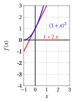
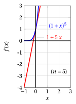

# Principio di induzione

**Parte 1 · Numeri e logica · Capitolo 8** · dalle dispense di Fabio Furini · [:material-file-pdf-box: Dispensa del volume (PDF)](../pdf/dispensa-1-numeri.pdf) · [:material-presentation: Slide (PDF)](../pdf/slide-numeri-08-induzione.pdf)

## 1. Il principio di induzione

- Presentiamo ora un metodo dimostrativo, detto dimostrazione per induzione. Questo procedimento si può applicare a teoremi con la struttura seguente:

    “ per ogni $n \in \N$, $n \ge n_0$, vale la proprietà $p (n)$ ”

- Il numero $n_0$ è il più piccolo intero per cui si vuole che la proprietà sia vera; se $n_0 = 0$ il teorema afferma semplicemente che la proprietà è vera per ogni $n \in \N$.

    !!! chiave ""

        La dimostrazione per induzione consiste nei due passi seguenti:

        1. Si dimostra che $p (n)$ sia vero per $n = n_0$ (<strong>primo passo dell'induzione</strong>).

        2. Si dimostra che, se n è un generico numero naturale $\ge n_0$, dal fatto che $p(n)$ sia vero segue che $p( n + 1)$ sia vero (<strong>passo induttivo</strong>).

        Si può allora concludere che per ogni $n \ge n_0$, $p (n)$ è vero.

- La validità di questo metodo dimostrativo, <em>intuitivamente</em>, si basa su questo fatto:

    1. Per il punto 1, sappiamo che $p (n_0)$ è vera. Supponiamo ad esempio $n_0 = 1$: sappiamo quindi che $p(1)$ è vera (questo va dimostrato esplicitamente).

    2. Per il punto $2$, poiché è vera $p(1)$, sarà vera $p (2)$: infatti abbiamo dimostrato che qualunque sia $n$, se è vera $p ( n)$ è vera anche $p ( n + 1)$. Ma allora, poiché è vera $p (2)$, sarà vera $p (3)$; ma allora è vera $p (4)$, … e così via, dunque è vera $p (n)$ per ogni $n \ge 1$.

- Concretamente, la dimostrazione si articola in due fasi.

    1. Dimostrare direttamente $p (n_0)$;

    2. Assumere come ipotesi $p (n)$ (<strong>ipotesi induttiva</strong>) e provare $p (n + 1)$.

- È questo il punto delicato, spesso soggetto a equivoci. “Assumere per ipotesi” $p (n)$ non significa assumere come ipotesi la tesi. Quello che si deve provare è che:

    “ per ogni $n \ge n_0$, se è vera $p( n)$ allora è vera anche $p (n + 1)$ ”

    e non

    “ se per ogni $n$ è vera $p (n)$, allora è vera anche $p (n + 1)$”

## 2. Dimostrazioni basate sul principio di induzione

### 2.1 Disuguaglianza di Bernoulli

!!! osservazione "Osservazione 1: disuguaglianza di Bernoulli"

    Per ogni intero $n \ge 0$, $x \in \R$, $x \ge -1$, vale:

    \begin{equation}
    \label{BERNOULLI}
    (1+x)^n \ge 1 + n\: x
    \end{equation}

??? dimostrazione "Dimostrazione"

    Per induzione su $n$.

    - <strong>Primo passo dell'induzione</strong>

        Sia $n = 0$. Allora l'asserto diventa:

        $$
        (1+x)^0 \ge 1 + 0\: x \text{ ~~ cioè  ~~} 1 \ge 1
        $$

        che è evidentemente vero.

    - <strong>Passo induttivo</strong>

        Supponiamo che sia vero per $n$, e proviamolo per $(n + 1)$. Per ipotesi induttiva, abbiamo:

        $$
        (1+x)^n \ge 1 + n\: x
        $$

        e inoltre abbiamo

        $$
        (1+x) \ge 0 {\rm~~~dato~che~~~} x \ge -1.
        $$

        Allora possiamo scrivere:

        \begin{align*}
        (1+x)^{n+1} &= (1+x) \cdot (1+x)^{n} \\[2ex] 
         &\ge (1+x) \cdot  (1 + n\: x)  \\[2ex]
         &= 1 + (n+1)\: x + n\: x^2 \\[2ex] 
         &\ge 1 + (n+1) \: x
        \end{align*}

        dove nell'ultima disuguaglianza si è sfruttato il fatto che $n\:x^2 \ge 0$.

        La catena di disuguaglianze mostra che, per $n + 1$, abbiamo

        $$
        (1 + x)^{n+1} \ge 1 + (n + 1) \: x
        $$

        che è esattamente l'asserto voluto, per $n + 1$.

    
□

!!! esempio "Esempio 1: Disuguaglianza di Bernoulli"

    

    { .fig .ovale loading=lazy style="width:91%" }

    { .fig .ovale loading=lazy style="width:91%" }

    

    

    { .fig .ovale loading=lazy style="width:91%" }

    { .fig .ovale loading=lazy style="width:91%" }

    

### 2.2 Alcune sommatorie importanti

!!! osservazione "Osservazione 2: somma dei primi $n$ numeri naturali"

    Per ogni intero $n \ge 1$, vale:

    $$
    \sum_{k=1}^{n} k = \frac{n \: (n+1)}{2}
    $$

??? dimostrazione "Dimostrazione"

    Per induzione su $n$.

    - <strong>Primo passo dell'induzione</strong>

        Sia $n = 1$. Allora l'asserto diventa:

        $$
        \sum_{k=1}^1 k = \frac{1\:(1+1)}{2} \text{ ~~ cioè  ~~} 1 = 1
        $$

        che è evidentemente vero.

    - <strong>Passo induttivo</strong>

        Supponiamo che sia vero per $n$, e proviamolo per $(n + 1)$. Per ipotesi induttiva, abbiamo:

        $$
        \sum_{k=1}^n k = \frac{n\:(n+1)}{2}.
        $$

        Quindi possiamo scrivere:

        \begin{align*}
        \sum_{k=1}^{n+1} k &= \sum_{k=1}^{n} k + (n+1) \\[2ex]
        &=  \frac{n\:(n+1)}{2} + (n+1) \\[2ex]
        &=  \frac{n\:(n+1) + 2\:(n+1)}{2} \\[2ex]
        & =  \frac{(n+1)\:( n  + 2 )}{2}  =  \frac{(n+1)\:\big(( n+1) +1\big)}{2}
        \end{align*}

        che è esattamente l'asserto voluto, per $n + 1$.

    
□

### 2.3 Somma dei termini della progressione geometrica

!!! osservazione "Osservazione 3: somma dei primi $n$ termini della progressione geometrica ($a=1$)"

    Dato $q \in\ \R_+$, per ogni intero $n \ge 1$ vale:

    \begin{equation}
    \label{GEOM}
    \sum_{k=1}^{n} q^{k-1} = 
    \begin{cases}
    \frac{q^{n}-1}{q-1} & {\rm ~~~se~~~~}  q \neq 1\\[2ex]
    n & {\rm ~~~altrimenti} 
    \end{cases}
    \end{equation}

??? dimostrazione "Dimostrazione"

    Per induzione su $n$.

    - <strong>Primo passo dell'induzione</strong>

        Sia $n = 1$. Allora l'asserto diventa:

        $$
        \sum_{k=1}^{1} q^{k-1}  = \frac{q^1-1}{q-1} \text{ ~~ cioè  ~~} 1 = 1
        $$

        che è evidentemente vero.

    - <strong>Passo induttivo</strong>

        Supponiamo che sia vero per $n$, e proviamolo per $(n + 1)$. Per ipotesi induttiva, abbiamo:

        $$
        \sum_{k=1}^{n} q^{k-1} = \frac{q^n-1}{q-1}
        $$

        Quindi possiamo scrivere

        \begin{align*}
        \sum_{k=1}^{n+1} q^{k-1}&= \sum_{k=1}^{n} q^{k-1} + q^n =  \frac{q^n-1}{q-1} + q^n\\[2ex]
        & =  \frac{q^n-1+q^{n+1}-q^n}{q-1} =  \frac{q^{n+1}-1}{q-1}
        \end{align*}

        che è esattamente l'asserto voluto, per $n + 1$.

    
□

