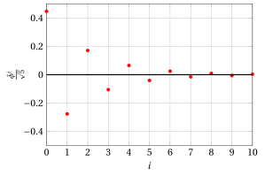
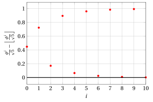

# Successione di Fibonacci

**Parte 1 · Numeri e logica · Capitolo 10** · dalle dispense di Fabio Furini · [:material-file-pdf-box: PDF del capitolo](../pdf/numeri-10-fibonacci.pdf)

## 1. Successione di Fibonacci

!!! definizione "Definizione 1: di successione di Fibonacci"

    \begin{align}
    F_0&=0, \nonumber\\
    F_1&=1, \nonumber\\
    F_i&=F_{i-1}+F_{i-2}, {\rm~~~~~con~~} i\ge2, i\in \N \label{fibonacci}
    \end{align}

- Pertanto, ogni numero di Fibonacci è la somma dei due precedenti, ottenendo la successione

    $$
    0, 1, 1, 2, 3, 5, 8, 13, 21, 34, 55, \dots
    $$

- La successione di Fibonacci è collegata alla  <strong>sezione aurea</strong> $\phi$ e al <strong>coniugato della sezione aurea</strong> $\hat \phi$,

!!! definizione "Definizione 2: di sezione aurea"

    La <strong>sezione aurea</strong> $\phi$ e il <strong>coniugato della sezione aurea</strong> $\hat \phi$, sono le due radici dell'equazione:

    $$
    x^2 = x +1
    $$

    e sono dati dalle formule:

    \begin{align*}
    \phi & = \frac{1 + \sqrt{5}}{2} & \hat \phi & = \frac{1 - \sqrt{5}}{2}\\
         & \approx 1.61803 &  &\approx -0.61803
    \end{align*}

La seguente figura mostra il grafico della funzione $f(x)=x^2-x-1$ nell'intervallo $[-3,3]$, i pallini rossi corrispondono alle radici dell'equazione  $x^2 = x +1$.

{ .fig .ovale loading=lazy style="width:61%" }

La sezione aurea $\phi$ e il coniugato della sezione aurea  $\hat{\phi}$ soddisfano chiaramente l'equazione $x^2 = x +1$ in quanto:

$$
\phi^2 = \left(\frac{1 + \sqrt{5}}{2}\right)^2 = \frac{1 + 2\: \sqrt{5} +5}{4} = \frac{3 + \sqrt{5}}{2} = \frac{1 + \sqrt{5}}{2} +1 = \phi +1
$$

$$
\hat{\phi}^2 = \left(\frac{1 - \sqrt{5}}{2}\right)^2 =  \frac{1 - 2\: \sqrt{5} +5}{4} =  \frac{3 - \sqrt{5}}{2} =  \frac{1 - \sqrt{5}}{2} +1 = \hat \phi +1
$$

!!! osservazione "Osservazione 1"

    \begin{align*}
    F_i & = \frac{\phi^i - \hat{\phi}^i }{\sqrt{5}}, \qquad  \qquad i=0,1,2,\dots
    \end{align*}

??? dimostrazione "Dimostrazione"

    Per induzione su $i$.

    - <strong>Primo passo dell'induzione</strong>

        Dimostriamo che la formula sia valida per $i = 0$ e $i = 1$:

        $$
        F_0  = \frac{\phi^0 - \hat{\phi}^0 }{\sqrt{5}} = \frac{1 - 1 }{\sqrt{5}} =0,  \qquad
        F_1  = \frac{\phi^1 - \hat{\phi}^1 }{\sqrt{5}} = \frac{\sqrt{5}}{\sqrt{5}} = 1.
        $$

    - <strong>Passo induttivo</strong>

        Supponiamo che sia vero per $i = k$ e $i = k - 1$ con $k \ge 1$, e proviamolo per $i = k + 1$. Per ipotesi induttiva, abbiamo: $F_{k+1}  = F_{k} + F_{k-1}$, quindi possiamo scrivere

        \begin{align*}
        F_{k+1} & = F_{k} + F_{k-1} \\[2ex]
        & = \frac{\phi^k - \hat{\phi}^k }{\sqrt{5}} + \frac{\phi^{k-1} - \hat{\phi}^{k-1} }{\sqrt{5}}  = \frac{\big(\phi^k - \hat{\phi}^k\big) + \big(\phi^{k-1} - \hat{\phi}^{k-1}\big)}{\sqrt{5}}\\[2ex]
        & = \frac{\big(\phi^k + \phi^{k-1}\big) - \big(\hat{\phi}^k  + \hat{\phi}^{k-1}\big)}{\sqrt{5}}
         = \frac{\phi^{k-1} \big(\phi + 1\big) - \hat{\phi}^{k-1} \big(\hat{\phi}  + 1\big)}{\sqrt{5}}\\[2ex]
        & = \frac{\phi^{k-1} \big(\phi^2\big) - \hat{\phi}^{k-1} \big(\hat{\phi}^2\big)}{\sqrt{5}} = \frac{\phi^{k+1} - \hat{\phi}^{k+1}}{\sqrt{5}}
        \end{align*}

        che è esattamente l'asserto voluto, per $i= k + 1$.

    
□

!!! osservazione "Osservazione 2"

    \begin{align*}
    F_i & = \left\lfloor \frac{{\phi}^i}{\sqrt{5}} + \frac{1}{2} \right\rfloor, \qquad  \qquad i=0,1,2,\dots
    \end{align*}

??? dimostrazione "Dimostrazione"

    Dato che $|\hat{\phi}| < 1$, abbiamo

    \begin{align*}
    \frac{|\hat{\phi}^i|}{\sqrt{5}} \le \frac{1}{\sqrt{5}} < \frac{1}{2}  
    {\rm  ~~~~~~e~~~~~~} -\frac{1}{2} < \frac{\hat{\phi}^i}{\sqrt{5}} <  \frac{1}{2}   , \qquad  \qquad i=0,1,2,\dots
    \end{align*}

    Dato che $F_i \in \N$ e $F_i  = \frac{\phi^i  }{\sqrt{5}} - \frac{ \hat{\phi}^i }{\sqrt{5}}$, allora  l'$i$-esimo numero di Fibonacci $F_i$ è uguale a $\frac{{\phi}^i}{\sqrt{5}}$ arrotondato all'intero più vicino:

    $$
    F_i  = \left\lfloor \frac{{\phi}^i}{\sqrt{5}} + \frac{1}{2} \right\rfloor, \qquad  \qquad i=0,1,2,\dots
    $$

    
□

- I valori di

    $$
    \frac{\hat{\phi}^i}{\sqrt{5}} {\rm ~~con~~} i=0,1,\dots,10 {\rm ~~sono:~~}
    $$

    { .fig .ovale loading=lazy style="width:60%" }

- I valori di

    $$
    \frac{{\phi}^i}{\sqrt{5}} - \left\lfloor \frac{{\phi}^i}{\sqrt{5}} \right\rfloor {\rm ~~con~~} i=0,1,\dots,10 {\rm ~~sono:~~}
    $$

    { .fig .ovale loading=lazy style="width:60%" }

- Dato che $F_i \in \N$ abbiamo inoltre:

    $$
    \left( \frac{{\phi}^i}{\sqrt{5}} - \left\lfloor \frac{{\phi}^i}{\sqrt{5}} \right\rfloor \right) - \frac{\hat{\phi}^i}{\sqrt{5}} \in \{0,1\}, \qquad  \qquad i=0,1,2,\dots
    $$

- I valori di $F_i$, con $i=0,1,\dots,10$, sono:

    { .fig .ovale loading=lazy style="width:60%" }
