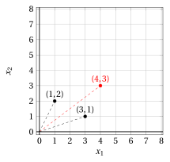
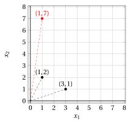
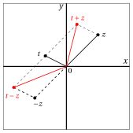
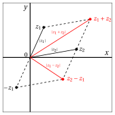
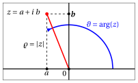
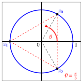
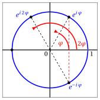

# Numeri complessi

**Parte 1 · Numeri e logica · Capitolo 12** · dalle dispense di Fabio Furini · [:material-file-pdf-box: PDF del capitolo](../pdf/numeri-12-numeri-complessi.pdf)

## 1. Definizione di $\C$ e struttura di campo

- Abbiamo indicato con $\R^2$ (abbreviazione di $\R \times \R$) l'insieme delle coppie ordinate $(a, b)$ di numeri reali.

- Su queste definiamo direttamente le operazioni di somma e prodotto con le seguenti regole:

    !!! chiave ""

        \begin{align}
        \label{OP1}(a, b) + (c, d) &= (a+ c, b + d)\\[2ex]
        \label{OP2}(a, b) \cdot (c, d) &= (ac - bd, ad+ bc)
        \end{align}

    

    !!! esempio "Esempio 1: somma"

        { .fig .ovale loading=lazy style="width:42%" }

    

    !!! esempio "Esempio 2: prodotto"

        { .fig .ovale loading=lazy style="width:42%" }

- Questa “somma” e questo “prodotto” verificano le proprietà <strong>commutativa</strong>, <strong>associativa</strong> e <strong>distributiva</strong>

- Osserviamo anche che, $\forall (a, b) \in \R^2$:

    $$
    (a, b) + (0, 0) = (0, 0) + (a, b) = (a, b)
    $$

    dunque la coppia $(0, 0)$ è <strong>elemento neutro per la somma</strong>. E inoltre:

    $$
    (a, b) \cdot  (1, 0) = (1, 0) \cdot (a, b) = (a, b)
    $$

    dunque la coppia $(1, 0)$ è <strong>elemento neutro per il prodotto</strong>. Abbiamo:

    $$
    (a,b) + (-a,-b)= (0,0)
    $$

    dunque $(-a , -b)$ è l'<strong>opposto</strong> di $(a, b)$. Inoltre, se $(a,b) \neq (0,0)$ allora:

    $$
    (a,b) \cdot \left(\frac{a}{a^2+b^2}~,~\frac{-b}{a^2+b^2} \right)= (1,0)
    $$

    dunque la coppia $(a/(a^2 + b^2 ) , -b/(a^2 + b^2 ))$ è il <strong>reciproco</strong> di $(a, b)$.

!!! definizione "Definizione 1: campo dei numeri complessi"

    Le proprietà $R_1$, $R_2$  sono verificate per la somma e il prodotto così definiti e perciò l'insieme $\R^2$ così strutturato è un campo, che chiameremo <strong>campo dei numeri complessi</strong> e indicheremo con $\C$

- Osserviamo ora che $\C$ contiene il sottoinsieme $\C_0$ delle coppie del tipo $(a,0)$; esso è un sottocampo di $\C$, poiché somma e prodotto di coppie di questo tipo sono ancora coppie dello stesso tipo; infatti si ha:

    $$
    (a,0) + (b,0) =(a+b,0) {\rm ~~~e~~~} (a,0) \cdot (b,0) =(a \cdot b,0)
    $$

    Inoltre $\C_0$ può essere ordinato ponendo $(a, 0) < (b, 0)$ se $a <b$.

- Se allora mettiamo in corrispondenza biunivoca l'insieme dei numeri reali $\R$ con $\C_0$, ponendo

    $$
    (a,0) \longleftrightarrow a
    $$

    possiamo identificare i numeri reali $a \in \R$ con i numeri complessi del tipo $(a, 0) \in \R^2$. In questo senso il campo dei numeri complessi $\C$ è un <strong>ampliamento</strong> di quello dei numeri reali $\R$.

!!! chiave ""

    Consideriamo ora il numero $(0, 1) \in \C$. Esso ha la singolare proprietà che:

    $$
    (0,1) \cdot (0,1) = (-1,0)
    $$

    cioè il suo quadrato coincide col numero reale $-1$

!!! definizione "Definizione 2: unità immaginaria"

    La coppia $(0, 1) \in \C$ è indicata con la lettera “$i$” ed è chiamata <strong>unità immaginaria</strong>

## 2. Forma algebrica dei numeri complessi

!!! chiave ""

    Osserviamo che, se scriviamo un qualsiasi numero complesso $(c, 0)$ semplicemente  $c$ abbiamo:

    $$
    (a,b)
    =
    (a, 0) + \underbrace{(0,1)}_{=i} \cdot (b, 0)
    =
    a+ib
    $$

    Con questa notazione le regole \(\eqref{OP1}\) e \(\eqref{OP2}\)  sono le ordinarie regole del calcolo letterale, ove si tenga conto che $i^2 = - 1$:

    \begin{align}
    \label{OP3}(a + ib) + (c + id) &= (a+ c) + i (b + d)\\[2ex]
    \label{OP4}(a + ib) \cdot (c + id) &= (ac - bd) + i (ad + bc)
    \end{align}

!!! definizione "Definizione 3: di forma algebrica, parte reale e parte immaginaria"

    La scrittura:

    \begin{equation}
    \label{FA} z= a + i b
    \end{equation}

    è detta<strong> forma algebrica dei numeri complessi</strong>; $a$ si chiama <strong>parte reale</strong> di $z$ e si indica con $\Re(z)$ (o Re($z$)) mentre $b$ si chiama <strong>parte immaginaria</strong> e si indica con $\Im(z)$ (o Im($z$)).

<strong>Piano complesso</strong>

- In un piano cartesiano, si possono rappresentare i numeri complessi $a+ib$ come punti di coordinate $(a, b)$. In questo contesto:

    - il piano viene detto <strong>piano complesso</strong> o <strong>piano di Gauss</strong>

    - gli assi $x$, $y$ si dicono <strong>asse reale</strong> e <strong>asse immaginario</strong>

    - i punti sull'asse reale sono i <strong>numeri reali</strong>

    - i punti sull'asse immaginario sono i <strong>numeri immaginari puri</strong> (cioè del tipo $ib$)

- La <strong>somma di due numeri complessi</strong> è il numero complesso che ha per coordinate la somma delle coordinate: il significato geometrico di questo fatto è che il punto $z + t$ si costruisce a partire dai punti $z$, $t$ in base alla “<strong>regola del parallelogramma</strong>”, illustrata nella seguente figura:

{ .fig .ovale loading=lazy style="width:61%" }

!!! osservazione "Osservazione 1"

    L'insieme dei numeri complessi $~\C$ non è un campo ordinato

??? dimostrazione "Dimostrazione"

    - Abbiamo visto che $\C$ soddisfa gli assiomi di campo; non soddisfa però quelli di campo ordinato, ovvero non è possibile definire una relazione $\le$ tra i numeri complessi, in modo che valgano le proprietà  $R3$

    - Si può dimostrare che dalle proprietà $R3$ segue che il quadrato di un numero qualsiasi non è mai negativo, e d'altra parte, se un numero è positivo il suo opposto è negativo. Ora, in $\C$ si ha:

        $$
        1^2 = 1 {\rm ~~~e ~~~} i^2=-1
        $$

        Abbiamo quindi due quadrati che sono l'uno l'opposto dell'altro. Nessuno dei due però può essere negativo (perché sono quadrati), e questo è assurdo (perché tra $a$ e $- a$ uno dev'essere negativo, se $a\neq 0$). Concludiamo che $\C$ non è un campo ordinato.

    
□

!!! definizione "Definizione 4: di coniugato"

    Il numero complesso $a - ib$ si dice il <strong>complesso coniugato</strong> di $z = a + ib$ e si indica con $\overline{z}$.

!!! chiave ""

    Abbiamo:

    \begin{align}
    \label{OP100}z + \overline{z} &= 2a = (a+ib) +(a-ib)=2a=2\;\Re(z) \\[2ex]
    \label{OP200}z - \overline{z} &= 2ib = (a+ib) -(a-ib)= 2ib=2i\;\Im(z) \\[2ex] 
    \label{OP300} z \cdot \overline{z} &= (a+ib) \cdot (a-ib) = a^2 -aib + iba - \underbrace{i^2}_{=-1}b^2= a^2 + b^2 \ge 0
    \end{align}

- L'operazione di coniugio ha le seguenti elementari proprietà rispetto alla somma e al prodotto:

    \begin{align}
    \overline{(z_1+z_2)} &= \overline{z}_1 + \overline{z}_2 \\[2ex]
     \overline{(z_1 \cdot z_2)} &= \overline{z}_1 \cdot \overline{z}_2 \\[2ex]
     \overline{\left(\frac{1}{z}\right)} &= \frac{1}{\overline{z}}
    \end{align}

!!! definizione "Definizione 5: di modulo"

    Si chiama <strong>modulo</strong> di $z = a+ ib$ il numero reale non negativo $\sqrt{a^2 + b^2}$, si indica con $|z|$.

- Se $z = a$ è reale, il suo modulo si chiama valore assoluto e si indica sempre con $|a|$ e valgono le seguenti proprietà:

    1. $|z| = 0 \Longleftrightarrow z=0, {\rm ~~inoltre~~} |z| \ge 0$

    2. $|z| = |\overline{z}|$

    3. $\Re(z) \le |z| ~~~~ \Im(z) \le |z| ~~~~ |z|  \le |\Re(z)| + |\Im(z)|$

    4. $|z_1 + z_2| \le |z_1| + |z_2| ~~~~$ <strong>disuguaglianza triangolare</strong>

    5. $|z_1 + z_2| \ge \big| |z_1| - |z_2| \big| ~~~~$

- Le proprietà a), b) , c) si verificano immediatamente.

??? dimostrazione "Dimostrazione"

    - Proviamo le proprietà d) ed  e). Esse sono equivalenti alla seguente:

        $$
        (|z_1| - |z_2|)^2 ~~\le~~ |z_1 + z_2|^2 ~~\le~~ (|z_1| + |z_2|)^2
        $$

    - Ponendo $z_1 = a + ib$, $z_2 = c + id$ otteniamo:

        \begin{align*}
        |z_1 + z_2|^2 &= \big| (a + ib) +  (c + id)\big|^2\\[2ex]
        &= \big| (a + c) +  i(b+d) \big|^2\\[2ex]
        &= \left(\sqrt{(a + c)^2+(b + d)^2}\right)^2=(a+c)^2 + (b+d)^2
        \end{align*}

        e quindi abbiamo:

        $$
        \underbrace{\left(\sqrt{a^2+b^2} - \sqrt{c^2+d^2}\right)^2}_{=(a^2+b^2)+(c^2+d^2)-2\:\sqrt{a^2+b^2} \cdot \sqrt{c^2+d^2} } ~~\le~~ \underbrace{(a+c)^2 + (b+d)^2}_{=a^2+2ac+c^2+b^2+2bd+d^2} ~~\le~~  \underbrace{\left(\sqrt{a^2+b^2} + \sqrt{c^2+d^2}\right)^2}_{=(a^2+b^2)+(c^2+d^2)+2\:\sqrt{a^2+b^2} \cdot \sqrt{c^2+d^2} }
        $$

        Semplificando questa doppia disuguaglianza si riduce a:

        $$
        -\sqrt{a^2+b^2} \cdot \sqrt{c^2+d^2} ~~\le~~ ac+bd ~~\le~~  \sqrt{a^2+b^2} \cdot \sqrt{c^2+d^2}
        $$

        che è equivalente alla seguente:

        $$
        |ac + db | ~\le~ \sqrt{a^2+b^2} \cdot \sqrt{c^2+d^2}
        $$

        Elevando al quadrato entrambi i membri si arriva a:

        $$
        \underbrace{\big(ac + db\big)^2}_{=a^2c^2+d^2b^2+2acbd} ~\le~ \underbrace{\left(a^2+b^2\right) \cdot \left(c^2+d^2\right)}_{=a^2c^2+a^2d^2+b^2c^2+b^2d^2}
        $$

        ovvero a

        $$
        0 ~~\le~~ - 2acbd + a^2d^2 + b^2 c^2 ~~=~~ \big(ad-bc\big)^2
        $$

        che è vera per ogni $a, b, c, d \in \R$.

    
□

- Geometricamente, $|z|$ rappresenta la distanza del punto (o numero complesso) $z$ dall'origine; $|z_1 - z_2|$ rappresenta la distanza dei due punti $z_1$ e $z_2$; le disuguaglianze d) e e) traducono il noto teorema sulle <strong>lunghezze dei lati di un triangolo</strong>[^1]:

{ .fig .ovale loading=lazy style="width:61%" }

- Utilizzando i concetti ora introdotti, possiamo rappresentare in forma algebrica il rapporto fra due numeri complessi:

    $$
    \frac{a+ib}{c+id}
    $$

    basta moltiplicare il numeratore e il denominatore per $c-id$ e otteniamo:

    $$
    \frac{a+ib}{c+id} = \frac{(a+ib)(c-id)}{\underbrace{(c+id)(c-id)}_{=c^2+d^2}} = \frac{ac-aid+ibc-i^2bd}{c^2+d^2}= \frac{(ac+bd)}{c^2+d^2} + i \frac{(bc-ad)}{c^2+d^2}
    $$

### 2.1 Equazioni nel campo complesso

- Vediamo come si può risolvere un'equazione nel campo complesso, quando questa coinvolge l'incognita $z = x + iy$ anche attraverso $\Re(z)$, $\Im(z)$, $z$, $|z|$.

- Illustriamo il procedimento di trasformare l'equazione in una incognita complessa in un sistema di due equazioni in due incognite reali con il seguente esempio. Il metodo prevede di passare alla parte reale e immaginaria dell'equazione.

!!! esempio "Esempio 3: equazioni nel campo complesso (metodo algebrico)"

    - Vogliamo risolvere:

        $$
        z^2 + i \;\Im \;z + 2 \;\overline{z} =0
        $$

        Poniamo $z = x + iy$, con $x$, $y$ incognite reali, e trascriviamo l'equazione:

        $$
        \begin{cases}
        z^2= (x + i\:y)^2 = x^2 - y^2 + 2\:i\:x\:y\\[2ex]
        i \;\Im\;z= i\:y\\[2ex]
        2 \;\overline{z}= 2\: (x - i\:y) = 2\: x - 2\:i\:y   
        \end{cases}
        $$

        Otteniamo quindi sostituendo:

        $$
        (x^2 - y^2 + 2\:i\:x\:y) + (i\:y) + (2\: x - 2\:i\:y) =0
        $$

    - Ora, un numero complesso è zero se e solo se la sua parte reale e parte immaginaria sono zero. Perciò mettiamo in evidenza la parte reale e la parte immaginaria del primo membro:

        $$
        (x^2 - y^2 + 2\:x) + i \:(2\: x\:y + y - 2\:y) =0
        $$

        ed uguagliamo entrambe a zero:

        $$
        \begin{cases}
        x^2 - y^2 + 2\:x = 0\\[2ex]
        2\: x\:y - y = 0   
        \end{cases}
        $$

        Si è così trasformata l'equazione in una incognita complessa in un sistema di due equazioni in due incognite reali.

    - Risolviamo il sistema. La seconda equazione dà:

        $$
        y=0 {\rm ~~~~o~~~~} x= \frac{1}{2}
        $$

        1. Per $y=0$ la prima equazione diventa

            $$
            x^2 + 2\:x = 0 {\rm ~~~che~dà~~~} x=0 {\rm ~~~~o~~~~} x= -2
            $$

        2. Per $x=\frac{1}{2}$ la prima equazione diventa

            $$
            -y^2 + \frac{5}{4}= 0 {\rm ~~~che~dà~~~} y=\pm \frac{\sqrt{5}}{2}
            $$

    - Quindi l'equazione ha le seguenti 4 soluzioni:

        $$
        z=0,~~~~~ z=-2,~~~~~z= \frac{1}{2} + i\:\frac{\sqrt{5}}{2},~~~~~z= \frac{1}{2} - i\:\frac{\sqrt{5}}{2}
        $$

    Il metodo visto in quest'esempio è applicabile in linea di principio ad ogni equazione in $\C$ ma un generico sistema di due equazioni in due incognite è quasi sempre insolubile per via algebrica.

## 3. Forma trigonometrica dei numeri complessi

- Come è noto dalla Geometria, i punti del piano possono essere individuati, oltre che dalle loro coordinate cartesiane , anche dalle <strong>coordinate polari</strong>:

    1. $\varrho$ $\rightarrow$ <strong>raggio polare</strong>, cioè distanza del punto dall'origine

    2. $\vartheta$ $\rightarrow$ <strong>angolo polare</strong>, cioè l'angolo che la retta congiungente il punto con l'origine forma con l'asse delle ascisse positive, misurato in senso antiorario.

- È chiaro che una coppia $\varrho$ , $\vartheta$, con $\varrho > 0$, individua un ben determinato punto del piano; invece un punto del piano individua univocamente la coordinata $\varrho$, ma l'angolo $\vartheta$, misurato in radianti, è determinato solo a meno di multipli di $2\:\pi$.

    { .fig .ovale loading=lazy style="width:61%" }

- Dato un numero complesso $z$ , <strong>il suo modulo $|z|$ coincide col raggio polare</strong> $\varrho$ del punto che ne è l'immagine sul piano complesso.

- Chiamiamo <strong>argomento</strong> di $z$, e lo indicheremo con arg$(z)$, uno qualsiasi degli angoli $\vartheta$ relativi al punto $z$. In questo modo l'argomento di $z$ non è univocamente determinato. Spesso questa indeterminatezza non porta alcun inconveniente.  Altre volte invece è preferibile assegnare un ben determinato argomento a un numero complesso. Ciò può ottenersi in infiniti modi, fissando un qualsiasi intervallo, di ampiezza $2\;\pi$, entro il quale far variare l'angolo $\vartheta$

- Gli intervalli più comunemente usati a questo scopo sono $[0, 2\:\pi)$ e $(-\pi, \pi]$; allora l'argomento di $z$ viene detto <strong>argomento principale</strong>.

    

    !!! esempio "Esempio 4: argomenti di numeri complessi"

        - il numero $-i$ ha come argomento $- \pi / 2$ oppure $3\pi / 2$ oppure qualunque altro valore della forma $- \pi / 2 + 2\:k\:\pi$ con $k \in \Z$. Il suo argomento principale sarà $3\pi / 2$ se si adotta la convenzione che $\vartheta \in [0, 2\:\pi)$, $-\pi / 2$ con la convenzione che $\vartheta \in (-\pi, \pi]$.

        - I numeri reali positivi hanno argomento principale $0$ e quelli negativi $\pi$ con entrambe le convenzioni.

!!! chiave ""

    Dato il numero $z = a+ ib$, dalla trigonometria ricaviamo immediatamente le relazioni tra le coordinate cartesiane $a$, $b$ e quelle polari $\varrho$, $\vartheta$:

    \begin{align}
    \label{POLARY1} a= \varrho \;\cos \;\vartheta~~~~ {\rm e}~~~~ b= \varrho \;\sin \;\vartheta
    \end{align}

    Le relazioni inverse sono:

    \begin{align}
    \label{POLARY2} \varrho= \sqrt{a^2+b^2},~~~~\cos \vartheta= \frac{a}{\sqrt{a^2+b^2}}~~~~~ {\rm e}~~~~ \sin \vartheta= \frac{b}{\sqrt{a^2+b^2}}
    \end{align}

!!! definizione "Definizione 6: di forma trigonometrica"

    Un numero complesso $z = a+ ib$ può anche scriversi nella forma

    \begin{equation}
    \label{FT} z=  \varrho \; (\cos \; \vartheta + i \; \sin \; \vartheta)
    \end{equation}

    che è detta <strong>forma trigonometrica</strong> dei numeri complessi.

!!! esempio "Esempio 5: forma trigonometrica"

    Scriviamo in forma trigonometrica il numero complesso:

    $$
    z= \sqrt{3} + i
    $$

    Abbiamo $\varrho=\sqrt{a^2+b^2}=\sqrt{3+1}=2$, quindi:

    $$
    \sqrt{3} + i = 2\: \left( \frac{\sqrt{3}}{2} + i\: \frac{1}{2}\right)= 2\left(\cos \frac{\pi}{6} + i \: \sin \frac{\pi}{6} \right)
    $$

### 3.1 Formule di De Moivre

- La forma trigonometrica è comoda per esprimere prodotti e quozienti di numeri complessi. Se abbiamo infatti:

    $$
    z_1=  \varrho_1 \; (\cos \vartheta_1 + i \; \sin \vartheta_1) ~~~~~~ z_2=  \varrho_2 \; (\cos \vartheta_2 + i \; \sin \vartheta_2)
    $$

    per il <strong>prodotto</strong> otteniamo:

    \begin{align}
    z_1 z_2 & = \varrho_1\varrho_2 \cdot \bigg\{~~\cos \vartheta_1 \; \cos \vartheta_2 - \sin \vartheta_1 \; \sin \vartheta_2 + i ~~\big(\sin \vartheta_1  \cos \vartheta_2+ \cos \vartheta_1  \sin \vartheta_2\big)~~\bigg\} \nonumber \\[2ex] 
    & = \varrho_1\varrho_2 \cdot \bigg\{~~ \cos \big(\vartheta_1+\vartheta_2\big) + i ~~ \sin \big(\vartheta_1+\vartheta_2\big)~~\bigg\} \label{PPP}
    \end{align}

    per il <strong>quoziente</strong>, se $z_2\neq0$, abbiamo:

    $$
    \frac{z_1}{z_2} = \frac{\varrho_1}{\varrho_2} \cdot \frac{\cos \vartheta_1 + i \; \sin \vartheta_1}{\cos \vartheta_2 + i \; \sin \vartheta_2},
    $$

    moltiplicando numeratore e denominatore per $(\cos \; \vartheta_2 - i \; \sin \; \vartheta_2)$ e, tenendo conto che $( \cos \; \vartheta_2)^2 + (\sin \; \vartheta_2)^2 = 1$, otteniamo:

    \begin{align}
    \frac{z_1}{z_2} & = \frac{\varrho_1}{\varrho_2} \cdot \bigg\{~~ (\cos \vartheta_1 + i \; \sin \vartheta_1) \cdot (\cos \vartheta_2 - i \sin \vartheta_2) ~~\bigg\} \nonumber \\[2ex] 
    & = \frac{\varrho_1}{\varrho_2} \cdot \bigg\{~~ \cos \big(\vartheta_1-\vartheta_2\big) + i ~~ \sin \big(\vartheta_1-\vartheta_2\big)~~\bigg\}
    \end{align}

- Pertanto il modulo del prodotto e del quoziente di due numeri complessi è, rispettiva- mente, il prodotto e il quoziente dei moduli; l'argomento è, rispettivamente, la somma e la differenza degli argomenti:

    !!! chiave ""

        \begin{align}
        |z_1 \cdot z_2| = |z_1|\cdot|z_2|~~~~{\rm e}  ~~~~{\rm arg}(z_1 \cdot z_2) = {\rm arg}(z_1)+{\rm arg}(z_2)\\[2ex]
        \left|\frac{z_1}{z_2}\right| = \frac{|z_1|}{|z_2|}~~~~{\rm e}  ~~~~{\rm arg}\left(\frac{z_1}{z_2}\right) = {\rm arg}(z_1) - {\rm arg}(z_2)
        \end{align}

- La \(\eqref{PPP}\) si generalizza al caso di un numero qualsiasi di fattori $z_1, z_2,\dots, z_n$:

    \begin{align}
    z_1z_2 \dots z_n= \varrho_1\varrho_2\dots\varrho_n \cdot \bigg\{~~ \cos \big(\vartheta_1+\vartheta_2+\dots+\vartheta_n\big) + i ~~ \sin \big(\vartheta_1+\vartheta_2+\dots+\vartheta_n)~~\bigg\}
    \end{align}

    Se poi i fattori sono tutti uguali, otteniamo:

    \begin{align}
    z^n= \varrho^n \cdot \bigg\{~~ \cos \big(n\: \vartheta\big) + i ~~ \sin \big(n\: \vartheta)~~\bigg\}
    \end{align}

- Queste relazioni sui prodotti e quozienti di numeri complessi vanno sotto il nome di formule di De Moivre.

!!! esempio "Esempio 6: potenze di numeri complessi con le formule di De Moivre"

    Scrivere in forma algebrica:

    $$
    z= (1+i)^7
    $$

    Determiniamo modulo e argomento di $(1 + i)$ e poi applichiamo la formula di De Moivre.

    $$
    |1+i|=\sqrt{2}~~~~{\rm e}~~~~{\rm arg}(1+i)=\frac{\pi}{4} ~~~~~~~\left(\cos \vartheta=\frac{1}{\sqrt{2}},~~ \sin \vartheta=\frac{1}{\sqrt{2}} \right)
    $$

    Quindi abbiamo:

    $$
    |(1+i)^7|=\left(\sqrt{2}\right)^7 = 2^{\frac{7}{2}}= 2^{3+\frac{1}{2}} = 8\sqrt{2} ~~~~{\rm e}~~~~{\rm arg}(1+i)^7= \frac{7}{4} \: \pi
    $$

    Di conseguenza:

    $$
    (1+i)^7= 8\sqrt{2} \left( \underbrace{\cos \frac{7}{4} \: \pi}_{=\frac{1}{\sqrt{2}}} + i \; \underbrace{\sin \frac{7}{4} \: \pi}_{=-\frac{1}{\sqrt{2}}} \right) = 8\sqrt{2} \left( \frac{1}{\sqrt{2}} - i \; \frac{1}{\sqrt{2}}\right) = 8 - 8i
    $$

!!! chiave ""

    - Le formule di De Moivre permettono di dare un'interpretazione geometrica al prodotto di numeri complessi.

    - Sia $z$, per cominciare, un numero complesso di modulo $1$, quindi del tipo $( \cos \vartheta + i \sin \vartheta)$. Allora, moltiplicare un numero per $z$ significa sommare $\vartheta$ al suo argomento, cioè eseguire una <strong>rotazione di angolo</strong> $\vartheta$.

    - Se $z$ ha modulo $\varrho$ anziché 1, oltre ad eseguire una rotazione si esegue una <strong>dilatazione di coefficiente</strong> $\varrho$.

!!! esempio "Esempio 7: interpretazione geometrica del prodotto di numeri complessi"

    - moltiplicare per $i$ significa eseguire una rotazione di $\frac{\pi}{2}$;

    - moltiplicare per $- 1$ significa eseguire una rotazione di $\pi$;

    - moltiplicare per $(1 +i)$ significa eseguire una dilatazione di coefficiente $\sqrt{2}$ e una rotazione di $\frac{\pi}{4}$

!!! esempio "Esempio 8: equazioni nel campo complesso (metodo trigonometrico)"

    - Vogliamo risolvere:

        $$
        z^3 - |z| =0
        $$

        Riscriviamo l'equazione nella forma

        $$
        z^3 = |z|
        $$

        e poniamo  $z=  \varrho \; (\cos \vartheta + i \; \sin \vartheta)$ (forma trigonometrica) e trascriviamo l'equazione:

        $$
        \begin{cases}
        z^3= \varrho^3 (\cos 3\:\vartheta + i \; \sin 3\:\vartheta)\\[2ex]
        |z|= \varrho   
        \end{cases}
        $$

        Otteniamo quindi sostituendo:

        $$
        \varrho^3 (\cos 3\:\vartheta + i \; \sin 3\:\vartheta) = \varrho
        $$

        L'equazione è soddisfatta se e solo se i due membri hanno moduli uguali e argomenti che differiscono per multipli di $2\pi$ (il secondo membro ha argomento 0), ovvero:

        $$
        \begin{cases}
        \varrho^3 = \varrho\\[2ex]
        3 \vartheta  = 2k\pi & {\rm con~~} k \in \Z   
        \end{cases}
        $$

        La prima equazione dà $\varrho = 0$ e $\varrho = 1$ (attenzione: $\varrho$ deve essere $\ge 0$ perché è il modulo del numero complesso; perciò $\varrho = -1$ non è accettabile); la seconda dà $\vartheta=\frac{2k\pi}{3}, k \in \Z$. Quindi:

        $$
        z=0, ~~ z=\cos \frac{2k\pi}{3} + i \sin \frac{2k\pi}{3} ~~~~~~{\rm con~~} k \in \Z
        $$

        Esplicitamente:

        $$
        z=0, ~~~~ z=1, ~~~~ z=-\frac{1}{2} + i \:\frac{\sqrt{3}}{2}, ~~~~ z=-\frac{1}{2} - i \:\frac{\sqrt{3}}{2}
        $$

### 3.2 Radici $n$-esime dei numeri complessi

!!! definizione "Definizione 7: di radice $n$-esima di un numero complesso"

    Dato un numero complesso $w$, diremo che $z$ è una radice n-esima (complessa) di $w$ se risulta $z^n = w$.

!!! teorema "Teorema 1"

    Sia $w \in \C$, $w \neq 0$, e $n$ intero $\ge 1$. Esistono precisamente $n$ radici $n$-esime complesse $z_0, z_1, \dots , z_{n-1}$ di $w$; posto

    $$
    w = r\: \big( \cos \; \varphi + i\; \sin \;\varphi \big) ~~~~{\rm e}~~~~~ z_k = \varrho_k \big( \cos \: \vartheta_k +
    i \; \sin \; \vartheta_k \big)
    $$

    abbiamo

    \begin{align}
    \begin{cases}
    \varrho_k= r ^{1/n}\\[2ex]
    \vartheta_k= \frac{\varphi +2k\pi}{n}   
    \end{cases}
    &  \qquad\qquad k=0,1,2,\dots,n-1
    \end{align}

??? dimostrazione "Dimostrazione"

    - I numeri $z_k$ sono evidentemente radici di $w$, come risulta calcolando $z^n_k$ mediante la formula di De Moivre. Mostriamo che non ve ne sono altre.

    - Se un numero $R( \cos \: \psi  + i\; \sin \psi)$ è radice $n$-esima di $w$, dovrebbe risultare

        $$
        R^n = r ~~~~{\rm e}~~~~ n \: \psi = \varphi + 2h\pi ~~~~{\rm con}~~~~ h \in \Z
        $$

        o equivalentemente:

        $$
        R = r^{1/n} ~~~~{\rm e}~~~~ \psi = \varphi/n + 2h\pi/n ~~~~{\rm con}~~~~ h \in \Z
        $$

    - Dando a $h$ i valori $0, 1, \dots, n-1$ troviamo appunto i numeri $z_k$.

    - Dando a $h$ un qualsiasi altro valore $\bar{h}$ diverso dai precedenti, questo può scriversi nella forma $\bar{h} = k + mn$ ( $m \in \Z$ è il quoziente e $k$ è il resto della divisione di $\bar{h}$ per $n$) per cui sarebbe

        $$
        \psi = \frac{\varphi}{n} + \frac{2k\pi}{n} + 2m\pi = \vartheta_k + 2m\pi
        $$

        e ritroveremmo ancora gli stessi $z_k$ precedenti.

    
□

!!! esempio "Esempio 9: radice quinta di un numero complesso"

    - Calcoliamo $\sqrt[5]{1+i}$, il numero complesso $(1+i)$ ha come modulo $\sqrt{2}$ e argomento $\pi/4$. Le radici quinte saranno quindi:

        $$
        \sqrt[5]{1+i} =\sqrt[5]{\sqrt{2}} \left[ \cos \left( \frac{\frac{\pi}{4}+2k\pi}{5}  \right) + i \: \sin \left(  \frac{\frac{\pi}{4}+2k\pi}{5} \right) \right] =
        $$

        $$
        = \sqrt[10]{2} \left[ \cos \left( \frac{\pi}{20} + \frac{2}{5} k\pi  \right) + i \: \sin \left(  \frac{\pi}{20} + \frac{2}{5} k\pi \right) \right]~~~~{\rm con}~~~~ k=0,1,2,3,4
        $$

    - Gli angoli trovati non sono notevoli, ma volendo si possono calcolare seni e coseni in modo approssimato, usando una calcolatrice.

- Per le radici complesse si usa purtroppo una notazione un po' ambigua, la stessa in uso per indicare la radice aritmetica; si indica cioè con $\sqrt[n]{z}$ o $z^{1/n}$ l'insieme delle $n$ radici complesse di $z$.

- Ciò può creare confusione quando $z$ è reale. Infatti il simbolo $\sqrt{4}$, inteso come radice aritmetica di 4, è 2; inteso come radice complessa di 4 è l'insieme dei due numeri + 2 e - 2.

!!! esempio "Esempio 10: radice cubica di un numero complesso"

    - Calcoliamo $\sqrt[3]{-1}$, il numero complesso $(-1)$ ha come modulo $1$ e argomento $\pi$. Le radici cubiche saranno quindi:

        $$
        \sqrt[3]{-1} = \underbrace{\sqrt[3]{1}}_{=1} \left[ \cos \left( \frac{\pi}{3} + \frac{2}{3} k\pi  \right) + i \: \sin \left(  \frac{\pi}{3} + \frac{2}{3} k\pi \right) \right]~~~~{\rm con}~~~~ k=0,1,2
        $$

        ovvero i numeri $z_k$ della forma:

        $$
        \cos \: \vartheta_k + i\: \sin \: \vartheta_k ~~~~{\rm con}~~~~ \vartheta_k=\frac{\pi}{3} + \frac{2}{3} k\pi ~~~~{\rm e}~~~~ k=0,1,2
        $$

    - Esplicitamente abbiamo:

        $$
        \begin{cases}
        z_0 =  \cos \left( \frac{\pi}{3}   \right) + i \: \sin \left(  \frac{\pi}{3}  \right) = \frac{1}{2} + i \; \frac{\sqrt{3}}{2} =\frac{1}{2} (1 + i \; \sqrt{3} ) \\[2ex]
        z_1 = \cos \left( \frac{\pi}{3}  + \frac{2\pi}{3} \right) + i \: \sin \left(  \frac{\pi}{3}  + \frac{2\pi}{3}  \right)=\cos \left( \pi \right) + i \: \sin \left( \pi  \right) = -1\\[2ex]
        z_2 = \cos \left( \frac{\pi}{3}  + \frac{4\pi}{3} \right) + i \: \sin \left(  \frac{\pi}{3}  + \frac{4\pi}{3}  \right) = \cos \left( \frac{5\pi}{3}   \right) + i \: \sin \left(  \frac{5\pi}{3}  \right) = \frac{1}{2} - i \; \frac{\sqrt{3}}{2}  =\frac{1}{2} (1 - i \; \sqrt{3} )
        \end{cases}
        $$

- La disposizione delle radici dei numeri complessi nel piano di Gauss non è casuale.

- Infatti se $w = r\:( \cos \varphi + i \; \sin \varphi)$ le radici $n$-esime $z_0, z_1 , \dots, z_{n-1}$ di $w$ si trovano ai vertici del poligono regolare di $n$ lati inscritto nella circonferenza di centro $0$ e raggio $r^{1/n}$ , con il vertice $z_0$ posto nel punto di argomento $\vartheta = \varphi/n$.

!!! esempio "Esempio 11: radici nel piano di Gauss"

    - Nella figura  sono rappresentate le radici cubiche di -1 : $z_0, z_1, z_2$ dell'esercizio precedente:

        { .fig .ovale loading=lazy style="width:47%" }

    - Nella figura  sono rappresentate le radici seste di $i$ : $z_0, z_1, z_2, z_3,z_4,z_5$,

        $$
        \sqrt[6]{i} = \underbrace{\sqrt[6]{1}}_{=1} \left[ \cos \left( \frac{\pi}{2\cdot 6} + \frac{2}{6} k\pi  \right) + i \: \sin \left(  \frac{\pi}{2\cdot 6} + \frac{2}{6} k\pi \right) \right]~~~~{\rm con}~~~~ k=0,1,2,3,4,5
        $$

        ovvero i numeri $z_k$ della forma:

        $$
        \cos \: \vartheta_k + i\: \sin \: \vartheta_k ~~~~{\rm con}~~~~ \vartheta_k=\frac{\pi}{12} + \frac{1}{3} k\pi ~~~~{\rm e}~~~~ k=0,1,2,3,4,5
        $$

        { .fig .ovale loading=lazy style="width:47%" }

<strong>Prova tu</strong> — il grafico interattivo qui sotto ti fa vedere quello che hai appena letto: muovi i cursori.

### 3.3 Forma esponenziale dei numeri complessi

- È utile la notazione

    $$
    e^{i \: \varphi} = \cos \; \varphi + i \; \sin \; \varphi \quad {\rm ~~con~~} \varphi \in \R
    $$

    dove $e$ è la costante di Nepero.

    { .fig .ovale loading=lazy style="width:47%" }

    !!! chiave ""

        Con tale notazione la <em>forma trigonometrica</em> si riscrive in modo equivalente come:

        $$
        z = |z| \; ( \cos \; \varphi + i \; \sin \; \varphi) = |z|e^{i \:\varphi}, \qquad \varphi = {\rm arg}(z) ~~~{\rm con~~} z \neq 0
        $$

        Questa notazione si chiama <strong>forma esponenziale</strong> dei numeri complessi.

- Tale forma è utile in quanto abbiamo:

    $$
    e^{i \: \varphi_1} \cdot e^{i \:\varphi_2} = e^{i \:\left(\varphi_1+\varphi_2 \right)}
    $$

    ovvero è molto semplice fare i prodotti fra numeri complessi.

    Le <strong>formule di De Moivre</strong> diventano:

    $$
    \left( e^{i \: \varphi} \right)^n = e^{i \:n \:\varphi}
    $$

    La notazione esponenziale è largamente usata nelle applicazioni perché facilita notevolmente le manipolazioni che coinvolgono grandezze trigonometriche.

    Abbiamo:

    $$
    e^{2k\pi i} =1 {\rm ~~~~e~~~~} e^{i (\varphi + 2 k \pi)} =e^{i\varphi} ~~~ \forall k \in \Z, {\rm ~~~~inoltre~~~~} |e^{i \varphi}|=1
    $$

    Abbiamo inoltre:

    $$
    e^{i \: \pi} = -1,~~~e^{i \: \frac{\pi}{2}} = i,~~~e^{i \: \frac{3\:\pi}{2}} = -i,~~~e^{i \: \frac{3\:\pi}{4}} = \frac{-1+i}{\sqrt{2}}
    $$

    Riscrivendo otteniamo la <strong>formula di Eulero</strong>:

    $$
    e^{i \: \pi} +1 =0
    $$

    che lega in modo semplice cinque tra le più importanti costanti: $0$, $1$, $i$, $\pi$, $e$.

    !!! chiave ""

        La notazione esponenziale si può generalizzare coerentemente con le proprietà delle potenze, definendo l'<strong>esponenziale complesso</strong>:

        $$
        e^z = e^{x + i\;y} = e^x \: e^{i \: y} = e^x(\cos y + i \: \sin y),\qquad \forall z= x +i\:y \in \C
        $$

- Dalla definizione di forma esponenziale segue che

    $$
    e^{-i\varphi} = \cos \; (- \varphi) + i \; \sin \; (-\varphi) = \cos \;  \varphi - i \; \sin \; \varphi
    $$

    e si ottiene facilmente:

    $$
    \cos \varphi = \frac{e^{i \: \varphi} + e^{-i \: \varphi}}{2},~~~\sin \varphi = \frac{e^{i \: \varphi} - e^{-i \: \varphi}}{2\:i} \quad {\rm ~~con~~} \varphi \in \R
    $$

    Queste formule permettono di esprimere seno e coseno come combinazione di esponenziali complessi.

## 4. Equazioni di secondo grado

- Un'<strong>equazione di secondo grado</strong> o <strong>quadratica</strong> ad un'incognita $x$ <strong>reale</strong> è un'equazione algebrica in cui il grado massimo con cui compare l'incognita è $2$, ed è sempre riconducibile alla forma:

    !!! chiave ""

        \begin{equation}
        \label{eq2grado}
        a\: x^2 + b \: x + c = 0 \qquad (a \neq 0)
        \end{equation}

        dove $a,b$ e $c$ sono numeri reali.

    Le soluzioni sono  dette anche <strong>radici</strong> o <strong>zeri</strong> dell'equazione.

!!! osservazione "Osservazione 2: formula risolutiva delle equazioni di secondo grado"

    Data una equazione di secondo grado $a\: x^2 + b \: x + c = 0$ $(a \neq 0)$, gli zeri o radici sono:

    \begin{equation}
    \label{eq2grado_sol}
     x = \frac{-b \pm \sqrt{b^2 - 4\:a\:c}}{2\:a}
    \end{equation}

- Un'equazione di secondo grado viene detta “equazione quadratica completa” quando tutti i suoi coefficienti sono diversi da $0$. Essa viene risolta con il cosiddetto <strong>metodo del completamento del quadrato</strong>, così chiamato perché si modifica l'equazione fino a ottenere al suo primo membro il quadrato di un binomio.

??? dimostrazione "Dimostrazione"

    Isolando il termine noto, otteniamo:

    \begin{align*}
    a\: x^2 + b \: x  &= - c \\[2ex]
    \underbrace{4\:a^2\: x^2}_{=(2\:a\:x)^2} + \underbrace{4\:a\:b \: x}_{=2\:(2\:a\:x)\:b}  &= - 4\:a\:c \\[2ex]
    (2\:a\:x)^2 + 2\:(2\:a\:x)\:b + b^2  &= b^2 - 4\:a\:c \\[2ex]
    (2\:a\:x + b)^2  &= \underbrace{b^2 - 4\:a\:c}_{:=\Delta {\rm~~(discriminante)}} \\[2ex]
    2\:a\:x + b  &= \pm \sqrt{b^2 - 4\:a\:c} \\[2ex]
    x  &= \frac{-b \pm \sqrt{b^2 - 4\:a\:c}}{2\:a}
    \end{align*}

    
□

- Se il discriminante $\Delta$ è negativo non ci sono soluzioni reali.

- Se $\Delta = 0$, la formula risolutiva diventa:

    $$
    { x=-{\frac {b}{2a}}}
    $$

    pertanto vi è una sola radice di <em>molteplicità due</em>.

- Se $\Delta < 0$, infine, l'equazione non ha soluzioni reali. In particolare le soluzioni sono sempre due, ma appartengono al campo dei numeri complessi: esse sono <strong>due numeri complessi coniugati</strong> e si calcolano tramite le due formule:

    $$
    x_{+}={\frac {-b}{2a}}+i\left({\frac {\sqrt {4ac-b^{2}}}{2a}}\right)
    $$

    $$
    x_{-}={\frac {-b}{2a}}-i\left({\frac {\sqrt {4ac-b^{2}}}{2a}}\right)
    $$

    dove $i$ è l'<strong>unità immaginaria</strong> ($i^2 = -1$).

!!! chiave ""

    Un'equazione di secondo grado ad un'incognita $z$ <strong>complessa</strong> ha la seguente forma

    \begin{equation}
    \label{eq2gradoC}
    a\: z^2 + b \: z + c = 0 \qquad (a \neq 0)
    \end{equation}

    dove $a,b$ e $c$ sono numeri complessi. Si risolve con la  stessa formula che con l'incognita reale:

    \begin{equation}
    \label{eq2grado_solC}
     z = \frac{-b \pm \sqrt{b^2 - 4\:a\:c}}{2\:a}
    \end{equation}

    dove la radice quadrata è intesa in senso complesso (il segno $\pm$ è  superfluo, perché  nel campo complesso la radice denota due numeri, uno opposto dell'altro)

!!! esempio "Esempio 12: equazioni di secondo grado nel campo complesso "

    - Vogliamo risolvere:

        $$
        z^2 + 2\: i \; z - \sqrt{3}i  =0 ~~~~~~a=1,b=2\;i,c=-\sqrt{3}i
        $$

        abbiamo (passando alla forma trigonometrica per sviluppare la radice):

        $$
        z= \frac{-2\;i\pm \sqrt{2^2i^2+ 2^2\sqrt{3}i}}{2} = \frac{-2\;i\pm 2\sqrt{-1+ \sqrt{3}i}}{2} = -i \pm \sqrt{-1+ \sqrt{3}i} = -i \pm \sqrt{ 2 \left( -\frac{1}{2} + i \; \frac{\sqrt{3}}{2}  \right)}
        $$

        $$
        =-i \pm \sqrt{ 2 \left( \cos \; \frac{2}{3} \pi + i \; \sin \; \frac{2}{3} \pi \right) } = -i \pm \sqrt{2} \; \left( \underbrace{\cos \; \frac{\pi}{3}}_{=\frac{1}{2}}  + i \; \underbrace{\sin \; \frac{\pi}{3}}_{=\frac{\sqrt{3}}{2}}  \right) = \pm \frac{\sqrt{2}}{2} + i \; \left(-1 \pm \frac{\sqrt{6}}{2} \right)
        $$

- Il precedente teorema  ci dice che un polinomio del tipo $z^n + a$ (con $a$ complesso) ha in $\C$ esattamente $n$ radici; nel campo reale invece l'equazione $x^n + a = 0$ può avere due, una, o nessuna radice (esempi: $x^2 - 1 =0, x^3 - 1 = 0, x^2 + 1 = 0$);  ora sappiamo che tale equazione ha sempre $n$ radici in $\C$, ma solo occasionalmente una o due di esse stanno in $\R$.

- Il risultato è di portata ben più generale, come afferma il seguente teorema, di cui non riportiamo la dimostrazione.

    

    !!! teorema "Teorema 2: fondamentale dell'algebra"

        Un'equazione polinomiale  della forma

        $$
        a_0 + a_1 \; z +\dots + a_n \; z^n = 0 ~~~~~~(a_n \neq 0)
        $$

        con coefficienti complessi qualsiasi ha precisamente $n$ radici in $\C$, se ognuna di esse viene contata con la sua molteplicità [^2].

<strong>Coseni e seni dei principali angoli</strong>

{ .fig .ovale loading=lazy style="width:69%" }

[^1]: In un triangolo non degenere, la somma delle lunghezze di due lati è maggiore della lunghezza del terzo.
[^2]: Se $P(z)$ è un polinomio in $z$ di grado $n$ e $z_0$ è una sua radice, si dice che $z_0$ è di molteplicità $k$ ($k$ intero, $\ge 1$) se vale la formula $P(z)=(z-z_0)^k\;Q(z)$, dove $Q$ è un polinomio tale che $Q(z_0) \neq 0$.
