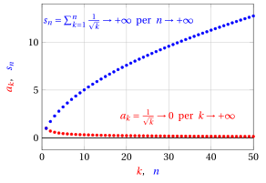
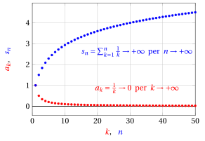
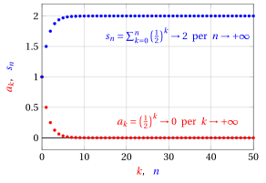
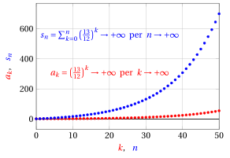
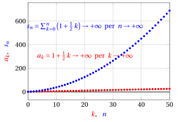

# Serie numeriche

**Parte 5 · Serie · Capitolo 1** · dalle dispense di Fabio Furini · [:material-file-pdf-box: Dispensa del volume (PDF)](../pdf/dispensa-5-serie.pdf)

## 1. Serie numeriche

- Introduciamo ora le serie numeriche, che estendono l'operazione di somma a un numero infinito di addendi.

!!! chiave ""

    La somma di infiniti termini,  anche tutti positivi,  può dare un risultato finito.

- Immaginiamo di misurare un quadrato di area 2 usando questo  procedimento: dividiamo il quadrato a metà usando la diagonale e misuriamo il primo triangolo rettangolo: otterremo 1; poi dividiamo a metà il secondo triangolo rettangolo e misuriamone il primo triangolo rettangolo: otterremo $\frac{1}{2}$;  il rimanente triangolo rettangolo è diviso ancora a metà... e così via indefinitamente.  Otteniamo la somma infinita:

    $$
    1 + \frac{1}{2} + \frac{1}{4} + \frac{1}{8} + \frac{1}{16} + \frac{1}{32} + {\rm \dots} +  \frac{1}{2^k} + {\rm \dots} = \sum_{k=0}^{\infty} \frac{1}{2^k}
    $$

    che, per come è stata costruita, deve dare come risultato 2.

{ .fig .ovale loading=lazy style="width:55%" }

!!! definizione "Definizione 1: di serie numerica"

    Data una successione $\{a_k\}_{k \in \N}$,  chiamiamo <strong>serie numerica</strong> dei termini $a_k$ la scrittura:

    $$
    \sum_{k=0}^{\infty} a_k
    $$

- Si legge “serie (ma anche somma) per $k$ da 0 a $\ip$ di $a_k$”. I valori $a_k$ prendono il nome di <strong>termini generali della serie</strong>.

!!! definizione "Definizione 2: di successione delle somme parziali"

    I numeri

    $$
    s_n = \sum_{k=0}^{n} a_k = a_0 + a_1 +  {\rm \dots} + a_n,~~~~ \forall n \in \N
    $$

    vengono detti <strong>somme parziali $n$-esime</strong> della serie e definiscono <strong>la successione $\{s_n\}$ delle somme parziali</strong>.

!!! chiave ""

    Il <strong>carattere della serie</strong> è determinato dal limite della successione $\{ s_n\}$ per $n$ che tende all'infinito. Diremo che una serie  è <strong>convergente</strong>,  <strong>divergente</strong>,  <strong>irregolare</strong>, se la <strong>successione</strong> $\{s_n\}$ delle  somme parziali è <strong>convergente</strong>, <strong>divergente</strong> o <strong>irregolare</strong>,  rispettivamente.

!!! definizione "Definizione 3: di somma della serie"

    Se la successione $\{s_n\}$  delle  somme parziali è <strong>convergente</strong>,  ovvero se

    $$
    s_n \rr  s \in \R {\rm ~~~~per~~~~}n \rr \ip
    $$

    diciamo che $s$ è <strong>la somma della serie</strong>,  e scriviamo $\sum_{k=0}^{\infty} a_k = s$.

!!! chiave ""

    Quindi se la successione $\{s_n\}$  è <strong>convergente</strong> abbiamo:

    $$
    \sum_{k=0}^{\infty} a_k = \lim_{n \rr \ip} \sum_{k=0}^{n} a_k =  \lim_{n \rr \ip} s_n = s
    $$

    La serie traduce con precisione l'idea di somma di infiniti addendi,  ovvero  si calcola il limite per $n \rr \ip$ della somma finita dei primi $n$ addendi.

- Se invece di sommare a partire da $0$ si parte da un indice $n_0 >0$,  scriviamo $\sum_{k=n_0}^{\infty} a_k$

- Per indicare una generica serie numerica senza indicare l'indice di partenza $n_0$ utilizzeremo il simbolo $\sum a_k$

!!! chiave ""

    Una generica serie numerica $\sum a_k$ coinvolge sempre <strong>due diverse successioni</strong>: 

    1. la successione $\{a_k\}$ dei <strong>termini della serie</strong>

    2. la successione $\{ s_n\}$ delle  <strong>somme parziali</strong>

!!! esempio "Esempio 1: carattere di una serie"

    Determiniamo il carattere della serie:

    $$
    \sum_{k=1}^{\infty} \frac{1}{\sqrt{k}}
    $$

    Abbiamo:

    $$
    s_n = \sum_{k=1}^{n} \frac{1}{\sqrt{k}} = \underbrace{1 + \frac{1}{\sqrt{2}}+{\dots}+\frac{1}{\sqrt{n}}}_{n {\rm ~addendi,~ciascuno~} \ge \frac{1}{\sqrt{n}} } \ge n \cdot \frac{1}{\sqrt{n}} = \sqrt{n} \rr \ip {\rm ~~~per~~~} n \rr \ip
    $$

    Quindi la successione delle somme parziali $\{s_n\}$ è divergente per il teorema del confronto per le successioni e, di conseguenza, la serie è divergente.

    { .fig .ovale loading=lazy style="width:65%" }

### 1.1 Principali proprietà  delle serie numeriche

!!! osservazione "Osservazione 1"

    Se una successione $\{a_k\}$ è a termini non-negativi, ovvero $a_k \ge 0,\forall k$, allora la successione delle somme parziali $\{s_n\}$ è crescente e regolare.

??? dimostrazione "Dimostrazione"

    Data una successione $\{a_k\}$ a termini non negativi, la successione delle somme parziali $\{s_n\}$ è crescente dato che:

    $$
    s_{n+1}= s_{n} + \underbrace{a_{n+1}}_{\ge 0} \ge s_{n}, ~~~\forall n, {\rm ~~~~quindi~~} \lim_{n \rr \ip} s_n = \sup_{n \in \N} \{s_n\}
    $$

    per il teorema di monotonia delle successioni. Di conseguenza la successione $\{s_n\}$ non può essere irregolare. È quindi regolare ovvero o converge o diverge. □

!!! chiave ""

    Data una successione $\{a_k\}$ a termini non negativi:

    - Se $\{s_n\}$ è  <strong>crescente e limitata</strong> allora ammette limite finito e  $\sum a_k$ converge.

    - Se $\{s_n\}$ è  <strong>crescente e  illimitata</strong>  allora $\sum a_k$ diverge a $\ip$.

- Questa osservazione è valida anche per successioni a termini definitivamente non-negativi, positivi o definitivamente positivi.

!!! teorema "Teorema 1"

    Se una serie $\sum a_k$  è convergente allora $\lim_{k \rr \ip} a_k=0$

??? dimostrazione "Dimostrazione"

    Per definizione di serie convergente, la successione delle somme parziali $\{s_n\}$ converge a un numero reale $s$, cioè $s_n \rr s \in \R$ per $n \rr \ip$. Senza perdita di generalità consideriamo $n_0=0$.

    Osserviamo che la  successione $\{s_n\}$ può essere definita in maniera ricorsiva:

    $$
    s_0= a_0,~~~~  s_n = s_{n-1} + a_n,~~ \forall n \ge 1
    $$

    Di conseguenza abbiamo:

    $$
    a_n = s_n - s_{n-1} {\rm ~~~~e~quindi~~~} \lim_{n \rr \ip} a_n =  \lim_{n \rr \ip} \big( s_n -s_{n-1} \big)= s -s =0
    $$

    
□

!!! chiave ""

    La convergenza di una serie implica quindi che $a_k \rr 0$ per $k \rr \ip$, ovvero:

    \begin{equation}
    \sum a_k {\rm ~~convergente~~} ~~\Rightarrow~~ \lim_{k \rr \ip} a_k=0 \label{BBB}
    \end{equation}

    ma il viceversa non è vero (l'esempio 1 è un controesempio):

    \begin{equation}
    \lim_{k \rr \ip} a_k=0  ~~\nRightarrow~~ \sum a_k {\rm ~~convergente~~} 
     \label{CCC}
    \end{equation}

    Quindi il fatto che $a_k \rr 0$ per $k \rr \ip$  è condizione necessaria ma non sufficiente alla convergenza di una serie.

- Dalla contronominale o implicazione inversa  di \(\eqref{BBB}\) abbiamo:

    $$
    \lim_{k \rr \ip} a_k \neq 0  ~~\Rightarrow~~ \sum a_k {\rm ~è~divergente~o ~irregolare~~}
    $$

    ovvero se il limite non è uguale a zero allora la serie non è convergente.

### 1.2 Code delle serie

!!! chiave ""

    Se si modifica un numero finito di termini di una serie, il valore della somma può cambiare, ma il carattere della serie resta immutato.

- Se si modifica il valore di un termine, per esempio $a_{n_0}$, per $n  \ge n_0$ le successioni delle somme parziali, originale e modificata, differiscono solo per tale termine: quindi entrambe convergono, divergono o sono irregolari. Lo stesso vale se si modificano un numero finito di termini.

!!! chiave ""

    I risultati sul carattere delle serie valgono quindi anche se le ipotesi sono verificate “definitivamente”, cioè da un certo indice $n_0$ in poi.

!!! definizione "Definizione 4: di coda di una serie"

    Data una serie $\sum_{k=0}^{\infty} a_k$ e un valore $m \in \N$, la serie  $\sum_{k=m+1}^{\infty} a_k$ viene detta <strong>coda della serie</strong>.

- Data una serie $\sum_{k=0}^{\infty} a_k$ e $m \in \N$ abbiamo:

    \begin{equation}
    \sum_{k=m+1}^{n} a_k = \left(\sum_{k=0}^{n} a_k\right) - \left(\sum_{k=0}^{m} a_k\right) = s_n -s_m, \qquad \forall n > m \label{MMMMM}
    \end{equation}

    quindi per ogni coda (ovvero per ogni $m$) l'associata successione delle somme parziali è uguale a quella della serie di partenza meno una costante. Abbiamo di conseguenza la seguente osservazione:

!!! chiave ""

    Ogni coda di una serie ha lo stesso carattere della serie di partenza.

- Data una serie convergente, passando al limite per $n \rr \ip$ nella \(\eqref{MMMMM}\) si ottiene la relazione:

    \begin{equation}
    \sum_{k=m+1}^{\infty} a_k = \left(\sum_{k=0}^{\infty} a_k\right) -  \left(\sum_{k=0}^{m} a_k\right) = s -s_m~~~  {\rm ~~per~~} n \rr \ip \label{NNNNN}
    \end{equation}

    Abbiamo di conseguenza la seguente osservazione:

!!! chiave ""

    Dato $m \in \N$, ogni coda $\sum_{k=m+1}^{\infty} a_k$ di una serie convergente,  può  essere interpretata come l'<strong>errore</strong> che si commette approssimando la somma $s$ con la somma parziale $s_m$.

!!! teorema "Teorema 2"

    Se una serie $\sum a_k$  è convergente allora

    $$
    \underbrace{s-s_m}_{\displaystyle=\sum_{k=m+1}^{\infty} a_k} \rr  0 {\rm ~~~per~~~} m \rr \ip
    $$

??? dimostrazione "Dimostrazione"

    Per ogni $n > m$,  la somma parziale  $n$-esima della serie vale:

    $$
    s_n = s_{m} + \sum_{k=m+1}^{n} a_k
    $$

    Passando al limite per $n \rr \ip$, abbiamo:

    $$
    s = s_{m} + \underbrace{\lim_{n \rr \ip}\sum_{k=m+1}^{n} a_k }_{\displaystyle =\sum_{k=m+1}^{\infty} a_k}
    $$

    Passando ora al limite per $m \rr \ip$, abbiamo:

    $$
    s =  s + \lim_{m \rr \ip} \sum_{k=m+1}^{\infty} a_k ~~~\Rightarrow~~~ \lim_{m \rr \ip} \sum_{k=m+1}^{\infty} a_k = 0
    $$

    ovvero la tesi del teorema. □

!!! chiave ""

    Questo teorema ci dice che, se una serie è convergente, allora il valore $s - s_m$, ovvero l'errore che si commette approssimando la somma $s$ con la somma parziale $s_m$, tende a zero per $m \rr \ip$. In altre parole, la coda di una serie convergente tende a zero per $m$ che tende a infinito.

### 1.3 Serie armonica

!!! definizione "Definizione 5: di serie armonica"

    Si dice <strong>serie armonica</strong> la serie $\sum_{k=1}^{\infty} \frac{1}{k}$

!!! teorema "Teorema 3: del carattere della serie armonica"

    La serie armonica è divergente a $\ip$

- Graficamente abbiamo:

{ .fig .ovale loading=lazy style="width:65%" }

!!! chiave ""

    La serie armonica $\sum_{k=1}^{\infty}   \frac{1}{k}$  è un controesempio che dimostra la \(\eqref{CCC}\), dato che:

    $$
    \lim_{k \rr \ip} \frac{1}{k} = 0 {\rm ~~~~~~~e~~~~~~~} \sum_{k=1}^{\infty} \frac{1}{k}{\rm ~~~~~è~divergente~a} \ip
    $$

- Prima di dimostrare il teorema, osserviamo che per determinati valori di $n$  le somme parziali sono:

    $$
    \underbrace{s_1}_{\displaystyle =s_{2^{\red 0}}}=1+\frac{\red 0}{2},~~~~\underbrace{s_2}_{\displaystyle =s_{2^{\red 1}}}= s_1 +\frac{1}{2}=1+\frac{0}{2}+\frac{1}{2} = 1+\frac{\red 1}{2},~~~~\underbrace{s_4}_{\displaystyle  =s_{2^{\red 2}}}=s_2 + \underbrace{\left(\frac{1}{3}+\frac{1}{4}\right)}_{\ge \frac{1}{4}+\frac{1}{4}=\frac{1}{2}}\ge 1+\frac{1}{2} + \frac{1}{2}=1 + \frac{\red 2}{2}
    $$

    $$
    \underbrace{s_8}_{\displaystyle =s_{2^{\red 3}}}=s_4 + \underbrace{\left(\frac{1}{5}+\frac{1}{6}+\frac{1}{7}+\frac{1}{8}\right)}_{\ge \frac{1}{8}+\frac{1}{8}+\frac{1}{8}+\frac{1}{8}=\frac{1}{2}} \ge 1 + \frac{2}{2} + \frac{1}{2} = 1 + \frac{\red 3}{2}
    $$

    $$
    \underbrace{s_{16}}_{\displaystyle =s_{2^{\red 4}}}=s_8 + \underbrace{\left(\frac{1}{9}+\frac{1}{10}+\frac{1}{11}+\frac{1}{12}+ \frac{1}{13}+\frac{1}{14}+\frac{1}{15}+\frac{1}{16} \right)}_{\ge \frac{1}{16}+\frac{1}{16}+\frac{1}{16}+\frac{1}{16}+\frac{1}{16}+\frac{1}{16}+\frac{1}{16}+\frac{1}{16}=\frac{1}{2}} \ge 1 + \frac{3}{2} + \frac{1}{2} = 1 + \frac{\red 4}{2}
    $$

??? dimostrazione "Dimostrazione"

    Dimostriamo per induzione su $2^n$ che

    $$
    s_{2^n} \ge 1 + \frac{n}{2},~~~ \forall n \in \N
    $$

    <strong>Primo passo dell'induzione.</strong>  Sia $n = 0$. Allora l'asserto diventa $s_{2^0} \ge 1+\frac{0}{2}$ cioè $1 \ge 1$ che è evidentemente vero.

    <strong>Passo induttivo.</strong> Supponiamo che sia vero per $2^{n-1}$ e proviamolo per $2^{n}$. Per ipotesi induttiva, abbiamo:

    $$
    s_{2^{n-1}} \ge 1 + \frac{n-1}{2}
    $$

    Abbiamo inoltre:

    $$
    s_{2^{n}} = s_{2^{n-1}} + \underbrace{\sum_{k=2^{n-1}+1}^{2^n} \left( \frac{1}{k} \right)}_{\displaystyle \ge 2^{n-1} \cdot \frac{1}{2^n}=\frac{1}{2}}
    {\rm ~~~~quindi~~~~~} 
     s_{2^{n}} \ge  1 + \frac{n-1}{2} + \frac{1}{2} = 1 +\frac{n}{2}
    $$

    che è esattamente l'asserto voluto per $2^{n}$.

    Abbiamo quindi:

    $$
    s_{2^n} \ge 1 + \frac{n}{2}\rr \ip {\rm ~~~per~~~} n \rr \ip
    $$

    e $\{s_n\}$ è illimitata superiormente e anche monotona crescente, visto che $a_k=1/k>0, \forall k >1$. Di conseguenza $\{s_n\}$ diverge a $\ip$ per il teorema di monotonia delle successioni e  la serie armonica diverge a $\ip$. □

!!! chiave ""

    La successione $a_k=1/k, \forall k \ge 1$, della serie armonica è a termini positivi quindi la successione delle somme parziali $\{s_n\}$ è crescente e divergente dato che è illimitata.

### 1.4 Serie geometrica

!!! definizione "Definizione 6: di serie geometrica"

    Dato $q \in \R$, si dice <strong>serie geometrica</strong> di <strong>ragione</strong> $q$ la serie $\sum_{k=0}^{\infty} q^k$

!!! teorema "Teorema 4: del carattere e somma della serie geometrica"

    Data la ragione $q \in \R$,

    $$
    {\rm la~serie~geometrica~} \sum_{k=0}^{\infty} q^k  {\rm ~~~~è~~~~} 
    \begin{cases}
    {\rm convergente~} & {\rm se~} |q| < 1\\[1ex]
    {\rm divergente~a~} \ip & {\rm se~} q \ge 1\\[1ex]
    {\rm irregolare~} & {\rm se~} q \le -1
    \end{cases}
    $$

    Se la serie geometrica è convergente, la  somma $s$ vale $\frac{1}{1-q}$

??? dimostrazione "Dimostrazione"

    Dati $q \in \R$ e $n \in \N$,  la somma parziale  $n$-esima della serie geometrica vale:

    $$
    \sum_{k=0}^n q^k = 
    \begin{cases}
    \displaystyle \frac{1-q^{n+1}}{1-q} & {\rm se~} q \neq 1\\[3ex]
    n+1 & {\rm se~} q = 1
    \end{cases}
    $$

    dato che equivale alla somma dei primi $n+1$ termini della progressione geometrica. Inoltre, abbiamo:

    $$
    \lim_{n \rightarrow +\infty} q^n = 
    \begin{cases}
    +\infty & {\rm se~} q >1\\[2ex]
    1 & {\rm se~} q = 1\\[2ex]
    0 & {\rm se~} |q| < 1\\[2ex]
    {\rm non~esiste~} & {\rm se~} q \le -1
    \end{cases}
    $$

    Quindi, se $q \neq 1$:

    $$
    \lim_{n \rightarrow +\infty} s_n =  \lim_{n \rightarrow +\infty} \frac{1-q^{n+1}}{1-q} = \frac{1}{1-q} \; \lim_{n \rightarrow +\infty} \big(1-q^{n+1}\big) = 
    \begin{cases}
    \displaystyle \frac{1}{1-q} & {\rm se~} |q| < 1\\[2ex]
    +\infty & {\rm se~} q > 1\\[2ex]
    {\rm non~esiste~} & {\rm se~} q \le -1
    \end{cases}
    $$

    e se $q=1$ abbiamo:

    $$
    \lim_{n \rightarrow +\infty} s_n = \lim_{n \rightarrow +\infty} (n+1)= +\infty
    $$

    
□

!!! esempio "Esempio 2: di serie geometrica"

    Determiniamo il carattere della serie:

    $$
    \sum_{k=0}^{\infty} \frac{1}{2^k} = \sum_{k=0}^{\infty} \left(\frac{1}{2}\right)^k
    $$

    È una serie geometrica di ragione $q=1/2$ quindi è convergente  e la somma $s$ vale $1/(1-1/2) =2$.

    { .fig .ovale loading=lazy style="width:70%" }

    Determiniamo il carattere della serie:

    $$
    \sum_{k=0}^{\infty} \left(\frac{13}{12}\right)^k
    $$

    È una serie geometrica di ragione $q=13/12$ quindi è divergente.

    { .fig .ovale loading=lazy style="width:70%" }

<strong>Prova tu</strong> — il grafico interattivo qui sotto ti fa vedere quello che hai appena letto: muovi i cursori.

### 1.5 Serie telescopica

!!! definizione "Definizione 7: di serie telescopica"

    Si dice <strong>serie telescopica</strong> una serie con la forma:

    $$
    \sum_{k=n_0}^{\infty} (b_k-b_{k+1}) {\rm ~~~~~dove~~} \{b_k\} {\rm~è~una ~successione}
    $$

!!! teorema "Teorema 5: del carattere e somma della serie telescopica"

    Una serie telescopica converge, diverge o è irregolare a seconda che la successione $\{b_k\}$ rispettivamente converga, diverga o sia irregolare.

    $$
    {\rm ~~Se~~} \lim_{k \rr \ip} b_k = \ell \in \R^* {\rm ~~~~allora~~~~} \sum_{k=n_0}^{\infty} (b_k-b_{k+1})= b_{n_0} - \underbrace{\lim_{k \rr \ip} b_k}_{=\ell \in \R^*}
    $$

    Inoltre, se $\ell \in \R$, allora la serie telescopica è convergente e la somma $s$ vale $b_{n_0} - \ell$

??? dimostrazione "Dimostrazione"

    Abbiamo

    \begin{align*}
    s_n &= \sum_{k=n_0}^{n_0+n} \big(b_k - b_{k+1}\big)\\[2ex]
    & = (b_{n_0} - b_{n_0+1}) + (b_{n_0+1} - b_{n_0+2}) + {\rm \dots} + (b_{n_0+n} - b_{n_0+n+1})\\[2ex] 
    &= b_{n_0} - b_{n_0+n+1}
    \end{align*}

    quindi:

    $$
    \sum_{k=n_0}^{\infty} (b_k-b_{k+1})=\lim_{n \rightarrow +\infty} s_n = \lim_{n \rightarrow +\infty} (b_{n_0} - b_{n_0+n+1}) = b_{n_0} -\lim_{n \rr \ip} b_n
    $$

    
□

!!! osservazione "Osservazione 2"

    La serie $\sum_{k=1}^{\infty} \frac{1}{k \; (k+1)}$, detta <strong>serie di Mengoli</strong>, è convergente e la somma $s$ è uguale a $1$.

??? dimostrazione "Dimostrazione"

    Abbiamo:

    $$
    \sum_{k=1}^{\infty} \frac{1}{k \; (k+1)} = \sum_{k=1}^{\infty} \frac{(k+1) - k }{k \; (k+1)} =  \sum_{k=1}^{\infty} \underbrace{\frac{1}{k}}_{=b_k} - \underbrace{\frac{1}{k+1}}_{=b_{k+1}}
    $$

    La serie di Mengoli ha quindi la forma:

    $$
    b_k - b_{k+1} {\rm ~~~con~~~} b_k = \frac{1}{k} 
    {\rm ~~~~~e~inoltre~~}
    \lim_{k \rr \ip} b_k = \lim_{k \rr \ip} \frac{1}{k} = 0
    $$

    quindi è una serie telescopica  convergente ($n_0=1$) e inoltre  $s= b_1 = 1$. □

- Graficamente abbiamo:

{ .fig .ovale loading=lazy style="width:65%" }

??? dimostrazione "Dimostrazione"

    <strong>Dimostrazione alternativa</strong>

    Per ogni $n\ge 1$, il valore della somma parziale della serie di Mengoli è:

    $$
    s_n = \sum_{k=1}^{n} \frac{1}{k \; (k+1)}= \sum_{k=1}^n \left( \frac{1}{k} - \frac{1}{k+1} \right)= \left(1 -\frac{1}{2} \right) + \left(\frac{1}{2} -\frac{1}{3} \right) + {\rm \dots} + \left(\frac{1}{n} -\frac{1}{n+1} \right)= 1 - \frac{1}{n+1}
    $$

    Quindi abbiamo

    $$
    \sum_{k=1}^{\infty} a_k =  \lim_{n \rr \ip} s_n =   \lim_{n \rr \ip} 1 - \frac{1}{n+1} = 1
    $$

    Di conseguenza la serie di Mengoli è convergente e la sua somma $s$ vale 1. □

!!! esempio "Esempio 3: serie telescopica"

    Determiniamo il carattere della serie:

    $$
    \sum_{k=1}^{\infty} \frac{1}{(3\;k+2)\;(3\;k+5)}
    $$

    Abbiamo:

    $$
    \frac{1}{(3\;k+2)\;(3\;k+5)} = \frac{\alpha}{3\;k+2}-\frac{\beta}{3\;k+5} = \frac{\alpha\:(3\;k+5)-\beta\;(3\;k+2)}{(3\;k+2)\;(3\;k+5)} = \frac{3\;(\alpha-\beta)\;k +5\;\alpha -2\;\beta}{(3\;k+2)\;(3\;k+5)}
    $$

    $$
    \Rightarrow  
    \begin{cases}
    3\;(\alpha-\beta) =0\\
    5\;\alpha -2\;\beta =1
    \end{cases}
    \Rightarrow  \alpha=\beta,~~~ 3\;\alpha=1 {\rm ~~quindi~~} \alpha=\beta=\frac{1}{3}
    $$

    di conseguenza:

    $$
    \frac{1}{(3\;k+2)\;(3\;k+5)} = \frac{1}{3} \left(\frac{1}{3\;k+2} - \frac{1}{3\;k+5} \right) = \frac{1}{3}  \left( \underbrace{\frac{1}{3\;k+2}}_{=b_k} - \underbrace{\frac{1}{3\;(k+1)+2}}_{=b_{k+1}} \right)
    $$

    La serie ha quindi la forma:

    $$
    b_k - b_{k+1} {\rm ~~~con~~~} b_k = \frac{1}{3\;k+2} 
    {\rm ~~~~~e~inoltre~~}
    \lim_{k \rr \ip} b_k = \lim_{k \rr \ip} \frac{1}{3\;k+2} = 0
    $$

    ovvero una serie telescopica ($n_0=1$) e abbiamo:

    \begin{align*}
    \sum_{k=1}^{\infty} \frac{1}{(3\;k+2)\;(3\;k+5)} 
     = \frac{1}{3}  \left( b_1 - \underbrace{ \lim_{k \rr \ip}  b_{k}}_{\rr 0}\right) =  \frac{1}{3} \; b_1 = \frac{1}{15}
    \end{align*}

    Quindi è una serie telescopica convergente e la somma $s$ vale $\frac{1}{15}$.
