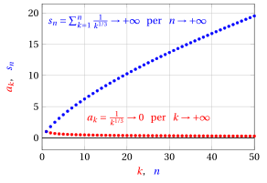
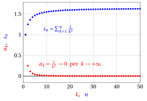

# Serie numeriche a termini non negativi

**Parte 5 · Serie · Capitolo 2** · dalle dispense di Fabio Furini · [:material-file-pdf-box: PDF del capitolo](../pdf/serie-02-termini-non-negativi.pdf)

## 1. Serie numeriche a termini non negativi

!!! chiave ""

    Una <strong>serie</strong> $\sum a_k$ <strong>a termini non negativi</strong> (o positivi) è <strong>regolare</strong>, ovvero o è convergente o è divergente a $\ip$ (non può essere irregolare come abbiamo dimostrato). Tale serie converge  se e solo se la  successione delle somme parziali è limitata.

### 1.1 Criterio del confronto

!!! teorema "Teorema 1: del criterio del confronto"

    Siano $\{a_k\}$ e $\{b_k\}$ due successioni a termini non negativi tali che  $a_k \le b_k$, definitivamente, allora:

    $$
    i)~~~~ \sum b_k {\rm ~~~convergente~} ~~\Rightarrow~~ \sum a_k {\rm ~~~convergente~}
    $$

    $$
    ii)~~~~ \sum a_k {\rm ~~~divergente~} ~~\Rightarrow~~ \sum b_k {\rm ~~~divergente~}
    $$

- La serie $\sum b_k$ viene detta <strong>maggiorante</strong> mentre la serie  $\sum a_k$ viene detta <strong>minorante</strong>.

??? dimostrazione "Dimostrazione"

    Dato che $a_k \le b_k$, definitivamente, allora esiste $m \in \N$ tale che:

    $$
    a_k \le b_k,~~~ \forall k \ge m
    $$

    Consideriamo ora le somme parziali $n$-esime delle code delle due successioni $\{a_k\}$ e $\{b_k\}$ con $n >m$:

    $$
    s_n^a=\sum_{k=m+1}^n a_k {\rm ~~~~~e~~~~~~}s^b_n=\sum_{k=m+1}^n b_k
    $$

    Poiché $0\le a_k \le b_k$, $\forall k \ge m$, abbiamo

    \begin{equation}
    0~~ \le~~ s^a_n~~ \le~~ s^b_n,~~~ \forall n \ge m \label{JJJJ}
    \end{equation}

    Le successioni $\{s^a_n\}$ e $\{s^b_n\}$ sono regolari, dato che $\{a_k\}$ e $\{b_k\}$ sono a termini non negativi. Dunque le tesi $i)$ e $ii)$ sono logicamente equivalenti, perciò basta dimostrare la seconda.

    Affermare $\sum a_n$  divergente, per definizione di serie divergente, significa che $s_n \rr \ip$ per $n \rr \ip$. Inoltre dato che ogni coda ha lo stesso carattere della serie di partenza abbiamo $s^a_n \rr \ip$ per $n \rr \ip$.

    Dalla \(\eqref{JJJJ}\), per il teorema del confronto per le successioni, anche ${s}^b_n \rr \ip$ per $n \rr \ip$. Quindi la coda di $\{b_k\}$ è divergente e di conseguenza $\sum b_n$ è divergente. □

!!! osservazione "Osservazione 1"

    Dato $\alpha \le1$, la serie  $\sum_{k=1}^{\infty} \frac{1}{k^{\alpha}}$ è divergente a $\ip$.

??? dimostrazione "Dimostrazione"

    Con $\alpha= 1$ abbiamo la serie armonica che diverge a $\ip$. Con  $\alpha <1$, la serie è maggiorante della serie armonica, dato che:

    $$
    \frac{1}{k}  \le \frac{1}{k^{\alpha}},~~~~~~~~~\forall k \in \N, k \ge 1 {\rm~~~e~~~} \alpha <1
    $$

    quindi $\sum_{k=1}^{\infty} \frac{1}{k^{\alpha}}$ è divergente per il criterio del confronto. □

- Graficamente, ad esempio con $\alpha= \frac{1}{3}$, abbiamo:

{ .fig .ovale loading=lazy style="width:65%" }

### 1.2 Criterio del confronto asintotico

!!! teorema "Teorema 2: del criterio del confronto asintotico"

    Siano $\{a_k\}$ e $\{b_k\}$ due successioni  a termini positivi. Se le successioni sono asintotiche, ovvero se:

    $$
    a_k \sim b_k {\rm ~~~per~~~} k \rr \ip
    $$

    allora le corrispondenti serie $\sum a_k$ e $\sum b_k$ sono regolari e hanno lo stesso carattere, cioè o sono entrambe convergenti o sono entrambe divergenti.

??? dimostrazione "Dimostrazione"

    Le serie $\sum a_k$ e $\sum b_k$ sono regolari perché le successioni $\{a_k\}$ e $\{b_k\}$ sono a termini positivi. Dato che $a_k \sim b_k$ per  $k \rr \ip$, allora:

    $$
    \frac{a_k}{b_k} \rr 1 {\rm ~~per~~} k \rr \ip
    $$

    Quindi, per ogni $\varepsilon >0$, esiste $m \in \N$ tale che $\forall k \ge m$ abbiamo:

    $$
    1- \varepsilon < \frac{a_k}{b_k} < 1 +\varepsilon
    {\rm ~~~~e~quindi~~~~}  
    (1- \varepsilon)\; b_k < a_k < (1 +\varepsilon)\; b_k {\rm ~~~~dato~che~}  b_k >0, \forall k
    $$

    Abbiamo quindi dimostrato che $(1- \varepsilon)\; b_k < a_k  < (1 +\varepsilon)\; b_k$, definitivamente. Quindi per il teorema del criterio del confronto le serie $\sum a_k$ e $\sum b_k$ hanno lo stesso carattere.

    La prima delle due disuguaglianze implica che se $\sum a_k$ è convergente anche $\sum b_k$ è convergente, mentre la seconda implica che se $\sum a_k$ è divergente anche $\sum b_k$ è divergente. □

!!! osservazione "Osservazione 2"

    Dato $\alpha \ge 2$, la serie  $\sum_{k=1}^{\infty} \frac{1}{k^{\alpha}}$ è convergente.

??? dimostrazione "Dimostrazione"

    Con $\alpha= 2$ abbiamo:

    $$
    \frac{1}{k^2} \sim \frac{1}{k \; (k+1)} {\rm ~~~per~~~} k \rr \ip
    $$

    e la serie $\sum_{k=1}^{\infty} \frac{1}{k \; (k+1)}$ converge (serie di Mengoli). Quindi per il criterio del confronto asintotico anche $\sum_{k=1}^{\infty} \frac{1}{k^2}$ converge.

    Con $\alpha>  2$, la serie è minorante della serie $\sum_{k=1}^{\infty} \frac{1}{k^2}$, dato che:

    $$
    \frac{1}{k^{\alpha}} \le \frac{1}{k^2},~~~~~~~~~\forall k \in \N, k \ge 1 {\rm~~~e~~~} \alpha >2
    $$

    quindi $\sum_{k=1}^{\infty} \frac{1}{k^{\alpha}}$ è convergente per il criterio del confronto. □

- Graficamente, ad esempio con $\alpha= 2$, abbiamo:

{ .fig .ovale loading=lazy style="width:65%" }

!!! esempio "Esempio 1: criterio del confronto asintotico"

    Determiniamo il carattere della serie:

    $$
    \sum_{k=1}^{\infty} \frac{5\;k + \cos k}{3 + 2\; k^3}
    $$

    Abbiamo:

    $$
    \frac{5\;k + \cos k}{3 + 2\; k^3} \sim \frac{5}{2} \cdot \frac{1}{k^2} {\rm ~~~per~~~} k \rr \ip {\rm ~~~~~e~~~~~}  \sum_{k=1}^{\infty} \frac{5}{2} \cdot \frac{1}{k^{2}} {\rm ~~~converge~~~}
    $$

    quindi la serie è convergente per il criterio del confronto asintotico.

    { .fig .ovale loading=lazy style="width:65%" }

!!! chiave ""

    Anche se le successioni sono asintotiche le corrispondenti serie potrebbero però non avere la stessa somma.

### 1.3 Criterio di condensazione

!!! teorema "Teorema 3: del criterio di condensazione"

    Se $\{a_k\}$ è una successione definitivamente decrescente a termini non negativi, allora le  serie $\sum_{k=1}^{\infty} a_k$ e $\sum_{k=0}^{\infty} 2^k\; a_{2^k}$ sono regolari e hanno lo stesso carattere  cioè o sono entrambe convergenti o sono entrambe divergenti.

- Prima di dimostrare il teorema,  consideriamo la successione $\{\tilde{s}_n\}$ delle somme parziali della successione $\{2^k \; a_{2^k}\}$, ovvero la successione:

    $$
    \tilde{s}_n = \sum_{k=0}^n 2^k \; a_{2^k}\qquad \forall n \ge 0
    $$

    e deriviamo due importanti relazioni con la successione $\{s_n\}$ delle somme parziali della successione $\{a_{k}\}$, ovvero la successione:

    $$
    {s}_n = \sum_{k=1}^n a_{k}\qquad \forall n \ge 1
    $$

- Osserviamo che, per determinati valori di $n$, le somme parziali $s_n$ sono:

    \begin{align*}
    \underbrace{s_1}_{\displaystyle =s_{2^1-1}}&=a_1,\qquad
    \underbrace{s_3}_{\displaystyle =s_{2^2-1}}=s_1 + a_2+\underbrace{a_3}_{\le a_2} \le a_1 + 2\;a_2\\[1ex]
    \underbrace{s_7}_{\displaystyle =s_{2^3-1}}&=s_3 + a_4 + \underbrace{a_5}_{\le a_4}+ \underbrace{a_6}_{\le a_4}+ \underbrace{a_7}_{\le a_4} \le a_1 + 2\;a_2 + 4\;a_4\\[1ex]
    \underbrace{s_{15}}_{\displaystyle =s_{2^4-1}}&=s_7 + a_8 + \underbrace{a_9}_{\le a_8} + \underbrace{a_{10}}_{\le a_8}+ \underbrace{a_{11}}_{\le a_8}+ \underbrace{a_{12}}_{\le a_8}+ \underbrace{a_{13}}_{\le a_8}+ \underbrace{a_{14}}_{\le a_8}+ \underbrace{a_{15}}_{\le a_8} \le a_1 + 2\;a_2 + 4\;a_4 + 8\;a_8
    \end{align*}

!!! osservazione "Osservazione 3"

    Data una successione $\{a_k\}$ definitivamente decrescente a termini non negativi, abbiamo:

    \begin{equation}
    s_{2^n-1} ~~\le~~  \underbrace{\sum_{k=0}^{n-1} 2^k \; a_{2^k}}_{=\tilde{s}_{n-1}}\qquad \forall n \ge 1 \label{P1}
    \end{equation}

??? dimostrazione "Dimostrazione"

    Dimostriamo  per induzione su $2^n$ che

    $$
    s_{2^n-1} ~~\le~~ \sum_{k=0}^{n-1} 2^k \; a_{2^k}\qquad \forall n \ge 1
    $$

    <strong>Primo passo dell'induzione.</strong>  Sia $n = 1$. Allora l'asserto diventa $s_{2^1-1} \le 2^0 \; a_1$ cioè  $a_1 \le a_1$ che è evidentemente vero.

    <strong>Passo induttivo.</strong> Supponiamo che sia vero per $2^{n-1}$ e proviamolo per $2^n$. Per ipotesi induttiva, abbiamo $s_{2^{n-1}-1} ~\le~ \sum_{k=0}^{n-2} 2^k \; a_{2^k}$. Abbiamo inoltre:

    $$
    s_{2^{n}-1} = s_{2^{n-1}-1} + \underbrace{\sum_{i=2^{n-1}}^{2^{n}-1} a_i}_{\le~ 2^{n-1} \; a_{2^{n-1}}}
    {\rm ~~~quindi~~~~~} 
     s_{2^{n}-1} ~\le~  \sum_{k=0}^{n-2} 2^k \; a_{2^k} + 2^{n-1} \; a_{2^{n-1}} = \sum_{k=0}^{n-1} 2^k \; a_{2^k}
    $$

    che è esattamente l'asserto voluto per $2^n$. □

- Osserviamo ora che i valori di $\tilde{s}_n$ sono:

    \begin{align*}
    \tilde{s}_0&=a_1 \le 2 \; a_1 = 2\;\underbrace{s_1}_{\displaystyle =s_{2^0}},\qquad
    \tilde{s}_1=\tilde{s}_0 + 2\;a_2 \le 2\;s_1 + 2 \; a_2 = 2\;\underbrace{s_2}_{\displaystyle =s_{2^1}}\\[2ex]
    \tilde{s}_2&=\tilde{s}_1 + 4\;a_4 \le 2\;s_2 + 2 \; a_3 + 2 \; a_4 = 2\;\underbrace{s_4}_{\displaystyle =s_{2^2}} ~~~ ({\rm dato~che~} a_4 \le a_3 )\\[2ex]
    \tilde{s}_3&=\tilde{s}_2 + 8\;a_8 \le 2\;s_4 + 2 \; a_5 + 2 \; a_6 + 2 \; a_7 + 2 \; a_8 = 2\;\underbrace{s_8}_{\displaystyle =s_{2^3}}~~~ ({\rm dato~che~} a_8 \le a_7 \le a_6 \le a_5 )
    \end{align*}

!!! osservazione "Osservazione 4"

    Data una successione $\{a_k\}$ definitivamente decrescente a termini non negativi, abbiamo:

    \begin{equation}
    \underbrace{\sum_{k=0}^{n} 2^k \; a_{2^k}}_{=\tilde{s}_{n}} ~~\le~~ 2\; s_{2^n} \qquad \forall n \ge 0 \label{P2}
    \end{equation}

??? dimostrazione "Dimostrazione"

    Dimostriamo per induzione su $2^n$ che

    $$
    \tilde{s}_{n} ~~\le~~ 2\; s_{2^n}\qquad \forall n \ge 0
    $$

    <strong>Primo passo dell'induzione.</strong>  Sia $n = 0$. Allora l'asserto diventa $\tilde{s}_{0} \le 2 \; s_{2^0} = 2 s_1$ cioè $a_1 \le 2\;a_1$ che è evidentemente vero.

    <strong>Passo induttivo.</strong> Supponiamo che sia vero per $n-1$ e proviamolo per $n$. Per ipotesi induttiva, abbiamo  $\tilde{s}_{n-1}  ~\le~ 2 \; s_{2^{n-1}}$. Abbiamo inoltre:

    $$
    \tilde{s}_{n} = \tilde{s}_{n-1} + \underbrace{ 2^{n} \; a_{2^{n}}}_{\displaystyle \le \sum_{i=2^{n-1}+1}^{2^{n}} 2\; a_i}
    {\rm ~~~quindi~~~~~} 
     \tilde{s}_{n} ~\le~  2 \; s_{2^{n-1}} +\sum_{i=2^{n-1}+1}^{2^{n}} 2\; a_i  = 2 \; s_{2^{n}}
    $$

    che è esattamente l'asserto voluto per $n$. □

- Siamo ora in grado di dimostrare il teorema.

??? dimostrazione "Dimostrazione"

    Dalla relazione \(\eqref{P1}\) abbiamo:

    $$
    s_{2^n-1} \le \tilde{s}_{n-1} ,~~~ \forall n \ge 1
    $$

    Quindi se $\{\tilde{s}_n\}$ è convergente, ovvero se $\sum_{k=0}^{\infty} 2^k\; a_{2^k}$ è convergente, la sottosuccessione $\{s_{2^{n}-1}\}$ è limitata.  Dato che $\{s_n\}$ è monotona tutta la successione $\{s_n\}$ risulta limitata e convergente per il teorema di monotonia delle successioni. Di conseguenza, se $\sum_{k=0}^{\infty} 2^k\; a_{2^k}$ è convergente anche $\sum_{k=1}^{\infty}  a_{k}$ è convergente.

    Dalla relazione \(\eqref{P2}\) abbiamo:

    $$
    \tilde{s}_{n}  \le 2\;s_{2^n},~~~ \forall n \ge 0
    $$

    Quindi se $\{{s}_n\}$ è convergente, ovvero se $\sum_{k=1}^{\infty} a_{k}$ è convergente, allora  la sottosuccessione $\{s_{2^n}\}$ è convergente (dato che $\{{s}_n\}$ è monotona). Di conseguenza per confronto anche $\{\tilde{s}_{n}\}$ è convergente ovvero $\sum_{k=0}^{\infty} 2^k\; a_{2^k}$ converge.

    Inoltre dato che $\{a_k\}$ è a termini non negativi non può essere irregolare, di conseguenza abbiamo anche:

    \begin{equation*}
    \sum_{k=1}^{\infty} a_k {\rm ~~divergente~~} ~~\Longleftrightarrow~~ \sum_{k=0}^{\infty} 2^k\; a_{2^k} {\rm ~~divergente~~}
    \end{equation*}

    che completa la dimostrazione del teorema. □

!!! chiave ""

    Data una successione $\{a_k\}$ definitivamente decrescente a termini non negativi, abbiamo dimostrato che:

    \begin{equation*}
    \sum_{k=1}^{\infty} a_k {\rm ~~convergente/divergente~~} ~~\Longleftrightarrow~~ \sum_{k=0}^{\infty} 2^k\; a_{2^k} {\rm ~~convergente/divergente~~}
    \end{equation*}

    Quindi la condizione di convergenza/divergenza di $\sum_{k=0}^{\infty} 2^k\; a_{2^k}$ è una condizione necessaria e sufficiente alla convergenza/divergenza di $\sum_{k=1}^{\infty}  a_{k}$.

### 1.4 Serie armonica generalizzata

!!! definizione "Definizione 1: di serie armonica generalizzata"

    Dato $\alpha \in \R$, si dice <strong>serie armonica generalizzata</strong> la serie $\sum_{k=1}^{\infty} \frac{1}{k^{\alpha}}$

!!! teorema "Teorema 4: del carattere della serie armonica generalizzata"

    Dato $\alpha \in \R$,

    $$
    {\rm la~serie~armonica~generalizzata~} \sum_{k=1}^{\infty} \frac{1}{k^{\alpha}}  {\rm ~~~~è~~~~} 
    \begin{cases}
    {\rm divergente~a~} \ip & {\rm se~} \alpha \le 1\\[2ex]
    {\rm convergente~} & {\rm se~} \alpha > 1
    \end{cases}
    $$

??? dimostrazione "Dimostrazione"

    Abbiamo stabilito che  diverge per $\alpha \le 1$. Per $\alpha >1$,  la successione $\left\{\frac{1}{k^{\alpha}}\right\}$ è una successione decrescente e a termini positivi. Abbiamo:

    $$
    \sum_{k=0}^{\infty} 2^k a_{2^k} = \sum_{k=0}^{\infty} 2^k \frac{1}{(2^k)^{\alpha}} = \sum_{k=0}^{\infty} \left( 2^{1-\alpha} \right)^k
    $$

    ovvero una serie geometrica di ragione $2^{1-\alpha}$ che converge se e solo se $2^{1-\alpha}<1$ ovvero se $1 -\alpha < 0$. Quindi per $\alpha >1$, per il criterio di condensazione, la serie converge. □

<strong>Prova tu</strong> — il grafico interattivo qui sotto ti fa vedere quello che hai appena letto: muovi i cursori.

### 1.5 Criterio del passaggio dal discreto al continuo

- Gli strumenti utili a stabilire stime asintotiche di funzioni, si possono usare anche per ottenere stime asintotiche di successioni (<strong>passaggio dal discreto al continuo</strong>) e forniscono strumenti utili per lo studio del carattere di una serie a termini positivi.

!!! esempio "Esempio 2: passaggio dal discreto al continuo"

    Determiniamo il carattere della serie:

    $$
    \sum_{k=1}^{\infty} \frac{e^{1/k}-1}{k}
    $$

    Dall'equivalenza asintotica

    $$
    e^{\varepsilon(x)} - 1 \sim \varepsilon(x) {\rm ~~~~per~~~~}   \varepsilon(x) \rr 0
    $$

    abbiamo

    $$
    \frac{e^{1/k}-1}{k} \sim \frac{1}{k^2} {\rm ~~~~per~~~~}   k \rr \ip
    $$

    Perciò la serie, a termini positivi, per confronto asintotico con la serie di $1/k^2$ , converge.

!!! esempio "Esempio 3: passaggio dal discreto al continuo"

    Determiniamo il carattere della serie:

    $$
    \sum_{k=1}^{\infty} \log \left( \frac{k+3}{k+2} \right)
    $$

    Abbiamo

    $$
    \frac{k+3}{k+2} = 1 + \frac{1}{k+2}= 1 + \frac{1}{k+2}
    $$

    Dall'equivalenza asintotica

    $$
    \log (1 + \varepsilon(x)) \sim \varepsilon(x) {\rm ~~~~per~~~~}   \varepsilon(x) \rr 0
    $$

    abbiamo

    $$
    \log \left( 1 + \frac{1}{k+2} \right) \sim \frac{1}{k+2} \sim \frac{1}{k} {\rm ~~~~per~~~~}   k \rr \ip
    $$

    Dunque si tratta di una serie a termini positivi, il cui termine generale è asintotico a $1/k$. Per confronto con la serie armonica, questa serie diverge a $\ip$.

!!! esempio "Esempio 4: passaggio dal discreto al continuo"

    Determiniamo il carattere della serie:

    $$
    \sum_{k=1}^{\infty} \left( \frac{1}{k} -\sin \frac{1}{k} \right)
    $$

    Dallo sviluppo di MacLaurin di terzo grado

    $$
    \sin \big(\varepsilon(x) \big) = \varepsilon(x) - \frac{\big(\varepsilon(x) \big)^3}{3!} + o\bigg(\big(\varepsilon(x) \big)^{3}\bigg) {\rm ~~~~per~~~~}   \varepsilon(x) \rr 0
    $$

    abbiamo

    $$
    \frac{1}{k} -\sin \frac{1}{k} = \frac{1}{k} - \left( \frac{1}{k} - \frac{1}{6\;k^3} + o\left(\frac{1}{k^3}\right) \right) \sim \frac{1}{6\;k^3}  {\rm ~~~~per~~~~}   k \rr \ip
    $$

    Perciò la serie, a termini positivi, per confronto asintotico con la serie di $1/(6\:k^3)$ , converge.

### 1.6 Criterio della radice

!!! teorema "Teorema 5: del criterio della radice"

    Sia $\{a_k\}$ una successione a termini non negativi. Se esiste il limite:

    $$
    \lim_{k \rr \ip} \sqrt[k]{a_k} = \ell \in \R^*
    {\rm~~allora~la~serie~} \sum a_k  {\rm ~~~~è~~~~} 
    \begin{cases}
    {\rm convergente~} & {\rm se~} \ell < 1 {\rm ~~o~~} \ell = \im\\[2ex]
    {\rm divergente~a~} \ip & {\rm se~} \ell > 1 {\rm ~~o~~} \ell = \ip
    \end{cases}
    $$

??? dimostrazione "Dimostrazione"

    Supponiamo che $\lim_{k \rr \ip} \sqrt[k]{a_k} = \ell < 1$. Poiché $\sqrt[k]{a_k} \rr \ell \in \R$, allora  per ogni $\varepsilon >0$, esiste $m \in \N$ tale che $\forall k \ge m$:

    $$
    \sqrt[k]{a_k} ~\le~ \ell + \frac{\varepsilon}{2}
    $$

    Inoltre, dato che $\ell < 1$, abbiamo $\ell < 1 - \varepsilon$ per un $\varepsilon > 0$ opportuno. Per questo $\varepsilon$ si ha dunque che, definitivamente:

    $$
    \sqrt[k]{a_k} ~\le~ \ell + \frac{\varepsilon}{2} < (1 - \varepsilon) + \frac{\varepsilon}{2} = 1 - \frac{\varepsilon}{2} {\rm ~~~~quindi~~~~} a_k < \left(1 - \frac{\varepsilon}{2} \right)^k,~~ \forall k \ge m
    $$

    Abbiamo quindi dimostrato che $a_k < \left(1 - \frac{\varepsilon}{2} \right)^k$, definitivamente. La serie geometrica:

    $$
    \sum_{k=0}^{\infty} \left(1 - \frac{\varepsilon}{2}\right)^k {\rm ~~~è ~convergente~dato~che~~} 1 - \frac{\varepsilon}{2} <1
    $$

    Quindi per il teorema del criterio del confronto la serie di partenza converge.

    Supponiamo che $\lim_{k \rr \ip} \sqrt[k]{a_k} = \ell > 1$. Poiché $\sqrt[k]{a_k} \rr \ell \in \R$, allora  per ogni $\varepsilon >0$, esiste $m \in \N$ tale che $\forall k \ge m$:

    $$
    \sqrt[k]{a_k} ~\ge~ \ell - \frac{\varepsilon}{2}
    $$

    Inoltre, dato che $\ell > 1$, abbiamo $\ell > 1 + \varepsilon$ per un $\varepsilon > 0$ opportuno. Per questo $\varepsilon$ si ha dunque che, definitivamente:

    $$
    \sqrt[k]{a_k} ~\ge~ \ell - \frac{\varepsilon}{2} > (1 + \varepsilon) - \frac{\varepsilon}{2} = 1 + \frac{\varepsilon}{2} {\rm ~~~~quindi~~~~} a_k > \left(1 + \frac{\varepsilon}{2} \right)^k,~~ \forall k \ge m
    $$

    Abbiamo quindi dimostrato che $a_k > \left(1 + \frac{\varepsilon}{2} \right)^k$, definitivamente. La serie geometrica:

    $$
    \sum_{k=0}^{\infty} \left(1 + \frac{\varepsilon}{2} \right)^k {\rm ~~~è ~divergente~dato~che~~} 1 + \frac{\varepsilon}{2} >1
    $$

    Quindi per il teorema del criterio del confronto la serie di partenza diverge. □

!!! chiave ""

    Chiaramente questi ragionamenti rimangono rispettivamente validi anche se $\ell = \im$ oppure $\ip$.

!!! osservazione "Osservazione 5"

    $$
    {\rm La~serie~~~~} \sum_{k=1}^{\infty} k^\beta  \cdot b^k {\rm ~~con~~~} \beta \in \R,b \ge 0 {\rm ~~~~è~~~~~~} 
    \begin{cases}
    {\rm convergente~} & {\rm se~} b < 1\\[2ex]
    {\rm divergente} & {\rm se~} b > 1 \\[2ex]
    {\rm convergente}  & {\rm se~} b = 1 {\rm ~~e~~} \beta < -1 \\[2ex]
    {\rm divergente}  & {\rm se~} b = 1 {\rm ~~e~~} \beta \ge  -1 
    \end{cases}
    $$

??? dimostrazione "Dimostrazione"

    È una serie a termini non negativi, abbiamo:

    $$
    \sqrt[k]{k^\beta \cdot b^k} = b \cdot k^{\beta/k} {\rm ~~~~~e~~~~}
     \lim_{k \rr \ip} k^{\beta/k} = \lim_{k \rr \ip} \exp \left( \underbrace{\frac{\beta}{k} \cdot \log k}_{\rr 0} \right) = 1
    $$

    quindi, per il criterio della radice, con $b < 1$ converge e con $b > 1$ diverge. Se $b=1$, la serie diventa:

    $$
    \sum_{k=1}^{\infty} k^\beta =  \sum_{k=1}^{\infty} \frac{1}{k^{-\beta}}
    $$

    ovvero una serie armonica generalizzata; con $\beta < -1$ è convergente, mentre con $\beta \ge -1$ è divergente. □

!!! osservazione "Osservazione 6"

    La serie $\sum_{k=1}^{\infty} b^k / k^k$ con $b \ge 0$ è convergente

??? dimostrazione "Dimostrazione"

    È una serie a termini non negativi, abbiamo:

    $$
    \sqrt[k]{\frac{b^k}{k^k}} = \frac{b}{k} \rr 0 {\rm ~~~per~~~} k \rr \ip
    $$

    quindi la serie converge per il criterio della radice. □

### 1.7 Criterio del rapporto

!!! teorema "Teorema 6: del criterio del rapporto"

    Sia $\{a_k\}$ una successione a termini positivi. Se esiste il limite:

    $$
    \lim_{k \rr \ip} \frac{a_{k+1}}{a_k} = \ell \in \R^*
    {\rm~~allora~la~serie~}  \sum a_k  {\rm ~~~~è~~~~} 
    \begin{cases}
    {\rm convergente~} & {\rm se~} \ell < 1 {\rm ~~o~~} \ell = \im\\[2ex]
    {\rm divergente~a~} \ip & {\rm se~} \ell > 1 {\rm ~~o~~} \ell = \ip
    \end{cases}
    $$

??? dimostrazione "Dimostrazione"

    Supponiamo che $\lim_{k \rr \ip} a_{k+1}/ a_k = \ell<1$. Ragionando come nella dimostrazione del criterio della radice, esiste $m \in \N$ tale che $\forall k \ge m$:

    $$
    \frac{a_{k+1}}{a_k} < \left(1 - \frac{\varepsilon}{2} \right)
    $$

    per un opportuno $\varepsilon >0$. Ciò implica, ragionando iterativamente, che:

    $$
    a_{k+1} < \left(1 - \frac{\varepsilon}{2} \right) \; a_k < \left(1 - \frac{\varepsilon}{2} \right) \; \left(1 - \frac{\varepsilon}{2} \right) \; a_{k-1} < {\rm \dots} < \left(1 - \frac{\varepsilon}{2} \right)^{k-m+1}  a_m
    $$

    Abbiamo quindi dimostrato che $a_k < \left(1 - \frac{\varepsilon}{2} \right)^{k-m} \; a_m$, definitivamente. La serie geometrica:

    $$
    \sum_{k=m}^{\infty} \left(1 - \frac{\varepsilon}{2}\right)^{k-m}\; a_m {\rm ~~~è ~convergente~dato~che~~} 1 - \frac{\varepsilon}{2} <1
    $$

    Quindi per il teorema del criterio del confronto la serie di partenza converge.

    Supponiamo che  $\lim_{k \rr \ip} a_{k+1}/a_k = \ell>1$. Ragionando come nella dimostrazione del criterio della radice, esiste $m \in \N$ tale che $\forall k \ge m$:

    $$
    \frac{a_{k+1}}{a_k} > \left(1 + \frac{\varepsilon}{2} \right)
    $$

    per un opportuno $\varepsilon >0$. Ciò implica, ragionando iterativamente, che:

    $$
    a_{k+1} > \left(1 + \frac{\varepsilon}{2} \right) \; a_k > \left(1 + \frac{\varepsilon}{2} \right) \; \left(1 + \frac{\varepsilon}{2} \right) \; a_{k-1} > {\rm \dots} > \left(1 + \frac{\varepsilon}{2} \right)^{k-m+1}  a_m
    $$

    Abbiamo quindi dimostrato che $a_k > \left(1 + \frac{\varepsilon}{2} \right)^{k-m} \; a_m$, definitivamente. La serie geometrica:

    $$
    \sum_{k=m}^{\infty} \left(1 + \frac{\varepsilon}{2}\right)^{k-m}\; a_m {\rm ~~~è ~divergente~dato~che~~} 1 + \frac{\varepsilon}{2} >1
    $$

    Quindi per il teorema del criterio del confronto la serie di partenza diverge. □

!!! chiave ""

    Chiaramente questi ragionamenti rimangono rispettivamente validi anche se $\ell = \im$ oppure $\ip$.

!!! osservazione "Osservazione 7"

    $$
    \sum_{k=0}^{\infty} \frac{1}{k!} = e
    $$

??? dimostrazione "Dimostrazione"

    Abbiamo

    $$
    \frac{1/(k+1)!}{1/k!} = \frac{1}{k+1} \rr 0 {\rm ~~~per~~~} k \rr \ip
    $$

    Perciò la serie a termini non negativi converge per il criterio del rapporto. La dimostrazione che la somma della serie è uguale ad  $e$ verrà data in seguito utilizzando le serie di funzioni. □

### 1.8 Serie numeriche a termini non positivi

- Sappiamo che il carattere di una serie non cambia se ne alteriamo un numero finito di termini. Di conseguenza, i criteri  per le serie a termini non negativi, si applicano anche alle serie con termini definitivamente non negativi.

- Raccogliendo un segno meno dall'intera serie poi, si vede che questi criteri si possono applicare anche alle serie a termini non positivi, e quindi alle serie a termini definitivamente non positivi.

!!! chiave ""

    In sintesi, quindi, i criteri visti si applicano alle serie che hanno tutti i termini (tranne un numero finito) dello stesso segno.
