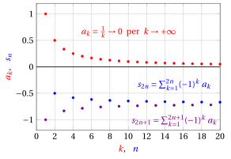

# Serie numeriche a termini di segno variabile

**Parte 5 · Serie · Capitolo 3** · dalle dispense di Fabio Furini e Valerio Dose · [:material-file-pdf-box: PDF del capitolo](../pdf/serie-03-segno-variabile.pdf)

## 1. Serie a termini di segno variabile

!!! definizione "Definizione 1: di serie assolutamente convergente"

    Una serie $\sum a_k$ è assolutamente convergente se converge la serie $\sum |a_k|$.

!!! teorema "Teorema 1"

    Se una serie $\sum a_k$ converge assolutamente allora converge.

??? dimostrazione "Dimostrazione"

    Senza perdita di generalità, sia $n_0=0$ e consideriamo la seguente serie:

    $$
    \sum_{k=0}^{\infty} \big(|a_k|-a_k \big)
    $$

    E' una serie è a termini nonnegativi in quanto, per ogni $k\in\mathbb N$, abbiamo:

    $$
    \begin{cases}
    |a_k|-a_k=-2a_k \ge 0 & {\rm se~~} a_k<0\\[2ex]
    |a_k|-a_k=0  & {\rm se~~} a_k \le 0
    \end{cases}
    $$

    Inoltre per la disuguaglianza triangolare, per ogni $k\in\mathbb N$, abbiamo:

    $$
    \underbrace{|a_k|-a_k}_{\ge 0}=\big||a_k|-a_k \big|\le |a_k|+|a_k|=2|a_k|
    $$

    Dunque per il criterio del confronto tra serie a termini non negativi, abbiamo

    $$
    \sum_{k=0}^\infty |a_k| {\rm~~convergente~} \Longrightarrow \sum_{k=0}^\infty \big(|a_k|-a_k \big){\rm~~convergente~~}
    $$

    Dato che per ogni $k\in\mathbb N$ abbiamo $a_k=|a_k|-\big(|a_k|-a_k\big)$ e che le   serie $\sum_{k=0}^\infty |a_k|$ e $\sum_{k=0}^\infty (|a_k|-a_k)$ convergono,  abbiamo:

    $$
    \sum_{k=0}^\infty a_k=\sum_{k=0}^\infty |a_k|-\sum_{k=0}^\infty \big(|a_k|-a_k\big)
    $$

    ovvero che la serie è data dalla differenza di due serie convergenti. Di conseguenza anche la serie $\sum_{k=0}^\infty a_k$ è convergente. □

- La seguente è una dimostrazione alternativa.

??? dimostrazione "Dimostrazione"

    Senza perdita di generalità, sia $n_0=0$ e decomponiamo la successione $\{s_n\}$ delle somme parziali in due successioni, la prima contenente solo i termini positivi e la seconda solo i termini negativi:

    \begin{align*}
    s_n^+ = \sum_{\substack{k \in \{0,1,\dots,n\}:~ a_k> 0}} a_k {\rm ~~~~~e~~~~~} 
    s_n^- = \sum_{k\in \{0,1,\dots,n\}:~ a_k< 0} -a_k  
    {\rm ~~~~~quindi~~~~~} s_n =  s_n^+ - s_n^-
    \end{align*}

    Di conseguenza è sufficiente mostrare che le successioni $\{s_n^+\}$ e $\{s_n^-\}$ sono convergenti per concludere che $\{s_n\}$ converge, e quindi che la serie $\sum a_k$ converge.

    Osserviamo che $\{s_n^+\}$ e $\{s_n^-\}$ sono successioni monotone non decrescenti e inoltre, per la disuguaglianza triangolare, abbiamo:

    \begin{align*}
    s_n^+ \le \sum_{k=0}^{n} |a_k| {\rm ~~~~~e~~~~~} 
    s_n^- \le \sum_{k=0}^{n} |a_k|
    \end{align*}

    D'altro canto, per ipotesi la serie $\sum a_k$ converge assolutamente, ossia $\sum |a_k|$ converge, e quindi la quantità $\sum_{k=0}^n |a_k|$ è limitata; perciò le successioni $\{s_n^+\}$ e $\{s_n^-\}$ sono superiormente limitate e non decrescenti, e pertanto convergono, per il teorema di monotonia delle successioni. □

!!! esempio "Esempio 1: convergenza assoluta"

    Determiniamo il carattere della serie:

    $$
    \sum_{k=1}^{\infty} \frac{(-1)^k}{k^{\alpha}} ~~~~~~ {\rm con~~~} \alpha > 1
    $$

    Abbiamo:

    $$
    \left| \frac{(-1)^k}{k^{\alpha}} \right| = \frac{1}{k^{\alpha}}, ~\forall k \in \N, k>1 {\rm ~~~~~~e~~~~~~} \sum_{n=1}^{\infty} \frac{1}{k^{\alpha}} {\rm ~~~è~convergente~per~~~}   \alpha > 1
    $$

    Perciò la serie converge assolutamente e quindi converge.

!!! chiave ""

    La convergenza assoluta implica la convergenza ordinaria, detta anche convergenza semplice:

    \begin{equation}
    \label{BBBB}
    \sum |a_k| {\rm ~convergente~~} ~~\Rightarrow~~ \sum a_k {\rm ~convergente~~}
    \end{equation}

    ma il viceversa non è vero (daremo più avanti un  controesempio):

    \begin{equation}
    \label{LLLL}
    \sum a_k {\rm ~convergente~~} ~~\nRightarrow~~ \sum |a_k| {\rm ~convergente~~}
    \end{equation}

    Quindi la convergenza assoluta è condizione sufficiente ma non necessaria alla convergenza ordinaria.

### 1.1 Serie a termini di segno alternato e criterio di Leibniz

- Tra le serie a termini di segno variabile, un caso particolarmente semplice è costituito dalle serie a segni alterni, per le quali vale il seguente criterio di convergenza.

!!! teorema "Teorema 2: del criterio di Leibniz"

    Sia data la serie

    $$
    \sum_{k=n_0}^{\infty} (-1)^k \; a_k {\rm ~~~con~~~}  a_k\ge 0, \forall k
    $$

    Se la successione $\{a_k\}$ è decrescente e  $a_k \rr 0$ per $k \rr \ip$, allora la serie è convergente. Inoltre:

    $$
    s_{2n} = \sum_{k=n_0}^{2n} (-1)^k \; a_k \; \downarrow \; s {\rm ~~~~~~e~~~~~~} s_{2n+1} = \sum_{k=n_0}^{2n+1} (-1)^k \; a_k \; \uparrow \; s {\rm ~~~~~per~~} n \rr \ip
    $$

- Le somme parziali di indice pari approssimano la somma $s$ per eccesso e  quelle di indice dispari per difetto.

- Il criterio di Leibniz può chiaramente essere applicato anche se i termini sono definitivamente di segno alterno e la successione $\{a_k\}$ è definitivamente decrescente.

!!! esempio "Esempio 2: criterio di Leibniz "

    Determiniamo il carattere della serie:

    $$
    \sum_{k=1}^{\infty} (-1)^k \; \frac{1}{k}
    $$

    La successione $a_k = \frac{1}{k}$ è decrescente e non-negativa. Inoltre $\frac{1}{k}\rr 0$ per $k \rr \ip$ quindi rispetta le due condizioni del teorema del criterio di Leibniz. Di conseguenza, la serie è convergente.

    { .fig .ovale loading=lazy style="width:65%" }

!!! chiave ""

    La serie $\sum_{k=1}^{\infty}   \frac{(-1)^k}{k}$ converge ed è un controesempio di \(\eqref{LLLL}\), ovvero di serie che converge ma non converge assolutamente dato che:

    $$
    \sum_{k=1}^{\infty} \left| \frac{(-1)^k}{k} \right| = \sum_{k=1}^{\infty}  \frac{1}{k}  {\rm ~~~~~e~~~~~} \sum_{k=1}^{\infty}  \frac{1}{k} {\rm ~~diverge~(serie~armonica)}
    $$

??? dimostrazione "Dimostrazione"

    Consideriamo la successione delle somme parziali $\{s_n\}$ con $n_0=0$ e le due successioni, estratte da questa, $\{ s_{2n}\}$, e $\{s_{2n+1}\}$.

    Per $\{ s_{2n}\}$ abbiamo:

    $$
    s_0=a_0,~~~ s_2= s_0 - a_1 + \underbrace{a_2}_{\le a_1} \le s_0,~~~s_4= s_2 - a_3 + \underbrace{a_4}_{\le a_3} \le s_2, ~~~\dots
    $$

    quindi la successione $\{ s_{2n}\}$ è monotona decrescente.

    Per $\{ s_{2n+1}\}$ abbiamo:

    $$
    s_1=a_0-a_1,~~~ s_3= s_1 + a_2 - \underbrace{a_3}_{\le a_2} \ge s_1,~~~s_5= s_3 + a_4 - \underbrace{a_5}_{\le a_4} \ge s_3, ~~~\dots
    $$

    quindi  la successione $\{s_{2n+1}\}$ è monotona crescente.

    Inoltre abbiamo:

    $$
    s_1\le s_{2n+1} = s_{2n} - a_{2n+1} \le s_{2n} \le s_0
    $$

    perciò $\{s_{2n+1}\}$ è superiormente limitata e $\{ s_{2n}\}$ è inferiormente limitata. Le due successioni sono quindi convergenti, per il teorema di monotonia delle successioni.

    Le due successioni convergono allo stesso limite, perché

    $$
    0 \le s_{2n} - s_{2n+1} \le a_{2n+1} \rr 0 {\rm ~~~per~~~} n \rr \ip
    $$

    Chiamato $s$ questo limite, dato che  $\{ s_{2n}\}$ è monotona decrescente e $\{ s_{2n+1}\}$ è monotona crescente abbiamo:

    $$
    s_{2n} = \sum_{k=n_0}^{2n} (-1)^k \; a_k \; \downarrow \; s {\rm ~~~~~~e~~~~~~} s_{2n+1} = \sum_{k=n_0}^{2n+1} (-1)^k \; a_k \; \uparrow \; s {\rm ~~~~~per~~} n \rr \ip
    $$

    Quindi la serie è convergente dato che $s_{2n+1} \rr s~$ e  $s_{2n} \rr  s~$ per $n \rr \ip$ e di conseguenza  abbiamo:

    $$
    s_n \rr s {\rm ~~~per~~~} n \rr \ip
    $$

    
□

!!! teorema "Corollario 1: del teorema del criterio di Leibniz"

    Data una serie che rispetta le ipotesi del teorema del criterio di Leibniz, abbiamo:

    $$
    \underbrace{ |s-s_{m}|}_{=\left| \sum_{k=m+1}^{\infty} (-1)^k \; a_k \right|} \le a_{m+1}, ~~~\forall m \in \N
    $$

- Per ogni $m$, l'errore che si commette approssimando $s$ con $s_m$ è, in valore assoluto, maggiorato dal valore del primo termine omesso. In altre parole, le coda della serie tende a un valore  minore o uguale a $a_{m+1}$.

??? dimostrazione "Dimostrazione"

    Poiché

    $$
    s_{2n+1} \; \uparrow \; s  {\rm ~~~~~~e~~~~~~} s_{2n} \; \downarrow \; s {\rm ~~~per~~} n \rr \ip
    $$

    abbiamo quindi per ogni $n \in \N$:

    $$
    s_{2n-1} \le s \le s_{2n} {\rm ~~~~~~e~~~~~~} s_{2n+1} \le s \le s_{2n}
    $$

    da cui si deduce

    $$
    0 \le s - s_{2n-1} \le s_{2n} - s_{2n-1} = a_{2n} {\rm ~~~~~~e~~~~~~} 0 \le s_{2n} - s \le s_{2n} - s_{2n+1} = a_{2n+1}
    $$

    Perciò per ogni $m$, sia pari che dispari, si ha:

    $$
    |s-s_{m}|=\left| \sum_{k=m+1}^{\infty} (-1)^k \; a_k \right| \le a_{m+1}
    $$

    
□

!!! esempio "Esempio 3: criterio di Leibniz "

    Determiniamo il carattere della serie:

    $$
    \sum_{k=1}^{\infty}  (-1)^k \; \frac{k-1 }{k^2+k}
    $$

    Abbiamo:

    $$
    a_k=\frac{k-1 }{k^2+k} = \frac{k-1 }{k\;(k+1)} \ge 0, \forall k \in \N, k \ge 1 \qquad{\rm e}\qquad  \frac{k-1 }{k\;(k+1)} \sim \frac{1}{k} \rr 0 {\rm ~~per~~} k \rr \ip
    $$

    quindi la serie non converge assolutamente. La serie però è decrescente per $k \ge 2$ dato che:

    $$
    \underbrace{\frac{k}{(k+1)(k+2)}}_{= a_{k+1}} \le \underbrace{\frac{k-1 }{k\;(k+1)}}_{= a_k} \Longleftrightarrow k^2 \le k^2 + k -2 \Longleftrightarrow k \ge 2
    $$

    quindi la serie converge per il criterio di Leibniz dato che è decrescente definitivamente.

!!! esempio "Esempio 4: criterio di Leibniz "

    Determiniamo il carattere della serie:

    $$
    \sum_{k=2}^{\infty}  (-1)^k \; \frac{\log k}{k}
    $$

    Abbiamo:

    $$
    a_k= \frac{\log k}{k} \ge 0, \forall k \ge 2 {\rm ~~~~~e~~~~~}  \frac{\log k}{k} \rr 0 {\rm ~~per~~} k \rr \ip
    $$

    inoltre

    $$
    \frac{\log k}{k} > \frac{1}{k} {\rm ~~~per~~} k \ge 3 {\rm ~~~~~e~~~~~} \sum_{k=1}^{\infty} \frac{1}{k} {\rm ~~~~diverge}
    $$

    quindi la serie non converge assolutamente. Dimostrare che la successione $\{a_k\}$ è decrescente per via algebrica è complicato, eseguiamo invece il passaggio dal discreto al continuo. Abbiamo, per $x \in \R$ e $x \ge 2$:

    $$
    f(x) = \frac{\log x}{x}  {\rm ~~~~e~~~~} f'(x) = \frac{1-\log x}{x^2} \le 0 {\rm ~~~per~~~} x \ge e
    $$

    Ne segue che $f$ è decrescente per $x \ge e$; di conseguenza la successione $a_k = f ( k)$ è decrescente per $k \ge 3$ (il primo intero $>  e$). Quindi la serie converge per il criterio di Leibniz.

!!! chiave ""

    $$
    {\rm se~~} \sum a_k {\rm ~converge~~~e~~~~} \sum b_k {\rm ~coverge~~~~~allora~~} \sum (a_k+b_k) {\rm ~coverge}
    $$

    $$
    {\rm se~~} \sum a_k {\rm ~converge~~~e~~~~} \sum b_k {\rm ~diverge~~~~~allora~~} \sum (a_k+b_k) {\rm ~diverge}
    $$

    si verifica vedendo la serie come limite della successione delle somme parziali, e applicando il teorema sul limite della somma.

!!! esempio "Esempio 5: criterio di Leibniz "

    Determiniamo il carattere della serie:

    $$
    \sum_{k=1}^{\infty}   \frac{k+1 +(-1)^k \; k^2}{k^3}
    $$

    Scomponiamo nella somma di due serie:

    $$
    \sum_{k=1}^{\infty}   \frac{k+1 +(-1)^k \; k^2}{k^3} = \sum_{k=1}^{\infty} \frac{k+1 }{k^3} + \sum_{k=1}^{\infty} \frac{(-1)^k}{k}
    $$

    Per la prima serie abbiamo:

    $$
    \frac{k+1 }{k^3} \ge 0, \forall k \ge 1 \qquad{\rm e}\qquad  \frac{k+1 }{k^3}\rr 0 {\rm ~~per~~} k \rr \ip
    $$

    quindi converge per il criterio del confronto asintotico dato che:

    $$
    \frac{k+1 }{k^3}  \sim \frac{1}{k^2} {\rm ~~~~~e~~~~~} \sum_{k=1}^{\infty} \frac{1}{k^2} {\rm ~~~~converge}
    $$

    La seconda serie converge per il criterio di Leibniz; quindi la serie di partenza converge.

!!! esempio "Esempio 6: criterio di Leibniz "

    Determiniamo il carattere della serie:

    $$
    \sum_{k=1}^{\infty}  (-1)^k \left( \frac{\sqrt{k}+(-1)^k}{k}\right)
    $$

    Scomponiamo nella somma di due serie:

    $$
    \sum_{k=1}^{\infty}  (-1)^k \left( \frac{\sqrt{k}+(-1)^k}{k}\right) = \sum_{k=1}^{\infty} \frac{(-1)^k}{\sqrt{k}} + \sum_{k=1}^{\infty} \frac{1}{k}
    $$

    La prima serie converge per il criterio di Leibniz; la seconda diverge (serie armonica); quindi la serie di partenza diverge.

!!! esempio "Esempio 7: criterio di Leibniz "

    Determiniamo il carattere della serie:

    $$
    \sum_{k=1}^{\infty}  \frac{(-1)^{k+1} }{k}
    $$

    Abbiamo:

    $$
    \frac{(-1)^{k+1} }{k} = -\frac{(-1)^{k} }{k}, ~\forall k\in \N, k>1
    $$

    inoltre la successione $a_k = \frac{1}{k}$ è decrescente e $\frac{1}{k}\rr 0$ per $n \rr \ip$ quindi rispetta le due condizioni del teorema. Di conseguenza la serie $\sum_{k=1}^{\infty}   \frac{(-1)^{k+1}}{k}$ converge.
