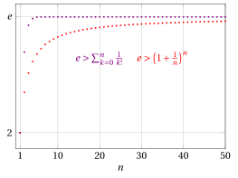

# Serie di funzioni

**Parte 5 · Serie · Capitolo 4** · dalle dispense di Fabio Furini · [:material-file-pdf-box: Dispensa del volume (PDF)](../pdf/dispensa-5-serie.pdf) · [:material-presentation: Slide (PDF)](../pdf/slide-serie-04-serie-funzioni.pdf)

## 1. Serie di funzioni

- Le <strong>serie di funzioni</strong> sono serie numeriche dipendenti da un parametro $x$: quando queste serie convergono per ogni valore $x$ appartenente a un certo intervallo, rappresentano delle <strong>funzioni di nuovo tipo</strong>

- Esistono due importanti classi di serie di funzioni: ovvero le serie trigonometriche e le serie di potenze. Tratteremo solo le <strong>serie di potenze</strong>, dette anche <strong>serie di Taylor</strong>, che si possono vedere come una estensione naturale degli sviluppi di Taylor.

### 1.1 Serie di Taylor delle funzioni trascendenti elementari

- Lo sviluppo/formula di Taylor con resto secondo Lagrange si può riscrivere nella forma:

    \begin{equation}
    f(x) = \sum_{k=0}^n  \frac{f^{(k)}(x_0)}{k!} \; (x-x_0)^k + E_n(x)
    \end{equation}

    dove l'errore di approssimazione secondo Lagrange è

    \begin{equation}
    E_n(x) = \frac{f^{(n+1)}(c)}{(n+1)!} \;(x-x_0)^{n+1}
    \end{equation}

    e $c$ è un opportuno punto tra $x_0$ e $x$.

!!! definizione "Definizione 1: serie di Taylor"

    Se una funzione $f$ ha derivate di ogni ordine, la serie

    $$
    \sum_{k=0}^{\infty} \frac{f^{(k)}(x_0)}{k!} \; (x-x_0)^k
    $$

    è detta <strong>serie di Taylor</strong> della funzione $f$ centrata in $x_0$.

!!! chiave ""

    In un certo punto $x \in  (a, b)$, se l'errore

    $$
    E_n(x) \rr 0 {\rm ~~~per~~~} n \rr \ip
    $$

    allora la serie di Taylor è convergente e la sua somma equivale a $f(x)$. Ciò equivale a dire che la somma parziale $n$-esima della serie ammette limite finito e tale limite è precisamente $f(x)$. In formule:

    $$
    \underbrace{T_{n,x_0} (x)}_{{\rm polinomio~di~Taylor}} =  \sum_{k=0}^n \frac{f^{(k)}(x_0)}{k!} \; (x-x_0)^k \rr f(x) {\rm ~~~per~~~} n \rr \ip
    $$

!!! definizione "Definizione 2: funzione sviluppabile in serie di Taylor in un intervallo"

    Data una funzione $f:D \rr \R$ con derivate di ogni ordine, se

    $$
    E_n(x) \rr 0  {\rm ~~per~~} n\rr \ip, ~~~\forall x \in I \subseteq D
    $$

    diremo che $f(x)$ è <strong>sviluppabile in serie di Taylor</strong> nell'intervallo $I$.

- Esistono funzioni (infinitamente differenziabili) che sono sviluppabili in serie di Taylor su tutta la retta dei reali, altre che lo sono solo su un intervallo limitato, altre per le quali l'intervallo si riduce a un punto solo (il punto $x_0$).

- Ci occupiamo ora delle tre funzioni trascendenti elementari:

    $$
    f(x)=e^x,~~~f(x)=\sin x {\rm ~~~e~~~}f(x)=\cos x
    $$

    che mostreremo essere sviluppabili in serie di Taylor su tutto $\R$. Sono tre funzioni trascendenti e non algebriche.

- Le funzioni reali di  variabile reale si classificano in <strong>funzioni algebriche e funzioni trascendenti</strong>. Le funzioni algebriche sono  costruite attraverso un numero finito di applicazioni delle quattro operazioni dell'aritmetica, dell'elevamento a potenza e dell'estrazione della radice $n$-esima.  Le funzioni trascendenti sono  tutte le funzioni non algebriche.

#### La serie di Taylor della funzione esponenziale

!!! esempio "Esempio 1: formula/sviluppo di MacLaurin dell'esponenziale"

    Formula/sviluppo di MacLaurin con resto secondo Lagrange di ordine $n$ dell'esponenziale:

    $$
    e^x = T_{n}(x) + \frac{e^c}{(n+1)!} \;x^{n+1} = 1 + x + \frac{x^2}{2} + \frac{x^3}{3!} + {\rm \dots} + \frac{x^n}{n!} + \frac{e^c}{(n+1)!} \;x^{n+1}  {\rm ~~con~~} c \in [0,x]
    $$

    { .fig .ovale loading=lazy style="width:64%" }

!!! osservazione "Osservazione 1: serie di Taylor della funzione esponenziale"

    $$
    \forall x \in \R,~~~~ e^x =\sum_{k=0}^{\infty} \frac{x^k}{k!}
    $$

??? dimostrazione "Dimostrazione"

    Dallo sviluppo di MacLaurin con resto secondo Lagrange all'ordine $n$ di $e^x$,  abbiamo che per ogni intero $n$ ed $x \in \R$ esiste un punto $c$, compreso tra $0$ e $x$, tale che:

    $$
    e^x =\sum_{k=0}^{n} \frac{x^k}{k!} + \frac{e^c}{(n+1)!} \;x^{n+1}
    $$

    Fissiamo $x$ e facciamo tendere $n$ a $\ip$. Il punto $c$ può variare con $n$ ma, essendo sempre compreso tra $0$ e $x$, abbiamo:

    $$
    e^c \le 
    \begin{cases}
    e^x &{\rm se~~} x >0\\
    1 & {\rm se~~} x <0
    \end{cases}
    $$

    e $e^0=1$, quindi $e^c$ si mantiene limitato. Dal teorema della gerarchia di infiniti abbiamo:

    $$
    \frac{x^{n+1}}{(n+1)!} \rr 0 {\rm ~~per~~} n \rr \ip
    $$

    quindi l'errore tende a zero, ovvero:

    $$
    \frac{x^{n+1} }{(n+1)!} \; e^c\rr 0 {\rm ~~per~~} n \rr \ip
    $$

    dato che è un prodotto di una successione infinitesima per una limitata. Abbiamo quindi dimostrato che la funzione $e^x$ si può scrivere come somma di una serie di potenze, la sua serie di Taylor, convergente per ogni $x \in \R$. □

!!! osservazione "Osservazione 2"

    \begin{equation}
    \label{second}
     e = \sum_{k=0}^{\infty} \frac{1}{k!}
    \end{equation}

??? dimostrazione "Dimostrazione"

    Basta settare $x$ uguale a 1 nella serie di Taylor della funzione esponenziale. □

- Abbiamo derivato una seconda definizione del numero di Nepero, la prima era:

    \begin{equation}
    \label{first}
     e = \lim_{k \rr \ip} \left(1 + \frac{1}{k} \right)^k
    \end{equation}

- Di conseguenza abbiamo due metodi per il calcolo approssimato del valore di $e$:

    1. Il primo metodo si basa sulla formula \(\eqref{first}\), e fissando $k=n$ abbiamo l'approssimazione:

        $$
        e \approx \left(1 + \frac{1}{n} \right)^n
        $$

    2. Il secondo metodo si basa sulla formula \(\eqref{second}\), e calcolando la somma parziale $n$-esima abbiamo l'approssimazione:

        $$
        e \approx  \sum_{k=0}^{n} \frac{1}{k!}
        $$

    
<table>
    <tr>
    <td></td>
    <td>\(\left(1 + \frac{1}{n} \right)^n\)</td>
    <td>\(\sum_{k=0}^{n} \frac{1}{k!}\)</td>
    <td>\(e\)</td>
    </tr>
    <tr>
    <td>\(n=1\)</td>
    <td>\(2,0000000000\dots\)</td>
    <td>\(2,0000000000\dots\)</td>
    <td>\(2,7182818284\dots\)</td>
    </tr>
    <tr>
    <td>\(n=2\)</td>
    <td>\(2,2500000000\dots\)</td>
    <td>\(2,5000000000\dots\)</td>
    <td>\(2,7182818284\dots\)</td>
    </tr>
    <tr>
    <td>\(n=3\)</td>
    <td>\(2,3703703704\dots\)</td>
    <td>\(2,6666666666\dots\)</td>
    <td>\(2,7182818284\dots\)</td>
    </tr>
    <tr>
    <td>\(n=4\)</td>
    <td>\(2,4414062500\dots\)</td>
    <td>\(2,7083333333\dots\)</td>
    <td>\(2,7182818284\dots\)</td>
    </tr>
    <tr>
    <td>\(n=5\)</td>
    <td>\(2,4883200000\dots\)</td>
    <td>\(2,7166666666\dots\)</td>
    <td>\(2,7182818284\dots\)</td>
    </tr>
    </table>

    { .fig .ovale loading=lazy style="width:80%" }

- Il secondo metodo è quindi molto più efficiente ad approssimare il valore di $e$

#### Le serie di Taylor delle funzioni trigonometriche elementari

!!! esempio "Esempio 2: formula/sviluppo di MacLaurin del seno e del coseno"

    Formula/sviluppo di MacLaurin con resto secondo Lagrange di ordine dispari del seno:

    \begin{align*}
    \sin x & = T_{2\;k+1}(x) + \frac{\sin^{(2\;k+2)}(c)}{(2\;k+2)!} \;x^{2\;k+2}\\ 
    &=  x - \frac{x^3}{3!} + \frac{x^5}{5!} + {\rm \dots} + (-1)^k\;\frac{x^{2\:k+1}}{(2\:k+1)!}  + \frac{\sin^{(2\;k+2)}(c)}{(2\;k+2)!} \;x^{2\;k+2}  {\rm ~~con~~} c \in [0,x]
    \end{align*}

    { .fig .ovale loading=lazy style="width:80%" }

    Formula/sviluppo di MacLaurin con resto secondo Lagrange di ordine pari del coseno:

    \begin{align*}
    \cos x & = T_{2\;k}(x) + \frac{\cos^{(2\;k+1)}(c)}{(2\;k+1)!} \;x^{2\;k+1}\\ 
    &=  1 - \frac{x^2}{2!} + \frac{x^4}{4!} + \dots + (-1)^k\;\frac{x^{2\:k}}{(2\:k)!}  + \frac{\cos^{(2\;k+1)}(c)}{(2\;k+1)!} \;x^{2\;k+1}  {\rm ~~con~~} c \in [0,x]
    \end{align*}

    { .fig .ovale loading=lazy style="width:80%" }

!!! osservazione "Osservazione 3: serie di Taylor delle funzioni trigonometriche elementari"

    $$
    \forall x \in \R,~~~~ \sin x = \sum_{k=0}^{\infty} (-1)^k\;\frac{x^{2\:k+1}}{(2\:k+1)!},~~~\cos x = \sum_{k=0}^{\infty} (-1)^k\;\frac{x^{2\:k}}{(2\:k)!}
    $$

??? dimostrazione "Dimostrazione"

    □

## 2. Serie nel campo complesso
