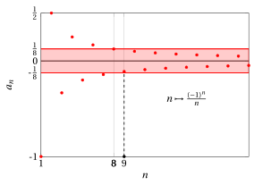
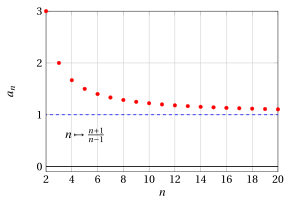
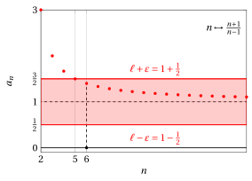
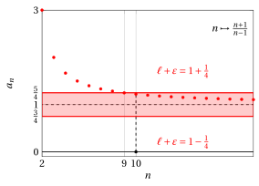
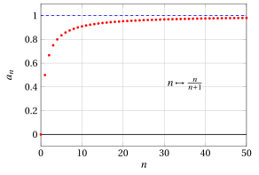
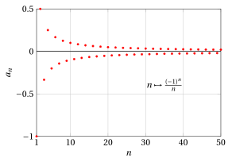
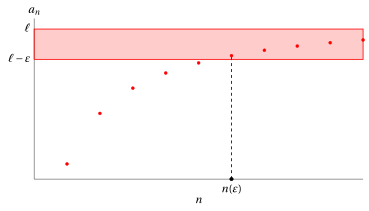
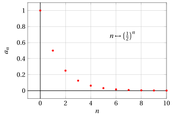
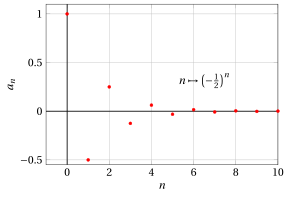
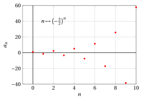

# Successioni e limiti di successioni

**Parte 3 · Limiti di successioni · Capitolo 1** · dalle dispense di Fabio Furini · [:material-file-pdf-box: Dispensa del volume (PDF)](../pdf/dispensa-3-limiti.pdf) · [:material-presentation: Slide (PDF)](../pdf/slide-successioni-01-limiti-successioni.pdf)

## 1. Definizione di successione e proprietà

- Consideriamo l'insieme $\mathbb{N}$ degli interi non negativi ordinato secondo l'ordine naturale

    $$
    \mathbb{N}: 0,1,2,3,\dots,n,\dots
    $$

!!! definizione "Definizione 1: di successione"

    Una <strong>successione</strong> è una relazione  che associa  a ogni numero naturale  $n \in \mathbb{N}$ (o da un certo numero naturale $n_0$ in poi) un numero reale $a_n \in \R$.

- Una successione è quindi una <strong>funzione</strong>:

    $$
    f: \mathbb{N} \rightarrow \mathbb{R}
    $$

    $$
    f: n \mapsto a_n
    $$

    o eventualmente

    $$
    f: \{n \in \mathbb{N}: n \ge n_0\} \rightarrow \mathbb{R}
    $$

    per un certo intero $n_0 \in \N$ fissato.

    !!! chiave ""

        La successione associa alla <strong>variabile di input</strong> $n$ il <strong>valore in output</strong> $a_n$.

- Il fatto che il dominio della funzione $f$ sia l'insieme dei naturali, rende possibile scrivere la successione <strong>enumerando i suoi valori</strong>, nell'ordine in cui essi si succedono al crescere di $n$:

    $$
    a_0,~~a_1,~~a_2,~~ \dots,~~ a_n,~~ \dots
    $$

- I puntini di sospensione dopo $a_n$ indicano che non stiamo considerando soltanto i primi $n$ termini della successione (cioè un <strong>insieme finito</strong> di numeri), ma l'intera successione di <em>infiniti termini</em> (cioè un <strong>insieme infinito</strong> di numeri).

!!! esempio "Esempio 1: Successioni"

    \begin{align*}
    & n \in \N & n &\mapsto n^2 && 0,1,4,9,16, \dots \\[2ex]
    & n \in \N & n &\mapsto (-1)^n && 1,-1,1,-1,1, \dots \\[2ex]
    & n \in \N & n &\mapsto a \in \R && a,a,a,a,a, \dots
    \end{align*}

    L'ultima successione si chiama <strong>successione costante</strong>.

!!! esempio "Esempio 2: Successioni"

    \begin{align*}
    & n\in \N,n \ge 1 & n &\mapsto \frac{1}{n} && 1,\frac{1}{2},\frac{1}{3}, \frac{1}{4},\frac{1}{5}, \dots \\[2ex]
    & n\in \N,n \ge 2 & n &\mapsto \frac{n+1}{n-1} && 3,2,\frac{5}{3},\frac{6}{4},\frac{7}{5}, \dots
    \end{align*}

!!! chiave ""

    Possiamo rappresentare graficamente le successioni  con i <strong>punti</strong> del piano cartesiano di coordinate $(n, a_n)$.

!!! esempio "Esempio 3: Grafico di successione"

    Il grafico della successione $n \mapsto n^2$ con $n\in\{0,1,2,3,4\}$ è:

    { .fig .ovale loading=lazy style="width:75%" }

!!! chiave ""

    Per indicare una successione useremo la notazione:

    $$
    \{a_n\}  {\rm~~~~oppure~~~~} n \mapsto a_n
    $$

    eventualmente precisando l'insieme in cui varia la variabile di input $n$ (tutto l'insieme $\mathbb{N}$ o da un certo valore $n_0 \in \N$ in poi).

!!! chiave ""

    Una successione $\{a_n\}$ è  <strong>limitata</strong>  se esistono due numeri $m \in \R$ e $M \in \R$ tali che:

    $$
    m \le a_n \le M,  ~~~\forall n  \in \N
    $$

    È <strong>limitata inferiormente</strong> se esiste  $m$. È <strong>limitata superiormente</strong> se esiste  $M$.

!!! esempio "Esempio 4: Successioni limitate"

    - la successione $\left\{ (-1)^n \right\}$ è limitata

    - la successione $\left\{ n^2 \right\}$ è limitata solo inferiormente

    - la successione $\left\{( -2)^n \right\}$ non è limitata (né inferiormente, né superiormente).

!!! definizione "Definizione 2: di proprietà posseduta definitivamente"

    Diciamo che una successione $\{a_n\}$ possiede (o acquista) <strong>definitivamente</strong> una certa proprietà se esiste  $\tilde{n} \in \mathbb{N}$ tale che $a_n$ soddisfa quella proprietà per ogni  $n \ge \tilde{n}$.

!!! definizione "Definizione 3: di successione positiva e negativa"

    Una successione $\{a_n\}$ si dice <strong>non negativa</strong> se:

    $$
    ~a_n \ge 0,~ \forall n
    $$

    Una successione $\{a_n\}$ si dice <strong>positiva</strong> se:

    $$
    ~a_n > 0,~ \forall n
    $$

    Una successione $\{a_n\}$ si dice <strong>non positiva</strong> se:

    $$
    ~a_n \le 0,~ \forall n
    $$

    Una successione $\{a_n\}$ si dice <strong>negativa</strong> se:

    $$
    ~a_n < 0,~ \forall n
    $$

!!! definizione "Definizione 4: di successione definitivamente positiva e definitivamente negativa"

    Una successione $\{a_n\}$ si dice <strong>definitivamente non negativa</strong> se esiste $\tilde{n} \in \mathbb{N}$ tale che:

    $$
    ~a_n \ge 0,~ \forall n \ge \tilde{n}
    $$

    Una successione $\{a_n\}$ si dice <strong>definitivamente positiva</strong> se esiste $\tilde{n} \in \mathbb{N}$ tale che:

    $$
    ~a_n > 0,~ \forall n \ge \tilde{n}
    $$

    Una successione $\{a_n\}$ si dice <strong>definitivamente non positiva</strong> se esiste $\tilde{n} \in \mathbb{N}$ tale che:

    $$
    ~a_n \le 0,~ \forall n \ge \tilde{n}
    $$

    Una successione $\{a_n\}$ si dice <strong>definitivamente negativa</strong> se esiste $\tilde{n} \in \mathbb{N}$ tale che:

    $$
    ~a_n < 0,~ \forall n \ge \tilde{n}
    $$

!!! esempio "Esempio 5: Proprietà possedute definitivamente"

    Consideriamo la successione $\left\{ n - 2 \: \sqrt{n} \right\}$. Il grafico della successione  con $n\in\{0,1,2,\dots,10\}$ è:

    { .fig .ovale loading=lazy style="width:75%" }

    Questa  successione  è definitivamente positiva. Con $n=4$ abbiamo $a_n=0$, quindi prendendo   $\tilde{n}=5$,  si ha  $a_n > 0$ con $n \ge \tilde{n}$.

!!! esempio "Esempio 6: Proprietà possedute definitivamente"

    Consideriamo ora la successione $\left \{ \frac{1}{n} \right \}$. Il grafico della successione  con $n\in\{1,2,\dots,4\}$ è:

    { .fig .ovale loading=lazy style="width:75%" }

    Questa successione è definitivamente minore di $10^{-100}$.  Con $n=10^{100}$ abbiamo $a_n =10^{-100}$,  quindi prendendo ad esempio $\tilde{n} = 10^{100} +1$ si ha $a_n < 10^{-100}$ con $n \ge \tilde{n}$.

### 1.1 Successioni convergenti e definizione di limite di successioni

!!! definizione "Definizione 5: di successione convergente"

    Una successione $\{ a_n\}$ si dice <strong>convergente</strong> se esiste un numero $\ell \in  \mathbb{R}$ tale che:

    \begin{equation}
    |a_n - \ell| < \varepsilon, \qquad {\rm definitivamente}
    \label{limite_successione}
    \end{equation}

    per ogni $\varepsilon > 0$.

!!! chiave ""

    Una successione $\{ a_n\}$ si dice quindi <strong>convergente</strong>  se per  ogni $\varepsilon > 0$ (piccolo a piacere) esiste un numero $n(\varepsilon) \in \N$  tale che:

    $$
    |a_n - \ell| < \varepsilon {\rm~~~~per~ogni~~~~} n \ge n(\varepsilon)
    $$

    Il numero $n(\varepsilon)$  dipende (in generale) dal valore di  $\varepsilon$. Se la successione $\{a_n\}$ è convergente,  ad essa è quindi associato  il numero $\ell \in \R$.

!!! definizione "Definizione 6: di limite della successione"

    Il numero $\ell \in \R$ che compare nella disuguaglianza \(\eqref{limite_successione}\) si chiama <strong>limite della successione</strong> $\{a_n\}$, e si scrive della successione che:

    $$
    \lim_{n \rightarrow +\infty} a_n = \ell {\rm ~~~~~~o,~equivalentemente~~~~~~} a_n \rightarrow \ell {\rm~~~per~~~} n \rightarrow +\infty
    $$

- si legge, rispettivamente:

    - **** il limite di $a_n$,  per $n$ che tende all'infinito,  è $\ell$

    - **** $a_n$ tende a $\ell$  per $n$ che tende all'infinito

!!! chiave ""

    La disuguaglianza \(\eqref{limite_successione}\) corrisponde alle seguenti due:

    \begin{equation}
    \ell - \varepsilon ~<~ a_n ~<~ \ell + \varepsilon \label{limite_successione_bi}
    \end{equation}

- Rappresentando graficamente i punti di una successione abbiamo:

    { .fig .ovale loading=lazy style="width:85%" }

    La condizione di convergenza significa che,  fissata una striscia orizzontale “stretta a piacere”:

    $$
    (\ell - \varepsilon,  \ell + \varepsilon)
    $$

    da un certo valore di $n$ in poi,  chiamato $n(\varepsilon)$, i punti $a_n$ della successione  non escono più da questa striscia.  Nel grafico di prima, fissata la larghezza della striscia, abbiamo i valori $a_n$ all'interno della striscia per $n \ge n(\varepsilon)$.

!!! teorema "Teorema 1: di unicità del limite della successione"

    Se una successione $\{a_n\}$ converge al limite $\ell \in \R$ allora tale limite  è unico.

??? dimostrazione "Dimostrazione"

    Supponiamo per assurdo che esistano due limiti differenti, $\ell_1$ e $\ell_2$, associati alla medesima successione $\{a_n\}$. Allora risulterebbe, definitivamente, per ogni $\varepsilon >0$:

    \begin{equation}
    |\ell_1 - \ell_2| ~~=~~ |\ell_1 - a_n + a_n - \ell_2| ~~\le~~ \underbrace{|\ell_1 - a_n|}_{=|a_n -\ell_1|<\varepsilon} + \underbrace{|a_n -\ell_2|}_{<\varepsilon} ~~<~~ 2\: \varepsilon
    \label{MMM}
    \end{equation}

    Abbiamo utilizzato la diseguaglianza triangolare. La \(\eqref{MMM}\),  potendo scegliere $\varepsilon >0$ piccolo in maniera arbitraria,  può essere soddisfatta se e solo se:

    $$
    \ell_1 = \ell_2
    $$

    Quindi non possono esistere due valori differenti $\ell_1$ e $\ell_2$ e   di conseguenza il limite (se esiste) è unico. □

!!! esempio "Esempio 7: Verifica del limite di successione"

    Il grafico della successione $n \mapsto \frac{(-1)^n}{n}$, ad esempio a partire da $n=9$,  è compreso  nella striscia orizzontale:

    $$
    \left(-\frac{1}{8}, \frac{1}{8}\right)
    $$

    data da $\ell=0$ e $\varepsilon = \frac{1}{8}$.   Con $n=8$ abbiamo $a_n=\frac{1}{8}$, con $n=9$ abbiamo $a_n=-\frac{1}{9}$, quindi

    $$
    |a_n | <  \frac{1}{8} {\rm~~~~per~ogni~~~~} n \ge 9
    $$

    { .fig .ovale loading=lazy style="width:72%" }

    Per dimostrare che:

    $$
    a_n \rr 0 {\rm ~~~per~~~} n \rr \ip
    $$

    dobbiamo verificare che per ogni $\varepsilon>0$ esiste $n(\varepsilon) \in \N$ tale che

    $$
    n \ge n(\varepsilon) \Rightarrow |a_{n}|< \varepsilon
    $$

    La  diseguaglianza equivale a

    $$
    \left| \frac{(-1)^n}{n} \right| < \varepsilon
    {\rm ~~~che~è~soddisfatta~per~~} n> \frac{1}{\varepsilon}
    $$

    Fissato $\varepsilon > 0$, basterà scegliere il primo intero

    $$
    n(\varepsilon) >\frac{1}{\varepsilon}
    $$

    per soddisfare la condizione richiesta dalla definizione di limite.

!!! osservazione "Osservazione 1"

    Ogni successione convergente è limitata.

??? dimostrazione "Dimostrazione"

    Sia $\{a_n\}$ convergente al limite $\ell \in \R$. Scegliendo $\varepsilon = 1$ nella definizione di limite, esiste $n(1) \in \N$ tale che

    $$
    |a_n - \ell| < 1 {\rm~~~~per~ogni~~~~} n \ge n(1)
    $$

    Per la disuguaglianza triangolare abbiamo quindi

    $$
    |a_n| = |(a_n - \ell) + \ell| ~\le~ |a_n - \ell| + |\ell| ~<~ 1 + |\ell| {\rm~~~~per~ogni~~~~} n \ge n(1)
    $$

    I termini rimanenti $a_0, a_1, \dots, a_{n(1)-1}$ sono in numero <em>finito</em>, perciò possiamo porre

    $$
    M = \max \big\{ ~|a_0|,~ |a_1|,~ \dots,~ |a_{n(1)-1}|,~ 1 + |\ell| ~\big\} \in \R
    $$

    e otteniamo

    $$
    -M \le a_n \le M {\rm~~~~per~ogni~~~~} n \in \N
    $$

    ossia la successione è limitata. □

- Per contronominale otteniamo anche: se una successione <strong>non</strong> è limitata, allora <strong>non</strong> è convergente.

- L'implicazione non vale invece nel verso opposto: una successione limitata non è necessariamente convergente. Un controesempio è la successione $\left\{ (-1)^n \right\}$, che è limitata ($-1 \le (-1)^n \le 1$ per ogni $n \in \N$) ma non è convergente. Supponiamo infatti per assurdo che $(-1)^n \rr \ell \in \R$: fissato $\varepsilon = \frac{1}{2}$, dovremmo avere $|(-1)^n - \ell| < \frac{1}{2}$ definitivamente, mentre

    - **** se $\ell \ge 0$, per ogni $n$ <em>dispari</em> abbiamo $|(-1)^n - \ell| = |-1 - \ell| = 1 + \ell \ge 1$;

    - **** se $\ell < 0$, per ogni $n$ <em>pari</em> abbiamo $|(-1)^n - \ell| = |1 - \ell| = 1 + |\ell| > 1$.

    In entrambi i casi la disuguaglianza $|(-1)^n - \ell| < \frac{1}{2}$ è violata per infiniti valori di $n$ (quindi non vale definitivamente), e abbiamo l'assurdo. Perciò

    $$
    \{a_n\} {\rm ~~limitata~~} \nRightarrow \{a_n\} {\rm ~~convergente}
    $$

!!! esempio "Esempio 8: Verifica del limite di successione"

    Consideriamo la successione:

    $$
    n \mapsto  \frac{n+1}{n-1} \qquad \left(\frac{n+1}{n-1} = \frac{n-1+1+1}{n-1}=1 +\frac{2}{n-1} \right)
    $$

    Questo è  il grafico della successione  con $n\in\{2,3,\dots,20\}$:

    { .fig .ovale loading=lazy style="width:75%" }

    Vediamo che i valori $a_n$ si avvicinano a $1$,  quindi cerchiamo di dimostrare, usando la definizione di limite,  che:

    $$
    \lim_{n \rightarrow +\infty}  \frac{n+1}{n-1} =1
    $$

    Dobbiamo verificare che per ogni $\varepsilon>0$ esiste $n(\varepsilon) \in \N$ tale che:

    $$
    n \ge n(\varepsilon) \Rightarrow 1 -\varepsilon < \frac{n+1}{n-1} < 1 + \varepsilon
    $$

    La disuguaglianza di sinistra è sempre soddisfatta (il numeratore della frazione è sempre più grande del denominatore). Prendiamo quella di destra:

    $$
    \frac{n+1}{n-1} -  1  < \varepsilon, \qquad \frac{ n+1 - (n-1) }{n-1} < \varepsilon, \qquad  \frac{ 2}{n-1} < \varepsilon, \qquad   n-1 > \frac{2}{\varepsilon}
    $$

    $$
    {\rm ~~quindi~è~soddisfatta~se~~~}\qquad n > \frac{2 + \varepsilon}{\varepsilon}
    $$

    Fissato $\varepsilon > 0$, basterà scegliere il primo intero

    $$
    n(\varepsilon) > \frac{2 + \varepsilon}{\varepsilon}
    $$

    per soddisfare la condizione richiesta dalla definizione di limite.

!!! esempio "Esempio 9: Verifica del limite di successione"

    Per l'esempio precedente, abbiamo dimostrato che il limite vale $1$. Verifichiamo ora cosa succede fissando $\varepsilon=\frac{1}{2}$.  In questo caso $n\left(\frac{1}{2}\right)> \frac{2+1/2}{1/2}=5$.

    { .fig .ovale loading=lazy style="width:80%" }

    Fissando invece  $\varepsilon=\frac{1}{4}$,  in questo caso abbiamo $n\left(\frac{1}{4}\right)> \frac{2+1/4}{1/4}=9$.

    { .fig .ovale loading=lazy style="width:80%" }

!!! esempio "Esempio 10: Verifica del limite di successione"

    Consideriamo la successione:

    $$
    n \mapsto 2^{\frac{1}{n}}
    $$

    Questo è  il grafico della successione  con $n\in\{1,2,\dots,20\}$:

    { .fig .ovale loading=lazy style="width:80%" }

    Vediamo che i valori $a_n$ si avvicinano a $1$,  quindi cerchiamo di dimostrare, usando la definizione di limite,  che:

    $$
    \lim_{n \rightarrow +\infty} 2^{\frac{1}{n}} =1
    $$

    Dobbiamo verificare che per ogni $\varepsilon>0$ esiste $n(\varepsilon) \in \N$ tale che:

    $$
    n \ge n(\varepsilon) \Rightarrow 1 -\varepsilon < 2^{\frac{1}{n}} < 1 + \varepsilon.
    $$

    La disuguaglianza di sinistra è sempre soddisfatta (2 elevato a un numero  razionale positivo), mentre quella di destra, prendendo il logaritmo in base $2$,  otteniamo:

    $$
    \frac{1}{n} < \log_2 (1 + \varepsilon)
    $$

    Quindi è soddisfatta se:

    $$
    n > \frac{1}{\log_2 (1 + \varepsilon)}
    $$

    Fissato $\varepsilon > 0$, basta scegliere il primo intero

    $$
    n(\varepsilon) > \frac{1}{\log_2 (1 + \varepsilon)}
    $$

    per soddisfare la condizione richiesta dalla definizione di limite.

!!! esempio "Esempio 11: Limite di successioni"

    Consideriamo la successione:

    $$
    n \mapsto \log \left( 1 + \frac{1}{n} \right).
    $$

    Questo è  il grafico della successione  con $n\in\{1,2,\dots,50\}$:

    { .fig .ovale loading=lazy style="width:85%" }

    Vediamo che i valori $a_n$ si avvicinano a $0$,  quindi cerchiamo di dimostrare, usando la definizione di limite,  che :

    $$
    \lim_{n \rightarrow +\infty}  \log \left(1 +\frac{1}{n} \right) =0
    $$

    Dobbiamo verificare che per ogni $\varepsilon>0$ esiste $n(\varepsilon) \in \N$ tale che:

    $$
    n \ge n(\varepsilon) \Rightarrow -\varepsilon < \log \left( 1 + \frac{1}{n} \right) <  \varepsilon
    $$

    La disuguaglianza di sinistra è sempre soddisfatta (il logaritmo in base $e$ di un numero più grande di 1), mentre  quella di destra, elevando a potenza, otteniamo:

    $$
    \frac{1}{n}+1 < e^{\varepsilon} \qquad {\rm ~~quindi~è~soddisfatta~se~~~~~} n > \frac{1}{e^{\varepsilon}-1} \qquad  (e^{\varepsilon}-1 > 0 {\rm~~con~~} \varepsilon>0)
    $$

    Fissato $\varepsilon > 0$, basta scegliere il primo intero

    $$
    n(\varepsilon) > \frac{1}{e^{\varepsilon}-1}
    $$

    per soddisfare la condizione richiesta dalla definizione di limite.

<strong>Prova tu</strong> — il grafico interattivo qui sotto ti fa vedere quello che hai appena letto: muovi i cursori.

### 1.2 Successioni divergenti e  successioni irregolari

!!! definizione "Definizione 7: di successione divergente a $+\infty$"

    Una successione $\{ a_n\}$ si dice <strong>divergente</strong> a $+\infty$ se per ogni $M>0$ esiste un numero $n(M) \in \N$  tale che:

    $$
    a_n  > M {\rm~~per~ogni~~} n \ge n(M)
    $$

!!! definizione "Definizione 8: di successione divergente a $-\infty$"

    Una successione $\{ a_n\}$ si dice <strong>divergente</strong> a $-\infty$ se per ogni $M>0$  esiste un numero $n(M) \in \N$  tale che:

    $$
    a_n  < -M {\rm~~per~ogni~~} n \ge n(M)
    $$

!!! chiave ""

    Il numero $n(M)$  dipende (in generale) dal valore di  $M$.

- Diremo nei due casi, rispettivamente, che $+\infty$ e $-\infty$ sono i limiti della successione e scriveremo, rispettivamente:

    $$
    \lim_{n \rightarrow +\infty} a_n = +\infty {\rm ~~~~~oppure~~~~~} \lim_{n \rightarrow +\infty} a_n = -\infty
    $$

    I valori di una successione divergente a $\ip$ superano, definitivamente, qualunque numero reale fissato. I valori di una successione divergente a $\im$ scendono al di sotto, definitivamente, di qualunque numero reale fissato.

!!! chiave ""

    <strong>I simboli</strong> $+\infty$ e $-\infty$ <strong>non sono numeri</strong>.

- Se rappresentiamo i numeri reali sulla <strong>retta euclidea</strong>, ogni numero corrisponde a un punto e ogni punto a un numero.

- Con i simboli $+\infty$ e $-\infty$ conveniamo di indicare due “punti”:

    1. $+\infty$ sta alla <em>destra</em> di ogni punto di $\mathbb{R}$

    2. $-\infty$ sta alla <em>sinistra</em> di ogni punto di $\mathbb{R}$

    a questi due punti non corrisponde però alcun numero.

- Sui simboli $+\infty$ e $-\infty$ le operazioni di somma e prodotto con le proprietà indicate in $R_1$ e $R_2$ non sono definite, anche se  potremo fare “parzialmente” queste operazioni (come vedremo in seguito).

!!! definizione "Definizione 9: dell'insieme $\mathbb{R}^*$"

    L'insieme dei numeri reali $\mathbb{R}$ con l'aggiunta dei due elementi $+\infty$ e $-\infty$ sarà indicato:

    $$
    \mathbb{R}^* =\mathbb{R} \cup \{+\infty\} \cup \{-\infty\}
    $$

- Possiamo rappresentare “visivamente” l'insieme $\mathbb{R}^*$ mettendo in corrispondenza biunivoca i punti della <strong>retta</strong> con quelli di una <strong>semicirconferenza</strong> (proiettandoli dal centro della semicirconferenza sulla retta $\mathbb{R}$):

{ .fig .ovale loading=lazy style="width:100%" }

- Ai punti $A$ e $B$ non corrisponde su $\mathbb{R}$ alcun punto; diremo che $-\infty$ è il “corrispondente” del punto $A$ e $+\infty$ il “corrispondente” di $B$.

- L'operazione di limite risulta <em>completamente significativa</em> se ambientata in $\mathbb{R}^*$ invece che in $\mathbb{R}$, cioè il limite di una successione può essere un numero reale $\ell$ oppure $+\infty$   oppure $-\infty$.

!!! chiave ""

    Le successioni il cui limite è un numero reale sono <strong>convergenti</strong>, quelle il cui limite è $+\infty$ oppure $-\infty$ sono <strong>divergenti</strong>.

!!! esempio "Esempio 12: Successioni convergenti e divergenti"

    - la successione canonica $\{ n \}$ è divergente a $+\infty$;

    - la successione $\{ 2^n \}$ è divergente a $+\infty$;

    - la successione $\{ -2^n \}$ è divergente a $-\infty$;

    - la successione $\{ 2^{\frac{1}{n}} \}$ è convergente  a $1$.

!!! osservazione "Osservazione 2"

    $$
    \lim_{n \rightarrow +\infty} n^{\alpha} = 
    \begin{cases}
    +\infty & {\rm se~} \alpha >0\\
    1 & {\rm se~} \alpha = 0\\
    0 & {\rm se~} \alpha < 0
    \end{cases}
    $$

??? dimostrazione "Dimostrazione"

    Se $\alpha>0$, dobbiamo dimostrare che la successione diverge a $\ip$.  Dobbiamo quindi verificare che per ogni $M>0$ esiste $n(M) \in \N$ tale che

    $$
    n \ge n(M)\Rightarrow a_{n}>M
    $$

    La disuguaglianza

    $$
    n^{\alpha}>M
    {\rm ~~~è~soddisfatta~per~~} 
    n>{M^{\frac{1}{\alpha}}}
    $$

    Fissato $M > 0$, quindi basterà scegliere il primo intero

    $$
    n(M) > {M^{\frac{1}{\alpha}}}
    $$

    per soddisfare la condizione richiesta di divergenza.

    Quindi non esiste nessun $M>0$ tale per cui $n^{\alpha} \le M$ con $n \in \N$ e la successione non è limitata. Quindi $n^{\alpha} \rr \ip$ per $n \rr \ip$.

    Se $\alpha<0$,  dobbiamo verificare che per ogni $\varepsilon>0$ esiste $n(\varepsilon) \in \N$ tale che

    $$
    n \ge n(\varepsilon) \Rightarrow -\varepsilon < n^{\alpha} <   \varepsilon
    $$

    La disuguaglianza di sinistra è sempre soddisfatta. La disuguaglianza di destra,  dato che $n^{\alpha}=\frac{1}{n^{|\alpha|}}$, otteniamo

    $$
    \frac{1}{n^{|\alpha|}} < \varepsilon
    $$

    che è soddisfatta se

    $$
    n^{|\alpha|} > \frac{1}{\varepsilon} {\rm ~~~ossia~per~~~} n > \frac{1}{\varepsilon^{1/|\alpha|}}
    $$

    Fissato $\varepsilon > 0$, basterà scegliere il primo intero

    $$
    n(\varepsilon) > \frac{1}{\varepsilon^{1/|\alpha|}}
    $$

    per soddisfare la condizione richiesta dalla definizione di limite. □

- Infine osserviamo che ci sono successioni che non sono né convergenti né divergenti

!!! definizione "Definizione 10: di successione irregolare o indeterminata"

    Una  successione che non è né convergente né divergente si dice <strong>irregolare</strong> o <strong>indeterminata</strong>.

!!! esempio "Esempio 13: Successioni irregolari"

    - la successione  $\{ (-1)^n \}$ non è né convergente né divergente  (ma è limitata)

    - la successione  $\{ (-2)^n \}$ non è né convergente né divergente  (e nemmeno limitata).

??? dimostrazione "Dimostrazione"

    Verifichiamo che la successione $\{(-1)^n\}$ è irregolare, ossia che non è né convergente né divergente.

    - **** <strong>Non è convergente</strong>: lo abbiamo dimostrato nell'osservazione [Osservazione 1](#box-ossCONV_LIMITATE-15), dove $\left\{(-1)^n\right\}$ è servita come controesempio all'implicazione inversa.

    - **** <strong>Non è divergente</strong>: per ogni $n \in \N$ abbiamo $-1 \le (-1)^n \le 1$. Fissato $M = 1$, per ogni $n$ <em>dispari</em> risulta $(-1)^n = -1 < M$, quindi non può essere $(-1)^n \rr \ip$; per ogni $n$ <em>pari</em> risulta $(-1)^n = 1 > -M$, quindi non può essere $(-1)^n \rr \im$.

    Il limite di $\{(-1)^n\}$ quindi non esiste. □

- Per le successioni <strong>irregolari</strong>, l'operazione di limite non è definita, ovvero il loro <strong>limite non esiste</strong>.

!!! chiave ""

    Riassumendo,  l'operazione di calcolare il  limite  consente di rispondere in forma rigorosa alla domanda: <strong>come si comportano i numeri  $a_n$ quando $n$ diventa sempre più grande?</strong>

## 2. Insiemi non limitati e loro estremi superiori/inferiori

- È comodo adottare la convenzione introdotta per i limiti anche per il $\sup$ e per l'$\inf$, estendendo la definizione di queste quantità nel modo seguente

!!! definizione "Definizione 11: di estremo superiore e inferiore $\sup$ e $\inf$ (insiemi non limitati)"

    Se un insieme $E \subseteq \mathbb{R}$ non è limitato superiormente (inferiormente) diremo che

    $$
    \sup E = + \infty ~~~(\inf E = - \infty)
    $$

- In questo modo la proprietà $R_4$ dei numeri reali può essere enunciata così:

    !!! chiave ""

        - **$R_4 \rightarrow$** ogni insieme $E \subseteq \mathbb{R}$ non vuoto è dotato di estremo superiore e inferiore; $\sup E$ ($\inf E$) è un numero se $E$ è limitato superiormente (inferiormente) altrimenti è $+\infty$ ($-\infty$).

## 3. Successioni infinitesime e infinite

!!! definizione "Definizione 12: di successione infinitesima"

    Una successione $\{a_n\}$ tendente a zero si dice <strong>infinitesima</strong>

!!! esempio "Esempio 14: Successioni infinitesime"

    - la successione $\left\{ \frac{1}{n} \right\}$ è infinitesima

    - la successione $\left\{ \frac{1}{n^2} \right\}$ è infinitesima

!!! teorema "Teorema 2: sulle successioni infinitesime"

    Una successione $\{a_n\}$ è infinitesima se e solo se la successione dei valori assoluti $\{|a_n|\}$ è infinitesima:

    $$
    \lim_{n \rr \ip} a_n = 0 \quad \Longleftrightarrow \quad \lim_{n \rr \ip} |a_n| = 0.
    $$

??? dimostrazione "Dimostrazione"

    Dimostriamo le due implicazioni.

    - **** ($\Rightarrow$) Se $\{a_n\}$ è infinitesima, allora $a_n \rr 0$ e quindi, per ogni $\varepsilon>0$, esiste $n(\varepsilon) \in \N$ tale che

        $$
        \underbrace{|a_n - 0|}_{=~\big| \: |a_n| - 0 \: \big|} < \varepsilon {\rm~~~~per~ogni~~~~} n \ge n(\varepsilon)
        $$

        che è esattamente la condizione $|a_n| \rr 0$.

    - **** ($\Leftarrow$) Se $|a_n| \rr 0$, allora per ogni $\varepsilon>0$ esiste $n(\varepsilon) \in \N$ tale che

        $$
        \underbrace{\big| \: |a_n| - 0 \: \big|}_{=~|a_n|~=~|a_n - 0|} < \varepsilon {\rm~~~~per~ogni~~~~} n \ge n(\varepsilon)
        $$

        che è esattamente la condizione $a_n \rr 0$, ossia $\{a_n\}$ è infinitesima.

    
□

- Attenzione: il teorema vale <strong>solo</strong> per il limite $0$. Per esempio $(-1)^n$ ha $|(-1)^n| = 1 \rr 1$, ma la successione $\left\{(-1)^n\right\}$ non è convergente.

- Il concetto di <em>infinitesimo</em> gioca un ruolo centrale ed è fondamentale anche per avere un'<strong>immagine intuitiva</strong> corretta ed efficace dei concetti del <em>calcolo infinitesimale</em>.

!!! chiave ""

    “<strong>infinitesimo</strong>” non è un “numero infinitamente piccolo” (concetto privo di senso) ma una <strong>quantità variabile</strong> (successione o, come vedremo, funzione), che <strong>diviene indefinitamente piccola</strong>.

!!! definizione "Definizione 13: di successione infinita"

    Una successione $\{a_n\}$ tendente a $\pm \infty$ si dice <strong>infinita</strong>

!!! esempio "Esempio 15: Successioni infinite"

    - la successione $\left\{ n^2 \right\}$ è infinita

    - la successione $\left\{ n! \right\}$ è infinita

- Talvolta è possibile precisare se una successione convergente <strong>si avvicina al suo limite per eccesso o per difetto</strong>

!!! definizione "Definizione 14: di limite per eccesso"

    Si dice che la successione $\{a_n\}$ tende a $\ell \in \mathbb{R}$ per <strong>eccesso</strong>  e si scrive

    $$
    \lim_{n \rightarrow +\infty} a_n = \ell^+
    $$

    se per ogni $\varepsilon > 0$ si ha che

    $$
    0 \le a_n - \ell < \varepsilon, {\rm ~~~~definitivamente}.
    $$

!!! definizione "Definizione 15: di limite per difetto"

    Si dice che la successione $\{a_n\}$ tende a $\ell \in \mathbb{R}$ per <strong>difetto</strong>  e si scrive

    $$
    \lim_{n \rightarrow +\infty} a_n = \ell^-
    $$

    se per ogni $\varepsilon > 0$ si ha che

    $$
    0 \le \ell - a_n  < \varepsilon, {\rm ~~~~definitivamente}.
    $$

- Dire che $a_n \rightarrow \ell^+$ per $n \rr \ip$ significa affermare che $a_n \rightarrow \ell$ e inoltre $a_n \ge \ell$ definitivamente; dunque $a_n$ si avvicina ad $\ell$ <em>da sopra</em>, ossia approssima $\ell$ per eccesso.

- Dire che $a_n \rightarrow \ell^-$ per $n \rr \ip$ significa affermare che $a_n \rightarrow \ell$ e inoltre $a_n \le \ell$ definitivamente; dunque $a_n$ si avvicina ad $\ell$ <em>da sotto</em>, ossia approssima $\ell$ per difetto.

!!! esempio "Esempio 16: Successione con limite per eccesso"

    $$
    \lim_{n \rightarrow +\infty} \frac{1}{n} = 0^+
    $$

    { .fig .ovale loading=lazy style="width:75%" }

!!! esempio "Esempio 17: Successione con limite per difetto"

    $$
    \lim_{n \rightarrow +\infty} \frac{n}{n+1} = 1^- \qquad  \left( \frac{n}{n+1} = \frac{n+1-1}{n+1}= 1 - \frac{1}{n+1} \right)
    $$

    { .fig .ovale loading=lazy style="width:75%" }

!!! esempio "Esempio 18: Successione con limite ma né per difetto né per eccesso"

    $$
    \lim_{n \rightarrow +\infty} \frac{(-1)^n}{n} = 0
    $$

    { .fig .ovale loading=lazy style="width:75%" }

    In questo caso non si può affermare né che $a_n \rightarrow 0^+$ né $a_n \rightarrow 0^-$ per $n \rr \ip$.

## 4. Successioni monotone

!!! definizione "Definizione 16: di successioni monotone"

    Una successione $\{a_n\}$ si dice <strong>non decrescente</strong> se:

    $$
    ~a_n \le a_{n+1},~ \forall n
    $$

    Una successione $\{a_n\}$ si dice <strong>crescente</strong> se:

    $$
    ~a_n < a_{n+1},~ \forall n
    $$

    Una successione $\{a_n\}$ si dice <strong>non crescente</strong> se:

    $$
    ~a_n \ge a_{n+1},~ \forall n
    $$

    Una successione $\{a_n\}$ si dice <strong>decrescente</strong> se:

    $$
    ~a_n > a_{n+1},~ \forall n
    $$

    Una successione è <strong>monotona</strong> se è non decrescente oppure non crescente; è <strong>strettamente monotona</strong> se è crescente oppure decrescente.

!!! definizione "Definizione 17: di successioni definitivamente monotone"

    Una successione $\{a_n\}$ si dice <strong>definitivamente non decrescente</strong> se esiste $\tilde{n} \in \mathbb{N}$ tale che:

    $$
    ~a_n \le a_{n+1},~ \forall n \ge \tilde{n}
    $$

    Una successione $\{a_n\}$ si dice <strong>definitivamente crescente</strong> se esiste $\tilde{n} \in \mathbb{N}$ tale che:

    $$
    ~a_n < a_{n+1},~ \forall n \ge \tilde{n}
    $$

    Una successione $\{a_n\}$ si dice <strong>definitivamente non crescente</strong> se esiste $\tilde{n} \in \mathbb{N}$ tale che:

    $$
    ~a_n \ge a_{n+1},~ \forall n \ge \tilde{n}
    $$

    Una successione $\{a_n\}$ si dice <strong>definitivamente decrescente</strong> se esiste $\tilde{n} \in \mathbb{N}$ tale che:

    $$
    ~a_n > a_{n+1},~ \forall n \ge \tilde{n}
    $$

    Una successione è <strong>definitivamente monotona</strong> se è definitivamente non decrescente oppure definitivamente non crescente; è <strong>definitivamente strettamente monotona</strong> se è definitivamente crescente oppure definitivamente decrescente.

!!! esempio "Esempio 19: Successioni crescenti e decrescenti"

    - La successione $\{ n^2\}$ è crescente

    - La successione $\left\{ \frac{1}{n} \right\}$ è decrescente

    - La successione $\left\{ (-1)^n \right\}$ non è monotona

    - ogni successione costante è monotona (è sia non decrescente sia non crescente), ma non è strettamente monotona

- Riguardo all'operazione di limite, queste successioni hanno una importanza particolare; infatti esse non sono <strong>mai irregolari</strong>, ma sono <strong>convergenti oppure divergenti</strong> a seconda che siano <strong>limitate oppure no</strong>.

!!! teorema "Teorema 3: di monotonia delle successioni"

    - Sia $\{a_n\}$ una <strong>successione non decrescente e superiormente limitata</strong>. Allora $\{a_n\}$ è convergente, e il suo limite è uguale a

        $$
        \sup \{a_n: n \in \N\}.
        $$

    - Sia $\{a_n\}$ una <strong>successione non crescente e inferiormente limitata</strong>. Allora $\{a_n\}$ è convergente, e il suo limite è uguale a

        $$
        \inf \{a_n: n \in \N\}.
        $$

??? dimostrazione "Dimostrazione"

    Consideriamo il caso delle successioni non decrescenti e superiormente limitate.

    Poiché la successione è limitata superiormente, l'insieme dei valori assunti dalla successione $\{a_n : n \in  \N\}$ è limitato superiormente. 

    Per la <em>proprietà dell'estremo superiore</em> di cui gode $\R$, esiste quindi l'estremo superiore a valore finito, che denotiamo $\ell$:

    $$
    \ell = \sup \{ a_n : n \in  \N \} {\rm ~~~~e~~~~}  \ell \in \R.
    $$

    Occorre ora dimostrare che

    $$
    \lim_{n \rightarrow +\infty} a_n= \ell
    $$

    e quindi che per ogni $\varepsilon > 0$ si ha

    $$
    \ell -\varepsilon < a_n <  \ell +\varepsilon, ~~~{\rm definitivamente}.
    $$

    La seconda disuguaglianza è ovvia. Per ogni $n \in \N$ abbiamo

    $$
    a_n \le  \ell ~~~~({\rm e~quindi~~} a_n < \ell + \varepsilon)
    $$

    dato che $\ell$ è l'estremo superiore di $\{a_n : n \in  \N\}$ e  un maggiorante.

    Per definizione di estremo superiore, $\ell$ è il minimo dei maggioranti dell'insieme $\{ a_n: n \in \N\}$. Perciò, essendo

    $$
    \ell - \varepsilon < \ell,
    $$

    certamente $\ell - \varepsilon$ non è un maggiorante dell'insieme $\{ a_n: n \in \N\}$. Questo significa che esiste un $n(\varepsilon) \in \N$ per cui

    $$
    a_{n(\varepsilon)} > \ell - \varepsilon.
    $$

    D'altro canto la successione è non decrescente, perciò per ogni $n \ge n(\varepsilon)$ risulta $a_n \ge a_{n(\varepsilon)}$. Abbiamo quindi provato che

    $$
    a_n \ge a_{n(\varepsilon)} > \ell - \varepsilon {\rm ~~per~ogni~~} n \ge n(\varepsilon)
    $$

    Abbiamo di conseguenza la tesi:

    $$
    \lim_{n \rightarrow +\infty} a_n = \ell
    $$

    In maniera analoga si dimostra il caso delle successioni non crescenti e inferiormente limitate. □

- L'idea della prova è resa dalla seguente figura:

    { .fig .ovale loading=lazy style="width:90%" }

- Per esprimere anche simbolicamente che il limite è il $\sup$ (o l'$\inf$) di una successione non decrescente (o non crescente) si usa la notazione

    $$
    a_n \uparrow \ell {\rm ~~~oppure~~~} a_n \downarrow \ell
    $$

    Questo in particolare implica che $a_n \rightarrow \ell^-$ (rispettivamente, $\ell^+$ ), ma contiene una ulteriore informazione: la monotonia della successione.

- Questo teorema è una conseguenza dell'assioma di continuità $R_4$ dei numeri reali e pertanto vale se l'ambiente che consideriamo è $\R$. Ad esempio non è  vero che una successione crescente e limitata  di numeri razionali ammette sempre limite razionale, cioè in $\Q$.

    

    !!! esempio "Esempio 20: Successione crescente e limitata di $\Q$"

        Sia $\{a_n\}$ la successione così definita:

        $$
        a_0 = 0, a_1 = 0,1, a_2= 0,1011, a_3= 0,10110111, a_4= 0,1011011101111 \dots
        $$

        Al passo $n$ si aggiunge al numero decimale ottenuto al passo precedente una cifra zero seguita da $n$ cifre uguali a $1$. La successione $\{a_n\}$ è evidentemente crescente, e superiormente limitata (ad esempio, $a_n \le 1$).

        - In $\R$ la successione converge al numero $\sup \{a_n : n \in \N\}$, che dopo la virgola presenta un allineamento decimale illimitato e non periodico di cifre (una cifra 1, una cifra 0, due cifre 1, una cifra 0, tre cifre 1, una cifra 0, e così via all'infinito)

        - Quindi il limite della successione è un numero irrazionale. Quest'esempio mostra che nell'insieme $\Q$ il teorema di monotonia è falso.

- Il teorema di monotonia delle successioni si può completare con il prossimo corollario, che considera successioni limitate o illimitate.

!!! teorema "Corollario 1: del teorema di monotonia delle successioni"

    Sia $\{a_n\}$ una successione non decrescente. Allora esiste

    $$
    \lim_{n \rightarrow +\infty} a_n = \sup\{a_n: n \in \N\}.
    $$

??? dimostrazione "Dimostrazione"

    Se $\{a_n\}$ è superiormente limitata, l'enunciato è contenuto nel teorema [Teorema 3](#box-theoSUCC_MONOTONE-41) di monotonia delle successioni.

    Se invece $\{a_n\}$ è superiormente illimitata, questo significa che fissato $M > 0$ esiste un $n(M) \in \N$  tale che

    $$
    a_{n(M)} > M
    $$

    D'altro canto la successione è non decrescente, perciò per ogni $n \ge n(M)$ si ha

    $$
    a_n \ge a_{n(M)} > M
    $$

    Abbiamo quindi provato che per ogni $M>0$ abbiamo $a_n > M$,  definitivamente. Questo significa che $a_n \rightarrow +\infty$ per $n \rr \ip$. □

Riassumendo abbiamo:

- se $\{a_n\}$ è superiormente limitata, allora converge (e il suo limite è uguale all'estremo superiore dei suoi valori, che in questo caso è un numero reale)

- se invece $\{a_n\}$ è superiormente illimitata, allora $a_n$ tende a $+\infty$ (che in questo caso è pari all'estremo superiore dei suoi valori).

!!! chiave ""

    Una successione monotona, converge o diverge (non può essere irregolare).

## 5. Limiti delle progressioni geometriche

- Consideriamo la <strong>progressione geometrica</strong> di ragione $a \in \R$:

    $$
    1,~~a,~~a^2,~~a^3,~~ \dots,~~ a^n,~~ \dots
    $$

    equivale alla successione $\{a^n\}$:

    $$
    n \mapsto a^n
    $$

- Se $a > 1$, la successione è crescente e illimitata superiormente.

- Se $a = 1$, la successione è costante.

- Se $0 < a < 1$, la successione è decrescente e tende a zero.

- Se $a$ è negativo,  la successione non è  monotona.

!!! osservazione "Osservazione 3"

    $$
    \lim_{n \rightarrow +\infty} a^n = 
    \begin{cases}
    +\infty & {\rm se~} a >1\\
    1 & {\rm se~} a = 1\\
    0 & {\rm se~} |a| < 1\\
    {\rm non~esiste~} & {\rm se~} a \le -1\\
    \end{cases}
    $$

??? dimostrazione "Dimostrazione"

    Se $a = 0$, abbiamo $a^n = 0$ per ogni $n \ge 1$: la successione è definitivamente nulla e quindi $a^n \rr 0$.

    Se $0 < |a| <1$, dobbiamo verificare che per ogni $\varepsilon>0$ esiste $n(\varepsilon) \in \N$ tale che

    $$
    n \ge n(\varepsilon) \Rightarrow |a^{n}|< \varepsilon
    $$

    Poiché $|a^n| = |a|^n$, si deve verificare che

    $$
    n \ge n(\varepsilon)\Rightarrow |a|^n<\varepsilon
    $$

    Passando al logaritmo in base $|a|$, che è <em>decrescente</em> dato che $0<|a|<1$, la disuguaglianza è soddisfatta se

    $$
    n > \log_{|a|} \varepsilon
    $$

    Fissato $\varepsilon > 0$, basterà scegliere il primo intero

    $$
    n(\varepsilon) > \log_{|a|} \varepsilon
    $$

    per soddisfare la condizione richiesta dalla definizione di limite.

    Se $a > 1$, dobbiamo verificare che per ogni $M>0$ esiste $n(M) \in \N$ tale che

    $$
    n \ge n(M)  \Rightarrow a_{n}>M
    $$

    La disuguaglianza

    $$
    a^n>M
    {\rm ~~~è~soddisfatta~per~~}
    n>\log_a{M}
    $$

    Fissato $M > 0$, quindi basterà scegliere il primo intero

    $$
    n(M) > \log_a{M}
    $$

    per soddisfare la condizione richiesta di divergenza. □

??? dimostrazione "Dimostrazione"

    Se $a \le -1$, abbiamo $|a| \ge 1$ e quindi

    $$
    a^n = (-1)^n \: |a|^n {\rm ~~~~con~~~~} |a|^n \ge 1, ~~\forall n \in \N
    $$

    ossia $a^n \ge 1$ per $n$ pari e $a^n \le -1$ per $n$ dispari. Mostriamo che la successione non è né convergente né divergente, ovvero che è irregolare.

    - **** <strong>Non è convergente</strong>: se per assurdo fosse $a^n \rr \ell \in \R$, fissato $\varepsilon = \frac{1}{2}$ dovremmo avere $|a^n - \ell| < \frac{1}{2}$ definitivamente. Invece, se $\ell \ge 0$, per ogni $n$ <em>dispari</em> abbiamo $|a^n - \ell| = |a|^n + \ell \ge 1$, mentre se $\ell < 0$, per ogni $n$ <em>pari</em> abbiamo $|a^n - \ell| = |a|^n + |\ell| > 1$. In entrambi i casi la disuguaglianza è violata per infiniti valori di $n$.

    - **** <strong>Non è divergente</strong>: fissato $M = 1$, per ogni $n$ <em>dispari</em> abbiamo $a^n \le -1 < M$, quindi non può essere $a^n \rr \ip$; per ogni $n$ <em>pari</em> abbiamo $a^n \ge 1 > -M$, quindi non può essere $a^n \rr \im$.

    Il limite quindi non esiste. □

!!! esempio "Esempio 21: Progressione geometrica infinitesima e decrescente"

    { .fig loading=lazy style="width:75%" }

!!! esempio "Esempio 22: Progressione geometrica infinitesima (ma non monotona)"

    { .fig loading=lazy style="width:75%" }

!!! esempio "Esempio 23: Progressione geometrica divergente"

    { .fig loading=lazy style="width:75%" }

!!! esempio "Esempio 24: Progressione geometrica né convergente né divergente"

    { .fig loading=lazy style="width:75%" }
